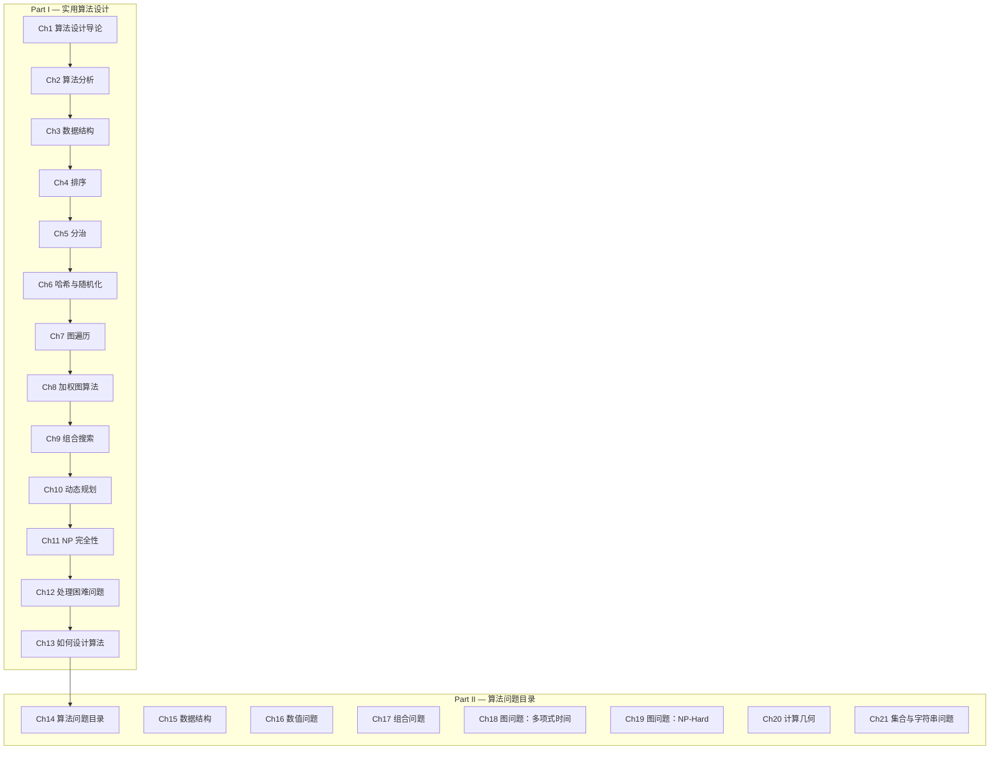

# 算法设计手册

> **The Algorithm Design Manual, 3rd Edition**
>
> Steven S. Skiena, 2020, Springer

---

## 章节路线图

---

## 目录

### Part I — 实用算法设计

| # | 章节 | 链接 |
|---|------|------|
| 1 | 算法设计导论 | [→ 阅读](part1/ch01.md) |
| 2 | 算法分析 | [→ 阅读](part1/ch02.md) |
| 3 | 数据结构 | [→ 阅读](part1/ch03.md) |
| 4 | 排序 | [→ 阅读](part1/ch04.md) |
| 5 | 分治 | [→ 阅读](part1/ch05.md) |
| 6 | 哈希与随机化算法 | [→ 阅读](part1/ch06.md) |
| 7 | 图遍历 | [→ 阅读](part1/ch07.md) |
| 8 | 加权图算法 | [→ 阅读](part1/ch08.md) |
| 9 | 组合搜索 | [→ 阅读](part1/ch09.md) |
| 10 | 动态规划 | [→ 阅读](part1/ch10.md) |
| 11 | NP 完全性 | [→ 阅读](part1/ch11.md) |
| 12 | 处理困难问题 | [→ 阅读](part1/ch12.md) |
| 13 | 如何设计算法 | [→ 阅读](part1/ch13.md) |

### Part II — 算法问题目录

| # | 章节 | 链接 |
|---|------|------|
| 14 | 算法问题目录 | [→ 阅读](part2/ch14.md) |
| 15 | 数据结构 | [→ 阅读](part2/ch15.md) |
| 16 | 数值问题 | [→ 阅读](part2/ch16.md) |
| 17 | 组合问题 | [→ 阅读](part2/ch17.md) |
| 18 | 图问题：多项式时间 | [→ 阅读](part2/ch18.md) |
| 19 | 图问题：NP-Hard | [→ 阅读](part2/ch19.md) |
| 20 | 计算几何 | [→ 阅读](part2/ch20.md) |
| 21 | 集合与字符串问题 | [→ 阅读](part2/ch21.md) |
