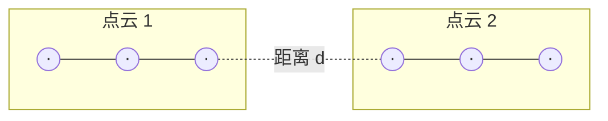
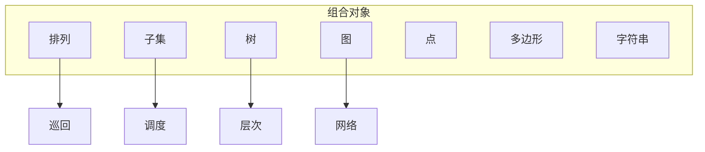

# 第1章 算法设计导论

[目录](../index.md) | [下一章 →](./ch02.md)

---

本章介绍算法设计的基本思想，通过几个经典问题展示如何思考、建模和验证算法。

## 1.1 Robot Tour Optimization（机器人巡回优化）

假设有一个机器人需要访问平面上 $n$ 个点，要求找出一条最短的闭合路径，使机器人访问每个点恰好一次。这就是著名的**旅行商问题**（Traveling Salesman Problem, TSP）。

::: info 问题定义
给定 $n$ 个点的坐标，求访问所有点恰好一次并返回起点的最短路径。
:::

### 最近邻启发式（Nearest Neighbor Heuristic）

一个直观的贪心策略是：从任意起点出发，每次选择**尚未访问且距离当前点最近**的点作为下一个访问点，直到访问完所有点后返回起点。

```c
// 伪代码：最近邻启发式
NearestNeighbor(P)
    pick and remove an arbitrary point p from P
    path = [p]
    while P is not empty:
        p = point in P closest to path.last
        remove p from P
        append p to path
    connect path.last to path.first
    return path
```

::: warning 启发式不保证最优
最近邻启发式在多数情况下能得到不错的结果，但**不能保证得到最优解**。存在简单的反例，使最近邻得到的路径明显长于最优路径。
:::

### 反例构造

考虑如下布局：两个紧密聚集的点云，中间相隔较大距离 $d$。最近邻可能在一个点云内来回穿梭，而最优解会先完整访问一个点云，再跨越 $d$ 访问另一个点云。



::: tip 寻找反例的技巧
- **从小规模入手**：反例通常只需 6 个点或更少
- **寻找极端**：混合大小、远近、左右等极端情况
- **针对弱点**：若算法是「总是选最大的」，思考为何这可能出错
:::

## 1.2 Selecting the Right Jobs（选择正确的任务）

**电影明星调度问题**：给定 $n$ 个电影档期区间（每个区间有开始和结束时间），选择尽可能多的互不重叠的档期。

::: info 问题
输入：区间集合 $S = \{I_1, I_2, \ldots, I_n\}$  
输出：$S$ 中互不重叠区间的最大子集
:::

### 贪心策略的正确与错误

**策略 A：按结束时间升序选择**

每次选择**结束时间最早**且与已选区间不重叠的区间。该策略是**正确的**，可得到最优解。

**策略 B：按开始时间升序选择**

每次选择**开始时间最早**的区间。该策略是**错误的**，存在反例。

**策略 C：按重叠数最少选择**

每次选择**与其它区间重叠数量最少**的区间，移除与其重叠的区间后重复。该策略也是**错误的**。

```mermaid
gantt
    title 电影调度反例（策略 C）
    dateFormat X
    axisFormat %s
    section 最优解（4 个区间）
    红1 :a1, 0, 2
    红2 :a2, 3, 5
    红3 :a3, 6, 8
    红4 :a4, 9, 11
    section 粉区间（重叠最少）
    粉 :crit, 4, 7
```



上图中，最优解包含四个红色区间，但粉色区间与最少其它区间重叠，若先选它，则只能得到 3 个区间。

### 穷举调度算法

```c
ExhaustiveScheduling(I)
    测试 I 中所有 2^n 个子集
    返回由互不重叠区间组成的最大子集
```

::: tip 算法表达
算法的核心是**思想**。若用过于底层的记号描述算法而无法清晰展现思想，则说明描述方式不当。
:::

## 1.3 Reasoning About Correctness（正确性推理）

### 问题规约

将新问题规约到已知正确算法解决的问题，是证明正确性的有效方法。

### 反例构造（Demonstrating Incorrectness）

证明算法**不正确**的最佳方式是构造一个实例，使算法在该实例上产生错误答案。这样的实例称为**反例**（counterexample）。

好的反例具有两个性质：

1. **可验证性**：能计算算法在该实例上的输出，并能展示更优的答案
2. **简洁性**：去掉所有不必要的细节，清晰展示算法失败的原因

### 寻找反例的技巧

| 技巧 | 说明 |
|------|------|
| 从小规模思考 | 算法失败时通常存在非常简单的反例（如 6 个点、3 个区间） |
| 穷举思考 | 对第一个非平凡 $n$，可能实例通常很少，可系统构造 |
| 针对弱点 | 若算法是「总是选最大的」贪心，思考为何这可能错误 |
| 制造平局 | 提供所有选项大小相同的实例，使启发式无法决策 |
| 寻找极端 | 混合巨大与微小、左与右、近与远等极端情况 |

::: warning 重要结论
**寻找反例是证伪启发式正确性的最佳方法。**
:::

## 1.4 Induction and Recursion（归纳与递归）

找不到反例**并不意味着**算法显然正确，仍需**正确性证明**。**数学归纳法**是常用方法。

### 归纳与递归的对应关系

递归本质上是数学归纳法的程序实现：

- **归纳**：证明 $n=1$ 成立，假设 $n-1$ 成立，证明 $n$ 成立
- **递归**：处理基准情况（如 $n=1$），将大问题分解为小问题并递归求解

两者都有**基准条件**和**一般条件**，基准条件终止递归。

### 插入排序的正确性（归纳证明）

- **基准情况**：单元素数组已有序
- **归纳假设**：前 $n-1$ 个元素经 $n-1$ 轮插入排序后已有序
- **归纳步骤**：将第 $n$ 个元素 $x$ 插入到正确位置——在「小于等于 $x$ 的最大元素」与「大于 $x$ 的最小元素」之间，通过后移更大元素腾出空间

::: warning 归纳证明的陷阱
1. **边界错误**：如插入最小/最大元素时的特殊情况
2. **草率扩展**：添加一个元素可能使整个最优解完全改变（见调度问题图 1.8）
:::

### 递归自增算法示例

```c
Increment(y)
    if (y == 0) return 1
    else if (y mod 2 == 1)
        return 2 * Increment(floor(y/2))
    else return y + 1
```

该算法的正确性可通过**强归纳法**证明：假设对所有 $y \leq n-1$ 成立，证明对 $y=n$ 成立。对奇数 $y=2m+1$：

$$
2 \cdot \text{Increment}(m) = 2(m+1) = 2m+2 = y+1
$$

## 1.5 Modeling the Problem（问题建模）

建模是将应用问题转化为精确定义、已被充分研究的问题形式的艺术。正确的建模是应用算法设计技术的关键。

### 组合对象（Combinatorial Objects）

大多数算法针对以下抽象结构设计，将实际问题抽象为这些结构有助于利用已有算法：

| 结构 | 描述 | 适用场景 |
|------|------|----------|
| **排列**（Permutations） | 元素的顺序安排 | 巡回、排序、序列 |
| **子集**（Subsets） | 从集合中的选择 | 聚类、委员会、包装 |
| **树**（Trees） | 层次关系 | 层次、支配关系、分类 |
| **图**（Graphs） | 任意对象对之间的关系 | 网络、电路、关系 |
| **点**（Points） | 几何空间中的位置 | 站点、位置、数据记录 |
| **多边形**（Polygons） | 几何区域 | 形状、区域、边界 |
| **字符串**（Strings） | 字符序列 | 文本、模式、标签 |



### 递归对象

许多结构可以递归分解：

- **排列**：删除首元素得到 $n-1$ 的排列（需重新编号）
- **子集**：删除元素 $n$ 得到 $n-1$ 的子集
- **树**：删除根得到若干子树；删除叶得到更小的树
- **图**：删除顶点得到更小的图
- **字符串**：删除首字符得到更短的字符串

递归描述需要**分解规则**和**基准情况**（最小、最简单的对象）。

::: tip 建模的重要性
**将应用建模为良定义的结构和算法，是求解过程中最重要的一步。**
:::

## 1.6 Proof by Contradiction（反证法）

反证法的基本步骤：

1. 假设待证命题为假
2. 推导该假设的逻辑推论
3. 证明某推论明显为假，从而原假设不成立，命题为真

### 经典例子：素数无穷多

假设素数只有有限个 $m$，记为 $p_1, p_2, \ldots, p_m$。令

$$
N = \prod_{i=1}^{m} p_i
$$

则 $N$ 可被每个已知素数整除。考虑 $N+1$：它不能被 $p_1=2$ 整除（因 $N$ 可被 2 整除），同理不能被任何 $p_i$ 整除。故 $N+1$ 无真因子，应为素数。但 $N+1$ 不在 $p_1,\ldots,p_m$ 中，矛盾。因此素数有无穷多个。

::: info 反证法的要求
最终推出的矛盾必须**明显、荒谬**。模糊的结果不足以令人信服。
:::

## 1.7 About the War Stories（关于实战故事）

学习算法设计对性能的巨大影响，最佳方式是研究真实案例。本书穿插了多个**算法实战故事**，展示从原始问题到解决方案的完整过程。

每个故事都是真实的，且通常涉及第二部分的**问题目录**中的问题，强调将应用建模为标准算法问题的重要性。

## 1.8 War Story: Psychic Modeling（实战故事：通灵建模）

某彩票系统公司来电：他们的产品能「提升客户预测中奖号码的通灵能力」。客户可「看到」15 个数字，并确信其中至少 4 个会出现在中奖号码中。每张彩票选 6 个数字，若至少猜中 3 个则有奖。需求：**用最少的彩票覆盖所有可能中奖组合**。

### 问题建模

这是一个**集合覆盖**（Set Cover）问题的特例，由四个参数完全确定：

- $n$：候选集大小（约 15）
- $k$：每张彩票的号码数（约 6）
- $j$：通灵承诺的正确数（如 4）
- $l$：中奖所需匹配数（如 3）

该问题是 **NP 完全**的，精确求解计算困难，但可用启发式得到近似解。

### 解决方案框架

1. **生成子集**：生成从候选集中选 $k$ 个数的所有子集
2. **覆盖准则**：选择少量彩票，覆盖所有可能中奖的 $l$-子集
3. **覆盖追踪**：用位向量记录已覆盖组合，$O(1)$ 查询
4. **搜索机制**：小规模穷举；大规模用模拟退火等随机搜索

### 教训

最初的模型**覆盖了过多组合**。实际上不需要显式覆盖所有可能中奖组合——某些未显式出现的对，在扩展后必然落在某张彩票覆盖的范围内。修正覆盖判定后，得到了客户期望的结果。

::: warning 建模教训
**在编程前务必正确建模问题。** 用小例子手工验证并与需求方确认，可避免重大误解。
:::

## 1.9 Estimation and Guessing（估计与猜测）

当不知道正确答案时，**有原则的猜测**（即估计）是最佳策略。对运行时间等量进行数量级估计是算法设计中的宝贵技能。

### 估计方法

1. **有原则的计算**：用已知量、可查量或有把握猜测的量表示答案
2. **类比**：参考过去类似经验

### 估计示例：罐中硬币数

估计一大罐玻璃罐中的硬币数量：

- **体积法**：罐为圆柱体，直径约 5 英寸，硬币堆叠约 10 枚高。$10 \times (\pi \times 2.5^2) \approx 1963$
- **重量法**：罐重如保龄球（约 10 磅），每磅约 181 枚硬币，得约 1810 枚
- **类比法**：硬币高度约 8 英寸，约为两卷硬币高，估计约 1000 枚

::: tip 估计最佳实践
用多种方法求解并比较结果。若不同方法得到的数量级一致（如都在 2 倍以内），则对答案更有信心。**推理过程比具体数字更重要。**
:::

---

## 扩展阅读

- 电影调度问题是**区间图**（interval graph）上的**独立集**问题的特例
- 穷举调度测试所有 $2^n$ 个子集，复杂度为 $O(2^n)$，仅适用于小规模
- 正确贪心策略（按结束时间排序）的复杂度为 $O(n \log n)$
- 彩票覆盖问题可规约到 **集合覆盖**（Set Cover），属于 NP 完全问题
- 算法正确性形式化证明可参考 Gries 的《The Science of Programming》

## 思考与练习

1. 为电影调度的「按重叠数最少选择」策略构造一个更简单的反例（如 3 个区间）
2. 用归纳法证明 $\sum_{i=1}^{n} i = n(n+1)/2$
3. 估计你所在城市有多少个红绿灯（使用体积法、类比法等多种方法）

## 本章要点

- 启发式算法不保证最优，需用反例验证
- 数学归纳法是证明递归/增量算法正确性的常用方法
- 将问题建模为排列、子集、树、图等标准结构至关重要
- 反证法适用于存在性、唯一性等命题
- 估计能力是算法设计的重要辅助技能

[目录](../index.md) | [下一章 →](./ch02.md)
