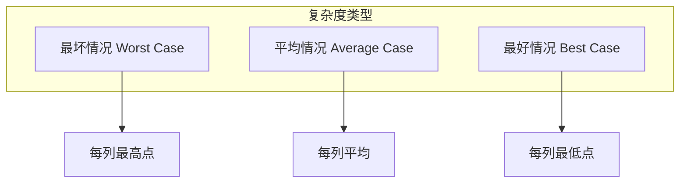
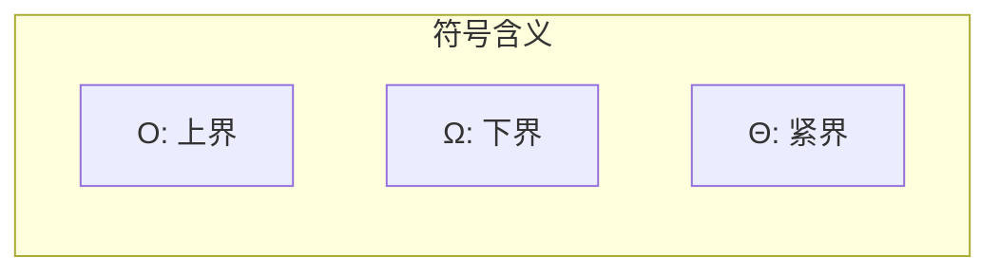
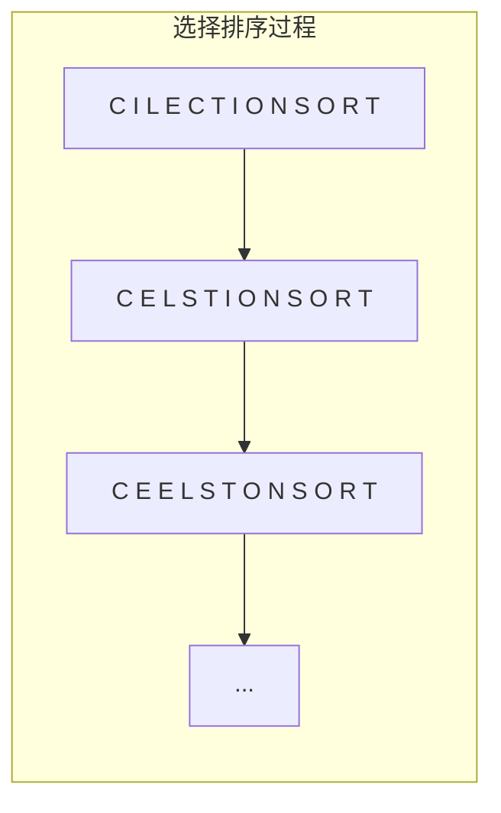
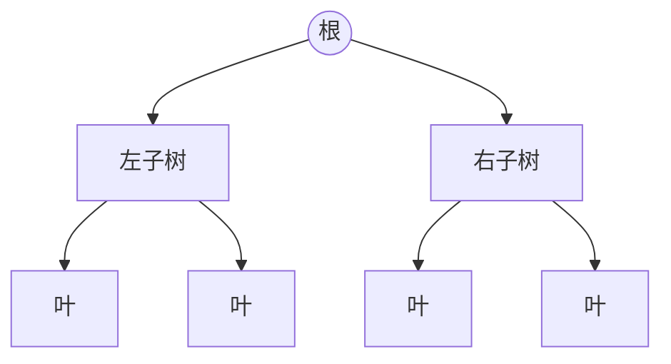

# 第2章 算法分析

[← 上一章](./ch01.md) | [目录](../index.md) | [下一章 →](./ch03.md)

---

算法是计算机科学中最重要、最持久的部分，因为它们可以**与语言和机器无关**地研究。我们需要在不实现算法的前提下比较其效率。两个最重要的工具是：(1) **RAM 计算模型**；(2) **计算复杂度的渐近分析**。

**大O符号**（Big-Oh notation）对比较算法和设计更好的算法至关重要，是本书数学要求最高的部分之一。但一旦理解其背后的直觉，处理起来会容易得多。

## 2.1 The RAM Model of Computation（RAM 计算模型）

与机器无关的算法设计依赖于一个假想的计算机——**随机存取机**（Random Access Machine, RAM）。在该模型下：

::: info RAM 模型假设
- **简单操作**（`+`, `*`, `-`, `=`, `if`, `call`）各耗时一个时间步
- **循环和子程序**不是简单操作，而是多个单步操作的组合
- **每次内存访问**耗时一个时间步，且内存无限
- 不区分缓存与磁盘，所有访问代价相同
:::

在 RAM 模型下，我们通过**统计算法在给定实例上执行的步数**来度量运行时间。若假设 RAM 每秒执行固定步数，则步数自然转换为实际运行时间。

::: tip 模型的实用性
尽管 RAM 模型简化了现实（如乘法比加法慢、内存层次结构等），但它**在实践中非常有用**，能很好地预测算法在真实计算机上的表现。就像「地球是平的」在盖房子时足够准确一样。
:::

### 2.1.1 最好、最坏与平均情况复杂度

对排序问题，所有可能的输入包括每种 $n$ 个键的排列。可将每个输入实例表示为图中的点：$x$ 轴为问题规模，$y$ 轴为该实例下的步数。



| 类型 | 定义 |
|------|------|
| **最坏情况** | 规模 $n$ 下所有实例中步数的最大值 |
| **最好情况** | 规模 $n$ 下所有实例中步数的最小值 |
| **平均情况** | 规模 $n$ 下所有实例的步数平均值 |

::: warning 为何关注最坏情况
实践中**最坏情况**最有用。最好情况（如赌场赢钱）极不可能；平均情况难以定义且易引发争议。最坏情况易于计算且更可能发生。
:::

## 2.2 The Big Oh Notation（大O符号）

精确分析时间复杂度函数很困难，因为：

1. **波动过多**：如二分查找在 $n=2^k-1$ 时略快
2. **细节过多**：精确计数需要完整程序级别的细节

**大O符号**通过忽略不影响算法比较的细节来简化分析。

### 形式化定义

- **$f(n) = O(g(n))$**：$c \cdot g(n)$ 是 $f(n)$ 的**上界**。存在常数 $c$ 和 $n_0$，使得对所有 $n \geq n_0$ 有 $f(n) \leq c \cdot g(n)$。

- **$f(n) = \Omega(g(n))$**：$c \cdot g(n)$ 是 $f(n)$ 的**下界**。存在常数 $c > 0$ 和 $n_0$，使得对所有 $n \geq n_0$ 有 $f(n) \geq c \cdot g(n)$。

- **$f(n) = \Theta(g(n))$**：$g(n)$ 同时是 $f(n)$ 的紧上界和紧下界。存在 $c_1, c_2 > 0$ 和 $n_0$，使得对所有 $n \geq n_0$ 有 $c_1 \cdot g(n) \leq f(n) \leq c_2 \cdot g(n)$。



### 示例

设 $f(n) = 3n^2 - 100n + 6$：

- $f(n) = O(n^2)$：取 $c=3$ 即可
- $f(n) = O(n^3)$：取 $c=1$，当 $n>3$ 时 $n^3 > f(n)$
- $f(n) \neq O(n)$：对任意 $c$，当 $n$ 足够大时 $cn < f(n)$
- $f(n) = \Omega(n^2)$：取 $c=2$，当 $n>100$ 时 $2n^2 < f(n)$
- $f(n) = \Theta(n^2)$：$O$ 和 $\Omega$ 同时成立

::: tip 大O的直觉
大O忽略**乘法常数**。$f(n)=2n$ 与 $g(n)=n$ 在大O意义下相同——若同一算法用 C 写比用 Java 快两倍，这反映的是实现而非算法本身。
:::

## 2.3 Growth Rates and Dominance Relations（增长率与支配关系）

大O分析中，$f(n)=0.001n^2$ 与 $g(n)=1000n^2$ 被同等对待。这是因为**增长率**才是关键。

### 常见函数的运行时间（每步 1 纳秒）

| n | $\lg n$ | $n$ | $n \lg n$ | $n^2$ | $2^n$ | $n!$ |
|---|---------|-----|-----------|-------|-------|------|
| 10 | 0.003 μs | 0.01 μs | 0.033 μs | 0.1 μs | 1 μs | 3.63 ms |
| 100 | 0.007 μs | 0.1 μs | 0.64 μs | 10 μs | $4 \times 10^{13}$ 年 | — |
| 1,000,000 | 0.02 μs | 1 ms | 19.93 ms | 16.7 min | — | — |

**结论**：

- $n!$ 在 $n \geq 20$ 时即不可用
- $2^n$ 在 $n > 40$ 时不可行
- $n^2$ 在 $n \approx 10^6$ 时开始困难
- $O(n)$ 和 $O(n \lg n)$ 可处理十亿级数据
- $O(\lg n)$ 对任何可想象的 $n$ 都轻松

### 支配关系（Dominance Relations）

若 $f(n) = O(g(n))$ 且 $f(n) \neq \Theta(g(n))$，则称 $g$ **支配** $f$，记为 $g \succ f$。

常见函数类的支配顺序（从慢到快）：

$$
1 \prec \log n \prec n \prec n \log n \prec n^2 \prec n^3 \prec 2^n \prec n!
$$

| 类型 | 示例 | 典型算法 |
|------|------|----------|
| 常数 | $f(n)=1$ | 加法、简单输出 |
| 对数 | $f(n)=\log n$ | 二分查找 |
| 线性 | $f(n)=n$ | 线性扫描、求最大/最小 |
| 超线性 | $f(n)=n \lg n$ | 快速排序、归并排序 |
| 平方 | $f(n)=n^2$ | 插入排序、选择排序 |
| 立方 | $f(n)=n^3$ | 某些动态规划 |
| 指数 | $f(n)=c^n$ | 枚举子集 |
| 阶乘 | $f(n)=n!$ | 枚举排列 |

## 2.4 Working with the Big Oh（大O的运算规则）

### 加法规则

两函数之和由**支配者**决定：

$$
f(n) + g(n) = \Theta(\max(f(n), g(n)))
$$

例如：$n^3 + n^2 + n + 1 = \Theta(n^3)$。

### 乘法规则

常数乘法不影响渐近行为：

$$
O(c \cdot f(n)) = O(f(n)), \quad c > 0
$$

两函数相乘：

$$
O(f(n)) \cdot O(g(n)) = O(f(n) \cdot g(n))
$$

### 传递性

若 $f(n) = O(g(n))$ 且 $g(n) = O(h(n))$，则 $f(n) = O(h(n))$。

## 2.5 Reasoning About Efficiency（效率分析）

### 2.5.1 选择排序（Selection Sort）

选择排序反复找出未排序部分的最小元素，放到已排序部分末尾。

```c
void selection_sort(item_type s[], int n) {
    int i, j, min;
    for (i = 0; i < n; i++) {
        min = i;
        for (j = i + 1; j < n; j++) {
            if (s[j] < s[min]) min = j;
        }
        swap(&s[i], &s[min]);
    }
}
```

**分析**：外层循环 $n$ 次，内层循环 $n-i-1$ 次。比较次数为：

$$
T(n) = \sum_{i=0}^{n-1} \sum_{j=i+1}^{n-1} 1 = \sum_{i=0}^{n-1} (n-i-1) = (n-1)+(n-2)+\cdots+1 = \frac{n(n-1)}{2}
$$

故 $T(n) = \Theta(n^2)$。选择排序在所有 $n!$ 种输入上耗时相同。



### 2.5.2 插入排序（Insertion Sort）

```c
for (i = 1; i < n; i++) {
    j = i;
    while ((j > 0) && (s[j] < s[j-1])) {
        swap(&s[j], &s[j-1]);
        j = j - 1;
    }
}
```

**最坏情况分析**：内层循环最多执行 $i$ 次（可放宽为 $n$ 次），外层 $n$ 次，故 $O(n^2)$。

**$\Theta$ 证明**：最坏情况是**逆序**输入。后 $n/2$ 个元素各需滑动至少 $n/2$ 位，故 $\Omega(n^2)$。

### 2.5.3 字符串模式匹配

**问题**：在文本 $t$ 中查找模式 $p$ 是否出现。

朴素算法：对 $t$ 的每个可能起始位置，尝试匹配 $p$。

```c
int findmatch(char *p, char *t) {
    int i, j, plen = strlen(p), tlen = strlen(t);
    for (i = 0; i <= tlen - plen; i++) {
        j = 0;
        while ((j < plen) && (t[i+j] == p[j])) j++;
        if (j == plen) return i;
    }
    return -1;
}
```

**分析**：外层最多 $n-m+1$ 次，内层最多 $m$ 次，故 $O((n-m)(m+2))$。简化后为 $O(nm)$。

**$\Theta$ 证明**：令 $t=\texttt{"aaa...aaa"}$（$n$ 个 a），$p=\texttt{"aaa...aab"}$（$m-1$ 个 a 加 b）。每次匹配都成功 $m-1$ 个字符后失败，共 $(n-m+1) \cdot m = \Omega(nm)$ 次比较。

### 2.5.4 矩阵乘法

```c
for (i = 1; i <= a->rows; i++)
    for (j = 1; j <= b->columns; j++) {
        c->m[i][j] = 0;
        for (k = 1; k <= b->rows; k++)
            c->m[i][j] += a->m[i][k] * b->m[k][j];
    }
```

乘法次数：$M(x,y,z) = xyz$。当 $x=y=z=n$ 时，$T(n) = \Theta(n^3)$。

## 2.6 Summation Formulae（求和公式）

### 算术级数

$$
\sum_{i=1}^{n} 1 = n, \quad \sum_{i=1}^{n} i = \frac{n(n+1)}{2}
$$

一般地，对 $p \geq 0$：

$$
\sum_{i=1}^{n} i^p = \Theta(n^{p+1})
$$

### 几何级数

$$
G(n,a) = \sum_{i=0}^{n} a^i = \frac{a^{n+1}-1}{a-1}
$$

- 当 $|a| < 1$ 时，$G(n,a)$ 随 $n \to \infty$ 收敛到常数
- 当 $a > 1$ 时，$G(n,a) = \Theta(a^{n+1})$

### 调和级数

$$
H(n) = \sum_{i=1}^{n} \frac{1}{i} = \Theta(\log n)
$$

调和数常解释「对数从哪来」——如快速排序平均情况分析中的 $\sum_{i=1}^{n} \frac{n}{i}$。

## 2.7 Logarithms and Their Applications（对数及其应用）

对数是指数的逆：$b^x = y \Leftrightarrow x = \log_b y$。

### 2.7.1 对数与二分查找

二分查找是 $O(\log n)$ 算法。每次比较排除一半元素，$n$ 个元素最多 $\log_2 n$ 次比较。百万个名字的电话簿只需约 20 次比较！

### 2.7.2 对数与树

高度为 $h$ 的二叉树最多 $2^h$ 个叶节点。故 $n$ 个叶节点的树高度 $h = \log_2 n$。

推广到 $d$ 叉树：$n = d^h \Rightarrow h = \log_d n$。



### 2.7.3 对数与比特数

表示 $n$ 种不同可能需要的比特数：$w$ 比特可表示 $2^w$ 种模式，故 $w \geq \log_2 n$。

### 2.7.4 对数与乘法

$\log_a(xy) = \log_a x + \log_a y$，故 $\log_a n^b = b \log_a n$。

计算 $a^b$：$a^b = \exp(b \ln a)$。

### 2.7.5 快速幂

计算 $a^n$：若 $n$ 为偶，$a^n = (a^{n/2})^2$；若 $n$ 为奇，$a^n = a \cdot (a^{\lfloor n/2 \rfloor})^2$。每次指数减半，共 $O(\lg n)$ 次乘法。

```c
function power(a, n)
    if (n == 0) return 1
    x = power(a, floor(n/2))
    if (n is even) return x * x
    else return a * x * x
```

::: tip 对数何时出现
**每当事物被反复减半或加倍时，对数就会出现。**
:::

## 2.8 Properties of Logarithms（对数性质）

### 常用底数

| 底数 | 符号 | 用途 |
|------|------|------|
| $b=2$ | $\lg x$ | 二分、树节点数 |
| $b=e$ | $\ln x$ | 自然对数，$\exp(\ln x)=x$ |
| $b=10$ | $\log x$ | 常用对数，历史上用于计算尺 |

### 换底公式

$$
\log_a b = \frac{\log_c b}{\log_c a}
$$

### 算法分析中的含义

1. **底数影响小**：$\log_2 10^6 \approx 20$，$\log_{100} 10^6 = 3$，大O中底数被吸收
2. **对数压缩**：$\log n^b = b \log n$，任何多项式的对数都是 $O(\lg n)$

## 2.9 War Story: Mystery of the Pyramids（实战故事：金字塔之谜）

（本章实战故事，涉及算法分析在实际项目中的应用。）

## 2.10 Advanced Analysis（进阶分析）

更复杂的递归、主定理、摊还分析等内容将在后续章节或高级主题中讨论。

---

## 本章要点

- RAM 模型假设简单操作 $O(1)$，内存无限
- 大O/大Ω/大Θ 分别表示上界、下界、紧界
- 增长率：$1 \prec \log n \prec n \prec n \log n \prec n^2 \prec 2^n \prec n!$
- 加法取最大，乘法保持；常数可忽略
- 选择排序、插入排序、朴素字符串匹配、矩阵乘法均为 $O(n^2)$ 或 $O(n^3)$
- 对数在二分、树高、比特数、快速幂中反复出现

[← 上一章](./ch01.md) | [目录](../index.md) | [下一章 →](./ch03.md)
