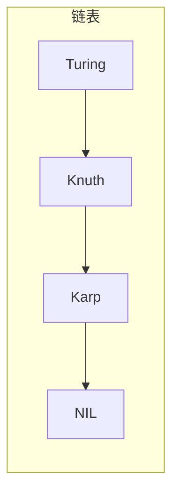
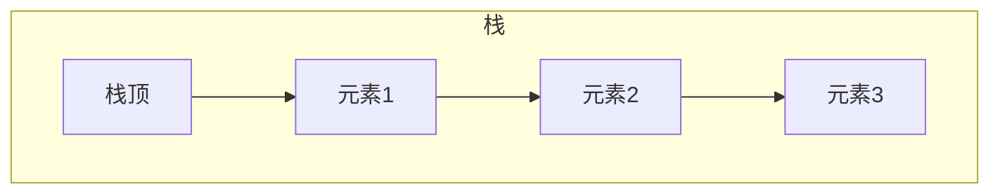
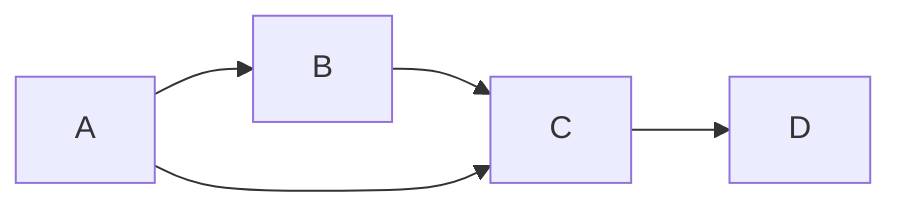
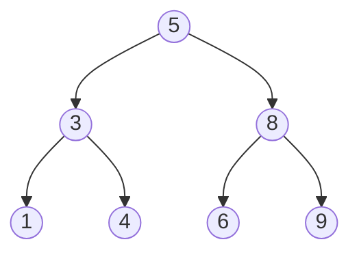
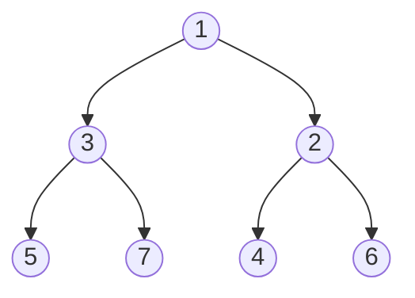
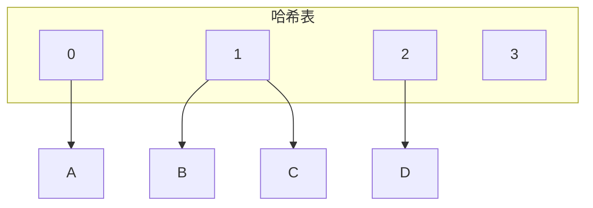
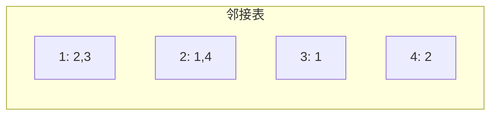

# 第3章 数据结构

[← 上一章](./ch02.md) | [目录](../index.md) | [下一章 →](./ch04.md)

---

本章介绍三种基本抽象数据类型（**容器**、**字典**、**优先队列**），以及如何用数组和链表实现它们。更复杂的实现（如平衡树、哈希表）的权衡将在相关目录条目中详细讨论。

## 3.1 Contiguous vs. Linked Data Structures（连续存储 vs 链式存储）

数据结构可根据基于**数组**还是**指针**分为两类：

| 类型 | 存储方式 | 典型结构 |
|------|----------|----------|
| **连续存储**（Contiguous） | 单块连续内存 | 数组、矩阵、堆、哈希表 |
| **链式存储**（Linked） | 由指针连接的独立内存块 | 链表、树、图邻接表 |

### 3.1.1 数组（Arrays）

数组是基本的连续分配数据结构。每个元素可通过**索引**（等价于地址）高效定位。

::: info 类比
数组像一条街上的房子，每个元素是一栋房子，索引是门牌号。若房子大小相同且从 1 到 $n$ 连续编号，则可立即从地址算出每栋房子的位置。
:::

**数组的优点**：

- **按索引 $O(1)$ 访问**：索引直接映射到内存地址
- **空间高效**：纯数据，无指针等额外开销
- **内存局部性好**：顺序访问利于利用高速缓存

**数组的缺点**：不能在运行时调整大小。可预先分配超大数组，但会浪费空间。

### 动态数组（Dynamic Arrays）

从大小为 1 的数组开始，每当空间不足时**加倍**（$m \to 2m$）。每次扩展时分配新数组、复制旧内容、释放旧数组。

**摊还分析**：达到 $n$ 个元素需要 $\lg n$ 次加倍。复制操作总量：

$$
M = n + \sum_{i=1}^{\lg n} 2^{i-1} \leq n + n \sum_{i=0}^{\infty} \frac{1}{2^i} = 2n
$$

每个元素平均只移动约 2 次，总管理开销为 $O(n)$！

::: tip 摊还保证
动态数组失去的是**每次插入最坏 $O(1)$** 的保证，但获得**前 $n$ 次插入总时间 $O(n)$** 的摊还保证。
:::

### 3.1.2 指针与链式结构（Pointers and Linked Structures）

指针将链式结构的各个部分连接起来。链表是最简单的链式结构：

```c
typedef struct list {
    item_type item;    /* 数据项 */
    struct list *next; /* 指向后继 */
} list;
```



**链式结构的共性**：

- 每个节点包含**数据域**和**指针域**
- 需要指向**头节点**的指针以便访问
- 大量空间用于存储指针

**链表基本操作**：查找、插入、删除。**双向链表**每个节点同时指向前驱和后继，简化某些操作但增加一个指针域。

### 链表操作实现

**查找**：

```c
list *search_list(list *l, item_type x) {
    if (l == NULL) return NULL;
    if (l->item == x) return l;
    return search_list(l->next, x);
}
```

**插入**（在头部插入，$O(1)$）：

```c
void insert_list(list **l, item_type x) {
    list *p = malloc(sizeof(list));
    p->item = x;
    p->next = *l;
    *l = p;
}
```

**删除**：需找到待删节点的前驱，修改其 `next` 指针，并 `free` 被删节点。删除首元素时需特殊处理头指针。

### 3.1.3 比较

| 方面 | 数组 | 链表 |
|------|------|------|
| 溢出 | 固定大小易溢出 | 除非内存满否则不溢出 |
| 插入/删除 | 需移动元素 | 仅改指针 |
| 随机访问 | $O(1)$ | $O(n)$ |
| 空间 | 纯数据，高效 | 需额外指针空间 |
| 缓存 | 局部性好 | 指针跳跃，局部性差 |

::: tip 递归视角
- **链表**：去掉首元素得到更短的链表
- **数组**：前 $k$ 个元素与后 $n-k$ 个元素构成两个更小的数组

这启发了分治算法（如快速排序、二分查找）。
:::

## 3.2 Containers: Stacks and Queues（容器：栈与队列）

**容器**（Container）是按**存储和检索顺序**区分的抽象数据类型，与**字典**（按内容/键检索）不同。

### 栈（Stacks）

**后进先出**（LIFO, Last-In-First-Out）。

- `Push(x, s)`：将 $x$ 压入栈顶
- `Pop(s)`：弹出并返回栈顶元素



LIFO 出现在递归执行、地铁下车、冰箱取物等场景。栈实现简单高效，当检索顺序无关紧要时（如批处理）是首选。

### 队列（Queues）

**先进先出**（FIFO, First-In-First-Out）。

- `Enqueue(x, q)`：将 $x$ 加入队尾
- `Dequeue(q)`：从队首取出并移除元素

FIFO 是控制等待时间最公平的方式，可最小化最大等待时间。队列实现比栈稍复杂，适用于顺序重要的场景（如图的**广度优先搜索** BFS）。

栈和队列都可用数组或链表实现，关键问题是**是否预先知道大小上界**。

## 3.3 Dictionaries（字典）

**字典**（Dictionary）是按**内容/键**访问数据的抽象数据类型。主要操作：

| 操作 | 说明 |
|------|------|
| `Search(D, k)` | 按键 $k$ 查找，返回指向元素的指针 |
| `Insert(D, x)` | 插入元素 $x$ |
| `Delete(D, x)` | 删除元素 $x$ |

某些实现还支持：

- `Max(D)` / `Min(D)`：最大/最小键
- `Predecessor(D, x)` / `Successor(D, x)`：前驱/后继（有序遍历）

### 字典实现比较

| 实现 | Search | Insert | Delete | Min/Max | Pred/Succ |
|------|--------|--------|--------|---------|-----------|
| 无序数组 | $O(n)$ | $O(1)$ | $O(n)$ | $O(n)$ | $O(n)$ |
| 有序数组 | $O(\log n)$ | $O(n)$ | $O(n)$ | $O(1)$ | $O(1)$ |
| 无序链表 | $O(n)$ | $O(1)$ | $O(n)$ | $O(n)$ | $O(n)$ |
| 有序链表 | $O(n)$ | $O(n)$ | $O(n)$ | $O(1)$ | $O(1)$ |
| 哈希表 | $O(1)$ 期望 | $O(1)$ 期望 | $O(1)$ 期望 | $O(n)$ | $O(n)$ |
| 二叉搜索树 | $O(h)$ | $O(h)$ | $O(h)$ | $O(h)$ | $O(h)$ |

### 链表删除技巧

若已有指向待删节点 $x$ 的指针，且不需要保持链表顺序，可将 $x$ 的**后继内容**复制到 $x$，然后删除后继。这样无需遍历找前驱。



## 3.4 Binary Search Trees（二叉搜索树）

**二叉搜索树**（BST）满足：对每个节点，左子树所有键 $<$ 根键 $<$ 右子树所有键。



三个节点的 BST 有 5 种不同形态（Catalan 数）。**左**和**右**在根树中有区别。

### BST 操作

**查找**：与根比较，小则左走，大则右走，相等则找到。

**插入**：沿查找路径直到空位，插入新节点。

**删除**：分三种情况：
1. 叶节点：直接删除
2. 单子节点：用子节点替代
3. 双子节点：用**后继**（右子树最小）或**前驱**（左子树最大）替代，再递归删除该后继/前驱

### BST 遍历

- **中序**（Inorder）：左-根-右，得到**有序序列**
- **前序**（Preorder）：根-左-右
- **后序**（Postorder）：左-右-根

### BST 的性能

随机插入的 BST 平均高度为 $O(\log n)$，但**最坏**可退化为 $O(n)$（如按序插入）。**平衡 BST**（如 AVL、红黑树）保证高度 $O(\log n)$，从而所有操作 $O(\log n)$。

## 3.5 Priority Queues（优先队列）

**优先队列**支持：

- `Insert(x)`：插入元素 $x$
- `FindMin()`：返回最小元素
- `DeleteMin()`：删除并返回最小元素

### 堆（Heap）实现

**二叉堆**（Binary Heap）是完全二叉树，满足**堆性质**：父节点 $\leq$ 子节点（小顶堆）。



**数组表示**：节点 $i$ 的左子为 $2i$，右子为 $2i+1$，父为 $\lfloor i/2 \rfloor$。

**插入**：放到末尾，然后**上浮**（与父比较交换直到满足堆性质）。$O(\log n)$。

**DeleteMin**：用末尾元素替换根，然后**下沉**（与较小子交换直到满足堆性质）。$O(\log n)$。

### 堆排序（Heapsort）

1. 将数组构建为堆：$O(n)$（自底向上）
2. 反复 `DeleteMin`，依次得到最小、次小、……：$n$ 次，每次 $O(\log n)$

总时间 $O(n \log n)$，**原地**排序。

## 3.6 War Story: Stripping Characters（实战故事：字符剥离）

（本章实战故事，涉及字符串处理与数据结构选择。）

## 3.7 Hashing（哈希）

**哈希表**通过**哈希函数** $h(k)$ 将键映射到桶索引，实现平均 $O(1)$ 的查找、插入、删除。

### 碰撞处理

**链式法**（Chaining）：每个桶是一个链表，同桶元素链在一起。



**开放寻址**（Open Addressing）：冲突时探测下一个空位（线性探测、二次探测、双重哈希等）。

### 哈希函数

好的哈希函数应：

- **均匀分布**：将键均匀映射到桶
- **计算快速**
- **确定性**：相同键总是映射到同一桶

常见方法：除留余数 $h(k) = k \bmod m$（$m$ 取质数），乘法哈希等。

::: warning 最坏情况
若所有键哈希到同一桶，链式法退化为链表，操作 $O(n)$。设计良好的哈希函数和合理的负载因子可避免。
:::

## 3.8 Specialized Data Structures（专用数据结构）

### 字符串

- **后缀树**（Suffix Tree）：支持子串查找、最长公共子串等，$O(m)$ 构建，$O(m)$ 查询
- **后缀数组**（Suffix Array）：空间更省，查询略慢

### 几何

- **kd-tree**：多维空间划分，支持范围查询、最近邻

### 图

- **邻接表**（Adjacency List）：每个顶点一个链表存储其邻接点，稀疏图高效
- **邻接矩阵**（Adjacency Matrix）：$n \times n$ 矩阵，$A[i][j]$ 表示边 $(i,j)$ 的权重，稠密图或需 $O(1)$ 查边时使用



## 3.9 War Story: String 'em Up（实战故事：字符串拼接）

某生物信息学项目需要高效判断两个片段拼接是否在集合 $S$ 中。尝试了多种数据结构后，**后缀树**表现最佳，运行时间从不可用到秒级。

::: tip 教训
选择正确的数据结构对性能有决定性影响。后缀树在字符串匹配类问题上非常强大。
:::

---

## 本章要点

- **连续 vs 链式**：数组 $O(1)$ 随机访问、局部性好；链表灵活插入删除、无固定大小限制
- **栈** LIFO、**队列** FIFO，均可由数组或链表实现
- **字典**：无序数组/链表 $O(n)$ 查找；有序数组 $O(\log n)$ 查找、$O(n)$ 插入；BST、哈希表更高效
- **BST**：查找/插入/删除 $O(h)$，平衡树 $O(\log n)$
- **堆**：优先队列，插入与 DeleteMin 均为 $O(\log n)$，堆排序 $O(n \log n)$
- **哈希**：链式法、开放寻址处理碰撞；好哈希函数 + 合理负载因子可得期望 $O(1)$
- **专用结构**：后缀树/数组（字符串）、kd-tree（几何）、邻接表/矩阵（图）

[← 上一章](./ch02.md) | [目录](../index.md) | [下一章 →](./ch04.md)
