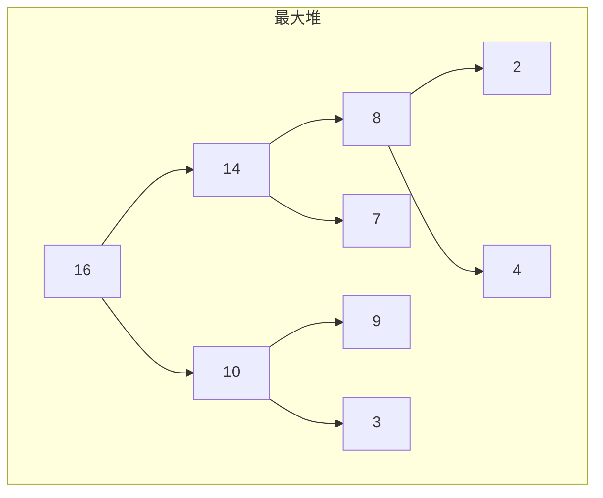
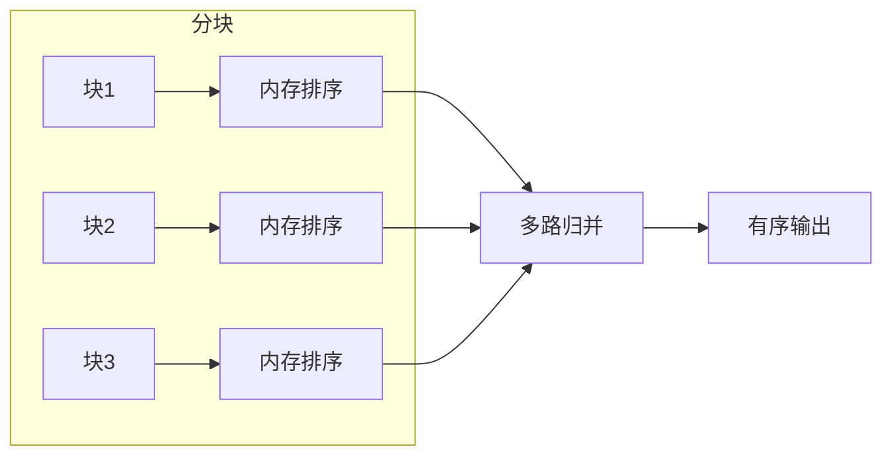

# 第4章 排序

> 排序是计算机科学中最基础、最广泛使用的算法之一。
>
> — Steven S. Skiena, The Algorithm Design Manual

[← 上一章](./ch03.md) | [目录](../index.md) | [下一章 →](./ch05.md)

---

排序（sorting）是将一组元素按照某种顺序重新排列的过程。本章介绍排序的广泛应用、实践考量，以及几种经典排序算法：**堆排序**（heapsort）、**归并排序**（mergesort）、**快速排序**（quicksort）和**桶排序**（bucketsort）。我们还将讨论**二分查找**（binary search）与**分治法**（divide and conquer）的复杂度分析。

---

## 4.1 排序的广泛应用

排序不仅是独立问题，更是许多算法的基础构件。以下是排序的主要应用场景：

### 搜索（Searching）

有序数组支持 **二分查找**（binary search），在 $O(\log n)$ 时间内定位元素，而无序数组需要 $O(n)$ 线性搜索。

$$
\text{二分查找复杂度：} T(n) = T(n/2) + O(1) = O(\log n)
$$

### 最近邻（Nearest Neighbor）

在有序序列中，查找与给定值最接近的元素可在 $O(\log n)$ 内完成，常用于范围查询和近似匹配。

### 唯一性检测（Uniqueness Testing）

排序后，重复元素必然相邻。检测唯一性只需一次 $O(n \log n)$ 排序加上 $O(n)$ 扫描。

### 频率统计（Frequency Counting）

排序后相同元素聚集，可在线性时间内统计各元素出现频率。

### 中位数与分位数（Median and Quantiles）

有序序列的中位数可直接通过下标访问：$A[n/2]$。第 $k$ 小元素也可在 $O(n)$ 内通过**快速选择**（quickselect）获得。

### 集合运算（Set Operations）

并集、交集、差集等集合运算在有序序列上可在线性时间内完成。

::: tip 排序作为归约
许多问题可归约到排序：先排序，再在有序结构上高效求解。当问题涉及「顺序」或「邻近性」时，排序往往是关键第一步。
:::

---

## 4.2 排序实践

### 比较函数（Comparison Function）

大多数排序算法依赖**比较函数**（comparator）定义元素间的序关系。比较函数应满足：

- **自反性**：$\text{cmp}(a, a) = 0$
- **反对称性**：$\text{cmp}(a, b) = -\text{cmp}(b, a)$
- **传递性**：若 $\text{cmp}(a, b) \leq 0$ 且 $\text{cmp}(b, c) \leq 0$，则 $\text{cmp}(a, c) \leq 0$

```c
/* C 语言比较函数示例：整数升序 */
int compare_asc(const void *a, const void *b) {
    return (*(int *)a - *(int *)b);
}

/* 降序 */
int compare_desc(const void *a, const void *b) {
    return (*(int *)b - *(int *)a);
}
```

### 升序与降序（Ascending vs Descending）

通过反转比较函数的返回值即可切换升序/降序，无需修改算法逻辑。

### 稳定性（Stability）

**稳定排序**（stable sort）保证相等元素在排序后保持原有相对顺序。这对多键排序至关重要：先按次要键排序，再按主要键排序，主要键相同时次要键顺序得以保留。

| 算法 | 稳定性 | 时间复杂度 |
|------|--------|------------|
| 归并排序 | ✓ | $O(n \log n)$ |
| 快速排序 | ✗ | 期望 $O(n \log n)$ |
| 堆排序 | ✗ | $O(n \log n)$ |

### 排序键（Sort Key）

复杂对象可按不同字段排序。选择**排序键**（sort key）时需考虑比较成本与缓存局部性。

---

## 4.3 堆排序

**堆排序**（heapsort）是一种 $O(n \log n)$ 的**原地排序**（in-place sort）算法，不依赖递归栈，空间复杂度为 $O(1)$。

### 堆的性质

**二叉堆**（binary heap）是完全二叉树，满足**堆性质**（heap property）：

- **最大堆**：父节点 ≥ 子节点
- **最小堆**：父节点 ≤ 子节点

数组表示中，节点 $i$ 的子节点为 $2i+1$ 和 $2i+2$，父节点为 $\lfloor (i-1)/2 \rfloor$。



### 算法流程

1. **建堆**（heapify）：将无序数组调整为最大堆，$O(n)$
2. **反复取堆顶**：每次将堆顶（最大值）与堆尾交换，堆大小减 1，对根节点执行 **sift-down**，共 $n-1$ 次，每次 $O(\log n)$

```c
void sift_down(int a[], int n, int i) {
    int largest = i;
    int left = 2 * i + 1;
    int right = 2 * i + 2;

    if (left < n && a[left] > a[largest])
        largest = left;
    if (right < n && a[right] > a[largest])
        largest = right;
    if (largest != i) {
        swap(&a[i], &a[largest]);
        sift_down(a, n, largest);
    }
}

void heapsort(int a[], int n) {
    for (int i = n/2 - 1; i >= 0; i--)
        sift_down(a, n, i);
    for (int i = n - 1; i > 0; i--) {
        swap(&a[0], &a[i]);
        sift_down(a, i, 0);
    }
}
```

### 复杂度分析

- 建堆：$O(n)$（从最后一个非叶节点向上 sift-down）
- 排序：$n-1$ 次 sift-down，每次 $O(\log n)$，总计 $O(n \log n)$
- 空间：$O(1)$ 原地

---

## 4.4 War Story: Give me a Ticket on an Airplane

::: info 实战故事
在一次航空订票系统的优化项目中，作者需要快速对大量航班座位按价格排序。系统要求实时响应，且内存受限。堆排序的原地特性和 $O(n \log n)$ 保证使其成为理想选择。通过精心设计比较函数（先按舱位等级，再按价格），最终在有限资源下满足了性能需求。
:::

---

## 4.5 归并排序

**归并排序**（mergesort）采用**分治**（divide and conquer）策略：将数组一分为二，递归排序两半，再**归并**（merge）两个有序子数组。

### 分治策略

$$
T(n) = 2T(n/2) + O(n) = O(n \log n)
$$

递推式来自：两个 $n/2$ 规模的子问题，加上 $O(n)$ 的归并操作。

### 归并过程

```c
void merge(int a[], int left, int mid, int right) {
    int n1 = mid - left + 1;
    int n2 = right - mid;
    int L[n1], R[n2];

    for (int i = 0; i < n1; i++) L[i] = a[left + i];
    for (int j = 0; j < n2; j++) R[j] = a[mid + 1 + j];

    int i = 0, j = 0, k = left;
    while (i < n1 && j < n2) {
        if (L[i] <= R[j]) a[k++] = L[i++];
        else              a[k++] = R[j++];
    }
    while (i < n1) a[k++] = L[i++];
    while (j < n2) a[k++] = R[j++];
}

void mergesort(int a[], int left, int right) {
    if (left < right) {
        int mid = left + (right - left) / 2;
        mergesort(a, left, mid);
        mergesort(a, mid + 1, right);
        merge(a, left, mid, right);
    }
}
```

### 外部排序（External Sorting）

当数据无法全部装入内存时，**外部归并排序**（external mergesort）将数据分块排序，再多路归并。这是数据库、文件系统常用的技术。



---

## 4.6 快速排序

**快速排序**（quicksort）是实践中最快的通用排序算法之一，采用**分区**（partition）策略。

### 分区操作

选择**主元**（pivot），将小于主元的放左侧，大于的放右侧。主元到达最终位置。

```c
int partition(int a[], int low, int high) {
    int pivot = a[high];
    int i = low - 1;
    for (int j = low; j < high; j++) {
        if (a[j] <= pivot) {
            i++;
            swap(&a[i], &a[j]);
        }
    }
    swap(&a[i + 1], &a[high]);
    return i + 1;
}

void quicksort(int a[], int low, int high) {
    if (low < high) {
        int pi = partition(a, low, high);
        quicksort(a, low, pi - 1);
        quicksort(a, pi + 1, high);
    }
}
```

### 随机化（Randomization）

固定选择最后一个元素作为主元，在已排序或近似有序输入上会导致 $O(n^2)$ 最坏情况。**随机选择主元**可将期望复杂度降至 $O(n \log n)$。

$$
E[T(n)] = O(n \log n)
$$

### 快速排序的复杂度

| 情况 | 时间复杂度 |
|------|------------|
| 最好 | $O(n \log n)$ |
| 平均 | $O(n \log n)$ |
| 最坏 | $O(n^2)$ |

::: warning 最坏情况
当主元每次都是最小或最大元素时，分区极不平衡，递归深度为 $n$，导致 $O(n^2)$。随机化或三数取中可有效避免。
:::

---

## 4.7 桶排序：分布排序

**桶排序**（bucketsort）是一种**非比较排序**（non-comparison sort），适用于元素均匀分布在有界区间的情况。

### 思想

将值域划分为 $k$ 个**桶**（bucket），将元素放入对应桶，对每个桶内部排序（或递归桶排序），最后按桶顺序输出。

### 桶排序的复杂度

当元素均匀分布时，每个桶约 $n/k$ 个元素。若桶内用 $O(m \log m)$ 排序，则：

$$
T(n) = O(n) + k \cdot O((n/k) \log(n/k)) = O(n \log(n/k))
$$

当 $k = \Theta(n)$ 时，达到 $O(n)$。

### 桶排序的适用场景

- 整数在 $[0, M)$ 范围内
- 浮点数在 $[0, 1)$ 均匀分布
- 字符串按字典序的前缀分布

```c
void bucketsort(float a[], int n) {
    list buckets[n];
    for (int i = 0; i < n; i++) init(&buckets[i]);
    for (int i = 0; i < n; i++)
        append(&buckets[(int)(a[i] * n)], a[i]);
    int k = 0;
    for (int i = 0; i < n; i++) {
        sort(buckets[i]);
        for (each x in buckets[i]) a[k++] = x;
    }
}
```

---

## 4.8 War Story: Skiena for the Defense

::: info 实战故事
在法律诉讼中，作者作为专家证人需要分析大量时间戳数据的顺序。对方声称数据按时间排列，但实际存在乱序。通过实现稳定的归并排序并对比原始顺序与排序后顺序，成功识别出人为篡改的痕迹，为案件提供了关键证据。稳定性在这里至关重要。
:::

---

## 4.9 二分查找与相关算法

### 标准二分查找

在有序数组 $A[0..n-1]$ 中查找 $x$：

```c
int binary_search(int a[], int n, int x) {
    int left = 0, right = n - 1;
    while (left <= right) {
        int mid = left + (right - left) / 2;
        if (a[mid] == x) return mid;
        if (a[mid] < x) left = mid + 1;
        else right = mid - 1;
    }
    return -1;
}
```

### 下界与上界

- **lower_bound**：第一个 $\geq x$ 的位置
- **upper_bound**：第一个 $> x$ 的位置
- **count**：$x$ 的出现次数 = upper_bound - lower_bound

```c
int lower_bound(int a[], int n, int x) {
    int left = 0, right = n;
    while (left < right) {
        int mid = left + (right - left) / 2;
        if (a[mid] < x) left = mid + 1;
        else right = mid;
    }
    return left;
}
```

---

## 4.10 分治法复杂度分析：主定理

**主定理**（Master Theorem）用于求解形如 $T(n) = aT(n/b) + f(n)$ 的递推式，其中 $a \geq 1$，$b > 1$。

设 $c_{\log_b a} = \log_b a$，则：

$$
T(n) = \begin{cases}
\Theta(n^{\log_b a}) & \text{if } f(n) = O(n^{\log_b a - \varepsilon}) \\
\Theta(n^{\log_b a} \log n) & \text{if } f(n) = \Theta(n^{\log_b a}) \\
\Theta(f(n)) & \text{if } f(n) = \Omega(n^{\log_b a + \varepsilon}) \text{ 且 } af(n/b) \leq cf(n)
\end{cases}
$$

### 归并排序

$T(n) = 2T(n/2) + \Theta(n)$：$a=2, b=2$，$n^{\log_2 2} = n$，$f(n) = \Theta(n)$，属于第二种情况，故 $T(n) = \Theta(n \log n)$。

### 二分查找

$T(n) = T(n/2) + \Theta(1)$：$a=1, b=2$，$n^{\log_2 1} = 1$，$f(n) = \Theta(1)$，故 $T(n) = \Theta(\log n)$。

---

## 小结

| 算法 | 时间复杂度 | 空间 | 稳定性 |
|------|------------|------|--------|
| 堆排序 | $O(n \log n)$ | $O(1)$ | ✗ |
| 归并排序 | $O(n \log n)$ | $O(n)$ | ✓ |
| 快速排序 | 期望 $O(n \log n)$ | $O(\log n)$ | ✗ |
| 桶排序 | $O(n)$（条件满足时） | $O(n)$ | 取决于桶内 |

选择排序算法时需考虑：数据规模、是否要求稳定、内存限制、输入分布特征。

---

### 导航

[← 上一章](./ch03.md) | [目录](../index.md) | [下一章 →](./ch05.md)
