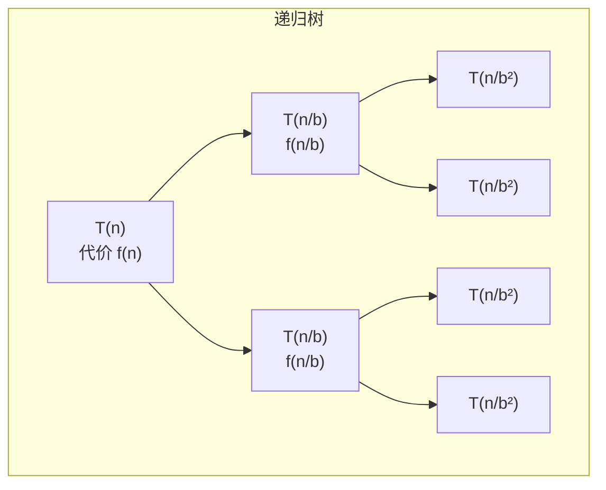
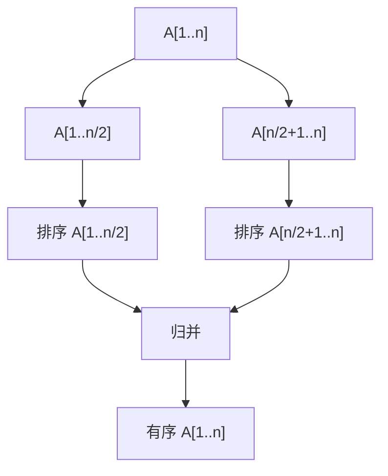
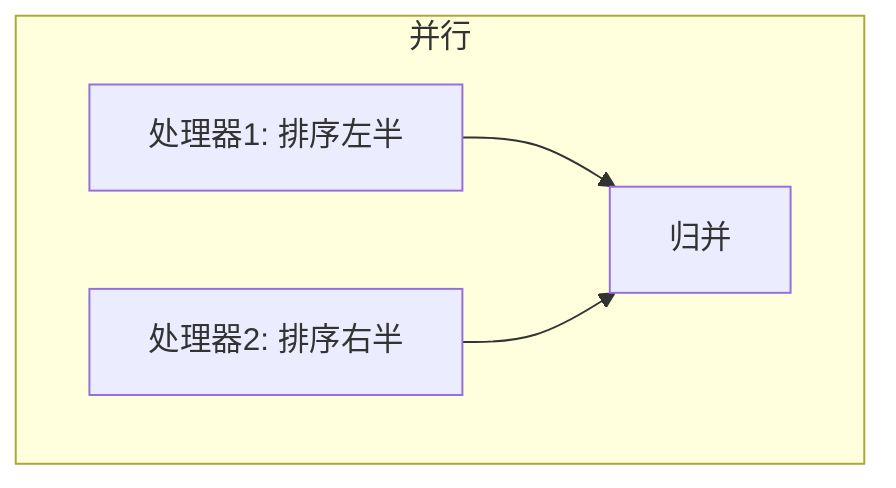

# 第5章 分治

> 分而治之，各个击破。
>
> — 经典算法设计范式

[← 上一章](./ch04.md) | [目录](../index.md) | [下一章 →](./ch06.md)

---

**分治法**（divide and conquer）是算法设计的核心范式之一：将问题分解为若干规模更小的子问题，递归求解，再将子问题的解合并为原问题的解。本章深入探讨分治法的理论、递推关系求解、以及若干经典应用：**二分查找**、**快速乘法**、**最大子数组和**、**最近点对**，以及**快速傅里叶变换**。

---

## 5.1 二分查找与相关算法

**二分查找**（binary search）是分治法最简洁的体现：每次将搜索空间减半，在 $O(\log n)$ 时间内完成查找。

### 递归形式

```c
int binary_search(int a[], int left, int right, int x) {
    if (left > right) return -1;
    int mid = left + (right - left) / 2;
    if (a[mid] == x) return mid;
    if (a[mid] < x) return binary_search(a, mid + 1, right, x);
    return binary_search(a, left, mid - 1, x);
}
```

### 递推关系

$$
T(n) = T(n/2) + O(1) = O(\log n)
$$

每次比较将规模减半，共 $\log_2 n$ 层。

### 二分答案

当问题具有**单调性**（monotonicity）时，可对答案进行二分。例如：满足条件的最小值、最大可行解等。

---

## 5.2 War Story: Finding the Bug in the Bug

::: info 实战故事
在调试一个复杂的生物信息学软件时，程序在特定输入规模下崩溃。通过**二分查找**定位问题：不断将输入数据减半，确定导致崩溃的最小数据集。最终将问题缩小到单个基因序列的特定子串，成功发现是边界条件处理错误。分治不仅用于算法设计，也是调试的有力工具。
:::

---

## 5.3 递归关系与主定理

分治算法的复杂度通常由**递推关系**（recurrence relation）描述。

### 常见形式

$$
T(n) = aT(n/b) + f(n)
$$

其中 $a$ 为子问题数量，$b$ 为规模缩减因子，$f(n)$ 为合并与分解的代价。

### 主定理（Master Theorem）

设 $T(n) = aT(n/b) + f(n)$，$a \geq 1$，$b > 1$。令 $c = \log_b a$。

| 条件 | 解 |
|------|-----|
| $f(n) = O(n^{c-\varepsilon})$ | $T(n) = \Theta(n^c)$ |
| $f(n) = \Theta(n^c)$ | $T(n) = \Theta(n^c \log n)$ |
| $f(n) = \Omega(n^{c+\varepsilon})$ 且 $af(n/b) \leq kf(n)$ | $T(n) = \Theta(f(n))$ |

### 递归树法

通过绘制**递归树**（recursion tree）可直观理解递推：



每层代价之和、层数、叶子数共同决定总复杂度。

---

## 5.4 分治范式

### 三步框架

1. **分解**（Divide）：将问题划分为 $a$ 个规模为 $n/b$ 的子问题
2. **征服**（Conquer）：递归求解子问题（若规模足够小则直接求解）
3. **合并**（Combine）：将子问题的解合并为原问题的解

### 归并排序的分治分析



$$
T(n) = 2T(n/2) + \Theta(n) = \Theta(n \log n)
$$

---

## 5.5 求解分治递推式

### 代入法（Substitution Method）

先猜测解的形式，再用数学归纳法证明。

**例**：证明 $T(n) = 2T(n/2) + n = O(n \log n)$。

假设 $T(k) \leq ck \log k$ 对 $k < n$ 成立，则：

$$
T(n) \leq 2c(n/2)\log(n/2) + n = cn\log n - cn + n \leq cn\log n \quad (c \geq 1)
$$

### 展开法（Iteration Method）

反复将递推式展开，得到求和式后化简。

$$
T(n) = 2T(n/2) + n = 2(2T(n/4) + n/2) + n = 4T(n/4) + 2n = \cdots = nT(1) + n \log n
$$

---

## 5.6 快速乘法（Karatsuba）

普通乘法将两个 $n$ 位数相乘需要 $O(n^2)$ 次 digit 运算。**Karatsuba 算法**通过分治将复杂度降至 $O(n^{\log_2 3}) \approx O(n^{1.585})$。

### 思想

设 $x = x_1 \cdot 2^{n/2} + x_0$，$y = y_1 \cdot 2^{n/2} + y_0$，则：

$$
xy = (x_1 2^{n/2} + x_0)(y_1 2^{n/2} + y_0) = x_1 y_1 2^n + (x_1 y_0 + x_0 y_1) 2^{n/2} + x_0 y_0
$$

直接计算需要 4 次乘法。Karatsuba 观察到：

$$
x_1 y_0 + x_0 y_1 = (x_1 + x_0)(y_1 + y_0) - x_1 y_1 - x_0 y_0
$$

因此只需 3 次乘法：$x_1 y_1$、$x_0 y_0$、$(x_1 + x_0)(y_1 + y_0)$。

### 递推与复杂度

$$
T(n) = 3T(n/2) + O(n) = O(n^{\log_2 3})
$$

---

## 5.7 最大子数组和与最近点对

### 最大子数组和（Maximum Subarray Sum）

**问题**：给定数组 $A[1..n]$，求连续子数组的最大和。

**分治思路**：最大子数组要么完全在左半、要么完全在右半、要么跨越中点。前两种情况递归求解，第三种情况从中点向两侧扩展，$O(n)$ 可求。

$$
T(n) = 2T(n/2) + \Theta(n) = \Theta(n \log n)
$$

```c
int max_crossing_sum(int a[], int left, int mid, int right) {
    int left_sum = INT_MIN, sum = 0;
    for (int i = mid; i >= left; i--) {
        sum += a[i];
        if (sum > left_sum) left_sum = sum;
    }
    int right_sum = INT_MIN; sum = 0;
    for (int i = mid + 1; i <= right; i++) {
        sum += a[i];
        if (sum > right_sum) right_sum = sum;
    }
    return left_sum + right_sum;
}

int max_subarray(int a[], int left, int right) {
    if (left == right) return a[left];
    int mid = left + (right - left) / 2;
    int left_max = max_subarray(a, left, mid);
    int right_max = max_subarray(a, mid + 1, right);
    int cross_max = max_crossing_sum(a, left, mid, right);
    return max3(left_max, right_max, cross_max);
}
```

### 最近点对（Closest Pair）

**问题**：平面上 $n$ 个点，求距离最近的点对。

**分治思路**：

1. 按 $x$ 坐标排序，取中线将点集分为左右两半
2. 递归求左半和右半的最近点对，设最小距离为 $\delta$
3. 考虑跨越中线的点对：只需检查与中线距离 $< \delta$ 的带状区域内的点，且对每个点只需检查其后的常数个点（由几何性质保证）

$$
T(n) = 2T(n/2) + O(n) = O(n \log n)
$$

---

## 5.8 并行算法概念

分治天然适合**并行化**（parallelization）：子问题可独立求解，分配给不同处理器。

### 并行归并排序



理想情况下，$p$ 个处理器可将时间缩短为 $T(n)/p$，但通信与负载均衡会带来额外开销。

### 并行复杂度

**工作量**（work）：总操作数 $T_1(n)$  
**跨度**（span）：关键路径长度 $T_\infty(n)$  
**并行度**：$T_1(n) / T_\infty(n)$

---

## 5.9 War Story: Going Nowhere Fast

::: info 实战故事
在优化一个地理信息系统时，团队尝试用分治并行化最近邻查询。理论上 $p$ 个核应带来 $p$ 倍加速，但实际测试发现性能提升不足 2 倍。原因包括：数据依赖、缓存失效、负载不均衡。教训是：分治的并行潜力需要结合具体硬件与数据特征才能充分发挥。
:::

---

## 5.10 卷积与快速傅里叶变换

### 卷积（Convolution）

两个序列 $a[0..n-1]$ 和 $b[0..m-1]$ 的**卷积**定义为（其中 $c = a * b$）：

$$
c[k] = \sum_{i+j=k} a[i] \cdot b[j]
$$

直接计算需要 $O(nm)$。在**频域**中，卷积变为逐点乘法。

### 快速傅里叶变换（FFT）

**离散傅里叶变换**（DFT）将序列从时域映射到频域：

$$
\hat{a}[k] = \sum_{j=0}^{n-1} a[j] \cdot \omega^{jk}, \quad \omega = e^{2\pi i / n}
$$

**快速傅里叶变换**（FFT）利用 $\omega$ 的对称性，将 DFT 分解为两个规模减半的 DFT：

$$
\hat{a}[k] = \hat{a}_{\text{even}}[k] + \omega^k \hat{a}_{\text{odd}}[k]
$$

$$
T(n) = 2T(n/2) + \Theta(n) = \Theta(n \log n)
$$

### 卷积的 FFT 算法

1. 对 $a$、$b$ 做 FFT，得 $\hat{a}$、$\hat{b}$
2. 逐点相乘：$\hat{c}[k] = \hat{a}[k] \cdot \hat{b}[k]$
3. 对 $\hat{c}$ 做逆 FFT，得卷积结果 $c$

总复杂度 $O(n \log n)$，优于直接卷积的 $O(n^2)$。

### 应用

- **多项式乘法**：系数向量的卷积
- **大整数乘法**：可结合 Karatsuba 与 FFT 进一步优化
- **信号处理**：滤波、相关分析
- **图像处理**：卷积神经网络中的卷积层

---

## 小结

| 问题 | 分治策略 | 复杂度 |
|------|----------|--------|
| 二分查找 | 每次减半 | $O(\log n)$ |
| 归并排序 | 二分 + 归并 | $O(n \log n)$ |
| Karatsuba 乘法 | 三分 + 组合 | $O(n^{1.585})$ |
| 最大子数组 | 二分 + 跨中 | $O(n \log n)$ |
| 最近点对 | 二分 + 带状扫描 | $O(n \log n)$ |
| FFT | 二分 + 蝶形运算 | $O(n \log n)$ |

分治法的关键在于：找到合适的分解方式，使子问题规模显著减小，且合并代价可接受。

### 分治法的适用条件

并非所有问题都适合分治。有效分治通常满足：

1. **可分解性**：问题可划分为若干相互独立的子问题
2. **子问题相似性**：子问题与原问题形式相同，规模更小
3. **合并可解**：子问题的解可高效合并为原问题的解
4. **基础情况**：存在可直接求解的最小规模

### 分治与动态规划

分治要求子问题**相互独立**；**动态规划**（dynamic programming）则处理子问题**重叠**的情况，通过记忆化避免重复计算。当子问题有大量重复时，应考虑动态规划而非纯分治。

### 主定理的第三种情况

当 $f(n) = \Omega(n^{\log_b a + \varepsilon})$ 时，合并代价主导递归。需验证**正则条件** $af(n/b) \leq cf(n)$（$c < 1$）确保子问题代价递减。例如 $T(n) = 2T(n/2) + n^2$ 属于此类，$T(n) = \Theta(n^2)$。

### 分治的局限性

主定理无法覆盖所有递推式，如 $T(n) = T(n/2) + T(n/4) + n$。此类情况需用递归树或 Akra-Bazzi 定理等更一般的方法分析。

### 何时选择分治

- 问题可自然分解为规模更小的同类子问题
- 子问题相互独立，无重叠
- 合并代价相对子问题规模可接受
- 递归深度与栈空间在可接受范围内

---

### 导航

[← 上一章](./ch04.md) | [目录](../index.md) | [下一章 →](./ch06.md)
