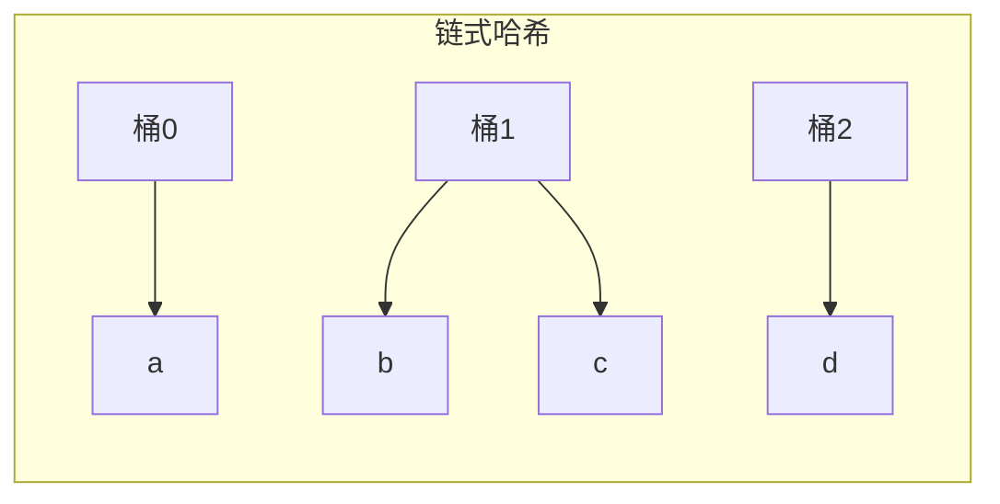

# 第6章 哈希与随机化算法

> 随机性是一种资源，善用者可获得简洁而高效的算法。
>
> — Steven S. Skiena, The Algorithm Design Manual

[← 上一章](./ch05.md) | [目录](../index.md) | [下一章 →](./ch07.md)

---

本章探讨**哈希**（hashing）与**随机化算法**（randomized algorithms）。哈希提供 $O(1)$ 期望时间的查找与插入；随机化则通过引入随机性，使算法在期望意义下高效或更易实现。我们将介绍**布隆过滤器**（Bloom filter）、**MinHash**、**Rabin-Karp 字符串匹配**、**Miller-Rabin 素性测试**等经典技术。

---

## 6.1 概率论回顾

### 期望（Expectation）

随机变量 $X$ 的**期望**（expected value）定义为：

$$
E[X] = \sum_{x} x \cdot P(X = x)
$$

**线性性**：$E[aX + bY] = aE[X] + bE[Y]$，即使 $X$、$Y$ 不独立也成立。

### 条件概率（Conditional Probability）

$$
P(A \mid B) = \frac{P(A \cap B)}{P(B)}
$$

**全概率公式**：$P(A) = \sum_i P(A \mid B_i) P(B_i)$

### 马尔可夫不等式

对非负随机变量 $X$ 和 $a > 0$：

$$
P(X \geq a) \leq \frac{E[X]}{a}
$$

### 在算法分析中的应用

随机化算法的运行时间 $T$ 是随机变量。我们通常关心 $E[T]$，有时也关心 $P(T > c \cdot E[T])$ 的上界。

---

## 6.2 哈希

**哈希表**（hash table）通过**哈希函数**（hash function）将键映射到桶索引，实现平均 $O(1)$ 的查找、插入、删除。

### 哈希函数

理想哈希函数应满足：

- **均匀性**：将键均匀分布到各桶
- **确定性**：相同键始终映射到相同桶
- **高效性**：计算复杂度低

### 碰撞解决（Collision Resolution）

**链式哈希**（chaining）：每个桶维护一个链表，碰撞时追加到链表末尾。

**开放寻址**（open addressing）：碰撞时按探测序列寻找空位，如线性探测 $h(k, i) = (h(k) + i) \bmod m$。



### 通用哈希（Universal Hashing）

从哈希函数族 $\mathcal{H}$ 中随机选取 $h$，使得对任意不同键 $x \neq y$：

$$
P_{h \in \mathcal{H}}(h(x) = h(y)) \leq \frac{1}{m}
$$

其中 $m$ 为桶数。**通用哈希**（universal hashing）保证无论输入如何，期望碰撞次数都受控。

### 完美哈希（Perfect Hashing）

当键集合静态且已知时，可构造**完美哈希**（perfect hashing），使无碰撞，查找严格 $O(1)$。两级哈希：第一级将键分散到桶，第二级对每个桶构造完美哈希。

---

## 6.3 随机化算法

### Las Vegas vs Monte Carlo

- **Las Vegas 算法**：结果必然正确，运行时间为随机变量。如随机化快速排序。
- **Monte Carlo 算法**：运行时间确定，结果以一定概率正确。如 Miller-Rabin 素性测试。


### 随机化快速排序

随机选择主元，期望复杂度 $O(n \log n)$，且最坏情况概率极低。

### 随机化选择

**快速选择**（quickselect）随机选主元，期望 $O(n)$ 找到第 $k$ 小元素。

---

## 6.4 War Story: Dialing for Documents

::: info 实战故事
在构建文档检索系统时，需要快速判断某文档是否在百万级文档库中。精确的哈希表占用内存过大。采用**布隆过滤器**作为第一层过滤：若布隆过滤器说「不存在」，则必然不存在，可跳过昂贵的磁盘查找；若说「可能存在」，再执行精确查找。大幅降低了平均查询成本。
:::

---

## 6.5 布隆过滤器

**布隆过滤器**（Bloom filter）是一种空间高效的**概率数据结构**（probabilistic data structure），用于判断元素是否在集合中。允许**假阳性**（false positive），但**假阴性**（false negative）不会出现。

### 结构

- 位数组 $B[0..m-1]$，初始全 0
- $k$ 个独立的哈希函数 $h_1, \ldots, h_k$

### 操作

**插入** $x$：对 $i = 1, \ldots, k$，置 $B[h_i(x)] = 1$

**查询** $x$：若所有 $B[h_i(x)] = 1$ 则返回「可能存在」，否则返回「必然不存在」

### 假阳性率

设 $n$ 为已插入元素数，则某位为 0 的概率约为 $(1 - 1/m)^{kn} \approx e^{-kn/m}$。假阳性率约为：

$$
p \approx \left(1 - e^{-kn/m}\right)^k
$$

当 $k = (m/n) \ln 2$ 时，$p$ 最小，约 $0.6185^{m/n}$。

### 应用

- Web 缓存：避免查询不存在的 URL
- 分布式系统：减少跨节点查询
- 垃圾邮件过滤：快速排除非垃圾邮件

```c
typedef struct {
    uint8_t *bits;
    int m, k;
    uint32_t (*hash[8])(const void *, int);
} BloomFilter;

void bloom_insert(BloomFilter *bf, const void *key, int len) {
    for (int i = 0; i < bf->k; i++) {
        uint32_t h = bf->hash[i](key, len) % (bf->m * 8);
        bf->bits[h / 8] |= (1 << (h % 8));
    }
}

int bloom_query(BloomFilter *bf, const void *key, int len) {
    for (int i = 0; i < bf->k; i++) {
        uint32_t h = bf->hash[i](key, len) % (bf->m * 8);
        if (!(bf->bits[h / 8] & (1 << (h % 8)))) return 0;
    }
    return 1;  /* 可能存在 */
}
```

---

## 6.6 Minwise Hashing（MinHash）

**MinHash** 用于估计集合的 **Jaccard 相似度**（Jaccard similarity）：

$$
J(A, B) = \frac{|A \cap B|}{|A \cup B|}
$$

### MinHash 思想

对排列 $\pi$，定义 $h_\pi(S) = \min_{x \in S} \pi(x)$。可以证明：

$$
P(h_\pi(A) = h_\pi(B)) = J(A, B)
$$

因此，用 $k$ 个随机排列得到 $k$ 个 MinHash 值，相同比例即为 Jaccard 的无偏估计。

### 应用

- **局部敏感哈希**（LSH）：相似文档有相近的 MinHash 签名
- **去重**：快速识别近似重复文档
- **推荐系统**：基于集合相似度的协同过滤

---

## 6.7 基于哈希的高效字符串匹配：Rabin-Karp

**Rabin-Karp 算法**利用**滚动哈希**（rolling hash）在文本中查找模式，平均 $O(n + m)$，最坏 $O(nm)$。

### 滚动哈希

将长度为 $m$ 的字符串视为 $m$ 位数（基数为字符集大小），用模运算避免溢出：

$$
h(s) = \left( \sum_{i=0}^{m-1} s[i] \cdot b^{m-1-i} \right) \bmod p
$$

从 $h(s[0..m-1])$ 到 $h(s[1..m])$ 的更新：

$$
h(s[1..m]) = (h(s[0..m-1]) - s[0] \cdot b^{m-1}) \cdot b + s[m] \pmod p
$$

每次更新 $O(1)$。

### 算法

1. 计算模式 $P$ 的哈希 $h(P)$
2. 对文本 $T$ 的每个长度为 $m$ 的子串，计算哈希并与 $h(P)$ 比较
3. 若哈希相等，再逐字符验证（避免哈希碰撞导致的假阳性）

```c
#define BASE 256
#define MOD 101

int rabin_karp(char *text, char *pattern) {
    int n = strlen(text), m = strlen(pattern);
    if (n < m) return -1;

    int h = 1;
    for (int i = 0; i < m - 1; i++) h = (h * BASE) % MOD;

    int hp = 0, ht = 0;
    for (int i = 0; i < m; i++) {
        hp = (BASE * hp + pattern[i]) % MOD;
        ht = (BASE * ht + text[i]) % MOD;
    }

    for (int i = 0; i <= n - m; i++) {
        if (hp == ht) {
            int j;
            for (j = 0; j < m && text[i+j] == pattern[j]; j++);
            if (j == m) return i;
        }
        if (i < n - m)
            ht = (BASE * (ht - text[i] * h) + text[i + m]) % MOD;
        if (ht < 0) ht += MOD;
    }
    return -1;
}
```

---

## 6.8 素性测试（Miller-Rabin）

**素性测试**（primality testing）判断给定整数是否为素数。**Miller-Rabin 算法**是一种概率算法，若返回「合数」则必然正确，若返回「素数」则以高概率正确。

### Miller-Rabin 思想

基于 **Fermat 小定理**：若 $p$ 为素数，则 $a^{p-1} \equiv 1 \pmod p$ 对所有 $a \not\equiv 0 \pmod p$ 成立。

合数可能通过 Fermat 测试（Carmichael 数）。Miller-Rabin 通过考察 $p-1 = 2^s \cdot d$，检验 $a^d, a^{2d}, \ldots, a^{2^{s-1}d}$ 是否满足特定性质。

### Miller-Rabin 算法步骤

对 $n$，写 $n-1 = 2^s \cdot d$，$d$ 为奇数。随机选 $a \in [2, n-2]$，计算 $x = a^d \bmod n$。若 $x \equiv 1$ 或 $x \equiv n-1$，则 $n$ 可能为素数。否则对 $r = 1, \ldots, s-1$ 检查 $x = a^{2^r d} \bmod n$ 是否 $\equiv n-1$。若均不满足，则 $n$ 必为合数。

### 正确性

若 $n$ 为合数，单轮 Miller-Rabin 判错的概率 $\leq 1/4$。重复 $k$ 轮，错误概率 $\leq 4^{-k}$。

```c
int mod_pow(int base, int exp, int mod) {
    int result = 1;
    base %= mod;
    while (exp) {
        if (exp & 1) result = (long long)result * base % mod;
        base = (long long)base * base % mod;
        exp >>= 1;
    }
    return result;
}

int miller_rabin(int n, int k) {
    if (n < 2) return 0;
    if (n == 2 || n == 3) return 1;
    if (n % 2 == 0) return 0;

    int r = 0, d = n - 1;
    while (d % 2 == 0) { r++; d /= 2; }

    for (int i = 0; i < k; i++) {
        int a = 2 + rand() % (n - 3);
        int x = mod_pow(a, d, n);
        if (x == 1 || x == n - 1) continue;
        int cont = 0;
        for (int j = 0; j < r - 1; j++) {
            x = (long long)x * x % n;
            if (x == n - 1) { cont = 1; break; }
        }
        if (!cont) return 0;
    }
    return 1;
}
```

---

## 6.9 War Story: String 'em Up

::: info 实战故事
在 DNA 序列分析中，需要从海量短序列（reads）中识别重复与近似重复。直接两两比较为 $O(n^2)$，不可行。采用 MinHash 构造文档指纹，将相似度估计转化为哈希值比较；再结合布隆过滤器排除不可能匹配的序列对。最终在合理时间内完成了数十亿序列的相似性分析。
:::

---

## 小结

| 技术 | 类型 | 关键特性 |
|------|------|----------|
| 哈希表 | 确定性 | $O(1)$ 期望查找，碰撞处理 |
| 布隆过滤器 | 概率 | 无假阴性，可调假阳性率 |
| MinHash | 概率 | 估计 Jaccard 相似度 |
| Rabin-Karp | 随机/确定 | 滚动哈希，$O(n+m)$ 平均 |
| Miller-Rabin | 概率 | 素性测试，错误率 $4^{-k}$ |

随机化与哈希结合，可在时间、空间、正确性之间取得灵活权衡，是现代算法工具箱的重要组成部分。

### 哈希函数设计建议

- 使用**质数**作为模数可改善分布
- **乘法哈希**：$h(k) = \lfloor m \cdot (kA \bmod 1) \rfloor$，$A \in (0, 1)$ 为常数
- 避免**正则性**：若键具有规律（如连续整数），简单取模可能导致聚集

### 随机数质量

随机化算法的正确性与**随机数生成器**（RNG）的质量相关。密码学场景应使用加密安全的 RNG；一般算法可用 `rand()` 或梅森旋转（Mersenne Twister）。

---

### 导航

[← 上一章](./ch05.md) | [目录](../index.md) | [下一章 →](./ch07.md)
