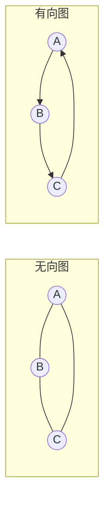
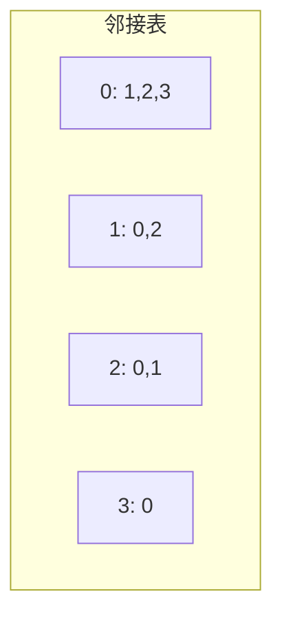

# 第7章 图遍历

> 图是描述关系与连接的最通用数据结构。
>
> — Steven S. Skiena, The Algorithm Design Manual

[← 上一章](./ch06.md) | [目录](../index.md) | [下一章 →](./ch08.md)

---

**图**（graph）由**顶点**（vertex）和**边**（edge）组成，可表示社交网络、道路、依赖关系等。本章介绍图的类型、存储结构、以及两种核心遍历算法：**广度优先搜索**（BFS）和**深度优先搜索**（DFS）。我们还将讨论 BFS/DFS 的应用：最短路径、连通分量、拓扑排序、强连通分量等。

---

## 7.1 图的类型

### 无向图与有向图

- **无向图**（undirected graph）：边无方向，$(u, v)$ 与 $(v, u)$ 等价。如社交网络中的好友关系。
- **有向图**（directed graph）：边有方向，$u \to v$ 与 $v \to u$ 不同。如网页链接、任务依赖。

### 加权图

**加权图**（weighted graph）的边带有权值 $w(u, v)$，可表示距离、成本、容量等。本章主要讨论**无权图**（unweighted graph），即边权均为 1。

### 稀疏与稠密

- **稀疏图**（sparse graph）：$|E| \ll |V|^2$，边数接近 $O(|V|)$
- **稠密图**（dense graph）：$|E| \approx |V|^2$

存储与算法选择需考虑稀疏性。

### 连通性

- **连通图**（connected graph）：无向图中任意两点间存在路径
- **强连通**（strongly connected）：有向图中任意两点互相可达
- **弱连通**（weakly connected）：有向图的无向版本连通



---

## 7.2 图的存储结构

### 邻接矩阵（Adjacency Matrix）

$n \times n$ 矩阵 $A$，$A[i][j] = 1$ 表示存在边 $(i, j)$（或边权）。

- **空间**：$O(|V|^2)$
- **查边**：$O(1)$
- **遍历邻居**：$O(|V|)$
- **适用**：稠密图、需快速查边

### 邻接表（Adjacency List）

每个顶点 $v$ 维护其邻居列表（或出边列表）。

- **空间**：$O(|V| + |E|)$
- **查边**：$O(\deg(v))$
- **遍历邻居**：$O(\deg(v))$
- **适用**：稀疏图、遍历为主

```c
/* 邻接表表示 */
typedef struct Edge {
    int to;
    int weight;  /* 可选 */
    struct Edge *next;
} Edge;

typedef struct {
    Edge *head;
} AdjList;

typedef struct {
    int n;
    AdjList *adj;
} Graph;

void add_edge(Graph *g, int u, int v, int w) {
    Edge *e = malloc(sizeof(Edge));
    e->to = v; e->weight = w;
    e->next = g->adj[u].head;
    g->adj[u].head = e;
}
```



---

## 7.3 War Story: I was a Victim of Moore's Law

::: info 实战故事
早期在有限内存的机器上处理大规模图时，邻接矩阵的 $O(|V|^2)$ 空间成为瓶颈。即使图是稀疏的，矩阵表示也迫使使用磁盘交换。改用邻接表后，内存占用从 $|V|^2$ 降至 $|V| + |E|$，使原本不可行的问题得以求解。硬件进步（Moore 定律）缓解了这一问题，但算法与数据结构的选择始终至关重要。
:::

---

## 7.4 War Story: Getting the Graph

::: info 实战故事
在分析真实网络（如互联网拓扑、社交图）时，获取图数据本身是一大挑战。数据可能分散在多个来源、格式不一、包含噪声。作者曾为整合不同格式的图数据花费大量精力，包括解析、去重、验证连通性。教训是：图算法的应用往往始于数据工程，清晰的图表示与预处理同样重要。
:::

---

## 7.5 图遍历框架

图遍历（graph traversal）系统性地访问图中每个顶点，确保不重复、不遗漏。

### 通用框架

```text
遍历(G):
    初始化: 所有顶点未访问
    for 每个顶点 v:
        if v 未访问:
            从 v 出发进行遍历
```

从单个顶点出发的遍历可到达该顶点所在的**连通分量**（connected component）。对无向图，多次调用可遍历所有连通分量；对有向图，需根据问题选择起点（如所有入度为 0 的顶点）。

### 访问状态

- **未访问**（unvisited）
- **已发现**（discovered）：已加入待处理队列/栈
- **已处理**（processed）：已处理完毕

---

## 7.6 广度优先搜索（BFS）

**广度优先搜索**（breadth-first search, BFS）按「层次」扩展：先访问起点，再访问距离为 1 的顶点，再距离为 2，以此类推。

### 算法

使用**队列**（queue）维护待访问顶点。从起点 $s$ 开始，每次取出队首 $u$，将 $u$ 的未访问邻居入队并标记为已发现。

```c
void bfs(Graph *g, int s) {
    int *visited = calloc(g->n, sizeof(int));
    int *dist = malloc(g->n * sizeof(int));
    for (int i = 0; i < g->n; i++) dist[i] = -1;

    int q[g->n], front = 0, rear = 0;
    q[rear++] = s;
    visited[s] = 1;
    dist[s] = 0;

    while (front < rear) {
        int u = q[front++];
        for (Edge *e = g->adj[u].head; e; e = e->next) {
            int v = e->to;
            if (!visited[v]) {
                visited[v] = 1;
                dist[v] = dist[u] + 1;
                q[rear++] = v;
            }
        }
    }
    free(visited); free(dist);
}
```

### 最短路径（无权图）

BFS 天然得到从起点到各顶点的**最短路径**（按边数）。$dist[v]$ 即为 $s$ 到 $v$ 的最短距离。

$$
\text{最短路径长度} = \text{BFS 中的 } dist[v]
$$

### 复杂度

- 时间：$O(|V| + |E|)$（每个顶点、每条边各处理一次）
- 空间：$O(|V|)$（队列与标记数组）

---

## 7.7 BFS 的应用

### 连通分量（Connected Components）

对无向图，从每个未访问顶点出发做一次 BFS，每次 BFS 覆盖一个连通分量。

```c
int count_components(Graph *g) {
    int *visited = calloc(g->n, sizeof(int));
    int count = 0;
    for (int v = 0; v < g->n; v++) {
        if (!visited[v]) {
            bfs_from(g, v, visited);
            count++;
        }
    }
    free(visited);
    return count;
}
```

### 二部图检测（Bipartite Testing）

**二部图**（bipartite graph）的顶点可划分为两个集合，使所有边连接两个集合。BFS 时对顶点交替染色，若发现同色相邻则非二部图。

```c
int is_bipartite(Graph *g) {
    int *color = malloc(g->n * sizeof(int));
    for (int i = 0; i < g->n; i++) color[i] = -1;

    for (int s = 0; s < g->n; s++) {
        if (color[s] != -1) continue;
        int q[g->n], front = 0, rear = 0;
        q[rear++] = s;
        color[s] = 0;

        while (front < rear) {
            int u = q[front++];
            for (Edge *e = g->adj[u].head; e; e = e->next) {
                int v = e->to;
                if (color[v] == -1) {
                    color[v] = 1 - color[u];
                    q[rear++] = v;
                } else if (color[v] == color[u]) {
                    free(color);
                    return 0;
                }
            }
        }
    }
    free(color);
    return 1;
}
```

---

## 7.8 深度优先搜索（DFS）

**深度优先搜索**（depth-first search, DFS）沿一条路径尽可能深入，回溯后再探索其他分支。通常用**递归**或**显式栈**实现。

### DFS 算法

```c
void dfs(Graph *g, int u, int *visited) {
    visited[u] = 1;
    for (Edge *e = g->adj[u].head; e; e = e->next) {
        int v = e->to;
        if (!visited[v])
            dfs(g, v, visited);
    }
}
```

### 发现时间与完成时间

对每个顶点记录**发现时间**（discovery time）$d[v]$ 和**完成时间**（finishing time）$f[v]$。DFS 进入时设置 $d[v]$，回溯离开时设置 $f[v]$。

$$
d[v] < d[u] < f[u] < f[v] \Rightarrow u \text{ 是 } v \text{ 的后代}
$$

### 边分类（有向图）

- **树边**（tree edge）：DFS 树上的边
- **后向边**（back edge）：指向祖先的边
- **前向边**（forward edge）：指向后代的非树边
- **交叉边**（cross edge）：指向其他 DFS 子树

---

## 7.9 DFS 的应用

### 找环（Cycle Detection）

无向图：若存在**后向边**（指向已访问且非父节点的邻居）则有环。

有向图：若存在**后向边**（指向灰色顶点，即栈中顶点）则有环。

### 拓扑排序（Topological Sort）

**有向无环图**（DAG）的**拓扑排序**（topological sort）将顶点排成线性序列，使所有边从左指向右。按 DFS **完成时间**的逆序即为一种拓扑序。

$$
\text{若 } u \to v \text{ 为边，则 } f[u] > f[v]
$$

```c
void dfs_topo(Graph *g, int u, int *visited, int *order, int *idx) {
    visited[u] = 1;
    for (Edge *e = g->adj[u].head; e; e = e->next)
        if (!visited[e->to])
            dfs_topo(g, e->to, visited, order, idx);
    order[--(*idx)] = u;  /* 完成时写入逆序 */
}

void topological_sort(Graph *g, int *order) {
    int *visited = calloc(g->n, sizeof(int));
    int idx = g->n;
    for (int v = 0; v < g->n; v++)
        if (!visited[v])
            dfs_topo(g, v, visited, order, &idx);
    free(visited);
}
```

### 强连通分量（Strongly Connected Components）

**强连通分量**（SCC）是极大强连通子图。Kosaraju 与 Tarjan 算法均基于 DFS。

---

## 7.10 有向图上的 DFS

### DAG 与拓扑排序

**有向无环图**（DAG）无环，必有拓扑排序。拓扑排序可用于任务调度、编译顺序等。

### Kosaraju 算法

1. 对原图 $G$ 做 DFS，按完成时间入栈
2. 构造**转置图** $G^T$（所有边反向）
3. 按栈顶到底的顺序，在 $G^T$ 上做 DFS，每次 DFS 覆盖一个 SCC

### Tarjan 算法

一次 DFS，维护每个顶点的 $low$ 值（能到达的最早栈中顶点）。当 $d[v] = low[v]$ 时，从栈中弹出直至 $v$，这些顶点构成一个 SCC。

```c
void tarjan_scc(Graph *g, int u, int *d, int *low, int *on_stack,
                int *stack, int *top, int *idx, int *scc_id, int *scc_count) {
    d[u] = low[u] = (*idx)++;
    stack[(*top)++] = u;
    on_stack[u] = 1;

    for (Edge *e = g->adj[u].head; e; e = e->next) {
        int v = e->to;
        if (d[v] == -1) {
            tarjan_scc(g, v, d, low, on_stack, stack, top, idx, scc_id, scc_count);
            low[u] = (low[u] < low[v]) ? low[u] : low[v];
        } else if (on_stack[v])
            low[u] = (low[u] < d[v]) ? low[u] : d[v];
    }

    if (d[u] == low[u]) {
        int w;
        do {
            w = stack[--(*top)];
            on_stack[w] = 0;
            scc_id[w] = *scc_count;
        } while (w != u);
        (*scc_count)++;
    }
}
```

### BFS 与 DFS 对比

| 特性 | BFS | DFS |
|------|-----|-----|
| 数据结构 | 队列 | 栈/递归 |
| 最短路径（无权） | ✓ 天然 | ✗ 需额外处理 |
| 空间（最坏） | $O(|V|)$ | $O(|V|)$（栈深度） |
| 应用 | 最短路径、层次遍历 | 拓扑排序、SCC、找环 |

---

## 小结

| 算法 | 复杂度 | 典型应用 |
|------|--------|----------|
| BFS | O(V+E) | 最短路径（无权）、连通分量、二部图检测 |
| DFS | O(V+E) | 拓扑排序、SCC、找环、路径枚举 |
| Kosaraju | O(V+E) | 强连通分量 |
| Tarjan | O(V+E) | 强连通分量（单次 DFS） |

图遍历是图算法的基础。多数图问题（最短路径、最小生成树、最大流等）都建立在遍历或类似思想之上。

---

### 导航

[← 上一章](./ch06.md) | [目录](../index.md) | [下一章 →](./ch08.md)
