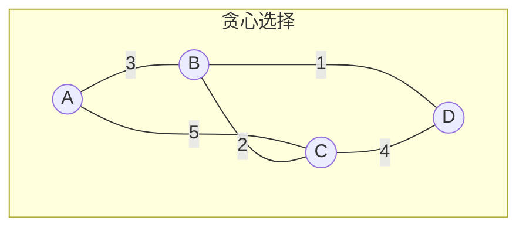
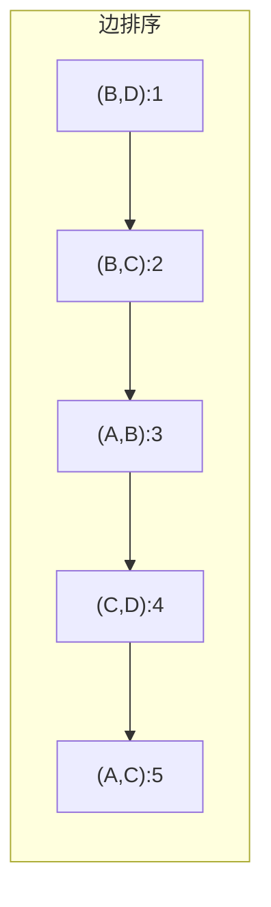
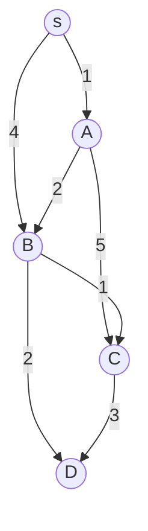
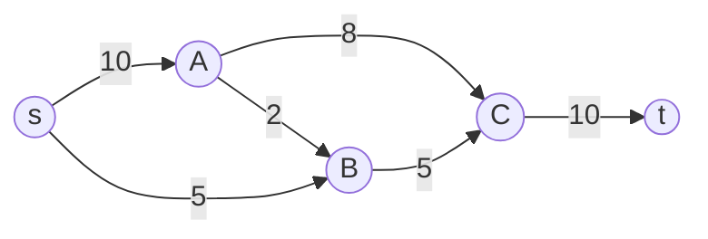
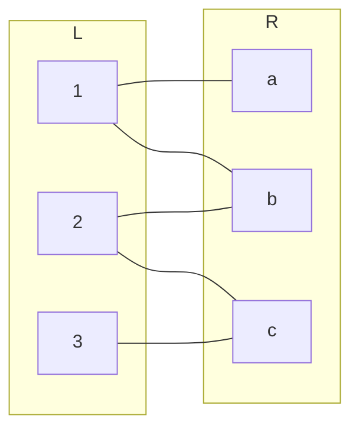

# 第8章 加权图算法

> 加权图将「连接」与「代价」结合，最短路径与最小生成树是其中最经典的问题。
>
> — Steven S. Skiena, The Algorithm Design Manual

[← 上一章](./ch07.md) | [目录](../index.md) | [下一章 →](./ch09.md)

---

**加权图**（weighted graph）的每条边带有权值，可表示距离、成本、容量等。本章介绍三大类问题：**最小生成树**（minimum spanning tree, MST）、**最短路径**（shortest path）、**网络流**（network flow），以及**随机最小割**（randomized min-cut）等高级技术。

---

## 8.1 最小生成树（Minimum Spanning Trees）

给定连通无向加权图 $G = (V, E)$，**最小生成树**（MST）是连接所有顶点且边权和最小的**生成树**（spanning tree）。生成树是 $|V|-1$ 条边构成的连通无环子图。

$$
\text{MST 边权和} = \min_{T \text{ 为生成树}} \sum_{e \in T} w(e)
$$

### 贪心性质

MST 具有**贪心选择性质**：若边 $e$ 是连接某两个连通分量的一条**最小权边**（minimum weight edge），则 $e$ 必在某个 MST 中。



上图中，边 $(B,D)$ 权为 1，是连接 $\{A,B,C\}$ 与 $\{D\}$ 的最小边，必在 MST 中。

### Prim 算法

**Prim 算法**从单点出发，每次加入连接「已选顶点集」与「未选顶点集」的最小权边。

```c
/* Prim 算法 - 邻接矩阵 O(V^2)，邻接表+优先队列 O(E log V) */
void prim_mst(int n, int g[][N], int *parent) {
    int *key = malloc(n * sizeof(int));
    int *in_mst = calloc(n, sizeof(int));
    for (int i = 0; i < n; i++) key[i] = INT_MAX;
    key[0] = 0;
    parent[0] = -1;

    for (int count = 0; count < n - 1; count++) {
        int u = -1;
        for (int v = 0; v < n; v++)
            if (!in_mst[v] && (u == -1 || key[v] < key[u]))
                u = v;
        in_mst[u] = 1;

        for (int v = 0; v < n; v++)
            if (g[u][v] && !in_mst[v] && g[u][v] < key[v]) {
                key[v] = g[u][v];
                parent[v] = u;
            }
    }
    free(key); free(in_mst);
}
```

| 实现方式 | 时间复杂度 | 适用场景 |
|----------|------------|----------|
| 邻接矩阵 + 线性扫描 | $O(V^2)$ | 稠密图 |
| 邻接表 + 二叉堆 | $O(E \log V)$ | 稀疏图 |
| 邻接表 + 斐波那契堆 | $O(E + V \log V)$ | 理论最优 |

### Kruskal 算法

**Kruskal 算法**按边权从小到大排序，依次尝试加入每条边，若两端点尚未连通则加入，否则跳过。用**并查集**（union-find）维护连通性。

```c
/* 并查集 */
typedef struct {
    int *parent, *rank;
    int n;
} UnionFind;

void uf_init(UnionFind *uf, int n) {
    uf->n = n;
    uf->parent = malloc(n * sizeof(int));
    uf->rank = calloc(n, sizeof(int));
    for (int i = 0; i < n; i++) uf->parent[i] = i;
}

int uf_find(UnionFind *uf, int x) {
    if (uf->parent[x] != x)
        uf->parent[x] = uf_find(uf, uf->parent[x]);
    return uf->parent[x];
}

int uf_union(UnionFind *uf, int x, int y) {
    int px = uf_find(uf, x), py = uf_find(uf, y);
    if (px == py) return 0;
    if (uf->rank[px] < uf->rank[py]) uf->parent[px] = py;
    else if (uf->rank[px] > uf->rank[py]) uf->parent[py] = px;
    else { uf->parent[py] = px; uf->rank[px]++; }
    return 1;
}

/* Kruskal - O(E log E) = O(E log V) */
void kruskal_mst(int n, Edge *edges, int m, Edge *mst_edges, int *mst_cnt) {
    qsort(edges, m, sizeof(Edge), cmp_edge_by_weight);
    UnionFind uf;
    uf_init(&uf, n);
    *mst_cnt = 0;
    for (int i = 0; i < m && *mst_cnt < n - 1; i++) {
        if (uf_union(&uf, edges[i].u, edges[i].v))
            mst_edges[(*mst_cnt)++] = edges[i];
    }
}
```



::: tip Prim vs Kruskal

- **Prim**：适合稠密图（$|E| \approx |V|^2$），实现简单时 $O(V^2)$ 常数小。
- **Kruskal**：适合稀疏图，只需排序+并查集，代码简洁；$O(E \log E)$ 与边数相关。
:::

---

## 8.2 War Story: Nothing but Nets

::: info 实战故事
作者曾参与一个用最少的网线连接所有建筑物的项目。问题本质是 MST：每个建筑是顶点，网线是边，权为铺设成本。Kruskal 算法按成本排序边，贪心选择，最终以最小总成本完成连接。关键在于将实际问题建模为图，再利用成熟算法求解。
:::

---

## 8.3 最短路径（Shortest Paths）

给定加权有向图 $G = (V, E)$ 和起点 $s$，**最短路径**（shortest path）问题求 $s$ 到各顶点的最短距离（及路径）。

### 单源最短路径

| 算法 | 边权限制 | 时间复杂度 | 说明 |
|------|----------|------------|------|
| **Dijkstra** | 非负 | $O((V+E) \log V)$ | 贪心，优先队列 |
| **Bellman-Ford** | 任意 | $O(VE)$ | 可检测负环 |
| **SPFA** | 任意 | 期望 $O(E)$ | Bellman-Ford 的队列优化 |

### Dijkstra 算法

**Dijkstra 算法**要求边权非负。维护集合 $S$（已确定最短距离的顶点），每次从 $V \setminus S$ 中取距离 $s$ 最近的顶点 $u$ 加入 $S$，并松弛 $u$ 的出边。

$$
d[v] = \min(d[v], d[u] + w(u, v))
$$

```c
/* Dijkstra - 邻接表 + 优先队列 O((V+E) log V) */
void dijkstra(Graph *g, int s, int *dist) {
    for (int i = 0; i < g->n; i++) dist[i] = INT_MAX;
    dist[s] = 0;
    /* 优先队列: (dist, vertex) */
    PriorityQueue *pq = pq_create(g->n);
    pq_push(pq, 0, s);

    while (!pq_empty(pq)) {
        int d = pq_top_dist(pq), u = pq_top_vertex(pq);
        pq_pop(pq);
        if (d > dist[u]) continue;  /* 已过时，跳过 */

        for (Edge *e = g->adj[u].head; e; e = e->next) {
            int v = e->to, nd = dist[u] + e->weight;
            if (nd < dist[v]) {
                dist[v] = nd;
                pq_push(pq, nd, v);
            }
        }
    }
    pq_free(pq);
}
```



Dijkstra 执行过程：$s \to A(1) \to B(3) \to C(4) \to D(5)$。

::: warning 负权边
Dijkstra 不能处理负权边。若存在负权，已加入 $S$ 的顶点可能通过负权边获得更短路径，贪心性质被破坏。此时应使用 Bellman-Ford 或 SPFA。
:::

### Bellman-Ford 算法

**Bellman-Ford** 进行 $|V|-1$ 轮松弛，每轮对所有边执行一次松弛。若第 $|V|$ 轮仍能更新，则存在**负权环**（negative cycle）。

```c
/* Bellman-Ford - O(VE) */
int bellman_ford(Graph *g, int s, int *dist) {
    for (int i = 0; i < g->n; i++) dist[i] = INT_MAX;
    dist[s] = 0;

    for (int i = 0; i < g->n - 1; i++)
        for (int u = 0; u < g->n; u++)
            for (Edge *e = g->adj[u].head; e; e = e->next) {
                int v = e->to;
                if (dist[u] != INT_MAX && dist[u] + e->weight < dist[v])
                    dist[v] = dist[u] + e->weight;
            }

    /* 检测负环 */
    for (int u = 0; u < g->n; u++)
        for (Edge *e = g->adj[u].head; e; e = e->next)
            if (dist[u] != INT_MAX && dist[u] + e->weight < dist[e->to])
                return -1;  /* 存在负环 */
    return 0;
}
```

### Floyd-Warshall 算法（全源最短路径）

**Floyd-Warshall** 求**全源最短路径**（all-pairs shortest path）：任意两点间的最短距离。允许负权边，但不能有负权环。

$$
d_{ij}^{(k)} = \min\left(d_{ij}^{(k-1)}, d_{ik}^{(k-1)} + d_{kj}^{(k-1)}\right)
$$

$d_{ij}^{(k)}$ 表示只经过 $\{1, \ldots, k\}$ 中顶点时，$i$ 到 $j$ 的最短距离。

```c
/* Floyd-Warshall - O(V^3) */
void floyd_warshall(int n, int dist[][N]) {
    for (int k = 0; k < n; k++)
        for (int i = 0; i < n; i++)
            for (int j = 0; j < n; j++)
                if (dist[i][k] != INT_MAX && dist[k][j] != INT_MAX)
                    if (dist[i][j] > dist[i][k] + dist[k][j])
                        dist[i][j] = dist[i][k] + dist[k][j];
}
```

| 场景 | 推荐算法 |
|------|----------|
| 单源、非负权 | Dijkstra |
| 单源、有负权 | Bellman-Ford / SPFA |
| 全源、稠密图 | Floyd-Warshall |
| 全源、稀疏图 | $V$ 次 Dijkstra |

---

## 8.4 War Story: Dialing for Documents

::: info 实战故事
在文档检索系统中，用户输入可能与多个文档「相似」。将文档与查询建模为图的顶点，相似度作为边权，则「拨号」过程可视为在图中寻找从查询到目标文档的路径。最短路径算法帮助快速定位最相关的文档，将图算法与信息检索结合。
:::

---

## 8.5 网络流与二部图匹配（Network Flow and Bipartite Matching）

### 最大流与最小割

给定**容量网络**（capacity network）$G$：有向图，每条边 $(u,v)$ 有**容量** $c(u,v) \geq 0$，源点 $s$，汇点 $t$。**流**（flow）$f$ 满足：

1. **容量约束**：$0 \leq f(u,v) \leq c(u,v)$
2. **流量守恒**：除 $s,t$ 外，$\sum_u f(u,v) = \sum_w f(v,w)$

**最大流**（max-flow）问题：求从 $s$ 到 $t$ 的最大流量。

**最小割**（min-cut）：将 $V$ 划分为 $S \ni s$ 与 $T \ni t$，割的容量为从 $S$ 到 $T$ 的边容量之和。**最大流最小割定理**（max-flow min-cut theorem）：

$$
\text{最大流的值} = \text{最小割的容量}
$$



### Ford-Fulkerson 方法

**Ford-Fulkerson** 方法：在**残量网络**（residual network）中反复寻找**增广路径**（augmenting path），并沿路径增加流量。

**残量容量**：$c_f(u,v) = c(u,v) - f(u,v)$（正向），$c_f(v,u) = f(u,v)$（反向，用于「退流」）。

```c
/* Ford-Fulkerson + DFS 找增广路 - O(E * |f*|)，|f*| 为最大流值 */
int dfs_augment(Graph *g, int u, int t, int flow, int *visited) {
    if (u == t) return flow;
    visited[u] = 1;
    for (Edge *e = g->adj[u].head; e; e = e->next) {
        int v = e->to;
        if (!visited[v] && e->capacity > e->flow) {
            int f = dfs_augment(g, v, t, min(flow, e->capacity - e->flow), visited);
            if (f > 0) {
                e->flow += f;
                /* 反向边 flow -= f */
                return f;
            }
        }
    }
    return 0;
}

int ford_fulkerson(Graph *g, int s, int t) {
    int total = 0, f;
    int *visited = malloc(g->n * sizeof(int));
    while (1) {
        memset(visited, 0, g->n * sizeof(int));
        f = dfs_augment(g, s, t, INT_MAX, visited);
        if (f == 0) break;
        total += f;
    }
    free(visited);
    return total;
}
```

::: tip Edmonds-Karp
若用 **BFS** 找最短增广路，得到 **Edmonds-Karp** 算法，复杂度 $O(VE^2)$，与流值无关。
:::

### 二部图匹配

**二部图最大匹配**（bipartite matching）：将二部图 $G = (L \cup R, E)$ 转为流网络：添加源 $s$ 连向 $L$ 中所有点（容量 1），$R$ 中所有点连向汇 $t$（容量 1），原边容量 1。则最大流 = 最大匹配数。



---

## 8.6 随机最小割（Randomized Min-Cut）

**最小割**（min-cut）：将图划分为两个非空集合，使连接两集合的边数（或边权和）最小。**Karger 算法**通过随机**边收缩**（edge contraction）求最小割。

### Karger 算法

1. 随机选择一条边 $(u, v)$
2. 将 $u$ 与 $v$ 收缩为一个顶点，消除自环
3. 重复直到只剩 2 个顶点，剩余边即为一个割

```c
/* Karger 随机最小割 - 单次 O(V^2)，成功概率 >= 1/V^2 */
int karger_mincut(Graph *g) {
    /* 复制图，进行收缩 */
    int *parent = malloc(g->n * sizeof(int));
    for (int i = 0; i < g->n; i++) parent[i] = i;
    int comp = g->n;

    while (comp > 2) {
        /* 随机选边 (u,v)，将 u 所在分量与 v 所在分量合并 */
        /* 实现细节：维护边列表，随机选边后收缩 */
        /* ... */
        comp--;
    }
    /* 返回跨割边数 */
    int cut = 0;
    /* ... */
    free(parent);
    return cut;
}
```

**成功概率**：若最小割大小为 $k$，则单次得到最小割的概率 $\geq 2/(n(n-1))$。运行 $O(n^2 \log n)$ 次取最小，可高概率得到正确结果。

$$
P(\text{成功}) \geq \prod_{i=n}^{3} \left(1 - \frac{k}{\binom{i}{2}}\right) \geq \frac{2}{n(n-1)}
$$

---

## 8.7 设计图，而非算法（Design Graphs, Not Algorithms）

::: tip 核心思想

许多问题可**建模为图**，从而复用成熟算法，而非从零设计。例如：

- 任务调度 → DAG + 拓扑排序
- 资源分配 → 二部图匹配 / 最大流
- 路径规划 → 最短路径
- 网络可靠性 → 最小割

**建模能力**往往比记忆具体算法更重要。
:::

将问题抽象为顶点、边、权值，再选用 MST、最短路径、最大流等工具，是算法设计的常见范式。

---

## 小结

| 问题 | 算法 | 复杂度 |
|------|------|--------|
| 最小生成树 | Prim | $O(V^2)$ 或 $O(E \log V)$ |
| 最小生成树 | Kruskal | $O(E \log E)$ |
| 单源最短路径（非负权） | Dijkstra | $O((V+E) \log V)$ |
| 单源最短路径（任意权） | Bellman-Ford | $O(VE)$ |
| 全源最短路径 | Floyd-Warshall | $O(V^3)$ |
| 最大流 | Ford-Fulkerson / Edmonds-Karp | $O(E \cdot f^*)$ / $O(VE^2)$ |
| 二部图匹配 | 最大流 | $O(VE^2)$ |
| 随机最小割 | Karger | $O(V^2)$ 单次，重复 $O(V^2 \log V)$ 次 |

加权图算法是图论的核心。掌握 MST、最短路径、最大流，并善于将实际问题建模为图，是算法设计的重要技能。

---

### 导航

[← 上一章](./ch07.md) | [目录](../index.md) | [下一章 →](./ch09.md)
