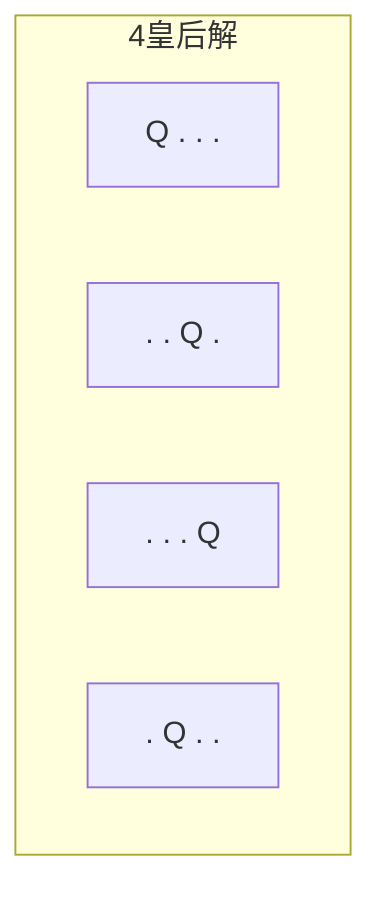
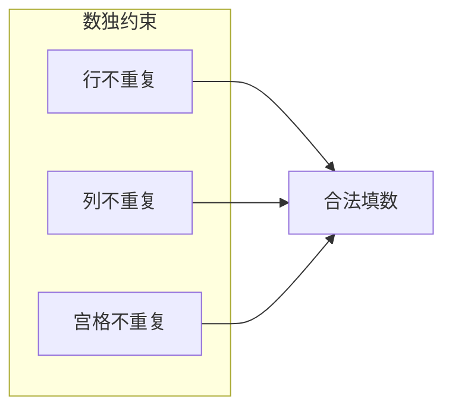
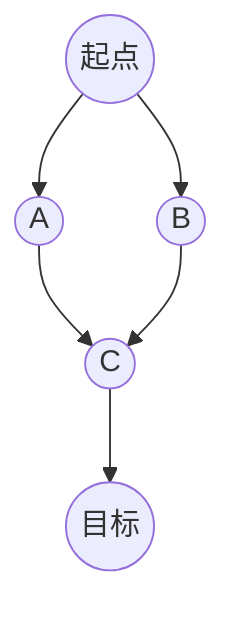

# 第9章 组合搜索

> 组合搜索通过系统地枚举与剪枝，在解空间中寻找答案。
>
> — Steven S. Skiena, The Algorithm Design Manual

[← 上一章](./ch08.md) | [目录](../index.md) | [下一章 →](./ch10.md)

---

**组合搜索**（combinatorial search）在指数级解空间中寻找满足约束的解。核心方法包括**回溯**（backtracking）、**搜索剪枝**（pruning）、**最优优先搜索**（best-first search）等。本章涵盖子集、排列、路径枚举、数独、n 皇后、**A\*** 算法等经典问题。

---

## 9.1 回溯法（Backtracking）

**回溯法**（backtracking）是一种**深度优先**的搜索策略：逐步构造解，若发现当前分支无法得到合法解则**回溯**（backtrack），尝试其他选择。

### 通用框架

```text
backtrack(部分解, 候选集):
    if 满足终止条件:
        记录或输出解
        return
    for 每个候选 c:
        if c 可行:
            将 c 加入部分解
            backtrack(更新后的部分解, 剩余候选)
            撤销 c（回溯）
```

### 构造所有子集

给定集合 $\{1, 2, \ldots, n\}$，枚举所有 $2^n$ 个子集。

```c
/* 枚举所有子集 */
void subsets(int *arr, int n, int *cur, int pos, int idx) {
    if (idx == n) {
        /* 输出 cur[0..pos-1] 作为一个子集 */
        for (int i = 0; i < pos; i++) printf("%d ", cur[i]);
        printf("\n");
        return;
    }
    /* 不选 arr[idx] */
    subsets(arr, n, cur, pos, idx + 1);
    /* 选 arr[idx] */
    cur[pos] = arr[idx];
    subsets(arr, n, cur, pos + 1, idx + 1);
}
```

```mermaid
flowchart TB
    R[""] --> A0["不选1"]
    R --> A1["选1"]
    A0 --> B0["不选2"]
    A0 --> B1["选2"]
    A1 --> B2["不选2"]
    A1 --> B3["选2"]
    B0 --> C0["不选3"]
    B0 --> C1["选3"]
    B1 --> C2["不选3"]
    B1 --> C3["选3"]
```

### 构造所有排列

给定 $n$ 个元素，枚举所有 $n!$ 种**排列**（permutation）。

```c
/* 枚举所有排列 - 交换法 */
void permutations(int *arr, int n, int k) {
    if (k == n) {
        for (int i = 0; i < n; i++) printf("%d ", arr[i]);
        printf("\n");
        return;
    }
    for (int i = k; i < n; i++) {
        swap(&arr[k], &arr[i]);
        permutations(arr, n, k + 1);
        swap(&arr[k], &arr[i]);  /* 回溯 */
    }
}
```

### 构造所有路径

在图中枚举从起点到终点的所有**简单路径**（无重复顶点）。

```c
void all_paths(Graph *g, int u, int t, int *path, int *visited, int len) {
    path[len] = u;
    if (u == t) {
        /* 输出 path[0..len] */
        return;
    }
    visited[u] = 1;
    for (Edge *e = g->adj[u].head; e; e = e->next) {
        int v = e->to;
        if (!visited[v])
            all_paths(g, v, t, path, visited, len + 1);
    }
    visited[u] = 0;  /* 回溯 */
}
```

---

## 9.2 回溯示例（Examples of Backtracking）

### 子集和（Subset Sum）

给定整数集合 $S$ 和目标 $T$，判断是否存在子集使其和为 $T$。

```c
int subset_sum(int *arr, int n, int target, int sum, int idx) {
    if (sum == target) return 1;
    if (idx == n || sum > target) return 0;
    /* 选 arr[idx] */
    if (subset_sum(arr, n, target, sum + arr[idx], idx + 1))
        return 1;
    /* 不选 arr[idx] */
    return subset_sum(arr, n, target, sum, idx + 1);
}
```

::: warning NP 完全
子集和是 **NP 完全**问题。回溯在 $n$ 较小时可行，$n$ 大时需考虑**动态规划**或**近似算法**。
:::

### n 皇后（N-Queens）

在 $n \times n$ 棋盘上放置 $n$ 个皇后，使任意两个皇后不在同一行、列、对角线上。

```c
#define N 8
int col[N], diag1[2*N-1], diag2[2*N-1];  /* 列、主对角、副对角占用 */

void nqueens(int row) {
    if (row == N) {
        /* 找到一组解 */
        return;
    }
    for (int c = 0; c < N; c++) {
        int d1 = row - c + N - 1, d2 = row + c;
        if (!col[c] && !diag1[d1] && !diag2[d2]) {
            col[c] = diag1[d1] = diag2[d2] = 1;
            nqueens(row + 1);
            col[c] = diag1[d1] = diag2[d2] = 0;  /* 回溯 */
        }
    }
}
```



### 图着色（Graph Coloring）

用 $k$ 种颜色给图顶点着色，使相邻顶点颜色不同。

```c
int color_graph(Graph *g, int *color, int k, int v) {
    if (v == g->n) return 1;
    for (int c = 0; c < k; c++) {
        int ok = 1;
        for (Edge *e = g->adj[v].head; e; e = e->next)
            if (color[e->to] == c) { ok = 0; break; }
        if (!ok) continue;
        color[v] = c;
        if (color_graph(g, color, k, v + 1)) return 1;
        color[v] = -1;  /* 回溯 */
    }
    return 0;
}
```

---

## 9.3 搜索剪枝（Search Pruning）

**剪枝**（pruning）在搜索过程中提前排除不可能产生解的分支，减少搜索空间。

### 可行性剪枝

若当前部分解已违反约束，则不再继续。

```c
/* 子集和：若 sum + 剩余元素最大值 < target，剪枝 */
int subset_sum_pruned(int *arr, int n, int target, int sum, int idx, int *suffix_sum) {
    if (sum == target) return 1;
    if (idx == n) return 0;
    if (sum + suffix_sum[idx] < target) return 0;  /* 剪枝 */
    if (sum > target) return 0;
    /* ... */
}
```

### 最优性剪枝

在求最优解时，若当前分支的**界**（bound）已劣于已知最优解，则剪枝。

```c
/* 若 当前代价 + 启发式下界 >= 已知最优，剪枝 */
if (cost + heuristic(state) >= best_so_far) return;
```

### 对称性剪枝

利用问题的对称性，避免重复搜索等价状态。

---

## 9.4 数独（Sudoku）

**数独**（Sudoku）是在 $9 \times 9$ 网格中填入 1–9，使每行、每列、每个 $3 \times 3$ 宫格内数字不重复。

### 回溯求解

```c
#define N 9
int grid[N][N];

int valid(int r, int c, int num) {
    for (int i = 0; i < N; i++)
        if (grid[r][i] == num || grid[i][c] == num) return 0;
    int br = (r/3)*3, bc = (c/3)*3;
    for (int i = br; i < br+3; i++)
        for (int j = bc; j < bc+3; j++)
            if (grid[i][j] == num) return 0;
    return 1;
}

int solve_sudoku(int r, int c) {
    if (r == N) return 1;
    if (c == N) return solve_sudoku(r + 1, 0);
    if (grid[r][c] != 0) return solve_sudoku(r, c + 1);

    for (int num = 1; num <= 9; num++) {
        if (!valid(r, c, num)) continue;
        grid[r][c] = num;
        if (solve_sudoku(r, c + 1)) return 1;
        grid[r][c] = 0;  /* 回溯 */
    }
    return 0;
}
```



::: tip 启发式
优先填**候选数最少**的空格（minimum remaining values），可显著加速求解。
:::

---

## 9.5 War Story: Covering Chessboards

::: info 实战故事
用若干**多米诺骨牌**（每块覆盖 2 个相邻格子）覆盖 $n \times n$ 棋盘，是经典的**完美覆盖**问题。可建模为二部图匹配：将棋盘黑白染色，格子为顶点，相邻关系为边，则完美覆盖等价于完美匹配。回溯可枚举所有覆盖方案，但规模大时需结合图论或组合数学。
:::

---

## 9.6 最优优先搜索（Best-First Search）

**最优优先搜索**（best-first search）根据**启发式函数** $h$ 优先扩展「最有希望」的节点，而非简单的 BFS/DFS。

### A* 算法

**A\*** 算法结合**实际代价** $g(n)$ 与**启发式估计** $h(n)$，按 $f(n) = g(n) + h(n)$ 排序扩展。

- $g(n)$：从起点到 $n$ 的实际代价
- $h(n)$：从 $n$ 到目标的估计代价（**可采纳性**：$h(n) \leq h^*(n)$，不超估）
- $f(n)$：估计的总代价

```c
/* A* 伪代码 */
typedef struct {
    int node;
    int g, h, f;  /* g + h = f */
} State;

void astar(Graph *g, int start, int goal, int (*heuristic)(int)) {
    PriorityQueue *open = pq_create();
    pq_push(open, (State){start, 0, heuristic(start), heuristic(start)});
    int *g_score = malloc(g->n * sizeof(int));
    for (int i = 0; i < g->n; i++) g_score[i] = INT_MAX;
    g_score[start] = 0;

    while (!pq_empty(open)) {
        State s = pq_pop(open);
        if (s.node == goal) { /* 找到路径 */ break; }
        if (s.g > g_score[s.node]) continue;

        for (Edge *e = g->adj[s.node].head; e; e = e->next) {
            int v = e->to;
            int g_new = s.g + e->weight;
            if (g_new < g_score[v]) {
                g_score[v] = g_new;
                int h_new = heuristic(v);
                pq_push(open, (State){v, g_new, h_new, g_new + h_new});
            }
        }
    }
}
```

### 可采纳性与一致性

- **可采纳性**（admissible）：$h(n) \leq h^*(n)$，保证 A* 找到最优解
- **一致性**（consistent）：$h(n) \leq c(n,n') + h(n')$，保证每个节点至多扩展一次

常用启发式：

- **曼哈顿距离**：$|x_1 - x_2| + |y_1 - y_2|$（网格图）
- **欧几里得距离**：$\sqrt{(x_1-x_2)^2 + (y_1-y_2)^2}$（平面）



| 算法 | 扩展顺序 | 最优性 | 适用场景 |
|------|----------|--------|----------|
| BFS | 按层 | ✓（边权相等） | 无权图最短路径 |
| Dijkstra | 按 $g$ | ✓ | 加权图最短路径 |
| 贪心最佳优先 | 按 $h$ | ✗ | 快速近似 |
| A* | 按 $g+h$ | ✓（$h$ 可采纳时） | 有启发式的路径搜索 |

---

## 9.7 War Story: Annealing Arrays

::: info 实战故事
**模拟退火**（simulated annealing）是一种随机搜索技术，通过引入「温度」参数控制接受劣解的概率，从而跳出局部最优。在数组重排、布局优化等问题中，传统回溯或贪心易陷入局部最优，模拟退火通过随机扰动与概率接受，有机会找到更好的全局解。温度随迭代逐渐降低，最终收敛。
:::

---

## 小结

| 技术 | 典型应用 |
|------|----------|
| 回溯 | 子集、排列、n 皇后、图着色、数独 |
| 剪枝 | 可行性剪枝、最优性剪枝、对称性剪枝 |
| A* | 路径规划、拼图、游戏 AI |

组合搜索是解决 NP 难问题的基本工具。结合剪枝与启发式，可在合理时间内处理中等规模实例；对大规模问题，常需近似算法或随机化方法。

---

### 导航

[← 上一章](./ch08.md) | [目录](../index.md) | [下一章 →](./ch10.md)
