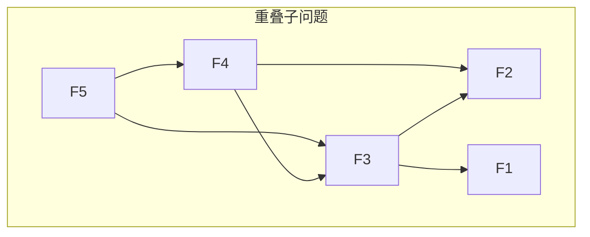
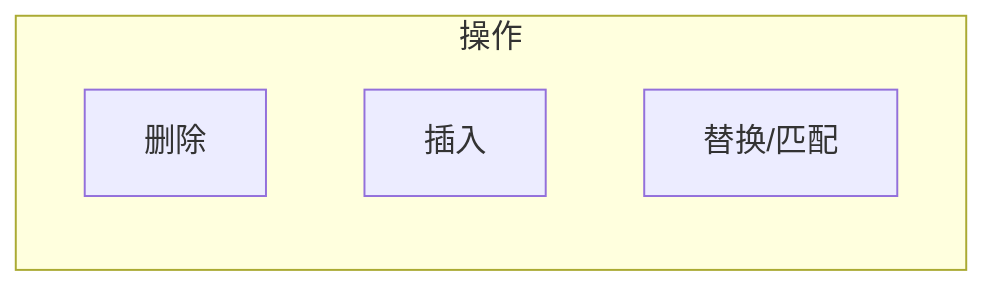
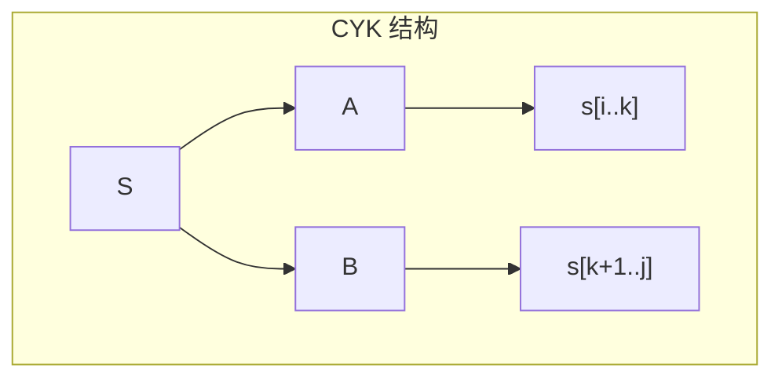

# 第10章 动态规划

> 动态规划通过将问题分解为重叠子问题，用记忆化避免重复计算。
>
> — Steven S. Skiena, The Algorithm Design Manual

[← 上一章](./ch09.md) | [目录](../index.md) | [下一章 →](./ch11.md)

---

**动态规划**（dynamic programming, DP）是解决**最优子结构**（optimal substructure）与**重叠子问题**（overlapping subproblems）的经典方法。本章涵盖**记忆化搜索**（memoization）、**自底向上**（bottom-up）DP、**编辑距离**（edit distance）、**最长递增子序列**（LIS）、**子集和**、**CYK 解析**等，并讨论 DP 的适用范围与局限。

---

## 10.1 缓存 vs 计算（Caching vs. Computation）

### 重叠子问题

**斐波那契数列**：$F_n = F_{n-1} + F_{n-2}$。朴素递归会重复计算相同子问题，例如 $F_5$ 会多次计算 $F_3$。

$$
F_n = F_{n-1} + F_{n-2}, \quad F_0 = 0, F_1 = 1
$$

```c
/* 朴素递归 - O(2^n) */
int fib_naive(int n) {
    if (n <= 1) return n;
    return fib_naive(n - 1) + fib_naive(n - 2);
}
```

### 记忆化搜索（Memoization）

**记忆化**（memoization）：在递归中缓存已计算的结果，避免重复计算。

```c
/* 记忆化 - O(n) */
int fib_memo(int n, int *memo) {
    if (n <= 1) return n;
    if (memo[n] != -1) return memo[n];
    memo[n] = fib_memo(n - 1, memo) + fib_memo(n - 2, memo);
    return memo[n];
}
```

### 自底向上 DP（Bottom-Up）

**自底向上**：按依赖顺序递推，从基础情况到目标。

```c
/* 自底向上 - O(n) 时间, O(1) 空间（可滚动） */
int fib_dp(int n) {
    if (n <= 1) return n;
    int a = 0, b = 1;
    for (int i = 2; i <= n; i++) {
        int t = a + b;
        a = b;
        b = t;
    }
    return b;
}
```



| 方法 | 时间复杂度 | 空间 | 特点 |
|------|------------|------|------|
| 朴素递归 | $O(2^n)$ | $O(n)$ 栈 | 大量重复计算 |
| 记忆化 | $O(n)$ | $O(n)$ | 按需计算 |
| 自底向上 | $O(n)$ | $O(1)$ 可优化 | 无递归开销 |

---

## 10.2 近似字符串匹配（Approximate String Matching）

**编辑距离**（edit distance / Levenshtein distance）：将字符串 $A$ 变为 $B$ 所需的最少**插入**、**删除**、**替换**操作数。

### 递推关系

设 $dp[i][j]$ 为 $A[1..i]$ 与 $B[1..j]$ 的编辑距离：

$$
dp[i][j] = \min \begin{cases}
dp[i-1][j] + 1 & \text{删除 } A[i] \\
dp[i][j-1] + 1 & \text{插入 } B[j] \\
dp[i-1][j-1] + \delta(A[i], B[j]) & \text{替换或匹配}
\end{cases}
$$

其中 $\delta(a, b) = 0$ 若 $a = b$，否则为 1。

```c
/* 编辑距离 - O(mn) */
int edit_distance(const char *a, const char *b) {
    int m = strlen(a), n = strlen(b);
    int dp[m+1][n+1];
    for (int i = 0; i <= m; i++) dp[i][0] = i;
    for (int j = 0; j <= n; j++) dp[0][j] = j;

    for (int i = 1; i <= m; i++)
        for (int j = 1; j <= n; j++) {
            int cost = (a[i-1] == b[j-1]) ? 0 : 1;
            dp[i][j] = min3(
                dp[i-1][j] + 1,      /* 删除 */
                dp[i][j-1] + 1,      /* 插入 */
                dp[i-1][j-1] + cost  /* 替换 */
            );
        }
    return dp[m][n];
}
```



::: tip 空间优化
可用两行数组滚动，将空间降至 $O(\min(m,n))$。
:::

---

## 10.3 最长递增子序列（Longest Increasing Subsequence）

**最长递增子序列**（LIS）：在序列 $a_1, a_2, \ldots, a_n$ 中找最长的严格递增子序列。

### $O(n^2)$ DP

$dp[i]$：以 $a_i$ 结尾的 LIS 长度。

$$
dp[i] = 1 + \max\{dp[j] : j < i, a_j < a_i\}
$$

```c
/* LIS - O(n^2) */
int lis(int *a, int n) {
    int *dp = malloc(n * sizeof(int));
    for (int i = 0; i < n; i++) {
        dp[i] = 1;
        for (int j = 0; j < i; j++)
            if (a[j] < a[i] && dp[j] + 1 > dp[i])
                dp[i] = dp[j] + 1;
    }
    int ans = 0;
    for (int i = 0; i < n; i++)
        if (dp[i] > ans) ans = dp[i];
    free(dp);
    return ans;
}
```

### $O(n \log n)$ 贪心 + 二分

维护「长度为 $k$ 的递增子序列的最小末尾元素」数组 $tail$，对每个 $a_i$ 二分查找插入位置。

```c
/* LIS - O(n log n) */
int lis_fast(int *a, int n) {
    int *tail = malloc((n + 1) * sizeof(int));
    int len = 0;
    for (int i = 0; i < n; i++) {
        int lo = 0, hi = len;
        while (lo < hi) {
            int mid = (lo + hi) / 2;
            if (tail[mid] < a[i]) lo = mid + 1;
            else hi = mid;
        }
        tail[lo] = a[i];
        if (lo == len) len++;
    }
    free(tail);
    return len;
}
```

---

## 10.4 War Story: Text Compression for Bar Codes

::: info 实战故事
条形码压缩需要将文本映射为可变长编码，使总长度最小。不同字符出现频率不同，**霍夫曼编码**（Huffman coding）可得到最优前缀码。但若编码长度受约束（如最多 $k$ 位），则需 DP：$dp[i]$ 表示前 $i$ 个字符的最优压缩长度，转移时枚举最后一段的划分。将压缩问题建模为 DP，结合字符频率与约束，得到实用压缩方案。
:::

---

## 10.5 无序分区与子集和（Unordered Partition or Subset Sum）

### 子集和（Subset Sum）

给定正整数集合 $S$ 和目标 $T$，判断是否存在子集和为 $T$。

**DP**：$dp[i][j]$ 表示前 $i$ 个元素能否得到和 $j$。

$$
dp[i][j] = dp[i-1][j] \lor dp[i-1][j - a_i]
$$

```c
/* 子集和 - O(nT) */
int subset_sum_dp(int *a, int n, int target) {
    int *dp = calloc(target + 1, sizeof(int));
    dp[0] = 1;
    for (int i = 0; i < n; i++)
        for (int j = target; j >= a[i]; j--)
            if (dp[j - a[i]]) dp[j] = 1;
    int ans = dp[target];
    free(dp);
    return ans;
}
```

### 无序分区（Partition）

将集合划分为两个子集，使两子集和相等。等价于子集和 $T = \frac{\sum a_i}{2}$。

::: warning 伪多项式
子集和 DP 复杂度 $O(nT)$，$T$ 为数值大小。当 $T$ 很大时是指数级，问题本质仍为 **NP 完全**。
:::

---

## 10.6 War Story: The Balance of Power

::: info 实战故事
在政治或资源分配中，常需将群体划分为两派，使双方「力量」尽可能平衡。可建模为**划分问题**：给定权重，找划分使两子集和之差最小。DP 可求最优划分，但大规模实例需启发式或近似算法。
:::

---

## 10.7 上下文无关文法解析（Parsing Context-Free Grammars）

**上下文无关文法**（CFG）由产生式定义，如 $S \to AB \mid a$。**CYK 算法**（Cocke-Younger-Kasami）用 DP 在 $O(n^3)$ 时间内判断字符串是否由给定 CFG 生成。

### CYK 算法

$dp[i][j][X]$：子串 $s[i..j]$ 能否由非终结符 $X$ 推导出。

$$
dp[i][j][X] = \bigvee_{X \to YZ} \bigvee_{k=i}^{j-1} \left( dp[i][k][Y] \land dp[k+1][j][Z] \right)
$$

```c
/* CYK 简化版 - 判断 s 是否可由 S 推导 */
int cyk(char *s, int n, CFG *grammar) {
    /* dp[i][j] = 可推导出 s[i..j] 的非终结符集合 */
    for (int len = 1; len <= n; len++)
        for (int i = 0; i + len <= n; i++) {
            int j = i + len - 1;
            if (len == 1) {
                /* 单字符：查 A -> s[i] 的产生式 */
            } else {
                /* 多字符：枚举分割点 k，查 A -> BC */
                for (int k = i; k < j; k++)
                    /* 若 B 可推导 s[i..k] 且 C 可推导 s[k+1..j]，则 A 可推导 s[i..j] */
            }
        }
    return S in dp[0][n-1];
}
```



---

## 10.8 动态规划的局限性（Limitations of Dynamic Programming）

### 最优子结构（Optimal Substructure）

问题的最优解包含子问题的最优解。若子问题最优解无法组合出原问题最优解，则 DP 不适用。

**反例**：**最长简单路径**（longest simple path）在一般图中无最优子结构：$u \to v$ 的最长路径不一定包含 $u \to w$ 的最长路径（可能重复经过 $w$）。

### 重叠子问题（Overlapping Subproblems）

不同递归路径会到达相同子问题。若子问题互不重叠，则直接分治即可，无需 DP。

| 性质 | 分治 | DP |
|------|------|-----|
| 最优子结构 | ✓ | ✓ |
| 重叠子问题 | ✗ | ✓ |

### 状态空间

DP 的状态数决定了复杂度。若状态呈指数增长（如子集枚举），则 DP 可能不可行，需考虑**状态压缩**或**近似**。

---

## 10.9 War Story: Genome Sequence Comparison

::: info 实战故事
**基因组序列比对**（sequence alignment）是生物信息学核心问题。两段 DNA 序列可通过插入**空位**（gap）对齐，**编辑距离**或其变体（如带权替换、空位罚分）可衡量相似度。DP 在 $O(mn)$ 内求最优比对，是 BLAST、Needleman-Wunsch 等工具的基础。大规模基因组比较还需启发式与索引加速。
:::

---

## 10.10 核心动态规划问题（The Core Dynamic Programming Problem）

DP 的通用模式可抽象为：

1. **定义状态**：明确 $dp[\cdot]$ 表示什么
2. **写出转移**：用更小的子问题表示当前状态
3. **确定顺序**：保证计算 $dp[i]$ 时依赖项已计算
4. **处理边界**：基础情况的初值


### 常见 DP 类型

| 类型 | 典型问题 |
|------|----------|
| 线性 DP | 斐波那契、LIS、最大子段和 |
| 区间 DP | 矩阵链乘、回文划分 |
| 背包 DP | 0-1 背包、完全背包 |
| 状态压缩 DP | 旅行商（TSP）、棋盘覆盖 |
| 树形 DP | 树上最大独立集、直径 |

### 实现技巧

- **滚动数组**：若 $dp[i]$ 只依赖 $dp[i-1]$ 等有限行，可压缩空间
- **记忆化 vs 递推**：记忆化代码简洁，递推常数更小、易优化
- **打印方案**：在转移时记录**决策**（如从哪个状态转移而来），最后逆推

---

## 小结

| 问题 | 复杂度 | 关键思想 |
|------|--------|----------|
| 斐波那契 | $O(n)$ | 记忆化 / 递推 |
| 编辑距离 | $O(mn)$ | 插入、删除、替换 |
| LIS | $O(n^2)$ 或 $O(n \log n)$ | 以 $a_i$ 结尾 / 贪心+二分 |
| 子集和 | $O(nT)$ | 背包式 DP |
| CYK 解析 | $O(n^3)$ | 区间 DP |

动态规划是算法设计的核心工具。识别最优子结构与重叠子问题，设计状态与转移，是掌握 DP 的关键。同时需注意其适用范围，避免误用于不具备这些性质的问题。

---

### 导航

[← 上一章](./ch09.md) | [目录](../index.md) | [下一章 →](./ch11.md)
