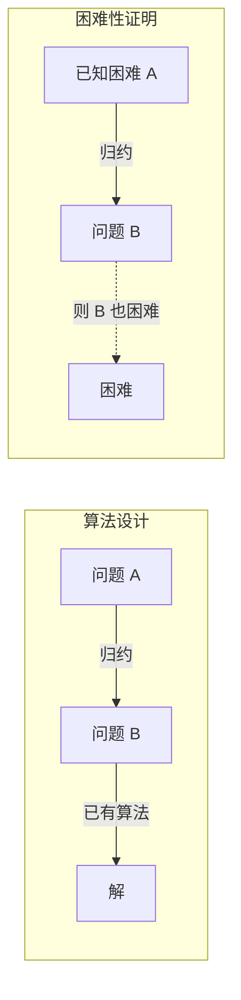
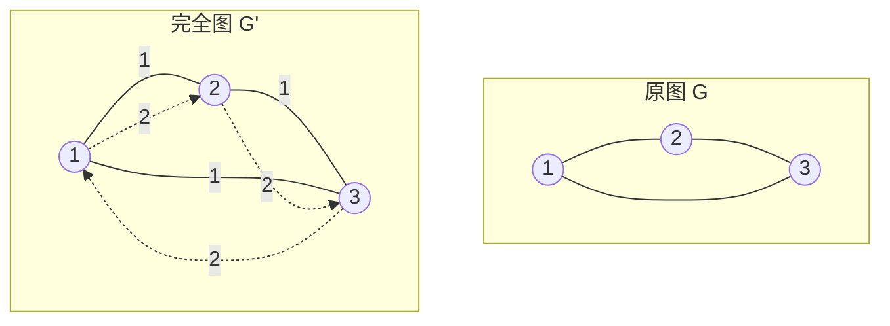
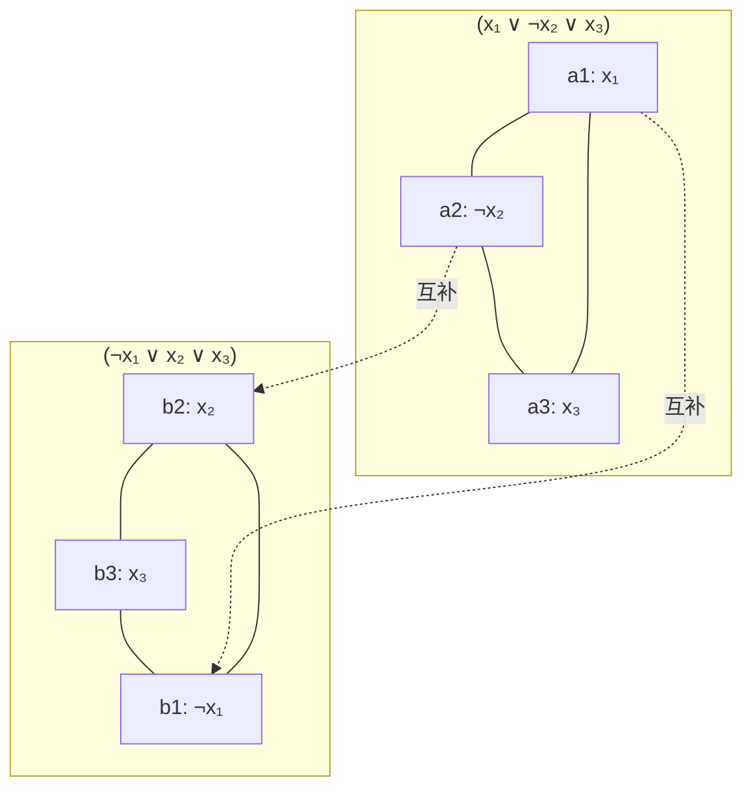
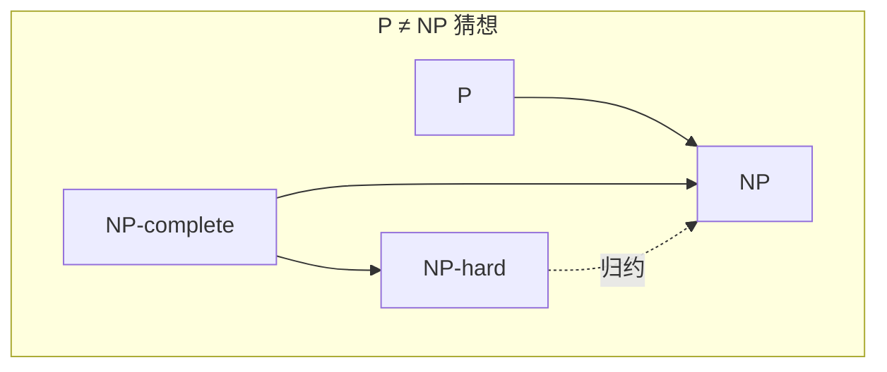
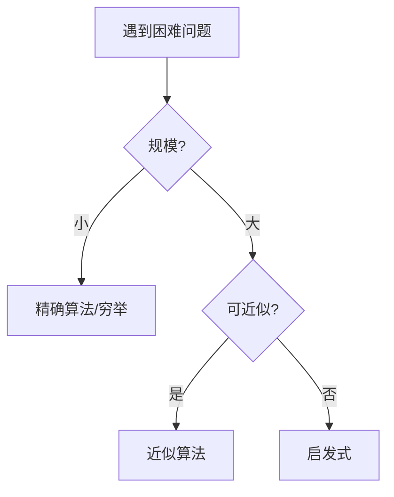

# 第11章 NP 完全性

> 知道问题是困难的，与知道如何解决它同样重要。
>
> — Steven S. Skiena, The Algorithm Design Manual

[← 上一章](./ch10.md) | [目录](../index.md) | [下一章 →](./ch12.md)

---

**NP 完全性**（NP-completeness）是计算复杂性理论的核心概念，用于刻画一类在计算上「困难」的问题。本章介绍问题归约、**Cook-Levin 定理**、从 **SAT** 到各类经典问题的归约，以及 P vs. NP 猜想。理解 NP 完全性有助于在遇到困难问题时做出正确决策：是寻找精确算法、近似算法，还是启发式方法。

---

## 11.1 问题与归约（Problems and Reductions）

### 归约的核心思想

**归约**（reduction）是将一个问题的实例转化为另一个问题实例的技术。若问题 $A$ 可归约到问题 $B$（记作 $A \leq_p B$），则：

- 求解 $B$ 的算法可用来求解 $A$
- 若 $B$ 是困难的，则 $A$ 至少同样困难

$$
A \leq_p B \Rightarrow \text{若 } B \in P \text{，则 } A \in P
$$

::: info 多项式时间归约
我们关注**多项式时间归约**（polynomial-time reduction）：转化过程本身在多项式时间内完成。这样，若 $B$ 有多项式时间算法，则 $A$ 也有。
:::

### 归约的两种用途

| 用途 | 方向 | 含义 |
|------|------|------|
| **算法设计** | $A \leq_p B$ | 用已知的 $B$ 算法求解 $A$ |
| **困难性证明** | $A \leq_p B$ | 若 $A$ 困难，则 $B$ 也困难 |

---

## 11.2 用于设计算法的归约（Reductions for Algorithms）

归约可用于**简化问题**，将新问题转化为已有高效算法的问题。

### 最近邻 → 排序

**最近邻**（nearest neighbor）问题：给定点集 $P$，对每个点找最近邻。可归约到**排序**：

1. 按 $x$ 坐标排序
2. 对每个点，只需在排序序列中检查相邻点（在满足某些条件下）

更一般地，若问题具有「局部性」，排序可减少候选数量。

### 最短路径 → 矩阵乘法

**全源最短路径**（all-pairs shortest paths）可归约到**矩阵乘法**：

- 将边权视为矩阵元素，$A[i][j] = w(i,j)$ 或 $\infty$
- 定义「min-plus」矩阵乘法：$(A \star B)_{i,j} = \min_k (A_{i,k} + B_{k,j})$
- $n$ 次自乘得到 $n$ 步内的最短路径

$$
\text{Dist}^{(n)} = A^n \quad \text{（min-plus 意义下）}
$$

::: tip 归约的价值
归约使我们能复用已有算法。若你发现新问题与某经典问题等价，可直接采用该问题的成熟实现。
:::

---

## 11.3 基本困难性归约（Elementary Hardness Reductions）

### 哈密顿路径 → TSP

**哈密顿路径**（Hamiltonian Path）：给定图 $G$，是否存在访问每个顶点恰好一次的路径？

**旅行商问题**（TSP, Traveling Salesman Problem）：给定带权完全图，求访问所有顶点并返回起点的最短回路。

**归约**：给定图 $G = (V, E)$，构造完全图 $G'$：若 $(u,v) \in E$ 则 $w(u,v) = 1$，否则 $w(u,v) = 2$。则 $G$ 有哈密顿路径当且仅当 $G'$ 存在长度为 $n$ 的 TSP 回路（$n = |V|$）。

::: warning 归约方向
哈密顿路径 $\leq_p$ TSP：我们将「判定问题」归约到「优化问题」。通常先考虑判定版本（是否存在解），再考虑优化版本（找最优解）。
:::

---

## 11.4 可满足性问题（Satisfiability）

### 布尔可满足性（SAT）

**SAT 问题**：给定布尔公式 $\phi$（由变量、$\land$、$\lor$、$\neg$ 组成），是否存在变量赋值使 $\phi$ 为真？

例如：$\phi = (x_1 \lor x_2) \land (\neg x_1 \lor x_2) \land (x_1 \lor \neg x_2)$，赋值 $x_1 = 1, x_2 = 1$ 满足 $\phi$。

### Cook-Levin 定理

**Cook-Levin 定理**（1971）：**SAT 是 NP 完全的**（SAT is NP-complete）。

即：任何 **NP** 中的问题都可多项式时间归约到 SAT。因此 SAT 是「最难」的 NP 问题之一：若 SAT 有多项式时间算法，则所有 NP 问题都有。

$$
\forall L \in \text{NP}: \quad L \leq_p \text{SAT}
$$

### 证明思路

对任意 NP 问题 $L$，其「证书验证」可在多项式时间内完成。将验证过程编码为**布尔电路**，则「存在证书使验证通过」等价于该电路对应的布尔公式可满足。

---

## 11.5 从 SAT 的创造性归约（Creative Reductions from SAT）

一旦 SAT 被证明为 NP 完全，我们可通过将 SAT 归约到新问题来证明新问题的 NP 完全性。

### 3-SAT → 独立集

**3-SAT**：每个子句恰好 3 个文字的 **CNF** 可满足性。3-SAT 是 NP 完全的（由 SAT 归约）。

**独立集**（Independent Set）：给定图 $G$ 和整数 $k$，是否存在大小为 $k$ 的顶点子集，其中任意两点不相邻？

**归约**：对 3-SAT 实例 $\phi$，构造图 $G$：

- 每个子句的 3 个文字对应 3 个顶点，形成三角形
- 若两个顶点对应的文字**互补**（如 $x$ 与 $\neg x$），则连边
- 设子句数为 $m$，则 $\phi$ 可满足当且仅当 $G$ 有大小为 $m$ 的独立集

### 3-SAT → 顶点覆盖

**顶点覆盖**（Vertex Cover）：给定图 $G$ 和整数 $k$，是否存在大小为 $k$ 的顶点子集，使每条边至少有一端在该子集中？

**关键性质**：$S$ 是独立集 $\Leftrightarrow$ $V \setminus S$ 是顶点覆盖。故独立集 $\leq_p$ 顶点覆盖（取 $k' = n - k$）。

### 3-SAT → 图着色

**图着色**（Graph Coloring）：给定图 $G$ 和颜色数 $k$，是否存在 $k$-着色使相邻顶点颜色不同？

3-SAT 可归约到 3-着色：通过构造「子句-变量」图，使可满足性对应 3-着色存在性。

---

## 11.6 证明困难性的艺术（The Art of Proving Hardness）

### 选择源问题

从**最接近**的已知 NP 完全问题出发：

| 目标问题 | 推荐源问题 |
|----------|------------|
| 图问题 | 3-SAT、独立集、顶点覆盖、哈密顿路径 |
| 数值/背包类 | 子集和、背包 |
| 调度类 | 3-SAT、划分 |

### 归约设计技巧

1. **局部替换**：将源问题的每个「单元」替换为目标问题的结构
2. **组件设计**：设计「选择组件」「约束组件」等
3. **保持等价**：源问题有解 $\Leftrightarrow$ 目标问题有解

::: tip 归约的简洁性
好的归约应**简洁**：转化是多项式时间，且「有解」的等价性容易证明。过于复杂的归约容易出错。
:::

---

## 11.7 War Story: Hard Against the Clock

::: info 实战故事
在算法竞赛中遇到一个图问题，初看像是最短路径。尝试了 Dijkstra、Floyd 后均无法处理约束。重新审视问题定义，发现本质是**带约束的哈密顿路径**变种。通过归约到 TSP，确认了问题的 NP 完全性。最终采用**启发式**：用 2-opt 局部搜索在限定时间内求近似解，而非追求精确解。教训：**先识别问题复杂度，再选择策略**。
:::

---

## 11.8 P vs. NP

### 复杂度类定义

| 类 | 定义 |
|----|------|
| **P** | 存在多项式时间算法求解的**判定问题** |
| **NP** | 存在多项式时间**验证**的判定问题（给定证书，可快速验证） |
| **NP-hard** | 所有 NP 问题可归约到它（至少与 NP 一样难） |
| **NP-complete** | 既在 NP 中，又是 NP-hard |

$$
\text{P} \subseteq \text{NP}, \quad \text{NP-complete} = \text{NP} \cap \text{NP-hard}
$$

### P ≠ NP 猜想

**P vs. NP 问题**：P 是否等于 NP？即，所有可快速验证的解是否也可快速求解？

- 若 **P = NP**：许多困难问题将迎刃而解，密码学等将受冲击
- 若 **P ≠ NP**（广泛相信）：存在本质困难问题，需近似、启发式等

::: warning 实践意义
无论 P 与 NP 关系如何，**当前**我们无法对 NP 完全问题设计多项式时间精确算法。因此，识别 NP 完全性后，应转向近似、启发式或参数化算法。
:::

---

## 11.9 处理 NP 完全问题（Dealing with NP-complete Problems）

面对 NP 完全问题，可选策略包括：

| 策略 | 适用场景 | 示例 |
|------|----------|------|
| **小规模穷举** | $n$ 很小（如 $\leq 20$） | 回溯、分支限界 |
| **近似算法** | 允许近似解 | 顶点覆盖 2-近似、TSP 近似 |
| **启发式** | 实际应用、无理论保证 | 贪心、局部搜索、模拟退火 |
| **参数化算法** | 某参数小 | 以 $k$ 为参数的 FPT 算法 |
| **特殊结构** | 问题有特殊性质 | 平面图、二分图上的多项式算法 |

---

## 小结

| 概念 | 要点 |
|------|------|
| 归约 | $A \leq_p B$：用 $B$ 解 $A$，或由 $A$ 难推出 $B$ 难 |
| Cook-Levin | SAT 是 NP 完全的，所有 NP 问题可归约到 SAT |
| 证明 NP 完全 | 从已知 NP 完全问题归约，保持「有解」等价 |
| P vs. NP | P ⊆ NP，是否相等未解决；实践中按 P ≠ NP 处理 |
| 应对策略 | 穷举、近似、启发式、参数化、利用特殊结构 |

理解 NP 完全性，能帮助你在算法设计中做出明智选择：何时追求最优，何时接受近似或启发式解。

---

### 导航

[← 上一章](./ch10.md) | [目录](../index.md) | [下一章 →](./ch12.md)
