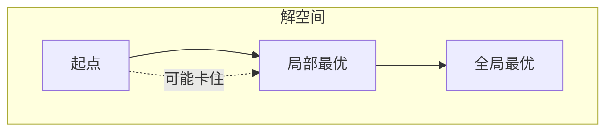
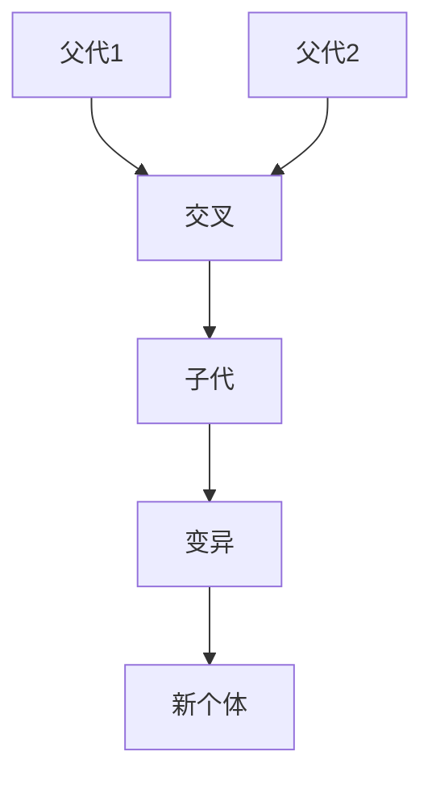
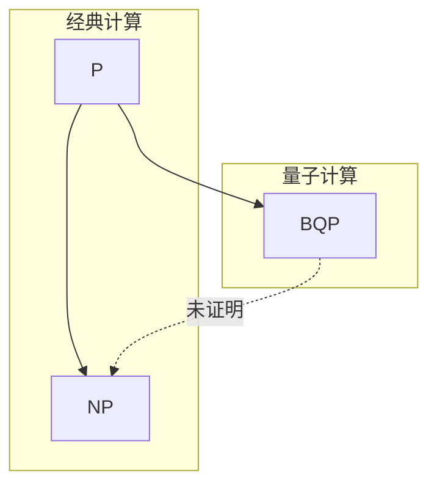

# 第12章 处理困难问题

> 当精确解不可行时，我们寻求足够好的解。
>
> — Steven S. Skiena, The Algorithm Design Manual

[← 上一章](./ch11.md) | [目录](../index.md) | [下一章 →](./ch13.md)

---

面对 **NP 完全**问题，精确算法往往不可行。本章介绍多种**实用策略**：**近似算法**（有理论保证）、**启发式搜索**（局部搜索、模拟退火、遗传算法），以及**量子计算**的简要展望。这些方法在实践中能有效处理大规模困难问题。

---

## 12.1 近似算法（Approximation Algorithms）

**近似算法**（approximation algorithm）在多项式时间内给出解，并保证解与最优解的比值有界。

### 近似比

设最优解为 $OPT$，近似解为 $A$。对**最小化**问题，**近似比**（approximation ratio）为：

$$
\rho = \frac{A}{OPT} \geq 1
$$

$\rho$-近似算法保证 $A \leq \rho \cdot OPT$。对**最大化**问题，$\rho = OPT/A \geq 1$。

### 顶点覆盖 2-近似

**顶点覆盖**（Vertex Cover）：求最小顶点集，使每条边至少有一端被覆盖。

**贪心 2-近似算法**：

```c
VertexCover2Approx(G):
    C = ∅
    while G 仍有边:
        任选一条边 (u, v)
        将 u, v 加入 C
        从 G 中移除 u, v 及其所有关联边
    return C
```

**正确性**：每条被选边至少需要 1 个顶点覆盖，我们选 2 个。设选边数为 $k$，则 $|C| = 2k$，而 $OPT \geq k$（最优解至少覆盖这 $k$ 条边）。故 $|C| \leq 2 \cdot OPT$。

```mermaid
flowchart LR
    subgraph 选边过程
        e1[(u1,v1)] --> e2[(u2,v2)] --> e3[(u3,v3)]
    end
    C[C = {u1,v1,u2,v2,u3,v3}]
```

### TSP 近似

**度量 TSP**（满足三角不等式）：$d(u,w) \leq d(u,v) + d(v,w)$。

**2-近似**：求最小生成树 MST，按 DFS 遍历得到访问序列，跳过已访问顶点（shortcut）得到哈密顿回路。

$$
\text{TSP}_{\text{approx}} \leq 2 \cdot \text{MST} \leq 2 \cdot \text{OPT}
$$

::: info 度量 TSP 的特殊性
一般 TSP（不满足三角不等式）**不存在**常数近似比的多项式算法（除非 P = NP）。度量 TSP 的 2-近似是经典结果。
:::

---

## 12.2 War Story: Approximating the Good

::: info 实战故事
某物流公司需要优化配送路线，本质是**车辆路径问题**（VRP）的变种。精确求解不可行（规模数千客户）。采用**聚类 + TSP 近似**：先将客户按区域聚类，每个区域用 2-近似 TSP 求子路线，再调整跨区域顺序。最终得到的路线比人工规划节省约 15% 里程，且运行时间可接受。近似算法在工业界应用广泛，关键在于**问题建模**与**近似比-效率权衡**。
:::

---

## 12.3 启发式搜索方法（Heuristic Search Methods）

**启发式**（heuristic）无理论保证，但在实践中往往有效。

### 随机采样（Random Sampling）

随机生成多个候选解，取最优者。

```c
RandomSearch(problem, trials):
    best = ∞
    for i = 1 to trials:
        sol = random_solution(problem)
        if cost(sol) < best:
            best = cost(sol)
            best_sol = sol
    return best_sol
```

适用于解空间大、随机解有一定质量的场景。

### 局部搜索（Local Search）

从初始解出发，反复移动到**邻居**中更优的解，直到无法改进。

**邻居**（neighbor）：通过小改动得到的解。例如 TSP 中，交换两条边（2-opt）、反转一段路径等。

```c
LocalSearch(initial_sol):
    current = initial_sol
    while true:
        neighbor = best_improving_neighbor(current)
        if cost(neighbor) >= cost(current):
            return current
        current = neighbor
```

### 爬山法（Hill Climbing）

局部搜索的别称。**问题**：易陷入**局部最优**（local optimum），无法到达全局最优。



::: warning 局部最优
爬山法无法保证全局最优。结合**随机重启**、**模拟退火**等方法可缓解。
:::

---

## 12.4 模拟退火（Simulated Annealing）

**模拟退火**（Simulated Annealing）源于物理中金属退火过程：高温时原子随机移动，缓慢降温后趋于稳定态。

### 基本框架

```c
SimulatedAnnealing(initial_sol, T0, alpha, k_max):
    current = initial_sol
    T = T0
    for k = 1 to k_max:
        neighbor = random_neighbor(current)
        Δ = cost(neighbor) - cost(current)
        if Δ ≤ 0 or random() < exp(-Δ / T):
            current = neighbor
        T = alpha * T  // 降温
    return current
```

### 接受概率

- $\Delta \leq 0$：一定接受（改进解）
- $\Delta > 0$：以概率 $e^{-\Delta/T}$ 接受（**Metropolis 准则**）

$$
P(\text{接受}) = \min\left(1, e^{-\Delta/T}\right)
$$

高温时易接受劣解，低温时趋于贪心。

### 温度调度

| 策略 | 描述 |
|------|------|
| **几何降温** | $T_{k+1} = \alpha T_k$，$\alpha \approx 0.95$ |
| **线性降温** | $T_k = T_0 (1 - k/K)$ |
| **自适应** | 根据接受率调整 |


---

## 12.5 War Story: Only it is Not a Radio

::: info 实战故事
某电路设计问题需要放置元件使总连线最短，本质是**平面布局**优化。尝试了贪心、局部搜索，均易陷入差解。改用**模拟退火**：初始高温允许大幅移动，逐渐降温后解趋于稳定。关键调参：初始温度需足够高（接受率约 80%），降温速度不宜过快。最终布局比初始随机解优 30% 以上。模拟退火在**组合优化**中应用广泛，尤其当解空间结构复杂时。
:::

---

## 12.6 遗传算法与其他启发式（Genetic Algorithms and Other Heuristics）

### 遗传算法（Genetic Algorithm）

**遗传算法**（GA）模拟自然选择：维护**种群**，通过**选择**、**交叉**、**变异**产生新解。

```c
GeneticAlgorithm(population_size, generations):
    P = random_population(population_size)
    for g = 1 to generations:
        P' = select(P)           // 按适应度选择
        P'' = crossover(P')      // 交叉产生子代
        P''' = mutate(P'')       // 随机变异
        P = P'''
    return best(P)
```

**关键操作**：

- **编码**：解表示为染色体（如 TSP 中为排列）
- **适应度**：目标函数值（最小化时取负或倒数）
- **交叉**：如部分映射交叉（PMX）、顺序交叉（OX）
- **变异**：随机交换、反转等



### 其他启发式

| 方法 | 思想 |
|------|------|
| **禁忌搜索**（Tabu Search） | 禁止近期访问过的解，避免循环 |
| **蚁群算法**（ACO） | 模拟蚂蚁觅食，信息素引导搜索 |
| **粒子群**（PSO） | 粒子在解空间中移动，受个体与全局最优吸引 |

::: tip 启发式选择
无免费午餐定理：没有万能启发式。根据问题特性选择：连续优化常用 PSO、GA；组合优化常用模拟退火、禁忌搜索。
:::

---

## 12.7 量子计算（Quantum Computing）

### 简要介绍

**量子计算**利用量子力学特性（叠加、纠缠）进行并行计算。**量子比特**（qubit）可处于叠加态，$n$ 个量子比特可表示 $2^n$ 个状态的叠加。

### 与 NP 问题的关系

- **Shor 算法**：可在量子计算机上多项式时间分解大整数，威胁 RSA 等密码
- **Grover 算法**：非结构化搜索的二次加速，$O(\sqrt{N})$ 而非 $O(N)$
- **NP 完全问题**：目前**没有**证明量子计算机可多项式时间求解 NP 完全问题；BQP（有界错误量子多项式时间）与 NP 的关系尚未明确



::: info 当前状态
量子计算机仍处于早期，实用规模有限。算法设计者当前仍以经典近似与启发式为主，量子计算作为未来可能的方向。
:::

---

## 12.8 War Story: Annealing Arrays

::: info 实战故事
某 VLSI 布局问题需要将电路模块放置到网格上，最小化总连线长度与拥塞。问题规模数千模块，精确求解不可行。采用**模拟退火**：将每个模块的坐标作为变量，邻域定义为交换两模块位置或移动单模块。通过精心设计温度调度和邻域大小，在数小时内得到高质量解。与商业工具对比，自研退火在某些实例上更优。**教训**：针对问题定制邻域和参数，比通用实现更有效。
:::

---

## 小结

| 方法 | 保证 | 适用场景 |
|------|------|----------|
| 近似算法 | 近似比有界 | 顶点覆盖、度量 TSP、某些覆盖问题 |
| 局部搜索 | 无 | 快速改进初始解 |
| 模拟退火 | 渐近收敛到最优（理论上） | 组合优化、易陷入局部最优的问题 |
| 遗传算法 | 无 | 解空间大、可自然编码的问题 |
| 随机采样 | 无 | 快速获得可行解 |

处理困难问题的艺术在于：**理解问题结构**，**选择合适方法**，**权衡解质量与计算成本**。

---

## 扩展阅读

- **近似算法**：Vazirani《Approximation Algorithms》是经典教材
- **模拟退火**：Kirkpatrick et al. (1983) 首次将退火引入组合优化
- **遗传算法**：Holland《Adaptation in Natural and Artificial Systems》奠定基础
- **PTAS**：某些问题存在**多项式时间近似方案**（PTAS），可任意逼近最优

## 思考与练习

1. 证明顶点覆盖的贪心 2-近似算法的时间复杂度为 $O(|E|)$
2. 对度量 TSP，设计基于 MST 的 2-近似算法并分析近似比
3. 实现一个简单的模拟退火求解 TSP，比较不同温度调度的影响

---

### 导航

[← 上一章](./ch11.md) | [目录](../index.md) | [下一章 →](./ch13.md)
