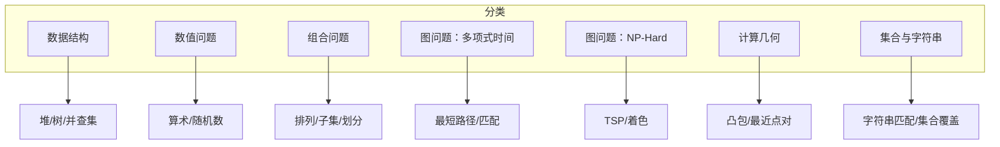
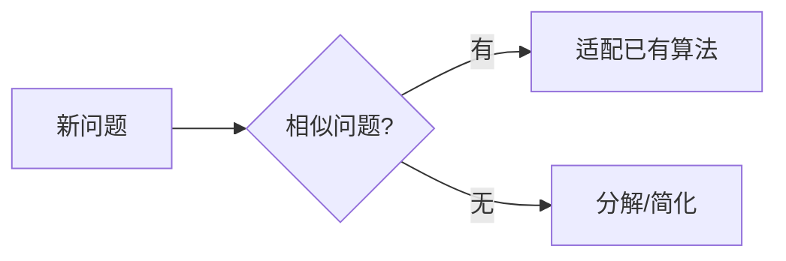
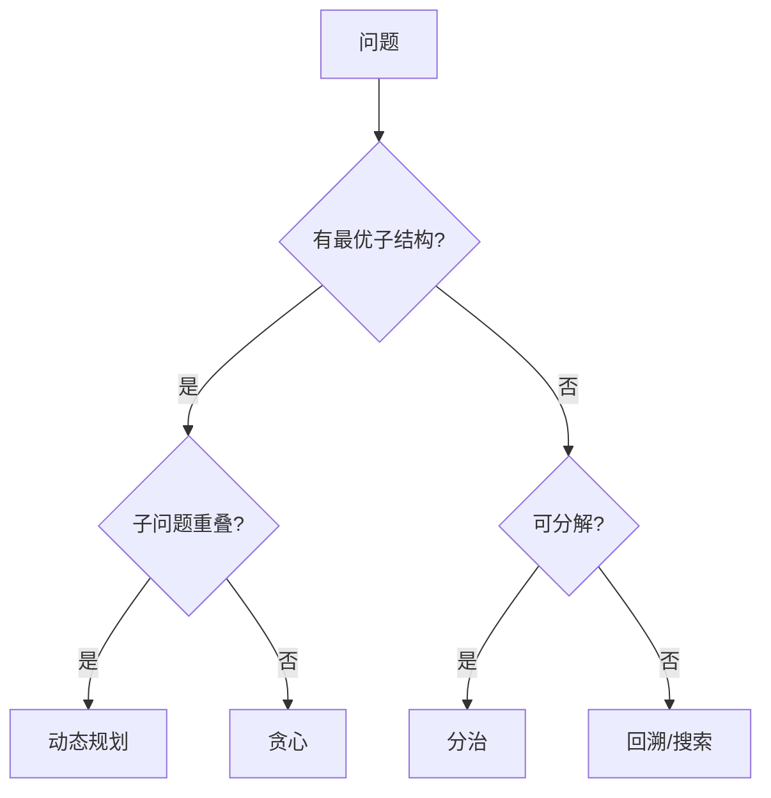
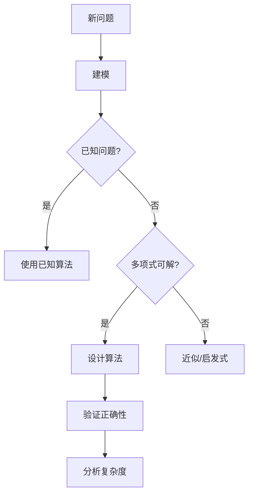
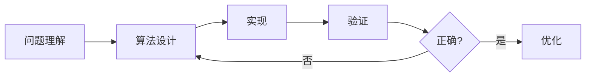

# 第13章 如何设计算法

> 算法设计是一门艺术，需要系统的方法与大量练习。
>
> — Steven S. Skiena, The Algorithm Design Manual

[← 上一章](./ch12.md) | [目录](../index.md) | [Part II →](../part2/ch14.md)

---

本章是 **Part I 实用算法设计**的总结，为 **Part II 算法问题目录**做铺垫。我们回顾算法设计的方法论：如何识别问题类型、选择合适范式、以及应对 NP 困难问题。同时介绍技术面试准备的要点。

---

## 13.1 技术面试准备（Preparing for Tech Company Interviews）

### 面试中的算法题

技术公司面试常考察：

- **问题理解**：能否清晰定义输入、输出、约束
- **思路与沟通**：边思考边表达，展示解题过程
- **代码实现**：正确、清晰、考虑边界
- **复杂度分析**：时间、空间复杂度及优化思路

### 准备建议

| 方面 | 建议 |
|------|------|
| **基础** | 熟练掌握排序、搜索、图遍历、DP 等 |
| **练习** | 按问题类型分类练习，而非随机刷题 |
| **模拟** | 限时、白板/共享屏幕，模拟真实面试 |
| **问题目录** | 熟悉本书 Part II 的问题分类与典型解法 |

::: tip 面试策略
先确认问题理解正确，再给出暴力解，然后逐步优化。与面试官沟通假设和思路，比沉默编码更重要。
:::

---

## 13.2 算法问题分类（A Catalog of Algorithmic Problems）

Part II 将按以下结构组织**算法问题目录**：

### 问题索引的价值

- **快速定位**：根据问题描述找到相似已知问题
- **解法参考**：每个问题附典型算法与复杂度
- **归约关系**：理解问题间的归约，便于证明困难性

---

## 13.3 算法设计方法论（Approaches to Algorithm Design）

### 1. 考虑相似问题（Consider Similar Problems）

遇到新问题时，先问：**是否有已知的相似问题？**

| 新问题 | 相似问题 | 可能解法 |
|--------|----------|----------|
| 最短路径（带负权） | 最短路径（非负权） | Bellman-Ford |
| 最长递增子序列 | 最长公共子序列 | DP |
| 任务调度（带截止时间） | 区间调度 | 贪心/DP |

### 2. 简化与特殊化（Simplify and Specialize）

- **简化**：忽略部分约束，先解简化版
- **特殊化**：考虑 $n$ 很小、图是树、数组已排序等特殊情况
- **推广**：从特殊解推广到一般情况

::: info 小规模优先
对 $n=1,2,3$ 手工求解，往往能揭示问题结构，引导正确思路。
:::

### 3. 考虑输入表示（Consider the Input Representation）

不同的输入表示适合不同算法：

| 表示 | 适用场景 | 示例 |
|------|----------|------|
| 数组/列表 | 顺序访问、索引 | 排序、二分查找 |
| 图（邻接表/矩阵） | 关系、连接 | 遍历、最短路径 |
| 树 | 层次、递归结构 | 遍历、DP on tree |
| 字符串 | 序列、模式 | 匹配、编辑距离 |

**重新表示**有时能简化问题。例如：将区间调度转化为端点事件序列。

### 4. 选择算法范式（Which Paradigm Fits?）

| 范式 | 适用特征 | 典型复杂度 |
|------|----------|------------|
| **贪心** | 局部最优即全局最优、拟阵结构 | $O(n \log n)$ 等 |
| **分治** | 可独立分解、可合并 | $O(n \log n)$ |
| **动态规划** | 重叠子问题、最优子结构 | $O(n^2)$ 等 |
| **回溯/搜索** | 解空间枚举、剪枝 | $O(2^n)$ 等 |

### 5. 问题是否为 NP-hard？（Is the Problem NP-hard?）

若问题疑似 **NP 完全**或 **NP-hard**：

1. **尝试归约**：从已知 NP 完全问题（SAT、顶点覆盖、TSP 等）归约
2. **确认后**：转向近似、启发式、参数化或特殊结构
3. **勿纠结**：不要试图为 NP 完全问题设计多项式精确算法

::: warning 识别 NP 困难
若问题要求「选 $k$ 个元素使某条件成立」「是否存在某种排列/划分」等，且暴力枚举是指数级，应警惕 NP 完全性。
:::

---

## 13.4 Part I 回顾：算法设计工具箱

### 已学范式

| 章节 | 核心内容 |
|------|----------|
| Ch1 | 建模、反例、归纳 |
| Ch2 | 渐进分析、递推 |
| Ch3 | 数组、链表、树、图、哈希 |
| Ch4 | 排序及下界 |
| Ch5 | 分治、主定理 |
| Ch6 | 哈希、随机化 |
| Ch7 | BFS、DFS、拓扑、SCC |
| Ch8 | 最短路径、MST、网络流 |
| Ch9 | 回溯、剪枝、状态空间搜索 |
| Ch10 | 动态规划、最优子结构 |
| Ch11 | NP 完全、归约 |
| Ch12 | 近似、启发式、模拟退火 |

### 决策流程

---

## 13.5 承上启下：从 Part I 到 Part II

Part I 建立了**算法设计的理论与方法**；Part II 提供**具体问题的索引与解法**。

### 使用 Part II 的方式

1. **按问题类型浏览**：图、组合、几何、字符串等
2. **按关键词查找**：根据问题描述中的关键词定位
3. **理解归约关系**：看到「可归约到 X」时，可复用 X 的算法或近似
4. **实现与变种**：每个问题可能有多种解法与变种，根据实际需求选择

::: tip 算法设计的循环
**建模 → 识别 → 选择范式 → 实现 → 分析 → 优化**。Part II 的问题目录支持「识别」与「选择」两步。
:::

---

## 13.6 算法设计检查清单

在实际解决问题时，可按以下清单自检：

### 问题理解

- [ ] 输入、输出的精确定义是什么？
- [ ] 有哪些约束条件？边界情况？
- [ ] 是否有类似的已知问题？

### 算法设计

- [ ] 能否用贪心？需证明贪心选择性质
- [ ] 能否分治？子问题是否独立、可合并？
- [ ] 能否 DP？是否有重叠子问题、最优子结构？
- [ ] 若需搜索，剪枝条件是什么？
- [ ] 问题是否 NP 困难？若是，考虑近似或启发式

### 实现与验证

- [ ] 边界情况是否处理正确？
- [ ] 时间、空间复杂度是多少？
- [ ] 能否用更简单的数据结构或算法？

---

## 13.7 常见陷阱与建议

### 常见陷阱

| 陷阱 | 说明 | 建议 |
|------|------|------|
| **过度设计** | 用复杂算法解简单问题 | 先考虑暴力解，再优化 |
| **忽略边界** | 空输入、单元素、重复元素 | 明确写出边界处理 |
| **错误复杂度** | 误判为多项式实际指数 | 分析循环、递归深度 |
| **NP 困难误判** | 将可解问题当作困难问题 | 尝试归约前先寻找多项式算法 |

### 调试技巧

- **小规模测试**：用 $n=1,2,3$ 手工验证
- **对拍**：暴力解与优化解对比
- **打印中间结果**：在递归/循环中输出关键变量

---

## 小结

| 要点 | 说明 |
|------|------|
| 相似问题 | 优先考虑已知问题的变形与归约 |
| 简化与特殊化 | 从小规模、特殊情况入手 |
| 输入表示 | 选择适合算法的数据结构 |
| 范式选择 | 贪心、分治、DP、回溯各有所长 |
| NP 困难 | 识别后转向近似或启发式 |
| 问题目录 | Part II 提供系统化的问题索引与解法参考 |

算法设计需要**系统方法**与**大量练习**。掌握 Part I 的工具箱，结合 Part II 的问题目录，你将能更自信地面对新的算法挑战。

---

## 扩展阅读

- **本书 Part II**：算法问题目录（第 14–21 章），按数据结构、图、组合、几何等分类
- **《Introduction to Algorithms》(CLRS)**：更形式化的算法教材，适合深入理论
- **在线判题平台**：LeetCode、Codeforces、AtCoder 等用于练习与模拟面试
- **《算法导论》**：与本书互补，本书更侧重实用与问题导向

## 思考与练习

1. **归约练习**：列举 3 个可归约到「最短路径」的问题，说明归约方式
2. **范式对比**：对「区间调度」问题，分别用贪心和 DP 设计算法，比较时间复杂度与适用场景
3. **问题目录实践**：选择一个 Part II 中的问题，尝试独立设计算法后再查阅解法，反思差异
4. **面试模拟**：限时 45 分钟，完成一道中等难度算法题，并分析自己的思路与改进点

## 本章要点

- **技术面试**：理解问题、沟通思路、正确实现、分析复杂度
- **问题分类**：Part II 按数据结构、图、组合、几何等组织问题目录
- **设计方法论**：相似问题、简化特殊化、输入表示、范式选择、NP 困难识别
- **检查清单**：问题理解 → 算法设计 → 实现验证 → 优化
- **常见陷阱**：过度设计、忽略边界、错误复杂度、NP 困难误判

Part I 至此结束。掌握这些方法论与工具箱，你已具备系统化设计算法的能力。Part II 将带你进入具体问题的广阔世界，愿你在这段旅程中不断精进。

::: tip 阅读建议
从 Part II 开始，你将看到大量真实问题的建模与解法。建议先浏览目录，建立整体图景，再按需深入具体问题。
:::

---

### 导航

[← 上一章](./ch12.md) | [目录](../index.md) | [Part II →](../part2/ch14.md)
