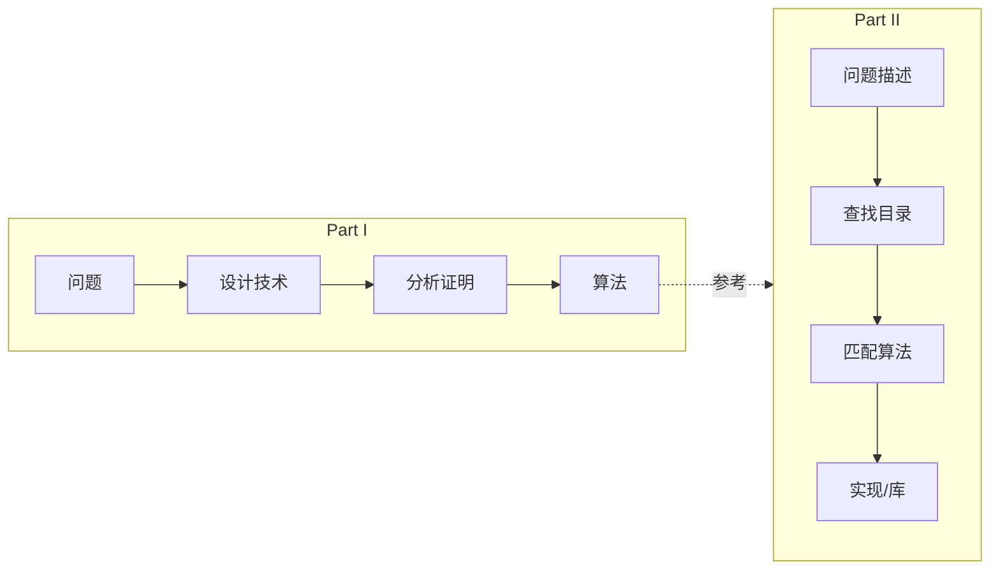
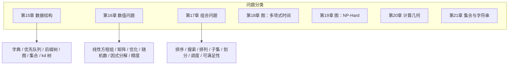
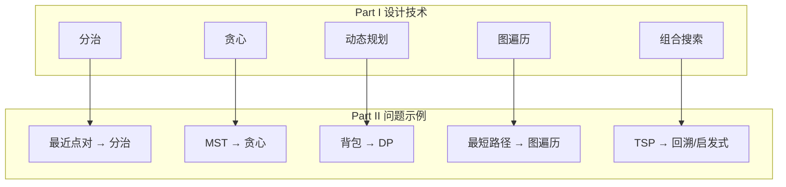

# 第14章 算法问题目录

> Part II 是「搭便车指南」（Hitchhiker's Guide），帮助你快速定位问题、选择算法、找到实现。
>
> — Steven S. Skiena, The Algorithm Design Manual

[← Part I](../part1/ch13.md) | [目录](../index.md) | [下一章 →](./ch15.md)

---

## 14.1 Part II 的定位

**Part II — 算法问题目录**（A Catalogue of Algorithmic Problems）与 Part I 形成互补：

- **Part I**：教你**如何设计算法**——技术、分析、证明、权衡
- **Part II**：当你**已经知道问题是什么**时，帮你快速找到合适的算法与实现

::: info 使用场景
- 面试前快速复习某类问题
- 实现时查找标准算法与库
- 判断问题难度与可解性（多项式 vs NP-Hard）
- 从问题反推应使用的设计技术
:::

---

## 14.2 如何阅读问题目录

每个问题条目采用统一结构，便于快速浏览与对比：

| 字段 | 含义 |
|------|------|
| **问题描述** | 问题定义、典型应用场景 |
| **Input / Output** | 输入输出格式与约束 |
| **讨论** | 算法思路、复杂度、变体、注意事项 |
| **实现 / 库推荐** | 标准库、开源实现、语言推荐 |

::: tip 阅读建议
- 先看**问题描述**确认是否匹配你的需求
- 再看 **Input/Output** 确保接口一致
- **讨论**部分帮助理解算法选择与权衡
- **实现**部分直接指向可用的代码与库
:::

---

## 14.3 问题分类方法

Part II 按**问题领域**组织，而非按算法类型。这样更符合实际使用：你通常先知道「要解决什么」，再去找「用什么算法」。

### 分类原则

1. **按问题域**：数据结构、数值、组合、图、几何、字符串
2. **按难度**：多项式时间（P）与 NP-Hard 分开（如图问题分两章）
3. **按应用**：同一领域的问题集中，便于横向对比

### 难度标识

目录中会标注问题的**计算复杂度**：

- **多项式时间**：有高效算法，可直接使用
- **NP-Complete / NP-Hard**：无已知多项式算法，需近似或启发式
- **开放问题**：复杂度未知或存在争议

---

## 14.4 与 Part I 的对应关系

Part II 的每个问题都可追溯到 Part I 中的设计技术：

::: warning 注意
Part II 不重复讲解算法原理，只提供**问题→算法→实现**的快速索引。若需理解算法本身，请回到 Part I 对应章节。
:::

---

## 14.5 使用流程示例

假设你遇到问题：「给定 $n$ 个点，找距离最近的一对」。

1. **定位**：属于「计算几何」或「数值问题」中的最近点对（Closest Pair）
2. **查阅**：第16章或第20章对应条目
3. **确认**：Input 为点集，Output 为最近距离及一对点
4. **选择**：分治算法 $O(n \log n)$，或暴力 $O(n^2)$（$n$ 小时）
5. **实现**：使用推荐库或参考给出的实现链接

---

## 14.6 本章小结

| 要点 | 说明 |
|------|------|
| Part II 用途 | 问题→算法→实现的快速参考 |
| 阅读方式 | 问题描述 → Input/Output → 讨论 → 实现 |
| 分类依据 | 问题领域 + 计算难度 |
| 与 Part I 关系 | Part II 索引，Part I 讲解原理 |

从下一章起，我们将按领域逐一介绍问题目录中的条目。
