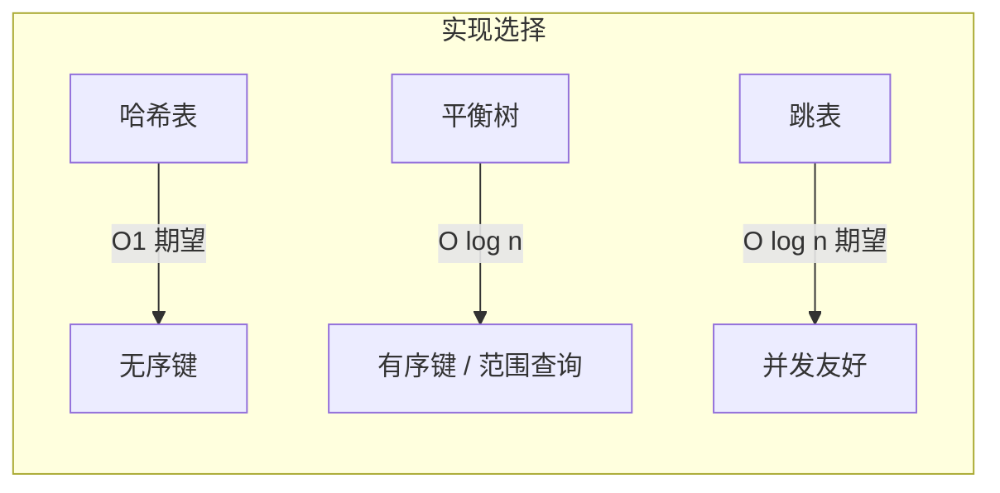
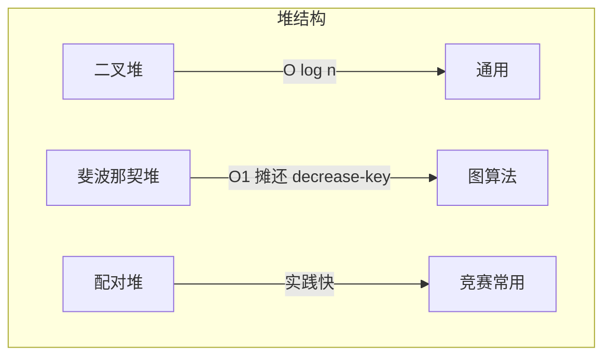
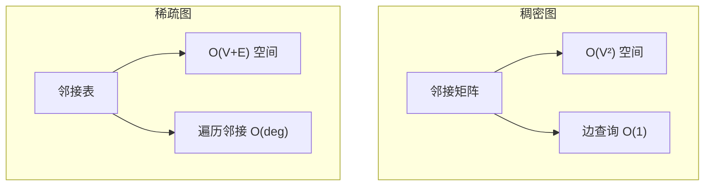
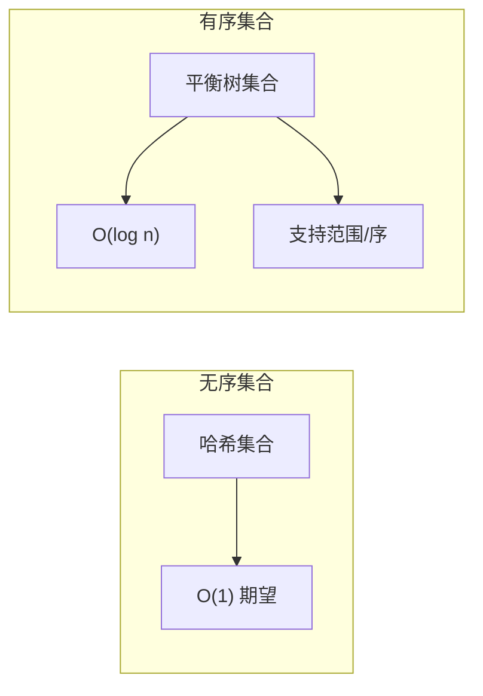

# 第15章 数据结构

> 数据结构是算法的基石。选对结构，事半功倍。
>
> — Steven S. Skiena, The Algorithm Design Manual

[← 上一章](./ch14.md) | [目录](../index.md) | [下一章 →](./ch16.md)

---

本章收录与**数据结构**（Data Structures）相关的问题目录，涵盖字典、优先队列、后缀结构、图、集合、空间索引等。每个条目给出 Input/Output、讨论与实现推荐。

---

## 15.1 字典（Dictionaries）

### 问题描述

维护键值对集合，支持 **insert**、**search**、**delete** 操作。典型应用：符号表、缓存、去重。

### Input / Output

| 操作 | Input | Output |
|------|-------|--------|
| Insert | key $k$, value $v$ | 无（或更新后的结构） |
| Search | key $k$ | value $v$ 或 $\bot$（不存在） |
| Delete | key $k$ | 成功/失败 |

### 讨论



| 实现 | 查找 | 插入 | 删除 | 有序 | 适用场景 |
|------|------|------|------|------|----------|
| 哈希表 | $O(1)$ 期望 | $O(1)$ 期望 | $O(1)$ 期望 | 否 | 纯键值查找 |
| 红黑树 / AVL | $O(\log n)$ | $O(\log n)$ | $O(\log n)$ | 是 | 需要有序或范围查询 |
| 跳表 | $O(\log n)$ 期望 | $O(\log n)$ 期望 | $O(\log n)$ 期望 | 是 | 并发、简单实现 |

::: tip 选择建议
- 仅需精确查找 → 哈希表
- 需要 `lower_bound`、范围遍历 → 平衡树
- 键为字符串且需前缀查询 → Trie（见集合/字符串章节）
:::

### 实现 / 库推荐

- **C++**：`std::unordered_map`（哈希）、`std::map`（红黑树）
- **Python**：`dict`（哈希）
- **Java**：`HashMap`、`TreeMap`
- **Go**：`map`（哈希）

---

## 15.2 优先队列（Priority Queues）

### 问题描述

维护元素集合，支持 **insert** 与 **extract-min**（或 extract-max）。典型应用：Dijkstra、Huffman、任务调度、Top-K。

### Input / Output

| 操作 | Input | Output |
|------|-------|--------|
| Insert | 元素 $x$，优先级 $p$ | 无 |
| Extract-Min | 无 | 优先级最小的元素 |
| Decrease-Key | 元素 $x$，新优先级 $p'$ | 成功/失败 |

### 讨论



| 实现 | Insert | Extract-Min | Decrease-Key | 适用 |
|------|--------|-------------|--------------|------|
| 二叉堆 | $O(\log n)$ | $O(\log n)$ | $O(n)$ | 通用 |
| 斐波那契堆 | $O(1)$ 摊还 | $O(\log n)$ 摊还 | $O(1)$ 摊还 | Dijkstra、Prim 理论最优 |
| 配对堆 | $O(1)$ 摊还 | $O(\log n)$ 摊还 | $O(\log n)$ 摊还 | 实践常优于斐波那契堆 |

::: warning 注意
斐波那契堆常数大，实践中二叉堆往往更快。仅在 $n$ 极大且 decrease-key 频繁时考虑斐波那契堆。
:::

### 实现 / 库推荐

- **C++**：`std::priority_queue`（二叉堆）
- **Python**：`heapq`（二叉堆）
- **Java**：`PriorityQueue`
- **Go**：`container/heap`

---

## 15.3 后缀树与后缀数组（Suffix Trees and Arrays）

### 问题描述

为字符串 $S$ 构建**后缀树**（Suffix Tree）或**后缀数组**（Suffix Array），支持子串查找、最长重复子串、LCS 等。

### Input / Output

| 操作 | Input | Output |
|------|-------|--------|
| 构建 | 字符串 $S$，长度 $n$ | 后缀树/后缀数组 |
| 子串查找 | 模式 $P$ | 所有出现位置 |
| 最长重复子串 | 无 | 最长重复子串及位置 |

### 讨论

```mermaid
flowchart LR
    S["字符串 S"] --> T[后缀树]
    S --> A[后缀数组]
    T --> Q1[子串查找 O(m)]
    A --> Q2[子串查找 O(m + log n)]
    T --> L1[最长重复 O(n)]
    A --> L2[最长重复 O(n)]
```

| 结构 | 空间 | 构建时间 | 子串查找 | 特点 |
|------|------|----------|----------|------|
| 后缀树 | $O(n)$ | $O(n)$ | $O(m)$ | 结构直观，实现复杂 |
| 后缀数组 | $O(n)$ | $O(n \log n)$ 或 $O(n)$ | $O(m + \log n)$ | 实现简单，竞赛常用 |

::: info 选择
- 需要多种复杂查询 → 后缀树
- 只需子串查找、LCP → 后缀数组 + LCP 数组
:::

### 实现 / 库推荐

- **C++**：`sdsl` 库（Suffix Array、FM-Index）
- **Python**：`pydivsufsort`、`suffix_trees`
- **竞赛**：手写 SA-IS 或 DC3 构建后缀数组

---

## 15.4 图数据结构（Graph Data Structures）

### 问题描述

表示图 $G=(V,E)$，支持邻接查询、遍历、边权访问。图算法效率高度依赖表示方式。

### Input / Output

| 表示 | Input | 支持的查询 |
|------|-------|------------|
| 邻接矩阵 | $n \times n$ 矩阵 | 边存在性 $O(1)$，遍历邻接 $O(n)$ |
| 邻接表 | 每个顶点的邻接列表 | 遍历邻接 $O(\deg(v))$，边存在性 $O(\deg(v))$ |
| 边列表 | 边集合 | 遍历所有边 $O(m)$ |

### 讨论



| 表示 | 空间 | 边查询 | 遍历邻接 | 适用 |
|------|------|--------|----------|------|
| 邻接矩阵 | $O(|V|^2)$ | $O(1)$ | $O(|V|)$ | 稠密图、Floyd |
| 邻接表 | $O(|V|+|E|)$ | $O(\deg(v))$ | $O(\deg(v))$ | 稀疏图、DFS/BFS |
| 邻接表（带权） | $O(|V|+|E|)$ | 同上 | 同上 | 加权图 |

::: tip 实践建议
- $|E| \ll |V|^2$ → 邻接表
- 需要快速判断 $(u,v) \in E$ 且图较稠密 → 邻接矩阵
- 有向/无向、多重边、自环需在实现中区分
:::

### 实现 / 库推荐

- **C++**：`vector<vector<pair<int,int>>>`（邻接表）、`vector<vector<int>>`（邻接矩阵）
- **Python**：`networkx`、`igraph`
- **Java**：手写或 `JGraphT`

---

## 15.5 集合数据结构（Set Data Structures）

### 问题描述

维护元素集合，支持 **insert**、**delete**、**membership**、**并/交/差** 等。与字典类似，但通常只关心元素是否存在。

### Input / Output

| 操作 | Input | Output |
|------|-------|--------|
| Insert | 元素 $x$ | 无 |
| Delete | 元素 $x$ | 成功/失败 |
| Membership | 元素 $x$ | 是/否 |
| Union / Intersection | 集合 $A$, $B$ | 新集合 |

### 讨论



| 实现 | 查找 | 插入 | 删除 | 并/交/差 |
|------|------|------|------|----------|
| 哈希集合 | $O(1)$ 期望 | $O(1)$ 期望 | $O(1)$ 期望 | 需遍历 |
| 平衡树集合 | $O(\log n)$ | $O(\log n)$ | $O(\log n)$ | $O(n+m)$ 归并 |

::: info 位集（Bit Set）
当元素为 $0..n-1$ 的整数时，可用**位向量**（bit vector）实现 $O(n)$ 空间、$O(1)$ 的 membership，适合大规模稠密集合。
:::

### 实现 / 库推荐

- **C++**：`std::unordered_set`、`std::set`
- **Python**：`set`（哈希）
- **Java**：`HashSet`、`TreeSet`
- **Go**：`map[T]struct{}` 模拟集合

---

## 15.6 kd 树（Kd-Trees）

### 问题描述

在 $k$ 维空间中组织点集，支持**最近邻查询**（Nearest Neighbor）、**范围查询**（Range Search）。适用于低维空间（通常 $k \leq 20$）。

### Input / Output

| 操作 | Input | Output |
|------|-------|--------|
| 构建 | $n$ 个 $k$ 维点 | kd 树 |
| 最近邻 | 查询点 $q$ | 最近点 $p$ |
| 范围查询 | 超矩形 $R$ | 落在 $R$ 内的所有点 |

### 讨论

```mermaid
flowchart TB
    subgraph 构建
        P[点集] --> S[按维轮流划分]
        S --> T[kd 树]
    end
    subgraph 查询
        Q[查询点] --> NN[最近邻 O(√n) 期望]
        R[范围] --> RS[范围查询 O(√n + k)]
    end
```

| 维度 | 最近邻期望时间 | 范围查询 | 备注 |
|------|----------------|----------|------|
| 低维 ($k \leq 10$) | $O(\log n)$ 期望 | $O(\sqrt{n} + k)$ | 实用 |
| 高维 ($k$ 大) | 退化为 $O(n)$ | $O(n)$ | 考虑 LSH、Ball Tree |

::: warning 高维诅咒
维度 $k$ 较大时，kd 树性能接近暴力。高维最近邻可考虑**局部敏感哈希**（LSH）或**Ball Tree**。
:::

### 实现 / 库推荐

- **C++**：`nanoflann`、`CGAL`
- **Python**：`scipy.spatial.KDTree`、`sklearn.neighbors.KDTree`
- **R**：`RANN`、`dbscan`

---

## 15.7 本章小结

| 问题 | 核心操作 | 推荐实现 |
|------|----------|----------|
| 字典 | insert / search / delete | 哈希表（无序）、红黑树（有序） |
| 优先队列 | insert / extract-min | 二叉堆 |
| 后缀树/数组 | 子串查找、LCS | 后缀数组 + LCP |
| 图 | 邻接查询、遍历 | 邻接表（稀疏）、邻接矩阵（稠密） |
| 集合 | membership / 并交差 | 哈希集合、平衡树集合 |
| kd 树 | 最近邻、范围查询 | KDTree（低维） |
