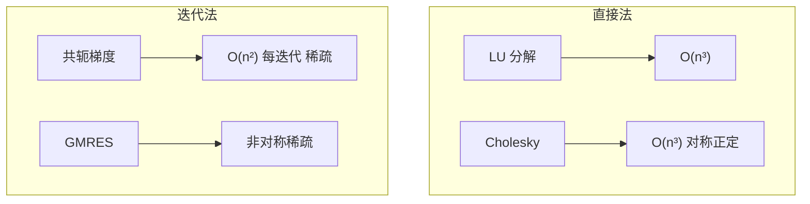
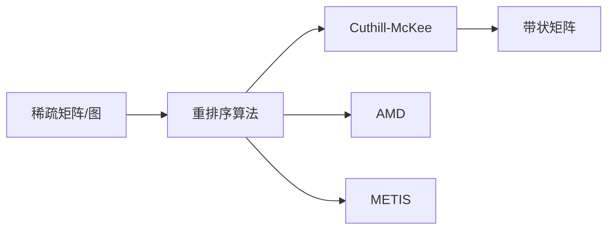
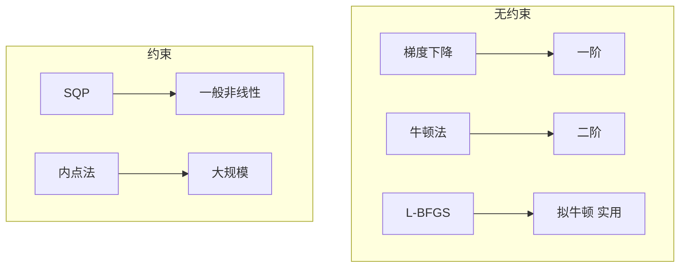
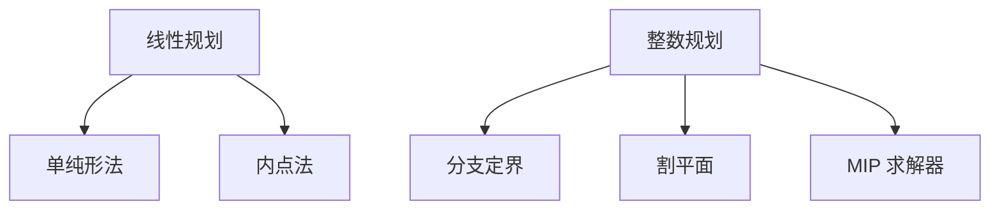
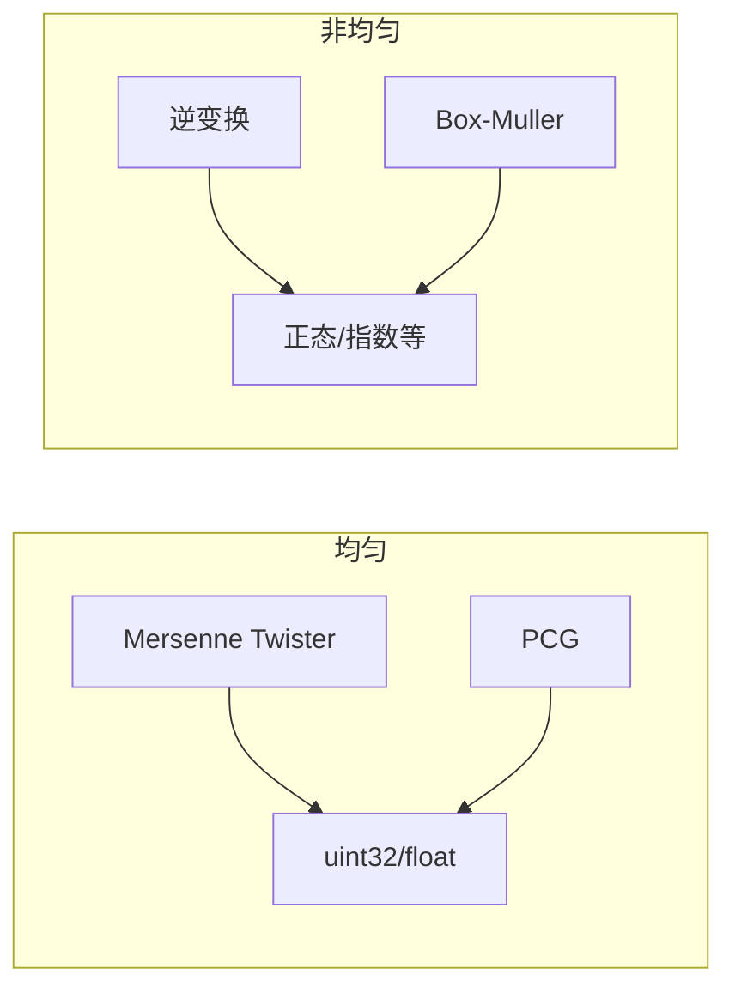
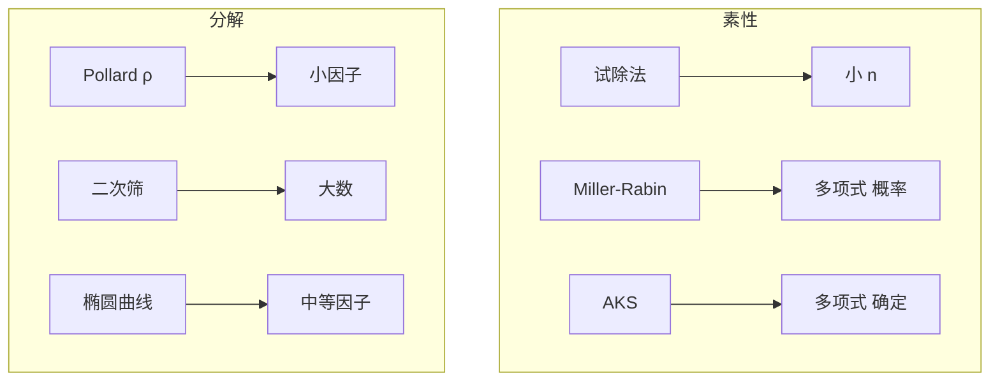
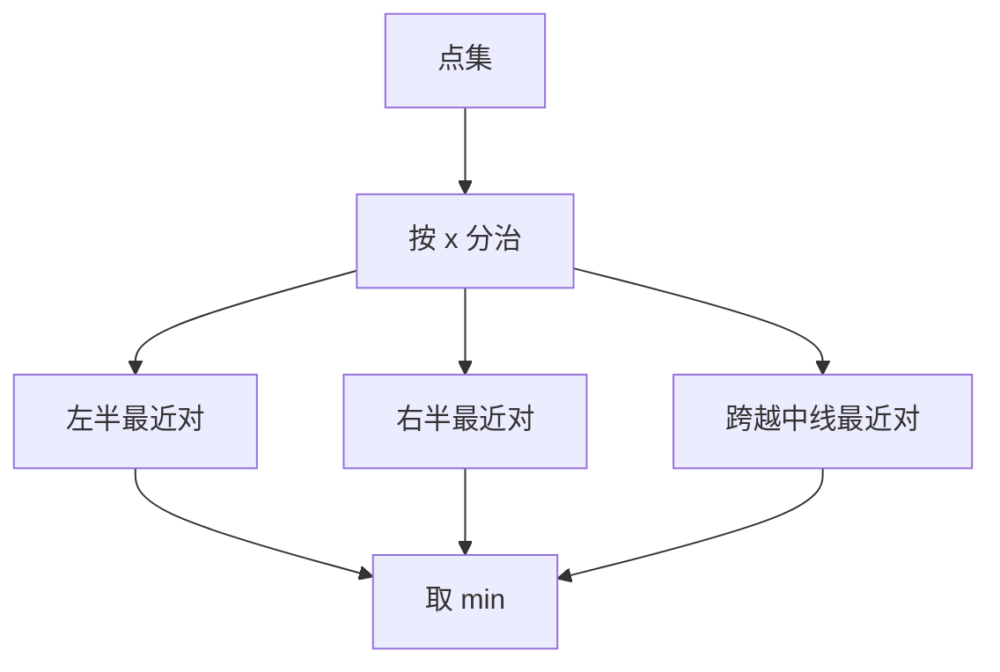

# 第16章 数值问题

> 数值问题连接数学与计算。选对算法，精度与效率兼得。
>
> — Steven S. Skiena, The Algorithm Design Manual

[← 上一章](./ch15.md) | [目录](../index.md) | [下一章 →](./ch17.md)

---

本章收录**数值问题**（Numerical Problems）目录，涵盖线性代数、优化、随机数、数论、精度计算与几何中的数值型问题。

---

## 16.1 求解线性方程组（Solving Linear Equations）

### 问题描述

给定 $n \times n$ 非奇异矩阵 $A$ 与向量 $b$，求 $x$ 使得 $Ax = b$。是科学计算中最基础的问题之一。

### Input / Output

| 项目 | 格式 |
|------|------|
| Input | 矩阵 $A \in \mathbb{R}^{n \times n}$，向量 $b \in \mathbb{R}^n$ |
| Output | 解向量 $x \in \mathbb{R}^n$，或判定无解/无穷多解 |

### 讨论



| 方法 | 复杂度 | 适用 |
|------|--------|------|
| 高斯消元 / LU | $O(n^3)$ | 稠密、通用 |
| Cholesky | $O(n^3)$ | 对称正定 |
| 共轭梯度 (CG) | $O(n^2)$ 每迭代 | 对称正定、稀疏 |
| GMRES / BiCGSTAB | 每迭代 $O(n^2)$ | 非对称稀疏 |

::: tip 选择建议
- 稠密小规模 → LAPACK / BLAS
- 大规模稀疏 → 迭代法 + 预条件子
:::

### 实现 / 库推荐

- **C/C++**：LAPACK、Eigen、Intel MKL
- **Python**：`numpy.linalg.solve`、`scipy.sparse.linalg`
- **Julia**：`\` 运算符、`LinearAlgebra`

---

## 16.2 带宽缩减（Bandwidth Reduction）

### 问题描述

对稀疏矩阵的行与列进行**重排序**（reordering），使非零元尽量靠近对角线，从而减小**带宽**（bandwidth），提升分解与迭代效率。

### Input / Output

| 项目 | 格式 |
|------|------|
| Input | 稀疏矩阵 $A$（或图 $G$ 的邻接结构） |
| Output | 置换 $P$，使 $PAP^T$ 带宽更小 |

### 讨论



| 算法 | 目标 | 适用 |
|------|------|------|
| Cuthill-McKee (RCM) | 减小带宽 | 结构对称 |
| AMD (Approximate Minimum Degree) | 减少分解填元 | 通用稀疏 |
| METIS | 图划分 + 重排序 | 大规模并行 |

### 实现 / 库推荐

- **C/C++**：SuiteSparse、METIS
- **Python**：`scipy.sparse.csgraph.reverse_cuthill_mckee`、`scipy.sparse` + AMD
- **MATLAB**：`symrcm`、`amd`

---

## 16.3 矩阵乘法（Matrix Multiplication）

### 问题描述

计算 $C = A \cdot B$，其中 $A \in \mathbb{R}^{m \times k}$，$B \in \mathbb{R}^{k \times n}$。朴素算法 $O(mnk)$，Strassen 等可降至约 $O(n^{2.807})$。

### Input / Output

| 项目 | 格式 |
|------|------|
| Input | 矩阵 $A$、$B$ |
| Output | 矩阵 $C = AB$ |

### 讨论

```mermaid
flowchart TB
    subgraph 稠密
        Naive[朴素 O(mnk)] --> Small[小规模]
        Strassen[Strassen O(n^2.81)] --> Medium[中等]
        BLAS[BLAS 优化] --> Fast[实践最快]
    end
    subgraph 稀疏
        SpGEMM[稀疏矩阵乘] --> Sparse[O(nnz)]
    end
```

| 场景 | 方法 | 复杂度 |
|------|------|--------|
| 稠密、小 | 朴素 | $O(mnk)$ |
| 稠密、大 | Strassen / 分块 + BLAS | $O(n^{2.81})$ 或更优 |
| 稀疏 | SpGEMM | $O(\text{nnz})$ 量级 |

::: info 实践
Strassen 常数大，通常 $n > 1000$ 才考虑。生产环境多用高度优化的 BLAS（如 OpenBLAS、MKL）。
:::

### 实现 / 库推荐

- **C/C++**：BLAS、Eigen、Intel MKL
- **Python**：`numpy.dot`、`scipy.sparse`
- **GPU**：cuBLAS、cuSPARSE

---

## 16.4 行列式与永久式（Determinants and Permanents）

### 问题描述

- **行列式**（Determinant）：$\det(A) = \sum_{\sigma} \text{sgn}(\sigma) \prod_i a_{i,\sigma(i)}$，有高效算法
- **永久式**（Permanent）：$\text{per}(A) = \sum_{\sigma} \prod_i a_{i,\sigma(i)}$，无符号，**#P-Complete**

### Input / Output

| 项目 | 格式 |
|------|------|
| Input | 方阵 $A$ |
| Output | $\det(A)$ 或 $\text{per}(A)$ |

### 讨论

```mermaid
flowchart LR
    Det[行列式] --> LU[LU 分解 O(n³)]
    Det --> Faddeev[Faddeev-Leverrier]
    Per[永久式] --> Ryser[Ryser O(n 2ⁿ)]
    Per --> Approx[近似算法]
```

| 问题 | 复杂度 | 备注 |
|------|--------|------|
| 行列式 | $O(n^3)$ | 与矩阵求逆同阶 |
| 永久式（精确） | $O(n \cdot 2^n)$ | Ryser 公式 |
| 永久式（近似） | 多项式 | 随机近似算法 |

### 实现 / 库推荐

- **行列式**：LAPACK `dgetrf` + 对角元乘积、Eigen、NumPy
- **永久式**：`sympy`、专用库（如 `permanent`）

---

## 16.5 约束与无约束优化（Constrained and Unconstrained Optimization）

### 问题描述

- **无约束**：$\min_x f(x)$，$x \in \mathbb{R}^n$
- **约束**：$\min_x f(x)$，满足 $g_i(x) \leq 0$，$h_j(x) = 0$

### Input / Output

| 项目 | 格式 |
|------|------|
| Input | 目标函数 $f$（及梯度、Hessian）、约束 $g,h$ |
| Output | 局部最优解 $x^*$（及最优值） |

### 讨论



| 类型 | 方法 | 适用 |
|------|------|------|
| 无约束光滑 | L-BFGS、牛顿 | 通用 |
| 无约束非光滑 | 次梯度、近端梯度 | 凸优化 |
| 约束非线性 | SQP、内点法 | 一般约束 |

### 实现 / 库推荐

- **Python**：`scipy.optimize`（minimize、least_squares）
- **C++**：NLopt、Ceres、Ipopt
- **专用**：CVXPY（凸）、PyTorch/JAX（可微）

---

## 16.6 线性规划与整数规划（Linear and Integer Programming）

### 问题描述

- **线性规划（LP）**：$\min c^T x$，$Ax \leq b$，$x \geq 0$
- **整数规划（IP）**：同上，且 $x \in \mathbb{Z}^n$（或混合 MIP）

### Input / Output

| 项目 | 格式 |
|------|------|
| Input | 矩阵 $A$，向量 $b,c$，变量类型（连续/整数） |
| Output | 最优解 $x^*$ 及最优值，或判定不可行/无界 |

### 讨论



| 问题 | 复杂度 | 求解器 |
|------|--------|--------|
| LP | 多项式（内点法） | 高效 |
| IP / MIP | NP-Hard | 启发式 + 精确 |

::: tip 实践
优先用成熟求解器（CPLEX、Gurobi、GLPK、HiGHS），避免手写单纯形。
:::

### 实现 / 库推荐

- **Python**：`scipy.optimize.linprog`、`PuLP`、`Pyomo`、`OR-Tools`
- **C++**：GLPK、HiGHS、CPLEX、Gurobi
- **开源**：HiGHS、GLPK、CBC

---

## 16.7 随机数生成（Random Number Generation）

### 问题描述

生成**伪随机数**（Pseudorandom），满足均匀分布、统计性质良好、周期长。是蒙特卡洛、随机算法的基石。

### Input / Output

| 项目 | 格式 |
|------|------|
| Input | 种子（可选）、分布类型、参数 |
| Output | 随机数序列 |

### 讨论



| 生成器 | 周期 | 质量 | 速度 |
|--------|------|------|------|
| Mersenne Twister | $2^{19937}-1$ | 良好 | 中等 |
| PCG | $2^{128}$ 量级 | 良好 | 快 |
| xorshift | 短 | 一般 | 很快 |

### 实现 / 库推荐

- **C++**：`<random>`（MT、分布）
- **Python**：`random`、`numpy.random`（注意新版使用 PCG）
- **密码学**：`/dev/urandom`、`CryptGenRandom`

---

## 16.8 因式分解与素性测试（Factoring and Primality Testing）

### 问题描述

- **素性测试**：判定 $n$ 是否为素数
- **因式分解**：将合数 $n$ 分解为素因子乘积

### Input / Output

| 项目 | 格式 |
|------|------|
| Input | 整数 $n$ |
| Output | 素性结果，或因子列表 |

### 讨论



| 问题 | 方法 | 复杂度 |
|------|------|--------|
| 素性测试 | Miller-Rabin | $O(k \log^3 n)$ 概率 |
| 因式分解 | Pollard ρ | $O(\sqrt{p})$，$p$ 为最小因子 |
| 因式分解 | 二次筛、NFS | 亚指数 | 大数 |

### 实现 / 库推荐

- **Python**：`sympy.ntheory`、`gmpy2`
- **C/C++**：GMP、PARI/GP
- **专用**：msieve、yafu（大数分解）

---

## 16.9 任意精度算术（Arbitrary-Precision Arithmetic）

### 问题描述

在标准整数/浮点无法满足精度时，使用**任意精度**（多精度）算术，支持大整数、高精度小数。

### Input / Output

| 项目 | 格式 |
|------|------|
| Input | 大整数或高精度实数 |
| Output | 运算结果（和、积、幂等） |

### 讨论

```mermaid
flowchart LR
    Int[大整数] --> Add[加减 O(n)]
    Int --> Mul[乘法 O(n log n) FFT]
    Int --> Div[除法 O(n log n)]
    Float[高精度浮点] --> MPFR[MPFR]
```

| 运算 | 朴素 | 优化 |
|------|------|------|
| 加减 | $O(n)$ | $O(n)$ |
| 乘法 | $O(n^2)$ | $O(n \log n)$（FFT） |
| 除法 | $O(n^2)$ | $O(n \log n)$ |

### 实现 / 库推荐

- **Python**：内置 `int` 任意精度、`decimal`、`mpmath`
- **C/C++**：GMP、MPFR、Boost.Multiprecision
- **其他**：Java `BigInteger`、Go `math/big`

---

## 16.10 最近点对（Closest Pair）

### 问题描述

给定 $n$ 个点（二维或低维），求距离**最近的一对点**及其距离。分治可做到 $O(n \log n)$。

### Input / Output

| 项目 | 格式 |
|------|------|
| Input | $n$ 个点 $p_1,\ldots,p_n \in \mathbb{R}^d$ |
| Output | 最近点对 $(p_i, p_j)$ 及距离 $d$ |

### 讨论



| 方法 | 复杂度 | 适用 |
|------|--------|------|
| 暴力 | $O(n^2)$ | $n$ 小 |
| 分治 | $O(n \log n)$ | 二维、低维 |
| kd 树 | $O(n \log n)$ 期望 | 低维 |

### 实现 / 库推荐

- **Python**：`scipy.spatial.distance.pdist` 最小距离、手写分治
- **C++**：CGAL、手写
- **竞赛**：常用分治模板

---

## 16.11 最大散布（Maximum Spread）

### 问题描述

给定 $n$ 个点，求两点间**最大距离**（diameter）或使某种**散布度量**（spread）最大的点对/子集。与最近点对相对。

### Input / Output

| 项目 | 格式 |
|------|------|
| Input | $n$ 个点 |
| Output | 最大距离及对应点对，或最大散布子集 |

### 讨论

```mermaid
flowchart LR
    A[点集] --> Conv[凸包]
    Conv --> Rotating[旋转卡壳]
    Rotating --> Diam[直径 O(n)]
```

| 问题 | 方法 | 复杂度 |
|------|------|--------|
| 直径（二维） | 凸包 + 旋转卡壳 | $O(n \log n)$ |
| 直径（高维） | 近似算法 | 多项式 |
| 最大散布子集 | NP-Hard | 近似/启发式 |

::: info 旋转卡壳
在凸包上，直径对应一对**对跖点**（antipodal pair），可用旋转卡壳在 $O(n)$ 内枚举所有对跖点并取最大距离。
:::

### 实现 / 库推荐

- **Python**：`scipy.spatial.ConvexHull`、`scipy.spatial.distance.pdist` 取 max
- **C++**：CGAL 凸包与直径

---

## 16.12 本章小结

| 问题 | 核心方法 | 典型复杂度 |
|------|----------|------------|
| 线性方程组 | LU、迭代法 | $O(n^3)$ / 每迭代 $O(n^2)$ |
| 带宽缩减 | RCM、AMD | $O(n+m)$ |
| 矩阵乘法 | BLAS、Strassen | $O(n^3)$ 或 $O(n^{2.81})$ |
| 行列式/永久式 | LU、Ryser | $O(n^3)$ / $O(n 2^n)$ |
| 优化 | L-BFGS、SQP | 迭代收敛 |
| 线性/整数规划 | 单纯形、分支定界 | 多项式 / NP-Hard |
| 随机数 | MT、PCG | $O(1)$ 每数 |
| 因式分解/素性 | Miller-Rabin、Pollard ρ | 多项式 / 亚指数 |
| 任意精度 | GMP、FFT 乘 | $O(n \log n)$ 乘 |
| 最近点对 | 分治 | $O(n \log n)$ |
| 最大散布 | 凸包 + 旋转卡壳 | $O(n \log n)$ |
