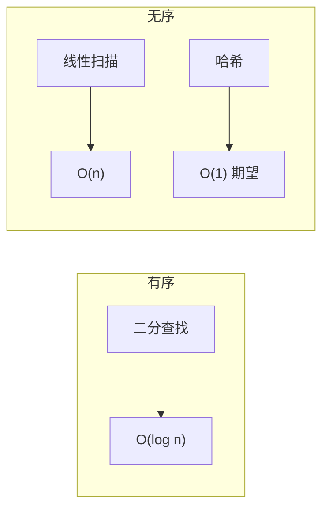
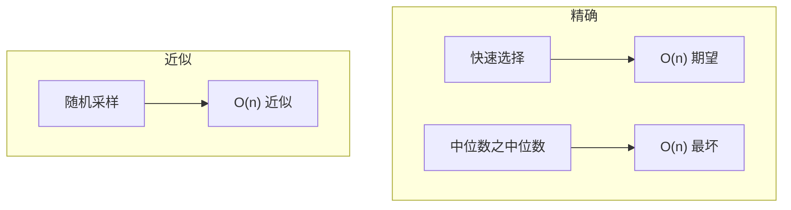
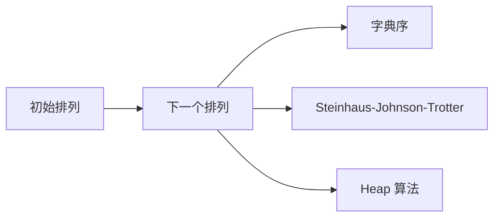
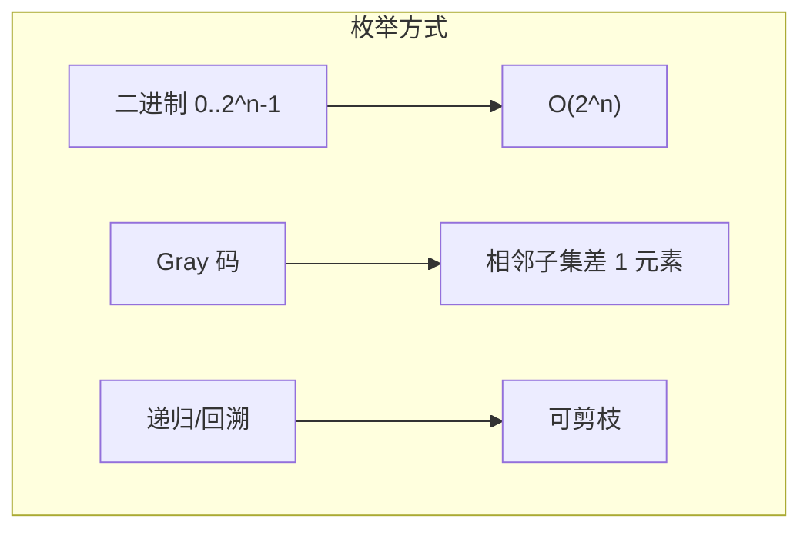
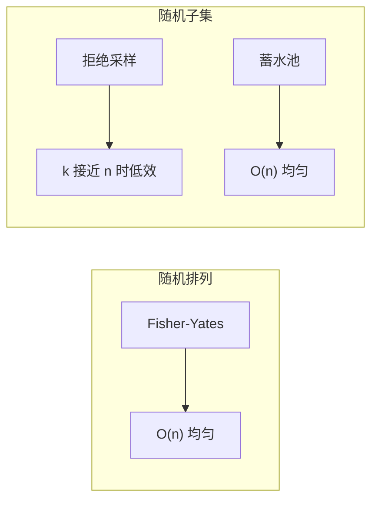
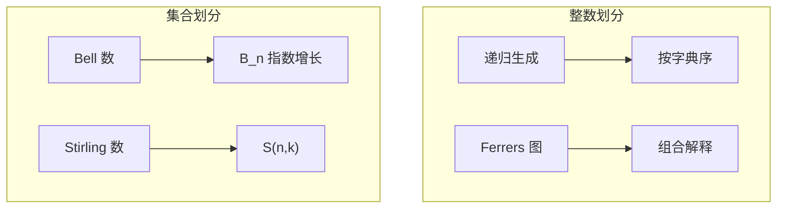
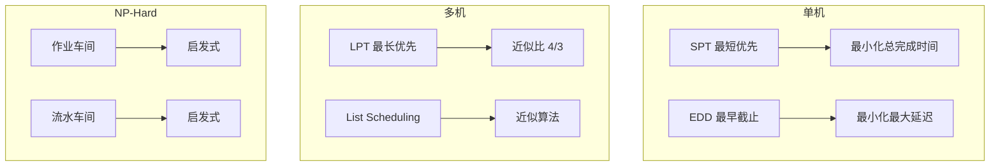
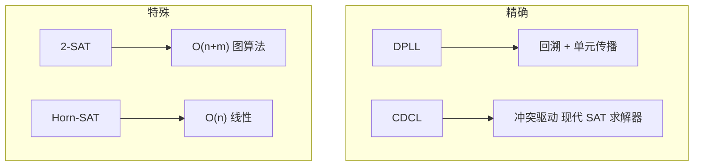

# 第17章 组合问题

> 组合问题涉及排列、子集、划分与调度。理解其结构，才能选对算法。
>
> — Steven S. Skiena, The Algorithm Design Manual

[← 上一章](./ch16.md) | [目录](../index.md) | [下一章 →](./ch18.md)

---

本章收录**组合问题**（Combinatorial Problems）目录，涵盖排序、搜索、选择、排列与子集生成、划分、调度、可满足性等。这些问题常具有组合爆炸性，需区分多项式可解与 NP-Hard。

---

## 17.1 排序（Sorting）

### 问题描述

将 $n$ 个元素按给定序关系排列。是算法中最基础的问题之一，也是许多算法的基础步骤。

### Input / Output

| 项目 | 格式 |
|------|------|
| Input | 数组 $A[1..n]$，比较器（或默认序） |
| Output | 排列后的数组 $A'$，满足 $A'[i] \leq A'[i+1]$（或自定义序） |

### 讨论

```mermaid
flowchart TB
    subgraph 比较排序
        Merge[归并 O(n log n)] --> M1[稳定]
        Quick[快速 O(n log n) 期望] --> Q1[原地]
        Heap[堆排序 O(n log n)] --> H1[原地 不稳定]
    end
    subgraph 非比较
        Count[计数] --> C1["O(n+k)"]
        Radix[基数] --> R1["O(n·d)"]
    end
```

| 算法 | 时间复杂度 | 空间 | 稳定 | 适用 |
|------|------------|------|------|------|
| 归并排序 | $O(n \log n)$ | $O(n)$ | 是 | 通用、稳定 |
| 快速排序 | $O(n \log n)$ 期望 | $O(\log n)$ | 否 | 通用、原地 |
| 堆排序 | $O(n \log n)$ | $O(1)$ | 否 | 原地、无最坏 |
| 计数排序 | $O(n+k)$ | $O(k)$ | 是 | 整数、范围小 |
| 基数排序 | $O(n \cdot d)$ | $O(n)$ | 是 | 整数、字符串 |

::: tip 选择建议
- 通用 → 快速排序（库函数默认）
- 需稳定 → 归并排序
- 整数且范围小 → 计数/基数排序
- 只需 Top-K → 部分排序（如 `nth_element`）
:::

### 实现 / 库推荐

- **C++**：`std::sort`（内省排序）、`std::stable_sort`
- **Python**：`list.sort()`、`sorted()`（Timsort）
- **Java**：`Arrays.sort`、`Collections.sort`

---

## 17.2 搜索（Searching）

### 问题描述

在有序或无序结构中查找目标元素。有序时可用二分，无序时需线性扫描或哈希。

### Input / Output

| 项目 | 格式 |
|------|------|
| Input | 数组或结构 $S$，目标 $x$ |
| Output | 位置 $i$ 使得 $S[i]=x$，或 $\bot$（不存在） |

### 讨论



| 结构 | 方法 | 复杂度 |
|------|------|--------|
| 有序数组 | 二分查找 | $O(\log n)$ |
| 无序数组 | 线性 / 哈希 | $O(n)$ / $O(1)$ 期望 |
| 二叉搜索树 | 树查找 | $O(\log n)$ 期望 |

::: info 二分变体
- **lower_bound**：首个 $\geq x$ 的位置
- **upper_bound**：首个 $> x$ 的位置
- **equal_range**：$[L,R)$ 满足 $S[i]=x$
:::

### 实现 / 库推荐

- **C++**：`std::binary_search`、`std::lower_bound`、`std::upper_bound`
- **Python**：`bisect` 模块、`list.index`
- **Java**：`Arrays.binarySearch`、`Collections.binarySearch`

---

## 17.3 中位数与选择（Median and Selection）

### 问题描述

在未排序数组中找第 $k$ 小（或第 $k$ 大）元素，特例包括**中位数**（$k = n/2$）、最小值、最大值。

### Input / Output

| 项目 | 格式 |
|------|------|
| Input | 数组 $A[1..n]$，秩 $k$ |
| Output | 第 $k$ 小元素 $x$（及可选的位置） |

### 讨论



| 方法 | 复杂度 | 备注 |
|------|--------|------|
| 排序后取第 $k$ 个 | $O(n \log n)$ | 简单 |
| 快速选择（QuickSelect） | $O(n)$ 期望 | 实践常用 |
| 中位数之 medians（BFPRT） | $O(n)$ 最坏 | 理论保证 |
| 堆维护 Top-K | $O(n \log k)$ | 流式、$k$ 小 |

### 实现 / 库推荐

- **C++**：`std::nth_element`
- **Python**：`heapq.nlargest`、`heapq.nsmallest`、手写 QuickSelect
- **Java**：`Arrays.sort` 部分排序、手写

---

## 17.4 排列生成（Generating Permutations）

### 问题描述

生成 $n$ 个元素的所有**排列**（permutation），共 $n!$ 个。需按某种序（字典序、邻位对换等）枚举。

### Input / Output

| 项目 | 格式 |
|------|------|
| Input | 集合 $S$ 或数组 $A[1..n]$ |
| Output | 所有 $n!$ 个排列的序列 |

### 讨论



| 方法 | 序 | 单步复杂度 | 特点 |
|------|-----|------------|------|
| 字典序下一个 | 字典序 | $O(n)$ | 最常用 |
| Steinhaus-Johnson-Trotter | 邻位对换 | $O(1)$ 摊还 | 相邻排列仅交换一次 |
| Heap 算法 | 非字典序 | $O(1)$ 摊还 | 实现简单 |

::: warning 组合爆炸
$n!$ 增长极快，$n=10$ 约 $3.6 \times 10^6$，$n=20$ 已超 $10^{18}$。通常只枚举到 $n \leq 12$。
:::

### 实现 / 库推荐

- **C++**：`std::next_permutation`、`std::prev_permutation`
- **Python**：`itertools.permutations`
- **Java**：手写、Guava `Collections2.permutations`

---

## 17.5 子集生成（Generating Subsets）

### 问题描述

生成 $n$ 个元素集合的所有**子集**（subset），共 $2^n$ 个。可用二进制表示、递归或 Gray 码枚举。

### Input / Output

| 项目 | 格式 |
|------|------|
| Input | 集合 $S$ 或 $[0..n-1]$ |
| Output | 所有 $2^n$ 个子集 |

### 讨论



| 方法 | 序 | 相邻差异 | 适用 |
|------|-----|----------|------|
| 二进制枚举 | 自然数序 | 任意 | 通用 |
| Gray 码 | 反射序 | 1 位 | 需相邻相似 |
| 递归回溯 | DFS 序 | - | 可剪枝、约束 |

::: tip 技巧
子集枚举常与**位掩码**（bitmask）结合：`for (int mask = 0; mask < (1<<n); mask++)` 遍历所有子集。
:::

### 实现 / 库推荐

- **C++**：位运算枚举、`std::next_permutation` 配合子集大小
- **Python**：`itertools.combinations`（固定大小）、位枚举
- **通用**：手写 Gray 码、递归回溯

---

## 17.6 随机排列与随机子集（Random Permutation and Subset）

### 问题描述

- **随机排列**：均匀随机生成 $[1..n]$ 的一个排列
- **随机子集**：均匀随机生成 $k$ 元子集（$k \leq n$）

### Input / Output

| 项目 | 格式 |
|------|------|
| Input | $n$，可选 $k$（子集大小） |
| Output | 随机排列或随机 $k$ 元子集 |

### 讨论



| 问题 | 方法 | 复杂度 |
|------|------|--------|
| 随机排列 | Fisher-Yates 洗牌 | $O(n)$ |
| 随机 $k$ 子集 | 蓄水池采样 | $O(n)$ |
| 随机 $k$ 子集 |  Floyd 采样（无重复） | $O(k)$ 期望 |

::: info Fisher-Yates
从后往前，第 $i$ 位与前面随机位置 $j \in [0,i]$ 交换，保证均匀。
:::

### 实现 / 库推荐

- **C++**：`std::shuffle`（Fisher-Yates）
- **Python**：`random.shuffle`、`random.sample`
- **Java**：`Collections.shuffle`、`Random`

---

## 17.7 划分（Partitions）

### 问题描述

将 $n$ 划分为若干部分，常见形式：

- **整数划分**：$n = a_1 + a_2 + \cdots + a_k$，$a_i \geq 1$
- **集合划分**：将 $[n]$ 划分为若干非空子集（Bell 数）
- **平衡划分**：将 $n$ 个数分为两堆使差最小（NP-Hard）

### Input / Output

| 项目 | 格式 |
|------|------|
| Input | 整数 $n$ 或集合大小 |
| Output | 所有划分的枚举，或最优划分 |

### 讨论



| 问题 | 数量 | 枚举复杂度 |
|------|------|------------|
| 整数划分 | $p(n) \sim \frac{e^{\pi\sqrt{2n/3}}}{4n\sqrt{3}}$ | 指数 |
| 集合划分 | Bell 数 $B_n$ | 指数 |
| 平衡划分 | NP-Hard | 近似/搜索 |

### 实现 / 库推荐

- **Python**：`sympy` 整数划分、手写递归
- **通用**：递归回溯、动态规划（计数）

---

## 17.8 调度（Scheduling）

### 问题描述

将 $n$ 个**任务**（job）分配到**机器**（machine）上，优化完成时间、延迟等。变体众多：单机、多机、带优先级、带截止时间等。

### Input / Output

| 项目 | 格式 |
|------|------|
| Input | 任务集（处理时间 $p_i$、截止时间 $d_i$、权重 $w_i$ 等），机器数 $m$ |
| Output | 调度方案（每个任务的开始时间、机器分配）及目标值 |

### 讨论



| 问题 | 复杂度 | 方法 |
|------|--------|------|
| 单机最小化总完成时间 | $O(n \log n)$ | SPT |
| 单机最小化最大延迟 | $O(n \log n)$ | EDD |
| $P \| \mid C_{\max}$（多机 Makespan） | NP-Hard | LPT 近似 |
| 作业车间（JSSP） | NP-Hard | 遗传算法、约束规划 |

::: tip 贪心策略
许多简单调度问题有贪心最优：按处理时间、截止时间或权重排序后依次调度。
:::

### 实现 / 库推荐

- **Python**：`ortools`、`pulp`、`schedule`
- **通用**：CPLEX、Gurobi、专用调度库

---

## 17.9 可满足性（Satisfiability）

### 问题描述

**布尔可满足性**（Boolean Satisfiability, SAT）：给定合取范式（CNF）公式 $F$，是否存在变量赋值使 $F$ 为真。是第一个被证明的 NP-Complete 问题。

### Input / Output

| 项目 | 格式 |
|------|------|
| Input | CNF 公式（DIMACS 格式或等价表示） |
| Output | 满足赋值（若存在），或 UNSAT |

### 讨论



| 问题 | 复杂度 | 方法 |
|------|--------|------|
| 一般 SAT | NP-Complete | CDCL、DPLL |
| 2-SAT | $O(n+m)$ | 强连通分量 |
| Horn-SAT | $O(n)$ | 单位传播 |
| Max-SAT | NP-Hard | 近似、SMT |

::: info 应用
SAT 广泛应用于形式验证、规划、约束求解。许多 NP 问题可规约到 SAT 后用高效求解器求解。
:::

### 实现 / 库推荐

- **C++**：MiniSat、Glucose、CryptoMiniSat
- **Python**：`pycosat`、`python-sat`
- **SMT**：Z3、CVC4（可处理更复杂逻辑）

---

## 17.10 本章小结

| 问题 | 核心方法 | 典型复杂度 |
|------|----------|------------|
| 排序 | 快速排序、归并 | $O(n \log n)$ |
| 搜索 | 二分查找 | $O(\log n)$ |
| 中位数/选择 | 快速选择 | $O(n)$ 期望 |
| 排列生成 | 字典序下一个 | $O(n)$ 每排列 |
| 子集生成 | 位枚举、Gray 码 | $O(2^n)$ |
| 随机排列/子集 | Fisher-Yates、蓄水池 | $O(n)$ |
| 划分 | 递归、DP | 指数 |
| 调度 | 贪心、启发式 | 多项式 / NP-Hard |
| 可满足性 | CDCL、2-SAT 图算法 | NP-Complete / $O(n+m)$ |
