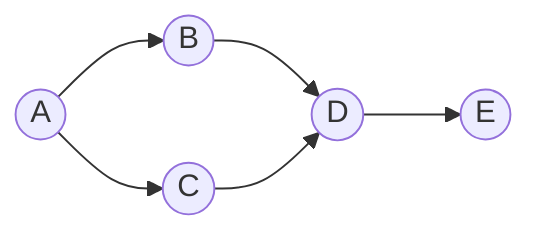
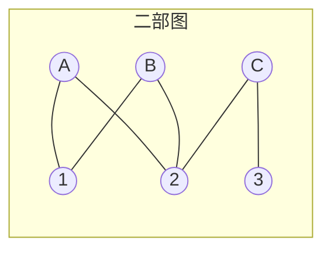
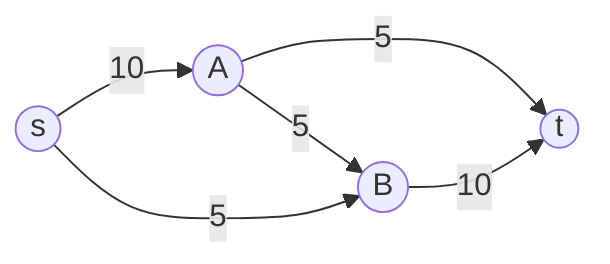

# 第18章 图问题：多项式时间

> 多项式时间可解的图问题构成了图算法的基础，是实际应用中最常遇到的一类问题。
>
> — Steven S. Skiena, The Algorithm Design Manual

[← 上一章](./ch17.md) | [目录](../index.md) | [下一章 →](./ch19.md)

---

本章收录可在**多项式时间**（polynomial time）内求解的图问题，涵盖连通性、排序、最短路径、匹配、网络流等经典主题。这些问题通常有成熟的高效算法，是图算法设计的核心工具。

---

## 18.1 连通分量（Connected Components）

### 问题描述

给定无向图 $G = (V, E)$，找出所有**连通分量**（connected component），即极大连通子图。每个顶点恰好属于一个连通分量。

### 输入 / 输出

| 项目 | 说明 |
|------|------|
| **输入** | 无向图 $G$（邻接表或邻接矩阵） |
| **输出** | 每个顶点所属的连通分量编号，或分量列表 |

### 讨论

- **BFS/DFS**：从每个未访问顶点出发做一次 BFS 或 DFS，每次遍历得到一个连通分量。
- **并查集**：对每条边做 union，最后每个集合对应一个连通分量。
- **应用**：社交网络中的群组检测、图像分割、电路连通性分析。

### 复杂度

| 算法 | 时间复杂度 | 空间复杂度 |
|------|------------|------------|
| BFS/DFS | $O(|V| + |E|)$ | $O(|V|)$ |
| 并查集 | $O(|E| \cdot \alpha(|V|))$ | $O(|V|)$ |

### 实现推荐

- 一般图：DFS 或 BFS，代码简洁。
- 需要动态加边：并查集（Union-Find）。
- 库：Boost Graph Library (BGL) 的 `connected_components`。

::: tip 强连通分量
有向图的**强连通分量**（SCC）需用 Kosaraju 或 Tarjan 算法，复杂度 $O(|V| + |E|)$。
:::

---

## 18.2 拓扑排序（Topological Sort）

### 问题描述

给定有向无环图（DAG）$G = (V, E)$，将顶点排成线性序列，使得对每条边 $(u, v)$，$u$ 在序列中位于 $v$ 之前。

### 输入 / 输出

| 项目 | 说明 |
|------|------|
| **输入** | 有向无环图 $G$ |
| **输出** | 拓扑序（若存在），或报告图含环 |

### 讨论

- **Kahn 算法**：维护入度为 0 的顶点队列，依次取出并删除其出边，更新入度。
- **DFS 后序**：DFS 遍历，按完成时间倒序即为拓扑序。
- **应用**：任务调度、编译依赖、课程先修关系。

上图中一种拓扑序为：A, B, C, D, E（或 A, C, B, D, E）。

### 复杂度

- 时间复杂度：$O(|V| + |E|)$
- 空间复杂度：$O(|V|)$

### 实现推荐

- Kahn 算法：适合需要逐层处理的场景。
- DFS 后序：实现简单，便于与 DFS 框架结合。
- 含环检测：若输出顶点数 $< |V|$，则存在环。

---

## 18.3 最小生成树（Minimum Spanning Tree）

### 问题描述

给定连通无向加权图 $G = (V, E)$，求**最小生成树**（MST），即连接所有顶点且边权和最小的生成树。

### 输入 / 输出

| 项目 | 说明 |
|------|------|
| **输入** | 连通无向加权图 $G$，边权 $w(e) \geq 0$ |
| **输出** | MST 的边集，或 MST 总权值 |

### 讨论

- **Prim 算法**：从单点出发，每次加入连接「已选」与「未选」的最小权边。
- **Kruskal 算法**：按边权排序，依次加入不形成环的边，用并查集维护。
- **应用**：网络设计、聚类、近似 TSP（Christofides 算法）。

### 复杂度

| 算法 | 时间复杂度 | 适用 |
|------|------------|------|
| Prim（邻接矩阵） | $O(|V|^2)$ | 稠密图 |
| Prim（堆） | $O(|E| \log |V|)$ | 稀疏图 |
| Kruskal | $O(|E| \log |E|)$ | 边已排序或稀疏图 |

### 实现推荐

- 稠密图：Prim + 邻接矩阵。
- 稀疏图：Kruskal 或 Prim + 优先队列。
- 库：BGL `kruskal_minimum_spanning_tree`、`prim_minimum_spanning_tree`。

---

## 18.4 最短路径（Shortest Path）

### 问题描述

在加权图中求从源点 $s$ 到目标 $t$（或到所有顶点）的**最短路径**（shortest path）。边权可为正或负（负权需无负环）。

### 输入 / 输出

| 项目 | 说明 |
|------|------|
| **输入** | 加权图 $G$，源点 $s$，可选目标 $t$ |
| **输出** | 最短路径长度及路径，或距离数组 |

### 讨论

| 场景 | 算法 | 复杂度 |
|------|------|--------|
| 非负权、单源 | Dijkstra | $O((|V|+|E|)\log|V|)$ |
| 有负权、单源 | Bellman-Ford | $O(|V| \cdot |E|)$ |
| 全源 | Floyd-Warshall | $O(|V|^3)$ |
| 全源、稀疏 | $n$ 次 Dijkstra | $O(|V|(|V|+|E|)\log|V|)$ |

### 复杂度

见上表。Dijkstra 用斐波那契堆可达 $O(|E| + |V| \log |V|)$。

### 实现推荐

- 非负权：优先 Dijkstra，可用 `std::priority_queue`。
- 负权：Bellman-Ford，注意负环检测。
- 全源、稠密：Floyd-Warshall 实现简单。
- 库：BGL、NetworkX。

---

## 18.5 传递闭包与传递归约（Transitive Closure & Reduction）

### 问题描述

- **传递闭包**（transitive closure）：给定有向图 $G$，构造图 $G^*$，使得 $(u,v) \in E^*$ 当且仅当 $G$ 中存在从 $u$ 到 $v$ 的路径。
- **传递归约**（transitive reduction）：求与 $G$ 传递闭包相同、边数最少的图。

### 输入 / 输出

| 项目 | 说明 |
|------|------|
| **输入** | 有向图 $G$ |
| **输出** | 传递闭包矩阵或传递归约的边集 |

### 讨论

- 传递闭包：Floyd-Warshall 变体，将「min」改为「or」，$O(|V|^3)$。
- 传递归约：对 DAG，删除可由其他路径替代的边；一般图更复杂。
- 应用：依赖分析、可达性查询。

### 复杂度

- 传递闭包：$O(|V|^3)$ 或 $O(|V| \cdot |E|)$（稀疏图用 BFS/DFS）
- 传递归约：$O(|V|^3)$

### 实现推荐

- 小图：Floyd-Warshall 风格闭包。
- 大图、稀疏：对每个顶点做 BFS/DFS 求可达集。
- 库：NetworkX `transitive_closure`。

---

## 18.6 匹配（Matching）

### 问题描述

- **最大匹配**（maximum matching）：在无向图中找边数最多的**匹配**（matching），即无公共顶点的边集。
- **最大权匹配**：边带权，求权和最大的匹配。
- **二部图最大匹配**：在二部图中求最大匹配。

### 输入 / 输出

| 项目 | 说明 |
|------|------|
| **输入** | 无向图（或二部图）$G$，可选边权 |
| **输出** | 匹配边集及匹配大小/权值 |

### 讨论

- **二部图最大匹配**：转化为最大流，或使用匈牙利算法（Hungarian）/ 增广路算法。
- **一般图最大匹配**：Blossom 算法（Edmonds），较复杂。
- **应用**：任务分配、婚姻匹配、资源调度。

### 复杂度

| 问题 | 复杂度 |
|------|--------|
| 二部图最大匹配 | $O(\sqrt{|V|} \cdot |E|)$（Hopcroft-Karp）或 $O(|V| \cdot |E|)$（增广路） |
| 一般图最大匹配 | $O(|V|^2 \cdot |E|)$（Blossom） |
| 二部图最大权匹配 | $O(|V|^3)$（Hungarian） |

### 实现推荐

- 二部图：最大流建模或专用匹配算法。
- 一般图：使用 BGL、LEMON 等库的 Blossom 实现。
- 最大权二部匹配：Hungarian 算法。

---

## 18.7 欧拉回路与中国邮递员问题（Eulerian Circuit & Chinese Postman）

### 问题描述

- **欧拉回路**（Eulerian circuit）：经过每条边恰好一次的回路。**欧拉路径**：经过每条边恰好一次的路径。
- **中国邮递员问题**（Chinese Postman Problem）：在加权无向图中找经过每条边至少一次、总权最小的回路。

### 输入 / 输出

| 项目 | 说明 |
|------|------|
| **输入** | 无向图 $G$（欧拉）；加权无向图（中国邮递员） |
| **输出** | 欧拉回路/路径，或中国邮递员回路及总权值 |

### 讨论

- **欧拉回路存在性**：无向图连通且所有顶点度为偶数；有向图强连通且入度=出度。
- **Hierholzer 算法**：从任意顶点出发 DFS，回溯时记录边，逆序即为欧拉回路。
- **中国邮递员**：对奇度顶点做最小权完美匹配，将匹配边复制后图变为欧拉图，再求欧拉回路。

### 复杂度

- 欧拉回路：$O(|E|)$
- 中国邮递员：$O(|V|^3)$（含匹配）

### 实现推荐

- 欧拉回路：Hierholzer 算法，实现简单。
- 中国邮递员：先求奇度顶点，再最小权匹配，最后欧拉回路。
- 库：BGL `eulerian_path`。

---

## 18.8 边/顶点连通性（Edge/Vertex Connectivity）

### 问题描述

- **边连通度**（edge connectivity）：使图不连通所需删除的最少边数。
- **顶点连通度**（vertex connectivity）：使图不连通所需删除的最少顶点数。

### 输入 / 输出

| 项目 | 说明 |
|------|------|
| **输入** | 无向图 $G$ |
| **输出** | 边连通度或顶点连通度 |

### 讨论

- 边连通度：可转化为最大流（任意两点间最小割）。
- 顶点连通度：需拆点建图，再求最小割。
- 应用：网络可靠性、关键边/顶点识别。

### 复杂度

- 边连通度：$O(|V| \cdot |E|)$（多次最大流）
- 顶点连通度：$O(|V|^2 \cdot |E|)$

### 实现推荐

- 小图：最大流/最小割算法。
- 库：BGL、NetworkX。

---

## 18.9 网络流（Network Flow）

### 问题描述

给定有向图 $G$，每条边有**容量**（capacity）$c(e)$，源点 $s$ 和汇点 $t$。求从 $s$ 到 $t$ 的**最大流**（maximum flow），即在不超容量前提下能输送的最大流量。

### 输入 / 输出

| 项目 | 说明 |
|------|------|
| **输入** | 有向图、边容量、源 $s$、汇 $t$ |
| **输出** | 最大流值及流函数（每条边的流量） |

### 讨论

- **Ford-Fulkerson**：不断找增广路，直到不存在为止。
- **Edmonds-Karp**：用 BFS 找最短增广路，$O(|V| \cdot |E|^2)$。
- **Dinic**：分层图 + 多路增广，$O(|V|^2 \cdot |E|)$。
- **应用**： bipartite matching、项目选择、图像分割。

### 复杂度

| 算法 | 复杂度 |
|------|--------|
| Edmonds-Karp | $O(|V| \cdot |E|^2)$ |
| Dinic | $O(|V|^2 \cdot |E|)$ |
| Push-Relabel | $O(|V|^2 \sqrt{|E|})$ |

### 实现推荐

- 一般场景：Dinic 或 Push-Relabel。
- 二部图匹配：最大流建模。
- 库：BGL、LEMON、NetworkX。

---

## 18.10 二部图检测（Bipartite Testing）

### 问题描述

判断无向图 $G$ 是否为**二部图**（bipartite graph），即顶点可划分为两个集合，使得所有边仅连接两个集合之间的顶点。

### 输入 / 输出

| 项目 | 说明 |
|------|------|
| **输入** | 无向图 $G$ |
| **输出** | 是否二部图，若是则给出二分划分 |

### 讨论

- **等价条件**：图不含奇环。
- **算法**：BFS/DFS 着色，相邻顶点不同色；若出现同色相邻则非二部图。
- **应用**：任务分配、冲突检测、图着色。

### 复杂度

- 时间复杂度：$O(|V| + |E|)$
- 空间复杂度：$O(|V|)$

### 实现推荐

- BFS 或 DFS 着色，实现简单。
- 库：BGL `is_bipartite`。

---

## 18.11 平面图检测（Planarity Testing）

### 问题描述

判断图 $G$ 是否为**平面图**（planar graph），即能否在平面上绘制使得边仅在顶点处相交。

### 输入 / 输出

| 项目 | 说明 |
|------|------|
| **输入** | 无向图 $G$ |
| **输出** | 是否平面图，若是则可选平面嵌入 |

### 讨论

- **Kuratowski 定理**：$K_5$ 和 $K_{3,3}$ 不是平面图，且不含其细分的图是平面图。
- **线性时间算法**：Hopcroft-Tarjan、Boyer-Myrvold 等。
- **应用**：电路布局、地图着色、VLSI 设计。

### 复杂度

- 时间复杂度：$O(|V|)$（线性）
- 空间复杂度：$O(|V|)$

### 实现推荐

- 使用专业库：BGL、OGDF、LEDA。
- 简单判断：$|E| > 3|V| - 6$ 则非平面（必要条件）。

::: warning 实现难度
平面图检测的线性算法实现复杂，建议直接使用成熟库。
:::

---

## 本章小结

| 问题 | 典型复杂度 | 核心算法 |
|------|------------|----------|
| 连通分量 | $O(|V|+|E|)$ | BFS/DFS、并查集 |
| 拓扑排序 | $O(|V|+|E|)$ | Kahn、DFS 后序 |
| 最小生成树 | $O(|E|\log|V|)$ | Prim、Kruskal |
| 最短路径 | $O((|V|+|E|)\log|V|)$ | Dijkstra、Bellman-Ford |
| 传递闭包 | $O(|V|^3)$ | Floyd-Warshall |
| 二部图匹配 | $O(\sqrt{|V|}|E|)$ | 最大流、Hopcroft-Karp |
| 欧拉回路 | $O(|E|)$ | Hierholzer |
| 网络流 | $O(|V|^2|E|)$ | Dinic、Push-Relabel |
| 二部图检测 | $O(|V|+|E|)$ | BFS/DFS 着色 |
| 平面图检测 | $O(|V|)$ | Hopcroft-Tarjan |

---

[← 上一章](./ch17.md) | [目录](../index.md) | [下一章 →](./ch19.md)
