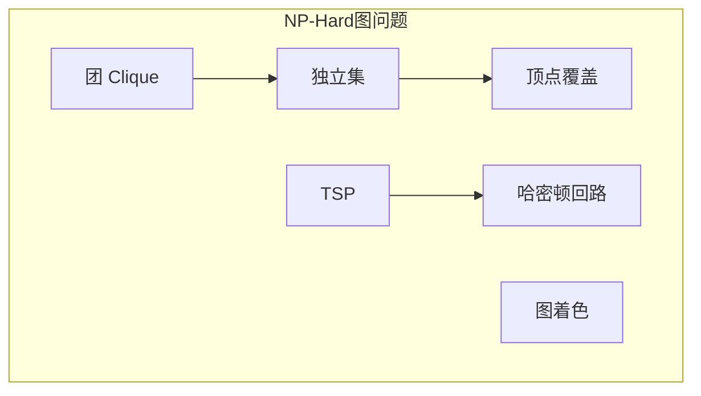
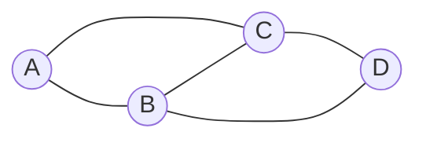
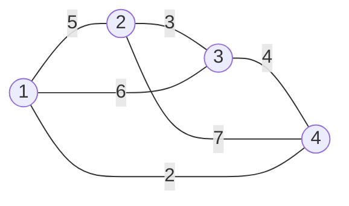

# 第19章 图问题：NP-Hard

> NP-Hard 图问题没有已知的多项式时间精确算法，需要近似、启发式或穷举策略。
>
> — Steven S. Skiena, The Algorithm Design Manual

[← 上一章](./ch18.md) | [目录](../index.md) | [下一章 →](./ch20.md)

---

本章收录**NP-Hard**（或 NP-Complete）的图问题，包括团、独立集、顶点覆盖、旅行商、哈密顿回路、图划分、着色等。这些问题在理论上难以精确求解，实践中常依赖近似算法、启发式或参数化方法。

---

## 19.1 团（Clique）

### 问题描述

给定无向图 $G = (V, E)$，求**团**（clique）——顶点子集 $S \subseteq V$，使得 $S$ 中任意两点均有边相连。**最大团**（maximum clique）：顶点数最多的团。

### 输入 / 输出

| 项目 | 说明 |
|------|------|
| **输入** | 无向图 $G$ |
| **输出** | 最大团的大小及顶点集，或判定是否存在大小为 $k$ 的团 |

### 讨论

- **NP-Complete**：判定「是否存在大小为 $k$ 的团」是 NP-Complete。
- **与独立集的关系**：$S$ 是 $G$ 的团当且仅当 $S$ 是补图 $\bar{G}$ 的独立集。
- **应用**：社交网络中的紧密群体、生物网络中的功能模块、编码理论。

上图中 $\{A,B,C\}$ 构成一个团，$\{B,C,D\}$ 也是团。

### 复杂度

- 精确求解：指数时间 $O(2^{|V|})$ 量级。
- 近似：最大团无常数因子近似（除非 P=NP）。
- 参数化：对团大小 $k$ 参数化，可 $O(2^k \cdot |V|^2)$。

### 实现推荐

- 小图：回溯 + 剪枝（Bron-Kerbosch）。
- 启发式：局部搜索、模拟退火、遗传算法。
- 库：NetworkX `find_cliques`（枚举所有极大团）、BGL。

::: tip 极大团与最大团
**极大团**（maximal clique）是不能再加入顶点仍为团的团；**最大团**是顶点数最多的团。最大团必为极大团，反之不然。
:::

---

## 19.2 独立集（Independent Set）

### 问题描述

给定无向图 $G = (V, E)$，求**独立集**（independent set）——顶点子集 $S \subseteq V$，使得 $S$ 中任意两点均无边相连。**最大独立集**（maximum independent set, MIS）：顶点数最多的独立集。

### 输入 / 输出

| 项目 | 说明 |
|------|------|
| **输入** | 无向图 $G$ |
| **输出** | 最大独立集的大小及顶点集 |

### 讨论

- **NP-Complete**：最大独立集判定是 NP-Complete。
- **与顶点覆盖的关系**：$S$ 是独立集当且仅当 $V \setminus S$ 是顶点覆盖。
- **与团的关系**：$S$ 是 $G$ 的独立集当且仅当 $S$ 是 $\bar{G}$ 的团。
- **应用**：任务调度（冲突图）、信道分配、资源选择。

### 复杂度

- 精确：指数时间。
- 近似：一般图无常数因子近似；二部图可多项式求解（最大匹配）。
- 特殊图：树、二部图、弦图等有多项式算法。

### 实现推荐

- 小图：回溯、分支定界。
- 启发式：贪心（选度最小的顶点）、局部搜索。
- 库：NetworkX、BGL。

---

## 19.3 顶点覆盖（Vertex Cover）

### 问题描述

给定无向图 $G = (V, E)$，求**顶点覆盖**（vertex cover）——顶点子集 $S \subseteq V$，使得每条边至少有一个端点在 $S$ 中。**最小顶点覆盖**（minimum vertex cover）：顶点数最少的覆盖。

### 输入 / 输出

| 项目 | 说明 |
|------|------|
| **输入** | 无向图 $G$ |
| **输出** | 最小顶点覆盖的大小及顶点集 |

### 讨论

- **NP-Complete**：最小顶点覆盖判定是 NP-Complete。
- **与独立集**：$S$ 是顶点覆盖当且仅当 $V \setminus S$ 是独立集。
- **二部图**：König 定理——最小顶点覆盖大小 = 最大匹配大小，可用最大流求。
- **应用**：监控布置、设施选址、网络安全。

### 复杂度

- 一般图：NP-Hard，无已知多项式精确算法。
- 二部图：$O(\sqrt{|V|} \cdot |E|)$（最大匹配）。
- 近似：2-近似（取极大匹配的端点）。

### 实现推荐

- 二部图：最大匹配，再根据 König 定理构造覆盖。
- 一般图：2-近似、分支定界、ILP。
- 库：NetworkX、BGL。

---

## 19.4 旅行商问题（Traveling Salesman Problem, TSP）

### 问题描述

给定 $n$ 个城市及两两间距离，求访问每个城市恰好一次并返回起点的**最短回路**（Hamiltonian cycle）。**度量 TSP**：距离满足三角不等式。

### 输入 / 输出

| 项目 | 说明 |
|------|------|
| **输入** | 完全图或距离矩阵 $d_{ij}$ |
| **输出** | 最短回路及总长度 |

### 讨论

- **NP-Hard**：判定版本为 NP-Complete。
- **精确算法**：动态规划（ Held-Karp）$O(n^2 2^n)$，适用于 $n \leq 20$。
- **近似**：度量 TSP 有 1.5-近似（Christofides）；一般 TSP 无常数近似。
- **启发式**：最近邻、2-opt、3-opt、模拟退火、遗传算法。

### 复杂度

| 方法 | 复杂度 |
|------|--------|
| 穷举 | $O(n!)$ |
| Held-Karp DP | $O(n^2 2^n)$ |
| Christofides 近似 | $O(n^3)$ |
| 2-opt 启发式 | $O(n^2)$ 每次迭代 |

### 实现推荐

- $n \leq 20$：Held-Karp。
- 大规模：LKH、Concorde 等专用求解器。
- 近似：Christofides（度量 TSP）。
- 库：OR-Tools、Concorde、NetworkX。

---

## 19.5 哈密顿回路（Hamiltonian Cycle）

### 问题描述

给定图 $G$，判断是否存在**哈密顿回路**（Hamiltonian cycle）——经过每个顶点恰好一次的回路。**哈密顿路径**：经过每个顶点恰好一次的路径。

### 输入 / 输出

| 项目 | 说明 |
|------|------|
| **输入** | 图 $G$（有向或无向） |
| **输出** | 是否存在哈密顿回路/路径，若存在则输出一条 |

### 讨论

- **NP-Complete**：哈密顿回路判定是 NP-Complete。
- **与 TSP 的关系**：TSP 可归约到哈密顿回路（边权 0/1）。
- **充分条件**：Dirac 定理——$n \geq 3$ 且最小度 $\geq n/2$ 的图必有哈密顿回路。
- **应用**：电路设计、DNA 测序、游戏解谜。

### 复杂度

- 精确：指数时间，回溯 $O(n!)$ 量级。
- 参数化：对路径长度 $k$ 可 $O(2^k \cdot n)$。

### 实现推荐

- 小图：回溯 + 剪枝。
- 启发式：贪心、局部搜索。
- 库：NetworkX `hamiltonian_path`（启发式）。

---

## 19.6 图划分（Graph Partitioning）

### 问题描述

将顶点集 $V$ 划分为 $k$ 个部分 $V_1, \ldots, V_k$，在满足平衡约束（如 $|V_i| \approx |V|/k$）下，最小化**割边数**（cut）或割边权值和。典型：**最小割**（min-cut）、**平衡割**（balanced cut）。

### 输入 / 输出

| 项目 | 说明 |
|------|------|
| **输入** | 图 $G$，划分数 $k$，平衡约束 |
| **输出** | 划分方案及割的大小 |

### 讨论

- **NP-Hard**：即使 $k=2$（图二划分）也是 NP-Hard。
- **$k=2$**：最小割可多项式求解（最大流最小割定理）；平衡割仍 NP-Hard。
- **启发式**：Kernighan-Lin、谱划分、METIS。
- **应用**：VLSI 布局、并行计算、社区检测。

### 复杂度

- 最小割（无平衡约束）：$O(|V|^2 \cdot |E|)$（Stoer-Wagner）。
- 平衡割：NP-Hard，常用启发式。

### 实现推荐

- 最小割：最大流/最小割算法。
- 平衡划分：METIS、Scotch、KaHIP。
- 库：NetworkX、igraph。

---

## 19.7 顶点着色（Vertex Coloring）

### 问题描述

给定无向图 $G$，用最少颜色为顶点着色，使得相邻顶点颜色不同。求**色数**（chromatic number）$\chi(G)$ 及一种最优着色。

### 输入 / 输出

| 项目 | 说明 |
|------|------|
| **输入** | 无向图 $G$ |
| **输出** | 色数及着色方案 |

### 讨论

- **NP-Complete**：判定「是否可用 $k$ 色着色」是 NP-Complete（$k \geq 3$）。
- **特殊图**：二部图 $\chi=2$；平面图 $\chi \leq 4$（四色定理）。
- **上界**：$\chi \leq \Delta + 1$（$\Delta$ 为最大度）；Brooks 定理可改进。
- **应用**：调度、寄存器分配、数独。

### 复杂度

- 精确：指数时间。
- 近似：无常数因子近似（除非 P=NP）。
- 贪心：$O(|V| + |E|)$，最多用 $\Delta + 1$ 色。

### 实现推荐

- 小图：回溯、DSatur、分支定界。
- 启发式：贪心、遗传算法、模拟退火。
- 库：NetworkX、igraph、BGL。

---

## 19.8 边着色（Edge Coloring）

### 问题描述

用最少颜色为边着色，使得相邻边（共享顶点）颜色不同。求**边色数**（chromatic index）$\chi'(G)$。

### 输入 / 输出

| 项目 | 说明 |
|------|------|
| **输入** | 无向图 $G$ |
| **输出** | 边色数及边着色方案 |

### 讨论

- **Vizing 定理**：$\Delta \leq \chi' \leq \Delta + 1$。二部图 $\chi' = \Delta$。
- **NP-Complete**：判定 $\chi' = \Delta$ 还是 $\Delta + 1$ 是 NP-Complete。
- **应用**：任务调度、通信信道分配。

### 复杂度

- 二部图：$O(|V| \cdot |E|)$（König 定理 + 匹配）。
- 一般图：NP-Hard，贪心可得 $(\Delta+1)$-着色。

### 实现推荐

- 二部图：转化为匹配问题。
- 一般图：贪心或专用算法。
- 库：NetworkX、BGL。

---

## 19.9 图同构（Graph Isomorphism）

### 问题描述

给定两个图 $G_1$ 和 $G_2$，判断是否**同构**（isomorphic），即是否存在顶点双射 $f$ 使得 $(u,v) \in E_1 \Leftrightarrow (f(u), f(v)) \in E_2$。

### 输入 / 输出

| 项目 | 说明 |
|------|------|
| **输入** | 两个图 $G_1, G_2$ |
| **输出** | 是否同构，若是则可选同构映射 |

### 讨论

- **复杂度**：未知是否 NP-Complete，一般认为在 NP 与 co-NP 之间。2015 年 Babai 给出拟多项式算法 $2^{O(\log n)^c}$。
- **特殊图**：树、平面图、有界度图有多项式算法。
- **应用**：化学分子识别、网络比对、程序分析。

### 复杂度

- 最坏：拟多项式（Babai）。
- 平均/随机：多项式。
- 特殊图：多项式。

### 实现推荐

- 库：NetworkX `is_isomorphic`、VF2 算法；nauty、bliss 等专用工具。
- 小图：暴力或回溯。

::: info 开放问题
图同构是否属于 P 是重要的开放问题，与因子分解、离散对数等不同。
:::

---

## 19.10 反馈顶点集 / 反馈边集（Feedback Vertex/Edge Set）

### 问题描述

- **反馈顶点集**（feedback vertex set, FVS）：删除最少顶点使图无环。
- **反馈边集**（feedback edge set）：删除最少边使图无环。

### 输入 / 输出

| 项目 | 说明 |
|------|------|
| **输入** | 有向或无向图 $G$ |
| **输出** | 最小反馈顶点集/边集的大小及集合 |

### 讨论

- **NP-Complete**：两者判定均为 NP-Complete。
- **反馈边集**：等价于找最大无环边集，即**最小边覆盖**；无向图等于 $|E| - |V| + c$（$c$ 为连通分量数）。
- **反馈顶点集**：无向图有 2-近似；有向图更难。
- **应用**：死锁消除、电路设计、生物网络。

### 复杂度

- 反馈边集（无向）：$O(|V| + |E|)$（求生成树，剩余边即为解）。
- 反馈顶点集：NP-Hard，2-近似 $O(|V| + |E|)$。

### 实现推荐

- 反馈边集：DFS/BFS 求生成森林，非树边构成最小反馈边集。
- 反馈顶点集：2-近似（迭代删除环上顶点）；精确解需 ILP 或分支定界。
- 库：NetworkX、BGL。

---

## 本章小结

| 问题 | 复杂度 | 常用策略 |
|------|--------|----------|
| 团 | NP-Complete | 回溯、Bron-Kerbosch、启发式 |
| 独立集 | NP-Complete | 回溯、与团/顶点覆盖转化 |
| 顶点覆盖 | NP-Complete | 2-近似、二部图最大匹配 |
| TSP | NP-Hard | Held-Karp、Christofides、LKH |
| 哈密顿回路 | NP-Complete | 回溯、启发式 |
| 图划分 | NP-Hard | 最小割、METIS、谱方法 |
| 顶点着色 | NP-Complete | 贪心、DSatur、回溯 |
| 边着色 | NP-Hard | 二部图匹配、贪心 |
| 图同构 | 未知 | VF2、nauty、bliss |
| 反馈顶点/边集 | NP-Complete | 反馈边集线性、FVS 2-近似 |

---

[← 上一章](./ch18.md) | [目录](../index.md) | [下一章 →](./ch20.md)
