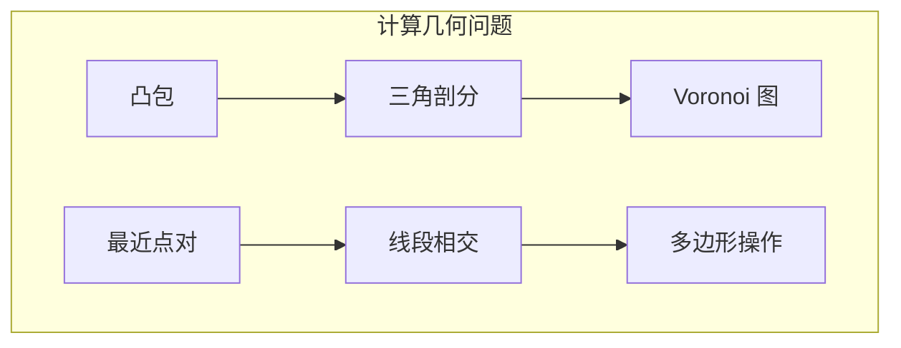
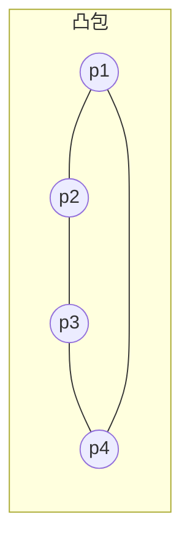
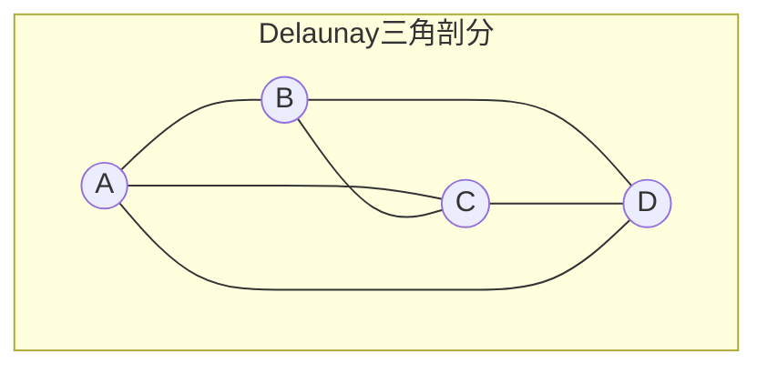
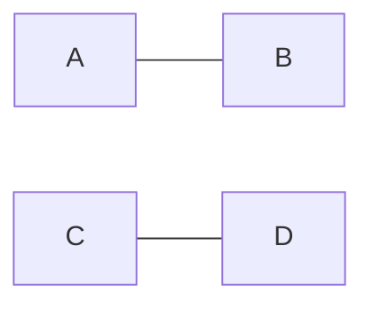

# 第20章 计算几何

> 计算几何将几何直觉与算法效率结合，是图形学、GIS、机器人等领域的核心工具。
>
> — Steven S. Skiena, The Algorithm Design Manual

[← 上一章](./ch19.md) | [目录](../index.md) | [下一章 →](./ch21.md)

---

本章收录**计算几何**（computational geometry）中的经典问题，包括凸包、三角剖分、Voronoi 图、最近点对、线段相交、多边形操作等。这些问题在计算机图形学、地理信息系统、机器人学、CAD 中有广泛应用。

---

## 20.1 凸包（Convex Hull）

### 问题描述

给定平面点集 $P = \{p_1, \ldots, p_n\}$，求**凸包**（convex hull）——包含 $P$ 中所有点的最小凸多边形。凸包顶点是 $P$ 的子集，按逆时针（或顺时针）排列。

### 输入 / 输出

| 项目 | 说明 |
|------|------|
| **输入** | $n$ 个二维点 $(x_i, y_i)$ |
| **输出** | 凸包顶点序列（按环序） |

### 讨论

- **Graham 扫描**：按极角排序，用栈维护凸包，$O(n \log n)$。
- **Jarvis 步进**（礼品包装）：每次找最右/最左点，$O(n \cdot h)$，$h$ 为凸包顶点数。
- **Andrew 算法**：上下凸包分别求，$O(n \log n)$，数值更稳定。
- **应用**：碰撞检测、形状简化、范围查询。

### 复杂度

| 算法 | 时间复杂度 | 空间 |
|------|------------|------|
| Graham 扫描 | $O(n \log n)$ | $O(n)$ |
| Jarvis 步进 | $O(n \cdot h)$ | $O(n)$ |
| Andrew | $O(n \log n)$ | $O(n)$ |

### 实现推荐

- 一般情况：Graham 或 Andrew。
- 凸包顶点少：Jarvis 可能更快。
- 库：CGAL、Boost.Geometry、Shapely、scipy.spatial。

---

## 20.2 三角剖分（Triangulation）

### 问题描述

将平面区域（多边形或点集）划分为**三角形**的集合，使三角形内部不交、并覆盖原区域。**Delaunay 三角剖分**：满足空圆性质的三角剖分，最大化最小角。

### 输入 / 输出

| 项目 | 说明 |
|------|------|
| **输入** | 简单多边形顶点序列，或平面点集 |
| **输出** | 三角形列表（顶点索引或坐标） |

### 讨论

- **简单多边形**：$O(n)$ 时间可三角剖分（Chazelle）。
- **点集 Delaunay**：增量法 $O(n \log n)$，分治法 $O(n \log n)$。
- **Delaunay 性质**：每个三角形的外接圆不包含其他点；与 Voronoi 图对偶。
- **应用**：有限元网格、地形建模、插值。

### 复杂度

| 问题 | 复杂度 |
|------|--------|
| 简单多边形三角剖分 | $O(n)$（Chazelle）或 $O(n \log n)$（简单算法） |
| 点集 Delaunay | $O(n \log n)$ |
| 约束 Delaunay | $O(n \log n)$ |

### 实现推荐

- 点集：Delaunay 三角剖分，CGAL、Triangle、scipy。
- 多边形：Ear clipping $O(n^2)$，或库实现。
- 库：CGAL、Triangle、GEOS、Shapely。

---

## 20.3 Voronoi 图（Voronoi Diagram）

### 问题描述

给定平面点集 $P$（站点），**Voronoi 图**将平面划分为区域，使得每个区域内的点到对应站点的距离最近。Voronoi 边是到两站点等距的点的轨迹。

### 输入 / 输出

| 项目 | 说明 |
|------|------|
| **输入** | $n$ 个站点（二维点） |
| **输出** | Voronoi 顶点、边、面（或对偶的 Delaunay 三角剖分） |

### 讨论

- **对偶**：Voronoi 图与 Delaunay 三角剖分对偶，可通过 Delaunay 构造。
- **Fortune 算法**：平面扫描 $O(n \log n)$。
- **应用**：最近邻查询、势力范围、路径规划、生物形态。

### 复杂度

- 时间复杂度：$O(n \log n)$
- 空间复杂度：$O(n)$
- Voronoi 顶点/边数：$O(n)$

### 实现推荐

- 通过 Delaunay 对偶构造。
- 库：CGAL、scipy.spatial.Voronoi、Shapely。

::: tip 对偶关系
Voronoi 顶点对应 Delaunay 三角形的外心；Delaunay 边对应 Voronoi 边。掌握对偶可简化实现。
:::

---

## 20.4 最近点对（Closest Pair of Points）

### 问题描述

给定平面点集 $P$，求距离最近的两点及其距离。

### 输入 / 输出

| 项目 | 说明 |
|------|------|
| **输入** | $n$ 个二维点 |
| **输出** | 最近点对 $(p, q)$ 及距离 $d(p,q)$ |

### 讨论

- **分治法**：按 $x$ 坐标分治，合并时只需检查「带」内 $O(1)$ 个点，$O(n \log n)$。
- **随机增量**：期望 $O(n)$，结合网格或 KD 树。
- **应用**：碰撞检测、聚类、数据库查询。

### 复杂度

- 分治：$O(n \log n)$
- 暴力：$O(n^2)$
- 随机：期望 $O(n)$

### 实现推荐

- 标准：分治法，实现清晰。
- 高维：KD 树、球树。
- 库：scipy.spatial.distance、CGAL。

---

## 20.5 线段相交检测（Line Segment Intersection）

### 问题描述

- **检测**：判断两条线段是否相交。
- **报告**：给定 $n$ 条线段，报告所有相交对。
- **计数**：统计相交对数量。

### 输入 / 输出

| 项目 | 说明 |
|------|------|
| **输入** | 线段端点坐标；或 $n$ 条线段 |
| **输出** | 是否相交；或所有相交对列表 |

### 讨论

- **两线段相交**：跨立实验 + 快速排斥，$O(1)$。
- **$n$ 条线段**：Bentley-Ottmann 平面扫描 $O((n+k)\log n)$，$k$ 为交点数。
- **应用**：CAD、游戏碰撞、GIS 叠加分析。

两线段 $AB$ 与 $CD$ 相交需满足：$AB$ 跨立 $CD$ 且 $CD$ 跨立 $AB$。

### 复杂度

| 问题 | 复杂度 |
|------|--------|
| 两线段相交 | $O(1)$ |
| $n$ 条线段报告所有交 | $O((n+k)\log n)$ |
| $n$ 条线段计数 | $O(n \log n)$（Bentley-Ottmann） |

### 实现推荐

- 两线段：跨立实验，注意共线、端点重合。
- 多线段：Bentley-Ottmann 或简化版（仅检测，不报告）。
- 库：CGAL、Boost.Geometry、Shapely。

---

## 20.6 多边形切割（Polygon Clipping）

### 问题描述

给定两个多边形 $A$ 和 $B$，求**交**（intersection）、**并**（union）、**差**（difference）等布尔运算结果。典型如 **Sutherland-Hodgman** 多边形裁剪：用凸多边形窗口裁剪任意多边形。

### 输入 / 输出

| 项目 | 说明 |
|------|------|
| **输入** | 两个多边形（顶点序列） |
| **输出** | 运算后的多边形（可能多个） |

### 讨论

- **Sutherland-Hodgman**：用每条裁剪边依次裁剪，$O(n \cdot m)$，$n,m$ 为顶点数。
- **Weiler-Atherton**：可处理带洞多边形，更通用。
- **Greiner-Hormann**：处理自交、退化情况。
- **应用**：图形裁剪、CAD 布尔运算、GIS 叠加。

### 复杂度

- Sutherland-Hodgman：$O(n \cdot m)$
- Weiler-Atherton：$O((n+m) \log (n+m))$
- Greiner-Hormann：$O(n \cdot m)$

### 实现推荐

- 凸窗口裁剪：Sutherland-Hodgman。
- 一般多边形：Greiner-Hormann、Clipper 库。
- 库：Clipper、Boost.Geometry、Shapely、CGAL。

---

## 20.7 形状相似度（Shape Similarity）

### 问题描述

比较两个形状（多边形、曲线、点集）的**相似度**，输出距离或相似度分数。常用度量：Hausdorff 距离、Fréchet 距离、面积对称差等。

### 输入 / 输出

| 项目 | 说明 |
|------|------|
| **输入** | 两个形状（多边形、折线、点集） |
| **输出** | 相似度/距离值 |

### 讨论

- **Hausdorff 距离**：$d_H(A,B) = \max\{\sup_{a \in A} d(a,B), \sup_{b \in B} d(b,A)\}$。
- **Fréchet 距离**：考虑沿曲线「行走」的对应，$O(n^2)$ 动态规划。
- **面积对称差**：$|A \triangle B| = |A \cup B| - |A \cap B|$，需多边形布尔运算。
- **应用**：形状检索、手写识别、生物形态比较。

### 复杂度

| 度量 | 复杂度 |
|------|--------|
| Hausdorff（离散点集） | $O(n \cdot m)$ |
| Fréchet（折线） | $O(n \cdot m)$ |
| 面积对称差 | 依赖多边形运算 |

### 实现推荐

- Hausdorff：暴力或 Voronoi 加速。
- Fréchet：动态规划，注意离散化。
- 库：Shapely、CGAL、scipy.spatial。

---

## 20.8 运动规划（Motion Planning）

### 问题描述

在含障碍物的空间中，为机器人（点、圆、多边形）规划从起点到终点的**无碰撞路径**。**可见性图**、**Voronoi 图**、**势场法**、**RRT** 等为常用方法。

### 输入 / 输出

| 项目 | 说明 |
|------|------|
| **输入** | 障碍物描述、起点、终点、机器人形状 |
| **输出** | 路径（折线或曲线），或报告无解 |

### 讨论

- **可见性图**：顶点为多边形顶点，边为可见线段，最短路径在图上求。
- **Voronoi**：沿 Voronoi 边行走可最大化与障碍物距离。
- **RRT/RRT***：随机采样，适合高维。
- **应用**：机器人导航、游戏 AI、动画。

### 复杂度

- 简单多边形：可见性图 $O(n^2)$ 构建，最短路径 $O(n^2)$。
- 一般：NP-Hard，常用启发式、采样法。

### 实现推荐

- 二维、多边形障碍：可见性图、Voronoi。
- 高维、复杂：RRT、PRM、OMPL。
- 库：OMPL、MoveIt、PyBullet。

---

## 20.9 维持线段排列（Maintaining Line Arrangements）

### 问题描述

维护平面**线段排列**（arrangement）——$n$ 条线段将平面划分成的面、边、顶点结构。支持查询（点定位、射线射击）、动态插入/删除线段。

### 输入 / 输出

| 项目 | 说明 |
|------|------|
| **输入** | 线段集合，可选动态操作 |
| **输出** | 排列结构；查询结果（所在面、相交线段等） |

### 讨论

- **排列复杂度**：$O(n^2)$ 个顶点、边、面（最坏）。
- **点定位**：$O(\log n)$ 查询，$O(n^2)$ 预处理。
- **增量构建**：插入一条线段 $O(k)$，$k$ 为与已有线段的交点数。
- **应用**：GIS、CAD、可见性计算。

### 复杂度

- 构建：$O(n^2)$ 或 $O((n+k)\log n)$（$k$ 为交点数）
- 点定位：$O(\log n)$ 查询
- 空间：$O(n^2)$

### 实现推荐

- 库：CGAL Arrangement_2。
- 简单需求：Bentley-Ottmann 风格扫描。

---

## 20.10 小面积包围（Smallest Enclosing Shape）

### 问题描述

给定点集 $P$，求**最小包围形状**：
- **最小包围圆**（smallest enclosing circle, SEC）
- **最小包围矩形**（minimum bounding rectangle, MBR）
- **最小包围椭圆**、**最小包围凸 $k$-gon** 等

### 输入 / 输出

| 项目 | 说明 |
|------|------|
| **输入** | $n$ 个二维点 |
| **输出** | 包围形状的参数（圆心半径、矩形顶点等） |

### 讨论

- **最小包围圆**：Welzl 随机增量 $O(n)$ 期望；Megiddo 线性确定性（复杂）。
- **最小包围矩形**：旋转卡壳，$O(n)$ 或 $O(n \log n)$（先求凸包）。
- **最小面积矩形**：必有一边与凸包边重合，旋转卡壳枚举。
- **应用**：碰撞检测、形状拟合、数据库索引（MBR）。

### 复杂度

| 形状 | 复杂度 |
|------|--------|
| 最小包围圆 | $O(n)$ 期望（Welzl） |
| 最小包围矩形 | $O(n)$（旋转卡壳，先凸包） |
| 轴对齐包围盒 AABB | $O(n)$ |

### 实现推荐

- 最小包围圆：Welzl 算法，实现简单。
- 最小包围矩形：凸包 + 旋转卡壳。
- 库：CGAL、scipy、Shapely。

---

## 本章小结

| 问题 | 典型复杂度 | 核心方法 |
|------|------------|----------|
| 凸包 | $O(n \log n)$ | Graham、Andrew、Jarvis |
| 三角剖分 | $O(n \log n)$ | Delaunay、Ear clipping |
| Voronoi 图 | $O(n \log n)$ | Fortune、Delaunay 对偶 |
| 最近点对 | $O(n \log n)$ | 分治 |
| 线段相交 | $O((n+k)\log n)$ | Bentley-Ottmann |
| 多边形切割 | $O(n \cdot m)$ | Sutherland-Hodgman、Clipper |
| 形状相似度 | $O(n \cdot m)$ | Hausdorff、Fréchet |
| 运动规划 | 多变 | 可见性图、RRT |
| 线段排列 | $O(n^2)$ | 增量、CGAL |
| 最小包围形状 | $O(n)$ | Welzl、旋转卡壳 |

---

[← 上一章](./ch19.md) | [目录](../index.md) | [下一章 →](./ch21.md)
