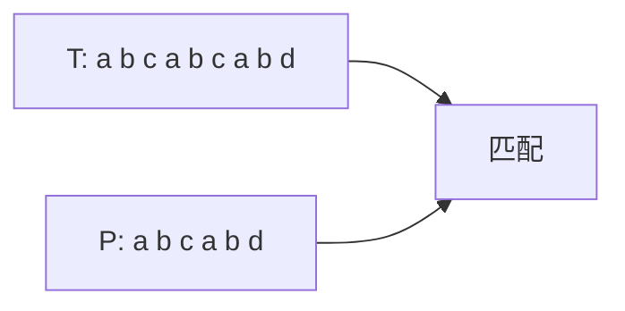
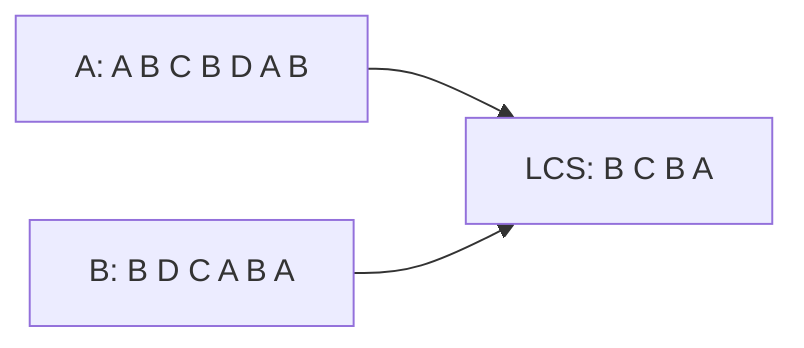
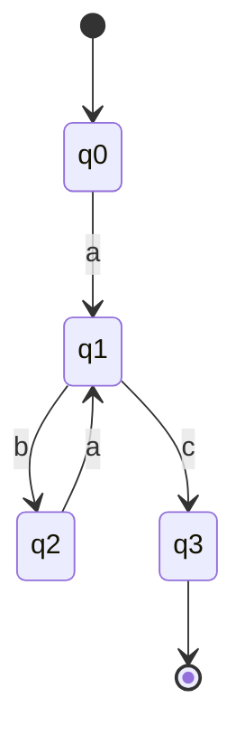

# 第21章 集合与字符串问题

> 集合与字符串问题贯穿算法设计的各个领域，从组合优化到文本处理、从压缩到密码学。
>
> — Steven S. Skiena, The Algorithm Design Manual

[← 上一章](./ch20.md) | [目录](../index.md)

---

本章收录**集合问题**（set problems）与**字符串问题**（string problems），包括集合覆盖、集合打包、字符串匹配、近似匹配、最长公共子序列、最短公共超串、文本压缩、密码学、有限自动机最小化等。这些问题在信息检索、生物信息学、编译原理、安全领域有广泛应用。

---

## 21.1 集合覆盖（Set Cover）

### 问题描述

给定全集 $U$ 和子集族 $\mathcal{F} = \{S_1, \ldots, S_m\}$，$S_i \subseteq U$。求**集合覆盖**——选出最少的 $S_i$ 使其并集等于 $U$。

### 输入 / 输出

| 项目 | 说明 |
|------|------|
| **输入** | 全集 $U$，子集族 $\mathcal{F}$ |
| **输出** | 覆盖 $U$ 的最小子集族，或最小覆盖大小 |

### 讨论

- **NP-Complete**：集合覆盖判定是 NP-Complete。
- **贪心近似**：每次选覆盖最多未覆盖元素的集合，$H_n$-近似（$H_n \approx \ln n$）。
- **与顶点覆盖**：顶点覆盖可归约到集合覆盖。
- **应用**：设施选址、传感器布置、测试用例选择。

### 复杂度

- 精确：指数时间。
- 贪心近似：$O(|U| \cdot |\mathcal{F}|)$，近似比 $H_n$。
- 不可近似：不存在 $(1-\varepsilon)\ln n$ 近似（除非 NP $\subseteq$ DTIME($n^{O(\log\log n)})$）。

### 实现推荐

- 小规模：回溯、分支定界、ILP。
- 大规模：贪心近似。
- 库：OR-Tools、SCIP、自定义实现。

::: tip 加权集合覆盖
边带权时求最小权覆盖，贪心可得 $H_n$-近似；子模函数贪心有更好保证。
:::

---

## 21.2 集合打包（Set Packing）

### 问题描述

给定全集 $U$ 和子集族 $\mathcal{F}$，求**集合打包**——选出最多的两两不交的 $S_i$。

### 输入 / 输出

| 项目 | 说明 |
|------|------|
| **输入** | 全集 $U$，子集族 $\mathcal{F}$ |
| **输出** | 最大不交子集族，或最大打包大小 |

### 讨论

- **NP-Complete**：集合打包判定是 NP-Complete。
- **与独立集**：可转化为超图的独立集。
- **与匹配**：当每个 $S_i$ 大小为 2 时，等价于图匹配。
- **应用**：资源分配、任务调度、组合拍卖。

### 复杂度

- 精确：指数时间。
- 近似：难以近似（无常数因子，除非 P=NP）。
- 特殊结构：某些超图类有多项式算法。

### 实现推荐

- 小规模：回溯、ILP。
- 启发式：贪心、局部搜索。
- 库：OR-Tools、SCIP。

---

## 21.3 字符串匹配（String Matching）

### 问题描述

在**文本**（text）$T$ 中查找**模式**（pattern）$P$ 的所有出现位置。**精确匹配**：要求完全一致。

### 输入 / 输出

| 项目 | 说明 |
|------|------|
| **输入** | 文本 $T[1..n]$，模式 $P[1..m]$ |
| **输出** | $P$ 在 $T$ 中所有出现位置的起始下标 |

### 讨论

- **朴素算法**：逐位比较，$O(n \cdot m)$。
- **KMP**：利用失配信息避免回溯，$O(n + m)$。
- **Boyer-Moore**：从右向左比较，坏字符/好后缀启发式，实践中常优于 KMP。
- **Rabin-Karp**：滚动哈希，$O(n + m)$ 期望，可扩展为多模式。
- **应用**：文本编辑、生物序列搜索、入侵检测。

### 复杂度

| 算法 | 时间复杂度 | 特点 |
|------|------------|------|
| 朴素 | $O(n \cdot m)$ | 简单 |
| KMP | $O(n + m)$ | 最坏线性 |
| Boyer-Moore | $O(n + m)$ 典型 $O(n/m)$ | 实践中快 |
| Rabin-Karp | $O(n + m)$ 期望 | 多模式、滚动哈希 |

### 实现推荐

- 单模式：KMP 或 Boyer-Moore。
- 多模式：Aho-Corasick、Rabin-Karp。
- 库：C++ `std::search`、Python `str.find`、RE2、Hyperscan。

---

## 21.4 近似字符串匹配（Approximate String Matching）

### 问题描述

在文本 $T$ 中查找与模式 $P$ **近似匹配**的子串，允许**编辑距离**（插入、删除、替换）或**汉明距离**等度量。求所有满足距离 $\leq k$ 的出现位置。

### 输入 / 输出

| 项目 | 说明 |
|------|------|
| **输入** | 文本 $T$，模式 $P$，距离阈值 $k$，距离度量 |
| **输出** | 所有近似匹配位置及距离值 |

### 讨论

- **编辑距离**（Levenshtein）：$d(i,j)$ 为 $T[1..i]$ 与 $P[1..j]$ 的最小编辑距离，DP $O(n \cdot m)$。
- **$k$-差异**：只关心距离 $\leq k$，可 $O(n \cdot k)$（Ukkonen 或 Myers）。
- **应用**：拼写检查、生物序列比对、模糊搜索。

### 复杂度

| 问题 | 复杂度 |
|------|--------|
| 编辑距离 DP | $O(n \cdot m)$ |
| $k$-差异 | $O(n \cdot k)$ |
| 汉明距离 | $O(n)$（FFT 或位运算） |

### 实现推荐

- 编辑距离：标准 DP。
- $k$-差异：Myers bit-parallel、suffix automaton。
- 库：Levenshtein、rapidfuzz、edlib、SeqAn。

---

## 21.5 最长公共子串与最长公共子序列（LCS）

### 问题描述

- **最长公共子串**（longest common substring）：两个字符串 $A, B$ 的连续公共子串的最大长度。
- **最长公共子序列**（longest common subsequence, LCS）：不要求连续，保持相对顺序的公共子序列的最大长度。

### 输入 / 输出

| 项目 | 说明 |
|------|------|
| **输入** | 两个字符串 $A[1..n]$，$B[1..m]$ |
| **输出** | 最长公共子串/子序列的长度及一个实例 |

### 讨论

- **最长公共子串**：后缀数组或后缀自动机 $O(n + m)$；DP $O(n \cdot m)$。
- **LCS**：经典 DP $d(i,j) = \max\{d(i-1,j), d(i,j-1), d(i-1,j-1)+[A_i=B_j]\}$，$O(n \cdot m)$。
- **Hunt-Szymanski**：当字母表小时可 $O((n+m)\log n)$。
- **应用**：diff、生物序列比对、版本比较。

### 复杂度

| 问题 | 复杂度 |
|------|--------|
| 最长公共子串（DP） | $O(n \cdot m)$ |
| 最长公共子串（后缀结构） | $O(n + m)$ |
| LCS（DP） | $O(n \cdot m)$ |
| LCS（Hunt-Szymanski） | $O((n+m)\log n)$（小字母表） |

### 实现推荐

- LCS：标准 DP，需回溯构造解。
- 最长公共子串：后缀数组 + LCP。
- 库：`difflib`、`SequenceMatcher`、BioPython。

---

## 21.6 最短公共超串（Shortest Common Superstring, SCS）

### 问题描述

给定字符串集合 $\{s_1, \ldots, s_k\}$，求包含每个 $s_i$ 作为子串的**最短字符串**。

### 输入 / 输出

| 项目 | 说明 |
|------|------|
| **输入** | $k$ 个字符串 |
| **输出** | 最短公共超串及其长度 |

### 讨论

- **NP-Hard**：即使 $|\Sigma| = 2$ 也是 NP-Hard。
- **与 TSP**：可归约到 TSP（overlap 图）。
- **贪心近似**：反复合并 overlap 最大的两个串，2.5-近似。
- **应用**：DNA 组装、数据压缩、协议设计。

### 复杂度

- 精确：指数时间。
- 贪心：$O(n^2)$（$n$ 为总长度），2.5-近似。
- 与 TSP 归约后可用 TSP 启发式。

### 实现推荐

- 小规模：穷举或 ILP。
- 大规模：贪心合并。
- 库：自定义实现，或通过 TSP 求解器。

---

## 21.7 文本压缩（Text Compression）

### 问题描述

将文本 $T$ 压缩为更短的表示，支持**无损**解压还原。典型方法：**Huffman 编码**、**LZ77/LZ78**、**LZW**、**BWT+MTF+熵编码**（如 bzip2）。

### 输入 / 输出

| 项目 | 说明 |
|------|------|
| **输入** | 文本 $T$ |
| **输出** | 压缩后的比特流或字节流 |

### 讨论

- **Huffman**：变长编码，频率高则码长短，$O(n + |\Sigma|\log|\Sigma|)$。
- **LZ77**：滑动窗口 + 最长匹配，gzip 基础。
- **LZ78/LZW**：字典编码，GIF、TIFF 使用。
- **BWT**：Burrows-Wheeler 变换，使文本更易压缩，bzip2 基础。
- **应用**：文件压缩、通信、存储。

### 复杂度

| 方法 | 编码 | 解码 |
|------|------|------|
| Huffman | $O(n)$ | $O(n)$ |
| LZ77 | $O(n)$（后缀数组） | $O(n)$ |
| LZW | $O(n)$ | $O(n)$ |
| BWT | $O(n \log n)$ | $O(n)$ |

### 实现推荐

- 学习：Huffman、LZ77 手工实现。
- 生产：zlib、zstd、LZ4、bzip2。
- 库：zlib、lz4、zstd、Python `gzip`/`bz2`。

---

## 21.8 密码学（Cryptography）

### 问题描述

与字符串/数论相关的**密码学**（cryptography）任务：对称加密、哈希、公钥加密、数字签名、密钥交换等。算法设计手册中侧重**古典密码**、**哈希设计**、**随机数**等基础概念。

### 输入 / 输出

| 项目 | 说明 |
|------|------|
| **输入** | 明文、密钥、或待哈希数据 |
| **输出** | 密文、哈希值、签名等 |

### 讨论

- **对称加密**：AES、ChaCha20，密钥相同。
- **哈希**：SHA-2、SHA-3、BLAKE2，单向、抗碰撞。
- **公钥**：RSA、ECDH、Ed25519。
- **设计原则**：混淆、扩散、抗差分/线性分析。
- **应用**：安全通信、存储、认证。

### 复杂度

- 加密/解密：$O(n)$（分组密码）。
- 哈希：$O(n)$。
- RSA：$O(k^3)$，$k$ 为密钥长度（比特）。

### 实现推荐

- **勿自创**：使用标准库和经过验证的实现。
- 库：OpenSSL、libsodium、cryptography（Python）、Node crypto。

::: warning 安全实践
密码学实现极易出错，务必使用成熟库，避免自行实现用于生产环境。
:::

---

## 21.9 有限自动机最小化（Finite Automaton Minimization）

### 问题描述

给定**确定性有限自动机**（DFA）$M$，求与之等价且状态数最少的 DFA $M'$。

### 输入 / 输出

| 项目 | 说明 |
|------|------|
| **输入** | DFA $M$（状态集、转移、初态、终态） |
| **输出** | 最小 DFA $M'$ |

### 讨论

- **等价状态**：不可区分的状态可合并。
- **Hopcroft 算法**：$O(|\Sigma| \cdot |Q| \log |Q|)$，基于划分 refinement。
- **Moore 算法**：$O(|\Sigma| \cdot |Q|^2)$，迭代等价类划分。
- **应用**：编译器、正则引擎、硬件综合。

### 复杂度

| 算法 | 复杂度 |
|------|--------|
| Moore | $O(|\Sigma| \cdot |Q|^2)$ |
| Hopcroft | $O(|\Sigma| \cdot |Q| \log |Q|)$ |

### 实现推荐

- 教学：Moore 算法易实现。
- 生产：Hopcroft 或库实现。
- 库：OpenFST、fst、自定义。

---

## 21.10 其他相关问题

### 字符串排序与索引

- **后缀数组**（suffix array）：$O(n \log n)$ 构建，支持多种子串查询。
- **后缀树**：$O(n)$ 构建（Ukkonen），空间较大。
- **应用**：全文索引、生物信息、重复检测。

### 正则表达式匹配

- **Thompson NFA**：将正则转化为 NFA，$O(m)$ 构建，$O(n \cdot m)$ 匹配。
- **回溯**：简单实现可能指数时间（正则爆炸）。
- **应用**：文本搜索、输入验证、日志分析。

### 字典与 Trie

- **Trie**：前缀树，$O(|s|)$ 插入/查询。
- **后缀 Trie**：可视为后缀树简化版。
- **应用**：自动补全、拼写检查、IP 路由。

---

## 本章小结

| 问题 | 复杂度 | 核心方法 |
|------|--------|----------|
| 集合覆盖 | NP-Complete | 贪心 $H_n$-近似 |
| 集合打包 | NP-Complete | 回溯、ILP |
| 字符串匹配 | $O(n+m)$ | KMP、Boyer-Moore |
| 近似匹配 | $O(n \cdot k)$ | DP、Myers |
| 最长公共子序列 | $O(n \cdot m)$ | DP |
| 最短公共超串 | NP-Hard | 贪心 2.5-近似 |
| 文本压缩 | $O(n)$ | Huffman、LZ、BWT |
| 密码学 | 多变 | 使用标准库 |
| DFA 最小化 | $O(|Q|\log|Q|)$ | Hopcroft |

---

[← 上一章](./ch20.md) | [目录](../index.md)
