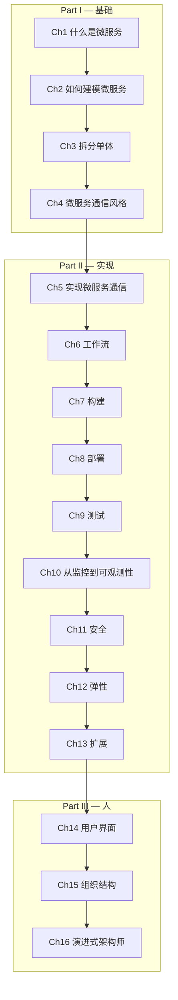

# 构建微服务

> **Building Microservices: Designing Fine-Grained Systems, 2nd Edition**
>
> Sam Newman, 2021, O'Reilly Media

---

## 章节路线图

---

## 目录

### Part I — 基础

| # | 章节 | 链接 |
|---|------|------|
| 1 | 什么是微服务？ | [→ 阅读](part1/ch01.md) |
| 2 | 如何建模微服务 | [→ 阅读](part1/ch02.md) |
| 3 | 拆分单体 | [→ 阅读](part1/ch03.md) |
| 4 | 微服务通信风格 | [→ 阅读](part1/ch04.md) |

### Part II — 实现

| # | 章节 | 链接 |
|---|------|------|
| 5 | 实现微服务通信 | [→ 阅读](part2/ch05.md) |
| 6 | 工作流 | [→ 阅读](part2/ch06.md) |
| 7 | 构建 | [→ 阅读](part2/ch07.md) |
| 8 | 部署 | [→ 阅读](part2/ch08.md) |
| 9 | 测试 | [→ 阅读](part2/ch09.md) |
| 10 | 从监控到可观测性 | [→ 阅读](part2/ch10.md) |
| 11 | 安全 | [→ 阅读](part2/ch11.md) |
| 12 | 弹性 | [→ 阅读](part2/ch12.md) |
| 13 | 扩展 | [→ 阅读](part2/ch13.md) |

### Part III — 人

| # | 章节 | 链接 |
|---|------|------|
| 14 | 用户界面 | [→ 阅读](part3/ch14.md) |
| 15 | 组织结构 | [→ 阅读](part3/ch15.md) |
| 16 | 演进式架构师 | [→ 阅读](part3/ch16.md) |
