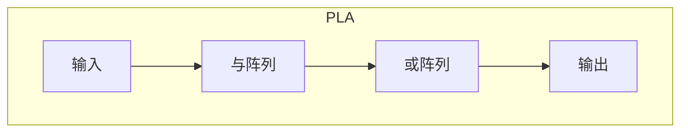
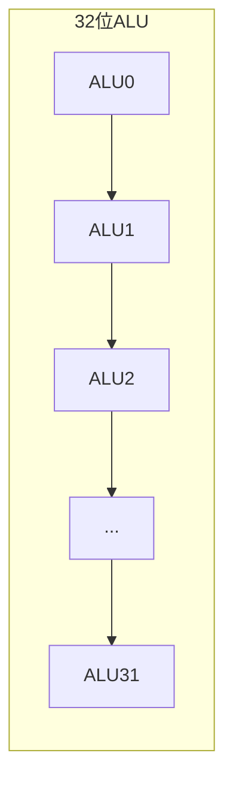
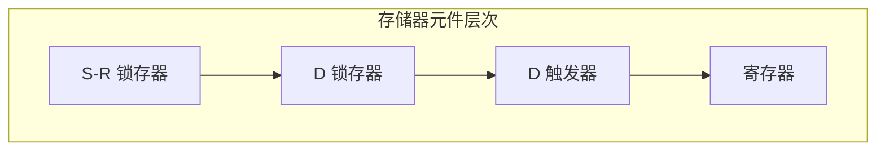
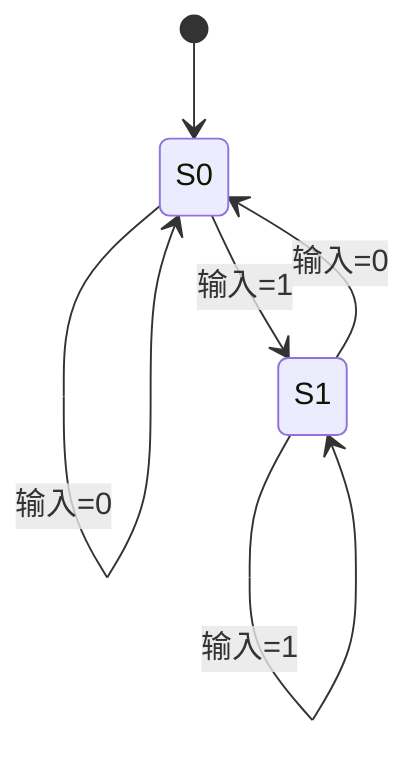

# 附录A 逻辑设计基础

> **Computer Organization and Design: The Hardware/Software Interface, RISC-V Edition**
>
> Appendix A: The Basics of Logic Design
>
> David A. Patterson, John L. Hennessy, 2018

---

本附录介绍数字逻辑设计的基础知识，为理解处理器与存储器等硬件实现提供必要背景。涵盖**门电路**（gates）、**组合逻辑**（combinational logic）、**时序逻辑**（sequential logic）、**ALU 设计**、**存储器元件**与**有限状态机**（Finite-State Machine, FSM）等核心概念。

---

## A.1 引言

数字电路由**逻辑门**（logic gates）和**存储元件**（memory elements）构成，实现布尔函数与状态存储。逻辑设计遵循**布尔代数**（Boolean algebra）规则，通过**硬件描述语言**（Hardware Description Language, HDL）如 Verilog 进行描述与综合。

---

## A.2 门电路、真值表与逻辑方程

### 基本门电路

| 门 | 英文 | 符号 | 功能 | 真值表要点 |
|----|------|------|------|------------|
| **与门** | AND | $A \cdot B$ | 两输入均为 1 时输出 1 | 全 1 出 1 |
| **或门** | OR | $A + B$ | 任一输入为 1 时输出 1 | 有 1 出 1 |
| **非门** | NOT | $\overline{A}$ | 输出为输入的取反 | 0↔1 |
| **与非门** | NAND | $\overline{A \cdot B}$ | 与门取反 | 全 1 出 0 |
| **或非门** | NOR | $\overline{A + B}$ | 或门取反 | 全 0 出 1 |
| **异或门** | XOR | $A \oplus B$ | 两输入不同时输出 1 | 不同出 1 |

```mermaid
flowchart LR
    subgraph 基本门
        A1[A & B] --> AND[AND]
        A2[A | B] --> OR[OR]
        A3[!A] --> NOT[NOT]
        A4[A & B] --> NAND[NAND]
        A5[A | B] --> NOR[NOR]
        A6[A ^ B] --> XOR[XOR]
    end
```

### 布尔代数与德摩根定律

**德摩根定律**（De Morgan's laws）：

$$
\overline{A \cdot B} = \overline{A} + \overline{B}
$$

$$
\overline{A + B} = \overline{A} \cdot \overline{B}
$$

即：与的取反等于取反的或；或的取反等于取反的与。利用德摩根定律，可用 NAND 或 NOR 实现任意逻辑函数。

::: info 通用门
**NAND** 和 **NOR** 是**通用门**（universal gate）：仅用 NAND 或仅用 NOR 即可实现任意布尔函数。
:::

---

## A.3 组合逻辑

**组合逻辑**电路的输出仅取决于当前输入，无记忆功能。常见组合逻辑模块包括**译码器**（decoder）、**多路选择器**（multiplexer, MUX）和 **PLA**（Programmable Logic Array）。

### 译码器（Decoder）

$n$ 位输入的译码器产生 $2^n$ 个输出，其中恰好一个为 1（或 0），其余为 0（或 1）。例如 2-4 译码器：输入 $A_1 A_0$，输出 $Y_0, Y_1, Y_2, Y_3$，满足 $Y_i = 1$ 当且仅当 $i = A_1 A_0$（二进制）。

### 多路选择器（MUX）

**多路选择器**（multiplexer）根据选择信号从多个输入中选一个输出。$n$ 位选择信号可控制 $2^n$ 个输入。例如 2 选 1 MUX：$Y = S \cdot D_0 + \overline{S} \cdot D_1$。

### PLA（可编程逻辑阵列）

**PLA** 由**与阵列**（AND array）和**或阵列**（OR array）组成，可编程实现任意**积之和**（Sum of Products, SOP）形式的布尔函数。



---

## A.4 使用硬件描述语言

**硬件描述语言**（HDL）用于描述数字电路的结构与行为。**Verilog** 与 **VHDL** 是两种主流 HDL。以下为 Verilog 示例。

### 基本门实例化

```verilog
module and_gate(a, b, y);
    input a, b;
    output y;
    assign y = a & b;
endmodule
```

### 多路选择器

```verilog
module mux2to1(d0, d1, sel, y);
    input d0, d1, sel;
    output y;
    assign y = sel ? d1 : d0;
endmodule
```

### 译码器

```verilog
module decoder2to4(a, y);
    input [1:0] a;
    output reg [3:0] y;
    always @(*) begin
        case (a)
            2'b00: y = 4'b0001;
            2'b01: y = 4'b0010;
            2'b10: y = 4'b0100;
            2'b11: y = 4'b1000;
        endcase
    end
endmodule
```

### 简单 ALU（Verilog）

```verilog
module alu(a, b, alucontrol, result, zero);
    input [31:0] a, b;
    input [2:0] alucontrol;
    output reg [31:0] result;
    output zero;

    always @(*) begin
        case (alucontrol)
            3'b000: result = a & b;
            3'b001: result = a | b;
            3'b010: result = a + b;
            3'b110: result = a - b;
            3'b111: result = ($signed(a) < $signed(b)) ? 32'd1 : 32'd0;
            default: result = 32'd0;
        endcase
    end
    assign zero = (result == 32'd0);
endmodule
```

::: tip 设计层次
HDL 支持**模块化**设计：将电路划分为子模块，通过**实例化**（instantiation）组合成更大系统。顶层模块描述整体结构。
:::

---

## A.5 构建基本算术逻辑单元

**ALU**（Arithmetic Logic Unit）是处理器的核心，执行算术与逻辑运算。本节从 1 位 ALU 逐步扩展至 32/64 位 ALU。

### 1 位 ALU

1 位 ALU 可执行：
- 与（AND）
- 或（OR）
- 加法（加法器需要**进位输入** $C_{in}$ 与**进位输出** $C_{out}$）

通过**多路选择器**根据控制信号选择输出。

### 32/64 位 ALU

将 32 个 1 位 ALU 串联，**进位链**（carry chain）将低位 $C_{out}$ 连接到高位 $C_{in}$，构成**行波进位加法器**（ripple-carry adder）。逻辑运算（AND、OR）无进位链，可并行执行。



### 溢出检测

**有符号数**加法溢出条件：两正数相加得负，或两负数相加得正。可通过**符号位**与**进位**判断。

### ALU 控制信号

典型 ALU 支持多种运算，通过**控制信号**（control signal）选择：

| 控制码 | 运算 | 描述 |
|--------|------|------|
| 000 | AND | 按位与 |
| 001 | OR | 按位或 |
| 010 | ADD | 加法 |
| 110 | SUB | 减法（加负数） |
| 111 | SLT | 有符号小于则置位 |

---

## A.6 更快加法：超前进位

**行波进位**加法器延迟与位数成正比。**超前进位**（carry lookahead）通过**生成**（generate）$G_i = A_i \cdot B_i$ 与**传播**（propagate）$P_i = A_i \oplus B_i$ 提前计算进位，减少关键路径延迟。

$$
C_{i+1} = G_i + P_i \cdot C_i
$$

展开可得 $C_1, C_2, \ldots$ 仅依赖输入 $A, B, C_0$，可并行计算。实际实现中，常采用**分组超前进位**（group carry lookahead）在延迟与面积间折中。

::: info 关键路径
加法器的**关键路径**（critical path）决定了时钟周期的最小值。超前进位缩短了进位链，是提高主频的重要手段。
:::

---

## A.7 时钟

**时钟**（clock）是同步数字电路的**时序参考**。所有**时序元件**（寄存器、触发器）在时钟**边沿**（上升沿或下降沿）采样输入并更新状态。

### 时钟偏移

**时钟偏移**（clock skew）指时钟信号到达不同寄存器的**时间差**。偏移过大会导致**建立时间**（setup time）或**保持时间**（hold time）违例，造成电路错误。设计时需控制时钟树、平衡负载。

### 时钟域与跨时钟域

多时钟域系统中，数据从一个**时钟域**（clock domain）传递到另一时钟域时，需**同步器**（synchronizer）避免**亚稳态**（metastability）。常用**两级触发器**（two-flop synchronizer）进行同步。

---

## A.8 存储器元件：触发器、锁存器与寄存器

### S-R 锁存器

**S-R 锁存器**（Set-Reset latch）有两个输入 $S$（置位）和 $R$（复位）。$S=1$ 使输出 $Q=1$；$R=1$ 使 $Q=0$；$S=R=0$ 保持；$S=R=1$ 为**非法状态**（应避免）。

### D 锁存器

**D 锁存器**（D latch）在**使能**（enable）为高时，输出 $Q$ 跟随输入 $D$；使能为低时锁存当前值。**电平敏感**，易受时钟上的毛刺影响。

### D 触发器

**D 触发器**（D flip-flop）在时钟**边沿**采样 $D$ 并更新 $Q$，**边沿敏感**，抗毛刺能力强。是同步电路中最常用的存储元件。

**Verilog 示例**（上升沿触发的 D 触发器）：

```verilog
module dff(clk, d, q);
    input clk, d;
    output reg q;
    always @(posedge clk)
        q <= d;
endmodule
```

### 寄存器

**寄存器**（register）由多个 D 触发器组成，存储多位数据。**寄存器堆**（register file）包含多个寄存器，支持多读多写端口。



---

## A.9 存储器元件：SRAM 与 DRAM

### SRAM（静态随机存取存储器）

**SRAM**（Static RAM）用**触发器**存储每位，只要供电即保持数据，无需刷新。**读写速度快**，常用于**缓存**（cache）。结构：每行由**字线**（word line）选中，**位线**（bit line）读写数据。

### DRAM（动态随机存取存储器）

**DRAM**（Dynamic RAM）用**电容**存储电荷表示位，电荷会泄漏，需**定期刷新**（refresh）。**密度高**、成本低，常用于**主存**。结构：**行地址**与**列地址**分时选通，**位线**感测电容电压。

| 特性 | SRAM | DRAM |
|------|------|------|
| 存储单元 | 触发器（6T） | 电容（1T1C） |
| 刷新 | 不需要 | 需要 |
| 速度 | 快 | 较慢 |
| 密度 | 低 | 高 |
| 典型用途 | 缓存 | 主存 |

---

## A.10 有限状态机

**有限状态机**（Finite-State Machine, FSM）用于描述具有**有限状态**的时序电路行为。**Moore 型**与**Mealy 型**是两种基本模型。

### Moore 型 FSM

**Moore 型**：输出仅取决于**当前状态**。输出与输入异步，在状态转换后稳定。

### Mealy 型 FSM

**Mealy 型**：输出取决于**当前状态**与**当前输入**。输出可随输入立即变化，响应更快。



::: tip 选择
Moore 型输出无毛刺，易于时序分析；Mealy 型状态数可能更少，适合对响应速度敏感的场合。
:::

---

## A.11 时序方法学

### 建立时间与保持时间

**建立时间**（setup time）$t_{su}$：时钟边沿之前，数据必须稳定的最短时间。**保持时间**（hold time）$t_h$：时钟边沿之后，数据必须保持稳定的最短时间。

$$
T_{clk} \geq t_{su} + t_{prop} + t_{comb}
$$

其中 $t_{prop}$ 为寄存器传播延迟，$t_{comb}$ 为组合逻辑延迟。**保持时间**约束决定了组合逻辑的最小延迟，防止**竞争**（race）。

---

## A.12 现场可编程器件

**FPGA**（Field Programmable Gate Array）是**现场可编程**逻辑器件，用户可在**现场**配置逻辑功能。由**可配置逻辑块**（CLB）、**互连资源**（interconnect）和 **I/O 块**组成。通过 **HDL** 设计后**综合**（synthesis）、**布局布线**（place and route）生成**比特流**（bitstream）下载到 FPGA。

**应用**：原型验证、专用加速、小批量产品、可重构计算。

### FPGA 与 ASIC 对比

| 特性 | FPGA | ASIC |
|------|------|------|
| 开发周期 | 短 | 长 |
| 单位成本 | 高 | 低（量产时） |
| 功耗 | 较高 | 可优化至更低 |
| 性能 | 中等 | 可定制至最优 |
| 可重构 | 是 | 否 |

::: info 设计流程
HDL 设计 → 综合（生成网表）→ 布局布线（生成比特流）→ 下载到 FPGA。ASIC 流程还包括**流片**（tape-out）与**制造**。
:::

---

## 关键公式汇总

| 公式 | 含义 |
|------|------|
| $\overline{A \cdot B} = \overline{A} + \overline{B}$ | 德摩根定律（与的取反） |
| $\overline{A + B} = \overline{A} \cdot \overline{B}$ | 德摩根定律（或的取反） |
| $C_{i+1} = G_i + P_i \cdot C_i$ | 超前进位递推 |
| $G_i = A_i \cdot B_i$ | 进位生成 |
| $P_i = A_i \oplus B_i$ | 进位传播 |
| $T_{clk} \geq t_{su} + t_{prop} + t_{comb}$ | 最小时钟周期 |

---

## 小结

本附录介绍了数字逻辑设计的基础：**门电路**与**布尔代数**、**组合逻辑**（译码器、MUX、PLA）、**HDL**（Verilog）、**ALU** 与**超前进位**、**时钟**与**时序**、**存储器元件**（锁存器、触发器、SRAM、DRAM）、**有限状态机**（Moore/Mealy）以及**时序方法学**（建立/保持时间）。这些概念是理解处理器与存储器层次结构实现的基石。

---

[← 第6章](./ch06.md) | [目录](./index.md)
