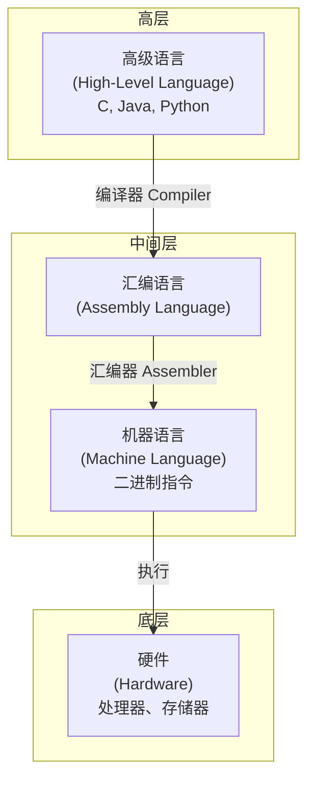
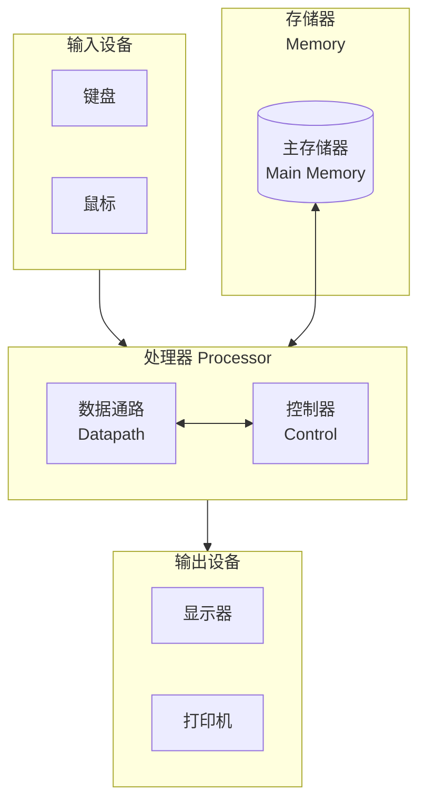
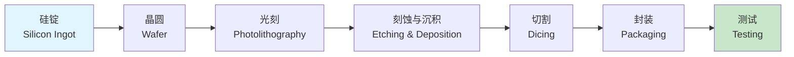

# 第1章 计算机抽象与技术

> Civilization advances by extending the number of important operations which we can perform without thinking about them.
>
> — Alfred North Whitehead, *An Introduction to Mathematics* (1911)

本章介绍计算机系统的基本概念，从应用分类到硬件组成，从性能度量到功耗挑战，为理解计算机如何工作奠定基础。我们将看到**抽象**（abstraction）如何简化设计，以及**摩尔定律**（Moore's Law）如何驱动计算机技术的演进。这些概念将贯穿全书，是理解后续章节——指令集、算术运算、处理器设计、存储器层次与并行计算——的前提。

**学习目标**：阅读本章后，你应能描述计算机的五大组件、解释八大核心思想、运用性能公式分析瓶颈、理解 Amdahl 定律与功耗墙对设计的影响，并识别常见的性能评估谬误。这些能力将支撑你在后续章节中理解 RISC-V 指令集、流水线设计与存储器层次结构。

## 1.1 引言

计算机无处不在。从桌面到云端，从手机到汽车，计算能力已渗透到现代生活的方方面面。从**个人计算机**（Personal Computer, PC）到**服务器**（server），从**嵌入式系统**（embedded system）到**后 PC 时代**（Post-PC Era）的**个人移动设备**（Personal Mobile Device, PMD）与**云计算**（cloud computing），计算机的应用场景日益多样。

::: info 计算机应用分类

- **PC**：桌面与笔记本电脑，面向个人用户
- **服务器**：数据中心中的高性能机器，提供网络服务
- **嵌入式系统**：嵌入到家电、汽车、工业设备中的计算机
- **PMD**：智能手机、平板等移动设备
- **云计算**：通过互联网提供可扩展的计算与存储资源

:::

理解计算机的组成与设计，有助于我们更好地编写程序、选择硬件，并把握技术发展的方向。无论是优化程序性能、理解系统瓶颈，还是评估新硬件架构，本章所介绍的概念都将反复出现。

## 1.2 计算机体系结构的八大核心思想

在计算机体系结构的发展历程中，形成了若干经久不衰的设计原则。这些原则并非某一时刻的发明，而是数十年实践中反复验证的设计智慧。Patterson 与 Hennessy 将其归纳为**八大核心思想**（Eight Great Ideas）：

| 思想 | 英文 | 核心含义 |
|------|------|----------|
| 1. 摩尔定律设计 | Design for Moore's Law | 利用晶体管密度持续增长，将更多功能集成到芯片中 |
| 2. 抽象简化设计 | Use Abstraction to Simplify Design | 通过层次化抽象隐藏底层复杂性 |
| 3. 加速常见情况 | Make the Common Case Fast | 优化最频繁执行的操作以提升整体性能 |
| 4. 并行提升性能 | Performance via Parallelism | 通过并行执行多条指令或任务提高吞吐量 |
| 5. 流水线 | Performance via Pipelining | 将任务分解为阶段，使多个任务重叠执行 |
| 6. 预测 | Performance via Prediction | 预测分支等行为，提前准备以减少等待 |
| 7. 存储器层次结构 | Hierarchy of Memories | 用多级存储（缓存、主存、磁盘）平衡速度与容量 |
| 8. 冗余实现可靠性 | Dependability via Redundancy | 通过冗余组件提高系统可靠性 |

::: tip 抽象的力量
**抽象**是计算机科学中最强大的工具之一。高级语言抽象了机器指令，操作系统抽象了硬件资源，网络协议抽象了物理传输。每一层抽象都让上层设计者不必关心底层细节，从而专注于更高层次的问题。
:::

**加速常见情况**（Make the Common Case Fast）意味着将设计资源投入到最频繁执行的路径上。例如，缓存针对的是程序访问的局部性，因为大多数访问集中在少数数据上。**并行**与**流水线**则通过重叠执行提高吞吐量：并行让多个任务同时进行，流水线则让同一任务的不同阶段在不同数据上重叠。**预测**（如分支预测）通过猜测未来行为来隐藏延迟。**存储器层次结构**用快速但昂贵的小容量存储（如缓存）与慢速但廉价的大容量存储（如磁盘）组合，在成本与性能间取得平衡。典型的层次从快到慢、从贵到廉依次为：寄存器、缓存（L1/L2/L3）、主存、磁盘。程序访问的**局部性**（locality）——时间局部性（刚访问过的数据可能很快再被访问）与空间局部性（访问某地址后可能很快访问邻近地址）——使得层次结构能够有效工作。**冗余**则通过复制关键组件（如 ECC 内存、RAID 磁盘）提高系统在故障面前的韧性。

## 1.3 程序之下的层次

当我们编写并运行一个程序时，其下存在多个软件与硬件层次。从高级语言到机器码，每一层都建立在前一层之上。

**系统软件**（system software）包括：

- **操作系统**（Operating System, OS）：管理硬件资源，提供进程、内存、文件等抽象。操作系统负责调度、内存管理、设备驱动等，使多个程序能够共享硬件而互不干扰。
- **编译器**（compiler）：将高级语言翻译为汇编或机器语言。编译器通常包含词法分析、语法分析、语义分析、优化与代码生成等阶段。
- **汇编器**（assembler）：将汇编语言翻译为机器语言。汇编语言使用助记符（如 ADD、SUB）表示机器指令，与机器语言几乎一一对应。

::: info 图 1-1：软件层次结构
从高级语言到硬件的转换链。编译器负责语法分析、优化和代码生成；汇编器将助记符映射为二进制操作码。某些现代编译器（如 GCC、Clang）可直接生成机器码，跳过显式的汇编阶段，但逻辑上仍经历相同的转换步骤。图中箭头表示数据流与转换方向。
:::

程序员通常只与高级语言打交道，但理解下层结构有助于写出更高效、更可靠的代码。例如，了解缓存行为可以优化数据访问模式；了解流水线可以理解分支对性能的影响；了解指令集可以写出更紧凑的代码或利用特定指令加速关键循环。

## 1.4 揭开盖子：硬件组成

计算机硬件由**五大经典组件**（five classic components）构成，这一模型由冯·诺依曼（John von Neumann）等人在 1940 年代提出，至今仍是理解计算机的基础框架。该模型将计算机视为处理数据的机器：从输入设备获取数据，经处理器与存储器处理，最终通过输出设备呈现结果。

::: info 图 1-2：计算机五大经典组件
输入与输出设备通过处理器与存储器交互。数据通路与控制器共同构成 CPU，是执行指令的核心。主存储器存储程序与数据，是冯·诺依曼架构中「存储程序」概念的体现。
:::

| 组件 | 英文 | 功能 |
|------|------|------|
| 输入设备 | Input | 接收外部数据（键盘、鼠标、传感器等） |
| 输出设备 | Output | 向用户呈现结果（显示器、打印机等） |
| 存储器 | Memory | 存储程序与数据 |
| 数据通路 | Datapath | 执行算术与逻辑运算 |
| 控制器 | Control | 协调各组件，控制指令执行顺序 |

> **冯·诺依曼架构**（von Neumann architecture）的核心是**存储程序**（stored program）概念：程序与数据存放在同一存储器中，处理器通过读取指令并执行来运行程序。这种设计使计算机能够通过加载不同程序来执行不同任务，而不必修改硬件。

数据通路与控制器共同构成**中央处理单元**（Central Processing Unit, CPU）。数据通路包含算术逻辑单元（ALU）、寄存器文件等，执行实际的运算；控制器根据指令生成控制信号，协调取指、译码、执行、访存、写回等阶段。第 4 章将详细讨论处理器的数据通路与控制器设计。

### 显示器技术

现代显示器多采用**液晶显示**（Liquid Crystal Display, LCD）技术，通过背光与液晶分子控制光线通过。**有机发光二极管**（Organic Light-Emitting Diode, OLED）显示器则无需背光，每个像素自发光，可实现更深的黑色与更广的色域，常用于高端手机。**触摸屏**（touchscreen）结合了输入与输出功能，用户可直接在屏幕上操作，常见于智能手机与平板电脑。触摸屏技术包括电阻式、电容式等，电容式因支持多点触控而更为普及。**分辨率**（resolution）与**刷新率**（refresh rate）是显示器的两个关键参数，分别影响清晰度与动态画面的流畅度。

### 打开机箱

打开一台台式机的机箱，你会看到：

- **处理器**（processor）：执行指令的核心芯片，通常带有散热器。现代处理器多为多核设计，单颗芯片上集成多个处理核心。
- **内存条**（memory modules）：主存储器，存储正在运行的程序与数据。内存是易失性的，断电后内容丢失。
- **芯片组**（chipset）：连接处理器、内存与外部设备的桥梁，负责总线仲裁、I/O 控制等。
- **硬盘/固态硬盘**：持久存储设备。硬盘（HDD）使用磁性盘片，固态硬盘（SSD）使用闪存，后者速度更快但单位容量成本更高。

主板上的各种插槽与接口——PCIe、SATA、USB 等——将上述组件连接在一起，形成完整的计算机系统。**总线**（bus）是连接各组件的数据通道，如连接处理器与内存的**内存总线**（memory bus）、连接处理器与 I/O 设备的**I/O 总线**（I/O bus）。总线的带宽与延迟影响系统整体性能，尤其在多核共享内存时，内存带宽可能成为瓶颈。

## 1.5 处理器与存储器的制造技术

### 晶体管与集成电路

计算机的基本开关元件是**晶体管**（transistor）。晶体管可作为电子开关，通过控制栅极电压来导通或截止电流。现代处理器采用**金属-氧化物-半导体场效应晶体管**（Metal-Oxide-Semiconductor Field-Effect Transistor, MOSFET），其尺寸已缩小至纳米级。通过**光刻**（photolithography）等工艺，数十亿个晶体管被集成到一块**硅片**（silicon wafer）上，形成**集成电路**（Integrated Circuit, IC）。集成电路的出现使计算机从房间大小的机器缩小到可握于掌中的设备。

### 摩尔定律

**摩尔定律**（Moore's Law）由英特尔联合创始人戈登·摩尔于 1965 年提出：集成电路上可容纳的晶体管数量大约每两年翻一番。这一定律在过去数十年中大致成立，推动了计算机性能的持续提升。近年来，随着晶体管尺寸接近物理极限，工艺节点的推进速度放缓，摩尔定律的延续面临挑战。尽管如此，通过架构创新（如多核、专用加速器）、封装技术（如 3D 堆叠）与软件优化，计算机性能仍在持续提升。

### 芯片制造流程

::: info 图 1-3：芯片制造流程
从硅锭到成品芯片的完整流程。光刻是其中最关键的步骤，决定了晶体管的最小尺寸。EUV 光刻使 7nm 及更先进工艺成为可能。
:::

| 阶段 | 说明 |
|------|------|
| 硅锭 | 高纯度单晶硅圆柱，通过 Czochralski 法从熔融硅中拉制而成 |
| 晶圆 | 将硅锭切片得到的圆片，直径通常为 300mm（12 英寸），厚度约 0.7mm |
| 光刻 | 用光掩模在涂有光刻胶的晶圆上曝光，定义电路图案。极紫外光（EUV）光刻使更小特征尺寸成为可能 |
| 刻蚀与沉积 | 刻蚀去除不需要的材料，沉积添加金属或绝缘层，形成晶体管与互连结构 |
| 切割 | 将晶圆切成单个芯片（die），每个 die 对应一颗处理器或存储器芯片 |
| 封装 | 将 die 封装到保护壳中，连接引脚或焊球，便于安装到电路板 |
| 测试 | 验证芯片功能与性能，筛选出合格产品。测试在封装前后都可能进行 |

### 良率

**良率**（yield）指制造出的芯片中通过测试的比例。工艺越先进，晶体管越小，缺陷对良率的影响越大，制造成本也越高。晶圆边缘的芯片通常良率较低，因为工艺均匀性在边缘处较差。制造商通过冗余设计（如备用存储单元）和分级销售（将部分缺陷芯片降级为低规格产品）来应对良率问题。

## 1.6 性能

### 响应时间与吞吐量

**性能**（performance）是计算机系统最重要的指标之一，但其定义因应用场景而异。性能可以从不同角度衡量：

- **响应时间**（response time）：完成单个任务所需的时间，又称**执行时间**（execution time）。对于交互式应用（如网页加载、游戏帧率），用户更关心响应时间。
- **吞吐量**（throughput）：单位时间内完成的任务数量。对于批处理、服务器等场景，吞吐量往往更重要。

::: warning 注意
缩短响应时间与提高吞吐量并不总是一致。例如，通过增加处理器数量可能提高吞吐量，但单个任务的响应时间未必缩短。
:::

**带宽**（bandwidth）与**延迟**（latency）是另一对相关概念：带宽表示单位时间内的数据量（如 GB/s），延迟表示从发起请求到收到响应的等待时间（如纳秒）。高带宽不能弥补高延迟，反之亦然；两者需分别优化。例如，内存的带宽可能很高，但首次访问的延迟（包括缓存未命中时的主存访问）对程序性能有重要影响。

### CPU 时间

**CPU 时间**（CPU time）是处理器实际执行程序的时间，不包括等待 I/O 等时间。它可分为：

- **用户 CPU 时间**（user CPU time）：执行用户程序的时间
- **系统 CPU 时间**（system CPU time）：执行操作系统内核的时间

### 时钟周期与 CPI

- **时钟周期**（clock cycle）：处理器时钟的一个周期，通常以纳秒（ns）或频率（GHz）表示。例如 3 GHz 的处理器，时钟周期时间为 1/3 ns ≈ 0.33 ns。
- **时钟周期时间**（clock cycle time）：一个时钟周期的持续时间，单位为秒。与频率互为倒数：$T = 1/f$。
- **CPI**（Cycles Per Instruction）：每条指令平均需要的时钟周期数。不同指令的 CPI 可能不同：简单指令（如加法）可能只需 1 个周期，而除法或内存访问可能需多个周期。**平均 CPI** 由程序中各类指令的比例加权得到。

### 性能方程

CPU 执行时间可表示为：

$$
\text{CPU 时间} = \text{指令数} \times \text{CPI} \times \text{时钟周期时间}
$$

或等价地：

$$
\text{CPU 时间} = \frac{\text{指令数} \times \text{CPI}}{\text{时钟频率}}
$$

::: tip 性能公式的启示
要提升性能，可以：减少指令数（更好的算法或编译器）、降低 CPI（更高效的微架构）、缩短时钟周期时间（提高主频）。但三者往往相互制约，需要权衡。
:::

**示例**：某程序在机器 A 上执行需 10 秒，指令数为 $10^9$，CPI 为 2.0，时钟频率为 2 GHz。则时钟周期时间 $T = 1/(2 \times 10^9) = 0.5$ ns。代入公式：$\text{CPU 时间} = 10^9 \times 2 \times 0.5 \times 10^{-9} = 1$ 秒。若实际测量为 10 秒，则多出的 9 秒可能来自 I/O 等待、操作系统开销、或测量包含其他进程等。该公式帮助我们从指令数、CPI、时钟周期三个维度分析性能瓶颈，并指导优化方向。**指令数**受程序算法与编译器影响；**CPI** 受微架构（流水线深度、分支预测、缓存等）影响；**时钟周期**受工艺与频率设定影响。

### Amdahl 定律

**Amdahl 定律**（Amdahl's Law）指出：对系统某一部分进行加速，整体加速比受限于未被加速部分所占的比例。

设可加速部分占比为 $f$，该部分加速比为 $s$，则整体加速比为：

$$
\text{加速比} = \frac{1}{(1-f) + \frac{f}{s}}
$$

当 $s \to \infty$ 时，加速比趋近于 $\frac{1}{1-f}$。因此，若 20% 的代码无法并行化（$f=0.8$），则理论上最大加速比约为 5；若 1% 无法并行化，最大加速比约为 100。Amdahl 定律提醒我们：优化必须针对瓶颈；对非瓶颈部分的加速往往收效甚微。该定律由 Gene Amdahl 于 1967 年提出，至今仍是并行计算与系统优化的基本准则。

## 1.7 功耗墙

### 动态功耗

**动态功耗**（dynamic power）是晶体管开关时消耗的功率，可近似为：

$$
P = C \times V^2 \times f
$$

其中 $C$ 为负载电容，$V$ 为电压，$f$ 为时钟频率。

### 功耗墙的由来

过去，通过提高频率和降低电压可以持续提升性能。但电压不能无限降低——低于一定阈值后，晶体管无法可靠工作。同时，提高频率会导致功耗急剧上升，散热成为瓶颈。因此，单核处理器的主频在约 4 GHz 附近停滞，形成了**功耗墙**（power wall）。

::: info 功耗墙的影响
功耗墙是计算机工业从追求单核高频转向多核架构的重要原因之一。在相同功耗预算下，多个较低频率的核心往往比单个高频核心能完成更多工作。
:::

此外，**静态功耗**（static power）——晶体管即使不开关也会因漏电流消耗的功率——随工艺缩小而上升，因为更小的晶体管漏电更严重。这进一步加剧了功耗管理的难度。

## 1.8 重大转变：从单处理器到多处理器

### 多核时代

由于功耗墙的限制，**单处理器**（uniprocessor）通过提高主频来提升性能的道路已接近尽头。2000 年代中期，工业界转向**多核处理器**（multicore processor），在单颗芯片上集成多个处理核心。从双核、四核到如今的数十核，多核已成为桌面、服务器与移动设备的标配。**片上多处理器**（Chip Multiprocessor, CMP）的普及，标志着计算机工业从「更快」转向「更多」的设计哲学。

### 多核的必要性

- **并行性**：许多应用天然具有并行性，可分解为多个任务同时执行
- **能效**：多个低频核心在相同功耗下可提供比单核更高的吞吐量
- **响应性**：多核允许在后台运行任务的同时保持前台响应

::: tip 软件面临的挑战
多核的普及对软件提出了新要求：要充分利用多核，程序必须能够并行化。串行程序无法自动获得多核带来的性能提升，这推动了并行编程模型与工具的发展。
:::

**异构计算**（heterogeneous computing）是另一条路径：在同一系统中结合不同类型的处理器，如 CPU 与 GPU。GPU 擅长数据并行任务（如图形渲染、机器学习训练），而 CPU 擅长控制流复杂的通用计算。现代系统越来越多地采用 CPU+GPU 或 CPU+专用加速器的组合。苹果的 M 系列芯片、高通骁龙等移动 SoC 均采用异构设计，将高性能核心与能效核心、GPU、NPU 等集成在同一芯片上。

## 1.9 实例：Intel Core i7 的基准测试

### SPEC CPU 基准测试

**SPEC**（Standard Performance Evaluation Corporation）是业界广泛使用的性能评估组织，由计算机厂商、研究机构等组成。**SPEC CPU** 是一套 CPU 基准测试程序，包含整数（SPECint）与浮点（SPECfp）两类工作负载。每类包含多个真实应用或内核，如编译器、科学计算、人工智能等，旨在反映多样化的实际使用场景。运行基准测试时，需使用规定的编译器与优化选项，以保证结果的可比性。

### SPECratio

**SPECratio** 是某台机器运行某基准程序的时间与参考机器运行同一程序时间的比值。比值越大，表示该机器在该程序上越快。例如，若机器 A 运行某程序需 100 秒，参考机需 400 秒，则 A 的 SPECratio 为 4.0。通常报告的是多个基准程序 SPECratio 的几何平均值，以避免单一程序主导结果。几何平均能反映各程序上的综合表现，且对异常值不如算术平均敏感。

::: info 基准测试的局限性
基准测试结果依赖具体工作负载。实际应用可能与基准程序行为不同，因此基准测试可作为参考，但不应作为唯一决策依据。
:::

**SPEC CPU 2017** 是当前广泛使用的版本，包含 SPECspeed（测单线程性能）与 SPECrate（测多线程吞吐量）两类指标。报告结果时需注明编译器、优化选项与系统配置，以便复现与比较。

Intel Core i7 是 x86 架构的高性能处理器系列，常用于桌面与工作站。在 SPEC CPU 基准测试中，其表现取决于具体型号、核心数、频率与内存配置。多核型号在 SPECrate 中通常表现更好，因为该指标测量多副本并行运行时的吞吐量。

## 1.10 谬误与陷阱

### 谬误 1：改进一个方面就能成比例提升整体性能

根据 Amdahl 定律，若只优化系统中一小部分，整体加速比将非常有限。例如，将占执行时间 10% 的代码加速 10 倍，整体加速比仅为约 1.09。即使将该部分加速到无穷大（即执行时间降为 0），整体加速比也仅为 $1/(1-0.1) \approx 1.11$。因此，优化应优先针对占执行时间比例最大的瓶颈部分。

### 谬误 2：MIPS 是衡量性能的好指标

**MIPS**（Million Instructions Per Second）表示每秒百万条指令。但不同指令集的指令复杂度差异很大：RISC 指令集（如 RISC-V、ARM）的指令较简单，完成同一任务可能需要更多指令；CISC 指令集（如 x86）的指令较复杂，单条指令可能完成更多工作。因此，同一程序在不同机器上的指令数可能相差数倍。MIPS 高未必意味着实际性能好，甚至可能出现「MIPS 高、性能差」的悖论——例如，某机器通过执行大量简单但低效的指令达到高 MIPS，而另一机器用较少的高效指令更快完成任务。

::: warning 陷阱
避免用单一指标（如主频、MIPS）判断性能。应结合具体应用、基准测试和实际测量来评估。
:::

### 谬误 3：基准测试可以完全代表实际性能

基准测试程序是精心挑选的，可能与你的应用在指令混合、缓存行为、并行性等方面存在显著差异。例如，若你的应用有大量分支或不可预测的内存访问模式，而基准测试以顺序访问为主，则基准测试结果可能高估你的应用在该机器上的表现。设计系统时，应结合基准测试与目标工作负载的分析，必要时进行原型测试。

### 谬误 4：功耗与性能线性相关

提高频率会带来超线性的功耗增长（因为 $P \propto f$ 且电压可能需提高）。因此，在功耗受限的环境中（如笔记本、手机），一味提高频率可能适得其反。**能效**（energy efficiency）——每焦耳能量完成的工作量——成为与绝对性能同样重要的指标。这也是为何移动设备与数据中心越来越多地采用 ARM 等能效优先的架构。

## 1.11 小结

本章介绍了计算机抽象与技术的基础概念：

1. **计算机应用**涵盖 PC、服务器、嵌入式系统、PMD 与云计算等多种形态，每种形态对性能、功耗、成本有不同要求。
2. **八大核心思想**——摩尔定律设计、抽象、加速常见情况、并行、流水线、预测、存储器层次、冗余——贯穿计算机体系结构的设计与实践，是理解与评价各种技术决策的框架。
3. **软件层次**从高级语言经汇编、机器语言到底层硬件，编译器与操作系统是连接各层的关键。理解层次结构有助于定位性能瓶颈与优化机会。
4. **五大经典组件**——输入、输出、存储器、数据通路、控制器——构成了计算机硬件的基本框架。数据通路执行运算，控制器协调各组件，存储器保存程序与数据。
5. **制造技术**依赖硅工艺与光刻，摩尔定律曾长期推动集成度提升，但物理与经济限制使其放缓。芯片制造涉及硅锭、晶圆、光刻、刻蚀、封装、测试等多道工序。
6. **性能**可用 CPU 时间、CPI、时钟周期等度量，三者满足 $\text{CPU 时间} = \text{指令数} \times \text{CPI} \times \text{时钟周期时间}$。Amdahl 定律揭示了部分优化的局限性：优化非瓶颈部分收益有限。
7. **功耗墙**限制了单核主频的提升，动态功耗 $P \propto V^2 f$，电压与频率的下降空间受限，推动了多核架构的普及。
8. **多处理器**成为主流，软件需要显式利用并行性才能充分发挥硬件能力。异构计算（CPU+GPU）是另一条提升性能的路径。
9. **基准测试**如 SPEC CPU 提供客观比较，SPECratio 用于量化相对性能，但需结合实际应用与工作负载解读。
10. **常见谬误**包括忽视 Amdahl 定律、过度依赖 MIPS、将基准测试等同于实际性能、以及忽视功耗与性能的非线性关系。

**本章图表**：图 1-1 展示了从高级语言到硬件的软件层次结构；图 1-2 展示了计算机的五大经典组件及其连接关系；图 1-3 展示了芯片制造的完整流程，从硅锭到测试。这些图有助于建立对计算机系统的整体认识。

理解这些概念，是深入学习指令集、处理器设计、存储器层次与并行计算的基础。建议读者在后续章节中反复回顾本章的八大核心思想与性能公式，它们将帮助你在具体技术细节中把握设计权衡的本质。下一章将介绍**指令**（instruction）——计算机能理解并执行的基本操作，以及 RISC-V 指令集的设计原则。

## 关键术语速查

| 术语 | 英文 | 简要说明 |
|------|------|----------|
| 抽象 | Abstraction | 隐藏细节、暴露接口的设计方法 |
| 摩尔定律 | Moore's Law | 晶体管密度约每两年翻番的经验规律 |
| CPI | Cycles Per Instruction | 每条指令平均时钟周期数 |
| 数据通路 | Datapath | 执行运算的硬件路径 |
| 控制器 | Control | 生成控制信号、协调各阶段的逻辑 |
| 功耗墙 | Power Wall | 功耗限制导致主频难以继续提升 |
| Amdahl 定律 | Amdahl's Law | 部分加速对整体加速比的限制 |
| SPECratio | — | 基准测试中机器相对参考机的性能比 |
| 局部性 | Locality | 程序倾向于重复访问相同或邻近数据的特性 |
| 能效 | Energy Efficiency | 每单位能量完成的工作量 |

::: tip 术语记忆技巧
CPI、Amdahl、SPECratio 等术语在后续章节会反复出现。建议制作闪卡或用自己的话解释每个术语，以加深理解。
:::

## 本章公式汇总

- **CPU 时间**：$\text{CPU 时间} = \text{指令数} \times \text{CPI} \times \text{时钟周期时间}$
- **Amdahl 定律**：$\text{加速比} = 1 / \left[(1-f) + f/s\right]$，其中 $f$ 为可加速部分占比，$s$ 为该部分加速比
- **动态功耗**：$P = C \times V^2 \times f$，其中 $C$ 为负载电容，$V$ 为电压，$f$ 为频率
- **时钟周期与频率**：$T = 1/f$，时钟周期时间与频率互为倒数

上述公式是性能分析与功耗估算的基础，建议熟记并会灵活运用。在后续章节中，我们将看到这些公式如何应用于具体的处理器设计与优化决策。

## 思考题

以下问题有助于巩固本章概念，建议在阅读下一章前尝试回答。部分题目可在书中找到直接依据，部分需要结合多节内容综合思考。

1. **抽象与层次**：列举你日常使用的软件或硬件中的至少三层抽象，并说明每一层向上层隐藏了什么。例如：浏览器隐藏了 HTTP 协议细节，HTTP 隐藏了 TCP 传输细节，TCP 隐藏了 IP 路由细节。
2. **性能分析**：若某程序 80% 的时间花在浮点运算上，将浮点运算加速 4 倍后，整体加速比是多少？若想达到 2 倍整体加速，浮点部分至少需加速多少倍？（提示：用 Amdahl 定律，$f=0.8$）
3. **功耗与多核**：解释为何在相同功耗预算下，多核处理器可能比单核高频处理器完成更多工作。考虑动态功耗公式 $P = C V^2 f$：在总功耗固定时，降低 $f$ 可增加核心数，而多核在并行工作负载上能提供更高吞吐量。
4. **五大组件**：智能手机的五大经典组件分别是什么？与台式机有何异同？（提示：输入设备包括触摸屏、麦克风、传感器；输出包括屏幕、扬声器；存储器包括 RAM 与闪存；处理器为 SoC，集成多核 CPU、GPU 等。）
5. **芯片制造**：若某工艺的晶圆良率为 80%，每片晶圆可切出 100 颗芯片，则每片晶圆平均有多少颗合格芯片？良率如何影响芯片成本？

## 延伸阅读

- **计算机体系结构**：Patterson, D. A., & Hennessy, J. L. *Computer Organization and Design: The Hardware/Software Interface, RISC-V Edition*. Morgan Kaufmann, 2018.
- **摩尔定律与半导体工艺**：Moore, G. E. "Cramming more components onto integrated circuits." *Electronics*, 1965.
- **Amdahl 定律**：Amdahl, G. M. "Validity of the single processor approach to achieving large scale computing capabilities." *AFIPS Conference Proceedings*, 1967.
- **SPEC 基准测试**：<https://www.spec.org/cpu2017/>
- **RISC-V 官方**：<https://riscv.org/>，可了解 RISC-V 指令集规范与生态发展。

本书 RISC-V 版以开源指令集 RISC-V 为核心，其设计体现了本章所述的抽象、简化、加速常见情况等思想。RISC-V 的模块化扩展（如 M 扩展用于乘除法、A 扩展用于原子操作）也体现了「设计 for 摩尔定律」——通过可扩展的指令集适应未来工艺与需求。

**与下一章的联系**：第 2 章将深入指令集层面，介绍 RISC-V 的指令格式、寻址方式与常用指令。理解指令是理解数据通路与控制器如何工作的基础，也是编写汇编程序、分析编译器输出的前提。我们将看到 RISC-V 如何通过精简的指令集实现高效执行，以及汇编语言与机器码之间的对应关系。

---

**本章完**。下一章将介绍 RISC-V 指令集与汇编语言基础，包括指令格式、寻址方式与常用指令类型。

[目录](./index.md) | [下一章 →](./ch02.md)
