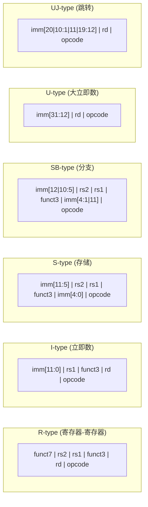
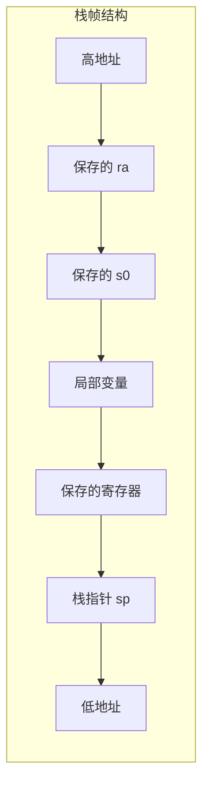
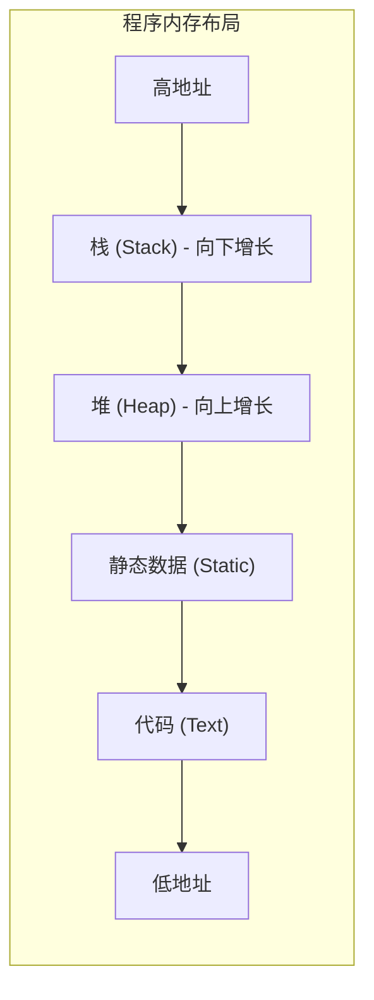
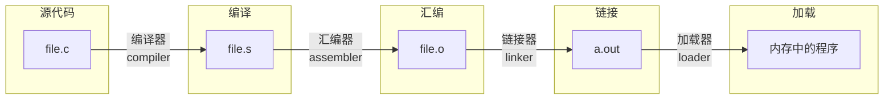

# 第2章 指令：计算机的语言

> To command a computer's hardware, you must speak its language. The words of a computer's language are called instructions, and its vocabulary is called an instruction set.
>
> — Patterson & Hennessy, *Computer Organization and Design, RISC-V Edition*

本章介绍指令集（instruction set）——硬件与软件之间的接口。指令集是计算机能够理解并执行的**原子操作**（atomic operation）的集合。我们以 RISC-V 指令集为例，展示如何用简洁、规整的指令设计实现高性能、可扩展的计算机系统。

---

## 2.1 引言

**指令集架构**（Instruction Set Architecture, ISA）是硬件与软件之间的契约。它定义了程序员可见的指令、寄存器、内存模型等，而具体实现（如流水线深度、缓存大小）则由微架构决定。RISC-V 是一种开源、精简的指令集，具有规整的编码格式和清晰的扩展机制。

::: info 设计原则 1：简洁性有助于规整性
简洁的设计往往带来规整性。RISC-V 的指令数量少、格式统一，使得硬件实现更容易，也便于编译器生成高效代码。
:::

---

## 2.2 计算机硬件的操作

计算机最基本的操作是**算术运算**。RISC-V 的算术指令以**寄存器**（register）为操作数，采用三操作数格式：

```asm
add  x19, x6, x7    # x19 = x6 + x7
sub  x20, x19, x8   # x20 = x19 - x8
```

每条指令的格式为：`操作码 目标寄存器, 源寄存器1, 源寄存器2`。RISC-V 是**加载/存储架构**（load-store architecture）：只有 `ld` 和 `sd` 等指令能访问内存，算术运算仅在寄存器之间进行。

```asm
# 计算 f = (g + h) - (i + j)
# 假设 g, h, i, j 在 x5, x6, x7, x8 中
add  x19, x5, x6    # x19 = g + h
add  x20, x7, x8    # x20 = i + j
sub  x21, x19, x20  # f = x19 - x20
```

---

## 2.3 计算机硬件的操作数

### 寄存器

RISC-V 有 32 个通用**寄存器**（register），编号为 `x0` 到 `x31`。每个寄存器在 RV64 中为 64 位。

| 寄存器 | ABI 名称 | 用途 |
|--------|----------|------|
| x0 | zero | 恒为 0，硬连线 |
| x1 | ra | 返回地址 |
| x2 | sp | 栈指针 |
| x3 | gp | 全局指针 |
| x4 | tp | 线程指针 |
| x5–x7 | t0–t2 | 临时寄存器 |
| x8 | s0/fp | 保存寄存器 / 帧指针 |
| x9 | s1 | 保存寄存器 |
| x10–x11 | a0–a1 | 函数参数 / 返回值 |
| x12–x17 | a2–a7 | 函数参数 |
| x18–x27 | s2–s11 | 保存寄存器 |
| x28–x31 | t3–t6 | 临时寄存器 |

::: tip 设计原则 2：越小越快
寄存器数量不宜过多。寄存器越多，访问越慢（需要更多位选择），且保存/恢复上下文的开销越大。32 个寄存器是经过权衡的折中。
:::

### 内存操作数

当数据量超过寄存器容量时，必须使用**内存**（memory）。RISC-V 使用**字节寻址**（byte addressing）：每个字节有唯一地址。多字节数据按**大端序**（big-endian）或**小端序**（little-endian）存储；RISC-V 支持两种字节序，通常采用小端序。

**加载**（load）和**存储**（store）指令：

```asm
ld   x9, 8(x22)     # x9 = 内存[x22 + 8] 处的双字（64 位）
sd   x9, 8(x22)     # 内存[x22 + 8] = x9
```

`8(x22)` 表示**基址**（base）加**偏移**（offset）的寻址方式：有效地址 = x22 + 8。

```asm
# 假设 A 是 64 位双字数组，基址在 x22
# A[i] 的地址 = 基址 + i × 8
# g = A[1]
ld   x9, 8(x22)     # x9 = A[1]，偏移 8 字节
# h = A[2]
ld   x10, 16(x22)   # x10 = A[2]，偏移 16 字节
```

::: warning 设计原则 3：好的设计需要适度的折中
寄存器访问快但数量少；内存容量大但访问慢。设计需要在两者之间取得平衡：常用数据放寄存器，大量数据放内存。
:::

---

## 2.4 有符号数与无符号数

计算机用**二进制**表示整数。**无符号数**（unsigned）直接表示非负整数；**有符号数**（signed）用**二进制补码**（two's complement）表示。

### 二进制补码

- 最高位为**符号位**（sign bit）：0 表示非负，1 表示负
- 非负数：与无符号表示相同
- 负数：其绝对值的二进制取反后加 1

例如，8 位补码中：
- +127 = 0111 1111
- -1 = 1111 1111
- -128 = 1000 0000

### 符号扩展

将较短的有符号数扩展为较长格式时，需要**符号扩展**（sign extension）：在高位复制符号位。

```asm
# RISC-V 中的符号扩展
addi x10, x10, 0    # 将 32 位值符号扩展为 64 位（addi 自动扩展）
addw x11, x12, x13  # 32 位加法，结果符号扩展后写入 x11
```

---

## 2.5 计算机中指令的表示

指令在计算机中同样以二进制存储。RISC-V 指令长度为 32 位（RV32）或 64 位（RV64），具有**规整的指令格式**。

### RISC-V 指令格式

RISC-V 定义了六种基本指令格式：



| 格式 | 用途 | 字段 |
|------|------|------|
| **R-type** | add, sub, and, or 等 | funct7, rs2, rs1, funct3, rd, opcode |
| **I-type** | ld, addi, jalr 等 | imm[11:0], rs1, funct3, rd, opcode |
| **S-type** | sd, sw 等存储 | imm[11:5], rs2, rs1, funct3, imm[4:0], opcode |
| **SB-type** | beq, bne 等分支 | imm, rs2, rs1, funct3, opcode |
| **U-type** | lui, auipc | imm[31:12], rd, opcode |
| **UJ-type** | jal | imm, rd, opcode |

::: info 设计原则 4：规整性有助于简化

格式规整使得：
- 指令译码简单：opcode 和 funct3/funct7 决定操作类型
- 字段位置固定：rs1、rs2、rd 在各类格式中位置一致
- 硬件实现高效：可复用译码逻辑
:::

---

## 2.6 逻辑操作

除算术运算外，RISC-V 还提供**移位**（shift）和**按位逻辑**（bitwise logic）操作：

```asm
# 移位
slli x11, x19, 4     # 逻辑左移：x11 = x19 << 4
srli x12, x19, 4     # 逻辑右移
srai x13, x19, 4     # 算术右移（符号扩展）

# 按位逻辑
and  x12, x10, x11   # 按位与
or   x13, x10, x11   # 按位或
xor  x14, x10, x11   # 按位异或
xor  x15, x10, x10   # 清零：x15 = 0
```

**立即数**（immediate）版本：

```asm
andi x12, x10, 0xFF  # 取低 8 位（掩码）
ori  x13, x10, 1     # 置最低位为 1
```

---

## 2.7 决策指令

程序需要根据条件改变执行流程。RISC-V 使用**条件分支**（conditional branch）实现：

```asm
beq  x10, x11, L1    # 若 x10 == x11，跳转到 L1
bne  x10, x11, L1    # 若 x10 != x11，跳转到 L1
blt  x10, x11, L1    # 若 x10 < x11（有符号），跳转
bge  x10, x11, L1    # 若 x10 >= x11（有符号），跳转
bltu x10, x11, L1    # 若 x10 < x11（无符号），跳转
bgeu x10, x11, L1    # 若 x10 >= x11（无符号），跳转
```

### 比较并设置

```asm
slt  x12, x10, x11   # 若 x10 < x11（有符号），x12 = 1，否则 x12 = 0
sltu x13, x10, x11   # 无符号比较
```

### 循环示例

```asm
# while (i != j) { i += 1; }
# 假设 i 在 x22，j 在 x23
Loop:
    beq  x22, x23, Done
    addi x22, x22, 1
    j    Loop
Done:
```

---

## 2.8 计算机硬件对过程的支持

**过程**（procedure）或**函数**（function）是程序的基本抽象。硬件需要支持：

1. **跳转并链接**（Jump and Link）：`jal` 保存返回地址并跳转
2. **跳转并链接寄存器**（Jump and Link Register）：`jalr` 用于返回和间接调用
3. **栈**（stack）：保存/恢复寄存器

```asm
jal  x1, sum         # 调用 sum，返回地址存入 x1
# ...
sum:
    addi sp, sp, -16 # 分配栈帧
    sd   ra, 8(sp)   # 保存返回地址
    sd   s0, 0(sp)   # 保存 s0
    # ... 过程体 ...
    ld   s0, 0(sp)
    ld   ra, 8(sp)
    addi sp, sp, 16
    jalr x0, 0(ra)   # 返回（x0 为丢弃目标）
```

### 寄存器约定

- **保存寄存器**（s0–s11）：被调用者必须保存，调用前后值不变
- **临时寄存器**（t0–t6）：被调用者可任意使用

### 过程调用栈帧



### 内存布局



---

## 2.9 与人通信

计算机使用**字符编码**（character encoding）表示文本。常见编码包括：

- **ASCII**（American Standard Code for Information Interchange）：7 位，128 个字符
- **Unicode**：支持多种语言，UTF-8 为可变长度编码

字符串在内存中按字节顺序存储，以空字符 `\0` 结尾（C 语言约定）。

```c
// C 字符串
char *msg = "Hello";
// 内存中: 'H' 'e' 'l' 'l' 'o' '\0'
```

```asm
# 加载字符串中的字节
lb   x10, 0(x11)     # 加载字节（符号扩展）
lbu  x10, 0(x11)     # 加载无符号字节
```

---

## 2.10 RISC-V 大立即数与地址的寻址

### 加载大立即数

32 位立即数无法一次装入 12 位立即数字段。RISC-V 使用 **lui**（Load Upper Immediate）

```asm
lui  x10, 0x12345    # x10 = 0x12345000（低 12 位为 0）
addi x10, x10, 0x678 # x10 = 0x12345678
```

### PC 相对寻址

分支和跳转使用 **PC 相对寻址**（PC-relative addressing）：目标地址 = PC + 偏移量。这使得**位置无关代码**（Position Independent Code, PIC）成为可能。

```asm
# beq 的偏移量是 12 位有符号数，以 2 字节为单位
# 跳转范围：±4KB
beq  x10, x11, target
```

---

## 2.11 并行与指令：同步

多核或多线程环境下，需要**原子操作**（atomic operation）实现同步。RISC-V 提供**加载保留/条件存储**（Load Reserved / Store Conditional）：

```asm
# 原子加载-修改-存储
lr.d  x12, (x10)     # 加载保留：从 x10 指向的地址加载
# ... 修改 x12 ...
sc.d  x13, x12, (x10) # 条件存储：若地址未被修改则存储，x13=0 表示成功
bne   x13, x0, retry  # 若失败则重试
```

::: tip 原子性
`lr.d` 和 `sc.d` 成对使用，可保证其间的操作序列不被其他处理器中断，从而实现**锁**（lock）等同步原语。
:::

---

## 2.12 程序的翻译与启动

从高级语言到可执行文件，需要经历多个阶段：



| 阶段 | 工具 | 输入 | 输出 |
|------|------|------|------|
| 编译 | 编译器 (gcc -S) | 高级语言 (.c) | 汇编 (.s) |
| 汇编 | 汇编器 (as) | 汇编 (.s) | 目标文件 (.o) |
| 链接 | 链接器 (ld) | 目标文件 + 库 | 可执行文件 |
| 加载 | 加载器 (OS) | 可执行文件 | 内存映像 |

**动态链接库**（Dynamically Linked Library, DLL / .so）在运行时加载，可被多个进程共享，减少内存占用。

---

## 2.13 综合示例：C 排序程序

以下完整示例展示排序程序如何映射到 RISC-V 指令：

```c
void swap(int v[], int k) {
    int temp;
    temp = v[k];
    v[k] = v[k+1];
    v[k+1] = temp;
}

void sort(int v[], int n) {
    int i, j;
    for (i = 0; i < n; i++)
        for (j = i - 1; j >= 0 && v[j] > v[j+1]; j--)
            swap(v, j);
}
```

```asm
# swap 过程
# v 在 a0，k 在 a1
swap:
    slli x12, a1, 2      # x12 = k * 4
    add  x12, a0, x12    # x12 = &v[k]
    lw   x13, 0(x12)     # x13 = v[k]
    lw   x14, 4(x12)     # x14 = v[k+1]
    sw   x14, 0(x12)     # v[k] = x14
    sw   x13, 4(x12)     # v[k+1] = x13
    jalr x0, 0(ra)       # 返回

# sort 过程（简化）
# 外层循环 i，内层循环 j
# 条件：j >= 0 && v[j] > v[j+1]
sort:
    addi sp, sp, -32
    sd   ra, 24(sp)
    sd   s0, 16(sp)
    # ... 循环体 ...
    ld   s0, 16(sp)
    ld   ra, 24(sp)
    addi sp, sp, 32
    jalr x0, 0(ra)
```

---

## 2.14 数组与指针

C 语言中，数组可通过**索引**或**指针**访问：

```c
// 数组索引
int array_sum(int a[], int n) {
    int sum = 0;
    for (int i = 0; i < n; i++)
        sum += a[i];
    return sum;
}

// 指针
int ptr_sum(int *a, int n) {
    int sum = 0;
    for (int *p = a; p < a + n; p++)
        sum += *p;
    return sum;
}
```

两者在**语义**上等价，但生成的代码可能不同：

- **数组索引**：每次迭代计算 `a + i * sizeof(int)`，需要乘法或移位
- **指针**：每次迭代 `p++`，只需一次加法

现代编译器通常能优化数组索引为指针形式，因此性能差异往往很小。但在**手写汇编**或**底层优化**时，指针方式可能更直接。

---

## 术语表

| 术语 | 英文 | 定义 |
|------|------|------|
| 指令集 | Instruction Set |  CPU 能执行的所有指令的集合 |
| 指令集架构 | ISA | 硬件与软件之间的接口规范 |
| 寄存器 | Register |  CPU 内部的高速存储单元 |
| 加载/存储架构 | Load-Store Architecture | 只有 load/store 能访问内存的架构 |
| 二进制补码 | Two's Complement | 有符号整数的表示方法 |
| 符号扩展 | Sign Extension | 将短有符号数扩展为长格式 |
| 栈帧 | Stack Frame | 过程调用时在栈上分配的空间 |
| 原子操作 | Atomic Operation | 不可分割的执行单元 |
| 位置无关代码 | PIC | 可在任意地址加载执行的代码 |

---

[← 上一章](./ch01.md) | [目录](./index.md) | [下一章 →](./ch03.md)
