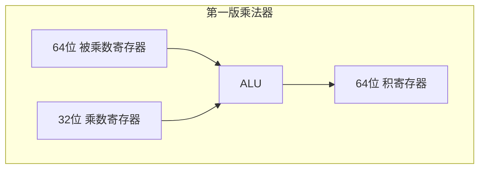
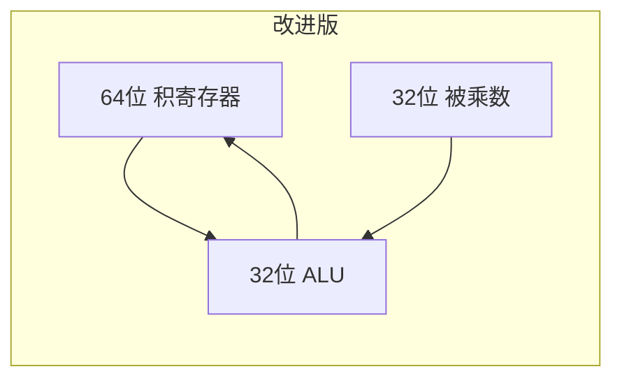
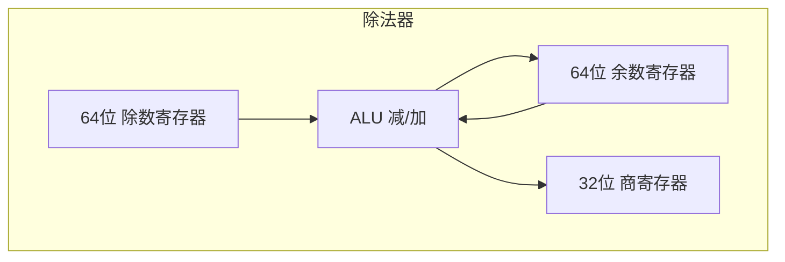
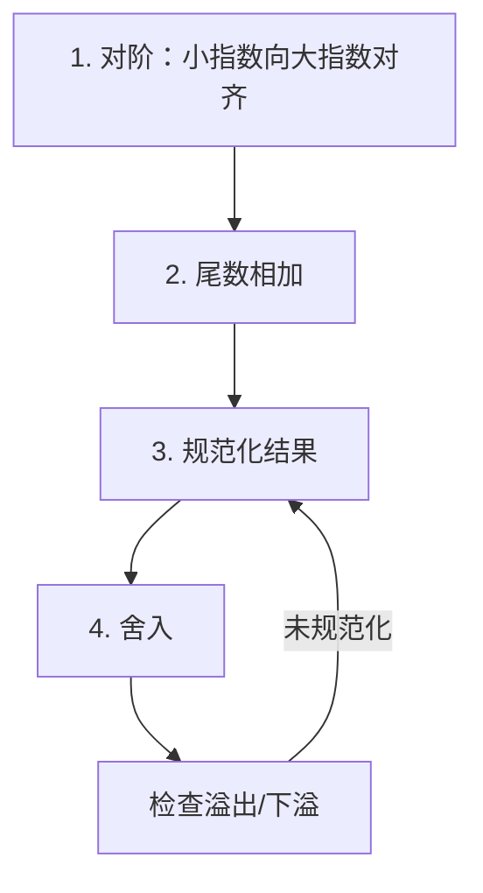
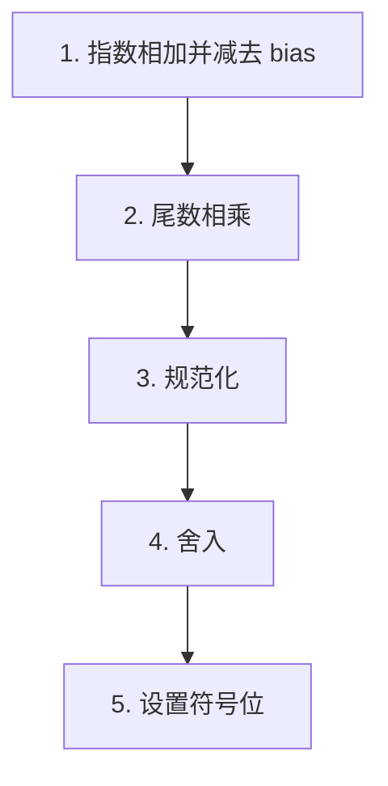

# 第3章 计算机算术

> **Computer Organization and Design: The Hardware/Software Interface, RISC-V Edition**
> David A. Patterson, John L. Hennessy — Chapter 3: Arithmetic for Computers
>
> *Numerical precision is the very soul of science.*
> — Sir D'arcy Wentworth Thompson, *On Growth and Form*, 1917

---

## 3.1 引言

计算机字由位组成，因此字可以表示为二进制数。第 2 章展示了整数可以用十进制或二进制形式表示，但其他常见数字呢？例如：

- **分数和其他实数**如何表示？
- 当运算产生的结果**超出可表示范围**时会发生什么？
- 更深层的问题是：**硬件如何真正实现乘法和除法**？

本章的目标是揭开这些谜题，包括实数的表示、算术算法、遵循这些算法的硬件，以及这一切对指令集的影响。这些洞见可以解释你在使用计算机时可能遇到的一些怪现象。此外，我们将展示如何利用这些知识使算术密集型程序运行得更快。

---

## 3.2 加法与减法

### 二进制加减法

计算机中的加法与手算类似：从右到左逐位相加，进位传递到左侧下一位。减法通过加法实现：将减数取反后与被减数相加。

**示例**：用二进制将 $6_{10}$ 与 $7_{10}$ 相加，然后从 $7_{10}$ 减去 $6_{10}$。

```text
  0110  (6)
+ 0111  (7)
------
  1101  (13)
```

减法可通过补码实现：$7 - 6 = 7 + (-6)$，其中 $-6$ 的补码为 `1010`。

### 溢出检测

**溢出**（overflow）发生在运算结果无法用可用硬件（如 32 位字）表示时。

::: info 溢出何时发生

- **加法**：两个正数相加得负数，或两个负数相加得正数时发生溢出
- **减法**：正数减负数得负数，或负数减正数得正数时发生溢出
- 不同符号操作数相加/同符号操作数相减时**不会**发生溢出

:::

溢出时，符号位会被错误地设置，因为需要第 33 位才能正确表示结果。


### 溢出处理：异常与中断

计算机设计者必须决定如何处理算术溢出。虽然 C 和 Java 等语言忽略整数溢出，但 Ada 和 Fortran 等语言要求通知程序。

::: tip 异常（Exception）与中断（Interrupt）

- **异常**（exception）：也称中断，是打断程序执行的**非预定事件**，用于检测溢出
- **中断**（interrupt）：来自处理器外部的异常

:::

RISC-V 基础整数指令 `add`、`addi`、`sub` 不自动触发溢出异常，溢出检测通常由软件完成。部分扩展或实现可提供溢出陷阱选项。

::: warning C 语言与溢出

C 语言忽略溢出，因此 C 编译器通常生成不检测溢出的算术指令。若需检测溢出，需使用显式检查或语言扩展。

:::

---

## 3.3 乘法

### 乘法算法基础

回顾十进制乘法：被乘数（multiplicand）× 乘数（multiplier）= 积（product）。n 位被乘数与 m 位乘数相乘，结果需要 $n+m$ 位表示。

二进制乘法每步只有两种选择：

1. 乘数位为 1：将被乘数放到正确位置
2. 乘数位为 0：放置 0

### 基本乘法器硬件



**算法步骤**（每步重复 32 次）：

1. 若乘数最低位为 1，将被乘数加到积
2. 被乘数左移 1 位
3. 乘数右移 1 位

**示例**：4 位数 $2_{10} \times 3_{10}$，即 `0010` × `0011`：

| 步骤 | 积 | 乘数 | 操作 |
|------|-----|------|------|
| 初值 | 0000 0000 | 0011 | — |
| 1 | 0000 0010 | 0011 | 乘数最低位=1，加被乘数 |
| 2 | 0000 0100 | 0001 | 左移/右移 |
| 3 | 0000 0100 | 0001 | 乘数最低位=1，加被乘数 |
| 4 | 0000 0110 | 0000 | 左移/右移，得结果 6 |

### 改进版乘法器

通过将乘数放入积寄存器的右半部分、积右移而非被乘数左移，可减半加法器和寄存器宽度。



### Booth 算法思想

Booth 算法通过检测乘数中连续的 0 和 1 来减少加法次数，可加速有符号乘法。

### RISC-V 乘法指令

| 指令 | 功能 | 说明 |
|------|------|------|
| `mul rd, rs1, rs2` | rd = rs1 × rs2（低 32 位） | 有符号乘法 |
| `mulh rd, rs1, rs2` | rd = (rs1 × rs2) 高 32 位 | 有符号×有符号 |
| `mulhsu rd, rs1, rs2` | rd = (rs1 × rs2) 高 32 位 | 有符号×无符号 |
| `mulhu rd, rs1, rs2` | rd = (rs1 × rs2) 高 32 位 | 无符号×无符号 |

```asm
# 示例：计算 a * b，结果存入 t0（低32位）和 t1（高32位）
mul   t0, a0, a1    # 低32位
mulh  t1, a0, a1    # 高32位（有符号）
```

### 快速乘法器

通过并行组织多个加法器，可将乘法延迟从 32 次加法降至 $\log_2(32) = 5$ 次加法。使用**进位保留加法器**（carry-save adder）和流水线可进一步加速。

---

## 3.4 除法

### 除法算法基础

除法的操作数：**被除数**（dividend）÷ **除数**（divisor）= **商**（quotient）… **余数**（remainder）

关系式：
$$
\text{dividend} = \text{quotient} \times \text{divisor} + \text{remainder}
$$

其中 $\text{remainder} < \text{divisor}$。

### 基本除法器硬件



**算法步骤**（重复 33 次）：

1. 余数减除数
2. 若结果 ≥ 0：商置 1；否则恢复余数（加回除数），商置 0
3. 除数右移，继续迭代

### 改进版除法器

将余数左移、商与余数右半部分合并，可减半硬件宽度。

### 有符号除法

商和余数的符号规则：

- 商：两操作数符号不同时取负
- 余数：非零余数的符号与**被除数**相同

### RISC-V 除法指令

| 指令 | 功能 | 说明 |
|------|------|------|
| `div rd, rs1, rs2` | rd = rs1 ÷ rs2 | 有符号除法 |
| `divu rd, rs1, rs2` | rd = rs1 ÷ rs2 | 无符号除法 |
| `rem rd, rs1, rs2` | rd = rs1 mod rs2 | 有符号余数 |
| `remu rd, rs1, rs2` | rd = rs1 mod rs2 | 无符号余数 |

::: warning 除零与溢出

RISC-V 除法指令不自动检测除零或商溢出，软件需自行检查除数是否为零。

:::

---

## 3.5 浮点数

### 科学计数法与规范化

**科学计数法**（scientific notation）：小数点左侧只有一位数字。**规范化**（normalized）形式无前导零。

二进制科学计数法：
$$
(-1)^S \times 1.F \times 2^E
$$

其中 $S$ 为符号位，$F$ 为尾数（fraction），$E$ 为指数（exponent）。

### IEEE 754 浮点标准

| 格式 | 总位数 | 符号 | 指数 | 尾数 | 偏移(bias) |
|------|--------|------|------|------|------------|
| 单精度 (float) | 32 | 1 | 8 | 23 | 127 |
| 双精度 (double) | 64 | 1 | 11 | 52 | 1023 |

**单精度格式**：

| 位 | 31 | 30-23 | 22-0 |
|----|-----|-------|------|
| 含义 | 符号 S | 指数 E（偏置） | 尾数 F |

实际值计算：
$$
\text{value} = (-1)^S \times 1.F \times 2^{E - \text{bias}}
$$

**隐式前导 1**：规范化数隐含最高位为 1，故有效位数实际为 24 位（单精度）或 53 位（双精度）。

### IEEE 754 特殊值

| 指数 | 尾数 | 含义 |
|------|------|------|
| 全 0 | 全 0 | ±0 |
| 全 0 | 非 0 | 非规范化数（denormalized） |
| 1~254 (单精度) | 任意 | 规范化数 |
| 全 1 | 全 0 | ±∞ |
| 全 1 | 非 0 | NaN（Not a Number） |

### 溢出与下溢

- **溢出**（overflow）：正指数过大，无法存入指数域
- **下溢**（underflow）：负指数过大，无法存入指数域

### 浮点加法算法



### 浮点乘法算法



### 舍入与精度

- **保护位**（guard）、**舍入位**（round）、**粘位**（sticky bit）用于提高舍入精度
- **ULP**（Units in the Last Place）：最低有效位的单位

### RISC-V 浮点指令

| 类型 | 单精度 | 双精度 |
|------|--------|--------|
| 加法 | `fadd.s` | `fadd.d` |
| 减法 | `fsub.s` | `fsub.d` |
| 乘法 | `fmul.s` | `fmul.d` |
| 除法 | `fdiv.s` | `fdiv.d` |
| 比较 | `feq.s`, `flt.s`, `fle.s` | `feq.d`, `flt.d`, `fle.d` |
| 分支 | `bclt`, `bclf` | 同左 |

```asm
# 浮点加法示例：f0 = f1 + f2（单精度）
fadd.s f0, f1, f2

# 双精度乘法
fmul.d fa0, fa0, fa1
```

---

## 3.6 并行性与计算机算术：子字并行

**子字并行**（subword parallelism）或 **SIMD**（Single Instruction, Multiple Data）：一条指令同时操作多个较短的整数或浮点数。

例如，128 位寄存器可同时容纳：

- 4 个 32 位整数
- 8 个 16 位整数
- 4 个单精度浮点数

::: tip 应用场景

子字并行常用于多媒体、图像处理、科学计算中的向量运算，可显著提升吞吐量。

:::

---

## 3.7 真实案例：x86 的 SSE 与 AVX

**Streaming SIMD Extensions (SSE)** 和 **Advanced Vector Extensions (AVX)** 是 Intel x86 架构的 SIMD 扩展：

- **SSE**：128 位寄存器，支持 4×float 或 2×double
- **AVX**：256 位寄存器，支持 8×float 或 4×double
- **AVX-512**：512 位寄存器

---

## 3.8 加速：子字并行与矩阵乘法

使用子字并行加速 **DGEMM**（Double precision General Matrix Multiply）$C = C + A \times B$：

- 一条指令可同时计算多个乘积
- 典型性能提升约 **4 倍**（取决于数据宽度和算法优化）

```c
// 矩阵乘法核心循环（概念性）
for (int i = 0; i < N; i++)
  for (int j = 0; j < N; j++)
    for (int k = 0; k < N; k++)
      c[i][j] += a[i][k] * b[k][j];
```

---

## 3.9 谬误与陷阱

### 浮点运算的常见陷阱

::: warning 结合律不成立

浮点加法不满足结合律！$(a + b) + c$ 与 $a + (b + c)$ 可能因舍入产生不同结果。

:::

::: warning 精度问题

- 连续浮点运算会累积舍入误差
- 比较浮点数应使用误差范围，而非直接 `==`
- 大数加小数可能丢失精度（对阶时小数尾数右移）

:::

::: info 示例

```c
// 危险：浮点相等比较
if (x == 0.1)  // 可能永远为假！

// 更好：使用误差范围
if (fabs(x - 0.1) < 1e-9)
```

:::

---

## 3.10 小结

本章涵盖了计算机算术的核心内容：

1. **加减法**：补码运算、溢出检测与异常处理
2. **乘法**：移位-加法算法、Booth 思想、RISC-V 的 `mul`/`mulh` 系列
3. **除法**：恢复/不恢复算法、RISC-V 的 `div`/`rem` 系列
4. **浮点**：IEEE 754 格式、规范化、特殊值、加减乘除算法
5. **并行**：子字并行、SIMD 加速矩阵运算

有限字长意味着算术运算可能产生无法表示的结果，理解这些机制对编写正确、高效的数值程序至关重要。

---

## 附录：关键公式速查

**补码加法溢出**：$C_{out} \oplus C_{in\_sign} = 1$ 时溢出

**IEEE 754 单精度值**：
$$
(-1)^S \times (1 + \sum_{i=1}^{23} s_i \cdot 2^{-i}) \times 2^{E-127}
$$

**浮点乘法指数**：
$$
E_{product} = E_1 + E_2 - \text{bias}
$$

---

[← 上一章](./ch02.md) | [目录](./index.md) | [下一章 →](./ch04.md)
