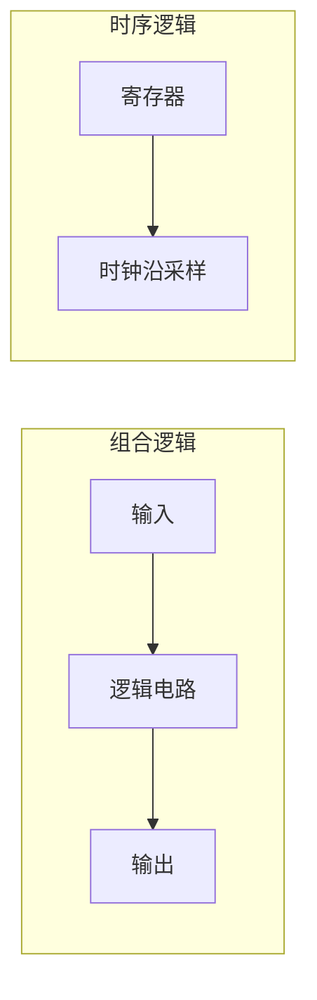
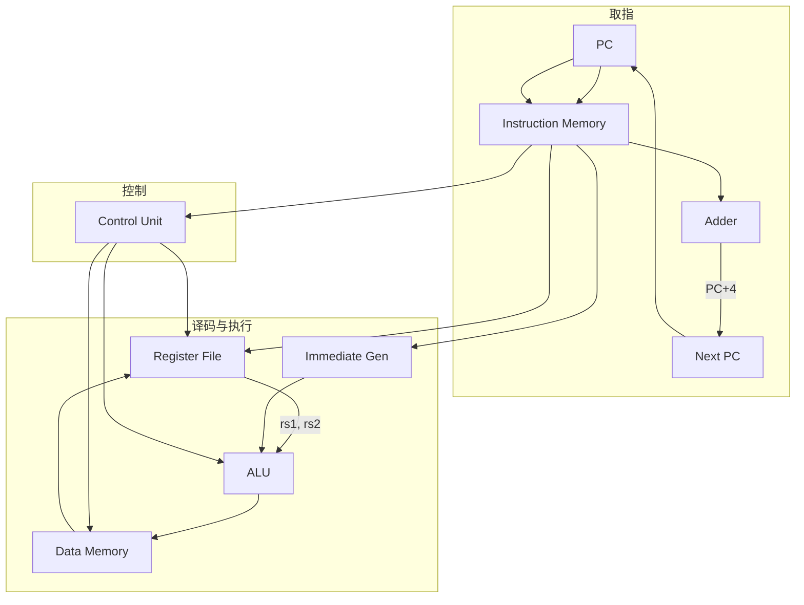
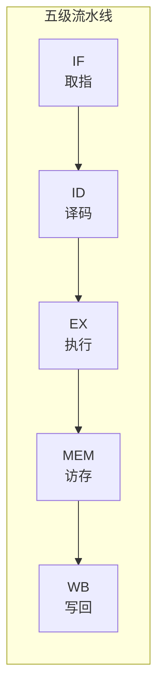
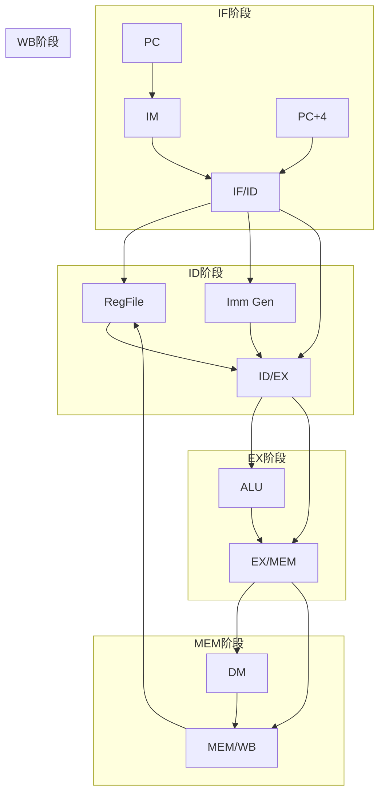
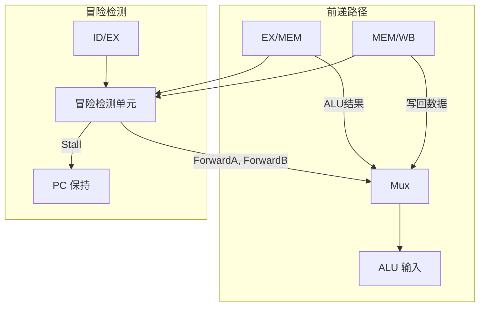
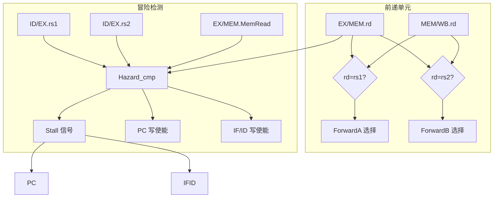

# 第4章 处理器

> **Computer Organization and Design: The Hardware/Software Interface, RISC-V Edition**
>
> Chapter 4: The Processor
>
> David A. Patterson, John L. Hennessy, 2018

---

本章介绍如何构建一个能够执行 RISC-V 指令集的处理器。我们将从简单的单周期实现开始，然后逐步引入**流水线**（pipelining）技术以提高性能。流水线是现代处理器设计的核心，它允许多条指令同时处于不同的执行阶段，从而显著提高吞吐量。

---

## 4.1 引言

处理器是计算机系统的核心，负责从内存中取指令、解码并执行它们。本章将讨论两种主要的实现方案：

1. **简单实现**：单周期或接近单周期的设计，每条指令在一个时钟周期内完成（或使用固定周期数）
2. **流水线实现**：将指令执行划分为多个阶段，允许多条指令重叠执行，提高吞吐量

::: info 性能目标
处理器的性能取决于三个关键因素：**指令数**、**时钟周期**和**时钟周期时间**。流水线通过减少每条指令的平均时钟周期数（CPI）来提升性能。
:::

---

## 4.2 逻辑设计约定

在构建处理器之前，我们需要建立一些逻辑设计的基本约定。

### 组合逻辑与时序逻辑

- **组合逻辑**（Combinational logic）：输出仅取决于当前输入，无记忆功能。例如：ALU、多路选择器、译码器
- **时序逻辑**（Sequential logic）：输出取决于当前输入和内部状态，具有记忆功能。例如：寄存器、存储器

### 边沿触发时钟方法论

RISC-V 处理器采用**边沿触发**（edge-triggered）时钟设计：

- 状态单元（寄存器、存储器）在时钟**上升沿**采样输入并更新输出
- 组合逻辑在时钟周期内稳定，其输出在下一个时钟沿被采样
- 这种设计避免了**竞争条件**（race condition），确保电路行为可预测



::: tip 设计原则
所有状态更新都发生在时钟边沿，组合逻辑的传播延迟决定了时钟周期的最小值。
:::

---

## 4.3 构建数据通路

**数据通路**（datapath）是处理器中执行操作和存储数据的部件集合。我们按功能模块逐步构建 RISC-V 数据通路。

### 基本组件

| 组件 | 功能 |
|------|------|
| **PC**（Program Counter） | 保存当前指令地址，每周期 +4 |
| **指令存储器**（Instruction Memory） | 根据 PC 取指令 |
| **寄存器堆**（Register File） | 32 个 32 位寄存器，支持双读单写 |
| **ALU**（Arithmetic Logic Unit） | 执行算术与逻辑运算 |
| **数据存储器**（Data Memory） | 加载/存储指令访问 |
| **立即数生成器**（Immediate Generator） | 从指令中提取并符号扩展立即数 |

### 各指令类型的数据通路

- **R-type**：`rd ← rs1 op rs2`，需要寄存器堆读、ALU 运算、寄存器堆写
- **I-type（Load）**：`rd ← Mem[rs1 + imm]`，需要地址计算、存储器读、寄存器写
- **S-type（Store）**：`Mem[rs1 + imm] ← rs2`，需要地址计算、存储器写
- **B-type（Branch）**：`if (rs1 op rs2) PC ← PC + imm`，需要比较、PC 更新

### 单周期数据通路（简化版）



---

## 4.4 简单实现方案

### 单周期实现

在单周期实现中，每条指令在一个时钟周期内完成。所有数据通路组件串联连接，时钟周期必须足够长以容纳最慢指令（通常是 load）的完整路径。

### 主控制单元

主控制单元根据**操作码**（opcode）和**funct3/funct7** 字段生成控制信号：

| 控制信号 | 功能 |
|----------|------|
| `RegWrite` | 使能寄存器堆写 |
| `ALUOp` | ALU 操作类型（2 位） |
| `ALUSrc` | ALU 第二操作数来源（0=rs2, 1=imm） |
| `Branch` | 分支使能 |
| `MemRead` | 数据存储器读使能 |
| `MemWrite` | 数据存储器写使能 |
| `MemtoReg` | 写回数据来源（0=ALU, 1=Mem） |
| `Jump` | 跳转使能 |

### ALU 控制

ALU 控制单元根据 `ALUOp` 和 `funct3/funct7` 生成 4 位 ALU 控制信号：

| ALUOp | funct3 | ALU 操作 |
|-------|--------|----------|
| 00 | — | 加法（用于 load/store） |
| 01 | — | 减法（用于 branch） |
| 10 | 000 | 加法 |
| 10 | 001 | 逻辑左移 |
| 10 | 010 | 有符号比较 |
| 10 | 011 | 无符号比较 |
| 10 | 100 | 异或 |
| 10 | 101 | 逻辑右移 |
| 10 | 110 | 或 |
| 10 | 111 | 与 |

### 主控制信号表

| 指令 | RegWrite | ALUSrc | MemtoReg | MemRead | MemWrite | Branch | ALUOp |
|------|----------|--------|----------|---------|----------|--------|-------|
| R-type | 1 | 0 | 0 | 0 | 0 | 0 | 10 |
| lw | 1 | 1 | 1 | 1 | 0 | 0 | 00 |
| sw | 0 | 1 | X | 0 | 1 | 0 | 00 |
| beq | 0 | 0 | X | 0 | 0 | 1 | 01 |
| jal | 1 | X | X | 0 | 0 | 0 | XX |

---

## 4.5 流水线概述

### 洗衣房类比

想象一个洗衣房有四个阶段：洗衣、烘干、折叠、存放。若每阶段需 30 分钟，洗 4 桶衣服：

- **非流水线**：4 × 120 = 480 分钟
- **流水线**：4 × 30 + 90 = 210 分钟（首桶完成后，后续桶重叠进行）

### 五级流水线

RISC-V 采用经典的五级流水线：



| 阶段 | 英文 | 功能 |
|------|------|------|
| **IF** | Instruction Fetch | 从指令存储器取指令，PC+4 |
| **ID** | Instruction Decode | 译码，读寄存器堆，生成立即数 |
| **EX** | Execute | ALU 运算，地址计算，分支判断 |
| **MEM** | Memory Access | 数据存储器读/写 |
| **WB** | Write Back | 将结果写回寄存器堆 |

### 流水线加速比

理想情况下，k 级流水线可使吞吐量提高 k 倍。对于 n 条指令：

$$
\text{加速比} = \frac{n \times k}{k + (n-1)} \approx k \quad (n \gg k)
$$

其中：非流水线执行 n 条指令需 $n \times k$ 个周期，k 级流水线需 $k + (n-1)$ 个周期（首条指令填满流水线用 k 周期，此后每周期完成一条）。

### 流水线时空图

| 周期 | 1 | 2 | 3 | 4 | 5 | 6 | 7 | 8 |
|------|---|---|---|---|---|---|---|---|
| 指令1 | IF | ID | EX | MEM | WB | | | |
| 指令2 | | IF | ID | EX | MEM | WB | | |
| 指令3 | | | IF | ID | EX | MEM | WB | |
| 指令4 | | | | IF | ID | EX | MEM | WB |

从周期 5 开始，每周期完成一条指令，理想 CPI = 1。

### 流水线冒险

流水线可能遇到**冒险**（hazard），导致需要停顿或特殊处理：

| 冒险类型 | 原因 | 解决方案 |
|----------|------|----------|
| **结构冒险**（Structural hazard） | 硬件资源冲突 | 分离指令/数据存储器，增加端口 |
| **数据冒险**（Data hazard） | 数据依赖未就绪 | 前递（forwarding）、停顿（stalling） |
| **控制冒险**（Control hazard） | 分支/跳转导致取错指令 | 分支预测、延迟槽、冲刷 |

---

## 4.6 流水线数据通路与控制

### 流水线寄存器

在各级之间插入**流水线寄存器**（pipeline register）保存中间结果：

- **IF/ID**：保存取出的指令和 PC+4
- **ID/EX**：保存译码后的控制信号、寄存器值、立即数
- **EX/MEM**：保存 ALU 结果、分支目标、控制信号
- **MEM/WB**：保存存储器读出数据、ALU 结果、写回控制

### 流水线数据通路图



### 控制信号传递

控制信号在 ID 阶段生成，随指令流经各级流水线寄存器，在相应阶段生效。例如 `MemRead`、`MemWrite` 在 MEM 阶段使用，`RegWrite`、`MemtoReg` 在 WB 阶段使用。

---

## 4.7 数据冒险：前递与停顿

### 数据冒险检测

当一条指令需要用到前一条指令尚未写回的结果时，发生**数据冒险**。例如：

```asm
add x1, x2, x3   # x1 在 WB 阶段才写回
sub x4, x1, x5   # 需要 x1，但 x1 尚未就绪
```

### 前递/旁路单元

**前递**（forwarding，又称 bypassing）将尚未写回寄存器堆的结果直接旁路到需要它的指令，避免停顿。



### 前递条件

- **EX 前递**：前一条指令在 EX 阶段，其 ALU 结果可前递给当前指令的 ALU 输入
- **MEM 前递**：前一条指令在 MEM 阶段，其 ALU 结果或存储器数据可前递

### 加载-使用冒险

当 load 指令后紧跟使用其结果的指令时，数据在 MEM 阶段结束才可用，无法在 EX 阶段前递。此时必须**插入停顿**（stall）一个周期，即**气泡**（bubble）。

```asm
lw  x1, 0(x2)    # x1 在 MEM 周期末才可用
add x3, x1, x4   # 必须停顿 1 周期
```

**检测逻辑**：若 ID/EX 阶段的指令是 load（MemRead=1），且其目标寄存器 rd 等于 IF/ID 阶段指令的 rs1 或 rs2，则产生 Stall 信号。

**停顿操作**：

1. 保持 PC 不变（不取新指令）
2. 保持 IF/ID 不变（不推进）
3. 向 ID/EX 插入气泡（控制信号全 0，相当于 nop）

---

## 4.8 控制冒险

### 分支导致的控制冒险

分支指令在 EX 阶段才能确定是否跳转，此时已取出的下一条指令可能是错误的，需要**冲刷**（flush）流水线。

### 分支预测策略

| 策略 | 描述 |
|------|------|
| **静态预测** | 固定策略，如"总预测不跳转"或"向后跳转预测为跳转" |
| **动态预测** | 根据历史行为预测，使用**分支预测缓冲区**（Branch Prediction Buffer） |
| **延迟分支** | 在分支指令后填充有用指令，减少分支惩罚 |

### 分支预测缓冲区

小型缓存，用分支指令地址的低位索引，存储该分支最近一次是否跳转。可扩展为 2 位饱和计数器，提高准确率。

**2 位饱和计数器**：状态 00(强不跳)、01(弱不跳)、10(弱跳)、11(强跳)。预测错误时向反方向移动一位，预测正确时向当前方向移动（饱和）。可有效处理循环末尾的分支（循环内预测跳转，退出时预测不跳转）。

---

## 4.9 异常

### 异常与中断

**异常**（exception）包括：

- 未定义指令
- 非法地址
- 算术溢出
- 系统调用（ecall）
- 断点

**中断**（interrupt）由外部设备触发，如定时器、I/O 完成。

### RISC-V 异常处理机制

RISC-V 提供以下关键寄存器：

| 寄存器 | 功能 |
|--------|------|
| **stvec** | 陷阱处理程序入口地址 |
| **sepc** | 保存发生异常时的 PC |
| **scause** | 异常/中断原因编码 |
| **sstatus** | 状态寄存器，含 SIE（中断使能）等 |

### 流水线中的异常处理

异常可能在流水线任意阶段发生。处理策略：

1. 在 WB 阶段统一检测异常
2. 冲刷该指令及之后的所有指令
3. 将 PC 保存到 sepc，跳转到 stvec
4. 返回时从 sepc 恢复 PC

**精确异常**（precise exception）：异常发生时，异常指令之前的指令必须全部完成，异常指令及之后的指令必须像从未执行过。流水线通过按程序顺序处理异常、在 WB 阶段统一提交来实现精确异常。

---

## 4.10 通过指令实现并行

### 指令级并行（ILP）

**指令级并行**（Instruction-Level Parallelism, ILP）指在程序顺序下，多条指令可以同时执行而不产生数据依赖冲突。

### 多发射处理器

| 类型 | 描述 |
|------|------|
| **超标量**（Superscalar） | 每周期发射多条指令，硬件动态调度 |
| **VLIW**（Very Long Instruction Word） | 编译器将多条操作打包成一条长指令，静态调度 |

### 动态流水线调度

**乱序执行**（out-of-order execution）：指令按数据就绪顺序执行，而非程序顺序。需要**保留站**（reservation station）和**重排序缓冲区**（ROB）等结构。

### 推测执行

**推测执行**（speculative execution）：在分支结果未确定时预测并执行后续指令。若预测错误，需撤销并恢复状态。

---

## 4.11 真实世界：ARM Cortex-A53 与 Intel Core i7 流水线

### ARM Cortex-A53

ARM 的入门级 64 位处理器，采用 8–10 级流水线，顺序执行，适合低功耗场景。

### Intel Core i7

高端 x86 处理器，采用 14–19 级深度流水线，支持乱序执行、多发射、复杂的分支预测和推测执行，追求高性能。

::: info 设计权衡
简单流水线（如 Cortex-A53）功耗低、设计简单；复杂流水线（如 Core i7）性能高但功耗大、设计复杂。不同应用场景选择不同架构。
:::

---

## 4.12 加速：指令级并行与矩阵乘法

通过循环展开、**软件流水线**（software pipelining）、**SIMD**（单指令多数据）等技术，可提高矩阵乘法等密集计算程序的 ILP 利用率。

关键思想：识别独立操作，通过编译器或手写汇编调度，使流水线保持满载。

::: details 矩阵乘法优化示例
对 $C = A \times B$，内层循环可展开 4 次，使 4 次乘加操作独立，减少循环控制开销，提高 ILP。结合 SIMD 指令（如 RISC-V 的 V 扩展），可进一步向量化。
:::

---

## 关键公式汇总

| 公式 | 含义 |
|------|------|
| $\text{CPU 时间} = \text{指令数} \times \text{CPI} \times \text{时钟周期}$ | 处理器性能基本公式 |
| $\text{加速比} = \frac{\text{流水线深度} \times n}{n + \text{流水线深度} - 1}$ | 理想流水线加速比 |
| $\text{CPI}_{\text{pipeline}} = 1 + \text{停顿周期} + \text{分支惩罚}$ | 实际流水线 CPI |

---

## 小结

本章从单周期实现出发，逐步引入流水线技术。五级流水线（IF-ID-EX-MEM-WB）通过重叠执行提高吞吐量。数据冒险通过前递和停顿解决，控制冒险通过分支预测缓解。现代处理器进一步采用多发射、乱序执行和推测执行挖掘指令级并行。

---

## 前递与冒险检测单元详图



**前递选择逻辑**：

- `ForwardA = 10`：从 EX/MEM 前递（前一条在 EX）
- `ForwardA = 01`：从 MEM/WB 前递（前一条在 MEM 或 WB）
- `ForwardB` 同理

**Load-Use 冒险检测**：当 ID/EX 为 load 且 (ID/EX.rd = IF/ID.rs1 或 rs2) 时，插入停顿。

---

[← 上一章](./ch03.md) | [目录](./index.md) | [下一章 →](./ch05.md)
