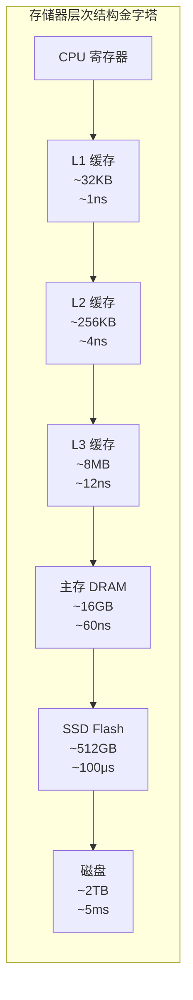
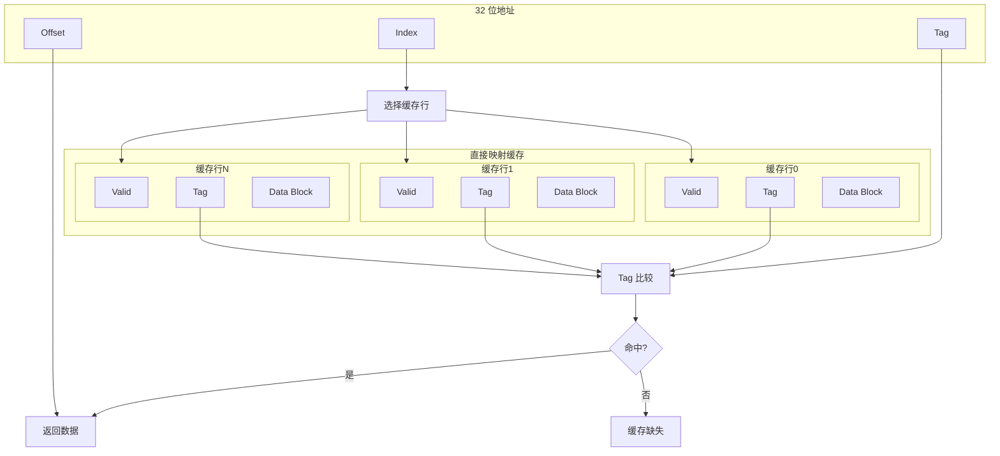
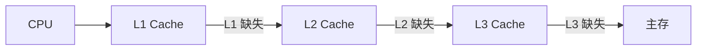
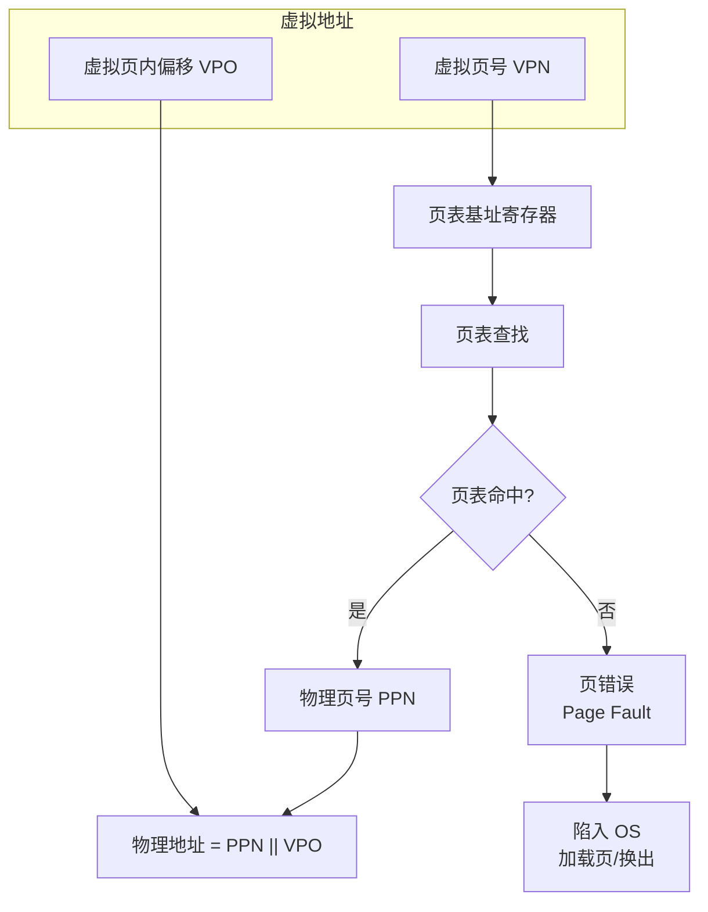
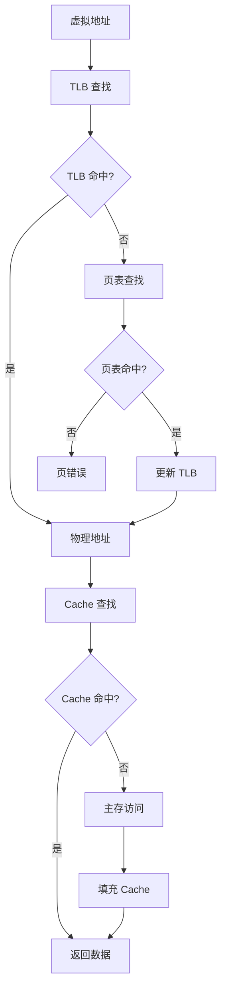

# 第5章 大而快：利用存储器层次结构

> **Computer Organization and Design: The Hardware/Software Interface, RISC-V Edition**
>
> Chapter 5: Large and Fast: Exploiting Memory Hierarchy
>
> David A. Patterson, John L. Hennessy, 2018

---

本章探讨如何通过**存储器层次结构**（memory hierarchy）同时实现大容量与高速度。理想的存储器应当容量大、速度快且成本低，但现实中这三者难以兼得。存储器层次结构通过将不同技术层次的存储器组织在一起，利用**局部性原理**（locality）使程序在大多数情况下能够快速访问所需数据。

---

## 5.1 引言

### 存储器层次结构概述

存储器层次结构将不同容量、速度和成本的存储器组织成金字塔结构。越靠近处理器，容量越小、速度越快、成本越高；越远离处理器，容量越大、速度越慢、成本越低。

::: info 设计目标
存储器层次结构的目标是：使**平均访问时间**（Average Memory Access Time, AMAT）接近最上层（最快）的存储器，而**有效容量**接近最下层（最大）的存储器。
:::

### 局部性原理

程序访问存储器时表现出两种**局部性**（locality）：

| 类型 | 英文 | 描述 | 示例 |
|------|------|------|------|
| **时间局部性** | Temporal locality | 最近访问过的数据很可能在近期再次被访问 | 循环变量、子程序调用 |
| **空间局部性** | Spatial locality | 访问某地址后，其邻近地址很可能被访问 | 数组遍历、顺序指令执行 |

局部性原理是存储器层次结构有效工作的基础。若程序没有局部性，缓存将无法有效减少访问延迟。

---

## 5.2 存储器技术

不同存储器技术在容量、速度、成本和易失性上各有特点。

### 存储器技术对比表

| 技术 | 类型 | 典型容量 | 访问时间 | 成本/位 | 易失性 | 典型用途 |
|------|------|----------|----------|----------|--------|----------|
| **SRAM** | 静态 RAM | KB–MB | ~1 ns | 高 | 是 | **缓存**（cache） |
| **DRAM** | 动态 RAM | GB | ~60 ns | 中 | 是 | 主存 |
| **Flash** | 非易失 | GB–TB | ~100 μs | 低 | 否 | SSD、U 盘 |
| **磁盘** | 磁存储 | TB | ~5 ms | 最低 | 否 | 大容量存储 |

### SRAM（静态随机存取存储器）

- **原理**：用触发器存储位，只要供电即保持数据
- **特点**：速度快、功耗低（待机时）、无需刷新
- **用途**：**缓存**（cache），尤其是 L1、L2、L3 缓存

### DRAM（动态随机存取存储器）

- **原理**：用电容存储电荷表示位，电荷会泄漏，需定期**刷新**（refresh）
- **特点**：密度高、成本低于 SRAM、需要刷新电路
- **用途**：主存（main memory）

### Flash（闪存）

- **原理**：非易失性半导体存储，通过 Fowler-Nordheim 隧穿或热电子注入写入
- **特点**：非易失、可擦写次数有限、写慢于读
- **用途**：SSD、U 盘、嵌入式存储

### 磁盘（Disk）

- **原理**：磁介质旋转盘片，磁头读写
- **特点**：容量大、成本最低、机械延迟高（寻道 + 旋转）
- **用途**：大容量归档、冷数据存储

::: tip 层次选择
处理器内的寄存器与 L1 缓存用 SRAM；主存用 DRAM；持久化存储用 Flash 或磁盘。层次越往下，访问时间与主存的差距越大，因此缓存命中率至关重要。
:::

---

## 5.3 缓存基础

**缓存**（cache）是位于处理器与主存之间的小型高速存储器，用于存放主存中最近可能被访问的数据副本。

### 缓存命中与缺失

- **缓存命中**（cache hit）：所需数据在缓存中，直接返回
- **缓存缺失**（cache miss）：所需数据不在缓存中，需从主存加载，并可能替换缓存中的旧数据

### 地址划分：Tag、Index、Offset

对于**直接映射缓存**（direct-mapped cache），地址被划分为三部分：

| 字段 | 用途 |
|------|------|
| **Tag**（标签） | 标识缓存块来自主存哪一区，用于匹配 |
| **Index**（索引） | 选择缓存中的哪一行（组） |
| **Offset**（偏移） | 在块内选择具体字节 |

若缓存有 $S$ 组、每块 $B$ 字节，则：

- $\text{Index 位数} = \log_2 S$
- $\text{Offset 位数} = \log_2 B$
- $\text{Tag 位数} = \text{地址位数} - \text{Index} - \text{Offset}$

### 直接映射缓存结构图

### 块大小与缺失处理

- **块**（block，又称 cache line）：缓存与主存之间传输的最小单位。块越大，空间局部性利用越好，但缺失时传输时间更长，且可能增加**冲突缺失**（conflict miss）
- **缺失处理**：发生缺失时，从主存读取包含目标地址的整块数据，填入缓存，必要时按**替换策略**（replacement policy）驱逐旧块

### 写策略

| 策略 | 英文 | 描述 | 优点 | 缺点 |
|------|------|------|------|------|
| **写直达** | Write-through | 写缓存时同时写主存 | 主存始终一致，简单 | 每次写都访存，带宽压力大 |
| **写回** | Write-back | 仅写缓存，换出时才写主存 | 减少主存写次数 | 需要**脏位**（dirty bit）标记修改过的块 |

### 写缓冲区

采用写直达时，写主存较慢，可使用**写缓冲区**（write buffer）暂存待写数据，使处理器不必等待主存写完成即可继续执行。写缓冲区需处理**写合并**（write merging）以合并对同一块的多次写。

---

## 5.4 缓存性能度量与改进

### 缓存性能公式

**缺失率**（miss rate）与**缺失惩罚**（miss penalty）是核心指标：

$$
\text{缺失率} = \frac{\text{缓存缺失次数}}{\text{总访问次数}}
$$

$$
\text{命中率} = 1 - \text{缺失率}
$$

### 平均存储器访问时间（AMAT）

$$
\text{AMAT} = \text{命中时间} + \text{缺失率} \times \text{缺失惩罚}
$$

即：

$$
\text{AMAT} = T_{\text{hit}} + \text{MissRate} \times T_{\text{miss}}
$$

其中：

- $T_{\text{hit}}$：缓存命中时的访问时间
- $T_{\text{miss}}$：缓存缺失时的额外延迟（含主存访问与块填充）

::: info 设计权衡
降低 AMAT 的途径：减少命中时间、降低缺失率、减少缺失惩罚。三者往往相互制约，需权衡。
:::

### 减少缺失率的方法

| 方法 | 描述 |
|------|------|
| **组相联**（set associative） | 每组多路，减少冲突缺失。$n$ 路组相联表示每组有 $n$ 个块可放 |
| **全相联**（fully associative） | 块可放在任意位置，冲突缺失最少，但查找需比较所有 Tag，成本高 |
| **LRU 替换** | 最近最少使用（Least Recently Used），驱逐最久未访问的块 |
| **增大块大小** | 利用空间局部性，减少**强制缺失**（compulsory miss） |
| **增大缓存容量** | 减少**容量缺失**（capacity miss） |

### 多级缓存（L1 / L2 / L3）

现代处理器通常采用多级缓存：

- **L1**：最小最快，通常分指令缓存（I-cache）与数据缓存（D-cache）
- **L2**：较大较慢，通常统一缓存
- **L3**：更大更慢，多核共享

**局部缺失率**与**全局缺失率**：

- 局部缺失率：某级缓存自身的缺失率
- 全局缺失率：相对于上一级访问的缺失率。L2 的全局缺失率 = L1 缺失率 × L2 局部缺失率

---

## 5.5 可靠的存储器层次结构

存储器可能因粒子撞击、老化等发生位错误，需要**可靠性**（dependability）机制。

### 奇偶校验（Parity）

- **单奇偶校验**：增加 1 位使整个字（或字节）中 1 的个数为奇（或偶）
- **能力**：可检测单比特错误，无法纠正

### ECC 与 SEC/DED

| 机制 | 能力 | 典型实现 |
|------|------|----------|
| **奇偶校验** | 检测单比特错误 | 1 位校验位 |
| **SEC**（Single Error Correction） | 纠正单比特错误 | 海明码（Hamming code） |
| **SEC/DED**（Single Error Correction, Double Error Detection） | 纠正单比特、检测双比特错误 | 扩展海明码 |

**海明码**：通过多个校验位覆盖不同数据位子集，可定位并纠正单比特错误。SEC/DED 在此基础上增加一位总奇偶校验，用于检测双比特错误。

::: tip 应用
主存（DRAM）常用 ECC 提高可靠性；缓存因面积和延迟敏感，较少使用 ECC，或仅在 L2/L3 使用。
:::

---

## 5.6 虚拟机

**虚拟机**（Virtual Machine, VM）是在物理硬件上模拟出的完整计算机环境，可运行独立操作系统。

### VMM 与 Hypervisor

- **VMM**（Virtual Machine Monitor，虚拟机监控器）或 **Hypervisor**：运行在硬件之上，负责创建和管理多个虚拟机
- **类型 I**：直接运行在裸机上（如 VMware ESXi、Xen）
- **类型 II**：运行在宿主操作系统之上（如 VMware Workstation、VirtualBox）

### 指令集虚拟化支持

早期 VMM 通过**二进制翻译**（binary translation）模拟敏感指令。现代处理器提供硬件虚拟化支持：

- **x86**：Intel VT-x、AMD-V
- **ARM**：ARM Virtualization Extensions
- **RISC-V**：Hypervisor 扩展（H 扩展）

硬件支持使大部分指令可直接在物理 CPU 上执行，仅敏感操作陷入 VMM，大幅降低虚拟化开销。

---

## 5.7 虚拟内存

**虚拟内存**（virtual memory）为每个进程提供独立的地址空间，将虚拟地址映射到物理地址，并支持**按需分页**（demand paging）与**页交换**（swapping）。

### 页与页表

- **页**（page）：虚拟地址空间与物理内存的固定大小划分单位，典型为 4 KB
- **页表**（page table）：记录虚拟页到物理页框（frame）的映射，每页一项，含**页框号**（frame number）、**有效位**（valid bit）、**脏位**（dirty bit）、**访问位**（accessed bit）、**保护位**等

### 虚拟地址与物理地址

**虚拟地址**（virtual address）由程序生成；**物理地址**（physical address）用于实际访存。**MMU**（Memory Management Unit）负责将虚拟地址翻译为物理地址。

### 虚拟内存地址翻译流程图

### TLB（Translation Lookaside Buffer）

**TLB** 是**页表项**的缓存，用于加速地址翻译。若 TLB 命中，可直接得到物理页号，无需访问主存中的页表。

### TLB + Cache + 页表联合查找流程图

### 页错误（Page Fault）

当访问的虚拟页不在物理内存中（页表项无效或不在主存）时，发生**页错误**。操作系统负责：

1. 从磁盘加载该页到物理内存
2. 若物理内存已满，按替换策略（如 LRU）换出一页
3. 更新页表
4. 重新执行引发页错误的指令

### 多级页表

当虚拟地址空间很大时，单级页表占用过多内存。**多级页表**（multi-level page table）将页表组织成树形结构，仅分配实际使用的页表节点，节省空间。例如 RISC-V Sv39：三级页表，39 位虚拟地址。

### 保护机制

页表项中的**保护位**（如 R/W/X）可限制对页的访问类型，实现读/写/执行权限控制，支持进程隔离与安全机制。

---

## 5.8 存储器层次结构的通用框架

不同层次的存储器（缓存、TLB、虚拟内存）可统一用四个问题描述：

| 问题 | 英文 | 描述 |
|------|------|------|
| **块放置** | Block placement | 块可以放在哪些位置？直接映射 / 组相联 / 全相联 |
| **块查找** | Block identification | 如何确定块是否在层次中？Tag 比较 |
| **块替换** | Block replacement | 若空间已满，替换哪一块？LRU、随机等 |
| **写策略** | Write strategy | 写时如何处理？写直达 / 写回 |

该框架适用于缓存、TLB 和虚拟内存的页表/页框管理。

---

## 5.9 用有限状态机控制简单缓存

缓存的**控制器**（controller）可用**有限状态机**（Finite-State Machine, FSM）实现，状态包括：

- **Idle**：空闲，等待请求
- **Compare Tag**：比较 Tag，判断命中或缺失
- **Write Back**（若采用写回）：将脏块写回主存
- **Allocate**：从主存读取新块并填入缓存
- **Update**：更新 Tag、Valid、Dirty 等

状态转换由**命中/缺失**、**读/写**、**脏位**等条件驱动。FSM 设计使缓存行为清晰可验证。

---

## 5.10 并行与存储器层次结构：缓存一致性

多核处理器中，每个核可能有私有缓存，同一主存块可能存在于多个缓存中。若某核修改了副本，其他核的副本会**失效**（stale），需要**缓存一致性**（cache coherence）协议保证所有核看到一致的数据视图。

### 缓存一致性协议

| 协议 | 描述 |
|------|------|
| **窥探协议**（Snooping protocol） | 各缓存监听总线或互连上的事务，根据协议规则使本地副本失效或更新 |
| **目录协议**（Directory protocol） | 中央目录记录各块在哪些缓存中，仅向相关缓存发送失效或更新消息 |

### MESI 与 MOESI

- **MESI**：Modified（已修改）、Exclusive（独占）、Shared（共享）、Invalid（无效）。描述缓存行的状态及在读写、总线事务下的转换。
- **MOESI**：在 MESI 基础上增加 Owned 状态，允许一个缓存持有"主"副本并响应其他缓存的请求，减少写回主存的次数。

::: info 一致性 vs 一致性
**缓存一致性**（coherence）保证多副本的**值**一致；**一致性**（consistency）如内存一致性模型，规定**何时**可见写入，是更高层的编程模型问题。
:::

---

## 5.11 真实世界：ARM Cortex-A53 与 Intel Core i7 存储器层次结构

### ARM Cortex-A53

- **L1**：32 KB 指令 + 32 KB 数据，4 路组相联
- **L2**：128 KB–1 MB，16 路组相联，多核共享
- 针对低功耗与面积优化，适合移动与嵌入式

### Intel Core i7

- **L1**：32 KB 指令 + 32 KB 数据，8 路组相联
- **L2**：256 KB 每核，8 路组相联
- **L3**：8–24 MB 多核共享，16 路组相联
- 支持硬件预取、复杂替换策略，追求高性能

---

## 关键公式汇总

| 公式 | 含义 |
|------|------|
| $\text{AMAT} = T_{\text{hit}} + \text{MissRate} \times T_{\text{miss}}$ | 平均存储器访问时间 |
| $\text{缺失率} = \frac{\text{缺失次数}}{\text{总访问次数}}$ | 缓存缺失率 |
| $\text{命中率} = 1 - \text{缺失率}$ | 缓存命中率 |
| $\text{Index 位数} = \log_2 S$ | 直接映射缓存索引位数（$S$ 为组数） |
| $\text{Offset 位数} = \log_2 B$ | 块内偏移位数（$B$ 为块大小） |

---

## 小结

本章介绍了存储器层次结构的设计原理与实现技术。通过**局部性原理**，缓存能够以较小容量和成本显著降低平均访问时间。**直接映射**与**组相联**缓存、**写直达**与**写回**策略、**多级缓存**与 **AMAT** 公式构成了缓存设计的核心。**虚拟内存**通过页表与 TLB 实现地址翻译与按需分页；**缓存一致性**协议保证多核系统中的数据一致性。理解这些机制对分析程序性能与系统行为至关重要。

---

[← 上一章](./ch04.md) | [目录](./index.md) | [下一章 →](./ch06.md)
