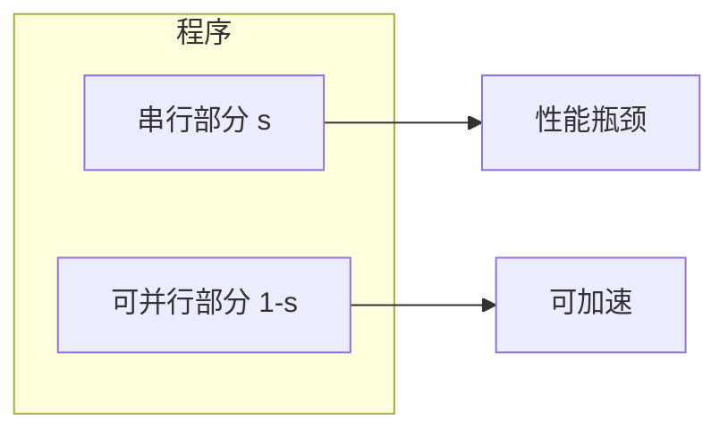
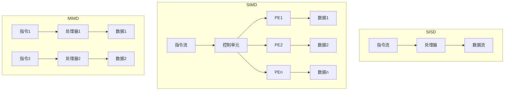
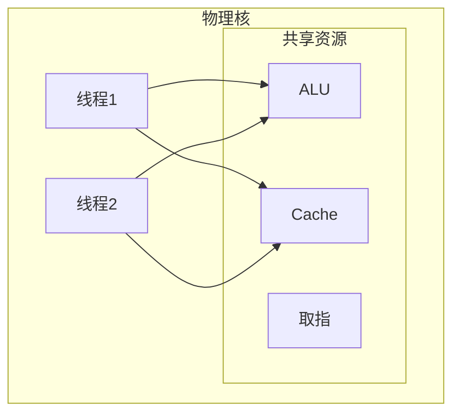
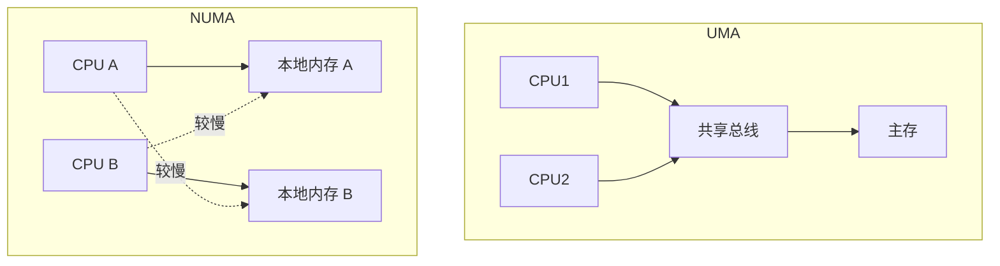
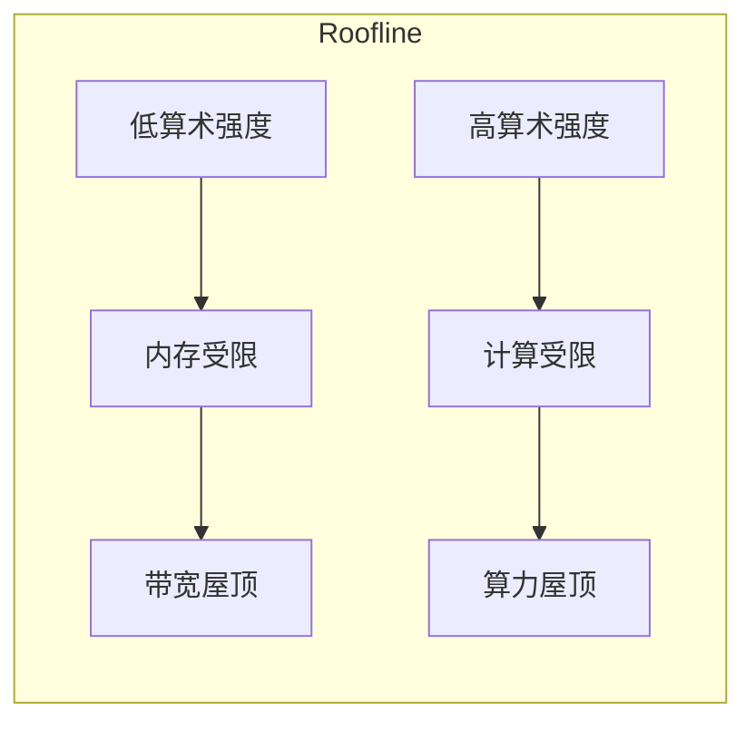

# 第6章 并行处理器：从客户端到云

> **Computer Organization and Design: The Hardware/Software Interface, RISC-V Edition**
>
> Chapter 6: Parallel Processors from Client to Cloud
>
> David A. Patterson, John L. Hennessy, 2018

---

本章探讨**并行计算**（parallel computing）从客户端设备到云端的各种形态。随着单核性能提升趋缓，**多核**（multicore）、**GPU**（Graphics Processing Unit）、**集群**（cluster）和**仓库级计算机**（Warehouse Scale Computer, WSC）成为提升系统性能的主要途径。理解并行架构与编程模型对现代软件开发至关重要。

---

## 6.1 引言

### 并行计算概述

**并行计算**利用多个处理单元同时执行任务，以提高吞吐量和缩短响应时间。并行性存在于多个层次：


| 层次 | 英文 | 典型技术 | 应用场景 |
|------|------|----------|----------|
| **指令级** | Instruction-Level Parallelism, ILP | 流水线、超标量、乱序执行 | 单线程程序自动加速 |
| **数据级** | Data-Level Parallelism, DLP | SIMD、向量指令、GPU | 媒体处理、科学计算 |
| **线程级** | Thread-Level Parallelism, TLP | 多核、多线程 | 多任务、并行应用 |
| **请求级** | Request-Level Parallelism, RLP | 多服务器、负载均衡 | Web 服务、云平台 |

::: info 并行 vs 并发
**并行**（parallelism）强调同时执行；**并发**（concurrency）强调逻辑上可重叠执行，不一定同时。多核可实现真正的并行，单核多线程多为并发。
:::

---

## 6.2 创建并行处理程序的困难

并行编程面临诸多挑战：**Amdahl 定律**限制加速比、**负载均衡**（load balancing）难以保证、**同步开销**（synchronization overhead）可能抵消收益。

### Amdahl 定律

**Amdahl 定律**（Amdahl's Law）指出：若程序中有比例 $s$ 的部分必须串行执行，则无论使用多少处理器，最大加速比为：

$$
\text{Speedup} \leq \frac{1}{s + (1-s)/n}
$$

其中 $n$ 为处理器数量。当 $n \to \infty$ 时，$\text{Speedup} \to 1/s$。



::: tip 启示
若 10% 的代码串行，最大加速比约为 10×；若 1% 串行，最大约 100×。提高并行度需减少串行部分。
:::

### 负载均衡

**负载均衡**要求各处理器工作量相近。若部分处理器空闲而其他过载，整体效率下降。**静态负载均衡**在程序开始前分配任务；**动态负载均衡**在运行时根据实际进度调整。

### 同步开销

**锁**（lock）、**屏障**（barrier）等同步原语引入通信与等待开销。过度同步会导致**锁竞争**（lock contention）和**假共享**（false sharing），降低并行效率。

---

## 6.3 SISD、MIMD、SIMD、SPMD 与向量

**Flynn 分类法**（Flynn's taxonomy）根据指令流与数据流数量对计算机进行分类。

### Flynn 分类法

| 类型 | 指令流 | 数据流 | 描述 | 典型例子 |
|------|--------|--------|------|----------|
| **SISD** | 单 | 单 | 传统单处理器 | 早期单核 CPU |
| **SIMD** | 单 | 多 | 一条指令操作多组数据 | SSE、AVX、GPU |
| **MISD** | 多 | 单 | 多条指令操作同一数据 | 极少见 |
| **MIMD** | 多 | 多 | 多处理器独立执行 | 多核 CPU、集群 |



### SPMD 编程模型

**SPMD**（Single Program, Multiple Data）是 MIMD 的常见编程模型：所有处理器执行同一程序，但处理不同数据。MPI、OpenMP 等均支持 SPMD。

### 向量处理器

**向量处理器**（vector processor）通过**向量寄存器**和**向量指令**一次处理多个数据元素，是 SIMD 的一种实现。典型指令如 `vadd.vv`（向量加）、`vmul.vv`（向量乘）。RISC-V 的 **V 扩展**（RVV）提供向量支持。

---

## 6.4 硬件多线程

**硬件多线程**（hardware multithreading）允许单个物理处理器在多个线程间快速切换，以隐藏**访存延迟**（memory latency）和**流水线停顿**（pipeline stall）。

### 细粒度与粗粒度多线程

| 类型 | 英文 | 切换时机 | 优点 | 缺点 |
|------|------|----------|------|------|
| **细粒度** | Fine-grained | 每周期可切换 | 隐藏短延迟 | 单线程吞吐下降 |
| **粗粒度** | Coarse-grained | 发生长延迟时切换 | 单线程性能好 | 切换开销大 |

### 同步多线程（SMT）

**同步多线程**（Simultaneous Multithreading, SMT）允许多个线程在同一周期内共享执行资源。Intel 的 **Hyper-Threading**、AMD 的 SMT 均属此类。单物理核可表现为多个**逻辑核**（logical core）。



::: info 适用场景
SMT 在**内存受限**或**分支密集**的工作负载中收益明显；在**计算密集**且**缓存友好**的程序中，单线程可能已占满资源，SMT 收益有限。
:::

---

## 6.5 多核与其他共享内存多处理器

**多核处理器**（multicore processor）将多个处理器核集成在同一芯片上，共享或部分共享**缓存**（cache）与**主存**（main memory）。

### UMA 与 NUMA

| 架构 | 英文 | 描述 | 特点 |
|------|------|------|------|
| **UMA** | Uniform Memory Access | 所有核访问主存延迟一致 | 简单，可扩展性有限 |
| **NUMA** | Non-Uniform Memory Access | 访问本地内存快于远程内存 | 可扩展至多路服务器 |



### 缓存一致性

多核共享内存时，同一数据可能存在于多个私有缓存中。**缓存一致性**（cache coherence）协议保证所有核看到一致的数据视图。常见协议包括 **MESI**、**MOESI** 等（详见第 5 章）。

### 同步原语

| 原语 | 用途 | 典型实现 |
|------|------|----------|
| **锁**（lock） | 互斥访问临界区 | `test-and-set`、`compare-and-swap` |
| **屏障**（barrier） | 等待所有线程到达 | 计数器 + 条件变量 |
| **信号量**（semaphore） | 控制资源数量 | P/V 操作 |

RISC-V 提供 **原子指令**（atomic instructions）如 `lr.w`（load reserved）、`sc.w`（store conditional）用于实现锁。

---

## 6.6 图形处理器简介

**GPU**（Graphics Processing Unit）最初为图形渲染设计，现广泛用于**通用计算**（GPGPU）。GPU 采用大量**轻量级核心**（streaming multiprocessor）和**高带宽内存**，适合**数据级并行**任务。

### CUDA 与 OpenCL

| 框架 | 厂商 | 特点 |
|------|------|------|
| **CUDA** | NVIDIA | 生态完善，性能优化好 |
| **OpenCL** | 跨平台 | 支持 NVIDIA、AMD、Intel 等 |

### GPU vs CPU

| 特性 | CPU | GPU |
|------|-----|-----|
| 核心数 | 少（数核至数十核） | 多（数百至数千） |
| 单核能力 | 强，复杂控制流 | 弱，简单控制流 |
| 缓存 | 大，复杂层次 | 小，面向吞吐 |
| 适用场景 | 通用、分支多 | 数据并行、规则计算 |

### 线程块与网格

CUDA/OpenCL 的**执行模型**：

- **线程**（thread）：最小执行单元
- **线程块**（thread block）：一组线程，可共享**共享内存**（shared memory）
- **网格**（grid）：多个线程块的集合

```mermaid
flowchart TB
    subgraph 网格
        subgraph 块0
            T0[线程0] T1[线程1] T2[线程2]
        end
        subgraph 块1
            T3[线程3] T4[线程4] T5[线程5]
        end
        subgraph 块N
            Tn[线程...]
        end
    end

    块0 --> SM1[SM1]
    块1 --> SM2[SM2]
    块N --> SMn[SMn]
```

### NVIDIA GPU 微架构

NVIDIA GPU 由多个 **SM**（Streaming Multiprocessor）组成，每个 SM 包含多个 **CUDA 核心**。**Warp** 是 32 个线程的调度单位，以 **SIMT**（Single Instruction, Multiple Thread）方式执行。

---

## 6.7 集群、仓库级计算机与其他消息传递多处理器

**集群**（cluster）由多台独立计算机通过**网络**互连而成，每台机器有独立内存，通过**消息传递**（message passing）通信。

### 仓库级计算机（WSC）

**仓库级计算机**（Warehouse Scale Computer）是超大规模数据中心，包含数万至数百万台服务器。设计重点包括：**能效**（PUE）、**可靠性**、**网络拓扑**、**软件栈**（如 MapReduce、分布式存储）。

### 消息传递（MPI）

**MPI**（Message Passing Interface）是消息传递编程的标准库。典型操作：

- `MPI_Send` / `MPI_Recv`：点对点通信
- `MPI_Bcast`：广播
- `MPI_Reduce`：归约
- `MPI_Barrier`：屏障同步

### MapReduce

**MapReduce** 是一种分布式计算模型，将任务分为 **Map**（映射）和 **Reduce**（归约）两阶段。Hadoop、Spark 等框架实现了该模型，广泛应用于大数据处理。

---

## 6.8 多处理器网络拓扑简介

多处理器或集群中，处理器/节点通过**互连网络**（interconnection network）通信。拓扑影响**延迟**、**带宽**和**可扩展性**。

### 常见拓扑

| 拓扑 | 英文 | 描述 | 优点 | 缺点 |
|------|------|------|------|------|
| **总线** | Bus | 共享介质 | 简单 | 带宽受限，可扩展性差 |
| **环** | Ring | 节点首尾相连 | 简单，延迟可预测 | 带宽受限 |
| **网格** | Mesh | 二维网格连接 | 可扩展 | 延迟随规模增长 |
| **交叉开关** | Crossbar | 任意一对一连接 | 无阻塞 | 成本高，$O(n^2)$ |
| **胖树** | Fat tree | 层次化，越靠近根带宽越大 | 高带宽，可扩展 | 成本较高 |

```mermaid
flowchart TB
    subgraph 胖树
        L0[根]
        L1a[层1a] L1b[层1b]
        L2a[节点] L2b[节点] L2c[节点] L2d[节点]

        L0 --> L1a
        L0 --> L1b
        L1a --> L2a
        L1a --> L2b
        L1b --> L2c
        L1b --> L2d
    end
```

---

## 6.9 与外界通信：集群网络

**集群网络**连接数据中心内的服务器。**10Gb 以太网**（10GbE）、**InfiniBand** 等高速网络提供低延迟、高带宽。**拓扑**（如 Clos、Fat-Tree）与**路由算法**影响整体性能。

### 网络技术选型

| 技术 | 带宽 | 延迟 | 典型用途 |
|------|------|------|----------|
| **1GbE** | 1 Gb/s | 较高 | 传统数据中心 |
| **10GbE** | 10 Gb/s | 中等 | 现代集群 |
| **InfiniBand** | 40–400 Gb/s | 极低 | HPC、AI 训练 |
| **RoCE** | 与以太网相当 | 低 | 融合以太网上的 RDMA |

---

## 6.10 多处理器基准测试与性能模型

### Roofline 模型

**Roofline 模型**（Roofline model）将性能与**算术强度**（arithmetic intensity）关联。算术强度定义为每字节内存访问可执行的浮点运算数（FLOP/byte）。

$$
\text{算术强度} = \frac{\text{浮点运算数}}{\text{访存字节数}}
$$

- **计算受限**（compute-bound）：算术强度高，性能受**峰值算力**（peak FLOPS）限制
- **内存受限**（memory-bound）：算术强度低，性能受**内存带宽**（memory bandwidth）限制



::: tip 优化方向
若程序在内存受限区，应减少访存、提高缓存命中率；若在计算受限区，应提高并行度、利用 SIMD。
:::

---

## 6.11 真实世界：Intel Core i7 与 NVIDIA Tesla GPU 基准测试

教材以 Intel Core i7 与 NVIDIA Tesla GPU 为例，对比不同工作负载下的性能。**矩阵乘法**、**卷积**等规则计算在 GPU 上可获得数量级加速；**稀疏计算**、**分支密集**程序则可能更适合 CPU。

---

## 6.12 加速：多处理器与矩阵乘法

**矩阵乘法**是典型的可并行、数据级并行任务。使用 **OpenMP** 可方便地实现多线程并行：

```c
#pragma omp parallel for
for (int i = 0; i < N; i++) {
    for (int j = 0; j < N; j++) {
        double sum = 0;
        for (int k = 0; k < N; k++) {
            sum += A[i][k] * B[k][j];
        }
        C[i][j] = sum;
    }
}
```

进一步优化包括：**分块**（tiling）提高缓存利用率、**SIMD** 向量化、**GPU 加速**等。

---

## 6.13 谬误与陷阱

| 谬误/陷阱 | 描述 |
|-----------|------|
| **Amdahl 定律被忽视** | 认为增加处理器总能线性加速，忽略串行部分限制 |
| **过度并行** | 线程数远超物理核心数可能增加调度与同步开销 |
| **忽略同步成本** | 锁竞争、假共享可能严重降低性能 |
| **GPU 万能论** | 并非所有程序都适合 GPU，数据搬运与启动开销需考虑 |
| **NUMA 忽视** | 在 NUMA 系统上未考虑数据局部性，可能造成远程访问瓶颈 |

---

## 6.14 小结

本章介绍了从客户端到云端的**并行处理器**架构与编程模型。**Amdahl 定律**揭示了并行加速的上限；**Flynn 分类法**区分了 SISD、SIMD、MIMD 等形态；**硬件多线程**与 **SMT** 提高了单核利用率；**多核**与**共享内存**需要**缓存一致性**与**同步原语**；**GPU** 通过大量轻量级核心实现高吞吐；**集群**与 **WSC** 依赖**消息传递**与**网络拓扑**；**Roofline 模型**帮助识别性能瓶颈。理解这些概念有助于选择合适的并行策略与硬件平台。

---

[← 上一章](./ch05.md) | [目录](./index.md) | [附录A →](./appendix-a.md)
