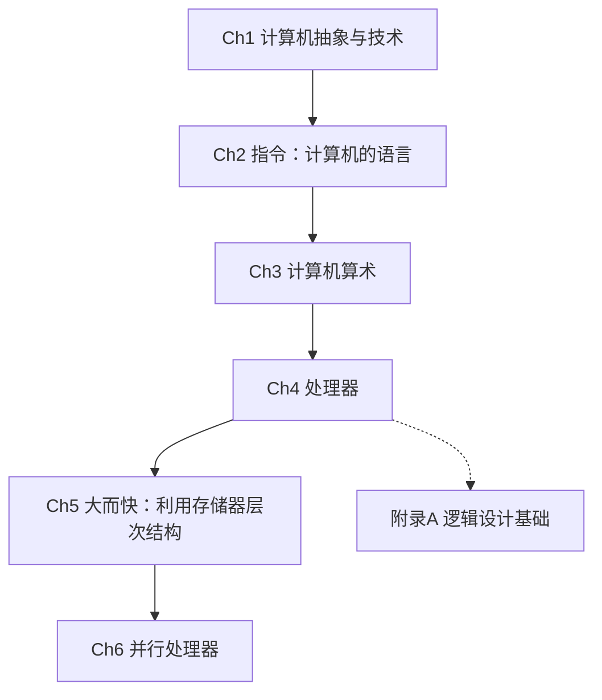

# 计算机组成与设计

> **Computer Organization and Design: The Hardware/Software Interface, RISC-V Edition**
>
> David A. Patterson, John L. Hennessy, 2018

---

## 章节路线图

---

## 目录

| # | 章节 | 链接 |
|---|------|------|
| 1 | 计算机抽象与技术 | [→ 阅读](ch01.md) |
| 2 | 指令：计算机的语言 | [→ 阅读](ch02.md) |
| 3 | 计算机算术 | [→ 阅读](ch03.md) |
| 4 | 处理器 | [→ 阅读](ch04.md) |
| 5 | 大而快：利用存储器层次结构 | [→ 阅读](ch05.md) |
| 6 | 并行处理器：从客户端到云 | [→ 阅读](ch06.md) |

### 附录

| # | 章节 | 链接 |
|---|------|------|
| A | 逻辑设计基础 | [→ 阅读](appendix-a.md) |
