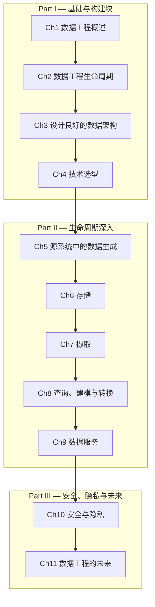

# 数据工程基础

> **Fundamentals of Data Engineering: Plan and Build Robust Data Systems**
>
> Joe Reis, Matt Housley, 2022, O'Reilly Media

---

## 章节路线图

---

## 目录

### Part I — 基础与构建块

| # | 章节 | 链接 |
|---|------|------|
| 1 | 数据工程概述 | [→ 阅读](part1/ch01.md) |
| 2 | 数据工程生命周期 | [→ 阅读](part1/ch02.md) |
| 3 | 设计良好的数据架构 | [→ 阅读](part1/ch03.md) |
| 4 | 跨生命周期的技术选型 | [→ 阅读](part1/ch04.md) |

### Part II — 数据工程生命周期深入

| # | 章节 | 链接 |
|---|------|------|
| 5 | 源系统中的数据生成 | [→ 阅读](part2/ch05.md) |
| 6 | 存储 | [→ 阅读](part2/ch06.md) |
| 7 | 摄取 | [→ 阅读](part2/ch07.md) |
| 8 | 查询、建模与转换 | [→ 阅读](part2/ch08.md) |
| 9 | 数据服务：分析、ML 与反向 ETL | [→ 阅读](part2/ch09.md) |

### Part III — 安全、隐私与未来

| # | 章节 | 链接 |
|---|------|------|
| 10 | 安全与隐私 | [→ 阅读](part3/ch10.md) |
| 11 | 数据工程的未来 | [→ 阅读](part3/ch11.md) |
