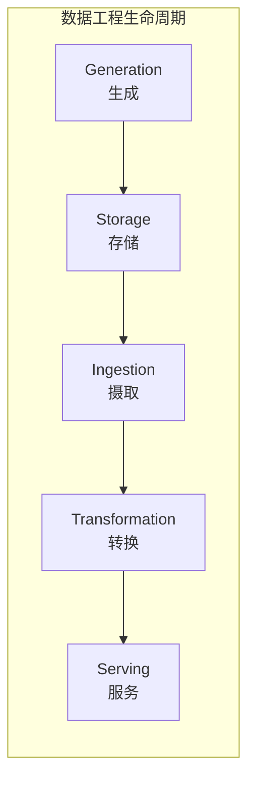
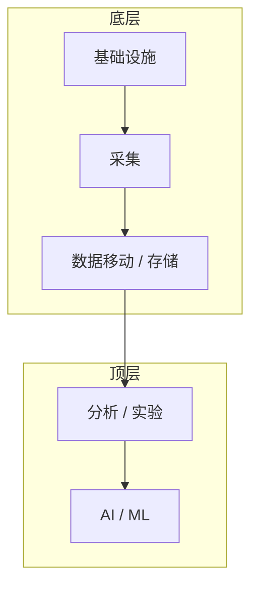

# 第1章 数据工程概述

如果你从事数据或软件工作，可能已经注意到数据工程（data engineering）正从幕后走向台前，与数据科学（data science）同台竞技。数据工程是数据和技术领域最热门的领域之一，原因很充分：它为生产环境中的数据科学和分析奠定了基础。本章探讨什么是数据工程、该领域如何诞生与演进、数据工程师的技能，以及他们与谁协作。

## 什么是数据工程？

尽管数据工程目前炙手可热，但人们对数据工程的含义以及数据工程师（data engineer）的职责仍存在大量困惑。自企业开始用数据做事情——如预测分析、描述性分析和报表——以来，数据工程就以某种形式存在，并在 2010 年代随数据科学的兴起而成为焦点。就本书而言，明确定义数据工程和数据工程师至关重要。

首先，我们来看看数据工程如何被描述，并建立本书将使用的术语。数据工程的定义数不胜数。2022 年初，在 Google 上精确搜索「what is data engineering?」会返回超过 91,000 个结果。在给出我们的定义之前，先看几位领域专家如何定义数据工程：

> 数据工程是一系列旨在创建信息流动与访问的接口和机制的操作。需要专职专家——数据工程师——来维护数据，使其对他人保持可用和可用。简而言之，数据工程师搭建并运营组织的数据基础设施，为数据分析师和科学家进一步分析做准备。
>
> — 摘自 AlexSoft《数据工程及其主要概念》

> 第一种数据工程以 SQL 为中心。工作和数据的主要存储都在关系型数据库（relational database）中。所有数据处理都用 SQL 或基于 SQL 的语言完成，有时也使用 ETL 工具。第二种数据工程以大数据（Big Data）为中心。工作和数据的主要存储都在 Hadoop、Cassandra、HBase 等大数据技术中。所有数据处理都在 MapReduce、Spark、Flink 等大数据框架中完成。虽然会用到 SQL，但主要处理用 Java、Scala、Python 等编程语言完成。
>
> — Jesse Anderson

> 相对于既有角色，数据工程领域可视为商业智能（business intelligence, BI）和数据仓库（data warehousing）的超集，并融入更多软件工程元素。该学科还整合了所谓「大数据」分布式系统的运维专业化，以及扩展 Hadoop 生态、流处理和大规模计算相关概念。
>
> — Maxime Beauchemin

> 数据工程关乎数据的移动、操纵和管理。
>
> — Lewis Gavin

如果你对数据工程感到困惑，完全可以理解。仅上述几个定义就涵盖了极其广泛的意见。

## 数据工程的定义

当我们梳理不同人对数据工程定义的共同线索时，一个明显的模式浮现：数据工程师获取数据、存储数据，并为数据科学家、分析师等人消费做准备。我们将数据工程和数据工程师定义如下：

**数据工程**是开发、实施和维护系统与流程的实践，这些系统和流程接收原始数据，产出高质量、一致的信息，以支持下游用例，如分析和机器学习（machine learning, ML）。数据工程是安全、数据管理（data management）、DataOps、数据架构（data architecture）、编排（orchestration）与软件工程的交集。数据工程师管理数据工程生命周期（data engineering lifecycle），从从源系统获取数据开始，到为分析或机器学习等用例提供数据服务结束。

## 数据工程生命周期

人们很容易过度关注技术而忽视全局。本书围绕一个核心概念——**数据工程生命周期**（图 1-1），我们相信它能让数据工程师从整体视角看待自己的角色。

::: info 图 1-1 数据工程生命周期
数据工程生命周期将讨论焦点从技术转向数据本身及其必须服务的最终目标。
:::

数据工程生命周期的阶段包括：

- **生成（Generation）**
- **存储（Storage）**
- **摄取（Ingestion）**
- **转换（Transformation）**
- **服务（Serving）**

数据工程生命周期还有**暗流（undercurrents）**的概念——贯穿整个生命周期的关键理念，包括安全、数据管理、DataOps、数据架构、编排和软件工程。我们将在第 2 章更详细地介绍数据工程生命周期及其暗流，但在此先做简要介绍，因为这对我们的数据工程定义及本章后续讨论至关重要。

在有了数据工程的工作定义和生命周期简介后，让我们回顾一下历史。

## 数据工程师的演进

> 历史不会重演，但会押韵。
>
> — 常被归因于马克·吐温的名言

理解今天和明天的数据工程，需要了解该领域如何演进。本节不是历史课，但回顾过去对理解当下和未来至关重要。一个主题反复出现：旧事物焕发新生。

### 早期：1980–2000，从数据仓库到 Web

数据工程师的诞生 arguably 可追溯到数据仓库，最早可至 1970 年代，商业数据仓库在 1980 年代成形，Bill Inmon 于 1989 年正式提出「数据仓库」一词。IBM 工程师开发了关系型数据库和结构化查询语言（Structured Query Language, SQL）后，Oracle 将这项技术普及。随着数据系统初具规模，企业需要专用工具和数据管道（data pipeline）用于报表和商业智能。为帮助人们在数据仓库中正确建模业务逻辑，Ralph Kimball 和 Inmon 分别发展出各自命名的数据建模技术与方法，至今仍被广泛使用。

数据仓库开启了可扩展分析（scalable analytics）的第一个时代，新型大规模并行处理（massively parallel processing, MPP）数据库上市，用多处理器处理海量数据，支持前所未有的数据量。BI 工程师、ETL 开发者和数据仓库工程师等角色满足了数据仓库的各类需求。数据仓库与 BI 工程是当今数据工程的前身，仍在该学科中扮演核心角色。

互联网在 1990 年代中期成为主流，催生了 AOL、Yahoo、Amazon 等一批以 Web 为先的公司。互联网泡沫带来了 Web 应用及支撑它们的后端系统——服务器、数据库和存储——的大量活动。许多基础设施昂贵、单体化且授权繁重。销售这些后端系统的厂商可能没有预见到 Web 应用将产生的数据规模。

### 2000 年代初：当代数据工程的诞生

快进到 2000 年代初，90 年代末的互联网泡沫破裂，只留下少数幸存者。其中 Yahoo、Google、Amazon 等公司成长为科技巨头。起初，这些公司仍依赖 1990 年代的传统单体关系型数据库和数据仓库，将这些系统推向极限。当这些系统不堪重负时，需要新方法来应对数据增长。新一代系统必须成本效益高、可扩展、可用且可靠。

与数据爆发同时，商品化硬件——服务器、RAM、磁盘、闪存——也变得便宜且普及。多项创新使得在大型计算集群上进行分布式计算和存储成为可能。这些创新开始去中心化并拆解传统的单体服务。「大数据」时代由此开启。

《牛津英语词典》将大数据定义为「可通过计算分析以揭示模式、趋势和关联的极大数据集，尤其涉及人类行为与互动」。另一个著名且简洁的描述是大数据的三个 V：速度（velocity）、多样性（variety）和体量（volume）。

2003 年，Google 发表了关于 Google 文件系统的论文，随后 2004 年又发表了关于 MapReduce——一种超可扩展数据处理范式——的论文。事实上，大数据在 MPP 数据仓库和实验物理项目的数据管理中早有先例，但 Google 的论文构成了数据技术及我们今天所知的数据工程文化根源的「大爆炸」。你将在第 3 章和第 8 章分别了解更多关于 MPP 系统和 MapReduce 的内容。

Google 的论文启发了 Yahoo 的工程师在 2006 年开发并开源 Apache Hadoop。Hadoop 的影响难以高估。对大规模数据问题感兴趣的软件工程师被这一新的开源技术生态的可能性吸引。随着各类规模的公司数据增长到数 TB 甚至 PB，大数据工程师时代诞生。

与此同时，Amazon 为应对自身爆炸式增长的数据需求，创建了弹性计算环境（Amazon Elastic Compute Cloud，即 EC2）、无限可扩展的存储系统（Amazon Simple Storage Service，即 S3）、高度可扩展的 NoSQL 数据库（Amazon DynamoDB）等核心数据构建块。Amazon 选择通过 Amazon Web Services（AWS）将这些服务提供给内部和外部使用，成为首个流行的公有云（public cloud）。AWS 通过虚拟化和转售大量商品化硬件，创造了超灵活的按需付费资源市场。开发者无需购买数据中心硬件，只需从 AWS 租用计算和存储。

随着 AWS 成为 Amazon 的高利润增长引擎，Google Cloud、Microsoft Azure、DigitalOcean 等公有云相继出现。公有云 arguably 是 21 世纪最重要的创新之一，彻底改变了软件和数据应用的开发与部署方式。

早期的大数据工具和公有云为当今的数据生态奠定了基础。没有这些创新，现代数据格局——以及我们今天所知的数据工程——将不复存在。

### 2000 年代和 2010 年代：大数据工程

Hadoop 生态中的开源大数据工具迅速成熟，从硅谷扩散到全球技术敏感型企业。企业首次能够使用与顶尖科技公司相同的尖端数据工具。另一场革命是从批处理计算（batch computing）向事件流（event streaming）的转变，开启了大数据「实时」时代。你将在本书中了解批处理和事件流。

工程师可以选择最新最好的技术——Hadoop、Apache Pig、Apache Hive、Dremel、Apache HBase、Apache Storm、Apache Cassandra、Apache Spark、Presto 以及众多新兴技术。传统的企业导向和基于 GUI 的数据工具突然显得过时，随着 MapReduce 的兴起，代码优先的工程成为风尚。我们（作者）亲历这一时期，感觉旧教条在大数据的祭坛上突然消亡。

2000 年代末和 2010 年代数据工具的爆发催生了大数据工程师。要有效使用这些工具和技术——即包括 Hadoop、YARN、Hadoop 分布式文件系统（HDFS）和 MapReduce 的 Hadoop 生态——大数据工程师必须精通软件开发和底层基础设施运维，但侧重点有所转移。大数据工程师通常维护大量商品化硬件集群以大规模交付数据。他们偶尔会向 Hadoop 核心代码提交 pull request，但工作重心已从核心技术开发转向数据交付。

大数据很快成为自身成功的受害者。作为流行词，大数据在 2000 年代初至 2010 年代中期广受欢迎。大数据激发了试图理解不断增长的数据量和销售大数据工具与服务的公司无休止营销的企业想象力。由于炒作过度，常见现象是企业用大数据工具解决小数据问题，有时架设 Hadoop 集群只为处理几 GB 数据。似乎人人都想参与大数据。

Dan Ariely 发推说：「大数据就像青少年性行为：人人都在谈，没人真懂怎么做，人人都以为别人在做，所以人人都声称自己在做。」

尽管「大数据」一词流行，但大数据已失去势头。发生了什么？一个词：**简化**。尽管开源大数据工具强大而复杂，但管理它们需要大量工作且需持续关注。企业往往雇用整支大数据工程师团队，每年花费数百万美元来照看这些平台。大数据工程师常将过多时间花在维护复杂工具上， arguably 在交付业务洞察和价值上的时间不足。

开源开发者、云厂商和第三方开始寻找抽象、简化并使大数据可用而无需高管理开销和集群管理成本的方法，也无需安装、配置和升级开源代码。如今，「大数据」一词 essentially 已成为描述特定时期和处理大量数据方法的遗迹。今天，数据移动比以往更快、规模更大，但大数据处理已变得如此易用，以至于不再需要单独术语；每家公司都致力于解决其数据问题，无论实际数据规模如何。大数据工程师现在就是数据工程师。

### 2020 年代：面向数据生命周期的工程

在本书写作时，数据工程师角色正在快速演进。我们预计这种演进在可预见的未来将继续快速进行。历史上，数据工程师倾向于 Hadoop、Spark 或 Informatica 等单体框架的底层细节，而趋势正转向去中心化、模块化、托管和高度抽象的工具。

数据工具以惊人速度激增。2020 年代初的流行趋势包括**现代数据栈（modern data stack）**，代表一系列现成的开源和第三方产品组合，旨在让分析师的工作更轻松。与此同时，数据源和数据格式在种类和规模上都在增长。数据工程日益成为互操作学科，像乐高积木一样连接各种技术，以服务最终业务目标。

本书讨论的数据工程师可以更精确地描述为**数据生命周期工程师（data lifecycle engineer）**。随着抽象和简化的提升，数据生命周期工程师不再被昨日大数据框架的繁琐细节所束缚。虽然数据工程师仍保持底层数据编程技能并在需要时使用，但他们越来越多地将角色聚焦于价值链更高处：安全、数据管理、DataOps、数据架构、编排和整体数据生命周期管理。

随着工具和工作流简化，我们注意到数据工程师态度的明显转变。他们不再关注谁拥有「最大的数据」，开源项目和服务越来越关注数据的管理与治理、易用性与可发现性以及质量提升。数据工程师现在熟悉 CCPA 和 GDPR 等缩写；在构建管道时，他们关注隐私、匿名化、数据垃圾回收和法规合规。

旧事物焕发新生。虽然数据管理（包括数据质量和治理）等「企业级」内容在 pre-big-data 时代对大型企业很常见，但在小公司中并未广泛采用。如今，昨日数据系统的许多难题已被解决、产品化并打包，技术专家和创业者已将焦点转回「企业级」内容，但强调去中心化和敏捷，与传统企业的命令与控制方式形成对比。

我们将当下视为数据生命周期管理的黄金时代。管理数据工程生命周期的数据工程师拥有比以往更好的工具和技术。我们将在下一章更详细地讨论数据工程生命周期及其暗流。

## 数据工程与数据科学

数据工程与数据科学的关系如何？存在争议，有人认为数据工程是数据科学的子学科。我们认为数据工程与数据科学和分析是独立的。它们互补，但截然不同。数据工程位于数据科学的上游（图 1-4），即数据工程师提供数据科学家（位于数据工程下游）使用的输入，数据科学家将这些输入转化为有用产出。

考虑**数据科学需求层次（Data Science Hierarchy of Needs）**（图 1-5）。2017 年，Monica Rogati 在一篇文章中发表该层次，展示 AI 和机器学习相对于数据移动/存储、采集和基础设施等更「 mundane」领域的位置。

尽管许多数据科学家渴望构建和调优 ML 模型，但现实是估计 70%–80% 的时间花在层次底部三个部分——收集数据、清洗数据、处理数据——只有很少时间用于分析和 ML。Rogati 认为，企业在涉足 AI 和 ML 之前，需要先建立坚实的数据基础（层次底部三层）。

数据科学家通常未受过生产级数据系统工程训练，因缺乏数据工程师的支持和资源而草率完成这些工作。在理想情况下，数据科学家应将超过 90% 的时间用于金字塔顶层：分析、实验和 ML。当数据工程师专注于层次底部时，他们为数据科学家的成功奠定了坚实基础。

数据科学驱动高级分析和 ML，数据工程横跨获取数据与从数据获取价值之间的鸿沟（图 1-6）。我们认为数据工程与数据科学同等重要、同等可见，数据工程师在使数据科学在生产中成功方面扮演关键角色。

## 数据工程技能与活动

数据工程师的技能集涵盖数据工程的「暗流」：安全、数据管理、DataOps、数据架构和软件工程。该技能集要求理解如何评估数据工具以及它们如何在整个数据工程生命周期中协同工作。了解数据如何在源系统中产生、分析师和数据科学家在数据处理和整理后如何消费和创造价值，同样至关重要。最后，数据工程师要 juggle 许多复杂的移动部件，必须在成本、敏捷性、可扩展性、简洁性、复用性和互操作性等维度上持续优化。

如前所述，在不久以前，数据工程师被期望掌握少量强大单体技术（Hadoop、Spark、Teradata、Hive 等）的使用。有效使用这些技术通常需要深入理解软件工程、网络、分布式计算、存储或其他底层细节。他们的工作 devoted 于集群管理和维护、管理开销、编写管道和转换任务等。

如今，数据工具格局的管理和部署 dramatically 简化。现代数据工具显著抽象和简化了工作流。因此，数据工程师现在专注于平衡最简单、最具成本效益、最佳品种的服务，以向业务交付价值。数据工程师还被期望创建能随新趋势演进的敏捷数据架构。

数据工程师通常**不做**什么？数据工程师通常不直接构建 ML 模型、创建报表或仪表板、执行数据分析、构建关键绩效指标（KPI）或开发软件应用。但数据工程师应对这些领域有良好的理解，以便最好地服务利益相关者。

## 数据成熟度与数据工程师

公司内部数据工程的复杂程度很大程度上取决于公司的**数据成熟度（data maturity）**。这显著影响数据工程师的日常职责和职业发展。数据成熟度究竟是什么？

**数据成熟度**是组织在数据利用、能力和整合方面向更高水平推进的过程，但数据成熟度并不简单取决于公司的年龄或收入。早期创业公司的数据成熟度可能高于百年老店、年收入数十亿的公司。重要的是数据如何被用作竞争优势。

数据成熟度模型有多种版本，如数据管理成熟度（Data Management Maturity, DMM）等，很难找到一个既简单又对数据工程有用的。因此，我们创建自己的简化数据成熟度模型。我们的模型有三个阶段：**从数据起步（starting with data）**、**用数据扩展（scaling with data）** 和 **以数据领先（leading with data）**。

### 阶段 1：从数据起步

处于数据起步阶段的公司在定义上处于数据成熟度的最早阶段。公司可能有模糊、 loosely 定义的目标或没有目标。数据架构和基础设施处于规划和开发的早期阶段。采用和利用可能很低或不存在。数据团队规模小，通常为个位数。在此阶段，数据工程师通常是通才，通常还扮演数据科学家或软件工程师等其他角色。数据工程师的目标是快速行动、获得牵引并创造价值。

从数据获取价值的实践通常 poorly 理解，但愿望存在。报表或分析缺乏正式结构，大多数数据请求是 ad hoc。虽然在此阶段 tempting 直接跳入 ML，我们不推荐。我们见过无数数据团队在未建立坚实数据基础就尝试 ML 时陷入困境、功亏一篑。

这不是说在此阶段无法从 ML 获得成果——罕见但可能。没有坚实的数据基础，你可能既没有可靠 ML 模型训练所需的数据，也没有以可扩展、可重复方式将这些模型部署到生产环境的手段。

在从数据起步的组织中，数据工程师应关注：

- 获得关键利益相关者（包括高管）的支持。理想情况下，数据工程师应有赞助人，以设计和构建支持公司目标的数据架构
- 定义正确的数据架构（通常 solo，因为可能没有数据架构师）。这意味着确定业务目标和希望通过数据计划实现的竞争优势，并朝着支持这些目标的数据架构努力
- 识别和审计将支持关键计划的数据，并在你设计的数据架构内运作
- 为未来的数据分析师和数据科学家建立坚实的数据基础，以生成提供竞争优势的报表和模型。与此同时，你可能还需要在团队到位前自己生成这些报表和模型

这是充满陷阱的微妙阶段。一些建议：

- 如果数据方面没有大量可见成功，组织意志可能减弱。快速获胜将确立数据在组织中的重要性。但请记住，快速获胜可能产生技术债。要有减少债务的计划，否则会为未来交付增加摩擦
- 走出去与人交流，避免在孤岛中工作。我们常看到数据团队在泡沫中工作，不与部门外的人沟通，也不从业务利益相关者那里获取视角和反馈。危险在于你会花大量时间做对他人用处不大的事情
- 避免无差异的重活。不要用不必要的技术复杂度束缚自己。尽可能使用现成的开箱即用解决方案
- 仅在创造竞争优势时构建定制解决方案和代码

### 阶段 2：用数据扩展

此时，公司已摆脱 ad hoc 数据请求，拥有正式的数据实践。现在的挑战是创建可扩展的数据架构，并规划公司真正数据驱动的未来。数据工程角色从通才转向专家，人们专注于数据工程生命周期的特定方面。

在处于数据成熟度阶段 2 的组织中，数据工程师的目标是：

- 建立正式的数据实践
- 创建可扩展且稳健的数据架构
- 采用 DevOps 和 DataOps 实践
- 构建支持 ML 的系统
- 继续避免无差异的重活，仅在产生竞争优势时定制

我们将在本书后面回到这些目标。

需要注意的问题包括：

- 随着数据能力提升，存在基于硅谷公司的社会证明采用尖端技术的诱惑。这 rarely 是时间和精力的好用途。任何技术决策都应由其向客户交付的价值驱动
- 扩展的主要瓶颈不是集群节点、存储或技术，而是数据工程团队。专注于易于部署和管理的解决方案，以扩大团队吞吐量
- 你会 tempted 将自己定位为技术专家、能交付神奇产品的数据天才。相反，将焦点转向务实领导，开始向下一成熟阶段过渡；与其他团队沟通数据的实际效用。教组织如何消费和利用数据

### 阶段 3：以数据领先

在此阶段，公司是数据驱动的。数据工程师创建的自动化管道和系统使公司内部人员能够进行自助分析和 ML。引入新数据源无缝，并产生 tangible 价值。数据工程师实施适当的控制与实践，确保数据始终对人员和系统可用。数据工程角色比阶段 2 更加专业化。

在处于数据成熟度阶段 3 的组织中，数据工程师将继续在先前阶段基础上建设，并：

- 为新数据无缝引入和使用创建自动化
- 专注于构建将数据作为竞争优势的定制工具和系统
- 专注于数据的「企业级」方面，如数据管理（包括数据治理和质量）和 DataOps
- 部署在整个组织中暴露和传播数据的工具，包括数据目录、数据血缘工具和元数据管理系统
- 与软件工程师、ML 工程师、分析师等高效协作
- 创建人们可以协作和畅所欲言的社区与环境，无论其角色或职位

需要注意的问题包括：

- 在此阶段，自满是重大危险。一旦组织达到阶段 3，必须持续关注维护和改进，否则有回落到更低阶段的风险
- 技术干扰在此阶段比其他阶段更危险。存在追求不向业务交付价值的昂贵爱好项目的诱惑。仅在提供竞争优势时使用定制技术

## 数据工程师的背景与技能

数据工程是快速增长的领域，关于如何成为数据工程师仍有许多问题。由于数据工程是相对较新的学科，进入该领域的正式培训很少。大学没有标准的数据工程路径。虽然有一些数据工程训练营和在线教程涵盖随机主题，但该学科的共同课程尚不存在。

进入数据工程的人来自不同的教育、职业和技能背景。进入该领域的每个人都应预期在自学上投入大量时间。阅读本书是一个好的起点；本书的主要目标之一是为你提供我们认为是作为数据工程师成功所需的知识和技能基础。

如果你正在将职业转向数据工程，我们发现从相邻领域——如软件工程、ETL 开发、数据库管理、数据科学或数据分析——转型最容易。这些学科往往是「数据感知」的，为组织中的数据角色提供良好背景。它们还 equip 人们解决数据工程问题所需的相关技术技能和背景。

尽管缺乏正式路径，但我们认为数据工程师要成功应掌握的知识体系是存在的。根据定义，数据工程师必须同时理解数据和技术。在数据方面，这涉及了解数据管理方面的各种最佳实践。在技术方面，数据工程师必须了解工具的各种选项、它们的相互作用和权衡。这需要深入理解软件工程、DataOps 和数据架构。

放大来看，数据工程师还必须理解数据消费者（数据分析师和数据科学家）的需求以及数据在整个组织中的更广泛影响。数据工程是整体实践；最优秀的数据工程师从业务和技术双重视角看待自己的职责。

### 业务职责

本节列出的宏观职责并非数据工程师专属，但对任何从事数据或技术工作的人都至关重要。由于简单 Google 搜索就能找到大量学习这些领域的资源，我们仅简要列出：

- **懂得与非技术人员和技术人员沟通**。沟通是关键，你需要能够与组织内的人建立融洽和信任。我们建议密切关注组织层级、汇报关系、人们如何互动以及存在哪些孤岛。这些观察对你的成功将 invaluable
- **理解如何确定范围并收集业务和产品需求**。你需要知道要构建什么，并确保利益相关者同意你的评估。此外，培养对数据和技术决策如何影响业务的敏感度
- **理解 Agile、DevOps 和 DataOps 的文化基础**。许多技术专家错误地认为这些实践通过技术解决。我们认为这 dangerously 错误。Agile、DevOps 和 DataOps 本质上是文化的，需要组织范围内的支持
- **控制成本**。当你能在提供超额价值的同时保持低成本时，你就会成功。懂得优化价值实现时间、总拥有成本（TCO）和机会成本。学会监控成本以避免意外
- **持续学习**。数据领域感觉在以光速变化。在其中成功的人善于在深化基础知识的同时学习新事物。他们还善于过滤，判断哪些新发展与工作最相关、哪些仍不成熟、哪些只是时尚。保持对领域的了解，学会如何学习

成功的数据工程师总是放大以理解全局以及如何为业务实现超额价值。沟通对技术人员和非技术人员都至关重要。我们常看到数据团队的成功基于与其他利益相关者的沟通；成功或失败 rarely 是技术问题。懂得在组织中 navigate、确定范围和收集需求、控制成本和持续学习，将使你区别于仅靠技术能力推动职业的数据工程师。

### 技术职责

你必须理解如何在高层次上构建优化性能和成本的架构，使用预打包或自研组件。归根结底，架构和组成技术是服务数据工程生命周期的构建块。回顾数据工程生命周期的阶段：

- 生成
- 存储
- 摄取
- 转换
- 服务

数据工程生命周期的暗流包括：

- 安全
- 数据管理
- DataOps
- 数据架构
- 编排
- 软件工程

人们常问：数据工程师需要会编程吗？简短回答：**是的**。数据工程师应具备生产级软件工程能力。我们注意到，数据工程师承担的软件开发项目性质在过去几年发生了根本变化。全托管服务现在取代了以前期望工程师完成的大量底层编程工作，工程师现在使用托管开源和简单的即插即用软件即服务（SaaS）产品。例如，数据工程师现在专注于高层次抽象或在编排框架内以代码形式编写管道。

即使在更抽象的世界中，软件工程最佳实践仍提供竞争优势，能在代码库的深层架构细节中 dive 的数据工程师在出现特定技术需求时能为公司带来优势。简而言之，不会编写生产级代码的数据工程师将 severely 受阻，我们预计短期内不会改变。数据工程师仍然是软件工程师，此外还扮演许多其他角色。

数据工程师应掌握哪些语言？我们将数据工程编程语言分为主要和次要类别。在本书写作时，数据工程的主要语言是 SQL、Python、JVM 语言（通常为 Java 或 Scala）和 bash：

- **SQL**：数据库和数据湖最常用的接口。在因大数据处理需要编写自定义 MapReduce 代码而 briefly 被边缘化后，SQL（以各种形式）重新成为数据的通用语言
- **Python**：数据工程与数据科学之间的桥梁语言。越来越多的数据工程工具用 Python 编写或提供 Python API。它被称为「万事第二好的语言」。Python 支撑 pandas、NumPy、Airflow、scikit-learn、TensorFlow、PyTorch 和 PySpark 等流行数据工具。Python 是底层组件之间的粘合剂，常作为与框架交互的一等 API 语言
- **JVM 语言（如 Java 和 Scala）**：在 Spark、Hive、Druid 等 Apache 开源项目中普遍使用。JVM 通常比 Python 性能更好，可能提供比 Python API 更底层的特性（例如 Apache Spark 和 Beam 就是如此）。如果你使用流行的开源数据框架，掌握 Java 或 Scala 将有益
- **bash**：Linux 操作系统的命令行接口。掌握 bash 命令并熟练使用 CLI 将在需要编写脚本或执行操作系统操作时显著提高生产力和工作流。即使在今天，数据工程师仍经常使用 awk 或 sed 等命令行工具在数据管道中处理文件，或从编排框架调用 bash 命令。如果你使用 Windows，可以改用 PowerShell

**SQL 的不合理有效性**：MapReduce 和大数据时代的到来将 SQL  relegated 为过时。此后，各种发展 dramatically 增强了 SQL 在数据工程生命周期中的效用。Spark SQL、Google BigQuery、Snowflake、Hive 等众多数据工具可通过声明式、集合论的 SQL 语义处理海量数据。SQL 也得到 Apache Flink、Beam、Kafka 等许多流框架的支持。我们认为称职的数据工程师应高度精通 SQL。

我们是在说 SQL 是万能语言吗？完全不是。SQL 是能快速解决复杂分析和数据转换问题的强大工具。鉴于时间是数据工程团队吞吐量的主要约束，工程师应 embrace 兼具简洁和高生产力的工具。数据工程师还应善于将 SQL 与其他操作组合，无论是在 Spark 和 Flink 等框架内，还是通过编排组合多种工具。数据工程师还应学习处理 JSON 解析和嵌套数据的现代 SQL 语义，并考虑利用 dbt（Data Build Tool）等 SQL 管理框架。

精通的数据工程师还能识别何时 SQL 不是合适的工具，并能选择并用合适的替代方案编码。SQL 专家或许能写查询在自然语言处理（NLP）管道中对原始文本进行词干提取和分词，但也会认识到用原生 Spark 编码是远比这种自虐式练习更优的选择。

数据工程师可能还需要在次要编程语言上发展熟练度，包括 R、JavaScript、Go、Rust、C/C++、C# 和 Julia。当这些语言在公司中流行或与领域特定数据工具一起使用时，用它们开发往往是必要的。例如，JavaScript 作为云数据仓库中用户定义函数的语言已证明流行。同时，在利用 Azure 和微软生态的公司中，C# 和 PowerShell 必不可少。

### 在快速变化的领域中保持步伐

> 一旦新技术碾压你，如果你不是压路机的一部分，你就是路面的一部分。
>
> — Stewart Brand

在数据工程这样快速变化的领域中如何保持技能敏锐？应该关注最新工具还是深入基础？我们的建议：**关注基础以理解什么不会变**；**关注持续发展以了解领域走向**。新范式和实践不断引入，你有责任保持与时俱进。努力理解新技术在生命周期中的用处。

## 数据工程角色的连续体：从 A 到 B

尽管职位描述将数据工程师描绘为必须拥有所有可想象数据技能的「独角兽」，但数据工程师并非都做相同类型的工作或拥有相同技能集。数据成熟度是理解公司随着数据能力增长将面临的数据挑战类型的有用指南。区分数据工程师所做工作的类型很有帮助。虽然这些区分过于简化，但它们澄清了数据科学家和数据工程师的职责，避免将任一角色归入独角兽桶。

在数据科学中，有 A 型和 B 型数据科学家的概念。A 型数据科学家——A 代表分析（analysis）——专注于理解和从数据中得出洞察。B 型数据科学家——B 代表构建（building）——与 A 型有相似背景，但具备强编程能力。B 型数据科学家构建使数据科学在生产中工作的系统。

借鉴这一数据科学家连续体，我们为两种类型的数据工程师创建类似区分：

- **A 型数据工程师**：A 代表抽象（abstraction）。这类数据工程师避免无差异的重活，尽可能保持数据架构抽象和简单，不重复造轮子。A 型数据工程师主要通过完全现成的产品、托管服务和工具管理数据工程生命周期。A 型数据工程师在各行业和各级数据成熟度的公司工作
- **B 型数据工程师**：B 代表构建（build）。B 型数据工程师构建可扩展并利用公司核心能力和竞争优势的数据工具和系统。在数据成熟度范围内，B 型数据工程师更常见于处于阶段 2 和 3（用数据扩展和以数据领先）的公司，或当初始数据用例如此独特和关键以至于需要定制数据工具才能起步时

A 型和 B 型数据工程师可能在同一公司工作，甚至可能是同一个人！更常见的是，先雇用 A 型数据工程师奠定基础，随着公司需求出现，再学习或雇用 B 型数据工程师技能集。

## 组织内的数据工程师

数据工程师不是在真空中工作。根据工作内容，他们会与技术性和非技术性人员互动，面向不同方向（内部和外部）。让我们探讨数据工程师在组织内做什么以及与谁互动。

### 面向内部与面向外部的数据工程师

数据工程师服务多个最终用户，面向许多内部和外部方向。由于并非所有数据工程工作负载和职责都相同，理解数据工程师服务谁至关重要。根据最终用例，数据工程师的主要职责可能是面向外部、面向内部或两者兼有。

**面向外部的数据工程师**通常与面向外部应用（如社交媒体应用、物联网（IoT）设备和电商平台）的用户对齐。这类数据工程师架构、构建和管理收集、存储和处理这些应用产生的交易和事件数据的系统。这些系统具有从应用到数据管道再回到应用的反馈循环。

面向外部的数据工程带来独特问题。面向外部的查询引擎通常处理比面向内部系统大得多的并发负载。工程师还需要考虑对用户可运行的查询施加严格限制，以限制任何单用户对基础设施的影响。此外，对于外部查询，安全是更复杂和敏感的问题，尤其是当被查询的数据是多租户（multitenant）（来自许多客户并存储在同一表中的数据）时。

**面向内部的数据工程师**通常专注于对业务和内部利益相关者需求至关重要的活动。例如，为 BI 仪表板、报表、业务流程、数据科学和 ML 模型创建和维护数据管道和数据仓库。

面向外部和面向内部的职责 often 混合。实践中，面向内部的数据通常是面向外部数据的先决条件。数据工程师有两组用户，他们对查询并发、安全等有非常不同的要求。

### 数据工程师与其他技术角色

实践中，数据工程生命周期跨越许多职责域。数据工程师处于各种角色的交汇点，直接或通过经理与许多组织单位互动。

数据工程师是软件工程师、数据架构师、DevOps 或站点可靠性工程师（SRE）等数据生产者与数据分析师、数据科学家、ML 工程师等数据消费者之间的枢纽。此外，数据工程师会与 DevOps 工程师等运营角色互动。鉴于新数据角色不断流行（分析工程师和 ML 工程师浮现在脑海），这绝非详尽列表。

**上游利益相关者**：要成为成功的数据工程师，你需要理解正在使用或设计的数据架构以及产生所需数据的源系统。

- **数据架构师**：数据架构师在比数据工程师高一层抽象级别运作。他们设计组织数据管理的蓝图，规划流程和整体数据架构与系统。他们还充当组织技术与非技术方面的桥梁。成功的数据架构师通常有丰富工程经验的「战斗伤疤」，能指导和协助工程师，同时成功向非技术业务利益相关者传达工程挑战。数据架构师实施跨孤岛和业务单元管理数据的政策，引导数据管理和数据治理等全局策略，指导重大计划。数据架构师常在云迁移和绿地云设计中扮演核心角色。云的出现改变了数据架构与数据工程之间的边界。云数据架构比本地系统更流动，因此传统上涉及大量研究、长交付周期、采购合同和硬件安装的架构决策，现在往往在实施过程中做出，只是更大战略中的一步。尽管如此，数据架构师仍将是企业中有影响力的远见者，与数据工程师携手确定架构实践和数据战略的全局。根据公司的数据成熟度和规模，数据工程师可能与数据架构师重叠或承担其职责。因此，数据工程师应深入理解架构最佳实践和方法。注意我们将数据架构师放在上游利益相关者部分。数据架构师常帮助设计作为数据工程师源系统的应用数据层。架构师也可能在数据工程生命周期的其他阶段与数据工程师互动
- **软件工程师**：软件工程师构建运行业务的软件和系统；他们 largely 负责生成数据工程师将消费和处理的内在数据。软件工程师构建的系统通常产生应用事件数据和日志，这些本身就是重要资产。这与从 SaaS 平台或合作伙伴企业拉取的外部数据形成对比。在运行良好的技术组织中，软件工程师和数据工程师从新项目 inception 就协调，设计供分析和 ML 应用消费的应用数据。数据工程师应与软件工程师合作，理解产生数据的应用、生成数据的体量、频率和格式，以及将影响数据工程生命周期的其他因素，如数据安全和法规合规。例如，这可能意味着设定上游期望，明确数据软件工程师完成工作所需的内容。数据工程师必须与软件工程师紧密合作
- **DevOps 工程师和站点可靠性工程师**：DevOps 和 SRE 通常通过运营监控产生数据。我们将他们归类为数据工程师的上游，但他们也可能是下游，通过仪表板消费数据或直接与数据工程师协调数据系统运营

**下游利益相关者**：数据工程的存在是为了服务下游数据消费者和用例。

- **数据科学家**：数据科学家构建前瞻性模型以进行预测和推荐。这些模型然后在实时数据上评估，以各种方式提供价值。例如，模型评分可能决定对实时条件的自动化响应、根据客户当前会话的浏览历史推荐产品，或做出交易员使用的实时经济预测。根据行业常见说法，数据科学家 70%–80% 的时间花在收集、清洗和准备数据上。根据我们的经验，这些数字 often 反映不成熟的数据科学和数据工程实践。特别是，许多流行的数据科学框架如果不适当扩展可能成为瓶颈。仅在单工作站上工作的数据科学家迫使自己下采样数据，使数据准备 significantly 更复杂，可能损害所产模型的质量。此外，本地开发的代码和环境 often 难以部署到生产环境，缺乏自动化 significantly 阻碍数据科学工作流。如果数据工程师做好工作并成功协作，数据科学家在初始探索工作后不应将时间花在收集、清洗和准备数据上。数据工程师应尽可能自动化这些工作。对生产就绪数据科学的需求是数据工程职业兴起的重要驱动力。数据工程师应帮助数据科学家实现生产路径。事实上，我们（作者）在认识到这一根本需求后从数据科学转向数据工程。数据工程师致力于提供使数据科学更高效的数据自动化和规模
- **数据分析师**：数据分析师（或业务分析师）寻求理解业务绩效和趋势。数据科学家是前瞻性的，数据分析师通常关注过去或现在。数据分析师通常在数据仓库或数据湖中运行 SQL 查询。他们也可能使用电子表格进行计算和分析，以及 Microsoft Power BI、Looker 或 Tableau 等各种 BI 工具。数据分析师是他们经常使用的数据领域的专家，对数据定义、特征和质量问题非常熟悉。数据分析师的典型下游客户是业务用户、管理层和高管。数据工程师与数据分析师合作，为业务所需的新数据源构建管道。数据分析师的主题专业知识对提高数据质量 invaluable，他们 frequently 以此身份与数据工程师协作
- **机器学习工程师和 AI 研究员**：机器学习工程师（ML 工程师）与数据工程师和数据科学家有重叠。ML 工程师开发先进 ML 技术、训练模型、设计并维护在规模化生产环境中运行 ML 流程的基础设施。ML 工程师通常对 PyTorch 或 TensorFlow 等 ML 和深度学习技术与框架有深入的工作知识。ML 工程师还理解运行这些框架所需的硬件、服务和系统，无论是模型训练还是生产规模的模型部署。ML 流程常见于云环境中运行，ML 工程师可以按需启动和扩展基础设施资源或依赖托管服务。如前所述，ML 工程、数据工程和数据科学之间的边界模糊。数据工程师可能对 ML 系统负有一些运营职责，数据科学家可能与 ML 工程在设计先进 ML 流程方面紧密合作。ML 工程世界正在滚雪球般增长，与数据工程中发生的许多发展并行。几年前，ML 的注意力集中在如何构建模型，ML 工程现在 increasingly 强调纳入机器学习运维（MLOps）的最佳实践以及软件工程和 DevOps 中先前采用的其他成熟实践。AI 研究员致力于新的先进 ML 技术。AI 研究员可能在大型科技公司、专业知识产权创业公司（OpenAI、DeepMind）或学术机构工作。一些从业者在公司内结合 ML 工程职责进行兼职研究。在专业 ML 实验室工作的人 often 100% 专注于研究。研究问题可能针对即时实际应用或更抽象的 AI 演示。DALL-E、Gato AI、AlphaGo 和 GPT-3/GPT-4 是 ML 研究项目的 great 例子。鉴于 ML 的进步速度，这些例子很可能在几年内显得 quaint。我们在第 32 页的「延伸资源」中提供了一些参考。在资金充足的组织中，AI 研究员高度专业化，有工程师支持团队促进其工作。学术界的 ML 工程师通常资源较少，但依赖研究生、博士后和大学员工的团队提供工程支持。部分专注于研究的 ML 工程师 often 依赖相同的支持团队进行研究和生产

## 数据工程师与业务领导层

我们讨论了数据工程师互动的技术角色。但数据工程师也在更广泛的范围内作为组织连接器运作，often 以非技术能力。企业 increasingly 将数据依赖为许多产品的核心部分或产品本身。数据工程师现在参与战略规划并领导超越 IT 边界的关键计划。数据工程师 often 通过充当业务与数据科学/分析之间的粘合剂来支持数据架构师。

### C 级高管与数据

C 级高管 increasingly 参与数据和分析，因为这些被认可为现代企业的重要资产。例如，CEO 现在关注曾专属 IT 的计划，如云迁移或新客户数据平台部署。

- **首席执行官（CEO）**：非科技公司的 CEO 通常不关注数据框架和软件的细节。相反，他们与技术 C 级角色和公司数据领导合作定义愿景。数据工程师提供数据可能性的窗口。数据工程师及其经理维护组织可用数据的图谱——包括内部和第三方——以及时间框架。他们还负责与其他工程角色合作研究主要数据架构变更。例如，数据工程师 often 深度参与云迁移、向新数据系统迁移或流技术部署
- **首席信息官（CIO）**：CIO 是组织内负责信息技术的资深 C 级高管；这是面向内部的角色。CIO 必须对信息技术和业务流程有深入知识——仅其一不足。CIO 指导信息技术组织，制定持续政策，同时在 CEO 指导下定义和执行重大计划。在数据文化发达的组织中，CIO often 与数据工程领导合作。如果组织数据成熟度不高，CIO 通常帮助塑造其数据文化。CIO 将与工程师和架构师合作规划重大计划，并就采用企业资源规划（ERP）、客户关系管理（CRM）系统、云迁移、数据系统和面向内部的 IT 等主要架构元素做出战略决策
- **首席技术官（CTO）**：CTO 与 CIO 类似但面向外部。CTO 拥有面向外部应用（如移动、Web 应用和 IoT）的关键技术战略和架构——这些都是数据工程师的关键数据源。CTO 可能是熟练的技术专家，对软件工程基础和系统架构有良好把握。在一些没有 CIO 的组织中，CTO 或有时首席运营官（COO）扮演 CIO 角色。数据工程师 often 直接或间接向 CTO 汇报
- **首席数据官（CDO）**：CDO 于 2002 年在 Capital One 创建，以认可数据作为业务资产日益增长的重要性。CDO 负责公司的数据资产和战略。CDO 专注于数据的业务效用，但应有扎实的技术基础。CDO 监督数据产品、战略、计划和主数据管理、隐私等核心职能。偶尔，CDO 管理业务分析和数据工程
- **首席分析官（CAO）**：CAO 是 CDO 角色的变体。当两个角色都存在时，CDO 专注于交付数据所需的技术和组织，CAO 负责业务的分析、战略和决策。CAO 可能监督数据科学和 ML，但这 largely 取决于公司是否有 CDO 或 CTO 角色
- **首席算法官（CAO-2）**：CAO-2 是 C 级中的 recent 创新，是专门专注于数据科学和 ML 的高度技术角色。CAO-2 通常有数据科学或 ML 项目的个人贡献者和团队领导经验。Frequently，他们有 ML 研究背景和相关高级学位。CAO-2 被期望熟悉当前 ML 研究，并对公司 ML 计划有深入技术知识。除了创建业务计划外，他们提供技术领导、设定研发议程并组建研究团队

### 数据工程师与项目经理

数据工程师 often 从事可能跨越多年的重大计划。在本书写作时，许多数据工程师正在从事云迁移、将管道和仓库迁移到下一代数据工具。其他数据工程师正在启动绿地项目，从大量最佳品种架构和工具选项中从头组装新数据架构。

这些大型计划 often 受益于项目管理（与下文讨论的产品管理相对）。数据工程师以基础设施和服务交付能力运作，项目经理指挥交通并充当守门人。大多数项目经理按照某种 Agile 和 Scrum 变体运作，Waterfall 仍偶尔出现。业务从不停止，业务利益相关者 often 有大量待办事项和新计划要启动。项目经理必须过滤长串请求并优先处理关键交付物，以保持项目正轨并更好服务公司。

数据工程师与项目经理互动，often 为项目规划 sprint 及相关的站会。反馈是双向的，数据工程师向项目经理和其他利益相关者通报进展和阻碍，项目经理平衡技术团队的节奏与业务不断变化的需求。

### 数据工程师与产品经理

产品经理监督产品开发，often 拥有产品线。在数据工程师的语境中，这些产品称为**数据产品（data product）**。数据产品要么从头构建，要么是对现有产品的增量改进。随着企业界采用以数据为中心的焦点，数据工程师与产品经理的互动 more frequently。与项目经理一样，产品经理平衡技术团队的活动与客户和业务的需求。

### 数据工程师与其他管理角色

数据工程师与项目经理和产品经理以外的各种经理互动。然而，这些互动通常遵循服务或跨职能模式。数据工程师要么作为集中团队服务各种 incoming 请求，要么作为分配给特定经理、项目或产品的资源工作。

关于数据团队及其结构，我们推荐 John Thompson 的《Building Analytics Teams》（Packt）和 Jesse Anderson 的《Data Teams》（Apress）。两本书都提供了关于高管与数据、招聘谁以及如何为公司构建最有效数据团队的强有力框架和视角。

::: tip
公司雇用工程师不仅仅是为了孤立地写代码。要名副其实，工程师应深入理解他们要解决的问题、可用的技术工具以及他们合作和服务的人。
:::

## 小结

本章简要概述了数据工程格局，包括：

- 定义数据工程并描述数据工程师的职责
- 描述公司的数据成熟度类型
- A 型和 B 型数据工程师
- 数据工程师与谁协作

无论你是软件开发从业者、数据科学家、ML 工程师、业务利益相关者、创业者还是风险投资人，我们希望这第一章能激发你的兴趣。当然，后续章节仍有大量内容待阐述。第 2 章涵盖数据工程生命周期，第 3 章讨论架构。后续章节深入生命周期的每个部分的技术决策细节。整个数据领域处于 flux 中，尽可能的，每章都聚焦于不变之物——在 relentless 变化中多年有效的视角。

## 延伸资源

- Monica Rogati《The AI Hierarchy of Needs》
- AlphaGo 研究网页
- Lewis Gavin《Big Data Will Be Dead in Five Years》
- John K. Thompson《Building Analytics Teams》（Packt）
- Lewis Gavin《What Is Data Engineering?》第 1 章（O'Reilly）
- Justin Gage《Data as a Product vs. Data as a Service》
- James Furbush《Data Engineering: A Quick and Simple Definition》（O'Reilly）
- Jesse Anderson《Data Teams》（Apress）
- Robert Chang《Doing Data Science at Twitter》
- Maxime Beauchemin《The Downfall of the Data Engineer》
- Liam Hausmann《The Future of Data Engineering Is the Convergence of Disciplines》
- Thomas H. Davenport 和 Nitin Mittal《How CEOs Can Lead a Data-Driven Culture》
- Frederik Bussler《How Creating a Data-Driven Culture Can Drive Success》
- Information Management Body of Knowledge 网站
- Wikipedia「Information Management Body of Knowledge」页面
- Wikipedia「Information Management」页面
- Jesse Anderson《On Complexity in Big Data》（O'Reilly）
- Will Douglas Heaven《OpenAI's New Language Generator GPT-3 Is Shockingly Good—and Completely Mindless》
- Maxime Beauchemin《The Rise of the Data Engineer》
- Mark van Rijmenam《A Short History of Big Data》
- Bob Lambert《Skills of the Data Architect》
- Emilie Schario《The Three Levels of Data Analysis: A Framework for Assessing Data Organization Maturity》
- Thor Olavsrud《What Is a Data Architect? IT's Data Framework Visionary》
- Quora「Which Profession Is More Complex to Become, a Data Engineer or a Data Scientist?」讨论
- John Weathington《Why CEOs Must Lead Big Data Initiatives》

---

**导航**

| 上一篇 | 下一篇 |
|--------|--------|
| [← 目录](../index.md) | [第2章 数据工程生命周期 →](ch02.md) |
