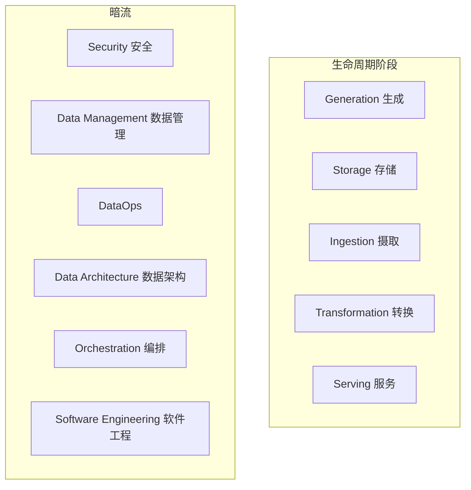

# 第2章 数据工程生命周期

本书的主要目标是鼓励你超越将数据工程视为特定数据技术集合的视角。数据格局正在经历新技术和实践的爆发，抽象层次和易用性不断提高。由于技术抽象的增加，数据工程师将日益成为数据生命周期工程师，以数据生命周期管理原则进行思考和运作。

本章介绍数据工程生命周期——本书的核心主题。数据工程生命周期是我们描述「从摇篮到坟墓」数据工程的框架。你还将了解数据工程生命周期的暗流，它们是支撑所有数据工程工作的关键基础。

## 什么是数据工程生命周期？

数据工程生命周期包含将原始数据转化为有用最终产品的阶段，供分析师、数据科学家、ML 工程师等人消费。本章介绍数据工程生命周期的主要阶段，聚焦各阶段的核心概念，细节留待后续章节。

我们将数据工程生命周期分为五个阶段（图 2-1）：

- **生成（Generation）**
- **存储（Storage）**
- **摄取（Ingestion）**
- **转换（Transformation）**
- **数据服务（Serving data）**

我们从源系统获取数据并存储开始数据工程生命周期。接下来转换数据，然后实现核心目标：向分析师、数据科学家、ML 工程师等人提供数据。实际上，存储贯穿整个生命周期，因为数据从头到尾流动——因此图中将存储「阶段」显示为支撑其他阶段的基础。

一般而言，中间阶段——存储、摄取、转换——可能有些混乱。这没关系。虽然我们划分了数据工程生命周期的不同部分，但它并不总是整洁、连续的流程。生命周期的各阶段可能重复、乱序、重叠或以有趣且意外的方式交织。

作为基石的暗流（图 2-1 底部）贯穿数据工程生命周期的多个阶段：安全、数据管理、DataOps、数据架构、编排和软件工程。没有这些暗流，数据工程生命周期的任何部分都无法充分运作。

## 数据生命周期与数据工程生命周期

你可能想知道整体数据生命周期与数据工程生命周期之间的区别。两者有微妙区别。数据工程生命周期是整个数据生命周期的子集（图 2-2）。完整数据生命周期涵盖数据整个寿命，而数据工程生命周期专注于数据工程师控制的阶段。

## 生成：源系统

**源系统（source system）**是数据工程生命周期所用数据的起源。例如，源系统可以是 IoT 设备、应用消息队列或事务数据库。数据工程师从源系统消费数据，但通常不拥有或控制源系统本身。数据工程师需要理解源系统的工作方式、数据生成方式、数据的频率和速度以及生成的数据种类。工程师还需要与源系统所有者保持沟通渠道畅通，了解可能破坏管道和分析的变更。

数据工程的主要挑战是工程师必须应对和理解的令人眼花缭乱的数据源系统阵列。作为说明，我们看两个常见源系统：一个非常传统（应用数据库），另一个较新（IoT 群）。

**评估源系统：关键工程考量**

评估源系统时需考虑许多因素，包括系统如何处理摄取、状态和数据生成。以下是数据工程师必须考虑的源系统评估问题起点：

- 数据源的基本特征是什么？是应用？IoT 设备群？
- 数据如何在源系统中持久化？长期持久化还是临时且快速删除？
- 数据生成速率如何？每秒多少事件？每小时多少 GB？
- 数据工程师对输出数据可期望的一致性水平？如果对输出数据运行数据质量检查，数据不一致（如意外空值、糟糕格式）多久发生一次？
- 错误多久发生一次？
- 数据会包含重复吗？
- 部分数据值会迟到吗，可能比其他同时产生的消息晚很多？
- 摄取数据的模式是什么？数据工程师是否需要跨多表甚至多系统 join 才能获得完整数据图景？
- 如果模式变更（如新增列），如何应对并通知下游利益相关者？
- 应从源系统多频繁拉取数据？
- 对于有状态系统（如跟踪客户账户信息的数据库），数据是以定期快照还是变更数据捕获（CDC）的更新事件提供？变更执行的逻辑是什么，源数据库中如何跟踪？
- 谁/什么是将数据传输给下游消费的数据提供者？
- 从数据源读取会影响其性能吗？
- 源系统有上游数据依赖吗？这些上游系统的特征是什么？
- 是否有数据质量检查来检查迟到或缺失的数据？

源系统产生下游系统消费的数据，包括人工生成的电子表格、IoT 传感器、Web 和移动应用。每个源有其独特的数据生成体量和节奏。数据工程师应了解源如何生成数据，包括相关 quirks 或细微差别。数据工程师还需理解所交互源系统的限制。例如，对源应用数据库的分析查询会导致资源争用和性能问题吗？

源数据最具挑战性的细微差别之一是**模式（schema）**。模式定义数据的层次组织。逻辑上，我们可以在整个源系统层面思考数据，向下钻取到单表，直至各字段结构。从源系统交付的数据模式有多种处理方式。两种流行选项是无模式（schemaless）和固定模式（fixed schema）。

## 存储

你需要存储数据的地方。选择存储解决方案是数据生命周期其余部分成功的关键，也是数据生命周期最复杂的阶段之一，原因多样。首先，云中的数据架构 often 利用多种存储解决方案。其次，很少有数据存储解决方案纯粹作为存储，许多支持复杂转换查询；甚至对象存储解决方案也可能支持强大查询能力。第三，虽然存储是数据工程生命周期的阶段，但它 frequently 触及其他阶段，如摄取、转换和服务。

**理解数据访问频率**

并非所有数据都以相同方式访问。检索模式将根据存储和查询的数据 greatly 变化。这引出数据的「温度」概念。数据访问频率将决定数据的温度。

- **热数据（hot data）**：最频繁访问的数据，通常每天多次检索，甚至每秒数次
- **温数据（lukewarm data）**：偶尔访问，如每周或每月
- **冷数据（cold data）**：很少查询，适合存储在归档系统中

## 摄取

了解数据源、所用源系统的特征以及数据如何存储后，你需要收集数据。数据工程生命周期的下一阶段是从源系统进行数据摄取。

根据我们的经验，源系统和摄取代表数据工程生命周期最显著的瓶颈。源系统通常不在你的直接控制之下，可能随机无响应或提供低质量数据。或者，你的数据摄取服务可能因多种原因神秘停止工作。因此，数据流停止或为存储、处理和服务提供不足数据。

**批处理与流式**

我们处理的几乎所有数据本质上都是**流式（streaming）**的。数据几乎总是在源处持续产生和更新。**批处理摄取（batch ingestion）**只是以大批量处理该流的专业且便捷方式——例如，在单批中处理一整天数据。

**流式摄取（streaming ingestion）**使我们能够以持续、实时方式向下游系统（无论是其他应用、数据库还是分析系统）提供数据。此处实时（或近实时）意味着数据在产生后短时间内对下游系统可用（如不到一秒后）。

**推送与拉取**

在数据摄取的**推送（push）**模型中，源系统将数据写出到目标（数据库、对象存储或文件系统）。在**拉取（pull）**模型中，从源系统检索数据。推送和拉取范式之间的界限可能相当模糊；数据在数据管道各阶段流动时 often 既被推送又被拉取。

## 转换

摄取并存储数据后，你需要对其进行处理。数据工程生命周期的下一阶段是**转换（transformation）**，即数据需要从原始形式变为对下游用例有用的形式。没有适当转换，数据将保持惰性，无法用于报表、分析或 ML。通常，转换阶段是数据开始为下游用户消费创造价值的阶段。

## 数据服务

数据服务是数据工程生命周期的最后阶段。数据已被摄取、存储并转换为连贯有用的结构后，是时候从数据获取价值了。「从数据获取价值」对不同用户意味着不同事情。

数据在用于实际目的时才有价值。未被消费或查询的数据 simply 是惰性的。数据虚荣项目是公司的重大风险。许多公司在大数据时代追求虚荣项目，在数据湖中收集从未以任何有用方式消费的海量数据集。云时代正在触发基于最新数据仓库、对象存储系统和流技术的新一波虚荣项目。

**分析（Analytics）**是大多数数据工作的核心。**商业智能（BI）**、**运营分析（operational analytics）**和**嵌入式分析（embedded analytics）**是主要类型。

**机器学习（ML）**的出现和成功是最令人兴奋的技术革命之一。**反向 ETL（reverse ETL）**将处理后的数据从数据工程生命周期的输出端反馈回源系统，使分析、评分模型等能够反馈到生产系统或 SaaS 平台。

## 数据工程生命周期的主要暗流

数据工程正在快速成熟。先前的数据工程周期 simply 关注技术层，而工具和实践的持续抽象和简化已转移了这一焦点。数据工程现在涵盖的远不止工具和技术。该领域正向上游价值链移动，纳入数据管理和成本优化等传统企业实践，以及 DataOps 等新实践。

我们将这些实践称为**暗流**——安全、数据管理、DataOps、数据架构、编排和软件工程——它们支撑数据工程生命周期的每个方面。

### 安全

安全必须是数据工程师的首要考虑，忽视它的人将自食其果。数据工程师必须理解数据和访问安全，践行**最小权限原则（principle of least privilege）**。

### 数据管理

数据管理（data management）是开发、执行和监督计划、政策、项目和实践，以在整个生命周期中交付、控制、保护和增强数据和信息资产的价值。数据治理、数据质量、主数据管理（MDM）、元数据、数据血缘等是核心组成部分。

### DataOps

DataOps 将敏捷方法论、DevOps 和统计过程控制（SPC）的最佳实践映射到数据。DataOps 有三个核心技术要素：**自动化**、**监控与可观测性**、**事件响应**。

### 编排

**编排（orchestration）**是协调许多作业按计划节奏尽可能快速高效运行的过程。Apache Airflow 等编排工具以**有向无环图（DAG）**形式管理作业依赖。Airflow 是当前主流的开源编排工具。

### 软件工程

软件工程一直是数据工程师的核心技能。核心数据处理代码、流式处理、基础设施即代码（IaC）、管道即代码（pipelines as code）是数据工程生命周期中软件工程的关键领域。

## 小结

我们将数据工程生命周期分为以下阶段：

- 生成
- 存储
- 摄取
- 转换
- 数据服务

几个主题也贯穿数据工程生命周期，即暗流：安全、数据管理、DataOps、数据架构、编排和软件工程。

数据工程师在数据生命周期中有几个顶层目标：产生最佳 ROI 并降低成本（财务和机会）、降低风险（安全、数据质量）、最大化数据价值和效用。

---

**导航**

| 上一篇 | 下一篇 |
|--------|--------|
| [← 第1章 数据工程概述](ch01.md) | [第3章 设计良好的数据架构 →](ch03.md) |
