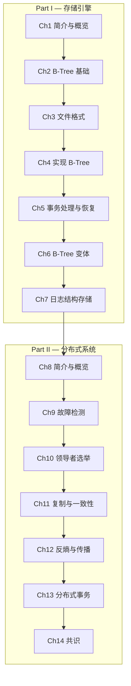

# 数据库内幕

> **Database Internals: A Deep Dive into How Distributed Data Systems Work**
>
> Alex Petrov, 2019, O'Reilly Media

---

## 章节路线图

---

## 目录

### Part I — 存储引擎

| # | 章节 | 链接 |
|---|------|------|
| 1 | 简介与概览 | [→ 阅读](part1/ch01.md) |
| 2 | B-Tree 基础 | [→ 阅读](part1/ch02.md) |
| 3 | 文件格式 | [→ 阅读](part1/ch03.md) |
| 4 | 实现 B-Tree | [→ 阅读](part1/ch04.md) |
| 5 | 事务处理与恢复 | [→ 阅读](part1/ch05.md) |
| 6 | B-Tree 变体 | [→ 阅读](part1/ch06.md) |
| 7 | 日志结构存储 | [→ 阅读](part1/ch07.md) |

### Part II — 分布式系统

| # | 章节 | 链接 |
|---|------|------|
| 8 | 简介与概览 | [→ 阅读](part2/ch08.md) |
| 9 | 故障检测 | [→ 阅读](part2/ch09.md) |
| 10 | 领导者选举 | [→ 阅读](part2/ch10.md) |
| 11 | 复制与一致性 | [→ 阅读](part2/ch11.md) |
| 12 | 反熵与传播 | [→ 阅读](part2/ch12.md) |
| 13 | 分布式事务 | [→ 阅读](part2/ch13.md) |
| 14 | 共识 | [→ 阅读](part2/ch14.md) |
