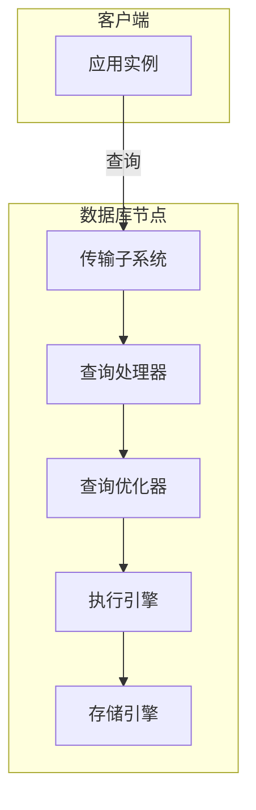

# 第1章 简介与概览

数据库管理系统（Database Management System, DBMS）可以服务于不同的目的：有的主要用于临时热数据，有的作为长期冷存储，有的支持复杂分析查询，有的仅支持按键访问值，有的针对时序数据优化，有的则高效存储大对象。为理解差异并做出区分，我们从简短的分类与概览入手，这有助于理解后续讨论的范围。

术语有时会模糊不清，缺乏完整语境难以理解。例如，列式存储（column store）与宽列存储（wide column store）的区分几乎互不相干，或聚簇索引（clustered index）与非聚簇索引（nonclustered index）与索引组织表（index-organized table）的关系。本章旨在澄清这些术语并给出精确定义。

我们先概述数据库管理系统架构（见「DBMS 架构」），讨论系统组件及其职责。然后讨论数据库管理系统在存储介质（见「内存型与磁盘型 DBMS」）和布局（见「列式与行式 DBMS」）上的区别。

这两类划分并不能涵盖数据库管理系统的完整分类，还有许多其他分类方式。例如，部分资料将 DBMS 分为三大类：

**在线事务处理（Online Transaction Processing, OLTP）数据库**
- 处理大量面向用户的事务请求。查询通常预定义且短时完成。

**在线分析处理（Online Analytical Processing, OLAP）数据库**
- 处理复杂聚合。OLAP 数据库常用于分析与数据仓库，能执行复杂、耗时的即席查询。

**混合事务分析处理（Hybrid Transactional and Analytical Processing, HTAP）**
- 兼具 OLTP 与 OLAP 的特性。

还有键值存储、关系数据库、文档型存储、图数据库等术语与分类。此处不逐一定义，假定读者对其功能有基本了解。由于我们讨论的概念具有广泛适用性，并在上述各类存储中以某种形式使用，完整分类对后续讨论并非必需。

本书第一部分聚焦存储与索引结构，因此需要理解高层数据组织方式，以及数据文件与索引文件的关系（见「数据文件与索引文件」）。最后，在「缓冲、不可变性与有序性」中，我们讨论三种广泛用于构建高效存储结构的技术，以及这些技术如何影响设计与实现。

## DBMS 架构

数据库管理系统没有统一的设计蓝图。每个数据库的构建方式略有不同，组件边界往往难以界定。即便在文档中存在这些边界，在代码中看似独立的组件也可能因性能优化、边界情况处理或架构决策而耦合。

描述数据库管理系统架构的资料（如 [HELLERSTEIN07]、[WEIKUM01]、[ELMASRI11]、[MOLINA08]）对组件及其关系的定义各不相同。图 1-1 展示了这些表述中的一些共同主题。

数据库管理系统采用客户端/服务器（client/server）模型，数据库实例（节点）充当服务器，应用实例充当客户端。

客户端请求通过传输子系统（transport subsystem）到达，通常以某种查询语言表达的查询形式出现。传输子系统还负责与数据库集群中其他节点的通信。

::: tip 图 1-1：数据库管理系统架构

:::

收到请求后，传输子系统将查询交给查询处理器（query processor），由其解析、解释和验证。随后进行访问控制检查，因为只有在查询被解释后才能完整执行。

解析后的查询传给查询优化器（query optimizer），先消除不可能或冗余部分，再根据内部统计（索引基数、近似交集大小等）和数据分布（集群中哪些节点持有数据及传输成本）寻找最高效的执行方式。优化器同时处理查询解析所需的关系运算（通常表示为依赖树）以及索引顺序、基数估计、访问方法选择等优化。

查询通常以执行计划（execution plan，或 query plan）的形式呈现：为得到完整结果所需执行的操作序列。同一查询可由不同执行计划满足，效率各异，优化器选择最优计划。

执行计划由执行引擎（execution engine）执行，汇总本地与远程操作的结果。远程执行包括与集群其他节点的读写及复制。

本地查询（直接来自客户端或其他节点）由存储引擎（storage engine）执行。存储引擎包含多个职责明确的组件：

| 组件 | 职责 |
|------|------|
| **事务管理器（Transaction manager）** | 调度事务，确保数据库不会处于逻辑不一致状态 |
| **锁管理器（Lock manager）** | 为运行中的事务锁定数据库对象，保证并发操作不破坏物理数据完整性 |
| **访问方法（Access methods，存储结构）** | 管理磁盘上的数据访问与组织，包括堆文件及 B-Tree、LSM Tree 等结构 |
| **缓冲管理器（Buffer manager）** | 在内存中缓存数据页 |
| **恢复管理器（Recovery manager）** | 维护操作日志，在故障时恢复系统状态 |

事务管理器与锁管理器共同负责并发控制（concurrency control）：在保证逻辑与物理数据完整性的同时，尽可能高效地执行并发操作。

## 内存型与磁盘型 DBMS

数据库系统在内存和磁盘上存储数据。内存型数据库管理系统（in-memory DBMS，又称 main memory DBMS）主要将数据存放在内存，磁盘用于恢复与日志。磁盘型 DBMS 将大部分数据存放在磁盘，内存用于缓存磁盘内容或作为临时存储。两类系统都会使用磁盘，但内存型数据库几乎完全在 RAM 中存储数据。

::: info 参考
可在 https://people.eecs.berkeley.edu/~rcs/research/interactive_latency.html 查看磁盘与内存访问延迟的可视化与多年对比。
:::

访问内存的速度一直比访问磁盘快数个数量级，因此将内存作为主存储很有吸引力，且随着内存价格下降，经济上更可行。然而，与 SSD、HDD 等持久存储相比，RAM 价格仍然较高。

内存型数据库系统与磁盘型不仅在主存储介质上不同，在数据结构、组织方式和优化技术上也不同。

以内存作为主数据存储的数据库主要出于性能、相对较低的访问成本和访问粒度。面向内存的编程也比面向磁盘简单得多：操作系统抽象了内存管理，允许我们以分配和释放任意大小内存块的方式思考。在磁盘上，我们需要手动管理数据引用、序列化格式、已释放内存和碎片。

内存型数据库增长的主要限制是 RAM 的易失性（即缺乏持久性）和成本。RAM 内容不持久，软件错误、崩溃、硬件故障和断电都可能导致数据丢失。可通过不间断电源、电池备份 RAM 等方式保证持久性，但需要额外硬件和运维投入。实践中，磁盘更易维护且价格更低。

随着非易失性内存（Non-Volatile Memory, NVM）技术的普及，情况可能改变。NVM 可减少或消除读写延迟的不对称，进一步提升读写性能，并支持按字节寻址。

### 内存型存储的持久性

内存型数据库在磁盘上维护备份以提供持久性并防止易失数据丢失。部分数据库仅在内存中存储数据且不提供持久性保证，本书不讨论这类系统。

在操作被视为完成前，其结果必须写入顺序日志文件。我们将在「恢复」中详细讨论预写日志（write-ahead log）。为避免在启动或崩溃后重放完整日志，内存型存储会维护备份副本。备份以排序的磁盘结构形式维护，对该结构的修改通常是异步的（与客户端请求解耦），并以批处理方式应用以减少 I/O。恢复时，可从备份和日志恢复数据库内容。

日志记录通常以批处理方式应用到备份。一批日志处理完成后，备份持有特定时间点的数据库快照，该时间点之前的日志内容可丢弃。这一过程称为检查点（checkpointing），通过使磁盘上的数据库与日志保持最新来缩短恢复时间，而无需客户端等待备份更新完成。

::: warning 注意
将内存型数据库等同于带有巨大页缓存的磁盘型数据库并不准确。即便页被缓存在内存中，序列化格式和数据布局仍带来额外开销，无法达到内存型存储所能实现的优化程度。
:::

磁盘型数据库使用针对磁盘访问优化的专用存储结构。在内存中，指针可较快跟随，随机内存访问远快于随机磁盘访问。磁盘型存储结构常采用宽而矮的树形结构，而内存型实现可从更多数据结构中选择，并实施在磁盘上难以或无法实现的优化。同样，在磁盘上处理变长数据需要特别关注，而在内存中往往只需用指针引用值即可。

对部分场景，可以合理假设整个数据集能放入内存。例如学生记录、企业客户记录、在线商店库存等，每条记录通常不超过几 KB，数量有限。

## 列式与行式 DBMS

多数数据库系统存储由列和行组成的数据记录表。字段（field）是列与行的交集，即某种类型的单个值。同一列中的字段通常具有相同数据类型。例如，若定义存储用户记录的表，所有姓名为同一类型且属于同一列。逻辑上属于同一条记录（通常由键标识）的值集合构成一行。

数据库的一种分类方式是按磁盘上的存储方式：按行或按列。表可以水平分区（将同一行的值存在一起）或垂直分区（将同一列的值存在一起）。图 1-2 展示了这一区别：(a) 为按列分区，(b) 为按行分区。

::: tip 图 1-2：列式与行式存储的数据布局
```
(a) 列式布局:          (b) 行式布局:
Col1 Col2 Col3         Row1: [v1,v2,v3]
 v1   v4   v7          Row2: [v4,v5,v6]
 v2   v5   v8          Row3: [v7,v8,v9]
 v3   v6   v9
```
:::

行式数据库管理系统的例子很多：MySQL、PostgreSQL 及大多数传统关系数据库。开源的列式存储先驱包括 MonetDB 和 C-Store（Vertica 的开源前身）。

### 行式数据布局

行式数据库管理系统以记录或行的形式存储数据，布局与表格表示接近，每行具有相同的字段集。例如，行式数据库可高效存储用户条目：

| ID | Name  | Birth Date  | Phone Number   |
|----|-------|--------------|----------------|
| 10 | John  | 01 Aug 1981 | +1 111 222 333 |
| 20 | Sam   | 14 Sep 1988 | +1 555 888 999 |
| 30 | Keith | 07 Jan 1984 | +1 333 444 555 |

当若干字段构成由键唯一标识的记录（如姓名、生日、电话）时，这种方式很合适。表示单条用户记录的所有字段通常一起读取；创建记录时（如用户填写注册表）也一起写入；同时每个字段可单独修改。

行式存储在需要按行访问数据的场景中最有用，将整行存在一起可提高空间局部性（spatial locality）。

由于磁盘等持久介质通常按块访问（即最小访问单位是块），单个块会包含所有列的数据。这在需要访问整条用户记录时很好，但会使仅访问多行中个别字段的查询（如只取电话号码）更昂贵，因为其他字段的数据也会被读入。

### 列式数据布局

列式数据库管理系统垂直分区数据（按列）而非按行存储。同一列的值在磁盘上连续存储。例如，存储历史股价时，报价会存在一起。将不同列的值放在不同文件或文件段中，便于按列高效查询，可一次读取而不必消费整行并丢弃未查询列的数据。

列式存储适合需要计算聚合的分析负载，如发现趋势、计算平均值等。当逻辑记录有多个字段，但部分字段（如报价）更重要且常一起消费时，适合使用列式存储。

从逻辑上看，股价数据仍可表示为表：

| ID | Symbol | Date        | Price     |
|----|---------|--------------|-----------|
| 1  | DOW     | 08 Aug 2018 | 24,314.65 |
| 2  | DOW     | 09 Aug 2018 | 24,136.16 |
| 3  | S&P     | 08 Aug 2018 | 2,414.45  |
| 4  | S&P     | 09 Aug 2018 | 2,232.32  |

但物理上的列式布局完全不同，同一列的值紧密存储：

```
Symbol: 1:DOW; 2:DOW; 3:S&P; 4:S&P
Date:   1:08 Aug 2018; 2:09 Aug 2018; 3:08 Aug 2018; 4:09 Aug 2018
Price:  1:24,314.65; 2:24,136.16; 3:2,414.45; 4:2,232.32
```

为重建数据元组（用于连接、过滤、多行聚合），需要在列级保留元数据以关联不同列的数据点。若显式实现，每个值需持有键，导致重复并增加存储量。部分列式存储使用隐式标识符（虚拟 ID），用值的位置（即偏移）映射回相关值。

近年来，随着对大规模数据执行复杂分析查询的需求增长，出现了许多列式文件格式（如 Apache Parquet、Apache ORC、RCFile）和列式存储（如 Apache Kudu、ClickHouse 等）。

### 区别与优化

仅从存储方式区分行式与列式并不充分。选择数据布局只是列式存储一系列优化中的一步。

一次读取同一列的多个值可显著提高缓存利用率和计算效率。在现代 CPU 上，可使用向量化指令（vectorized instructions，即 SIMD）用单条指令处理多个数据点。

将相同类型的数据存在一起（如数字与数字、字符串与字符串）可获得更好的压缩比，可根据数据类型选择不同压缩算法。

选择列式还是行式存储需理解访问模式：若读取的数据以记录形式消费（即请求大部分或全部列），且负载以点查询和范围扫描为主，行式通常更合适；若扫描跨多行或对列子集计算聚合，则值得考虑列式。

### 宽列存储

列式数据库不应与 BigTable、HBase 等宽列存储（wide column store）混淆。宽列存储将数据表示为多维映射，列被组织成列族（column family，通常存储同类数据），每个列族内部按行存储。这种布局最适合按键或键序列检索的数据。

Bigtable 论文中的典型例子是 Webtable。Webtable 存储网页内容快照、属性及它们在特定时间戳的关系。页面由反转 URL 标识，所有属性（如页面内容和表示页面间链接的锚点）由快照时间戳标识。可简化为嵌套映射，如图 1-3 所示。

::: tip 图 1-3：Webtable 的概念结构
```
多维排序映射:
  row_key (反转URL) -> column_family -> column_key -> timestamp -> value
  contents: html, ...
  anchor: cnnsi.com, my.look.ca, ...
```
:::

数据存储在具有层次索引的多维排序映射中：可通过反转 URL 定位特定网页的数据，通过时间戳定位内容或锚点。每行由行键索引。相关列归入列族（本例中为 contents 和 anchor），在磁盘上分开存储。列族内的列由列键标识，列键由列族名和限定符组成。列族按时间戳存储多版本数据。

宽列存储的物理布局与概念表示略有不同。图 1-4 展示了列族中数据布局的示意：列族分开存储，但每个列族中同一键的数据存在一起。

## 数据文件与索引文件

数据库系统的主要目标是存储数据并支持快速访问。数据如何组织？为何需要数据库管理系统而不仅是若干文件？文件组织如何提高效率？

数据库系统确实用文件存储数据，但不依赖文件系统的目录和文件层次来定位记录，而是使用实现特定的格式组织文件。使用专用文件组织而非平面文件的主要原因包括：

| 目标 | 说明 |
|------|------|
| **存储效率** | 以最小化每条记录存储开销的方式组织文件 |
| **访问效率** | 以尽可能少的步骤定位记录 |
| **更新效率** | 以最小化磁盘修改次数的方式更新记录 |

数据库系统将包含多个字段的数据记录存储在表中，每张表通常对应一个单独文件。表中的记录可用搜索键（search key）查找。为定位记录，数据库系统使用索引（index）：辅助数据结构，用于在不每次全表扫描的情况下高效定位数据记录。索引基于标识记录的字段子集构建。

数据库系统通常将数据文件与索引文件分离：数据文件存储数据记录，索引文件存储记录元数据并用于在数据文件中定位记录。索引文件通常小于数据文件。文件被划分为页（page），页大小通常为一个或多个磁盘块。页可组织为记录序列或槽式页（slotted page）。

新记录（插入）和对现有记录的更新以键/值对表示。多数现代存储系统不会显式从页中删除数据，而是使用删除标记（deletion marker，又称 tombstone），包含键、时间戳等删除元数据。被更新或删除标记覆盖的记录所占空间在垃圾回收时回收：读取页、将存活记录写入新位置、丢弃被覆盖的记录。

### 数据文件

数据文件（有时称主文件 primary file）可实现为索引组织表（Index-Organized Table, IOT）、堆组织表（heap file）或哈希组织表（hashed file）。

堆文件中的记录不必遵循特定顺序，多数情况下按写入顺序放置，追加新页时无需额外工作或文件重组。堆文件需要额外的索引结构指向数据记录位置以支持查找。

哈希文件中，记录存储在桶（bucket）中，键的哈希值决定记录所属桶。桶内记录可按追加顺序或按键排序存储以提高查找速度。

索引组织表（IOT）将数据记录存储在索引本身中。由于记录按键序存储，IOT 的范围扫描可通过顺序扫描实现。

将数据记录存储在索引中可减少至少一次磁盘寻道：遍历索引并定位键后，无需再访问单独的文件查找对应数据记录。

当记录存储在单独文件中时，索引文件保存数据项（data entry），唯一标识数据记录并包含在数据文件中定位它们的信息，例如文件偏移（row locator）、数据记录在数据文件中的位置，或哈希文件中的桶 ID。在索引组织表中，数据项保存实际数据记录。

### 索引文件

索引是用于在磁盘上组织数据记录以支持高效检索的结构。索引文件组织为将键映射到数据文件中记录位置的专用结构。

主文件上的索引称为主索引（primary index）。多数情况下可假定主索引建立在主键或一组被标识为主键的键上。其他索引称为辅助索引（secondary index）。

辅助索引可直接指向数据记录，或仅存储其主键。指向数据记录的指针可保存堆文件或索引组织表的偏移。多个辅助索引可指向同一记录，使单条记录可通过不同字段和不同索引定位。主索引文件每个搜索键对应唯一项，辅助索引每个搜索键可对应多项。

若数据记录顺序遵循搜索键顺序，该索引称为聚簇索引（clustered index）。聚簇情况下，数据记录通常存储在同一文件或保持键序的聚簇文件中。若数据存储在单独文件中且顺序不遵循键序，则称为非聚簇索引（nonclustered index）。

图 1-5 展示两种方式的区别：
- (a) 两个索引直接从辅助索引文件引用数据项
- (b) 辅助索引通过主索引的间接层定位数据项

::: info 说明
索引组织表按索引顺序存储信息，按定义是聚簇的。主索引通常为聚簇。辅助索引按定义为非聚簇，因其用于支持主键以外的键访问。聚簇索引既可以是索引组织表，也可以有独立的索引和数据文件。
:::

许多数据库系统具有显式主键，即唯一标识数据库记录的列集合。未指定主键时，存储引擎可创建隐式主键（如 MySQL InnoDB 会添加自增列并自动填充）。

### 主索引作为间接层

在数据库社区中，对数据记录应直接引用（通过文件偏移）还是通过主键索引引用存在不同看法。两种方式各有优劣，需在完整实现中讨论。直接引用可减少磁盘寻道，但记录更新或维护过程中重定位时需更新指针。使用主索引作为间接层可降低指针更新成本，但读取路径成本更高。

若负载以读为主，仅更新少量索引可能可行；但对多索引的写密集负载效果不佳。为降低指针更新成本，部分实现使用主键而非负载偏移作为间接。例如 MySQL InnoDB 使用主索引，查询时执行两次查找：一次在辅助索引，一次在主索引。这增加了主索引查找的开销，而非直接从辅助索引跟随偏移。

图 1-6 展示两种方式的区别：
- (a) 两个索引直接从辅助索引文件引用数据项
- (b) 辅助索引通过主索引间接层定位数据项

也可采用混合方式，同时存储数据文件偏移和主键：先检查数据偏移是否仍有效，若已变化则通过主键索引查找并支付额外成本，找到新偏移后更新索引文件。

## 缓冲、不可变性与有序性

存储引擎基于某种数据结构，但这些结构并不描述缓存、恢复、事务性等存储引擎在其之上添加的语义。

在后续章节中，我们将从 B-Tree 开始讨论，理解为何有如此多的 B-Tree 变体，以及为何不断出现新的数据库存储结构。

存储结构有三个常见变量：使用缓冲（或避免使用）、使用不可变（或可变）文件、按序（或无序）存储值。本书讨论的存储结构中的多数区别与优化与这三个概念之一相关。

**缓冲（Buffering）**
- 指存储结构是否选择在写入磁盘前在内存中收集一定量的数据。当然，每个磁盘结构都需一定程度缓冲，因为与磁盘传输的最小单位是块，且最好写入完整块。这里讨论的是可避免的缓冲，即存储引擎实现者主动选择的做法。本书讨论的首个优化之一是在 B-Tree 节点添加内存缓冲区以分摊 I/O 成本（见「惰性 B-Tree」）。但缓冲不仅限于此，例如双组件 LSM Tree 以完全不同的方式使用缓冲，并将缓冲与不可变性结合。

**可变性（Mutability）或不可变性（Immutability）**
- 指存储结构是否读取文件部分、更新并在同一位置写回。不可变结构是仅追加的：一旦写入，文件内容不再修改，修改追加到文件末尾。实现不可变性还有其他方式，如写时复制（copy-on-write）：修改后的页写入文件新位置而非原位置。常将 LSM 与 B-Tree 的区别描述为不可变与就地更新存储，但也有结构（如 Bw-Tree）受 B-Tree 启发却是不可变的。

**有序性（Ordering）**
- 指数据记录是否在磁盘页中按键序存储，即排序相近的键存储在磁盘的连续段中。有序性常决定是否能高效扫描记录范围，而不仅是定位单条记录。无序存储（多为插入顺序）为写时优化提供空间，例如 Bitcask 和 WiscKey 直接在仅追加文件中存储数据记录。

简要讨论这三个概念不足以展现其力量，我们将在本书其余部分继续展开。

## 小结

本章讨论了数据库管理系统的架构及其主要组件。

为突出磁盘型结构的重要性及其与内存型的区别，我们讨论了内存型与磁盘型存储，并得出结论：磁盘型结构对两类存储都重要，但用途不同。

为理解访问模式如何影响数据库系统设计，我们讨论了列式与行式数据库管理系统及其主要区别。为展开数据存储的讨论，我们介绍了数据文件与索引文件。

最后，我们引入了三个核心概念：缓冲、不可变性与有序性，将在全书用于突出使用它们的存储引擎的特性。

## 延伸阅读

- **数据库架构**：Hellerstein, Joseph M., et al. "Architecture of a Database System." Foundations and Trends in Databases, 2007.
- **列式 DBMS**：Abadi, Daniel, et al. The Design and Implementation of Modern Column-Oriented Database Systems. Now Publishers, 2013.
- **内存型 DBMS**：Faerber, Frans, et al. Main Memory Database Systems. Now Publishers, 2017.

---

**导航**

| 上一篇 | 下一篇 |
|--------|--------|
| [← 目录](../index.md) | [第2章 B-Tree 基础 →](ch02.md) |
