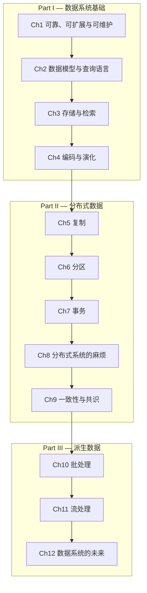

# 设计数据密集型应用

> **Designing Data-Intensive Applications: The Big Ideas Behind Reliable, Scalable, and Maintainable Systems**
>
> Martin Kleppmann, 2017, O'Reilly Media

---

## 章节路线图

---

## 目录

### Part I — 数据系统基础

| # | 章节 | 链接 |
|---|------|------|
| 1 | 可靠、可扩展与可维护的应用 | [→ 阅读](part1/ch01.md) |
| 2 | 数据模型与查询语言 | [→ 阅读](part1/ch02.md) |
| 3 | 存储与检索 | [→ 阅读](part1/ch03.md) |
| 4 | 编码与演化 | [→ 阅读](part1/ch04.md) |

### Part II — 分布式数据

| # | 章节 | 链接 |
|---|------|------|
| 5 | 复制 | [→ 阅读](part2/ch05.md) |
| 6 | 分区 | [→ 阅读](part2/ch06.md) |
| 7 | 事务 | [→ 阅读](part2/ch07.md) |
| 8 | 分布式系统的麻烦 | [→ 阅读](part2/ch08.md) |
| 9 | 一致性与共识 | [→ 阅读](part2/ch09.md) |

### Part III — 派生数据

| # | 章节 | 链接 |
|---|------|------|
| 10 | 批处理 | [→ 阅读](part3/ch10.md) |
| 11 | 流处理 | [→ 阅读](part3/ch11.md) |
| 12 | 数据系统的未来 | [→ 阅读](part3/ch12.md) |
