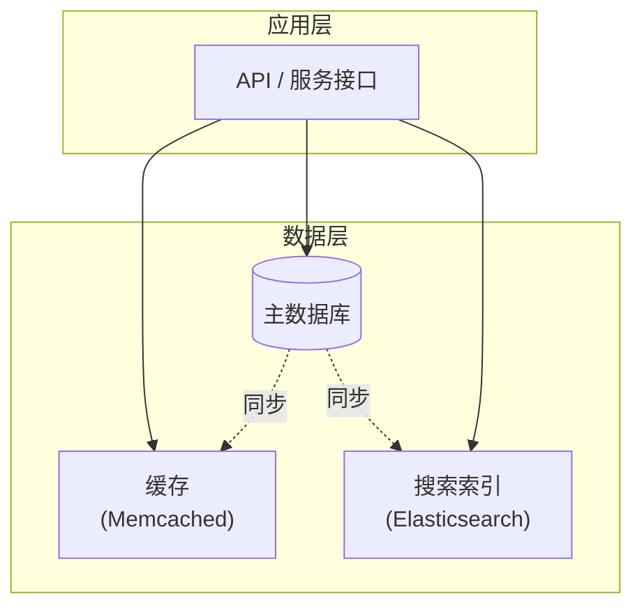

# 第1章 可靠、可扩展与可维护的应用

> 互联网做得如此之好，以至于大多数人把它视为像太平洋一样的自然资源，而不是人造之物。上一次有如此规模的技术如此无差错是什么时候？
>
> — Alan Kay，接受 Dr Dobb's Journal 采访（2012）

当今许多应用都是**数据密集型**（data-intensive）的，而非**计算密集型**（compute-intensive）的。原始 CPU 算力很少成为这些应用的瓶颈——更大的问题通常是数据量、数据复杂度以及数据变化的速度。

数据密集型应用通常由提供常用功能的标准构建块组成。例如，许多应用需要：

- **存储数据**，以便应用自身或其他应用稍后再次查找（数据库）
- **记住昂贵操作的结果**，以加速读取（缓存）
- **允许用户按关键词搜索数据**或以各种方式过滤（搜索索引）
- **向另一个进程发送消息**，以异步处理（流处理）
- **定期处理大量累积数据**（批处理）

如果这听起来显而易见，那是因为这些数据系统是如此成功的抽象：我们一直在使用它们而不必多想。在构建应用时，大多数工程师不会梦想从头编写新的数据存储引擎，因为数据库是完成这项工作的完美工具。

但现实并不那么简单。有许多具有不同特性的数据库系统，因为不同的应用有不同的需求。缓存有各种方法，构建搜索索引有几种方式，等等。在构建应用时，我们仍然需要弄清楚哪些工具和哪些方法最适合手头的任务。当你需要做单个工具无法单独完成的事情时，组合工具可能会很困难。

本书将带你探索数据系统的原理与实践，以及如何用它们构建数据密集型应用。我们将探讨不同工具的共性、它们的区别，以及它们如何实现各自的特性。

在本章中，我们将首先探索我们试图实现的基本目标：可靠、可扩展且可维护的数据系统。我们将阐明这些概念的含义，概述一些思考方式，并介绍后续章节所需的基础知识。在后续章节中，我们将逐层深入，探讨在开发数据密集型应用时需要考虑的不同设计决策。

## 思考数据系统

我们通常将数据库、队列、缓存等视为非常不同类别的工具。尽管数据库和消息队列在表面上有些相似——两者都会在一段时间内存储数据——但它们有不同的访问模式，这意味着不同的性能特征，因此实现方式也大不相同。

那么，我们为什么要将它们统称为「数据系统」呢？

近年来出现了许多新的数据存储和处理工具。它们针对各种不同的用例进行了优化，不再整齐地归入传统类别 [1]。例如，有些数据存储也被用作消息队列（Redis），有些消息队列具有类似数据库的持久性保证（Apache Kafka）。类别之间的界限正在变得模糊。

其次，越来越多的应用现在有如此苛刻或广泛的需求，以至于单个工具无法再满足其所有数据处理和存储需求。相反，工作被分解为可以在单个工具上高效执行的任务，这些不同的工具通过应用代码拼接在一起。

例如，如果你有应用管理的缓存层（使用 Memcached 或类似工具），或与主数据库分离的全文搜索服务器（如 Elasticsearch 或 Solr），通常由应用代码负责使这些缓存和索引与主数据库保持同步。下图展示了这可能的样子（我们将在后续章节中详细讨论）。



::: info 图 1-1
一种可能的数据系统架构，结合了多个组件。
:::

当你组合多个工具以提供服务时，服务的接口或应用编程接口（API）通常会对客户端隐藏这些实现细节。现在你 essentially 从较小的通用组件创建了一个新的专用数据系统。你的复合数据系统可能提供某些保证：例如，缓存将在写入时正确失效或更新，以便外部客户端看到一致的结果。你现在不仅是应用开发者，也是数据系统设计者。

如果你正在设计数据系统或服务，会出现许多棘手的问题。如何确保数据在内部出错时仍保持正确和完整？如何在系统部分降级时仍向客户端提供一致的良好性能？如何扩展以处理负载增加？服务的良好 API 应该是什么样子？

有许多因素可能影响数据系统的设计，包括参与人员的技能和经验、遗留系统依赖、交付时间表、组织对不同风险的容忍度、监管约束等。这些因素很大程度上取决于具体情况。

在本书中，我们关注大多数软件系统中重要的三个关注点：

**可靠性（Reliability）**：系统在面对逆境（硬件或软件故障，甚至人为错误）时，应继续正确工作（以所需性能水平执行正确功能）。参见第 6 页「可靠性」。

**可扩展性（Scalability）**：随着系统增长（数据量、流量或复杂度），应有合理的方式应对这种增长。参见第 10 页「可扩展性」。

**可维护性（Maintainability）**：随着时间的推移，许多人将在系统上工作（工程和运维，既要维护当前行为，也要使系统适应新用例），他们都应该能够高效地工作。参见第 18 页「可维护性」。

这些词经常被随意使用，却没有清晰的理解。为了深思熟虑的工程实践，我们将在本章剩余部分探索思考可靠性、可扩展性和可维护性的方式。然后，在后续章节中，我们将研究用于实现这些目标的各种技术、架构和算法。

## 可靠性

每个人对某事物可靠或不可靠都有直观的理解。对于软件，典型期望包括：

- 应用执行用户期望的功能
- 能够容忍用户犯错或以意外方式使用软件
- 在预期负载和数据量下，性能足以满足所需用例
- 系统防止任何未经授权的访问和滥用

如果所有这些加在一起意味着「正确工作」，那么我们可以将可靠性理解为，大致上，「即使出错也能继续正确工作」。

可能出错的事情称为**故障**（faults），能够预见故障并应对的系统称为**容错**（fault-tolerant）或**弹性**（resilient）系统。前者略有误导性：它暗示我们可以使系统容忍每一种可能的故障，这在现实中是不可行的。如果整个地球（及其上的所有服务器）被黑洞吞噬，容忍这种故障将需要太空中的网络托管——祝你好运获得这笔预算批准。因此，只有谈论容忍某些类型的故障才有意义。

::: tip 故障与失效
注意，故障（fault）与失效（failure）不同 [2]。故障通常定义为系统的一个组件偏离其规格，而失效是系统整体停止向用户提供所需服务。将故障概率降为零是不可能的；因此，通常最好设计容错机制，防止故障导致失效。本书将介绍几种从不可靠部件构建可靠系统的技术。
:::

反直觉的是，在这类容错系统中，通过故意触发故障来增加故障率可能是有意义的——例如，随机杀死单个进程而不发出警告。许多关键 bug 实际上是由于错误处理不当造成的 [3]；通过故意诱发故障，你可以确保容错机制持续得到锻炼和测试，这可以增加你对故障在自然发生时能被正确处理的信心。Netflix 的 Chaos Monkey [4] 就是这种方法的一个例子。

尽管我们通常更喜欢容忍故障而非预防故障，但在某些情况下预防优于治疗（例如，因为不存在治疗方法）。安全事务就是这种情况：如果攻击者已经入侵系统并获得了敏感数据的访问权限，该事件无法撤销。然而，本书主要涉及可以治愈的故障类型，如下节所述。

### 硬件故障

当我们想到系统失效的原因时，硬件故障很快浮现在脑海中。硬盘崩溃、RAM 出现故障、电网停电、有人拔错了网线。任何在大型数据中心工作过的人都可以告诉你，当你有大量机器时，这些事情经常发生。

据报道，硬盘的平均故障时间（MTTF）约为 10 到 50 年 [5, 6]。因此，在拥有 10,000 块磁盘的存储集群中，我们平均每天应预期有一块磁盘死亡。

我们的第一反应通常是为单个硬件组件添加冗余，以降低系统的故障率。磁盘可以配置为 RAID，服务器可以有双电源和热插拔 CPU，数据中心可以有电池和柴油发电机作为备用电源。当一个组件死亡时，冗余组件可以接管，同时更换损坏的组件。这种方法不能完全防止硬件问题导致失效，但它已被充分理解，通常可以让机器不间断运行多年。

直到最近，硬件组件的冗余对大多数应用来说已经足够，因为它使单机完全失效相当罕见。只要你能相当快地将备份恢复到新机器上，大多数应用中故障情况下的停机时间并不灾难性。因此，只有少数对高可用性绝对必要的应用才需要多机冗余。

然而，随着数据量和应用计算需求的增加，更多应用开始使用更大数量的机器，这按比例增加了硬件故障率。此外，在 Amazon Web Services（AWS）等一些云平台上，虚拟机实例在没有警告的情况下变得不可用相当常见 [7]，因为平台被设计为优先考虑灵活性和弹性，而非单机可靠性。

因此，人们正在转向能够容忍整机丢失的系统，通过使用软件容错技术来优先或补充硬件冗余。这类系统还具有运维优势：单服务器系统如果需要重启机器（例如应用操作系统安全补丁）则需要计划停机，而能够容忍机器故障的系统可以一次修补一个节点，而无需整个系统停机（滚动升级；参见第 4 章）。

### 软件错误

我们通常认为硬件故障是随机的、彼此独立的：一台机器的磁盘故障并不意味着另一台机器的磁盘即将故障。可能存在弱相关性（例如由于共同原因，如服务器机架中的温度），但否则大量硬件组件同时故障的可能性不大。

另一类故障是系统内的**系统性错误**（systematic error）[8]。这类故障更难预见，并且由于它们在节点间相关，往往比不相关的硬件故障导致更多的系统失效 [5]。例如：

- **软件 bug** 导致应用服务器的每个实例在收到特定错误输入时崩溃。例如，2012 年 6 月 30 日的闰秒导致许多应用由于 Linux 内核中的 bug 同时挂起 [9]。
- **失控进程** 耗尽某些共享资源——CPU 时间、内存、磁盘空间或网络带宽。
- **系统依赖的服务** 变慢、无响应或开始返回损坏的响应。
- **级联故障**，其中一个组件的小故障触发另一个组件的故障，进而触发更多故障 [10]。

导致这类软件故障的 bug 通常会休眠很长时间，直到被异常情况触发。在这些情况下，会暴露出软件对其环境做出了某种假设——虽然该假设通常成立，但最终会因某种原因不再成立 [11]。

软件系统性故障没有快速解决方案。许多小事情可以帮助：仔细思考系统中的假设和交互；彻底测试；进程隔离；允许进程崩溃和重启；在生产环境中测量、监控和分析系统行为。如果系统预期提供某种保证（例如，在消息队列中，传入消息数等于传出消息数），它可以在运行时不断检查自身，并在发现差异时发出警报 [12]。

### 人为错误

人类设计和构建软件系统，保持系统运行的运维人员也是人类。即使他们意图最好，人类已知是不可靠的。例如，一项对大型互联网服务的研究发现，运维人员的配置错误是停机的主要原因，而硬件故障（服务器或网络）仅在 10–25% 的停机中起作用 [13]。

我们如何在不可靠的人类面前使系统可靠？最好的系统结合多种方法：

- **以最小化错误机会的方式设计系统**。例如，精心设计的抽象、API 和管理界面使做「正确的事」变得容易，并阻止「错误的事」。然而，如果界面过于限制，人们会绕过它们，抵消其好处，所以这是一个难以把握的平衡。
- **将人们最容易犯错的地方与可能导致失效的地方解耦**。特别是，提供功能齐全的非生产沙盒环境，让人们可以安全地探索和实验，使用真实数据，而不影响真实用户。
- **在所有层级进行彻底测试**，从单元测试到全系统集成测试和手动测试 [3]。自动化测试被广泛使用、充分理解，对于覆盖正常操作中很少出现的边界情况特别有价值。
- **允许从人为错误中快速轻松地恢复**，以最小化失效情况下的影响。例如，使回滚配置更改变快，逐步推出新代码（以便任何意外 bug 只影响一小部分用户），并提供重新计算数据的工具（以防旧计算被证明不正确）。
- **建立详细清晰的监控**，如性能指标和错误率。在其他工程学科中，这被称为遥测（telemetry）。（一旦火箭离开地面，遥测对于跟踪正在发生的事情和理解故障至关重要 [14]。）监控可以向我们显示早期预警信号，并允许我们检查是否有任何假设或约束被违反。当问题发生时，指标对于诊断问题非常宝贵。
- **实施良好的管理实践和培训**——一个复杂而重要的方面，超出本书范围。

### 可靠性有多重要？

可靠性不仅适用于核电站和空中交通管制软件——更普通的应用也被期望可靠工作。业务应用中的 bug 会导致生产力损失（如果数字报告不正确还会带来法律风险），电子商务网站的停机在收入损失和声誉损害方面可能造成巨大成本。

即使在「非关键」应用中，我们也对用户负有责任。考虑一位将所有孩子的照片和视频存储在你的照片应用中的家长 [15]。如果该数据库突然损坏，他们会作何感受？他们知道如何从备份恢复吗？

在某些情况下，我们可能会选择牺牲可靠性以降低开发成本（例如，在为未经验证的市场开发原型产品时）或运营成本（例如，对于利润率非常窄的服务）——但我们应该非常清楚何时在偷工减料。

## 可扩展性

即使系统今天可靠工作，也不意味着它将来必然可靠工作。性能下降的一个常见原因是负载增加：也许系统从 10,000 个并发用户增长到 100,000 个，或从 100 万增长到 1000 万。也许它处理的数据量比以前大得多。

**可扩展性**（scalability）是我们用来描述系统应对负载增加能力的术语。然而，请注意，它不是我们可以附加到系统的一维标签：说「X 可扩展」或「Y 不可扩展」是没有意义的。相反，讨论可扩展性意味着考虑诸如「如果系统以特定方式增长，我们应对增长的选择是什么？」以及「我们如何添加计算资源来处理额外负载？」之类的问题。

### 描述负载

首先，我们需要简洁地描述系统上的当前负载；只有这样我们才能讨论增长问题（如果我们的负载翻倍会怎样？）。负载可以用我们称为**负载参数**（load parameters）的几个数字来描述。参数的最佳选择取决于你的系统架构：可能是 Web 服务器的每秒请求数、数据库中读写比、聊天室中同时活跃用户数、缓存命中率或其他。也许平均情况对你很重要，也许你的瓶颈由少数极端情况主导。

为了让这个想法更具体，让我们以 Twitter 为例，使用 2012 年 11 月发布的数据 [16]。Twitter 的两个主要操作是：

**发推文**：用户可以向其关注者发布新消息（平均 4.6k 请求/秒，峰值超过 12k 请求/秒）。

**首页时间线**：用户可以查看他们关注的人发布的推文（300k 请求/秒）。

仅处理 12,000 次写入/秒（发推文的峰值速率）会相当容易。然而，Twitter 的扩展挑战主要不是由于推文量，而是由于**扇出**（fan-out）——每个用户关注许多人，每个用户被许多人关注。实现这两个操作大致有两种方式：

1. **发推文**只需将新推文插入到推文的全局集合中。当用户请求其首页时间线时，查找他们关注的所有人，找到这些用户的所有推文，并合并它们（按时间排序）。在关系数据库中，你可以编写如下查询：

```sql
SELECT tweets.*, users.* FROM tweets
  JOIN users   ON tweets.sender_id    = users.id
  JOIN follows ON follows.followee_id = users.id
  WHERE follows.follower_id = current_user
```

2. **维护每个用户的首页时间线缓存**——就像每个接收用户的推文邮箱。当用户发推文时，查找关注该用户的所有人，并将新推文插入到他们每个人的首页时间线缓存中。读取首页时间线的请求然后很便宜，因为其结果已提前计算。

第一种方式的 Twitter 最初版本使用了方法 1，但系统难以跟上首页时间线查询的负载，因此公司切换到方法 2。这样效果更好，因为发布推文的平均速率比首页时间线读取的速率低近两个数量级，因此在这种情况下，在写入时做更多工作、在读取时做更少工作是更可取的。

然而，方法 2 的缺点是发推文现在需要大量额外工作。平均而言，一条推文会送达约 75 个关注者，因此每秒 4.6k 条推文变成对首页时间线缓存的 345k 次写入。但这个平均值隐藏了一个事实：每个用户的关注者数量差异很大，有些用户有超过 3000 万关注者。这意味着单条推文可能导致对首页时间线的超过 3000 万次写入！及时完成这项工作——Twitter 试图在五秒内将推文送达关注者——是一个重大挑战。

在 Twitter 的例子中，每个用户的关注者分布（可能按这些用户发推文的频率加权）是讨论可扩展性的关键负载参数，因为它决定了扇出负载。你的应用可能有非常不同的特性，但你可以应用类似的原理来推理其负载。

Twitter 轶事的最后转折：现在方法 2 已稳健实现，Twitter 正在转向两种方法的混合。大多数用户的推文在发布时继续扇出到首页时间线，但少数拥有大量关注者的用户（即名人）除外。用户可能关注的任何名人的推文在读取时单独获取并与该用户的首页时间线合并，如方法 1。这种混合方法能够提供一致的良好性能。我们将在第 12 章在涵盖更多技术基础后重新讨论这个例子。

### 描述性能

一旦你描述了系统上的负载，你就可以研究负载增加时会发生什么。你可以从两个角度看待：

- 当你增加负载参数并保持系统资源（CPU、内存、网络带宽等）不变时，系统性能如何受影响？
- 当你增加负载参数时，如果你想保持性能不变，需要增加多少资源？

这两个问题都需要性能数字，所以让我们简要看看如何描述系统性能。

在 Hadoop 等批处理系统中，我们通常关心**吞吐量**（throughput）——我们每秒可以处理的记录数，或在特定大小的数据集上运行作业所需的总时间。在在线系统中，通常更重要的是服务的**响应时间**（response time）——即客户端发送请求到收到响应之间的时间。

::: info 延迟与响应时间
延迟和响应时间经常被同义使用，但它们并不相同。响应时间是客户端看到的：除了实际处理请求的时间（服务时间）外，还包括网络延迟和排队延迟。延迟是请求等待被处理的时间——在此期间它是潜在的，等待服务 [17]。
:::

即使你一遍又一遍地发出相同的请求，每次尝试你都会得到略有不同的响应时间。在实践中，在处理各种请求的系统中，响应时间可能变化很大。因此，我们需要将响应时间视为不是单个数字，而是可以测量的值的分布。

大多数请求相当快，但偶尔有异常值需要更长的时间。也许慢请求本质上更昂贵，例如因为它们处理更多数据。但即使在你认为所有请求应该花费相同时间的场景中，你也会得到变化：随机额外延迟可能由切换到后台进程、网络数据包丢失和 TCP 重传、垃圾回收暂停、导致从磁盘读取的缺页、服务器机架中的机械振动 [18] 或许多其他原因引入。

服务报告平均响应时间很常见。（严格来说，「平均」一词不指任何特定公式，但在实践中通常理解为算术平均值：给定 n 个值，将所有值相加，除以 n。）然而，如果你想知道「典型」响应时间，平均值不是一个很好的指标，因为它没有告诉你多少用户实际经历了该延迟。

通常最好使用**百分位数**（percentiles）。如果你获取响应时间列表并按从快到慢排序，那么**中位数**（median）是 halfway 点：例如，如果你的中位响应时间是 200 ms，这意味着你的一半请求在 200 ms 内返回，一半请求需要更长时间。

这使得中位数成为了解用户通常需要等待多长时间的好指标：一半用户请求在中位响应时间内得到服务，另一半需要更长时间。中位数也称为第 50 百分位，有时缩写为 p50。注意，中位数指的是单个请求；如果用户发出多个请求（在会话过程中，或因为单个页面包含多个资源），至少有一个比中位数慢的概率远大于 50%。

为了了解异常值有多糟糕，你可以查看更高的百分位数：第 95、99 和 99.9 百分位很常见（缩写为 p95、p99 和 p999）。它们是 95%、99% 或 99.9% 的请求比该特定阈值更快的响应时间阈值。例如，如果第 95 百分位响应时间是 1.5 秒，这意味着 100 个请求中有 95 个在 1.5 秒内完成，100 个中有 5 个需要 1.5 秒或更多。

响应时间的高百分位，也称为**尾延迟**（tail latencies），很重要，因为它们直接影响用户对服务的体验。例如，Amazon 以第 99.9 百分位描述内部服务的响应时间要求，尽管它只影响 1000 个请求中的 1 个。这是因为最慢请求的客户通常是账户上数据最多的人，因为他们进行了许多购买——也就是说，他们是最有价值的客户 [19]。通过确保网站对他们来说很快来保持这些客户满意很重要：Amazon 还观察到响应时间增加 100 ms 会使销售额减少 1% [20]，其他人报告 1 秒的减速会使客户满意度指标降低 16% [21, 22]。

另一方面，优化第 99.99 百分位（10000 个请求中最慢的 1 个）被认为对 Amazon 的目的来说太昂贵且收益不足。降低非常高的百分位的响应时间很困难，因为它们很容易受到你控制之外的随机事件的影响，而且收益在递减。

例如，百分位经常用于**服务级别目标**（SLO）和**服务级别协议**（SLA），即定义服务预期性能和可用性的合同。SLA 可能规定，如果中位响应时间小于 200 ms 且第 99 百分位低于 1 秒，则服务被视为正常运行（如果响应时间更长，可能还不如停机），并且服务可能被要求至少 99.9% 的时间可用。这些指标为服务的客户端设定了期望，并允许客户在未满足 SLA 时要求退款。

排队延迟通常占高百分位响应时间的很大一部分。由于服务器只能并行处理少量事情（例如受其 CPU 核心数限制），只需少量慢请求就能阻塞后续请求的处理——这种效果有时称为**队头阻塞**（head-of-line blocking）。即使这些后续请求在服务器上处理很快，由于等待先前请求完成的时间，客户端也会看到慢的整体响应时间。由于这种效果，在客户端测量响应时间很重要。

当人为生成负载以测试系统的可扩展性时，负载生成客户端需要在独立于响应时间的情况下持续发送请求。如果客户端在发送下一个之前等待前一个请求完成，这种行为会在测试中人为地保持队列比现实中更短，从而扭曲测量 [23]。

::: tip 百分位实践
高百分位在作为服务单个最终用户请求的一部分被多次调用的后端服务中变得特别重要。即使你并行进行调用，最终用户请求仍然需要等待最慢的并行调用完成。只需一个慢调用就能使整个最终用户请求变慢。即使只有一小部分后端调用很慢，如果最终用户请求需要多次后端调用，获得慢调用的机会就会增加，因此更高比例的最终用户请求最终会变慢（这种效果称为**尾延迟放大**（tail latency amplification）[24]）。
:::

### 应对负载的方法

既然我们已经讨论了描述负载的参数和测量性能的指标，我们可以认真讨论可扩展性：当我们的负载参数增加一定量时，我们如何保持良好性能？

适合某一负载水平的架构不太可能应对 10 倍的负载。如果你正在开发快速增长的服务，因此很可能你需要在每次负载增加一个数量级时重新思考你的架构——或者甚至更频繁。

人们经常谈论**纵向扩展**（scaling up，垂直扩展，迁移到更强大的机器）和**横向扩展**（scaling out，水平扩展，将负载分布到多台较小的机器）之间的二分法。将负载分布到多台机器也称为**无共享架构**（shared-nothing architecture）。可以在单机上运行的系统通常更简单，但高端机器可能变得非常昂贵，因此非常密集的工作负载通常无法避免横向扩展。实际上，良好的架构通常涉及务实的方法组合：例如，使用几台相当强大的机器仍然可以比大量小型虚拟机更简单、更便宜。

有些系统是**弹性**的，意味着它们可以在检测到负载增加时自动添加计算资源，而其他系统是手动扩展的（人类分析容量并决定向系统添加更多机器）。如果负载高度不可预测，弹性系统可能很有用，但手动扩展的系统更简单，可能具有更少的运维意外（参见第 209 页「重新平衡分区」）。

虽然将无状态服务分布到多台机器相当简单，但将有状态数据系统从单节点带到分布式设置可能会引入大量额外的复杂性。因此，直到最近，常见智慧是保持数据库在单节点上（纵向扩展），直到扩展成本或高可用性要求迫使你使其分布式。

随着分布式系统的工具和抽象变得更好，这种常见智慧可能会改变，至少对于某些类型的应用。可以想象，分布式数据系统将在未来成为默认，即使对于不处理大量数据或流量的用例。在本书其余部分的过程中，我们将涵盖多种分布式数据系统，并讨论它们不仅在可扩展性方面，而且在易用性和可维护性方面的表现。

大规模运行的系统架构通常高度特定于应用——没有通用的、一刀切的可扩展架构（非正式地称为 magic scaling sauce）。问题可能是读取量、写入量、要存储的数据量、数据复杂度、响应时间要求、访问模式，或（通常）这些加上许多其他问题的某种组合。

例如，设计用于每秒处理 100,000 个请求（每个 1 kB）的系统与设计用于每分钟 3 个请求（每个 2 GB）的系统看起来非常不同——即使两个系统具有相同的数据吞吐量。

为特定应用良好扩展的架构是围绕哪些操作常见、哪些罕见的假设构建的——负载参数。如果这些假设被证明是错误的，扩展的工程努力充其量是浪费，最坏的情况下适得其反。在早期创业公司或未经验证的产品中，通常能够快速迭代产品功能比扩展到某种假设的未来负载更重要。

尽管它们特定于特定应用，可扩展的架构通常仍然由通用构建块组成，以熟悉的模式排列。在本书中，我们讨论这些构建块和模式。

## 可维护性

众所周知，软件的大部分成本不在于初始开发，而在于持续维护——修复 bug、保持系统运行、调查故障、使其适应新平台、为新用例修改、偿还技术债以及添加新功能。

然而，不幸的是，许多从事软件系统工作的人不喜欢维护所谓的遗留系统——也许它涉及修复他人的错误，或使用现已过时的平台，或被迫做它们从未打算做的事情的系统。每个遗留系统都有其不愉快之处，因此很难给出处理它们的一般建议。

然而，我们可以而且应该以希望在维护期间最小化痛苦的方式设计软件，从而避免自己创建遗留软件。为此，我们将特别关注软件系统的三个设计原则：

**可操作性（Operability）**：让运维团队轻松保持系统平稳运行。

**简单性（Simplicity）**：通过尽可能从系统中移除复杂度，让新工程师容易理解系统。（注意这与用户界面的简单性不同。）

**可演化性（Evolvability）**：让工程师将来容易对系统进行更改，随着需求变化使其适应未预见的用例。也称为可扩展性、可修改性或可塑性。

与可靠性和可扩展性一样，实现这些目标没有简单的解决方案。相反，我们将尝试以可操作性、简单性和可演化性的心态思考系统。

### 可操作性：让运维轻松

有人建议「良好的运维通常可以弥补糟糕（或不完整）软件的限制，但良好的软件无法在糟糕的运维下可靠运行」[12]。虽然运维的某些方面可以而且应该自动化，但首先由人类来设置该自动化并确保其正确工作仍然是必要的。

运维团队对于保持软件系统平稳运行至关重要。良好的运维团队通常负责以下工作及更多 [29]：

- 监控系统健康状况，并在进入不良状态时快速恢复服务
- 追踪问题原因，如系统故障或性能下降
- 保持软件和平台最新，包括安全补丁
- 关注不同系统如何相互影响，以便在有问题更改造成损害之前避免
- 预见未来问题并在其发生之前解决（例如，容量规划）
- 建立部署、配置管理等方面的良好实践和工具
- 执行复杂的维护任务，如将应用从一个平台迁移到另一个平台
- 在配置更改时维护系统安全
- 定义使运维可预测并帮助保持生产环境稳定的流程
- 在个人来来去去时保留组织关于系统的知识

良好的可操作性意味着使日常任务变得容易，让运维团队将精力集中在高价值活动上。数据系统可以做各种事情来使日常任务变得容易，包括：

- 通过良好的监控提供对系统运行时行为和内部的可见性
- 为自动化和与标准工具的集成提供良好支持
- 避免对单机的依赖（允许在系统整体继续不间断运行的同时对机器进行维护）
- 提供良好的文档和易于理解的运维模型（「如果我做 X，Y 会发生」）
- 提供良好的默认行为，但也给管理员在需要时覆盖默认值的自由
- 在适当的地方自愈，但也给管理员在需要时对系统状态的手动控制
- 表现出可预测的行为，最小化意外

### 简单性：管理复杂度

小型软件项目可以有令人愉悦的简单和富有表现力的代码，但随着项目变大，它们往往变得非常复杂且难以理解。这种复杂度会减慢每个需要在系统上工作的人的速度，进一步增加维护成本。陷入复杂度的软件项目有时被描述为**大泥球**（big ball of mud）[30]。

复杂度可能有各种可能的症状：状态空间爆炸、模块紧耦合、依赖纠缠、命名和术语不一致、旨在解决性能问题的 hack、为解决其他地方问题而进行的特殊处理，以及更多。关于这个主题已经说了很多 [31, 32, 33]。

当复杂度使维护困难时，预算和时间表经常超支。在复杂的软件中，进行更改时引入 bug 的风险也更大：当系统对开发者来说更难理解和推理时，隐藏的假设、意外后果和意外交互更容易被忽视。相反，降低复杂度大大提高了软件的可维护性，因此简单性应该是我们构建系统的关键目标。

使系统更简单并不一定意味着减少其功能；它也可以意味着移除**偶然复杂度**（accidental complexity）。Moseley 和 Marks [32] 将复杂度定义为偶然的，如果它不是软件解决的问题（从用户角度看）所固有的，而是仅从实现中产生的。

我们拥有的移除偶然复杂度的最佳工具之一是**抽象**（abstraction）。良好的抽象可以在干净、易于理解的表象后面隐藏大量实现细节。良好的抽象也可以用于各种不同的应用。这不仅比多次重新实现类似的东西更高效，而且还能带来更高质量的软件，因为抽象组件的质量改进使使用它的所有应用受益。

例如，高级编程语言是隐藏机器代码、CPU 寄存器和系统调用的抽象。SQL 是隐藏复杂的磁盘和内存数据结构、来自其他客户端的并发请求以及崩溃后不一致的抽象。当然，当用高级语言编程时，我们仍在使用机器代码；我们只是不直接使用它，因为编程语言抽象使我们不必考虑它。

然而，找到好的抽象非常困难。在分布式系统领域，尽管有许多好的算法，但我们应该如何将它们打包成帮助我们保持系统复杂度在可管理水平的抽象还不太清楚。

在本书中，我们将保持警惕，寻找允许我们将大型系统的部分提取到定义良好、可重用组件中的良好抽象。

### 可演化性：让变更容易

你的系统需求永远保持不变的可能性极小。它们更可能处于不断变化中：你学到新事实、以前未预见的用例出现、业务优先级变化、用户请求新功能、新平台取代旧平台、法律或监管要求变化、系统增长迫使架构变更等。

在组织流程方面，敏捷工作模式提供了适应变化的框架。敏捷社区还开发了在频繁变化的环境中开发软件时有帮助的技术工具和模式，如测试驱动开发（TDD）和重构。

这些敏捷技术的大多数讨论集中在相当小的、局部规模（同一应用内的几个源代码文件）。在本书中，我们寻找在更大的数据系统级别增加敏捷性的方法，也许由具有不同特性的几个不同应用或服务组成。例如，你将如何将 Twitter 的首页时间线组装架构（第 11 页「描述负载」）从方法 1「重构」到方法 2？

你修改数据系统并使其适应变化需求的容易程度与其简单性和抽象密切相关：简单且易于理解的系统通常比复杂的系统更容易修改。但由于这是一个如此重要的想法，我们将使用不同的词来指代数据系统级别的敏捷性：**可演化性**（evolvability）[34]。

## 小结

在本章中，我们探索了思考数据密集型应用的一些基本方式。这些原则将指导我们贯穿本书的其余部分，我们将深入技术细节。

应用必须满足各种需求才能有用。有**功能需求**（它应该做什么，如允许以各种方式存储、检索、搜索和处理数据）和一些**非功能需求**（一般属性，如安全性、可靠性、合规性、可扩展性、兼容性和可维护性）。在本章中，我们详细讨论了可靠性、可扩展性和可维护性。

可靠性意味着即使发生故障也能使系统正确工作。故障可能在硬件（通常随机且不相关）、软件（bug 通常是系统性的且难以处理）和人类（不可避免地会不时犯错）中。容错技术可以向最终用户隐藏某些类型的故障。

可扩展性意味着有策略在高负载下保持良好性能。为了讨论可扩展性，我们首先需要定量描述负载和性能的方法。我们简要看了 Twitter 的首页时间线作为描述负载的例子，以及响应时间百分位作为测量性能的方式。在可扩展的系统中，你可以添加处理能力以在高负载下保持可靠。

可维护性有许多方面，但本质上它是关于让需要与系统一起工作的工程和运维团队的生活更好。良好的抽象可以帮助降低复杂度，使系统更容易修改和适应新用例。良好的可操作性意味着对系统健康状况有良好的可见性，以及有效的管理方式。

不幸的是，使应用可靠、可扩展或可维护没有简单的修复。然而，有某些模式和技术在不同类型的应用中反复出现。在接下来的几章中，我们将看看一些数据系统的例子，并分析它们如何朝着这些目标努力。

本书后面，在第三部分，我们将研究由多个协同工作的组件组成的系统的模式，例如图 1-1 中的那个。

---

[← 上一章](../index.md) | [目录](../index.md) | [下一章 →](ch02.md)
