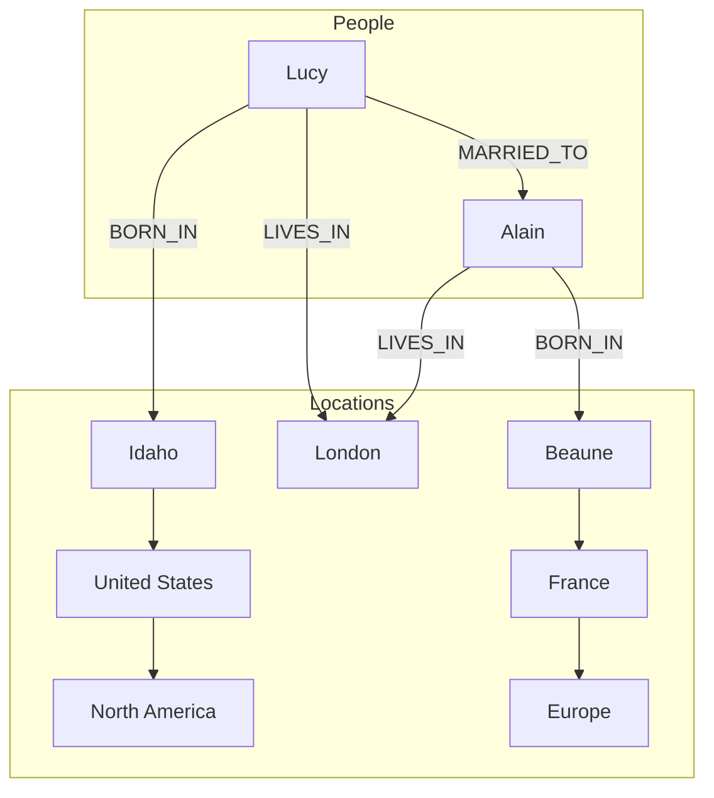

# 第2章 数据模型与查询语言

> 我的语言的界限意味着我的世界的界限。
>
> — Ludwig Wittgenstein，《逻辑哲学论》（1922）

数据模型也许是开发软件最重要的部分，因为它们有如此深远的影响：不仅影响软件的编写方式，还影响我们如何思考要解决的问题。

大多数应用通过在一层之上叠加另一层数据模型来构建。对于每一层，关键问题是：如何用下一层的术语表示？例如：

1. **作为应用开发者**，你审视现实世界（有人、组织、商品、行为、资金流、传感器等），并用对象或数据结构以及操作这些数据结构的 API 来建模。这些结构通常特定于你的应用。
2. **当你想存储这些数据结构时**，你用通用数据模型表达它们，如 JSON 或 XML 文档、关系数据库中的表或图模型。
3. **构建数据库软件的工程师**决定了如何用内存、磁盘或网络上的字节表示这些 JSON/XML/关系/图数据。该表示可能允许以各种方式查询、搜索、操作和处理数据。
4. **在更低的层级**，硬件工程师已经弄清楚了如何用电流、光脉冲、磁场等表示字节。

在复杂应用中可能有更多中间层，如 API 之上的 API，但基本思想仍然相同：每一层通过提供干净的数据模型来隐藏下面各层的复杂度。这些抽象允许不同群体——例如数据库供应商的工程师和使用其数据库的应用开发者——有效地协作。

数据模型有很多种，每种数据模型都体现了关于其将如何使用的假设。某些用法容易，某些不受支持；某些操作快，某些表现差；某些数据转换感觉自然，某些则笨拙。

掌握单一数据模型可能需要大量努力（想想有多少关于关系数据建模的书）。即使只使用一种数据模型而不担心其内部运作，构建软件已经够难了。但由于数据模型对之上软件能做什么和不能做什么有如此深远的影响，选择适合应用的数据模型很重要。

在本章中，我们将研究一系列用于数据存储和查询的通用数据模型（前述列表中的第 2 点）。特别是，我们将比较关系模型、文档模型和几种基于图的数据模型。我们还将研究各种查询语言并比较它们的用例。在第 3 章中，我们将讨论存储引擎如何工作；即这些数据模型如何实际实现（列表中的第 3 点）。

## 关系模型与文档模型

当今最著名的数据模型可能是 SQL 的数据模型，基于 Edgar Codd 在 1970 年提出的关系模型 [1]：数据被组织成关系（在 SQL 中称为表），其中每个关系是无序的元组（在 SQL 中为行）集合。

关系模型是一个理论提案，当时许多人怀疑它能否被高效实现。然而，到 1980 年代中期，关系数据库管理系统（RDBMS）和 SQL 已成为大多数需要存储和查询某种规则结构数据的人的首选工具。关系数据库的主导地位持续了约 25–30 年——在计算史上这是永恒。

关系数据库的根源在于业务数据处理，在 1960 和 70 年代在大型机上执行。从今天的角度看，用例显得平凡：通常是事务处理（录入销售或银行交易、航空公司预订、仓库库存）和批处理（客户发票、工资单、报告）。

当时的其他数据库迫使应用开发者大量考虑数据库中数据的内部表示。关系模型的目标是将这些实现细节隐藏在更干净的接口后面。

多年来，数据存储和查询有许多竞争方法。在 1970 年代和 80 年代初，网络模型和层次模型是主要替代方案，但关系模型最终主导了它们。对象数据库在 80 年代末和 90 年代初兴起又衰落。XML 数据库在 2000 年代初出现，但只获得了小众采用。关系模型的每个竞争对手在其时代都产生了大量炒作，但从未持久 [2]。

随着计算机变得 vastly 更强大和联网，它们开始被用于越来越多样化的目的。值得注意的是，关系数据库被证明可以很好地泛化，超越其最初的业务数据处理范围，适用于各种用例。你今天在网络上看到的大部分内容仍然由关系数据库驱动，无论是在线出版、讨论、社交网络、电子商务、游戏、软件即服务生产力应用，还是更多。

### NoSQL 的诞生

现在，在 2010 年代，NoSQL 是推翻关系模型主导地位的最新尝试。「NoSQL」这个名字不幸，因为它实际上并不指任何特定技术——它最初只是 2009 年关于开源、分布式、非关系数据库的 meetup 的一个 catchy Twitter 标签 [3]。尽管如此，这个词触动了神经，并迅速在 Web 创业社区及更广泛范围内传播。许多有趣的数据库系统现在与 #NoSQL 标签相关联，它被追溯性地重新解释为 Not Only SQL [4]。

采用 NoSQL 数据库有几个驱动力，包括：

- 需要比关系数据库更容易实现的更大可扩展性，包括非常大的数据集或非常高的写入吞吐量
- 普遍偏好免费开源软件而非商业数据库产品
- 关系模型支持不佳的专用查询操作
- 对关系模式限制性的挫败感，以及对更动态和富有表现力的数据模型的渴望 [5]

不同应用有不同的需求，一个用例的最佳技术选择可能与另一个用例的最佳选择大不相同。因此，在可预见的未来，关系数据库似乎将继续与各种非关系数据存储一起使用——这种想法有时被称为**多语言持久化**（polyglot persistence）[3]。

### 对象-关系不匹配

当今大多数应用开发是在面向对象编程语言中完成的，这导致了对 SQL 数据模型的常见批评：如果数据存储在关系表中，应用代码中的对象与表、行、列的数据模型之间需要笨拙的转换层。模型之间的脱节有时被称为**阻抗不匹配**（impedance mismatch）。

像 ActiveRecord 和 Hibernate 这样的**对象-关系映射**（ORM）框架减少了这种转换层所需的样板代码量，但它们无法完全隐藏两种模型之间的差异。

例如，下图说明了如何用关系模式表示简历（LinkedIn 个人资料）。整个资料可以由唯一标识符 `user_id` 标识。`first_name` 和 `last_name` 等字段每个用户恰好出现一次，因此可以建模为 `users` 表上的列。然而，大多数人职业生涯中有过多份工作（positions），人们可能有不同数量的教育时期和任意数量的联系方式。从用户到这些项目存在一对多关系，可以用各种方式表示：

- **在传统 SQL 模型中**（SQL:1999 之前），最常见的规范化表示是将 positions、education 和 contact information 放在单独的表中，带有对 `users` 表的外键引用，如图 2-1 所示。
- **SQL 标准的后续版本**添加了对结构化数据类型和 XML 数据的支持；这允许在多值数据存储在单行内，并支持在这些文档内查询和索引。Oracle、IBM DB2、MS SQL Server 和 PostgreSQL 在不同程度上支持这些特性 [6, 7]。包括 IBM DB2、MySQL 和 PostgreSQL 在内的多个数据库也支持 JSON 数据类型 [8]。
- **第三种选择**是将 jobs、education 和 contact info 编码为 JSON 或 XML 文档，存储在数据库的文本列中，让应用解释其结构和内容。在这种设置中，你通常无法使用数据库查询该编码列内的值。

对于像简历这样的数据结构，主要是自包含的文档，JSON 表示可能相当合适：见示例 2-1。JSON 比 XML 简单得多，具有吸引力。MongoDB [9]、RethinkDB [10]、CouchDB [11] 和 Espresso [12] 等面向文档的数据库支持这种数据模型。

**示例 2-1. 将 LinkedIn 个人资料表示为 JSON 文档**

```json
{
  "user_id":     251,
  "first_name":  "Bill",
  "last_name":   "Gates",
  "summary":     "Co-chair of the Bill & Melinda Gates... Active blogger.",
  "region_id":   "us:91",
  "industry_id": 131,
  "photo_url":   "/p/7/000/253/05b/308dd6e.jpg",
  "positions": [
    {"job_title": "Co-chair", "organization": "Bill & Melinda Gates Foundation"},
    {"job_title": "Co-founder, Chairman", "organization": "Microsoft"}
  ],
  "education": [
    {"school_name": "Harvard University",       "start": 1973, "end": 1975},
    {"school_name": "Lakeside School, Seattle", "start": null, "end": null}
  ],
  "contact_info": {
    "blog":    "http://thegatesnotes.com",
    "twitter": "http://twitter.com/BillGates"
  }
}
```

一些开发者认为 JSON 模型减少了应用代码和存储层之间的阻抗不匹配。然而，正如我们将在第 4 章看到的，JSON 作为数据编码格式也存在问题。缺乏模式经常被引用为优势；我们将在第 39 页「文档模型中的模式灵活性」中讨论这一点。

与图 2-1 中的多表模式相比，JSON 表示具有更好的**局部性**（locality）。如果你想在关系示例中获取资料，你需要执行多次查询（按 `user_id` 查询每个表）或在 `users` 表与其从属表之间执行混乱的多路连接。在 JSON 表示中，所有相关信息都在一个地方，一次查询就足够了。

从用户资料到用户的 positions、教育历史和联系信息的一对多关系意味着数据中的树结构，JSON 表示使这种树结构显式化。

### 多对一与多对多关系

在前一节的示例 2-1 中，`region_id` 和 `industry_id` 被给定为 ID，而不是纯文本字符串 "Greater Seattle Area" 和 "Philanthropy"。为什么？

如果用户界面有用于输入地区和行业的自由文本字段，将它们存储为纯文本字符串是有意义的。但拥有地理区域和行业的标准列表并让用户从下拉列表或自动完成器中选择有优势：

- 跨资料的一致风格和拼写
- 避免歧义（例如，如果有多个同名城市）
- 易于更新——名称只存储在一个地方，因此如果需要更改，可以轻松全面更新（例如，由于政治事件更改城市名称）
- 本地化支持——当网站翻译成其他语言时，标准列表可以本地化，因此地区和行业可以以查看者的语言显示
- 更好的搜索——例如，对华盛顿州慈善家的搜索可以匹配此资料，因为地区列表可以编码西雅图在华盛顿的事实（从字符串 "Greater Seattle Area" 看不出来）

无论你存储 ID 还是文本字符串，都是重复的问题。当你使用 ID 时，对人类有意义的信息（如 Philanthropy 这个词）只存储在一个地方，引用它的一切都使用 ID（仅在数据库内有意义）。当你直接存储文本时，你在使用它的每条记录中重复人类有意义的信息。

使用 ID 的优势在于，因为它对人类没有意义，所以永远不需要改变：即使它标识的信息发生变化，ID 也可以保持不变。对人类有意义的任何东西可能在未来某个时候需要改变——如果该信息被重复，所有冗余副本都需要更新。这会产生写入开销，并存在不一致的风险（信息的某些副本被更新而其他没有）。消除这种重复是数据库中**规范化**（normalization）背后的关键思想。

不幸的是，规范化这些数据需要多对一关系（许多人生活在特定地区，许多人在特定行业工作），这些关系不能很好地适应文档模型。在关系数据库中，通过 ID 引用其他表中的行是正常的，因为连接很容易。在文档数据库中，一对多树结构不需要连接，对连接的支持通常很弱。

如果数据库本身不支持连接，你必须在应用代码中通过向数据库发出多次查询来模拟连接。（在这种情况下，地区和行业列表可能足够小且变化缓慢，应用可以简单地将它们保存在内存中。但尽管如此，进行连接的工作从数据库转移到了应用代码。）

此外，即使应用的初始版本很好地适合无连接的文档模型，随着功能添加到应用，数据往往变得更加互连。例如，考虑我们可以对简历示例进行的一些更改：

**组织和学校作为实体**：在之前的描述中，organization（用户工作的公司）和 school_name（他们学习的地方）只是字符串。也许它们应该是实体的引用？然后每个组织、学校或大学可以有自己的网页（带有徽标、新闻源等）；每份简历可以链接到它提到的组织和学校，并包含它们的徽标和其他信息。

**推荐**：假设你想添加新功能：一个用户可以为另一个用户写推荐。推荐显示在被推荐用户的简历上，以及写推荐的用户的姓名和照片。如果推荐者更新了他们的照片，他们写过的任何推荐都需要反映新照片。因此，推荐应该有对作者资料的引用。

这些新功能需要多对多关系。每个虚线矩形内的数据可以分组到一个文档中，但对组织、学校和其他用户的引用需要表示为引用，并在查询时需要连接。

### 文档数据库在重蹈覆辙吗？

虽然多对多关系和连接在关系数据库中 routinely 使用，但文档数据库和 NoSQL 重新开启了关于如何在数据库中最好地表示这种关系的辩论。这场辩论比 NoSQL 古老得多——事实上，它可以追溯到最早的计算机化数据库系统。

1970 年代业务数据处理最流行的数据库是 IBM 的**信息管理系统**（IMS），最初为阿波罗太空计划的库存管理开发，1968 年首次商业发布 [13]。它今天仍在使用和维护，在 IBM 大型机上运行 OS/390 [14]。

IMS 的设计使用了一个相当简单的数据模型，称为**层次模型**，与文档数据库使用的 JSON 模型有一些显著的相似之处 [2]。它将所有数据表示为嵌套在记录内的记录树，很像图 2-2 的 JSON 结构。

像文档数据库一样，IMS 对一对多关系工作良好，但它使多对多关系变得困难，并且不支持连接。开发者必须决定是重复（反规范化）数据还是手动解析从一个记录到另一个记录的引用。1960 和 70 年代的这些问题与开发者今天使用文档数据库遇到的问题非常相似 [15]。

提出了各种解决方案来解决层次模型的限制。最突出的两个是**关系模型**（成为 SQL，并接管了世界）和**网络模型**（最初有大量追随者但最终淡入 obscurity）。这两个阵营之间的「大辩论」持续了 1970 年代的大部分时间 [2]。

由于两个模型解决的问题今天仍然如此相关，值得简要以今天的眼光重新审视这场辩论。

**网络模型**：网络模型由名为数据系统语言会议（CODASYL）的委员会标准化，由几个不同的数据库供应商实现；它也被称为 CODASYL 模型 [16]。

CODASYL 模型是层次模型的泛化。在层次模型的树结构中，每条记录恰好有一个父节点；在网络模型中，一条记录可以有多个父节点。例如，可以有一条 "Greater Seattle Area" 地区的记录，每个居住在该地区的用户都可以链接到它。这允许建模多对一和多对多关系。

网络模型中记录之间的链接不是外键，而更像编程语言中的指针（同时存储在磁盘上）。访问记录的唯一方式是沿着这些链接链从根记录开始跟随路径。这被称为**访问路径**（access path）。

在最简单的情况下，访问路径可以像遍历链表：从列表头部开始，一次查看一条记录直到找到想要的。但在多对多关系的世界中，几条不同的路径可以通向同一条记录，使用网络模型的程序员必须在脑海中跟踪这些不同的访问路径。

CODASYL 中的查询通过迭代记录列表和跟随访问路径在数据库中移动游标来执行。如果一条记录有多个父节点（即来自其他记录的多条传入指针），应用代码必须跟踪所有各种关系。即使 CODASYL 委员会成员也承认这就像在 n 维数据空间中导航 [17]。

虽然手动访问路径选择能够最有效地利用 1970 年代非常有限的硬件能力（如磁带驱动器，其寻道极其缓慢），但问题是它们使查询和更新数据库的代码复杂且不灵活。对于层次模型和网络模型，如果你没有通向所需数据的路径，你就处于困境。你可以更改访问路径，但然后你必须通过大量手写的数据库查询代码并重写它以处理新的访问路径。对应用的数据模型进行更改很困难。

**关系模型**：相比之下，关系模型所做的就是将所有数据公开：关系（表）只是元组（行）的集合，仅此而已。没有迷宫般的嵌套结构，没有如果你想查看数据需要跟随的复杂访问路径。你可以读取表中的任意或所有行，选择匹配任意条件的行。你可以通过将某些列指定为键并匹配它们来读取特定行。你可以在不担心与其他表的外键关系的情况下向任何表插入新行。

在关系数据库中，查询优化器自动决定查询的哪些部分以什么顺序执行，以及使用哪些索引。这些选择 effectively 是「访问路径」，但 big 区别在于它们是由查询优化器自动做出的，而不是由应用开发者做出的，所以我们很少需要考虑它们。

如果你想以新方式查询数据，你可以只需声明新索引，查询将自动使用最合适的索引。你不需要更改查询以利用新索引。（另见第 42 页「数据的查询语言」。）因此，关系模型使向应用添加新功能变得容易得多。

关系数据库的查询优化器是复杂的野兽，它们消耗了多年的研究和开发努力 [18]。但关系模型的一个关键洞察是：你只需要构建一次查询优化器，然后使用数据库的所有应用都可以从中受益。如果你没有查询优化器，为特定查询手写访问路径比编写通用优化器更容易——但通用解决方案从长远来看会赢。

**与文档数据库的比较**：文档数据库在一个方面回退到层次模型：将嵌套记录（一对多关系，如图 2-1 中的 positions、education 和 contact_info）存储在其父记录内，而不是在单独的表中。

然而，在表示多对一和多对多关系方面，关系数据库和文档数据库并没有根本不同：在这两种情况下，相关项都由唯一标识符引用，在关系模型中称为外键，在文档模型中称为文档引用 [9]。该标识符在读取时通过使用连接或后续查询来解析。迄今为止，文档数据库没有走 CODASYL 的道路。

## 关系数据库与文档数据库的现状

在比较关系数据库和文档数据库时，有许多差异需要考虑，包括它们的容错特性（见第 5 章）和并发处理（见第 7 章）。在本章中，我们将只关注数据模型中的差异。

支持文档数据模型的主要论点是模式灵活性、由于局部性带来的更好性能，以及对某些应用来说它更接近应用使用的数据结构。关系模型通过提供更好的连接支持以及多对一和多对多关系来反驳。

**哪种数据模型导致更简单的应用代码？**

如果你的应用中的数据具有类似文档的结构（即一对多关系的树，通常整个树一次加载），那么使用文档模型可能是个好主意。关系技术将类似文档的结构切分（shredding）成多个表（如图 2-1 中的 positions、education 和 contact_info）可能导致笨拙的模式和不必要的复杂应用代码。

文档模型有局限性：例如，你无法直接引用文档内的嵌套项，而是需要说类似「用户 251 的 positions 列表中的第二项」（很像层次模型中的访问路径）。然而，只要文档嵌套不太深，这通常不是问题。

文档数据库中连接支持差可能是也可能不是问题，取决于应用。例如，使用文档数据库记录哪些事件在何时发生的分析应用可能永远不需要多对多关系 [19]。

然而，如果你的应用确实使用多对多关系，文档模型变得不那么有吸引力。可以通过反规范化减少对连接的需求，但然后应用代码需要做额外的工作来保持反规范化数据一致。可以通过向数据库发出多次请求在应用代码中模拟连接，但这也将复杂度移入应用，通常比数据库内专用代码执行的连接慢。在这种情况下，使用文档模型可能导致明显更复杂的应用代码和更差的性能 [15]。

无法笼统地说哪种数据模型导致更简单的应用代码；这取决于数据项之间存在的关系类型。对于高度互连的数据，文档模型笨拙，关系模型可接受，图模型（见第 49 页「类图数据模型」）最自然。

**文档模型中的模式灵活性**

大多数文档数据库以及关系数据库中的 JSON 支持不对文档中的数据强制执行任何模式。关系数据库中的 XML 支持通常带有可选的模式验证。无模式意味着可以向文档添加任意键和值，在读取时，客户端对文档可能包含哪些字段没有保证。

文档数据库有时被称为无模式（schemaless），但这是误导性的，因为读取数据的代码通常假设某种结构——即存在隐式模式，但数据库不强制执行 [20]。更准确的术语是**读时模式**（schema-on-read）（数据的结构是隐式的，仅在读取数据时解释），与**写时模式**（schema-on-write）（关系数据库的传统方法，模式是显式的，数据库确保所有写入的数据符合它）[21] 形成对比。

读时模式类似于编程语言中的动态（运行时）类型检查，而写时模式类似于静态（编译时）类型检查。正如静态和动态类型检查的倡导者就它们的相对优点进行激烈辩论 [22] 一样，数据库中模式的强制执行是一个有争议的话题，一般来说没有对错答案。

在应用想要更改其数据格式的情况下，方法之间的差异特别明显。例如，假设你当前在每个用户的一个字段中存储全名，而你想分别存储名字和姓氏 [23]。在文档数据库中，你只需开始用新字段编写新文档，并在应用中处理读取旧文档时的代码。例如：

```javascript
if (user && user.name && !user.first_name) {
    // Documents written before Dec 8, 2013 don't have first_name
    user.first_name = user.name.split(" ")[0];
}
```

另一方面，在「静态类型」数据库模式中，你通常会执行类似以下的迁移：

```sql
ALTER TABLE users ADD COLUMN first_name text;
UPDATE users SET first_name = split_part(name, ' ', 1);      -- PostgreSQL
UPDATE users SET first_name = substring_index(name, ' ', 1);  -- MySQL
```

模式更改有缓慢且需要停机的坏名声。这个名声并不完全应得：大多数关系数据库系统在几毫秒内执行 `ALTER TABLE` 语句。MySQL 是一个 notable 例外——它在 `ALTER TABLE` 时复制整个表，在更改大表时可能意味着几分钟甚至几小时的停机——尽管存在各种工具可以解决此限制 [24, 25, 26]。

在大表上运行 `UPDATE` 语句在任何数据库上可能都很慢，因为每一行都需要重写。如果那不可接受，应用可以将 `first_name` 保留为其默认值 NULL，并在读取时填充，就像使用文档数据库一样。

如果集合中的项目由于某种原因并非都具有相同的结构（即数据是异构的），读时模式方法是有利的——例如，因为：

- 有许多不同类型的对象，将每种类型的对象放在自己的表中不切实际
- 数据的结构由你无法控制的外部系统决定，可能随时改变

在这种情况下，模式可能弊大于利，无模式文档可能是更自然的数据模型。但在所有记录预期具有相同结构的情况下，模式是记录和执行该结构的有用机制。我们将在第 4 章更详细地讨论模式和模式演化。

**查询的数据局部性**

文档通常存储为单个连续字符串，编码为 JSON、XML 或其二进制变体（如 MongoDB 的 BSON）。如果你的应用经常需要访问整个文档（例如，在网页上渲染它），这种存储局部性有性能优势。如果数据像图 2-1 那样分布在多个表中，则需要多次索引查找来检索全部，这可能需要更多磁盘寻道并花费更多时间。

局部性优势仅在你需要同时访问文档的大部分时才适用。数据库通常需要加载整个文档，即使你只访问其中的一小部分，在大文档上可能是浪费。在更新文档时，通常需要重写整个文档——只有不改变文档编码大小的修改才能轻松就地执行 [19]。因此，通常建议保持文档相当小，避免增加文档大小的写入 [9]。

这些性能限制显著减少了文档数据库有用的场景集。

值得指出的是，为了局部性将相关数据分组在一起的想法不仅限于文档模型。例如，Google 的 Spanner 数据库在关系数据模型中提供相同的局部性属性，允许模式声明表的行应该交错（嵌套）在父表内 [27]。Oracle 使用称为多表索引簇表的功能允许相同 [28]。Bigtable 数据模型中的列族概念（用于 Cassandra 和 HBase）具有管理局部性的类似目的 [29]。

我们将在第 3 章中看到更多关于局部性的内容。

**文档和关系数据库的融合**

大多数关系数据库系统（除 MySQL 外）自 2000 年代中期以来支持 XML。这包括对 XML 文档进行本地修改的函数以及在 XML 文档内索引和查询的能力，这允许应用使用与使用文档数据库时非常相似的数据模型。

PostgreSQL 自 9.3 版 [8]、MySQL 自 5.7 版、IBM DB2 自 10.5 版 [30] 也对 JSON 文档有类似级别的支持。鉴于 JSON 在 Web API 中的流行，其他关系数据库可能会效仿并添加 JSON 支持。

在文档数据库方面，RethinkDB 在其查询语言中支持类似关系的连接，一些 MongoDB 驱动程序自动解析数据库引用（effectively 执行客户端连接，尽管这可能比在数据库中执行的连接慢，因为它需要额外的网络往返且优化较少）。

关系数据库和文档数据库似乎随着时间的推移变得越来越相似，这是一件好事：数据模型相互补充。如果数据库能够处理类似文档的数据并对其执行关系查询，应用可以使用最适合其需求的特性组合。

关系模型和文档模型的混合是数据库未来的良好路线。

## 数据的查询语言

当引入关系模型时，它包含了一种新的数据查询方式：SQL 是一种**声明式**（declarative）查询语言，而 IMS 和 CODASYL 使用**命令式**（imperative）代码查询数据库。这意味着什么？

许多常用编程语言是命令式的。例如，如果你有一个动物物种列表，你可能会写这样的代码来只返回列表中的鲨鱼：

```javascript
function getSharks() {
    var sharks = [];
    for (var i = 0; i < animals.length; i++) {
        if (animals[i].family === "Sharks") {
            sharks.push(animals[i]);
        }
    }
    return sharks;
}
```

在关系代数中，你会写：

$$sharks = \sigma_{family = \text{"Sharks"}}(animals)$$

其中 σ（希腊字母 sigma）是选择运算符，只返回匹配条件 `family = "Sharks"` 的动物。

当定义 SQL 时，它相当紧密地遵循关系代数的结构：

```sql
SELECT * FROM animals WHERE family = 'Sharks';
```

命令式语言告诉计算机以特定顺序执行某些操作。你可以想象逐行单步执行代码，评估条件，更新变量，并决定是否再循环一次。

在声明式查询语言中，如 SQL 或关系代数，你只需指定所需数据的模式——结果必须满足的条件，以及你希望数据如何转换（例如，排序、分组和聚合）——而不是如何实现该目标。由数据库系统的查询优化器决定使用哪些索引和哪些连接方法，以及以什么顺序执行查询的各个部分。

声明式查询语言有吸引力，因为它通常比命令式 API 更简洁、更容易使用。但更重要的是，它还隐藏了数据库引擎的实现细节，这使得数据库系统可以在不要求对查询进行任何更改的情况下引入性能改进。

例如，在本节开头显示的命令式代码中，动物列表以特定顺序出现。如果数据库想在幕后回收未使用的磁盘空间，它可能需要移动记录，改变动物出现的顺序。数据库能否安全地这样做而不破坏查询？

SQL 示例不保证任何特定顺序，因此如果顺序改变它也不介意。但如果查询被写成命令式代码，数据库永远无法确定代码是否依赖顺序。SQL 在功能上更有限这一事实为数据库提供了更多自动优化的空间。

最后，声明式语言通常适合并行执行。如今，CPU 通过添加更多核心而不是以比以前显著更高的时钟速度运行而变得更快 [31]。命令式代码很难在多个核心和多台机器上并行化，因为它指定了必须以特定顺序执行的指令。声明式语言有更好的机会在并行执行中更快，因为它们只指定结果的模式，而不是用于确定结果的算法。如果合适，数据库可以自由使用查询语言的并行实现 [32]。

### Web 上的声明式查询

声明式查询语言的优势不仅限于数据库。为了说明这一点，让我们在完全不同的环境中比较声明式和命令式方法：Web 浏览器。

假设你有一个关于海洋动物的网站。用户当前正在查看鲨鱼页面，因此你将导航项「Sharks」标记为当前选中，如下所示：

```html
<ul>
    <li class="selected"> 
        <p>Sharks</p> 
        <ul>
            <li>Great White Shark</li>
            <li>Tiger Shark</li>
            <li>Hammerhead Shark</li>
        </ul>
    </li>
    <li>
        <p>Whales</p>
        <ul>
            <li>Blue Whale</li>
            <li>Humpback Whale</li>
            <li>Fin Whale</li>
        </ul>
    </li>
</ul>
```

选中的项用 CSS 类 "selected" 标记。`<p>Sharks</p>` 是当前选中页面的标题。

现在假设你希望当前选中页面的标题有蓝色背景，以便在视觉上突出显示。使用 CSS 很容易：

```css
li.selected > p {
    background-color: blue;
}
```

这里 CSS 选择器 `li.selected > p` 声明了我们想要应用蓝色样式的元素模式：即，直接父级是带有 CSS 类 selected 的 `<li>` 元素的所有 `<p>` 元素。示例中的 `<p>Sharks</p>` 匹配此模式，但 `<p>Whales</p>` 不匹配，因为其 `<li>` 父级缺少 `class="selected"`。

在 Web 浏览器中，使用声明式 CSS 样式比在 JavaScript 中命令式操作样式要好得多。同样，在数据库中，像 SQL 这样的声明式查询语言被证明比命令式查询 API 好得多。

### MapReduce 查询

MapReduce 是一种在多台机器上批量处理大量数据的编程模型，由 Google 推广 [33]。一些 NoSQL 数据存储（包括 MongoDB 和 CouchDB）支持 MapReduce 的有限形式，作为跨多个文档执行只读查询的机制。

MapReduce 一般在第 10 章有更详细的描述。现在，我们只简要讨论 MongoDB 对该模型的使用。

MapReduce 既不是声明式查询语言，也不是完全命令式查询 API，而是介于两者之间：查询逻辑用代码片段表达，由处理框架重复调用。它基于许多函数式编程语言中存在的 map（也称为 collect）和 reduce（也称为 fold 或 inject）函数。

举例来说，假设你是海洋生物学家，每次在海洋中看到动物时都会向数据库添加观察记录。现在你想生成一份报告，说明你每月目击了多少鲨鱼。

在 PostgreSQL 中，你可以这样表达该查询：

```sql
SELECT date_trunc('month', observation_timestamp) AS observation_month, 
       sum(num_animals) AS total_animals
FROM observations
WHERE family = 'Sharks'
GROUP BY observation_month;
```

`date_trunc('month', timestamp)` 函数确定包含 timestamp 的日历月，并返回表示该月开始的另一个 timestamp。换句话说，它将 timestamp 向下舍入到最近的月。

此查询首先过滤观察结果以仅显示 Sharks 科的物种，然后按发生观察的日历来分组，最后将该月所有观察中看到的动物数量相加。

使用 MongoDB 的 MapReduce 功能可以这样表达：

```javascript
db.observations.mapReduce(
    function map() { 
        var year  = this.observationTimestamp.getFullYear();
        var month = this.observationTimestamp.getMonth() + 1;
        emit(year + "-" + month, this.numAnimals); 
    },
    function reduce(key, values) { 
        return Array.sum(values); 
    },
    {
        query: { family: "Sharks" }, 
        out: "monthlySharkReport" 
    }
);
```

MapReduce 的可用性问题是，你必须编写两个仔细协调的 JavaScript 函数，这通常比编写单个查询更难。此外，声明式查询语言为查询优化器提供了更多改进查询性能的机会。因此，MongoDB 2.2 添加了对称为聚合管道的声明式查询语言的支持 [9]。在这种语言中，相同的鲨鱼计数查询看起来像这样：

```javascript
db.observations.aggregate([
    { $match: { family: "Sharks" } },
    { $group: {
        _id: {
            year:  { $year:  "$observationTimestamp" },
            month: { $month: "$observationTimestamp" }
        },
        totalAnimals: { $sum: "$numAnimals" }
    } }
]);
```

聚合管道语言在表达能力上与 SQL 的子集类似，但它使用基于 JSON 的语法而不是 SQL 的英语句子风格语法；差异也许只是品味问题。这个故事的寓意是，NoSQL 系统可能会意外地重新发明 SQL，尽管是伪装的。

## 类图数据模型

我们之前看到，多对多关系是不同数据模型之间的重要区分特征。如果你的应用主要有一对多关系（树结构数据）或记录之间没有关系，文档模型是合适的。

但如果多对多关系在你的数据中非常常见怎么办？关系模型可以处理多对多关系的简单情况，但随着数据内的连接变得更加复杂，开始将数据建模为图变得更加自然。

图由两种对象组成：**顶点**（vertices，也称为节点或实体）和**边**（edges，也称为关系或弧）。许多类型的数据可以建模为图。典型例子包括：

- **社交图**：顶点是人，边表示谁认识谁
- **Web 图**：顶点是网页，边表示指向其他页面的 HTML 链接
- **道路或铁路网络**：顶点是交叉点，边表示它们之间的道路或铁路线

著名算法可以在这些图上操作：例如，汽车导航系统在道路网络中搜索两点之间的最短路径，PageRank 可以在 Web 图上用于确定网页的流行度及其在搜索结果中的排名。

在刚才给出的例子中，图中的所有顶点表示同一种东西（分别是人、网页或道路交叉点）。然而，图不限于这种同质数据：图的同样强大的用途是为在单个数据存储中存储完全不同类型的对象提供一致的方式。例如，Facebook 维护一个具有许多不同类型顶点和边的单一图：顶点表示人、地点、事件、签到和用户发表的评论；边表示谁与谁是朋友、哪个签到发生在哪个地点、谁评论了哪篇帖子、谁参加了哪个活动等 [35]。

在本节中，我们将使用下图所示的例子。它可以来自社交网络或家谱数据库：它显示两个人，来自爱达荷州的 Lucy 和来自法国博讷的 Alain。他们已婚并住在伦敦。



### 属性图

在属性图模型中，每个顶点由以下组成：

- 唯一标识符
- 一组出边
- 一组入边
- 属性集合（键值对）

每条边由以下组成：

- 唯一标识符
- 边开始的顶点（尾顶点）
- 边结束的顶点（头顶点）
- 描述两个顶点之间关系类型的标签
- 属性集合（键值对）

你可以将图存储视为由两个关系表组成，一个用于顶点，一个用于边，如示例 2-2 所示（此模式使用 PostgreSQL 的 json 数据类型存储每个顶点或边的属性）。

**示例 2-2. 使用关系模式表示属性图**

```sql
CREATE TABLE vertices (
    vertex_id   integer PRIMARY KEY,
    properties  json
);
CREATE TABLE edges (
    edge_id     integer PRIMARY KEY,
    tail_vertex integer REFERENCES vertices (vertex_id),
    head_vertex integer REFERENCES vertices (vertex_id),
    label       text,
    properties  json
);
CREATE INDEX edges_tails ON edges (tail_vertex);
CREATE INDEX edges_heads ON edges (head_vertex);
```

此模型的一些重要方面是：

1. 任何顶点都可以有连接它与任何其他顶点的边。没有限制哪些类型的事物可以或不可以关联的模式。
2. 给定任何顶点，你可以高效地找到其入边和出边，从而遍历图——即，沿着顶点链跟随路径——向前和向后。
3. 通过为不同类型的关系使用不同的标签，你可以在单个图中存储几种不同的信息，同时保持干净的数据模型。

### Cypher 查询语言

Cypher 是属性图的声明式查询语言，为 Neo4j 图数据库创建 [37]。

**示例 2-3. 图 2-5 中数据的子集，表示为 Cypher 查询**

```cypher
CREATE
  (NAmerica:Location {name:'North America', type:'continent'}),
  (USA:Location      {name:'United States', type:'country'}),
  (Idaho:Location    {name:'Idaho',         type:'state'}),
  (Lucy:Person       {name:'Lucy'}),
  (Idaho) -[:WITHIN]-> (USA) -[:WITHIN]-> (NAmerica),
  (Lucy)  -[:BORN_IN]-> (Idaho)
```

**示例 2-4. 查找从美国移民到欧洲的人的 Cypher 查询**

```cypher
MATCH
  (person) -[:BORN_IN]-> () -[:WITHIN*0..]-> (us:Location {name:'United States'}),
  (person) -[:LIVES_IN]-> () -[:WITHIN*0..]-> (eu:Location {name:'Europe'})
RETURN person.name
```

### SQL 中的图查询

如果我们将图数据放在关系结构中，我们也能用 SQL 查询吗？答案是肯定的，但有些困难。在关系数据库中，你通常事先知道查询中需要哪些连接。在图查询中，你可能需要在找到要查找的顶点之前遍历可变数量的边——即，连接的数量不是事先固定的。

自 SQL:1999 以来，可以使用称为**递归公用表表达式**（`WITH RECURSIVE` 语法）的东西在查询中表达可变长度遍历路径的想法。示例 2-5 显示了相同的查询——查找从美国移民到欧洲的人的姓名——使用此技术在 SQL 中表达（PostgreSQL、IBM DB2、Oracle 和 SQL Server 支持）。

### 三元组存储与 SPARQL

三元组存储模型与属性图模型大多等价，用不同的词描述相同的想法。尽管如此，值得讨论，因为三元组存储有各种工具和语言，可以成为构建应用工具箱的有价值补充。

在三元组存储中，所有信息以非常简单的三部分语句形式存储：(subject, predicate, object)。例如，在三元组 (Jim, likes, bananas) 中，Jim 是主体，likes 是谓词（动词），bananas 是客体。

### Datalog 基础

Datalog 是比 SPARQL 或 Cypher 古老得多的语言，在 1980 年代被学术界广泛研究 [44, 45, 46]。它在软件工程师中不太知名，但它仍然重要，因为它提供了后续查询语言构建的基础。

**示例 2-10. 图 2-5 中数据的子集，表示为 Datalog 事实**

```prolog
name(namerica, 'North America').
type(namerica, continent).
name(usa, 'United States').
type(usa, country).
within(usa, namerica).
name(idaho, 'Idaho').
type(idaho, state).
within(idaho, usa).
name(lucy, 'Lucy').
born_in(lucy, idaho).
```

**示例 2-11. 与示例 2-4 相同的查询，用 Datalog 表达**

```prolog
within_recursive(Location, Name) :- name(Location, Name).     /* Rule 1 */
within_recursive(Location, Name) :- within(Location, Via),    /* Rule 2 */
                                    within_recursive(Via, Name).
migrated(Name, BornIn, LivingIn) :- name(Person, Name),       /* Rule 3 */
                                    born_in(Person, BornLoc),
                                    within_recursive(BornLoc, BornIn),
                                    lives_in(Person, LivingLoc),
                                    within_recursive(LivingLoc, LivingIn).
?- migrated(Who, 'United States', 'Europe').
/* Who = 'Lucy'. */
```

## 小结

数据模型是一个巨大的主题，在本章中我们快速浏览了各种不同的模型。我们没有空间深入每个模型的所有细节，但希望概述足以激发你进一步了解最适合你应用需求的模型的兴趣。

历史上，数据最初被表示为一棵大树（层次模型），但那不适合表示多对多关系，因此发明了关系模型来解决该问题。最近，开发者发现某些应用也不适合关系模型。新的非关系「NoSQL」数据存储在两个主要方向上分化：

1. **文档数据库**针对数据以自包含文档形式出现且一个文档与另一个文档之间的关系很少的用例。
2. **图数据库**走向相反方向，针对任何东西都可能与任何东西相关的用例。

所有三种模型（文档、关系和图）今天都被广泛使用，每种在各自领域都很好。一种模型可以用另一种模型的术语来模拟——例如，图数据可以在关系数据库中表示——但结果往往笨拙。这就是为什么我们有不同用途的不同系统，而不是一刀切的解决方案。

文档数据库和图数据库的一个共同点是，它们通常不对存储的数据强制执行模式，这可以使应用更容易适应变化的需求。然而，你的应用很可能仍然假设数据具有某种结构；这只是模式是显式的（写时强制执行）还是隐式的（读时处理）的问题。

每种数据模型都带有自己的查询语言或框架，我们讨论了几个例子：SQL、MapReduce、MongoDB 的聚合管道、Cypher、SPARQL 和 Datalog。我们还提到了 CSS 和 XSL/XPath，它们不是数据库查询语言，但有有趣的相似之处。

---

[← 上一章](ch01.md) | [目录](../index.md) | [下一章 →](ch03.md)
