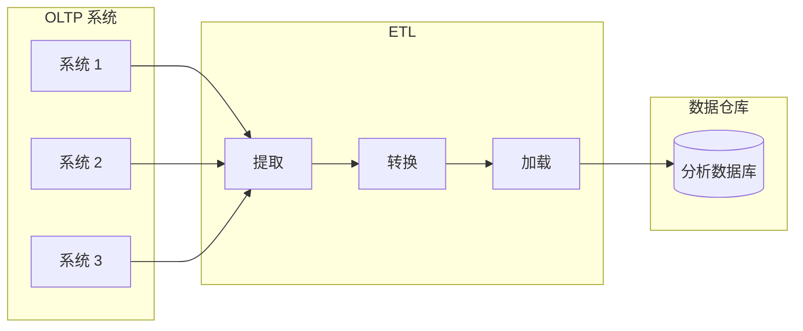

# 第3章 存储与检索

> Wer Ordnung hält, ist nur zu faul zum Suchen.
> （如果你把东西收拾得整整齐齐，你只是懒得去搜索。）
>
> — 德国谚语

在最基本的层面上，数据库需要做两件事：当你给它一些数据时，它应该存储数据，当你稍后再次询问时，它应该把数据还给你。

在第 2 章中，我们讨论了数据模型和查询语言——即你（应用开发者）向数据库提供数据的格式，以及你稍后再次请求数据的机制。在本章中，我们从数据库的角度讨论同样的事情：我们如何存储提供给我们的数据，以及当被请求时如何再次找到它。

作为应用开发者，你为什么应该关心数据库如何在内部处理存储和检索？你可能不会从头实现自己的存储引擎，但你确实需要从众多可用的存储引擎中选择适合你应用的引擎。为了调整存储引擎在你的工作负载类型上表现良好，你需要大致了解存储引擎在幕后做什么。

特别是，针对**事务工作负载**（transactional workloads）优化的存储引擎与针对**分析**（analytics）优化的存储引擎之间存在很大差异。我们将在第 90 页「事务处理还是分析？」中探讨这种区别，并在第 95 页「列式存储」中讨论针对分析优化的存储引擎家族。

然而，我们首先从你可能熟悉的数据库类型中使用的存储引擎开始本章：传统关系数据库，以及大多数所谓的 NoSQL 数据库。我们将研究两个存储引擎家族：**日志结构**（log-structured）存储引擎和**面向页**（page-oriented）的存储引擎（如 B 树）。

## 驱动数据库的数据结构

考虑世界上最简单的数据库，用两个 Bash 函数实现：

```bash
#!/bin/bash
db_set () {
    echo "$1,$2" >> database
}
db_get () {
    grep "^$1," database | sed -e "s/^$1,//" | tail -n 1
}
```

这两个函数实现了一个键值存储。你可以调用 `db_set key value`，它将把 key 和 value 存储在数据库中。key 和 value 可以是（几乎）任何你喜欢的东西——例如，value 可以是 JSON 文档。然后你可以调用 `db_get key`，它查找与该特定 key 关联的最新 value 并返回它。

它有效：

```bash
$ db_set 123456 '{"name":"London","attractions":["Big Ben","London Eye"]}'
$ db_set 42 '{"name":"San Francisco","attractions":["Golden Gate Bridge"]}'
$ db_get 42
{"name":"San Francisco","attractions":["Golden Gate Bridge"]}
```

底层存储格式非常简单：一个文本文件，每行包含一个键值对，用逗号分隔（大致像 CSV 文件，忽略转义问题）。每次调用 `db_set` 都会追加到文件末尾，因此如果你多次更新一个 key，value 的旧版本不会被覆盖——你需要查看文件中 key 的最后一次出现以找到最新 value（因此 `db_get` 中的 `tail -n 1`）：

```bash
$ db_set 42 '{"name":"San Francisco","attractions":["Exploratorium"]}'
$ db_get 42
{"name":"San Francisco","attractions":["Exploratorium"]}
$ cat database
123456,{"name":"London","attractions":["Big Ben","London Eye"]}
42,{"name":"San Francisco","attractions":["Golden Gate Bridge"]}
42,{"name":"San Francisco","attractions":["Exploratorium"]}
```

我们的 `db_set` 函数对于如此简单的东西实际上有相当好的性能，因为追加到文件通常非常高效。与 `db_set` 类似，许多数据库在内部使用**日志**（log），即仅追加的数据文件。真实数据库有更多问题需要处理（如并发控制、回收磁盘空间以便日志不会永远增长、处理错误和部分写入的记录），但基本原理相同。日志非常有用，我们将在本书其余部分多次遇到它们。

::: info 日志的含义
「log」一词经常用于指应用日志，即应用输出描述正在发生的事情的文本。在本书中，log 用于更一般的意义：仅追加的记录序列。它不必是人类可读的；它可能是二进制的，仅供其他程序读取。
:::

另一方面，如果你的数据库中有大量记录，我们的 `db_get` 函数性能很差。每次你想查找一个 key 时，`db_get` 必须从头到尾扫描整个数据库文件，查找 key 的出现。用算法术语来说，查找的成本是 $O(n)$：如果你将数据库中的记录数 $n$ 翻倍，查找需要两倍的时间。那不好。

为了高效地在数据库中找到特定 key 的 value，我们需要不同的数据结构：**索引**（index）。在本章中，我们将研究一系列索引结构并比较它们；它们背后的总体思路是在旁边保留一些额外的元数据，作为路标帮助你定位所需的数据。如果你想以几种不同的方式搜索相同的数据，你可能需要在数据的不同部分上有几个不同的索引。

索引是从主数据派生的附加结构。许多数据库允许你添加和删除索引，这不会影响数据库的内容；它只影响查询的性能。维护附加结构会产生开销，尤其是在写入时。对于写入，很难超越简单追加到文件的性能，因为那是最简单的写入操作。任何类型的索引通常都会减慢写入，因为每次写入数据时索引也需要更新。

这是存储系统中的重要权衡：精心选择的索引加速读取查询，但每个索引都会减慢写入。因此，数据库通常不会默认索引所有内容，而是要求你——应用开发者或数据库管理员——根据你对应用典型查询模式的了解手动选择索引。然后你可以选择为应用带来最大好处的索引，而不会引入不必要的开销。

### 哈希索引

让我们从键值数据的索引开始。这不是你可以索引的唯一数据类型，但它很常见，是更复杂索引的有用构建块。

键值存储与大多数编程语言中可找到的字典类型非常相似，通常实现为**哈希映射**（hash map）。哈希映射在许多算法教科书中都有描述 [1, 2]，所以我们不会在这里详细介绍它们如何工作。既然我们已经有用于内存数据结构的哈希映射，为什么不使用它们来索引磁盘上的数据呢？

假设我们的数据存储仅由追加到文件组成，如前面的例子。那么最简单的索引策略是：在内存中保留一个哈希映射，其中每个 key 映射到数据文件中的字节偏移——可以找到 value 的位置。每当你在文件中追加新的键值对时，你也更新哈希映射以反映你刚写入的数据的偏移（这对插入新 key 和更新现有 key 都有效）。当你想查找 value 时，使用哈希映射找到数据文件中的偏移，寻址到该位置，并读取 value。

这听起来可能过于简单，但这是一个可行的方法。事实上，这 essentially 是 Bitcask（Riak 中的默认存储引擎）所做的 [3]。Bitcask 提供高性能的读取和写入，前提是所有 key 都能放入可用 RAM，因为哈希映射完全保存在内存中。value 可以使用比可用内存更多的空间，因为它们可以仅用一次磁盘寻道从磁盘加载。如果数据文件的该部分已经在文件系统缓存中，读取根本不需要任何磁盘 I/O。

像 Bitcask 这样的存储引擎非常适合每个 key 的 value 经常更新的情况。例如，key 可能是猫视频的 URL，value 可能是它被播放的次数（每次有人点击播放按钮时递增）。在这种工作负载中，有大量写入，但没有太多不同的 key——每个 key 有大量写入，但将所有 key 保存在内存中是可行的。

如前所述，我们只追加到文件——那么我们如何避免最终耗尽磁盘空间？一个好的解决方案是将日志分成一定大小的段，当段文件达到一定大小时关闭它，并随后的写入到新的段文件。然后我们可以对这些段执行**压缩**（compaction），即丢弃日志中的重复 key，只保留每个 key 的最新更新。

此外，由于压缩通常使段小得多（假设一个 key 平均在一个段内被覆盖几次），我们也可以在执行压缩的同时将几个段合并在一起。段在写入后永远不会被修改，因此合并的段被写入新文件。冻结段的合并和压缩可以在后台线程中完成，当它进行时，我们仍然可以继续使用旧段文件正常服务读取和写入请求。合并过程完成后，我们将读取请求切换到使用新合并的段而不是旧段——然后旧段文件可以简单地删除。

每个段现在都有自己的内存哈希表，将 key 映射到文件偏移。为了找到 key 的 value，我们首先检查最近段的哈希映射；如果 key 不存在，我们检查第二最近的段，依此类推。合并过程保持段数量少，因此查找不需要检查许多哈希映射。

使这个简单想法在实践中工作涉及大量细节。简要地，真实实现中一些重要的问题是：

- **文件格式**：CSV 不是日志的最佳格式。使用首先编码字符串字节长度的二进制格式，后跟原始字符串（无需转义）更快更简单。
- **删除记录**：如果你想删除 key 及其关联的 value，你必须向数据文件追加特殊的删除记录（有时称为 tombstone）。当合并日志段时，tombstone 告诉合并过程丢弃已删除 key 的任何先前 value。
- **崩溃恢复**：如果数据库重启，内存哈希映射会丢失。原则上，你可以通过从头到尾读取整个段文件并在过程中记录每个 key 的最新 value 的偏移来恢复每个段的哈希映射。然而，如果段文件很大，那可能需要很长时间，这会使服务器重启痛苦。Bitcask 通过在磁盘上存储每个段哈希映射的快照来加速恢复，可以更快地加载到内存中。
- **部分写入的记录**：数据库可能在任何时候崩溃，包括在向日志追加记录的过程中。Bitcask 文件包括校验和，允许检测和忽略日志的此类损坏部分。
- **并发控制**：由于写入以严格顺序追加到日志，常见的实现选择是只有一个写入线程。数据文件段是仅追加且不可变的，因此它们可以被多个线程并发读取。

仅追加日志乍一看似乎浪费：为什么不就地更新文件，用新 value 覆盖旧 value？但仅追加设计有几个好处：

- 追加和段合并是顺序写入操作，通常比随机写入快得多，尤其是在磁性旋转硬盘上。在某种程度上，顺序写在基于闪存的固态硬盘（SSD）上也是可取的 [4]。
- 如果段文件是仅追加或不可变的，并发和崩溃恢复要简单得多。
- 合并旧段避免了数据文件随时间碎片化的问题。

然而，哈希表索引也有局限性：

- 哈希表必须适合内存，所以如果你有非常多的 key，你就倒霉了。原则上，你可以在磁盘上维护哈希映射，但不幸的是很难使磁盘上的哈希映射表现良好。
- 范围查询效率不高。例如，你无法轻松扫描 `kitty00000` 到 `kitty99999` 之间的所有 key——你必须在哈希映射中单独查找每个 key。

### SSTables 与 LSM 树

在图 3-3 中，每个日志结构存储段是键值对的序列。这些对以写入的顺序出现，日志中较晚的 value 优先于同一 key 的较早 value。除此之外，文件中键值对的顺序无关紧要。

现在我们可以对段文件格式做一个简单的更改：我们要求键值对的序列**按 key 排序**。乍一看，这个要求似乎破坏了我们使用顺序写入的能力，但我们稍后会解决。

我们称这种格式为**排序字符串表**（Sorted String Table），或简称 **SSTable**。我们还要求每个 key 在合并的段文件中只出现一次（压缩过程已经确保这一点）。与带哈希索引的日志段相比，SSTable 有几个大优势：

1. **合并段简单高效**，即使文件比可用内存大。方法类似于归并排序算法中使用的：你并排开始读取输入文件，查看每个文件中的第一个 key，将最低的 key（根据排序顺序）复制到输出文件，并重复。这产生一个新的合并段文件，也按 key 排序。
2. **为了在文件中找到特定 key**，你不再需要在内存中保留所有 key 的索引。例如，假设你在查找 key `handiwork`，但你不知道该 key 在段文件中的确切偏移。然而，你知道 `handbag` 和 `handsome` 的偏移，由于排序，你知道 `handiwork` 必须出现在这两者之间。这意味着你可以跳转到 `handbag` 的偏移并从那里扫描直到找到 `handiwork`（或没有，如果 key 不在文件中）。你仍然需要内存索引来告诉你某些 key 的偏移，但它可以是稀疏的：段文件每几 KB 一个 key 就足够了。
3. 由于读取请求需要扫描请求范围内的几个键值对，可以将这些记录分组到一个块中并在写入磁盘之前压缩它。稀疏内存索引的每个条目然后指向压缩块的开始。除了节省磁盘空间，压缩还减少了 I/O 带宽使用。

**构建和维护 SSTable**

到目前为止还好——但你如何首先让数据按 key 排序？我们的传入写入可以以任何顺序发生。

在磁盘上维护排序结构是可能的（见第 79 页「B 树」），但在内存中维护它要容易得多。有许多众所周知的树数据结构可以使用，如红黑树或 AVL 树 [2]。使用这些数据结构，你可以以任何顺序插入 key 并以排序顺序读回它们。

我们现在可以让我们的存储引擎这样工作：

- 当写入到来时，将其添加到内存中的平衡树数据结构（例如，红黑树）。这个内存树有时称为 **memtable**。
- 当 memtable 变得大于某个阈值——通常是几兆字节——将其作为 SSTable 文件写出到磁盘。这可以高效完成，因为树已经维护按 key 排序的键值对。新的 SSTable 文件成为数据库的最新段。当 SSTable 被写出到磁盘时，写入可以继续到新的 memtable 实例。
- 为了服务读取请求，首先尝试在 memtable 中找到 key，然后在最近的磁盘段中，然后在下一个较旧的段中，等等。
- 不时在后台运行合并和压缩过程以合并段文件并丢弃被覆盖或删除的 value。

这个方案工作得很好。它只遭受一个问题：如果数据库崩溃，最近的写入（在 memtable 中但尚未写出到磁盘）会丢失。为了避免该问题，我们可以在磁盘上保留一个单独的日志，每次写入都立即追加到其中，就像前一节一样。该日志不是排序的，但这没关系，因为其唯一目的是在崩溃后恢复 memtable。每次 memtable 被写出到 SSTable 时，相应的日志可以被丢弃。

**用 SSTable 构建 LSM 树**

这里描述的算法 essentially 是 LevelDB [6] 和 RocksDB [7] 中使用的，这些键值存储引擎库设计为嵌入到其他应用中。除其他外，LevelDB 可以在 Riak 中用作 Bitcask 的替代品。类似的存储引擎用于 Cassandra 和 HBase [8]，两者都受到 Google 的 Bigtable 论文 [9] 的启发（该论文引入了 SSTable 和 memtable 术语）。

最初，这种索引结构由 Patrick O'Neil 等人在**日志结构合并树**（Log-Structured Merge-Tree，或 LSM-Tree）[10] 的名称下描述，建立在早期日志结构文件系统的工作之上 [11]。基于合并和压缩排序文件这一原理的存储引擎通常称为 LSM 存储引擎。

Lucene，Elasticsearch 和 Solr 使用的全文搜索索引引擎，使用类似的方法存储其词项字典 [12, 13]。全文索引比键值索引复杂得多，但基于类似的想法：给定搜索查询中的一个词，找到提到该词的所有文档（网页、产品描述等）。这是用键值结构实现的，其中 key 是词（词项），value 是包含该词的所有文档的 ID 列表（倒排列表）。在 Lucene 中，从词项到倒排列表的这种映射保存在类似 SSTable 的排序文件中，根据需要在后台合并 [14]。

### B 树

我们到目前为止讨论的日志结构索引正在获得认可，但它们不是最常见的索引类型。最广泛使用的索引结构相当不同：**B 树**（B-tree）。

B 树于 1970 年引入 [17]，在不到 10 年内被称为「无处不在」[18]，B 树经受住了时间的考验。它们仍然是几乎所有关系数据库中的标准索引实现，许多非关系数据库也使用它们。

像 SSTable 一样，B 树保持按 key 排序的键值对，这允许高效的键值查找和范围查询。但相似之处到此为止：B 树有非常不同的设计哲学。

我们之前看到的日志结构索引将数据库分解为可变大小的段，通常几兆字节或更大，并始终顺序写入段。相比之下，B 树将数据库分解为固定大小的块或页，传统上 4 KB 大小（有时更大），一次读取或写入一页。这种设计更紧密地对应于底层硬件，因为磁盘也按固定大小的块排列。

每页可以使用地址或位置标识，这允许一页引用另一页——类似于指针，但在磁盘上而不是在内存中。我们可以使用这些页引用来构建页的树。

一页被指定为 B 树的根；每当你想在索引中查找 key 时，你从这里开始。该页包含几个 key 和对子页的引用。每个子页负责一个连续的 key 范围，引用之间的 key 表示这些范围之间的边界所在。

如果你想更新 B 树中现有 key 的 value，你搜索包含该 key 的叶页，更改该页中的 value，并将该页写回磁盘。如果你想添加新 key，你需要找到包含新 key 范围的页并将它添加到该页。如果页中没有足够的空闲空间来容纳新 key，它被拆分为两个半满的页，父页被更新以考虑 key 范围的新细分。

该算法确保树保持平衡：具有 $n$ 个 key 的 B 树始终具有 $O(\log n)$ 的深度。大多数数据库可以放入三或四层深的 B 树中，因此你不需要跟随许多页引用来找到你要查找的页。（具有 500 分支因子的 4 KB 页的四层树最多可以存储 256 TB。）

**使 B 树可靠**

B 树的基本底层写入操作是用新数据覆盖磁盘上的页。假设覆盖不会改变页的位置；即，当页被覆盖时，对该页的所有引用保持完整。这与 LSM 树等日志结构索引形成鲜明对比，后者只追加到文件（并最终删除过时文件）但从不就地修改文件。

B 树实现通常包括磁盘上的附加数据结构以使数据库能够从崩溃中恢复：**预写日志**（write-ahead log，WAL，也称为 redo log）。这是一个仅追加的文件，每个 B 树修改必须在应用于树本身的页之前写入其中。当数据库在崩溃后恢复时，此日志用于将 B 树恢复到一致状态 [5, 20]。

### B 树与 LSM 树的比较

尽管 B 树实现通常比 LSM 树实现更成熟，但由于其性能特征，LSM 树也很有趣。根据经验，LSM 树通常对写入更快，而 B 树被认为对读取更快 [23]。LSM 树上的读取通常较慢，因为它们必须检查几个不同的数据结构和不同压缩阶段的 SSTable。

**LSM 树的优势**

B 树索引必须至少写入每个数据两次：一次写入预写日志，一次写入树页本身（也许在页拆分时再次写入）。由于必须一次写入整个页，即使该页中只有几个字节发生了变化，也有开销。

日志结构索引也由于 SSTable 的重复压缩和合并而多次重写数据。这种效果——对数据库的一次写入导致在数据库生命周期内对磁盘的多次写入——被称为**写放大**（write amplification）。这在 SSD 上特别令人担忧，SSD 在磨损之前只能覆盖块有限次数。

**LSM 树的缺点**

日志结构存储的一个缺点是压缩过程有时会干扰正在进行的读取和写入的性能。即使存储引擎尝试增量执行压缩而不影响并发访问，磁盘的资源有限，因此很容易发生请求需要等待磁盘完成昂贵的压缩操作的情况。

### 其他索引结构

到目前为止，我们只讨论了键值索引，这类似于关系模型中的主键索引。主键唯一标识关系表中的一行、文档数据库中的一个文档或图数据库中的一个顶点。数据库中的其他记录可以通过其主键（或 ID）引用该行/文档/顶点，索引用于解析此类引用。

**二级索引**（secondary indexes）也非常常见。在关系数据库中，你可以使用 `CREATE INDEX` 命令在同一表上创建多个二级索引，它们通常对于高效执行连接至关重要。

**在索引中存储 value**

索引中的 key 是查询搜索的东西，但 value 可以是两件事之一：它可能是问题中的实际行（文档、顶点），也可能是存储在其他地方的对行的引用。在后一种情况下，存储行的位置称为**堆文件**（heap file），它以无特定顺序存储数据。

**多列索引**

到目前为止讨论的索引只将单个 key 映射到 value。如果我们需要同时查询表的多个列（或文档中的多个字段），那是不够的。

最常见的多列索引类型称为**连接索引**（concatenated index），它通过将一列追加到另一列来简单地将几个字段组合成一个 key（索引定义指定字段的连接顺序）。

**多维索引**是同时查询多列的更一般方式，对于地理空间数据特别重要。例如，餐厅搜索网站可能有一个包含每个餐厅纬度和经度的数据库。

**全文搜索和模糊索引**

到目前为止讨论的所有索引都假设你有精确的数据，并允许你查询 key 的精确值或具有排序顺序的 key 的值范围。它们不允许你搜索相似的 key，如拼错的词。这种模糊查询需要不同的技术。

### 全部保存在内存中

本章到目前为止讨论的数据结构都是对磁盘限制的答案。与主内存相比，磁盘难以处理。对于磁性磁盘和 SSD，磁盘上的数据需要仔细布局才能获得良好的读写性能。然而，我们容忍这种不便，因为磁盘有两个显著优势：它们持久（断电时内容不会丢失），并且每 GB 的成本低于 RAM。

随着 RAM 变得更便宜，每 GB 成本论证正在被侵蚀。许多数据集根本没那么大，因此将它们完全保存在内存中是完全可行的，可能分布在多台机器上。这导致了内存数据库的发展。

## 事务处理还是分析？

在业务数据处理的早期，对数据库的写入通常对应于发生的商业**事务**（transaction）：进行销售、向供应商下订单、支付员工工资等。随着数据库扩展到不涉及金钱易手的领域，术语事务仍然存在，指的是一组形成逻辑单元的读取和写入。

即使数据库开始被用于许多不同类型的数据——博客帖子上的评论、游戏中的动作、通讯录中的联系人等——基本访问模式仍然类似于处理商业事务。应用通常通过某种 key 查找少量记录，使用索引。根据用户输入插入或更新记录。由于这些应用是交互式的，访问模式被称为**联机事务处理**（OLTP）。

然而，数据库也开始越来越多地用于**数据分析**，这有非常不同的访问模式。通常，分析查询需要扫描大量记录，每条记录只读取几列，并计算聚合统计（如 count、sum 或 average）而不是将原始数据返回给用户。

这些查询通常由业务分析师编写，并输入帮助公司管理层做出更好决策的报告（**商业智能**，business intelligence）。为了将这种数据库使用模式与事务处理区分开来，它被称为**联机分析处理**（OLAP）[47]。OLTP 和 OLAP 之间的区别并不总是清晰的，但表 3-1 列出了一些典型特征。

| 属性 | 事务处理系统 (OLTP) | 分析系统 (OLAP) |
|------|---------------------|-----------------|
| 主要读取模式 | 每个查询少量记录，按 key 获取 | 对大量记录进行聚合 |
| 主要写入模式 | 来自用户输入的随机访问、低延迟写入 | 批量导入 (ETL) 或事件流 |
| 主要使用者 | 最终用户/客户，通过 Web 应用 | 内部分析师，用于决策支持 |
| 数据表示 | 数据的最新状态（当前时间点） | 随时间发生的事件历史 |
| 数据集大小 | 千兆字节到太字节 | 太字节到拍字节 |

### 数据仓库

企业可能有几十个不同的事务处理系统：为面向客户的网站提供动力的系统、控制实体店销售点（结账）系统的系统、跟踪仓库库存的系统、规划车辆路线的系统、管理供应商的系统、管理员工的系统等。这些系统中的每一个都很复杂，需要团队来维护，因此系统最终大多彼此独立运行。

这些 OLTP 系统通常被期望具有高可用性并以低延迟处理事务，因为它们通常对业务运营至关重要。因此，数据库管理员密切守护其 OLTP 数据库。他们通常不愿意让业务分析师在 OLTP 数据库上运行临时分析查询，因为那些查询通常很昂贵，扫描数据集的大部分，这可能损害并发执行的事务的性能。

相比之下，**数据仓库**（data warehouse）是一个独立的数据库，分析师可以随意查询，而不影响 OLTP 操作 [48]。数据仓库包含公司所有各种 OLTP 系统中数据的只读副本。数据从 OLTP 数据库提取（使用定期数据转储或连续更新流），转换为分析友好的模式，清理，然后加载到数据仓库。将数据导入仓库的过程称为**提取-转换-加载**（ETL），如图 3-8 所示。



### 星型与雪花：分析的模式

如第 2 章所探讨的，事务处理领域使用了各种不同的数据模型，取决于应用的需求。另一方面，在分析中，数据模型的多样性要少得多。许多数据仓库以相当公式化的风格使用，称为**星型模式**（star schema，也称为维度建模 [55]）。

图 3-9 中的示例模式显示了可能在杂货零售商处找到的数据仓库。模式的中心是所谓的**事实表**（fact table）（在此示例中，称为 `fact_sales`）。事实表的每一行表示在特定时间发生的事件（这里，每行表示客户购买产品）。如果我们分析网站流量而不是零售销售，每行可能表示页面浏览或用户的点击。

通常，事实被捕获为单独的事件，因为这允许以后最大的分析灵活性。然而，这意味着事实表可能变得非常大。像 Apple、Walmart 或 eBay 这样的大企业可能在其数据仓库中有数十拍字节的事务历史，其中大部分在事实表中 [56]。

事实表中的一些列是属性，如产品售价和从供应商购买的成本（允许计算利润率）。事实表中的其他列是对其他表的外键引用，称为**维度表**（dimension tables）。由于事实表中的每一行表示一个事件，维度表示事件的谁、什么、哪里、何时、如何和为什么。

### 列式存储

如果你的事实表中有数万亿行和数拍字节的数据，高效地存储和查询它们成为一个具有挑战性的问题。维度表通常要小得多（数百万行），因此在本节中我们将主要关注事实的存储。

尽管事实表通常有超过 100 列宽，典型的数据仓库查询一次只访问其中的 4 或 5 列（分析很少需要 "SELECT *" 查询）[51]。

**示例 3-1. 分析人们是否更倾向于根据星期几购买新鲜水果或糖果**

```sql
SELECT
  dim_date.weekday, dim_product.category,
  SUM(fact_sales.quantity) AS quantity_sold
FROM fact_sales
  JOIN dim_date    ON fact_sales.date_key   = dim_date.date_key
  JOIN dim_product ON fact_sales.product_sk = dim_product.product_sk
WHERE
  dim_date.year = 2013 AND
  dim_product.category IN ('Fresh fruit', 'Candy')
GROUP BY
  dim_date.weekday, dim_product.category;
```

**列式存储**背后的想法很简单：不要将一行的所有值存储在一起，而是将每列的所有值存储在一起。如果每列存储在单独的文件中，查询只需要读取和解析该查询中使用的那些列，这可以节省大量工作。

除了只从磁盘加载查询所需的列之外，我们还可以通过压缩数据进一步减少对磁盘吞吐量的需求。幸运的是，列式存储通常非常适合压缩。

**列存储中的排序顺序**

在列存储中，行的存储顺序不一定重要。最容易按插入顺序存储它们，因为然后插入新行只是意味着追加到每个列文件。然而，我们可以选择施加顺序，就像我们之前对 SSTable 所做的那样，并将其用作索引机制。

注意，独立地对每列排序没有意义，因为那样我们就不知道列中的哪些项属于同一行。我们只能重建行，因为我们知道一列中的第 k 项与另一列中的第 k 项属于同一行。

**写入列式存储**

这些优化在数据仓库中有意义，因为大部分负载由分析师运行的大型只读查询组成。列式存储、压缩和排序都有助于使这些读取查询更快。然而，它们有使写入更困难的缺点。

像 B 树使用的就地更新方法对于压缩列是不可能的。如果你想在排序表的中间插入一行，你很可能必须重写所有列文件。

幸运的是，我们在本章前面已经看到了一个好的解决方案：LSM 树。所有写入首先进入内存存储，在那里它们被添加到排序结构并准备写入磁盘。内存存储是行式还是列式无关紧要。当积累足够的写入时，它们与磁盘上的列文件合并并批量写入新文件。这 essentially 是 Vertica 所做的 [62]。

**聚合：数据立方体与物化视图**

并非每个数据仓库都一定是列存储：传统行式数据库和一些其他架构也被使用。然而，对于临时分析查询，列式存储可以显著更快，因此正在迅速普及 [51, 63]。

数据仓库的另一个值得简要提及的方面是**物化聚合**（materialized aggregates）。如前所述，数据仓库查询通常涉及聚合函数，如 SQL 中的 COUNT、SUM、AVG、MIN 或 MAX。如果许多不同查询使用相同的聚合，每次对原始数据进行处理可能是浪费的。为什么不缓存查询最常使用的一些计数或总和呢？

创建此类缓存的一种方式是**物化视图**（materialized view）。在关系数据模型中，它通常像标准（虚拟）视图一样定义：其内容是一些查询结果的类表对象。区别在于物化视图是查询结果的实际副本，写入磁盘，而虚拟视图只是编写查询的快捷方式。当你从虚拟视图读取时，SQL 引擎会即时将其扩展为视图的底层查询，然后处理扩展的查询。

物化视图的常见特殊情况称为**数据立方体**（data cube）或 **OLAP 立方体** [64]。它是按不同维度分组的聚合网格。

## 小结

在本章中，我们试图深入了解数据库如何处理存储和检索。当你在数据库中存储数据时会发生什么，当你稍后再次查询数据时数据库会做什么？

在高层次上，我们看到存储引擎分为两大类：针对事务处理（OLTP）优化的和针对分析（OLAP）优化的。这些用例中的访问模式有很大差异：

- **OLTP 系统**通常是面向用户的，这意味着它们可能看到大量请求。为了处理负载，应用通常每个查询只触及少量记录。应用使用某种 key 请求记录，存储引擎使用索引查找请求 key 的数据。磁盘寻道时间通常是这里的瓶颈。
- **数据仓库**和类似的分析系统不太为人所知，因为它们主要由业务分析师使用，而不是最终用户。它们处理的查询量比 OLTP 系统少得多，但每个查询通常非常苛刻，需要在短时间内扫描数百万条记录。磁盘带宽（而不是寻道时间）通常是这里的瓶颈，列式存储是这种工作负载日益流行的解决方案。

在 OLTP 方面，我们看到了两个主要思想流派的存储引擎：

- **日志结构流派**，只允许追加到文件和删除过时文件，但从不更新已写入的文件。Bitcask、SSTable、LSM 树、LevelDB、Cassandra、HBase、Lucene 等属于这一组。
- **就地更新流派**，将磁盘视为可以覆盖的固定大小页集合。B 树是这一哲学的最大例子，用于所有主要关系数据库以及许多非关系数据库。

日志结构存储引擎是相对较新的发展。它们的核心思想是系统地将随机访问写入转化为磁盘上的顺序写入，由于硬盘和 SSD 的性能特征，这实现了更高的写入吞吐量。

作为应用开发者，如果你掌握了关于存储引擎内部的知识，你就能更好地知道哪种工具最适合你的特定应用。如果你需要调整数据库的调优参数，这种理解允许你想象更高或更低的值可能有什么效果。

---

[← 上一章](ch02.md) | [目录](../index.md) | [下一章 →](ch04.md)
