# 第5章 复制

> 一个可能出错的事情与一个不可能出错的事情之间的主要区别在于，当不可能出错的事情出错时，通常会发现根本无法修复或修理。
>
> — 道格拉斯·亚当斯，《基本无害》（1992）

**复制**（replication）意味着在通过网络连接的多台机器上保留相同数据的副本。正如第二部分引言所述，复制数据有几个原因：

- 将数据保持在地理上靠近用户（从而降低延迟）
- 允许系统在部分组件故障时继续工作（从而提高可用性）
- 扩展可处理读请求的机器数量（从而提高读吞吐量）

在本章中，我们假设你的数据集足够小，每台机器都可以存储整个数据集的副本。在第 6 章中，我们将放宽这一假设，讨论对于单机来说过大的数据集的**分区**（partitioning，分片）。在后续章节中，我们将讨论复制数据系统中可能发生的各种故障，以及如何应对它们。

如果你复制的数据不随时间变化，那么复制很简单：只需将数据复制到每个节点一次即可。复制的所有困难在于处理复制数据的变更，这正是本章的主题。我们将讨论在节点之间复制变更的三种流行算法：**单主复制**（single-leader）、**多主复制**（multi-leader）和**无主复制**（leaderless replication）。几乎所有分布式数据库都使用这三种方法之一。它们各有优缺点，我们将详细分析。

::: tip
不同的人对热备、温备和冷备服务器有不同的定义。例如，在 PostgreSQL 中，热备用于指接受客户端读取的副本，而温备处理来自主节点的变更但不处理任何查询。就本书而言，这种区别并不重要。
:::

复制需要考虑许多权衡：例如，是否使用同步或异步复制，以及如何处理故障副本。这些通常是数据库的配置选项，尽管细节因数据库而异，但一般原则在许多不同实现中相似。我们将在本章讨论这些选择的后果。

数据库复制是一个古老的话题——自 1970 年代研究以来，其原则没有太大变化 [1]，因为网络的基本约束保持不变。然而，在研究之外，许多开发者长期以来一直假设数据库只由单个节点组成。分布式数据库的主流使用是更近期的事。由于许多应用开发者对这一领域相对陌生，围绕最终一致性等问题存在大量误解。我们将在「复制延迟的问题」一节中更精确地讨论最终一致性，以及读己之写、单调读等保证。

## 主从复制

每个存储数据库副本的节点称为**副本**（replica）。有了多个副本，一个不可避免的问题出现了：我们如何确保所有数据最终都到达所有副本？

对数据库的每次写入都需要被每个副本处理；否则，副本将不再包含相同的数据。最常见的解决方案称为**基于主节点的复制**（leader-based replication，也称为主动/被动或主从复制），如图 5-1 所示。其工作方式如下：

1. 其中一个副本被指定为**主节点**（leader，也称为 master 或 primary）。当客户端想要写入数据库时，必须将请求发送到主节点，主节点首先将新数据写入其本地存储。
2. 其他副本称为**从节点**（followers，读副本、slaves、secondaries 或热备）。每当主节点将新数据写入其本地存储时，它也会将数据变更作为复制日志或变更流的一部分发送给所有从节点。每个从节点从主节点获取日志，并以与主节点相同顺序应用所有写入来更新其本地数据库副本。
3. 当客户端想要从数据库读取时，可以查询主节点或任何从节点。但是，写入仅在主节点接受（从客户端的角度来看，从节点是只读的）。

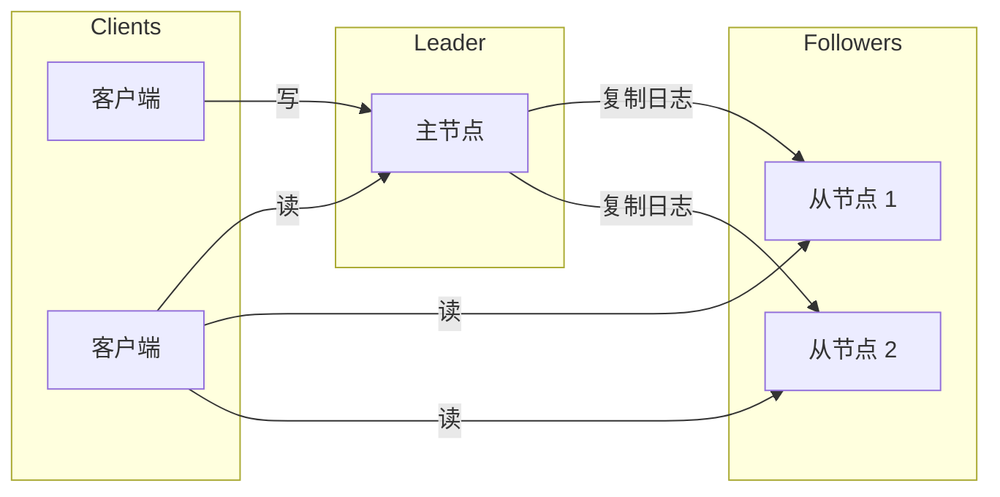

**图 5-1. 基于主节点的（主从）复制。**

这种复制模式是许多关系数据库的内置功能，例如 PostgreSQL（自 9.0 版起）、MySQL、Oracle Data Guard [2] 和 SQL Server 的 AlwaysOn 可用性组 [3]。它也被一些非关系数据库使用，包括 MongoDB、RethinkDB 和 Espresso [4]。最后，基于主节点的复制不仅限于数据库：分布式消息代理如 Kafka [5] 和 RabbitMQ 高可用队列 [6] 也使用它。一些网络文件系统和复制块设备（如 DRBD）类似。

### 同步复制与异步复制

复制系统的一个重要细节是复制是同步还是异步发生的。（在关系数据库中，这通常是可配置选项；其他系统通常硬编码为一种或另一种。）

考虑图 5-1 中发生的情况，用户更新其网站个人资料图片。在某个时间点，客户端将更新请求发送到主节点；不久之后，主节点收到请求。在某个时刻，主节点将数据变更转发给从节点。最终，主节点通知客户端更新成功。

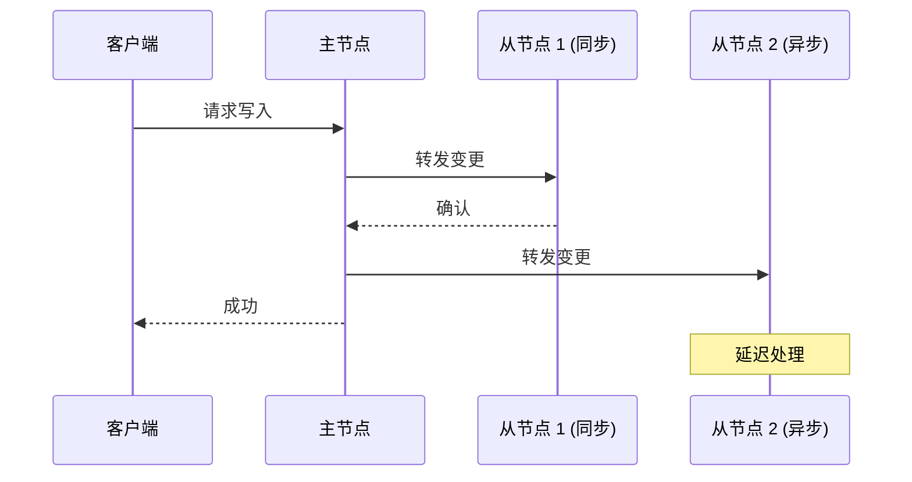

**图 5-2. 带有一个同步和一个异步从节点的基于主节点的复制。**

在图 5-2 的示例中，对从节点 1 的复制是同步的：主节点在向用户报告成功之前，以及向其他客户端使写入可见之前，等待从节点 1 确认收到写入。对从节点 2 的复制是异步的：主节点发送消息，但不等待从节点的响应。

图表显示从节点 2 处理消息之前有相当大的延迟。通常，复制相当快：大多数数据库系统在不到一秒内将变更应用到从节点。但是，无法保证需要多长时间。在某些情况下，从节点可能落后主节点几分钟或更长时间；例如，如果从节点正在从故障恢复，如果系统接近最大容量运行，或者如果节点之间存在网络问题。

同步复制的优点是保证从节点拥有与主节点一致的最新数据副本。如果主节点突然故障，我们可以确信数据仍然在从节点上可用。缺点是如果同步从节点不响应（因为它崩溃了、存在网络故障或任何其他原因），写入无法完成。主节点必须阻塞所有写入并等待同步副本再次可用。

因此，让所有从节点都同步是不切实际的：任何单个节点故障都会导致整个系统停滞。在实践中，如果你在数据库上启用同步复制，通常意味着其中一个从节点是同步的，其他是异步的。如果同步从节点变得不可用或变慢，其中一个异步从节点会被提升为同步。这保证你至少在两个节点上拥有最新数据副本：主节点和一个同步从节点。这种配置有时也称为**半同步**（semi-synchronous）[7]。

通常，基于主节点的复制配置为完全异步。在这种情况下，如果主节点故障且无法恢复，任何尚未复制到从节点的写入都会丢失。这意味着即使已向客户端确认，写入也不保证持久化。然而，完全异步配置的优点是，即使所有从节点都落后了，主节点也可以继续处理写入。

削弱持久性可能听起来像是一个糟糕的权衡，但异步复制仍然被广泛使用，特别是当有许多从节点或它们地理分布时。我们将在「复制延迟的问题」一节中回到这个问题。

::: info 复制研究
对于异步复制系统来说，主节点故障时丢失数据可能是一个严重问题，因此研究人员继续研究既不丢失数据又能提供良好性能和可用性的复制方法。例如，**链式复制**（chain replication）[8, 9] 是同步复制的一种变体，已在一些系统中成功实现，如 Microsoft Azure Storage [10, 11]。

复制的一致性与**共识**（consensus，让多个节点就某个值达成一致）之间有密切联系，我们将在第 9 章更详细地探讨这一理论领域。在本章中，我们将专注于实践中数据库最常用的更简单的复制形式。
:::

### 设置新从节点

有时你需要设置新从节点——也许是为了增加副本数量，或者为了替换故障节点。你如何确保新从节点拥有主节点数据的准确副本？

简单地从一台机器复制数据文件到另一台通常不够：客户端不断向数据库写入，数据始终在变化，因此标准文件复制会看到数据库在不同时间点的不同部分。结果可能没有意义。

你可以通过锁定数据库（使其不可写）来使磁盘上的文件一致，但这违背了我们高可用性的目标。幸运的是，设置从节点通常可以在不停机的情况下完成。从概念上讲，过程如下：

1. 在某个时间点获取主节点数据库的**一致快照**——如果可能，不锁定整个数据库。大多数数据库都有此功能，因为备份也需要它。在某些情况下，需要第三方工具，如 MySQL 的 innobackupex [12]。
2. 将快照复制到新从节点。
3. 从节点连接到主节点并请求自快照以来发生的所有数据变更。这要求快照与主节点复制日志中的精确位置相关联。该位置有各种名称：例如，PostgreSQL 称其为**日志序列号**（log sequence number），MySQL 称其为 **binlog 坐标**。

4. 当从节点处理完自快照以来的积压数据变更后，我们说它已**追上**（caught up）。它现在可以继续接收主节点发生的实时数据变更。

设置从节点的实际步骤因数据库而异。在某些系统中，该过程完全自动化，而在其他系统中，可能是需要管理员手动执行的复杂多步骤工作流。

### 处理节点故障

系统中的任何节点都可能宕机，可能是由于故障意外发生，也可能是由于计划维护（例如，重启机器以安装内核安全补丁）。能够在不停机的情况下重启单个节点是运维和维护的一大优势。因此，我们的目标是在单个节点故障时保持整个系统运行，并尽可能将节点故障的影响降到最低。

**从节点故障：追赶恢复**

每个从节点在其本地磁盘上保留从主节点收到的数据变更日志。如果从节点崩溃并重启，或者主节点和从节点之间的网络暂时中断，从节点可以相当容易地恢复：从日志中，它知道故障发生前处理的最后一个事务。因此，从节点可以连接到主节点并请求从节点断开连接期间发生的所有数据变更。当它应用这些变更后，就追上了主节点，可以像以前一样继续接收数据变更流。

**主节点故障：故障转移**

处理主节点故障更棘手：需要将其中一个从节点提升为新主节点，客户端需要重新配置以将写入发送到新主节点，其他从节点需要开始从新主节点消费数据变更。此过程称为**故障转移**（failover）。

故障转移可以是手动的（管理员被通知主节点故障并采取必要步骤创建新主节点）或自动的。自动故障转移过程通常包括以下步骤：

1. **确定主节点已故障**。可能有许多事情出错：崩溃、断电、网络问题等。没有万无一失的方法来检测出了什么问题，因此大多数系统简单地使用超时：节点之间经常相互发送消息，如果节点在某个时间段（例如 30 秒）内没有响应，则假定已死亡。（如果主节点因计划维护而被故意关闭，则不适用。）
2. **选择新主节点**。这可以通过选举过程完成（主节点由剩余副本的多数选出），或者新主节点可以由先前选出的控制器节点指定。领导的最佳候选者通常是拥有来自旧主节点最新数据变更的副本（以最小化任何数据丢失）。让所有节点就新主节点达成一致是一个共识问题，将在第 9 章详细讨论。
3. **重新配置系统以使用新主节点**。客户端现在需要将写入请求发送到新主节点（我们将在「请求路由」一节讨论）。如果旧主节点回来，它可能仍然认为自己是主节点，没有意识到其他副本已迫使其下台。系统需要确保旧主节点成为从节点并认可新主节点。

故障转移充满可能出错的事情：

- 如果使用异步复制，新主节点可能没有收到旧主节点故障前的所有写入。如果旧主节点在新主节点选出后重新加入集群，那些写入应该怎么办？新主节点可能在此期间收到了冲突的写入。最常见的解决方案是简单地丢弃旧主节点的未复制写入，这可能违反客户端的持久性预期。
- 如果数据库之外的其他存储系统需要与数据库内容协调，丢弃写入尤其危险。例如，在 GitHub 的一个事件 [13] 中，一个过时的 MySQL 从节点被提升为主节点。数据库使用自增计数器为新行分配主键，但由于新主节点的计数器落后于旧主节点，它重用了一些先前由旧主节点分配的主键。这些主键也用于 Redis 存储，因此主键重用导致 MySQL 和 Redis 之间的不一致，导致一些私有数据被披露给错误的用户。
- 在某些故障场景下（见第 8 章），可能发生两个节点都认为自己是主节点的情况。这种情况称为**脑裂**（split brain），这是危险的：如果两个主节点都接受写入，并且没有解决冲突的过程（见「多主复制」），数据很可能丢失或损坏。作为安全措施，一些系统在检测到两个主节点时有机制关闭一个节点。然而，如果此机制设计不当，你最终可能两个节点都被关闭 [14]。
- 在主节点被宣布死亡之前，正确的超时是多少？较长的超时意味着主节点故障时恢复时间更长。然而，如果超时太短，可能发生不必要的故障转移。例如，临时负载峰值可能导致节点响应时间超过超时，或网络故障可能导致数据包延迟。如果系统已经在高负载或网络问题上挣扎，不必要的故障转移可能会使情况变得更糟而不是更好。

这些问题没有简单的解决方案。因此，即使软件支持自动故障转移，一些运维团队也倾向于手动执行故障转移。

这些问题——节点故障、不可靠网络以及围绕副本一致性、持久性、可用性和延迟的权衡——实际上是分布式系统中的基本问题。我们将在第 8 章和第 9 章更深入地讨论它们。

### 复制日志的实现

基于主节点的复制在底层是如何工作的？实践中使用了多种不同的复制方法，让我们简要了解一下：

**基于语句的复制**

在最简单的情况下，主节点记录它执行的每个写入请求（**语句**），并将该语句日志发送给其从节点。对于关系数据库，这意味着每个 INSERT、UPDATE 或 DELETE 语句都被转发给从节点，每个从节点解析并执行该 SQL 语句，就像从客户端收到的一样。

尽管这听起来合理，但这种方法复制可能以各种方式失败：

- 任何调用非确定性函数的语句，例如 `NOW()` 获取当前日期时间或 `RAND()` 获取随机数，很可能在每个副本上生成不同的值。
- 如果语句使用自增列，或者依赖数据库中的现有数据（例如 `UPDATE … WHERE <some condition>`），它们必须在每个副本上以完全相同的顺序执行，否则可能产生不同的效果。当有多个并发执行的事务时，这可能限制性很强。
- 具有副作用（例如触发器、存储过程、用户定义函数）的语句可能导致每个副本上发生不同的副作用，除非副作用是完全确定性的。

可以解决这些问题——例如，主节点可以在记录语句时用固定返回值替换任何非确定性函数调用，以便从节点都获得相同的值。然而，由于有太多边缘情况，其他复制方法现在通常更受青睐。

基于语句的复制在 MySQL 5.1 之前使用。它今天有时仍被使用，因为它相当紧凑，但默认情况下，如果语句中有任何非确定性，MySQL 现在会切换到基于行的复制（稍后讨论）。VoltDB 使用基于语句的复制，并通过要求事务是确定性的来使其安全 [15]。

**预写日志（WAL）传输**

在第 3 章中，我们讨论了存储引擎如何在磁盘上表示数据，我们发现通常每次写入都会追加到日志：

- 对于日志结构存储引擎（见「SSTables 和 LSM-Trees」），此日志是主存储位置。日志段在后台压缩和垃圾回收。
- 对于 B-Tree（见「B-Trees」），它覆盖单个磁盘块，每次修改首先写入预写日志，以便崩溃后可以将索引恢复到一致状态。

无论哪种情况，日志都是包含所有数据库写入的仅追加字节序列。我们可以使用完全相同的日志在另一台机器上构建副本：除了将日志写入磁盘外，主节点还通过网络将其发送给从节点。

当从节点处理此日志时，它构建与主节点上相同的数据结构的副本。

这种复制方法在 PostgreSQL 和 Oracle 等中使用 [16]。主要缺点是日志在非常低的级别描述数据：WAL 包含哪些字节在哪些磁盘块中更改的细节。这使得复制与存储引擎紧密耦合。如果数据库从一种版本更改其存储格式到另一种，通常无法在主节点和从节点上运行不同版本的数据库软件。

这似乎是一个小的实现细节，但可能对运维产生重大影响。如果复制协议允许从节点使用比主节点更新的软件版本，你可以通过先升级从节点然后执行故障转移使其中一个升级节点成为新主节点来执行零停机升级。如果复制协议不允许这种版本不匹配（WAL 传输通常如此），此类升级需要停机。

**逻辑（基于行）日志复制**

另一种方法是使用不同的日志格式进行复制和存储引擎，这允许复制日志与存储引擎内部解耦。这种复制日志称为**逻辑日志**（logical log），以区别于存储引擎的（物理）数据表示。

关系数据库的逻辑日志通常是一系列描述在行粒度对数据库表的写入的记录：

- 对于插入的行，日志包含所有列的新值。
- 对于删除的行，日志包含足够的信息来唯一标识被删除的行。通常这将是主键，但如果表上没有主键，需要记录所有列的旧值。
- 对于更新的行，日志包含足够的信息来唯一标识更新的行，以及所有列的新值（或至少所有更改列的新值）。

修改多行的事务会生成多条这样的日志记录，后跟一条表示事务已提交的记录。MySQL 的 binlog（当配置为使用基于行的复制时）使用这种方法 [17]。

由于逻辑日志与存储引擎内部解耦，它可以更容易地保持向后兼容，允许主节点和从节点运行不同版本的数据库软件，甚至不同的存储引擎。

逻辑日志格式也更容易被外部应用解析。如果你想将数据库内容发送到外部系统（例如用于离线分析的数据仓库，或用于构建自定义索引和缓存 [18]），这种方面很有用。这种技术称为**变更数据捕获**（change data capture），我们将在第 11 章回到它。

**基于触发器的复制**

到目前为止描述的复制方法由数据库系统实现，不涉及任何应用代码。在许多情况下，这正是你想要的——但在某些情况下需要更灵活。例如，如果你只想复制数据的子集，或想从一种数据库复制到另一种，或者需要冲突解决逻辑（见「处理写冲突」），则可能需要将复制提升到应用层。

一些工具，如 Oracle GoldenGate [19]，可以通过读取数据库日志使数据变更对应用可用。另一种方法是使用许多关系数据库中可用的功能：触发器和存储过程。

触发器允许你注册在数据库系统中发生数据变更（写入事务）时自动执行的自定义应用代码。触发器有机会将此变更记录到单独的表中，外部进程可以从中读取。然后该外部进程可以应用任何必要的应用逻辑并将数据变更复制到另一个系统。例如，Oracle 的 Databus [20] 和 Postgres 的 Bucardo [21] 就是这样工作的。

基于触发器的复制通常比其他复制方法有更大的开销，并且比数据库的内置复制更容易出现错误和限制。然而，由于其灵活性，它仍然可能有用。

## 复制延迟的问题

能够容忍节点故障只是想要复制的众多原因之一。正如第二部分引言所述，其他原因包括可扩展性（处理比单机更多的请求）和延迟（将副本地理上靠近用户）。

基于主节点的复制要求所有写入都通过单个节点，但只读查询可以发送到任何副本。对于主要由读取和少量写入组成的工作负载（Web 上的常见模式），有一个有吸引力的选项：创建许多从节点，并将读请求分布在这些从节点上。这减轻了主节点的负载，并允许读请求由附近的副本提供。

在这种读扩展架构中，你可以简单地通过添加更多从节点来增加处理只读请求的能力。然而，这种方法实际上只适用于异步复制——如果你尝试同步复制到所有从节点，单个节点故障或网络中断将使整个系统变得不可写。而且你拥有的节点越多，其中一个宕机的可能性就越大，因此完全同步配置会非常不可靠。

不幸的是，如果应用从异步从节点读取，如果从节点落后了，它可能看到过时的信息。这导致数据库中的明显不一致：如果你在同一时间在主节点和从节点上运行相同的查询，可能会得到不同的结果，因为并非所有写入都已反映在从节点中。这种不一致只是临时状态——如果你停止写入数据库并等待一段时间，从节点最终会追上并变得与主节点一致。因此，这种效果被称为**最终一致性**（eventual consistency）[22, 23]。

::: info 术语说明
「最终一致性」一词由 Douglas Terry 等人提出 [24]，由 Werner Vogels 推广 [22]，并成为许多 NoSQL 项目的战斗口号。然而，不仅是 NoSQL 数据库是最终一致的：异步复制的关系数据库中的从节点具有相同的特性。
:::

「最终」一词是故意模糊的：通常，副本可能落后多少没有限制。在正常操作中，写入在主节点发生到反映在从节点之间的延迟——**复制延迟**（replication lag）——可能只有几分之一秒，在实践中不明显。然而，如果系统接近容量运行或网络有问题，延迟很容易增加到几秒甚至几分钟。

当延迟如此大时，它引入的不一致不仅仅是理论问题，而是应用的实际问题。在本节中，我们将突出复制延迟时可能发生的三个问题示例，并概述一些解决方法。

### 读己之写

许多应用允许用户提交一些数据，然后查看他们提交的内容。这可能是客户数据库中的记录、讨论线程上的评论或其他类似内容。当提交新数据时，必须发送到主节点，但当用户查看数据时，可以从从节点读取。如果数据经常被查看但只是偶尔写入，这尤其合适。

使用异步复制时，存在一个问题，如图 5-3 所示：如果用户在写入后不久查看数据，新数据可能尚未到达副本。对用户来说，看起来他们提交的数据丢失了，因此他们会理所当然地不高兴。

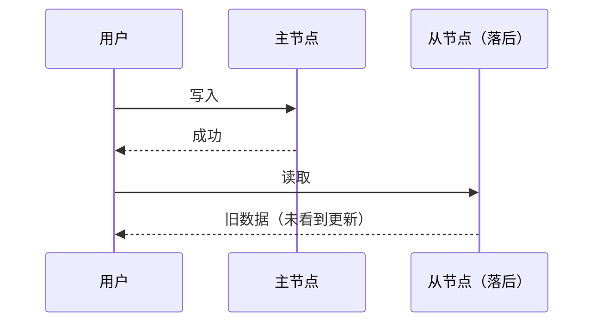

**图 5-3. 用户进行写入，然后从过时副本读取。为防止此异常，我们需要读后写一致性。**

在这种情况下，我们需要**读后写一致性**（read-after-write consistency），也称为**读己之写**（read-your-writes consistency）[24]。这是保证如果用户重新加载页面，他们将始终看到他们自己提交的任何更新。它不承诺其他用户：其他用户的更新可能要到稍后才可见。然而，它向用户保证他们自己的输入已正确保存。

我们如何在基于主节点的复制系统中实现读后写一致性？有各种可能的技术。举几个例子：

- 当读取用户可能已修改的内容时，从主节点读取；否则，从从节点读取。这要求你有某种方式知道某些内容是否可能已被修改，而不需要实际查询它。例如，社交网络上的用户个人资料通常只能由资料所有者编辑，而不能由其他人编辑。因此，一个简单的规则是：始终从主节点读取用户自己的资料，从从节点读取任何其他用户的资料。
- 如果应用中的大多数内容可能被用户编辑，这种方法将无效，因为大多数内容必须从主节点读取（抵消了读扩展的好处）。在这种情况下，可以使用其他标准来决定是否从主节点读取。例如，你可以跟踪上次更新时间，并在上次更新后一分钟内从主节点进行所有读取。你还可以监控从节点的复制延迟，并阻止对落后主节点超过一分钟的任何从节点的查询。
- 客户端可以记住其最近写入的时间戳——然后系统可以确保为该用户提供任何读取的副本至少反映到该时间戳的更新。如果副本不够新，读取可以由另一个副本处理，或者查询可以等待直到副本追上。时间戳可以是逻辑时间戳（表示写入顺序的东西，如日志序列号）或实际系统时钟（在这种情况下，时钟同步变得至关重要；见「不可靠的时钟」）。
- 如果你的副本分布在多个数据中心（为了地理上靠近用户或为了可用性），还有额外的复杂性。任何需要由主节点服务的请求必须路由到包含主节点的数据中心。

当同一用户从多个设备访问你的服务时（例如桌面 Web 浏览器和移动应用），会出现另一个复杂情况。在这种情况下，你可能希望提供跨设备读后写一致性：如果用户在一个设备上输入一些信息，然后在另一个设备上查看，他们应该看到刚刚输入的信息。

在这种情况下，需要考虑一些额外的问题：

- 需要记住用户上次更新时间戳的方法变得 more 困难，因为在一个设备上运行的代码不知道另一个设备上发生了哪些更新。此元数据需要集中化。
- 如果你的副本分布在不同数据中心，无法保证来自不同设备的连接会路由到同一数据中心。（例如，如果用户的桌面计算机使用家庭宽带连接，而他们的移动设备使用蜂窝数据网络，设备的网络路由可能完全不同。）如果你的方法需要从主节点读取，你可能首先需要将用户所有设备的请求路由到同一数据中心。

### 单调读

从异步从节点读取时可能发生的第二种异常是，用户可能看到时间倒流。

如果用户从不同副本进行多次读取，可能会发生这种情况。例如，图 5-4 显示用户 2345 两次进行相同的查询，第一次发送到延迟较小的从节点，第二次发送到延迟较大的从节点。（如果用户刷新网页，且每个请求都路由到随机服务器，这种场景相当可能。）第一次查询返回用户 1234 最近添加的评论，但第二次查询没有返回任何内容，因为落后的从节点尚未拾取该写入。

实际上，第二次查询观察到的是比第一次查询更早的系统时间点。如果第一次查询没有返回任何内容，这不会那么糟糕，因为用户 2345 可能不知道用户 1234 最近添加了评论。然而，如果用户 2345 首先看到用户 1234 的评论出现，然后看到它再次消失，这会非常令人困惑。

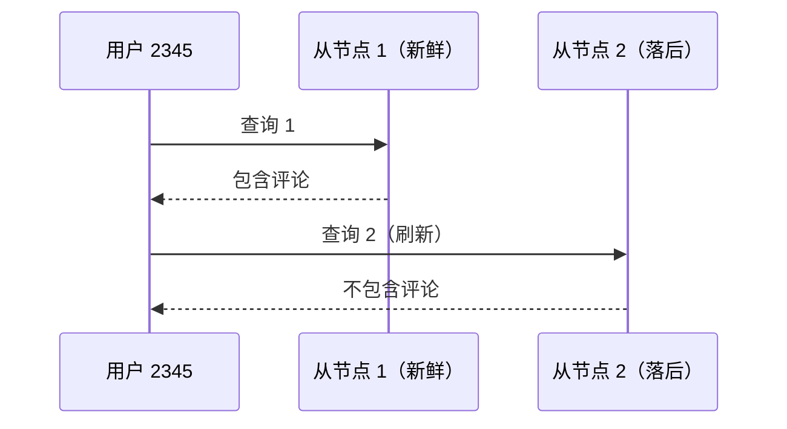

**图 5-4. 用户首先从新鲜副本读取，然后从过时副本读取。时间似乎倒流。为防止此异常，我们需要单调读。**

**单调读**（monotonic reads）[23] 是保证这种异常不会发生的保证。它比强一致性弱，但比最终一致性强。当你读取数据时，你可能看到旧值；单调读只是意味着如果用户连续进行多次读取，他们不会看到时间倒流——即，他们不会在先前读取较新数据之后读取较旧的数据。

实现单调读的一种方法是确保每个用户始终从同一副本进行读取（不同用户可以从不同副本读取）。例如，可以根据用户 ID 的哈希选择副本，而不是随机选择。然而，如果该副本故障，用户的查询需要重新路由到另一个副本。

### 一致前缀读

我们关于复制延迟异常的第三个例子涉及违反因果关系。想象以下 Mr. Poons 和 Mrs. Cake 之间的简短对话：

> Mr. Poons：你能看到多少未来，Cake 夫人？
> Mrs. Cake：通常大约十秒，Poons 先生。

这两句话之间有因果依赖：Mrs. Cake 听到了 Mr. Poons 的问题并回答了它。

现在，想象第三个人通过从节点收听此对话。Mrs. Cake 说的话通过延迟较小的从节点，但 Mr. Poons 说的话有更长复制延迟（见图 5-5）。这位观察者会听到：

> Mrs. Cake：通常大约十秒，Poons 先生。
> Mr. Poons：你能看到多少未来，Cake 夫人？

对观察者来说，看起来 Mrs. Cake 在 Mr. Poons 甚至问问题之前就回答了。这种心灵能力令人印象深刻，但非常令人困惑 [25]。

**图 5-5. 如果某些分区比其他分区复制得更慢，观察者可能先看到答案再看到问题。**

防止这种异常需要另一种类型的保证：**一致前缀读**（consistent prefix reads）[23]。此保证说，如果一系列写入以某种顺序发生，那么任何读取这些写入的人都会看到它们以相同的顺序出现。

这在分区（分片）数据库中是一个特别的问题，我们将在第 6 章讨论。如果数据库始终以相同顺序应用写入，读取总是看到一致的前缀，因此这种异常不会发生。然而，在许多分布式数据库中，不同分区独立操作，因此没有全局写入顺序：当用户从数据库读取时，他们可能看到数据库的某些部分处于较旧状态，某些部分处于较新状态。

一种解决方案是确保任何因果相关的写入都写入同一分区——但在某些应用中无法有效完成。还有一些算法显式跟踪因果依赖，我们将在「happens-before 关系与并发」一节回到这个主题。

### 复制延迟的解决方案

在使用最终一致系统时，值得考虑如果复制延迟增加到几分钟甚至几小时，应用会发生什么。如果答案是「没问题」，那很好。然而，如果结果对用户来说是糟糕的体验，设计系统以提供更强的保证（如读后写）很重要。当实际上复制是异步时假装它是同步的，是为日后问题埋下伏笔。

如前所述，有方法可以让应用提供比底层数据库更强的保证——例如，通过对主节点执行某些类型的读取。然而，在应用代码中处理这些问题很复杂且容易出错。

如果应用开发者不必担心微妙的复制问题，而可以信任他们的数据库「做正确的事」，那就更好了。这就是事务存在的原因：它们是数据库提供更强保证的一种方式，使应用可以更简单。

单节点事务已经存在很长时间了。然而，在向分布式（复制和分区）数据库迁移时，许多系统放弃了它们，声称事务在性能和可用性方面太昂贵，并断言最终一致性在可扩展系统中是不可避免的。这种说法有一定道理，但过于简单化，我们将在本书其余部分发展更细致的观点。我们将在第 7 章和第 9 章回到事务主题，并在第三部分讨论一些替代机制。

## 多主复制

到目前为止，本章我们只考虑了使用单个主节点的复制架构。尽管这是常见方法，但还有其他有趣的替代方案。

基于主节点的复制有一个主要缺点：只有一个主节点，所有写入都必须通过它。如果你因任何原因无法连接到主节点（例如由于你与主节点之间的网络中断），你就无法写入数据库。

基于主节点的复制模型的自然扩展是允许多个节点接受写入。复制仍然以相同的方式发生：处理写入的每个节点必须将该数据变更转发给所有其他节点。我们称此为**多主配置**（multi-leader configuration，也称为 master-master 或主动/主动复制）。

在此设置中，每个主节点同时充当其他主节点的从节点。

### 多主复制的使用场景

在单个数据中心内使用多主设置通常没有意义，因为好处很少超过增加的复杂性。然而，在某些情况下，这种配置是合理的。

**多数据中心操作**

想象你在多个不同数据中心有数据库副本（也许是为了容忍整个数据中心的故障，或者为了更靠近用户）。使用普通的基于主节点的复制设置，主节点必须在其中一个数据中心，所有写入都必须通过该数据中心。

在多主配置中，你可以在每个数据中心有一个主节点。图 5-6 显示了这种架构可能的样子。在每个数据中心内，使用常规的主从复制；在数据中心之间，每个数据中心的主节点将其变更复制到其他数据中心的主节点。

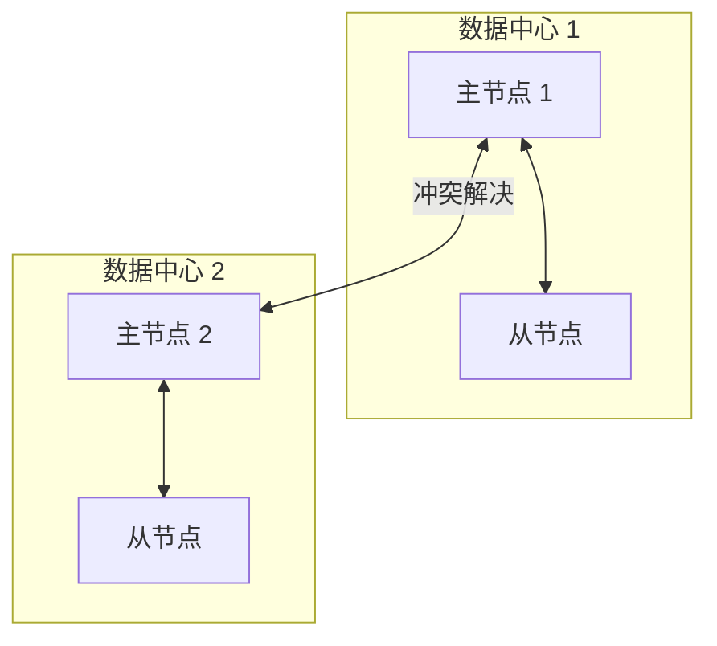

**图 5-6. 跨多个数据中心的多主复制。**

让我们比较单主和多主配置在多数据中心部署中的表现：

- **性能**：在单主配置中，每次写入都必须通过互联网传输到有主节点的数据中心。这可能给写入增加显著的延迟，可能违背了首先拥有多个数据中心的目的。在多主配置中，每次写入都可以在本地数据中心处理，并异步复制到其他数据中心。因此，数据中心间网络延迟对用户隐藏，这意味着感知性能可能更好。
- **容忍数据中心故障**：在单主配置中，如果主节点所在的数据中心故障，故障转移可以将另一个数据中心的从节点提升为主节点。在多主配置中，每个数据中心可以独立于其他数据中心继续运行，当故障数据中心恢复在线时，复制会追上。
- **容忍网络问题**：数据中心之间的流量通常通过公共互联网，可能比数据中心内的本地网络更不可靠。单主配置对此数据中心间链路的问题非常敏感，因为写入是同步通过此链路进行的。具有异步复制的多主配置通常可以更好地容忍网络问题：临时网络中断不会阻止写入被处理。

一些数据库默认支持多主配置，但也经常使用外部工具实现，如 MySQL 的 Tungsten Replicator [26]、PostgreSQL 的 BDR [27] 和 Oracle 的 GoldenGate [19]。

尽管多主复制有优势，它也有一个大缺点：相同的数据可能同时在两个不同的数据中心被修改，必须解决这些冲突（在图 5-6 中表示为「冲突解决」）。我们将在「处理写冲突」一节讨论这个问题。

由于多主复制在许多数据库中是一个有点 retrofit 的功能，通常存在微妙的配置陷阱和与其他数据库功能的令人惊讶的交互。例如，自增键、触发器和完整性约束可能有问题。因此，多主复制通常被认为是危险的领域，如果可能应该避免 [28]。

**支持离线操作的客户端**

多主复制适用的另一种情况是，如果你有一个应用需要在断开互联网连接时继续工作。例如，考虑你手机、笔记本电脑和其他设备上的日历应用。你需要能够随时查看会议（进行读请求）和输入新会议（进行写请求），无论你的设备当前是否有互联网连接。如果你在离线时进行任何更改，当设备下次在线时需要与服务器和你的其他设备同步。

在这种情况下，每个设备都有一个充当主节点的本地数据库（它接受写请求），并且你的日历在所有设备上的副本之间有一个异步多主复制过程（同步）。复制延迟可能是几小时甚至几天，取决于你何时有互联网可用。

从架构角度来看，这种设置本质上与数据中心之间的多主复制相同，只是走向极端：每个设备都是一个「数据中心」，它们之间的网络连接极其不可靠。正如日历同步实现的丰富历史所证明的那样，多主复制是一件很难做对的事情。

有一些工具旨在使这种多主配置更容易。例如，CouchDB 就是为此操作模式设计的 [29]。

**协作编辑**

实时协作编辑应用允许多人同时编辑文档。例如，Etherpad [30] 和 Google Docs [31] 允许多人并发编辑文本文档或电子表格（该算法在「自动冲突解决」中简要讨论）。

我们通常不将协作编辑视为数据库复制问题，但它与前面提到的离线编辑用例有很多共同之处。当用户编辑文档时，更改会立即应用到其本地副本（其 Web 浏览器或客户端应用中的文档状态），并异步复制到服务器和正在编辑同一文档的任何其他用户。

如果你想保证不会有编辑冲突，应用必须在用户能够编辑之前获取文档上的锁。如果另一个用户想要编辑同一文档，他们必须首先等待第一个用户提交更改并释放锁。这种协作模型等同于单主复制，主节点上有事务。

然而，为了更快的协作，你可能希望使变更单元非常小（例如，单个按键），并避免锁定。这种方法允许多个用户同时编辑，但也带来了多主复制的所有挑战，包括需要冲突解决 [32]。

### 处理写冲突

多主复制的最大问题是可能发生写冲突，这意味着需要冲突解决。

例如，考虑图 5-7 所示的同时被两个用户编辑的 wiki 页面。用户 1 将页面标题从 A 改为 B，用户 2 同时将标题从 A 改为 C。每个用户的更改都成功应用到其本地主节点。然而，当更改异步复制时，检测到冲突 [33]。此问题在单主数据库中不会发生。

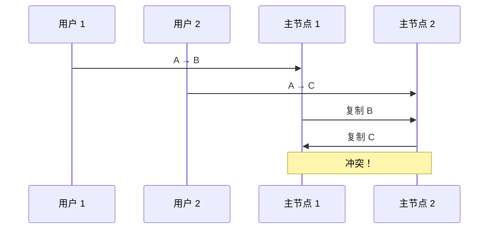

**图 5-7. 两个主节点同时更新同一记录导致写冲突。**

**同步与异步冲突检测**

在单主数据库中，第二个写入者会阻塞并等待第一个写入完成，或者中止第二个写事务，迫使用户重试写入。另一方面，在多主设置中，两个写入都成功，冲突只在稍后的某个时间点异步检测到。那时，可能已经太晚而无法要求用户解决冲突。

原则上，你可以使冲突检测同步——即，在告诉用户写入成功之前，等待写入复制到所有副本。然而，这样做会失去多主复制的主要优势：允许每个副本独立接受写入。如果你想要同步冲突检测，不妨只使用单主复制。

**冲突避免**

处理冲突的最简单策略是避免它们：如果应用可以确保特定记录的所有写入都通过同一主节点，则不会发生冲突。由于许多多主复制实现处理冲突相当差，避免冲突是经常推荐的方法 [34]。

例如，在用户可以编辑自己数据的应用中，你可以确保来自特定用户的请求始终路由到同一数据中心，并使用该数据中心的主节点进行读写。不同用户可能有不同的「主」数据中心（也许根据用户的地理位置选择），但从任何用户的角度来看，配置本质上是单主的。

然而，有时你可能想更改记录的指定主节点——也许因为一个数据中心故障，你需要将流量重新路由到另一个数据中心，或者也许因为用户搬到了另一个位置，现在更靠近不同的数据中心。在这种情况下，冲突避免会失效，你必须处理不同主节点上并发写入的可能性。

**收敛到一致状态**

单主数据库按顺序应用写入：如果对同一字段有多次更新，最后一次写入决定字段的最终值。

在多主配置中，没有定义的写入顺序，因此不清楚最终值应该是什么。在图 5-7 中，主节点 1 上标题首先更新为 B，然后更新为 C；主节点 2 上首先更新为 C，然后更新为 B。两种顺序都不比另一种「更正确」。

如果每个副本简单地按接收写入的顺序应用写入，数据库将最终处于不一致状态：最终值在主节点 1 上是 C，在主节点 2 上是 B。这是不可接受的——每个复制方案都必须确保数据最终在所有副本中相同。因此，数据库必须以**收敛**（convergent）方式解决冲突，这意味着当所有变更都已复制时，所有副本必须到达相同的最终值。

有各种方法实现收敛式冲突解决：

- 给每个写入一个唯一 ID（例如时间戳、长随机数、UUID 或键和值的哈希），选择 ID 最大的写入作为获胜者，丢弃其他写入。如果使用时间戳，此技术称为**最后写入获胜**（last write wins，LWW）。尽管这种方法很流行，但它容易导致数据丢失 [35]。我们将在本章末尾更详细地讨论 LWW（「检测并发写入」）。
- 给每个副本一个唯一 ID，让来自编号较高副本的写入始终优先于来自编号较低副本的写入。这种方法也意味着数据丢失。
- 以某种方式合并值——例如，按字母顺序排列然后连接它们（在图 5-7 中，合并的标题可能是「B/C」之类）。
- 在显式数据结构中记录冲突，保留所有信息，并编写应用代码在稍后的某个时间解决冲突（也许通过提示用户）。

**自定义冲突解决逻辑**

由于解决冲突的最适当方式可能取决于应用，大多数多主复制工具允许你使用应用代码编写冲突解决逻辑。该代码可能写入时或读取时执行：

- **写入时**：一旦数据库系统在复制变更日志中检测到冲突，它调用冲突处理程序。例如，Bucardo 允许你为此目的编写 Perl 片段。此处理程序通常无法提示用户——它在后台进程中运行，必须快速执行。
- **读取时**：当检测到冲突时，存储所有冲突的写入。下次读取数据时，将这些数据的多个版本返回给应用。应用可能提示用户或自动解决冲突，并将结果写回数据库。例如，CouchDB 就是这样工作的。

请注意，冲突解决通常应用于单个行或文档的级别，而不是整个事务 [36]。因此，如果你有一个原子地进行多个不同写入的事务（见第 7 章），每个写入仍然会单独考虑冲突解决。

**自动冲突解决**

冲突解决规则可能很快变得复杂，自定义代码可能容易出错。Amazon 经常被引用为因冲突解决处理程序而产生令人惊讶效果的例子：有一段时间，购物车的冲突解决逻辑会保留添加到购物车的商品，但不会保留从购物车移除的商品。因此，客户有时会看到商品重新出现在购物车中，尽管他们之前已经移除了 [37]。

有一些有趣的研究涉及自动解决由并发数据修改引起的冲突。有几条研究线值得提及：

- **无冲突复制数据类型**（Conflict-free Replicated Datatypes，CRDT）[32, 38] 是一系列用于集合、映射、有序列表、计数器等的数据结构，可以由多个用户并发编辑，并以合理的方式自动解决冲突。一些 CRDT 已在 Riak 2.0 中实现 [39, 40]。
- **可合并持久数据结构** [41] 显式跟踪历史，类似于 Git 版本控制系统，并使用三路合并函数（而 CRDT 使用二路合并）。
- **操作转换**（Operational Transformation）[42] 是 Etherpad [30] 和 Google Docs [31] 等协作编辑应用背后的冲突解决算法。它专门为并发编辑有序项目列表（如构成文本文档的字符列表）而设计。

这些算法在数据库中的实现仍然年轻，但它们很可能在未来集成到更多复制数据系统中。自动冲突解决可以使多主数据同步对应用来说更容易处理。

**什么是冲突？**

某些类型的冲突是明显的。在图 5-7 的示例中，两个写入同时修改了同一记录中的同一字段，将其设置为两个不同的值。几乎没有疑问这是冲突。

其他类型的冲突可能更微妙地检测。例如，考虑会议室预订系统：它跟踪哪个房间在哪个时间被哪组人预订。此应用需要确保每个房间在任何时间只被一组人预订（即，同一房间不得有任何重叠预订）。在这种情况下，如果同时为同一房间创建两个不同的预订，可能会发生冲突。即使应用在允许用户进行预订之前检查可用性，如果两个预订是在两个不同的主节点上进行的，也可能发生冲突。

没有现成的快速答案，但在后续章节中，我们将追踪一条通往良好理解的道路。我们将在第 7 章看到更多冲突示例，并在第 12 章讨论在复制系统中检测和解决冲突的可扩展方法。

### 多主复制拓扑

**复制拓扑**（replication topology）描述写入从一个节点传播到另一个节点的通信路径。如果你有两个主节点，如图 5-7，只有一个合理的拓扑：主节点 1 必须将其所有写入发送到主节点 2，反之亦然。对于超过两个主节点，有多种不同的拓扑是可能的。图 5-8 展示了一些示例。

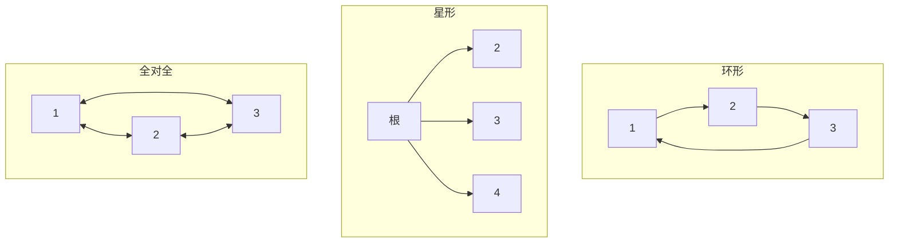

**图 5-8. 可以设置多主复制的三种示例拓扑。**

最通用的拓扑是**全对全**（all-to-all）（图 5-8 [c]），其中每个主节点将其写入发送到所有其他主节点。然而，也使用更受限的拓扑：例如，MySQL 默认只支持**环形拓扑** [34]，其中每个节点从一个节点接收写入，并将这些写入（加上自己的任何写入）转发到另一个节点。另一种流行的拓扑具有**星形**形状：一个指定的根节点将写入转发到所有其他节点。星形拓扑可以推广到树。

在环形和星形拓扑中，写入可能需要经过几个节点才能到达所有副本。因此，节点需要转发它们从其他节点收到的数据变更。为防止无限复制循环，每个节点被赋予一个唯一标识符，在复制日志中，每个写入都标记有它经过的所有节点的标识符 [43]。当节点收到标有其自己标识符的数据变更时，该数据变更被忽略，因为节点知道它已经被处理过了。

环形和星形拓扑的一个问题是，如果只有一个节点故障，它可能中断其他节点之间的复制消息流，导致它们无法通信，直到故障节点被修复。可以重新配置拓扑以绕过故障节点，但在大多数部署中，这种重新配置必须手动完成。更密集连接的拓扑（如全对全）的容错性更好，因为它允许消息沿不同路径传播，避免单点故障。

另一方面，全对全拓扑也可能有问题。特别是，某些网络链路可能比其他链路更快（例如，由于网络拥塞），结果是某些复制消息可能「超越」其他消息，如图 5-9 所示。

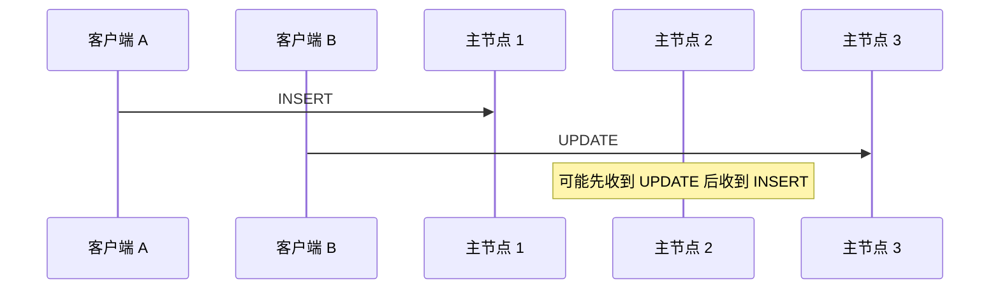

**图 5-9. 多主复制时，写入可能以错误顺序到达某些副本。**

在图 5-9 中，客户端 A 在主节点 1 的表中插入一行，客户端 B 在主节点 3 上更新该行。然而，主节点 2 可能以不同的顺序收到写入：它可能首先收到更新（从它的角度来看，这是对数据库中不存在的行的更新），然后才收到相应的插入（插入应该在更新之前）。

这是一个因果关系问题，类似于我们在「一致前缀读」中看到的：更新依赖于先前的插入，因此我们需要确保所有节点先处理插入，然后处理更新。简单地在每个写入上附加时间戳是不够的，因为时钟不能信任足够同步以正确地在主节点 2 上排序这些事件（见第 8 章）。

要正确排序这些事件，可以使用称为**版本向量**（version vectors）的技术，我们将在本章后面讨论（见「检测并发写入」）。然而，冲突检测在许多多主复制系统中实现得很差。例如，在撰写本文时，PostgreSQL BDR 不提供写入的因果排序 [27]，MySQL 的 Tungsten Replicator 甚至不尝试检测冲突 [34]。

如果你使用具有多主复制的系统，值得注意这些问题，仔细阅读文档，并彻底测试你的数据库，以确保它确实提供你认为它有的保证。

## 无主复制

本章到目前为止讨论的复制方法——单主和多主复制——都基于客户端将写请求发送到一个节点（主节点）的想法，数据库系统负责将该写入复制到其他副本。主节点确定写入应该被处理的顺序，从节点按相同顺序应用主节点的写入。

一些数据存储系统采用不同的方法，放弃主节点的概念，允许任何副本直接接受来自客户端的写入。一些最早的复制数据系统是无主的 [1, 44]，但这一想法在关系数据库主导的时代大多被遗忘了。在 Amazon 将其用于内部 Dynamo 系统 [37] 之后，它再次成为数据库的流行架构。Riak、Cassandra 和 Voldemort 是受 Dynamo 启发的具有无主复制模型的开源数据存储，因此这种数据库也称为 **Dynamo 风格**。

在一些无主实现中，客户端直接将其写入发送到多个副本，而在其他实现中，协调节点代表客户端执行此操作。然而，与主节点数据库不同，该协调节点不强制执行特定的写入顺序。正如我们将看到的，这种设计上的差异对数据库的使用方式有深远的影响。

### 节点宕机时写入数据库

想象你有一个有三个副本的数据库，其中一个副本当前不可用——也许它正在重启以安装系统更新。在基于主节点的配置中，如果你想继续处理写入，你可能需要执行故障转移（见「处理节点故障」）。

另一方面，在无主配置中，不存在故障转移。图 5-10 显示了发生的情况：客户端（用户 1234）并行将写入发送到所有三个副本，两个可用的副本接受写入，但不可用的副本错过了它。假设三个副本中有两个确认写入就足够了：在用户 1234 收到两个 ok 响应后，我们认为写入成功。客户端简单地忽略一个副本错过了写入的事实。

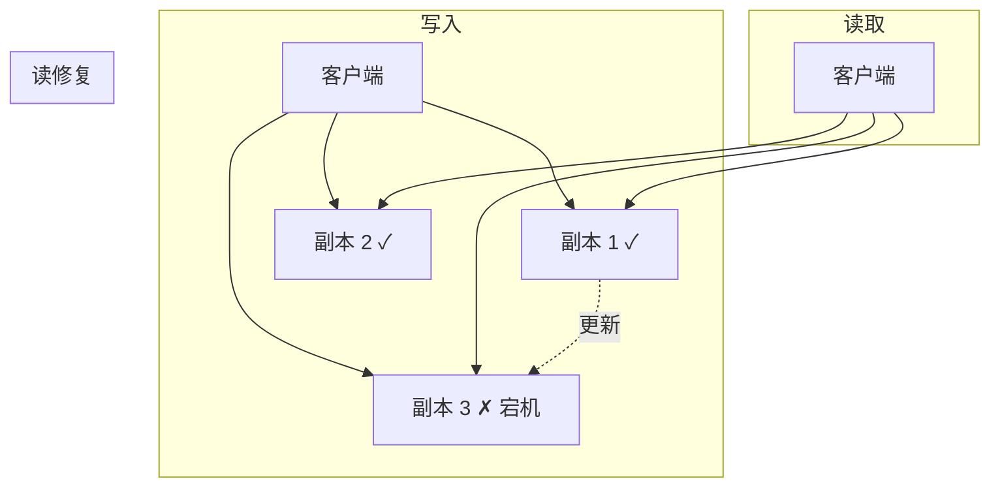

**图 5-10. 法定人数写入、法定人数读取和节点故障后的读修复。**

现在想象不可用的节点恢复在线，客户端开始从它读取。该节点宕机期间发生的任何写入都缺失在该节点上。因此，如果你从该节点读取，可能会得到过时（陈旧）的值作为响应。

要解决这个问题，当客户端从数据库读取时，它不只是将请求发送到一个副本：读请求也并行发送到多个节点。客户端可能从不同节点得到不同的响应；即，来自一个节点的最新值和来自另一个节点的陈旧值。版本号用于确定哪个值更新（见「检测并发写入」）。

### 读修复与反熵

复制方案应确保最终所有数据都被复制到每个副本。在不可用的节点恢复在线后，它如何追上它错过的写入？

Dynamo 风格的数据存储中通常使用两种机制：

**读修复**（read repair）：当客户端从多个节点并行读取时，它可以检测任何陈旧的响应。例如，在图 5-10 中，用户 2345 从副本 3 得到版本 6 的值，从副本 1 和 2 得到版本 7 的值。客户端看到副本 3 有陈旧值，并将较新的值写回该副本。这种方法对于经常被读取的值效果很好。

**反熵过程**（anti-entropy process）：此外，一些数据存储有一个后台进程，不断查找副本之间数据的差异，并将任何缺失的数据从一个副本复制到另一个。与基于主复制的复制日志不同，此反熵过程不以任何特定顺序复制写入，数据复制可能會有显著延迟。

并非所有系统都实现这两者；例如，Voldemort 目前没有反熵过程。请注意，没有反熵过程，很少被读取的值可能在某些副本上缺失，因此持久性降低，因为读修复仅在应用读取值时执行。

### 读写法定人数

在图 5-10 的示例中，我们认为写入成功，即使它只在三个副本中的两个上处理。如果三个副本中只有一个接受写入？我们能推多远？

如果我们知道每个成功的写入都保证至少存在于三个副本中的两个上，这意味着最多一个副本可能是陈旧的。因此，如果我们从至少两个副本读取，我们可以确保至少有一个是最新的。如果第三个副本宕机或响应缓慢，读取仍然可以继续返回最新值。

更一般地，如果有 n 个副本，每次写入必须被 w 个节点确认才能被认为成功，并且我们必须为每次读取查询至少 r 个节点。（在我们的示例中，n = 3，w = 2，r = 2。）只要 w + r > n，我们期望在读取时获得最新值，因为我们读取的 r 个节点中至少有一个必须是最新的。遵守这些 r 和 w 值的读取和写入称为**法定人数**（quorum）读取和写入 [44]。你可以将 r 和 w 视为读取或写入有效所需的最小票数。

在 Dynamo 风格数据库中，参数 n、w 和 r 通常可配置。常见选择是使 n 为奇数（通常为 3 或 5），并设置 w = r = (n + 1) / 2（向上取整）。然而，你可以根据需要调整数字。例如，写入少、读取多的工作负载可能受益于设置 w = n 和 r = 1。这使读取更快，但有一个缺点：只有一个节点故障就会导致所有数据库写入失败。

::: tip
集群中可能有超过 n 个节点，但任何给定值只存储在 n 个节点上。这允许数据集被分区，支持比单机更大的数据集。我们将在第 6 章回到分区。
:::

法定人数条件 w + r > n 允许系统在以下方面容忍不可用节点：

- 如果 w < n，当节点不可用时我们仍然可以处理写入。
- 如果 r < n，当节点不可用时我们仍然可以处理读取。
- 使用 n = 3，w = 2，r = 2，我们可以容忍一个不可用节点。
- 使用 n = 5，w = 3，r = 3，我们可以容忍两个不可用节点。这种情况如图 5-11 所示。
- 通常，读取和写入总是并行发送到所有 n 个副本。参数 w 和 r 决定我们等待多少节点——即，在我们认为读取或写入成功之前，n 个节点中有多少需要报告成功。

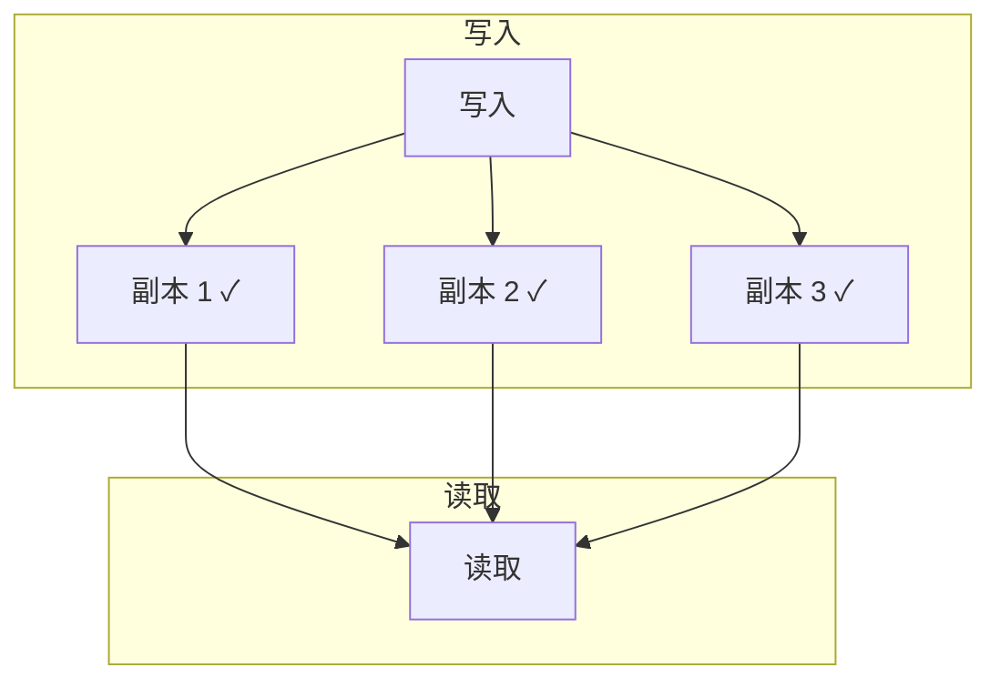

**图 5-11. 如果 w + r > n，你读取的 r 个副本中至少有一个必须看到最近成功的写入。**

如果可用节点少于所需的 w 或 r，写入或读取返回错误。节点可能因许多原因不可用：因为节点宕机（崩溃、关机）、因为执行操作时出错（磁盘已满无法写入）、因为客户端和节点之间的网络中断，或出于任何其他原因。我们只关心节点是否返回成功响应，不需要区分不同类型的故障。

### 法定人数一致性的局限性

如果你有 n 个副本，并且选择 w 和 r 使得 w + r > n，你通常可以期望每次读取返回为键写入的最新值。这是因为你写入的节点集和你读取的节点集必须重叠。也就是说，在你读取的节点中，至少有一个必须具有最新值（如图 5-11 所示）。

通常，r 和 w 被选择为节点的多数（超过 n/2），因为这确保 w + r > n，同时仍然容忍最多 n/2 个节点故障。但法定人数不一定是多数——重要的是读取和写入操作使用的节点集重叠至少一个节点。其他法定人数分配是可能的，这允许分布式算法设计中的一些灵活性 [45]。

你也可以将 w 和 r 设置为较小的数字，使得 w + r ≤ n（即，不满足法定人数条件）。在这种情况下，读取和写入仍然会发送到 n 个节点，但需要较少的成功响应才能使操作成功。

使用较小的 w 和 r，你更可能读取陈旧值，因为你的读取更可能没有包含具有最新值的节点。好处是，这种配置允许更低的延迟和更高的可用性：如果网络中断，许多副本变得不可达，你有更高的机会可以继续处理读取和写入。只有当可达副本的數量低于 w 或 r 时，数据库才分别变得不可写或不可读。

然而，即使 w + r > n，也可能有返回陈旧值的边缘情况。这些取决于实现，但可能的场景包括：

- 如果使用**宽松法定人数**（sloppy quorum）（见「宽松法定人数与暗示移交」），w 次写入可能最终落在与 r 次读取不同的节点上，因此 r 节点和 w 节点之间不再有保证的重叠 [46]。
- 如果两个写入同时发生，不清楚哪个先发生。在这种情况下，唯一安全的解决方案是合并并发写入（见「处理写冲突」）。如果基于时间戳选择获胜者（最后写入获胜），由于时钟偏差可能丢失写入 [35]。我们将在「检测并发写入」回到这个主题。
- 如果写入与读取同时发生，写入可能只反映在部分副本上。在这种情况下，读取返回旧值还是新值是不确定的。
- 如果写入在某些副本上成功但在其他副本上失败（例如因为某些节点磁盘已满），总体上在少于 w 个副本上成功，它在成功的副本上不会回滚。这意味着如果写入被报告为失败，后续读取可能返回也可能不返回该写入的值 [47]。
- 如果承载新值的节点故障，其数据从承载旧值的副本恢复，存储新值的副本数量可能降至 w 以下，打破法定人数条件。
- 即使一切正常，也可能有时序上的边缘情况，你可能会不幸，我们将在「线性化与法定人数」中看到。

因此，尽管法定人数似乎保证读取返回最新写入的值，但在实践中并非如此简单。Dynamo 风格数据库通常针对可以容忍最终一致性的用例进行优化。参数 w 和 r 允许你调整读取陈旧值的概率，但明智的做法是不要将它们视为绝对保证。

特别是，你通常不会获得「复制延迟的问题」中讨论的保证（读己之写、单调读或一致前缀读），因此前面提到的异常可能发生在应用中。更强的保证通常需要事务或共识。我们将在第 7 章和第 9 章回到这些主题。

### 监控陈旧度

从运维角度来看，监控你的数据库是否返回最新结果很重要。即使你的应用可以容忍陈旧读取，你也需要了解复制的健康状况。如果它显著落后，应该提醒你，以便你可以调查原因（例如，网络中的问题或过载的节点）。

对于基于主节点的复制，数据库通常暴露复制延迟的指标，你可以将其馈入监控系统。这是可能的，因为写入以相同顺序应用到主节点和从节点，每个节点在复制日志中都有一个位置（它本地应用的写入数量）。通过从主节点的当前位置减去从节点的当前位置，你可以测量复制延迟量。

然而，在具有无主复制的系统中，写入应用的顺序不固定，这使得监控更加困难。此外，如果数据库只使用读修复（没有反熵），则值可能有多旧没有限制——如果值很少被读取，陈旧副本返回的值可能非常古老。

关于在具有无主复制的数据库中测量副本陈旧度并根据参数 n、w 和 r 预测预期陈旧读取百分比的研究已经有一些 [48]。不幸的是，这还不是常见做法，但将陈旧度测量纳入数据库的标准指标集会是好的。最终一致性是故意模糊的保证，但对于可操作性，能够量化「最终」很重要。

### 宽松法定人数与暗示移交

具有适当配置法定人数的数据库可以容忍单个节点故障，无需故障转移。它们还可以容忍单个节点变慢，因为请求不必等待所有 n 个节点响应——当 w 或 r 个节点响应时它们可以返回。这些特性使具有无主复制的数据库对有高可用性和低延迟需求、可以容忍偶尔陈旧读取的用例具有吸引力。

然而，法定人数（如上所述）不如它们可能的那样容错。网络中断可以很容易地切断客户端与大量数据库节点的连接。尽管这些节点是活的，其他客户端可能能够连接到它们，但对于与数据库节点断开的客户端来说，它们可能就像死了一样。在这种情况下，很可能剩余的 w 或 r 可达节点更少，因此客户端无法再达到法定人数。

在大型集群（明显多于 n 个节点）中，客户端很可能在网络中断期间可以连接到一些数据库节点，只是无法连接到它需要为特定值组装法定人数的节点。在这种情况下，数据库设计者面临权衡：

- 对于我们无法达到 w 或 r 个节点法定人数的所有请求，返回错误是否更好？
- 还是我们应该接受写入，并将它们写入一些可达但不在值通常所在的 n 个节点中的节点？

后者称为**宽松法定人数**（sloppy quorum）[37]：写入和读取仍然需要 w 和 r 个成功响应，但这些可能包括不在值的指定 n 个「主」节点中的节点。打个比方，如果你把自己锁在门外，你可能会敲邻居的门，问是否可以在他们的沙发上暂时待一会儿。

一旦网络中断修复，一个节点临时代表另一个节点接受的任何写入都会发送到适当的「主」节点。这称为**暗示移交**（hinted handoff）。（一旦你找到钥匙回家，你的邻居礼貌地请你从沙发上下来回家。）

宽松法定人数对于增加写入可用性特别有用：只要任何 w 个节点可用，数据库就可以接受写入。然而，这意味着即使 w + r > n，你也不能确定读取键的最新值，因为最新值可能已临时写入 n 之外的一些节点 [47]。

因此，宽松法定人数实际上根本不是传统意义上的法定人数。它只是持久性的保证，即数据存储在某个地方的 w 个节点上。在暗示移交完成之前，无法保证读取 r 个节点会看到它。

宽松法定人数在所有常见 Dynamo 实现中是可选的。在 Riak 中默认启用，在 Cassandra 和 Voldemort 中默认禁用 [46, 49, 50]。

### 多数据中心操作

我们之前讨论了跨数据中心复制作为多主复制的用例（见「多主复制」）。无主复制也适用于多数据中心操作，因为它设计用于容忍冲突的并发写入、网络中断和延迟峰值。

Cassandra 和 Voldemort 在正常无主模型中实现其多数据中心支持：副本数量 n 包括所有数据中心中的节点，在配置中你可以指定你希望 n 个副本中有多少在每个数据中心。来自客户端的每次写入都发送到所有副本，无论数据中心如何，但客户端通常只等待其本地数据中心内法定人数节点的确认，以便不受跨数据中心链路上的延迟和中断的影响。到其他数据中心的高延迟写入通常配置为异步发生，尽管配置中有一些灵活性 [50, 51]。

Riak 保持客户端和数据库节点之间的所有通信在单个数据中心内本地，因此 n 描述单个数据中心内的副本数量。数据库集群之间的跨数据中心复制在后台异步发生，风格类似于多主复制 [52]。

### 检测并发写入

Dynamo 风格数据库允许多个客户端并发写入同一键，这意味着即使使用严格法定人数也会发生冲突。情况类似于多主复制（见「处理写冲突」），尽管在 Dynamo 风格数据库中，冲突也可能在读修复或暗示移交期间发生。

问题是事件可能由于可变网络延迟和部分故障而以不同顺序到达不同节点。例如，图 5-12 显示两个客户端 A 和 B 同时在三节点数据存储中写入键 X：

- 节点 1 收到来自 A 的写入，但由于临时故障从未收到来自 B 的写入。
- 节点 2 首先收到来自 A 的写入，然后收到来自 B 的写入。
- 节点 3 首先收到来自 B 的写入，然后收到来自 A 的写入。

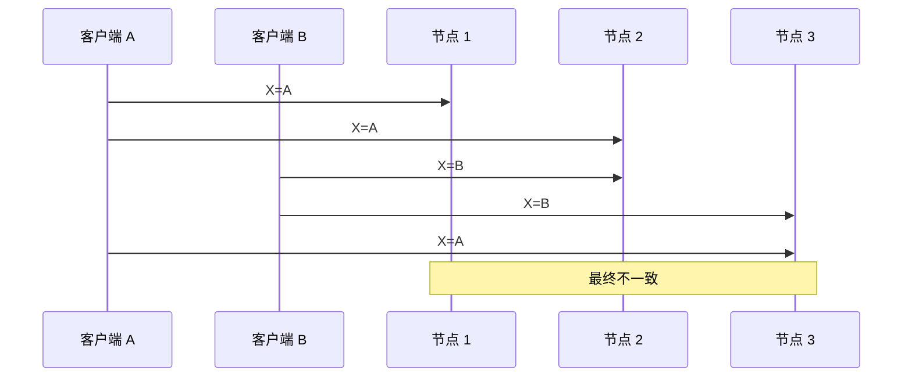

**图 5-12. Dynamo 风格数据存储中的并发写入：没有明确定义的顺序。**

如果每个节点在收到客户端的写请求时简单地覆盖键的值，节点将永久不一致，如图 5-12 中最终 get 请求所示：节点 2 认为 X 的最终值是 B，而其他节点认为值是 A。

为了最终一致，副本应该收敛到相同的值。它们如何做到？人们可能希望复制数据库会自动处理这个问题，但不幸的是，大多数实现相当差：如果你想避免丢失数据，你——应用开发者——需要了解数据库冲突处理内部的大量知识。

我们在「处理写冲突」中简要提到了几种冲突解决技术。在结束本章之前，让我们更详细地探讨这个问题。

**最后写入获胜（丢弃并发写入）**

实现最终收敛的一种方法是声明每个副本只需要存储最「新」的值，并允许「旧」值被覆盖和丢弃。然后，只要我们有一个明确确定哪个写入更「新」的方法，并且每个写入最终都复制到每个副本，副本将最终收敛到相同的值。

正如「新」周围的引号所表明的，这个想法实际上相当误导。在图 5-12 的示例中，当每个客户端发送请求到数据库节点时，都不知道另一个客户端，因此不清楚哪个先发生。事实上，说两者中任何一个「先」发生并没有真正意义：我们说写入是并发的，所以它们的顺序是未定义的。

尽管写入没有自然顺序，我们可以强制对它们进行任意排序。例如，我们可以在每个写入上附加时间戳，选择最大的时间戳作为最「新」，并丢弃任何较早时间戳的写入。这种冲突解决算法称为**最后写入获胜**（last write wins，LWW），是 Cassandra [53] 中唯一支持的冲突解决方法，在 Riak 中是可选功能 [35]。

LWW 实现了最终收敛的目标，但以持久性为代价：如果对同一键有多个并发写入，即使它们都被报告为对客户端成功（因为它们被写入 w 个副本），只有一个写入会存活，其他会被静默丢弃。此外，LWW 甚至可能丢弃非并发的写入，我们将在「用于排序事件的时间戳」中讨论。

在某些情况下，例如缓存，丢失写入可能是可以接受的。如果丢失数据不可接受，LWW 是冲突解决的糟糕选择。使用具有 LWW 的数据库的唯一安全方法是确保键只写入一次，此后视为不可变，从而避免对同一键的任何并发更新。例如，使用 Cassandra 的推荐方式是使用 UUID 作为键，从而为每次写入操作提供唯一键 [53]。

**「happens-before」关系与并发**

我们如何决定两个操作是否并发？为了培养直觉，让我们看一些例子：

- 在图 5-9 中，两个写入不是并发的：A 的插入发生在 B 的增量之前，因为 B 增量的值是 A 插入的值。换句话说，B 的操作建立在 A 的操作之上，所以 B 的操作必须发生得更晚。我们也说 B 因果依赖于 A。
- 另一方面，图 5-12 中的两个写入是并发的：当每个客户端开始操作时，它不知道另一个客户端也在对同一键执行操作。因此，操作之间没有因果依赖。

如果操作 B 知道操作 A、依赖 A 或以某种方式建立在 A 之上，则操作 A **发生在**（happens before）操作 B 之前。一个操作是否发生在另一个操作之前是定义并发含义的关键。事实上，我们可以简单地说，如果两个操作都不发生在另一个之前（即，都不知道另一个），则两个操作是**并发的**（concurrent）[54]。

因此，每当你有两个操作 A 和 B 时，有三种可能：A 发生在 B 之前，或 B 发生在 A 之前，或 A 和 B 是并发的。我们需要的是一个算法来告诉我们两个操作是否并发。如果一个操作发生在另一个之前，后面的操作应该覆盖前面的操作，但如果操作是并发的，我们有需要解决的冲突。

**并发、时间与相对论**

似乎两个操作应该在「同时」发生时被称为并发——但事实上，它们是否在时间上字面重叠并不重要。由于分布式系统中时钟的问题，实际上很难判断两件事是否恰好同时发生——我们将在第 8 章更详细地讨论这个问题。

对于定义并发，精确时间无关紧要：我们简单地称两个操作是并发的，如果它们都不知道对方，无论它们发生的物理时间如何。人们有时将这一原理与物理学中的狭义相对论联系起来 [54]，后者引入了信息不能比光速传播得更快的思想。因此，在相距一定距离发生的两个事件，如果事件之间的时间短于光在它们之间传播所需的时间，就不可能相互影响。

在计算机系统中，两个操作可能是并发的，即使光速原则上允许一个操作影响另一个。例如，如果当时网络很慢或中断，两个操作可能相隔一段时间发生，仍然是并发的，因为网络问题阻止了一个操作能够知道另一个。

**捕获 happens-before 关系**

让我们看一个算法，用于确定两个操作是否并发，或者一个是否发生在另一个之前。为简单起见，让我们从一个只有一个副本的数据库开始。一旦我们弄清楚如何在单个副本上做到这一点，我们可以将方法推广到具有多个副本的无主数据库。

图 5-13 显示两个客户端并发地向同一购物车添加商品。（如果这个例子让你觉得太无聊，想象两个空中交通管制员并发地向他们跟踪的扇区添加飞机。）最初，购物车是空的。客户端之间对数据库进行了五次写入：

1. 客户端 1 将牛奶添加到购物车。这是对该键的第一次写入，因此服务器成功存储它并分配版本 1。服务器还将值连同版本号回显给客户端。
2. 客户端 2 将鸡蛋添加到购物车，不知道客户端 1 并发添加了牛奶（客户端 2 认为鸡蛋是购物车中唯一的商品）。服务器为此写入分配版本 2，并将鸡蛋和牛奶存储为两个单独的值。然后它将两个值连同版本号 2 返回给客户端。
3. 客户端 1  oblivious 客户端 2 的写入，想将面粉添加到购物车，所以它认为当前购物车内容应该是 [milk, flour]。它将此值发送到服务器，连同服务器之前给客户端 1 的版本号 1。服务器可以从版本号看出 [milk, flour] 的写入取代了先前的 [milk] 值，但与 [eggs] 并发。因此，服务器为 [milk, flour] 分配版本 3，覆盖版本 1 值 [milk]，但保留版本 2 值 [eggs]，并将两个剩余值返回给客户端。
4. 同时，客户端 2 想将火腿添加到购物车，不知道客户端 1 刚添加了面粉。客户端 2 在上次响应中从服务器收到了两个值 [milk] 和 [eggs]，所以客户端现在合并这些值并添加火腿形成新值 [eggs, milk, ham]。它将该值发送到服务器，连同先前的版本号 2。服务器检测到版本 2 覆盖 [eggs] 但与 [milk, flour] 并发，所以两个剩余值是版本 3 的 [milk, flour] 和版本 4 的 [eggs, milk, ham]。
5. 最后，客户端 1 想添加培根。它之前从服务器在版本 3 收到了 [milk, flour] 和 [eggs]，所以它合并这些，添加培根，并将最终值 [milk, flour, eggs, bacon] 发送到服务器，连同版本号 3。这覆盖了 [milk, flour]（注意 [eggs] 在上一步已覆盖）但与 [eggs, milk, ham] 并发，所以服务器保留这两个并发值。

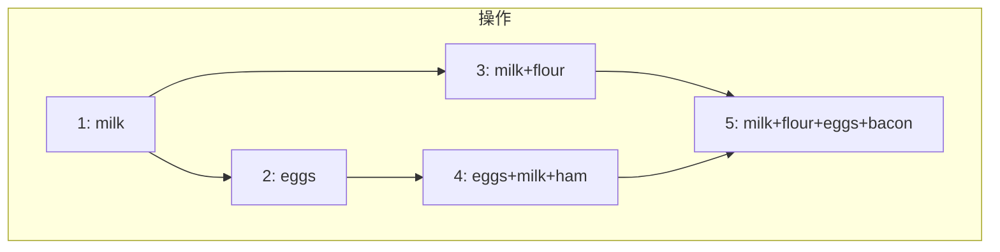

**图 5-13. 捕获两个客户端并发编辑购物车的因果依赖。**

图 5-13 中操作之间的数据流在图 5-14 中以图形方式说明。箭头表示哪个操作发生在哪个其他操作之前，即后面的操作知道或依赖前面的操作。在此示例中，客户端从未完全与服务器上的数据保持同步，因为总是有另一个操作在并发进行。但旧版本的值最终会被覆盖，没有写入丢失。

**图 5-14. 图 5-13 中因果依赖的图。**

请注意，服务器可以通过查看版本号来确定两个操作是否并发——它不需要解释值本身（所以值可以是任何数据结构）。算法工作如下：

- 服务器为每个键维护一个版本号，每次写入该键时递增版本号，并将新版本号与写入的值一起存储。
- 当客户端读取键时，服务器返回所有未被覆盖的值，以及最新版本号。客户端必须在写入之前读取键。
- 当客户端写入键时，它必须包含先前读取的版本号，并且必须合并先前读取中收到的所有值。（写请求的响应可以像读取一样，返回所有当前值，这允许我们像购物车示例中那样链接多次写入。）
- 当服务器收到带有特定版本号的写入时，它可以覆盖该版本号或更低的所有值（因为它知道它们已合并到新值中），但必须保留版本号更高的所有值（因为那些值与传入的写入并发）。

当写入包含先前读取的版本号时，这告诉我们写入基于哪个先前状态。如果你在不包含版本号的情况下进行写入，它与所有其他写入并发，因此它不会覆盖任何东西——它只会在后续读取时作为值之一返回。

**合并并发写入的值**

此算法确保没有数据被静默丢弃，但不幸的是要求客户端做一些额外工作：如果多个操作并发发生，客户端必须事后清理合并并发写入的值。Riak 将这些并发值称为**兄弟**（siblings）。

合并兄弟值本质上与多主复制中的冲突解决是相同的问题，我们之前讨论过（见「处理写冲突」）。一种简单的方法是仅根据版本号或时间戳选择其中一个值（最后写入获胜），但这意味着丢失数据。因此，你可能需要在应用代码中做一些更智能的事情。

对于购物车示例，合并兄弟的合理方法是取并集。在图 5-14 中，两个最终兄弟是 [milk, flour, eggs, bacon] 和 [eggs, milk, ham]；注意牛奶和鸡蛋出现在两者中，尽管它们各自只被写入一次。合并的值可能是 [milk, flour, eggs, bacon, ham] 之类的东西，没有重复。

然而，如果你允许人们从购物车中移除东西，而不仅仅是添加东西，那么取兄弟的并集可能不会产生正确的结果：如果你合并两个兄弟购物车，并且一个商品在其中一个中被移除，那么被移除的商品会在兄弟的并集中重新出现 [37]。为防止此问题，当商品被移除时，不能简单地从数据库中删除；相反，系统必须留下带有适当版本号的标记，以指示在合并兄弟时该商品已被移除。这种删除标记称为**墓碑**（tombstone）。（我们之前在「哈希索引」中在日志压缩的上下文中看到了墓碑。）

由于在应用代码中合并兄弟是复杂且容易出错的，有一些努力设计可以自动执行此合并的数据结构，如「自动冲突解决」中所述。例如，Riak 的数据类型支持使用称为 CRDT 的数据结构系列 [38, 39, 55]，可以以合理的方式自动合并兄弟，包括保留删除。

**版本向量**

图 5-13 中的示例只使用了单个副本。当有多个副本但没有主节点时，算法如何变化？

图 5-13 使用单个版本号来捕获操作之间的依赖关系，但当有多个副本并发接受写入时，这不够。相反，我们需要为每个副本以及每个键使用版本号。每个副本在处理写入时递增自己的版本号，并跟踪它从每个其他副本看到的版本号。此信息指示哪些值要覆盖，哪些值要保留为兄弟。来自所有副本的版本号集合称为**版本向量**（version vector）[56]。

这个想法的几个变体在使用中，但最有趣的可能是**点状版本向量**（dotted version vector）[57]，在 Riak 2.0 中使用 [58, 59]。我们不会深入细节，但其工作方式与我们在购物车示例中看到的非常相似。

与图 5-13 中的版本号一样，版本向量在读取值时从数据库副本发送到客户端，并在随后写入值时需要发送回数据库。（Riak 将版本向量编码为它称为因果上下文的字符串。）版本向量允许数据库区分覆盖和并发写入。

与单副本示例一样，应用可能需要合并兄弟。版本向量结构确保从一个副本读取然后写回另一个副本是安全的。这样做可能导致创建兄弟，但只要正确合并兄弟，就不会丢失数据。

::: info 版本向量与向量时钟
版本向量有时也称为向量时钟（vector clock），尽管它们并不完全相同。区别很微妙——请参阅参考文献了解详情 [57, 60, 61]。简而言之，在比较副本状态时，版本向量是使用的正确数据结构。
:::

## 小结

在本章中，我们研究了复制问题。复制可以服务于多个目的：

- **高可用性**：即使一台机器（或几台机器，或整个数据中心）宕机，也保持系统运行
- **离线操作**：当网络中断时允许应用继续工作
- **延迟**：将数据地理上靠近用户，以便用户更快地与之交互
- **可扩展性**：通过在副本上执行读取，能够处理比单机更多的读取量

尽管目标很简单——在几台机器上保留相同数据的副本——复制结果是一个极其棘手的问题。它需要仔细考虑并发以及可能出错的所有事情，并处理这些故障的后果。至少，我们需要处理不可用的节点和网络中断（这甚至没有考虑更隐蔽的故障类型，例如由于软件错误导致的静默数据损坏）。

我们讨论了三种主要的复制方法：

1. **单主复制**：客户端将所有写入发送到单个节点（主节点），主节点将数据变更事件流发送到其他副本（从节点）。读取可以在任何副本上执行，但从从节点读取可能陈旧。
2. **多主复制**：客户端将每次写入发送到多个主节点之一，每个主节点都可以接受写入。主节点将数据变更事件流相互发送给彼此和任何从节点。
3. **无主复制**：客户端将每次写入发送到多个节点，并从多个节点并行读取以检测和纠正具有陈旧数据的节点。

每种方法都有优缺点。单主复制很流行，因为它相当容易理解，不需要担心冲突解决。多主和无主复制在存在故障节点、网络中断和延迟峰值时可能更稳健——代价是更难推理和只提供非常弱的一致性保证。

复制可以是同步的或异步的，当存在故障时对系统行为有深远影响。尽管异步复制在系统平稳运行时可能很快，但重要的是在复制延迟增加和服务器故障时弄清楚会发生什么。如果主节点故障，你将异步更新的从节点提升为新主节点，最近提交的数据可能会丢失。

我们研究了一些可能由复制延迟引起的奇怪效果，并讨论了几种一致性模型，有助于决定应用在复制延迟下应该如何表现：

- **读后写一致性**：用户应该始终看到他们自己提交的数据。
- **单调读**：用户在一个时间点看到数据后，他们不应该在之后看到更早时间点的数据。
- **一致前缀读**：用户应该看到因果意义上合理的数据状态：例如，以正确顺序看到问题和答案。

最后，我们讨论了多主和无主复制方法固有的并发问题：因为它们允许多个写入并发发生，可能发生冲突。我们研究了一个数据库可能用于确定一个操作是否发生在另一个之前，或者它们是否并发发生的算法。我们还提到了通过合并并发更新来解决冲突的方法。

在下一章中，我们将继续研究分布在多台机器上的数据，通过复制的对应物：将大型数据集分成分区。

---

[← 上一章](../part1/ch04.md) | [目录](../index.md) | [下一章 →](ch06.md)
