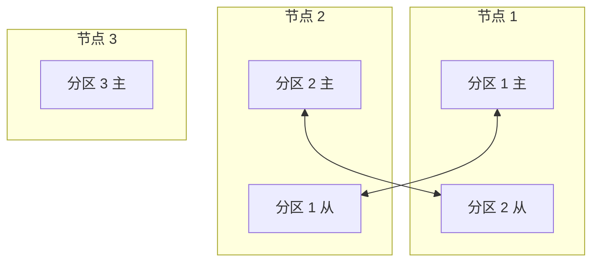
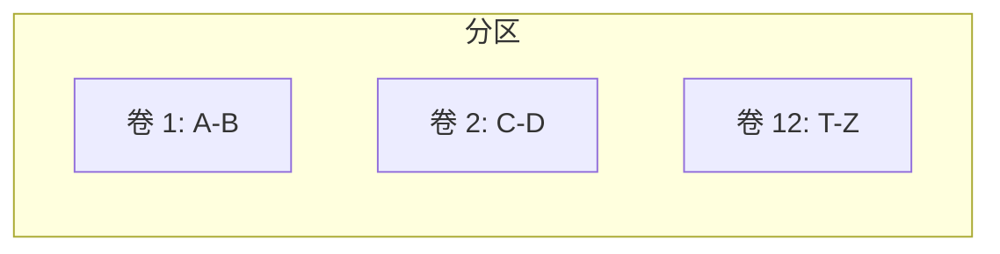
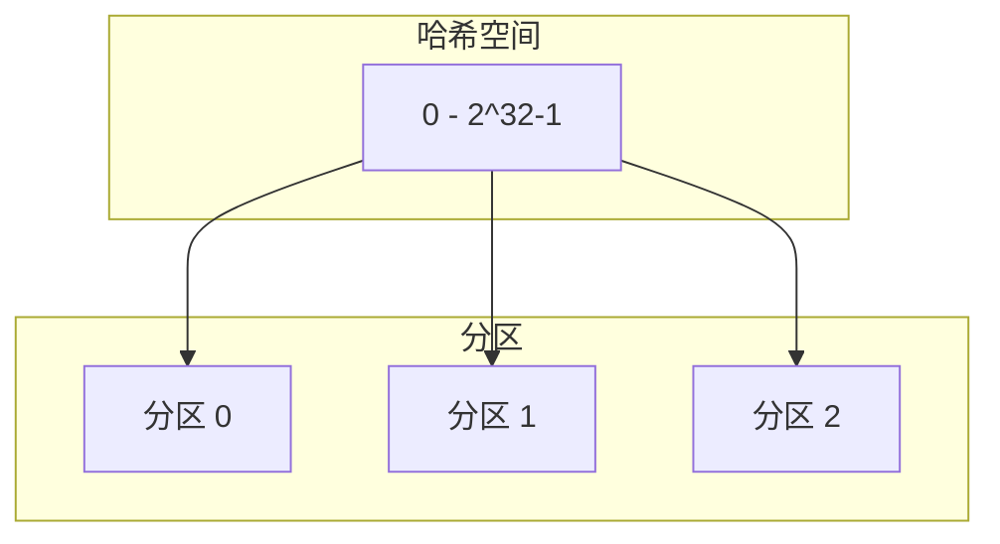
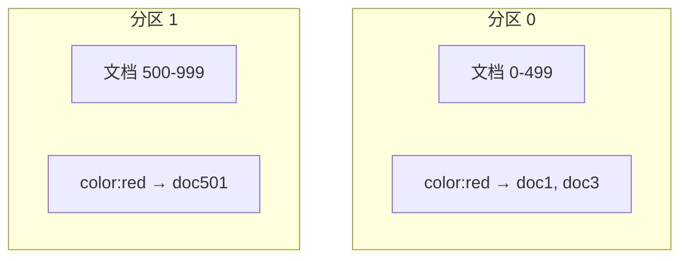
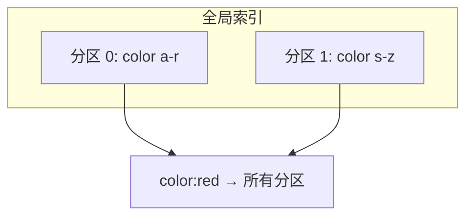
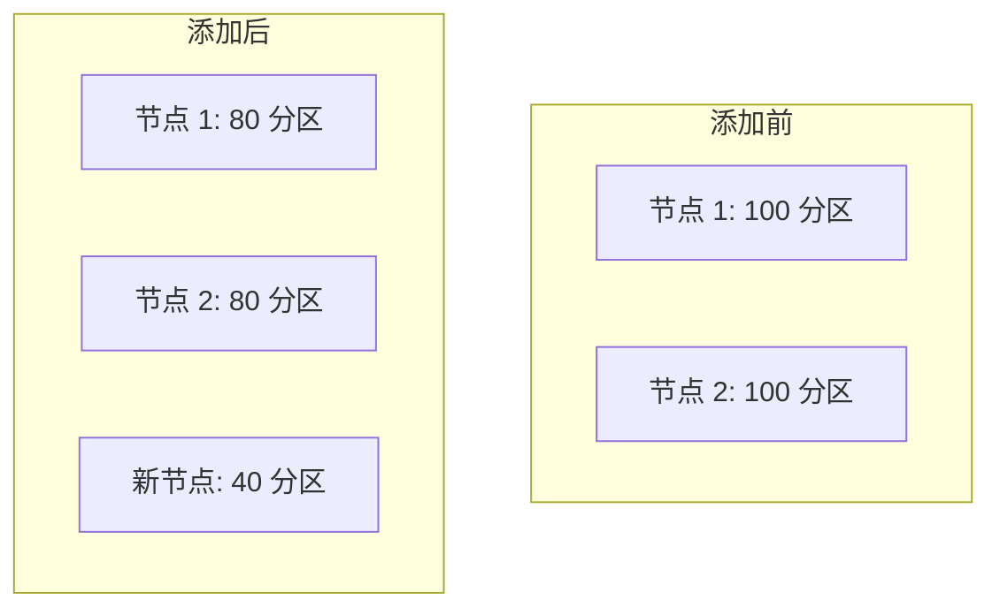
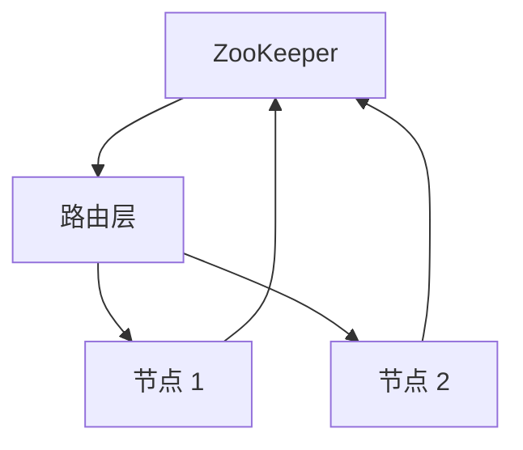

# 第6章 分区

> 显然，我们必须摆脱顺序性，不限制计算机。我们必须陈述定义并提供数据的优先级和描述。我们必须陈述关系，而不是过程。
>
> — 格雷斯·穆雷·霍珀，《管理与未来的计算机》（1962）

在第 5 章中，我们讨论了**复制**（replication）——即在不同节点上拥有相同数据的多个副本。对于非常大的数据集或非常高的查询吞吐量，这还不够：我们需要将数据拆分为**分区**（partitioning），也称为**分片**（sharding）。

::: info 术语说明
本章讨论的分区是故意将大型数据库拆分为较小数据库的一种方式。它与**网络分区**（network partitions，netsplits）无关，后者是节点之间网络的一种故障类型。我们将在第 8 章讨论此类故障。
:::

**术语混淆**

我们在此称为分区的，在 MongoDB、Elasticsearch 和 SolrCloud 中称为 shard；在 HBase 中称为 region，在 Bigtable 中称为 tablet，在 Cassandra 和 Riak 中称为 vnode，在 Couchbase 中称为 vBucket。然而，分区是最成熟的术语，因此我们坚持使用它。

通常，分区的定义方式是每条数据（每条记录、行或文档）恰好属于一个分区。有各种方法实现这一点，我们将在本章深入讨论。实际上，每个分区都是自己的小型数据库，尽管数据库可能支持同时触及多个分区的操作。

想要分区数据的主要原因是**可扩展性**（scalability）。不同的分区可以放置在无共享集群（shared-nothing cluster）的不同节点上（见第二部分引言对 shared nothing 的定义）。因此，大型数据集可以分布在许多磁盘上，查询负载可以分布在许多处理器上。

对于在单个分区上操作的查询，每个节点可以独立地为其自己的分区执行查询，因此可以通过添加更多节点来扩展查询吞吐量。大型复杂查询可能可以在许多节点上并行化，尽管这会变得显著困难。

分区数据库由 Teradata 和 Tandem NonStop SQL [1] 等产品在 1980 年代开创，最近被 NoSQL 数据库和基于 Hadoop 的数据仓库重新发现。一些系统为事务工作负载设计，其他为分析设计（见「事务处理还是分析？」）：这种差异影响系统的调优方式，但分区的基本原理适用于两种工作负载。

在本章中，我们将首先研究分区大型数据集的不同方法，并观察数据索引如何与分区交互。然后我们将讨论**再平衡**（rebalancing），如果你想在集群中添加或删除节点，这是必要的。最后，我们将概述数据库如何将请求路由到正确的分区并执行查询。

## 分区与复制

分区通常与复制结合使用，以便每个分区的副本存储在多个节点上。这意味着，即使每条记录恰好属于一个分区，它仍可能为容错而存储在几个不同的节点上。

一个节点可能存储多个分区。如果使用主从复制模型，分区和复制的组合可能如图 6-1 所示。每个分区的主节点分配给一个节点，其从节点分配给其他节点。每个节点可能是某些分区的主节点，同时是其他分区的从节点。

**图 6-1. 结合复制与分区：每个节点充当某些分区的主节点和其他分区的从节点。**

我们在第 5 章讨论的关于数据库复制的一切同样适用于分区复制。分区方案的选择与复制方案的选择大多独立，因此我们将保持简单，在本章中忽略复制。

## 键值数据的分区

假设你有大量数据，想要分区。你如何决定将哪些记录存储在哪台节点上？

我们分区的目标是将数据和查询负载均匀地分布在节点上。如果每个节点承担公平份额，那么——理论上——10 个节点应该能够处理 10 倍的数据和 10 倍的读写吞吐量（暂时忽略复制）。

如果分区不公平，以致某些分区比其他分区有更多数据或查询，我们称之为**倾斜**（skewed）。倾斜的存在使分区效果大打折扣。在极端情况下，所有负载可能最终落在一个分区上，因此 10 个节点中有 9 个空闲，你的瓶颈是单个繁忙节点。负载不成比例高的分区称为**热点**（hot spot）。

避免热点的最简单方法是将记录随机分配给节点。这会将数据相当均匀地分布在节点上，但有一个大缺点：当你尝试读取特定项时，你无法知道它在哪个节点上，因此你必须并行查询所有节点。

我们可以做得更好。让我们暂时假设你有一个简单的键值数据模型，其中你总是通过主键访问记录。例如，在传统的纸质百科全书中，你通过标题查找条目；由于所有条目按标题字母顺序排序，你可以快速找到你要找的条目。

### 按键范围分区

一种分区方式是为每个分区分配连续的键范围（从某个最小值到某个最大值），就像纸质百科全书的卷（图 6-2）。如果你知道范围之间的边界，你可以轻松确定哪个分区包含给定键。如果你还知道哪个分区分配给哪个节点，那么你可以直接向适当的节点发出请求（或者，在百科全书的情况下，从书架上取下正确的书）。

**图 6-2. 纸质百科全书按键范围分区。**

键的范围不一定均匀分布，因为你的数据可能不均匀分布。例如，在图 6-2 中，卷 1 包含以 A 和 B 开头的词，但卷 12 包含以 T、U、V、X、Y 和 Z 开头的词。简单地为字母表的每两个字母设一卷会导致某些卷比其他卷大得多。为了均匀分布数据，分区边界需要适应数据。

分区边界可能由管理员手动选择，或者数据库可以自动选择（我们将在「再平衡分区」中更详细地讨论分区边界的选择）。此分区策略被 Bigtable、其开源等价物 HBase [2, 3]、RethinkDB 和 2.4 版之前的 MongoDB [4] 使用。

在每个分区内，我们可以保持键的排序顺序（见「SSTables 和 LSM-Trees」）。这样做的优点是范围扫描很容易，你可以将键视为串联索引以在一次查询中获取多条相关记录（见「多列索引」）。例如，考虑一个存储传感器网络数据的应用，其中键是测量的时间戳（年-月-日-时-分-秒）。范围扫描在这种情况下非常有用，因为它们让你轻松获取，例如，特定月份的所有读数。

然而，键范围分区的缺点是某些访问模式可能导致热点。如果键是时间戳，那么分区对应于时间范围——例如，每天一个分区。不幸的是，因为我们随着测量发生将传感器数据写入数据库，所有写入最终都进入同一分区（今天的分区），因此该分区可能因写入而过载，而其他分区闲置 [5]。

为避免传感器数据库中的此问题，你需要使用时间戳以外的其他东西作为键的第一个元素。例如，你可以在每个时间戳前加上传感器名称，以便分区首先按传感器名称，然后按时间。假设你同时有许多活跃的传感器，写入负载将最终更均匀地分布在分区上。现在，当你想在时间范围内获取多个传感器的值时，你需要为每个传感器名称执行单独的范围查询。

### 按键哈希分区

由于倾斜和热点的风险，许多分布式数据存储使用**哈希函数**（hash function）来确定给定键的分区。

一个好的哈希函数接受倾斜数据并使其均匀分布。假设你有一个接受字符串的 32 位哈希函数。每当你给它一个新字符串时，它返回 0 到 $2^{32}-1$ 之间的看似随机的数字。即使输入字符串非常相似，它们的哈希值也均匀分布在该数字范围内。

出于分区目的，哈希函数不需要加密强度：例如，Cassandra 和 MongoDB 使用 MD5，Voldemort 使用 Fowler-Noll-Vo 函数。许多编程语言有内置的简单哈希函数（因为它们用于哈希表），但它们可能不适合分区：例如，在 Java 的 `Object.hashCode()` 和 Ruby 的 `Object#hash` 中，同一键在不同进程中可能有不同的哈希值 [6]。

一旦你有了适合键的哈希函数，你可以为每个分区分配哈希范围（而不是键范围），每个哈希落在分区范围内的键将存储在该分区中。如图 6-3 所示。

**图 6-3. 按键哈希分区。**

此技术在分区之间公平分布键方面做得很好。分区边界可以均匀分布，或者可以伪随机选择（在这种情况下，该技术有时称为**一致性哈希**，consistent hashing）。

**一致性哈希**

由 Karger 等人 [7] 定义的一致性哈希是一种在互联网范围的缓存系统（如内容分发网络 CDN）中均匀分布负载的方法。它使用随机选择的分区边界来避免需要中央控制或分布式共识。请注意，这里的「一致」与副本一致性（见第 5 章）或 ACID 一致性（见第 7 章）无关，而是描述了一种特定的再平衡方法。

正如我们将在「再平衡分区」中看到的，这种特定方法实际上对数据库效果不太好 [8]，因此实践中很少使用（一些数据库的文档仍然引用一致性哈希，但通常不准确）。因为这非常令人困惑，最好避免术语一致性哈希，而只称其为哈希分区。

然而不幸的是，通过使用键的哈希进行分区，我们失去了键范围分区的一个好特性：执行高效范围查询的能力。曾经相邻的键现在分散在所有分区中，因此它们的排序顺序丢失了。在 MongoDB 中，如果你启用了基于哈希的分片模式，任何范围查询都必须发送到所有分区 [4]。Riak [9]、Couchbase [10] 或 Voldemort 不支持主键上的范围查询。

Cassandra 在两种分区策略之间实现了折中 [11, 12, 13]。Cassandra 中的表可以用由多列组成的复合主键声明。只有该键的第一部分被哈希以确定分区，但其他列用作 Cassandra SSTables 中数据排序的串联索引。因此，查询无法在复合键的第一列中搜索值范围，但如果它为第一列指定固定值，它可以对键的其他列执行高效的范围扫描。

串联索引方法为一对多关系提供了优雅的数据模型。例如，在社交媒体网站上，一个用户可能发布许多更新。如果更新的主键选择为 `(user_id, update_timestamp)`，那么你可以高效地检索特定用户在某个时间间隔内所做的所有更新，按时间戳排序。不同用户可能存储在不同分区，但在每个用户内，更新按时间戳排序存储在单个分区上。

### 倾斜工作负载与缓解热点

如前所述，对键进行哈希以确定其分区可以帮助减少热点。然而，它无法完全避免它们：在极端情况下，所有读写都是针对同一键的，你仍然最终将所有请求路由到同一分区。

这种工作负载可能不寻常，但并非闻所未闻：例如，在社交媒体网站上，拥有数百万粉丝的名人用户在做某事时可能引发活动风暴 [14]。此事件可能导致对同一键的大量写入（其中键可能是名人的用户 ID，或人们正在评论的操作的 ID）。对键进行哈希没有帮助，因为两个相同 ID 的哈希仍然相同。

今天，大多数数据系统无法自动补偿这种高度倾斜的工作负载，因此减少倾斜是应用的责任。例如，如果已知一个键非常热，一个简单的技术是在键的开头或结尾添加随机数。仅两位十进制随机数就会将对该键的写入均匀地分散到 100 个不同的键上，允许这些键分布到不同的分区。

然而，在将写入分散到不同键之后，任何读取现在都必须做额外的工作，因为它们必须从所有 100 个键读取数据并合并。此技术还需要额外的簿记：只为少数热键追加随机数才有意义；对于绝大多数低写入吞吐量的键，这将是不必要的开销。因此，你还需要某种方式来跟踪哪些键正在被拆分。

也许在未来，数据系统将能够自动检测和补偿倾斜的工作负载；但目前，你需要为自己的应用仔细考虑权衡。

## 分区与二级索引

到目前为止我们讨论的分区方案依赖于键值数据模型。如果记录仅通过主键访问，我们可以从该键确定分区，并使用它将读写请求路由到负责该键的分区。

如果涉及**二级索引**（secondary indexes）（另见「其他索引结构」），情况变得更加复杂。二级索引通常不唯一标识记录，而是搜索特定值出现的一种方式：查找用户 123 的所有操作、查找包含单词 hogwash 的所有文章、查找颜色为红色的所有汽车等。

二级索引是关系数据库的主食，在文档数据库中也常见。许多键值存储（如 HBase 和 Voldemort）由于增加的实现复杂性而避免了二级索引，但一些（如 Riak）已开始添加它们，因为它们对数据建模非常有用。最后，二级索引是 Solr 和 Elasticsearch 等搜索服务器存在的理由。

二级索引的问题在于它们不能整齐地映射到分区。分区具有二级索引的数据库有两种主要方法：**基于文档的分区**和**基于词项的分区**。

### 按文档分区二级索引

例如，想象你正在运营一个销售二手汽车的网站（如图 6-4 所示）。每个列表都有唯一 ID——称为文档 ID——你按文档 ID 分区数据库（例如，分区 0 中 ID 0 到 499，分区 1 中 ID 500 到 999 等）。

你想让用户搜索汽车，允许他们按颜色和品牌过滤，因此你需要在颜色和品牌上有二级索引（在文档数据库中这些将是字段；在关系数据库中它们将是列）。如果你声明了索引，数据库可以自动执行索引。例如，每当将红色汽车添加到数据库时，数据库分区会自动将其添加到索引条目 `color:red` 的文档 ID 列表中。

**图 6-4. 按文档分区二级索引。**

在这种索引方法中，每个分区完全独立：每个分区维护自己的二级索引，仅覆盖该分区中的文档。它不关心其他分区中存储了什么数据。每当你需要写入数据库——添加、删除或更新文档——你只需要处理包含你正在写入的文档 ID 的分区。因此，文档分区索引也称为**本地索引**（local index，与下一节描述的全局索引相对）。

然而，从文档分区索引读取需要小心：除非你对文档 ID 做了特殊处理，否则没有理由所有具有特定颜色或特定品牌的汽车都在同一分区。在图 6-4 中，红色汽车出现在分区 0 和分区 1 中。因此，如果你想搜索红色汽车，你需要将查询发送到所有分区，并合并你得到的所有结果。

这种查询分区数据库的方法有时称为**分散/收集**（scatter/gather），它可能使二级索引上的读查询相当昂贵。即使你并行查询分区，分散/收集也容易受到尾部延迟放大（见「实践中的百分位数」）。尽管如此，它被广泛使用：MongoDB、Riak [15]、Cassandra [16]、Elasticsearch [17]、SolrCloud [18] 和 VoltDB [19] 都使用文档分区二级索引。大多数数据库供应商建议你构建分区方案，以便二级索引查询可以从单个分区提供，但这并不总是可能的，特别是当你在单个查询中使用多个二级索引时（例如同时按颜色和品牌过滤汽车）。

### 按词项分区二级索引

与其让每个分区有自己的二级索引（本地索引），我们可以构建覆盖所有分区数据的**全局索引**（global index）。然而，我们不能只是将该索引存储在一个节点上，因为它可能成为瓶颈并违背分区的目的。全局索引也必须分区，但它可以与主键索引不同地分区。

图 6-5 说明了这可能的样子：来自所有分区的红色汽车出现在索引中的 `color:red` 下，但索引被分区，使得以字母 a 到 r 开头的颜色出现在分区 0，以 s 到 z 开头的颜色出现在分区 1。汽车品牌的索引类似地分区（分区边界在 f 和 h 之间）。

**图 6-5. 按词项分区二级索引。**

我们将这种索引称为**词项分区**（term-partitioned），因为我们查找的**词项**（term）决定索引的分区。这里，词项将是 `color:red`，例如。术语「词项」来自全文索引（一种特殊的二级索引），其中词项是文档中出现的所有单词。

与之前一样，我们可以按词项本身分区索引，或使用词项的哈希。按词项本身分区对于范围扫描很有用（例如，在数字属性上，如汽车的标价），而按词项哈希分区给出更均匀的负载分布。

全局（词项分区）索引相对于文档分区索引的优点是它可以使读取更高效：客户端只需向包含它想要的词项的分区发出请求，而不是对所有分区进行分散/收集。然而，全局索引的缺点是写入更慢、更复杂，因为对单个文档的写入现在可能影响索引的多个分区（文档中的每个词项可能在不同的分区、不同的节点上）。

在理想世界中，索引将始终是最新的，写入数据库的每个文档将立即反映在索引中。然而，在词项分区索引中，这将需要跨写入影响的所有分区的分布式事务，并非所有数据库都支持（见第 7 章和第 9 章）。

在实践中，全局二级索引的更新通常是异步的（即，如果你在写入后不久读取索引，你刚刚所做的更改可能尚未反映在索引中）。例如，Amazon DynamoDB 声明其全局二级索引在正常情况下在几分之一秒内更新，但在基础设施故障情况下可能经历更长的传播延迟 [20]。

全局词项分区索引的其他用途包括 Riak 的搜索功能 [21] 和 Oracle 数据仓库，它让你在本地和全局索引之间选择 [22]。我们将在第 12 章回到实现词项分区二级索引的主题。

## 再平衡分区

随着时间的推移，数据库中的情况会发生变化：

- 查询吞吐量增加，因此你想添加更多 CPU 来处理负载。
- 数据集大小增加，因此你想添加更多磁盘和 RAM 来存储它。
- 机器故障，其他机器需要接管故障机器的职责。

所有这些变化都需要将数据和请求从一台节点移动到另一台。将负载从集群中的一个节点移动到另一个节点的过程称为**再平衡**（rebalancing）。

无论使用哪种分区方案，再平衡通常需要满足一些最低要求：

- 再平衡后，负载（数据存储、读写请求）应在集群中的节点之间公平共享。
- 再平衡进行时，数据库应继续接受读写。
- 节点之间移动的数据不应超过必要，以使再平衡快速并最小化网络和磁盘 I/O 负载。

### 再平衡策略

有几种不同的方式将分区分配给节点 [23]。让我们依次简要讨论每种。

**不要这样做：hash mod N**

当按键的哈希分区时，我们之前（图 6-3）说最好将可能的哈希划分为范围并将每个范围分配给分区（例如，如果 $0 \leq \text{hash}(key) < b_0$ 则分配给分区 0，如果 $b_0 \leq \text{hash}(key) < b_1$ 则分配给分区 1，等等）。

也许你想知道为什么我们不直接使用 mod（许多编程语言中的 `%` 运算符）。例如，`hash(key) mod 10` 将返回 0 到 9 之间的数字（如果我们将哈希写为十进制数，哈希 mod 10 将是最后一位）。如果我们有 10 个节点，编号 0 到 9，这似乎是将每个键分配给节点的简单方法。

**mod N** 方法的问题在于，如果节点数 N 发生变化，大多数键将需要从一个节点移动到另一个节点。例如，假设 `hash(key) = 123456`。如果你最初有 10 个节点，该键从节点 6 开始（因为 123456 mod 10 = 6）。当你增长到 11 个节点时，该键需要移动到节点 3（123456 mod 11 = 3），当你增长到 12 个节点时，需要移动到节点 0（123456 mod 12 = 0）。这种频繁移动使再平衡过于昂贵。

我们需要一种不会不必要地移动数据的方法。

**固定数量的分区**

幸运的是，有一个相当简单的解决方案：创建比节点多得多的分区，并将多个分区分配给每个节点。例如，在 10 个节点集群上运行的数据库可能从一开始就拆分为 1000 个分区，以便每个节点分配大约 100 个分区。

现在，如果向集群添加节点，新节点可以从每个现有节点窃取几个分区，直到分区再次公平分布。此过程如图 6-6 所示。如果从集群中删除节点，则相反地发生相同的情况。

只有整个分区在节点之间移动。分区数量不变，键到分区的分配也不变。唯一改变的是分区到节点的分配。此分配变更不是立即的——通过网络传输大量数据需要一些时间——因此对于传输进行期间发生的任何读写，使用分区的旧分配。

**图 6-6. 向每节点多分区的数据库集群添加新节点。**

原则上，你甚至可以考虑集群中的硬件不匹配：通过将更多分区分配给更强大的节点，你可以强制这些节点承担更大的负载份额。

Riak [15]、Elasticsearch [24]、Couchbase [10] 和 Voldemort [25] 使用这种再平衡方法。

在此配置中，分区数量通常在数据库首次设置时固定，之后不更改。尽管原则上可以拆分和合并分区（见下一节），但固定数量的分区在操作上更简单，因此许多固定分区数据库选择不实现分区拆分。因此，一开始配置的分区数量是你可以拥有的最大节点数，因此你需要选择足够高以容纳未来增长。然而，每个分区也有管理开销，因此选择过高的数量会适得其反。

如果数据集的总大小变化很大（例如，如果它开始时很小但可能随时间增长得更大），选择正确的分区数量很困难。由于每个分区包含总数据的固定比例，每个分区的大小与集群中的总数据量成比例增长。如果分区非常大，再平衡和从节点故障恢复会变得昂贵。但如果分区太小，它们会产生太多开销。当分区大小「刚刚好」时——既不太大也不太小——实现最佳性能，如果分区数量固定但数据集大小变化，这可能难以实现。

**动态分区**

对于使用键范围分区的数据库（见「按键范围分区」），具有固定边界的固定数量分区会非常不方便：如果你弄错了边界，你可能最终所有数据在一个分区中，所有其他分区为空。手动重新配置分区边界会非常繁琐。

因此，HBase 和 RethinkDB 等键范围分区数据库**动态创建**分区。当分区增长超过配置的大小（在 HBase 上，默认为 10 GB）时，它被拆分为两个分区，以便大约一半的数据最终在拆分的两侧 [26]。相反，如果大量数据被删除且分区缩小到某个阈值以下，它可以与相邻分区合并。此过程类似于 B-tree 顶层发生的情况（见「B-Trees」）。

每个分区分配给一个节点，每个节点可以处理多个分区，就像固定数量分区的情况一样。在大分区被拆分后，其两半之一可以传输到另一个节点以平衡负载。在 HBase 的情况下，分区文件的传输通过 HDFS（底层分布式文件系统）进行 [3]。

动态分区的优点是分区数量适应总数据量。如果只有少量数据，少量分区就足够了，因此开销很小；如果有大量数据，每个单独分区的大小限制在可配置的最大值 [23]。

然而，需要注意的是，空数据库从单个分区开始，因为没有关于在哪里划分分区边界的先验信息。当数据集很小——直到达到第一个分区被拆分的点——所有写入必须由单个节点处理，而其他节点闲置。为了缓解此问题，HBase 和 MongoDB 允许在空数据库上配置初始分区集（这称为**预拆分**，pre-splitting）。在键范围分区的情况下，预拆分要求你已经知道键分布将是什么样子 [4, 26]。

动态分区不仅适用于键范围分区数据，同样可以用于哈希分区数据。2.4 版以来的 MongoDB 支持键范围和哈希分区，在两种情况下都动态拆分分区。

**按节点比例分区**

使用动态分区，分区数量与数据集大小成比例，因为拆分和合并过程将每个分区的大小保持在某个固定最小值和最大值之间。另一方面，使用固定数量的分区，每个分区的大小与数据集大小成比例。在这两种情况下，分区数量与节点数量无关。

Cassandra 和 Ketama 使用的第三种选择是使分区数量与节点数量成比例——换句话说，每个节点有固定数量的分区 [23, 27, 28]。在这种情况下，每个分区的大小与数据集大小成比例增长，而节点数量保持不变，但当你增加节点数量时，分区再次变小。由于较大的数据量通常需要更多节点来存储，这种方法也使每个分区的大小相当稳定。

当新节点加入集群时，它随机选择固定数量的现有分区进行拆分，然后获得这些拆分分区中每个分区的一半所有权，同时将每个分区的另一半留在原处。随机化可能产生不公平的拆分，但当在大量分区上平均时（在 Cassandra 中，默认每节点 256 个分区），新节点最终从现有节点承担公平的负载份额。Cassandra 3.0 引入了避免不公平拆分的替代再平衡算法 [29]。

随机选择分区边界要求使用基于哈希的分区（以便可以从哈希函数产生的数字范围中选择边界）。事实上，这种方法最接近一致性哈希的原始定义 [7]（见「一致性哈希」）。较新的哈希函数可以用更低的元数据开销实现类似效果 [8]。

### 操作：自动或手动再平衡

关于再平衡有一个重要问题我们忽略了：再平衡是自动发生还是手动发生？

在完全自动再平衡（系统自动决定何时将分区从一个节点移动到另一个节点，无需任何管理员交互）和完全手动（分区到节点的分配由管理员显式配置，仅当管理员显式重新配置时才更改）之间存在梯度。例如，Couchbase、Riak 和 Voldemort 自动生成建议的分区分配，但需要管理员在生效之前提交它。

完全自动再平衡可能很方便，因为正常维护的操作工作更少。然而，它可能不可预测。再平衡是一项昂贵的操作，因为它需要重新路由请求并将大量数据从一个节点移动到另一个节点。如果不小心完成，此过程可能使网络或节点过载，并在再平衡进行时损害其他请求的性能。

这种自动化与自动故障检测结合可能是危险的。例如，假设一个节点过载并暂时缓慢响应请求。其他节点得出结论认为过载节点已死，并自动再平衡集群以将负载从它移开。这给过载节点、其他节点和网络增加了额外负载——使情况变得更糟，并可能导致级联故障。

因此，在再平衡中有人参与可能是一件好事。它比完全自动过程慢，但可以帮助防止操作意外。

## 请求路由

我们现在已经在多台机器上运行的多个节点之间分区了数据集。但还有一个悬而未决的问题：当客户端想要发出请求时，它如何知道要连接到哪个节点？随着分区再平衡，分区到节点的分配会发生变化。有人需要跟踪这些变化才能回答这个问题：如果我想读取或写入键「foo」，我需要连接到哪个 IP 地址和端口号？

这是一个更普遍的问题的实例，称为**服务发现**（service discovery），它不仅限于数据库。任何可通过网络访问的软件都有这个问题，特别是如果它旨在实现高可用性（在多台机器上以冗余配置运行）。许多公司编写了自己的内部服务发现工具，其中许多已作为开源发布 [30]。

在高层次上，有几种不同的方法来解决这个问题（如图 6-7 所示）：

1. **允许客户端联系任何节点**（例如，通过轮询负载均衡器）。如果该节点恰好拥有请求适用的分区，它可以直接处理请求；否则，它将请求转发到适当的节点，接收回复，并将回复传递给客户端。
2. **将所有客户端请求首先发送到路由层**，路由层确定应处理每个请求的节点并相应地转发。此路由层本身不处理任何请求；它仅充当分区感知的负载均衡器。
3. **要求客户端了解分区和分区到节点的分配**。在这种情况下，客户端可以直接连接到适当的节点，无需任何中介。

在所有情况下，关键问题是：做出路由决策的组件（可能是节点之一、路由层或客户端）如何了解分区到节点分配的变化？

**图 6-7. 将请求路由到正确节点的三种不同方式。**

这是一个具有挑战性的问题，因为所有参与者达成一致很重要——否则请求将被发送到错误的节点并且无法正确处理。有在分布式系统中实现共识的协议，但它们难以正确实现（见第 9 章）。

许多分布式数据系统依赖 ZooKeeper 等单独的协调服务来跟踪此集群元数据，如图 6-8 所示。每个节点在 ZooKeeper 中注册自己，ZooKeeper 维护分区到节点的权威映射。其他参与者，如路由层或分区感知客户端，可以在 ZooKeeper 中订阅此信息。每当分区更改所有权，或添加或删除节点时，ZooKeeper 通知路由层，以便它可以保持其路由信息最新。

**图 6-8. 使用 ZooKeeper 跟踪分区到节点的分配。**

例如，LinkedIn 的 Espresso 使用 Helix [31] 进行集群管理（Helix 又依赖 ZooKeeper），实现如图 6-8 所示的路由层。HBase、SolrCloud 和 Kafka 也使用 ZooKeeper 跟踪分区分配。MongoDB 有类似的架构，但它依赖自己的配置服务器实现和 mongos 守护进程作为路由层。

Cassandra 和 Riak 采用不同的方法：它们在节点之间使用 **gossip 协议**（gossip protocol）传播集群状态的任何变化。请求可以发送到任何节点，该节点将请求转发到请求分区的适当节点（图 6-7 中的方式 1）。此模型在数据库节点中增加了更多复杂性，但避免了对 ZooKeeper 等外部协调服务的依赖。

Couchbase 不会自动再平衡，这简化了设计。通常它配置有称为 moxi 的路由层，该路由层从集群节点了解路由变化 [32]。

使用路由层或向随机节点发送请求时，客户端仍然需要找到要连接的 IP 地址。这些不像分区到节点的分配那样快速变化，因此使用 DNS 通常就足够了。

## 并行查询执行

到目前为止，我们专注于非常简单的读取或写入单个键的查询（加上文档分区二级索引情况下的分散/收集查询）。这大约是大多数 NoSQL 分布式数据存储支持的访问级别。

然而，**大规模并行处理**（Massively Parallel Processing，MPP）关系数据库产品（通常用于分析）在它们支持的查询类型上要复杂得多。典型的数据仓库查询包含多个连接、过滤、分组和聚合操作。MPP 查询优化器将此复杂查询分解为许多执行阶段和分区，其中许多可以在数据库集群的不同节点上并行执行。涉及扫描数据集大部分内容的查询特别受益于这种并行执行。

数据仓库查询的快速并行执行是一个专门的主题，鉴于分析的业务重要性，它获得了大量商业关注。我们将在第 10 章讨论并行查询执行的一些技术。有关并行数据库中使用的技术的更详细概述，请参阅参考文献 [1, 33]。

## 小结

在本章中，我们探讨了将大型数据集分区为较小子集的不同方法。当你有太多数据以致在单机上存储和处理不再可行时，分区是必要的。

分区的目标是将数据和查询负载均匀地分布在多台机器上，避免热点（负载不成比例高的节点）。这需要选择适合你数据的分区方案，并在向集群添加或删除节点时再平衡分区。

我们讨论了两种主要的分区方法：

- **键范围分区**，其中键被排序，分区拥有从某个最小值到某个最大值的所有键。排序的优点是可以进行高效的范围查询，但如果应用经常访问排序顺序中接近的键，则存在热点风险。在这种方法中，当分区变得太大时，通常通过将范围拆分为两个子范围来动态再平衡分区。
- **哈希分区**，其中对每个键应用哈希函数，分区拥有哈希范围。此方法破坏了键的排序，使范围查询效率低下，但可能更均匀地分布负载。按哈希分区时，通常预先创建固定数量的分区，将多个分区分配给每个节点，并在添加或删除节点时将整个分区从一个节点移动到另一个节点。也可以使用动态分区。

混合方法也是可能的，例如使用复合键：使用键的一部分来标识分区，另一部分用于排序顺序。

我们还讨论了分区与二级索引之间的交互。二级索引也需要分区，有两种方法：

- **文档分区索引**（本地索引），其中二级索引与主键和值存储在同一分区。这意味着写入时只需要更新单个分区，但读取二级索引需要跨所有分区进行分散/收集。
- **词项分区索引**（全局索引），其中二级索引使用索引值单独分区。二级索引中的条目可能包括主键所有分区的记录。写入文档时，需要更新二级索引的几个分区；然而，读取可以从单个分区提供。

最后，我们讨论了将查询路由到适当分区的技术，从简单的分区感知负载均衡到复杂的并行查询执行引擎。

根据设计，每个分区大多独立运行——这就是允许分区数据库扩展到多台机器的原因。然而，需要写入多个分区的操作可能难以推理：例如，如果对一个分区的写入成功但另一个失败，会发生什么？我们将在后续章节中解决这个问题。

---

[← 上一章](ch05.md) | [目录](../index.md) | [下一章 →](ch07.md)
