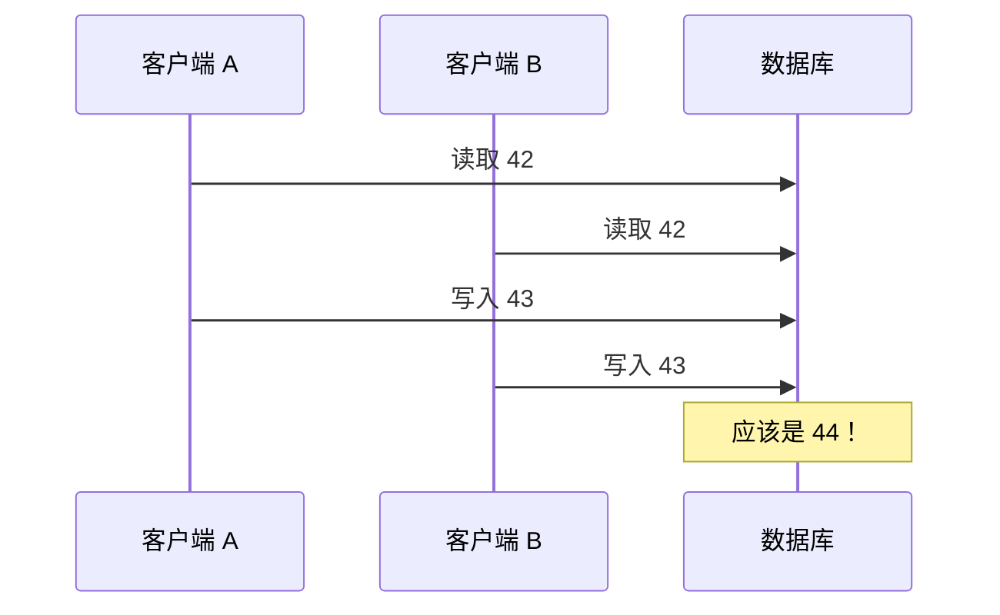
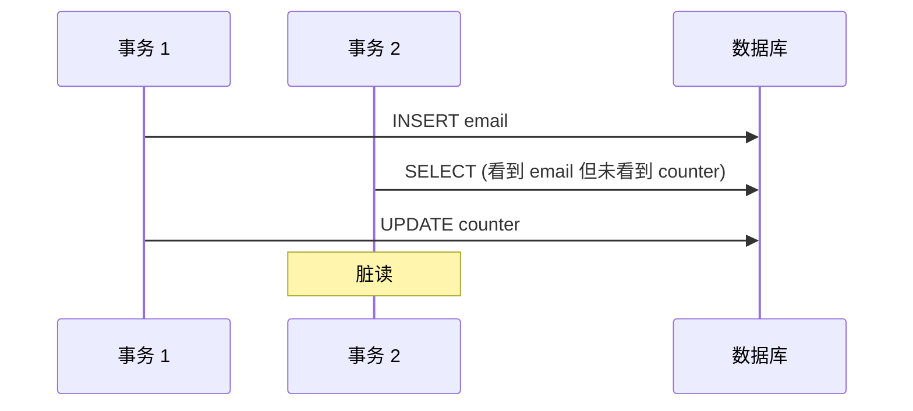

# 第7章 事务

> 一些作者声称，由于它带来的性能或可用性问题，通用两阶段提交太昂贵而无法支持。我们相信，让应用程序员在出现瓶颈时处理因过度使用事务而导致的性能问题，比总是围绕缺乏事务进行编码要好。
>
> — James Corbett 等人，《Spanner：Google 的全球分布式数据库》（2012）

在数据系统的严酷现实中，许多事情可能出错：

- 数据库软件或硬件可能随时故障（包括在写入操作中途）。
- 应用可能随时崩溃（包括在一系列操作中途）。
- 网络中断可能意外切断应用与数据库的连接，或一个数据库节点与另一个节点的连接。
- 多个客户端可能同时向数据库写入，覆盖彼此的更改。
- 客户端可能读取没有意义的数据，因为它只是部分更新。
- 客户端之间的竞争条件可能导致令人惊讶的 bug。

为了可靠，系统必须处理这些故障并确保它们不会导致整个系统的灾难性故障。然而，实现容错机制需要大量工作。它需要仔细考虑所有可能出错的事情，以及大量测试以确保解决方案真正有效。

几十年来，**事务**（transactions）一直是简化这些问题的首选机制。事务是应用将多次读取和写入组合成一个逻辑单元的一种方式。从概念上讲，事务中的所有读取和写入都作为一次操作执行：要么整个事务成功（**提交**，commit），要么失败（**中止**，abort，回滚）。如果失败，应用可以安全地重试。有了事务，应用的错误处理变得简单得多，因为它不需要担心部分失败——即某些操作成功而某些失败的情况（无论出于何种原因）。

如果你多年来一直使用事务，它们可能看起来显而易见，但我们不应将其视为理所当然。事务不是自然法则；它们是为了一个目的而创建的，即简化访问数据库的应用的**编程模型**。通过使用事务，应用可以自由地忽略某些潜在的错误场景和并发问题，因为数据库会处理它们（我们称这些为安全保证）。

并非每个应用都需要事务，有时削弱事务保证或完全放弃它们有优势（例如，以实现更高的性能或更高的可用性）。一些安全属性可以在没有事务的情况下实现。

你如何判断是否需要事务？为了回答这个问题，我们首先需要准确理解事务可以提供哪些安全保证，以及与之相关的成本。尽管事务乍看起来很简单，但实际上有许多微妙但重要的细节在起作用。

在本章中，我们将研究许多可能出错的例子，并探讨数据库用于防范这些问题的算法。我们将在并发控制领域深入探讨，讨论可能发生的各种竞争条件以及数据库如何实现读已提交、快照隔离和可串行化等隔离级别。

本章适用于单节点和分布式数据库；在第 8 章中，我们将专注于仅在分布式系统中出现的特定挑战。

## 事务的滑溜概念

今天几乎所有的关系数据库以及一些非关系数据库都支持事务。它们中的大多数遵循 1975 年由 IBM System R（第一个 SQL 数据库）引入的风格 [1, 2, 3]。尽管一些实现细节已经改变，但总体思路 40 年来几乎保持不变：MySQL、PostgreSQL、Oracle、SQL Server 等的事务支持与 System R 惊人地相似。

在 2000 年代末，非关系（NoSQL）数据库开始流行。它们旨在通过提供新数据模型的选择（见第 2 章）以及默认包含复制（第 5 章）和分区（第 6 章）来改进关系现状。事务是这场运动的主要牺牲品：这一代新数据库中的许多完全放弃了事务，或重新定义了这个词来描述比以前理解的弱得多的保证集 [4]。

随着这批新分布式数据库的宣传，出现了一种流行的信念，即事务是可扩展性的对立面，任何大规模系统都必须放弃事务才能保持良好的性能和高可用性 [5, 6]。另一方面，事务保证有时被数据库供应商呈现为「严肃应用」和「有价值数据」的基本要求。两种观点都是纯粹的夸张。

真相并不那么简单：像其他技术设计选择一样，事务有优势和局限性。为了理解这些权衡，让我们深入了解事务可以提供的保证——无论是在正常操作中还是在各种极端（但现实的）情况下。

### ACID 的含义

事务提供的安全保证通常由著名的首字母缩写 **ACID** 描述，代表**原子性**（Atomicity）、**一致性**（Consistency）、**隔离性**（Isolation）和**持久性**（Durability）。它由 Theo Härder 和 Andreas Reuter 在 1983 年创造 [7]，旨在为数据库中的容错机制建立精确的术语。

然而，在实践中，一个数据库的 ACID 实现不等于另一个的实现。例如，正如我们将看到的，隔离的含义存在很多歧义 [8]。高层次的想法是合理的，但魔鬼在细节中。今天，当系统声称「符合 ACID」时，不清楚你实际上可以期待什么保证。不幸的是，ACID 已经主要成为一个营销术语。

（不符合 ACID 标准的系统有时称为 BASE，代表**基本可用**（Basically Available）、**软状态**（Soft state）和**最终一致性**（Eventual consistency）[9]。这比 ACID 的定义更加模糊。似乎 BASE 唯一合理的定义是「非 ACID」；即，它可以意味着几乎任何你想要的东西。）

让我们深入探讨原子性、一致性、隔离性和持久性的定义，因为这将让我们完善对事务的理解。

**原子性**

一般来说，**原子**（atomic）指的是不能分解为更小部分的东西。这个词在计算的不同分支中含义相似但微妙不同。例如，在多线程编程中，如果一个线程执行原子操作，这意味着另一个线程无法看到该操作的半成品结果。系统只能处于操作之前或操作之后的状态，而不是介于两者之间的某种状态。

相比之下，在 ACID 的上下文中，原子性与并发无关。它不描述如果多个进程同时尝试访问相同数据会发生什么，因为那由字母 I（隔离）涵盖（见「隔离」）。

相反，ACID 原子性描述的是如果客户端想要进行多次写入，但在处理了部分写入后发生故障——例如，进程崩溃、网络连接中断、磁盘已满或违反某些完整性约束——会发生什么。如果写入被分组到一个原子事务中，并且由于故障无法完成（提交）事务，则事务被中止，数据库必须丢弃或撤销它在该事务中到目前为止所做的任何写入。

没有原子性，如果在进行多次更改的过程中发生错误，很难知道哪些更改已生效，哪些没有。应用可以重试，但这有重复相同更改的风险，导致重复或不正确的数据。原子性简化了这个问题：如果事务被中止，应用可以确信它没有改变任何东西，因此可以安全地重试。

在出错时中止事务并丢弃该事务的所有写入的能力是 ACID 原子性的定义特征。也许「可中止性」比原子性更好的术语，但我们将坚持使用原子性，因为这是常用词。

**一致性**

「一致性」这个词被严重重载：

- 在第 5 章中，我们讨论了**副本一致性**（replica consistency）以及异步复制系统中出现的最终一致性问题（见「复制延迟的问题」）。
- **一致性哈希**（Consistent hashing）是一些系统用于再平衡的分区方法（见「一致性哈希」）。
- 在 CAP 定理中（见第 9 章），「一致性」一词用于表示**线性化**（linearizability）（见「线性化」）。
- 在 ACID 的上下文中，一致性指的是数据库处于「良好状态」的应用特定概念。

不幸的是，同一个词至少被用于四种不同的含义。

::: info 术语说明
Joe Hellerstein 指出，ACID 中的 C 在 Härder 和 Reuter 的论文 [7] 中「是为了让首字母缩写成立而加入的」，当时它并不被认为重要。
:::

ACID 一致性的想法是，你有关于数据的某些陈述（**不变量**，invariants）必须始终为真——例如，在会计系统中，所有账户的贷方和借方必须始终平衡。如果事务以根据这些不变量有效的数据库开始，并且事务期间的任何写入都保持有效性，那么你可以确信不变量始终得到满足。

然而，这种一致性的想法取决于应用的不变量概念，正确定义事务以保持一致性是应用的责任。这不是数据库可以保证的：如果你写入违反不变量的坏数据，数据库无法阻止你。（某些特定类型的不变量可以由数据库检查，例如使用外键约束或唯一性约束。然而，一般来说，应用定义什么是有效或无效的数据——数据库只存储它。）

原子性、隔离性和持久性是数据库的属性，而一致性（在 ACID 意义上）是应用的属性。应用可能依赖数据库的原子性和隔离属性来实现一致性，但这不仅仅是数据库的责任。因此，字母 C 实际上不属于 ACID。

**隔离**

大多数数据库同时被多个客户端访问。如果它们读取和写入数据库的不同部分，这不是问题，但如果它们访问相同的数据库记录，你可能会遇到并发问题（竞争条件）。

图 7-1 是这类问题的简单例子。假设你有两个客户端同时递增存储在数据库中的计数器。每个客户端需要读取当前值，加 1，然后写回新值（假设数据库中没有内置递增操作）。在图 7-1 中，计数器应该从 42 增加到 44，因为发生了两次递增，但由于竞争条件，它实际上只增加到 43。



**图 7-1. 两个客户端同时递增计数器的竞争条件。**

ACID 意义上的隔离意味着并发执行的事务彼此隔离：它们不能互相干扰。经典数据库教科书将隔离形式化为**可串行化**（serializability），这意味着每个事务可以假装它是整个数据库上唯一运行的事务。数据库确保当事务提交时，结果与它们串行运行（一个接一个）相同，尽管实际上它们可能并发运行 [10]。

然而，在实践中，可串行化隔离很少使用，因为它带来性能损失。一些流行的数据库，如 Oracle 11g，甚至没有实现它。在 Oracle 中有一个称为「可串行化」的隔离级别，但它实际上实现了称为**快照隔离**（snapshot isolation）的东西，这是比可串行化更弱的保证 [8, 11]。我们将在「弱隔离级别」中探讨快照隔离和其他形式的隔离。

**持久性**

数据库系统的目的是提供一个安全的地方，可以存储数据而不必担心丢失。**持久性**（durability）是承诺一旦事务成功提交，它写入的任何数据都不会被遗忘，即使发生硬件故障或数据库崩溃。

在单节点数据库中，持久性通常意味着数据已写入非易失性存储，如硬盘或 SSD。它通常还涉及预写日志或类似机制（见「使 B-tree 可靠」），允许在磁盘上的数据结构损坏时恢复。在复制数据库中，持久性可能意味着数据已成功复制到一定数量的节点。为了提供持久性保证，数据库必须等待这些写入或复制完成，然后才能将事务报告为成功提交。

正如「可靠性」中讨论的，完美的持久性不存在：如果你所有的硬盘和所有备份同时被销毁，显然数据库无法拯救你。

::: info 复制与持久性
历史上，持久性意味着写入归档磁带。然后它被理解为写入磁盘或 SSD。最近，它已被调整为意味着复制。哪种实现更好？

真相是，没有什么是完美的：如果你写入磁盘而机器死了，即使你的数据没有丢失，在你修复机器或将磁盘转移到另一台机器之前，它也无法访问。复制系统可以保持可用。相关故障——断电或导致特定输入上每个节点崩溃的 bug——可能同时击垮所有副本（见「可靠性」），丢失任何仅在内存中的数据。因此，写入磁盘对于内存数据库仍然相关。在异步复制系统中，当主节点变得不可用时，最近的写入可能会丢失（见「处理节点故障」）。当电源突然切断时，SSD 已被证明有时会违反它们应该提供的保证：即使 fsync 也不能保证正确工作 [12]。磁盘固件可能有 bug，就像任何其他软件一样 [13, 14]。存储引擎和文件系统实现之间的微妙交互可能导致难以追踪的 bug，并可能在崩溃后损坏磁盘上的文件 [15, 16]。磁盘上的数据可能逐渐损坏而未被检测到 [17]。如果数据已经损坏一段时间，副本和最近的备份可能也已损坏。在这种情况下，你需要尝试从历史备份恢复数据。一项对 SSD 的研究发现，30% 到 80% 的驱动器在运行的前四年内至少出现一个坏块 [18]。磁性硬盘的坏扇区率较低，但完全故障率高于 SSD。如果 SSD 断开电源，它可能在几周内开始丢失数据，取决于温度 [19]。

在实践中，没有一种技术可以提供绝对保证。只有各种降低风险的技术，包括写入磁盘、复制到远程机器和备份——它们可以而且应该一起使用。一如既往，对任何理论「保证」保持健康的怀疑是明智的。
:::

### 单对象与多对象操作

回顾一下，在 ACID 中，原子性和隔离性描述的是如果客户端在同一事务中进行多次写入，数据库应该做什么：

- **原子性**：如果在一系列写入过程中发生错误，事务应被中止，到该点为止的写入应被丢弃。换句话说，数据库通过提供全有或全无的保证，让你不必担心部分失败。
- **隔离性**：并发运行的事务不应互相干扰。例如，如果一个事务进行多次写入，那么另一个事务应该看到所有这些写入或一个都没有，而不是某些子集。

这些定义假设你想一次修改多个对象（行、文档、记录）。如果需要保持多块数据同步，通常需要这种**多对象事务**（multi-object transactions）。图 7-2 显示了电子邮件应用中的一个例子。要显示用户的未读消息数量，你可以查询类似：

```sql
SELECT COUNT(*) FROM emails WHERE recipient_id = 2 AND unread_flag = true
```

然而，如果有很多电子邮件，你可能会发现此查询太慢，并决定将未读消息数量存储在单独的字段中（一种反规范化）。现在，每当新消息到达时，你必须递增未读计数器，每当消息被标记为已读时，你还必须递减未读计数器。

在图 7-2 中，用户 2 经历了异常：邮箱列表显示有一条未读消息，但计数器显示零条未读消息，因为计数器递增尚未发生。隔离本可以通过确保用户 2 看到插入的电子邮件和更新的计数器，或两者都不看到，来防止此问题，而不是不一致的中间状态。



**图 7-2. 违反隔离：一个事务读取另一个事务的未提交写入（「脏读」）。**

图 7-3 说明了原子性的必要性：如果事务过程中某处发生错误，邮箱内容和未读计数器可能变得不同步。在原子事务中，如果计数器更新失败，事务被中止，插入的电子邮件被回滚。

**图 7-3. 原子性确保如果发生错误，该事务的任何先前写入都会被撤销，以避免不一致状态。**

多对象事务需要某种方式来确定哪些读写操作属于同一事务。在关系数据库中，这通常基于客户端与数据库服务器的 TCP 连接完成：在任何特定连接上，`BEGIN TRANSACTION` 和 `COMMIT` 语句之间的所有内容都被视为同一事务的一部分。

另一方面，许多非关系数据库没有这种将操作分组在一起的方式。即使有多对象 API（例如，键值存储可能有在一次操作中更新多个键的 multi-put 操作），这不一定意味着它具有事务语义：命令可能对某些键成功而对其他键失败，使数据库处于部分更新状态。

**单对象写入**

当正在更改单个对象时，原子性和隔离性也适用。例如，想象你正在向数据库写入 20 KB 的 JSON 文档：

- 如果在发送前 10 KB 后网络连接中断，数据库会存储那个无法解析的 10 KB JSON 片段吗？
- 如果数据库在覆盖磁盘上的先前值的过程中断电，你会得到新旧值拼接在一起的结果吗？
- 如果另一个客户端在写入进行时读取该文档，它会看到部分更新的值吗？

这些问题会令人难以置信地困惑，因此存储引擎几乎普遍旨在在单个节点上的单个对象（如键值对）级别提供原子性和隔离性。原子性可以使用日志进行崩溃恢复来实现（见「使 B-tree 可靠」），隔离性可以使用每个对象上的锁来实现（只允许一个线程在任何时间访问一个对象）。

一些数据库还提供更复杂的原子操作，如递增操作，这消除了像图 7-1 中那样的读-改-写周期的需要。同样流行的是**比较并设置**（compare-and-set）操作，它允许仅在值未被其他人并发更改时才进行写入（见「比较并设置」）。

这些单对象操作很有用，因为它们可以防止多个客户端尝试同时写入同一对象时的丢失更新（见「防止丢失更新」）。然而，它们不是通常意义上的事务。比较并设置和其他单对象操作被称为「轻量级事务」甚至「ACID」（出于营销目的）[20, 21, 22]，但该术语具有误导性。事务通常被理解为将多个对象上的多个操作分组为一个执行单元的机制。

**对多对象事务的需求**

许多分布式数据存储放弃了多对象事务，因为它们在跨分区时难以实现，并且在某些需要极高可用性或性能的场景中可能成为障碍。然而，没有什么从根本上阻止分布式数据库中的事务，我们将在第 9 章讨论分布式事务的实现。

但我们到底需要多对象事务吗？是否可以用仅键值数据模型和单对象操作实现任何应用？

在某些用例中，单对象的插入、更新和删除就足够了。然而，在许多其他情况下，需要协调对几个不同对象的写入：

- 在关系数据模型中，一个表中的行通常有对另一个表中行的外键引用。（类似地，在图状数据模型中，顶点有到其他顶点的边。）多对象事务允许你确保这些引用保持有效：当插入相互引用的多条记录时，外键必须正确且最新，否则数据变得没有意义。
- 在文档数据模型中，需要一起更新的字段通常在同一文档内，被视为单个对象——更新单个文档时不需要多对象事务。然而，缺乏连接功能的文档数据库也鼓励反规范化（见「关系与文档数据库的今天」）。当需要更新反规范化信息时，如图 7-2 的例子，你需要一次性更新多个文档。在这种情况下，事务对于防止反规范化数据不同步非常有用。
- 在具有二级索引的数据库中（除了纯键值存储之外几乎一切），每次更改值时也需要更新索引。从事务的角度来看，这些索引是不同的数据库对象：例如，没有事务隔离，记录可能出现在一个索引中但不出现在另一个索引中，因为对第二个索引的更新尚未发生。

此类应用仍然可以在没有事务的情况下实现。然而，没有原子性，错误处理变得复杂得多，缺乏隔离可能导致并发问题。我们将在「弱隔离级别」中讨论这些，并在第 12 章探讨替代方法。

**处理错误和中止**

事务的一个关键特征是，如果发生错误，它可以被中止并安全地重试。ACID 数据库基于这种理念：如果数据库有违反其原子性、隔离性或持久性保证的危险，它宁愿完全放弃事务，也不允许它保持半完成状态。

然而，并非所有系统都遵循这种理念。特别是，具有无主复制的数据存储（见「无主复制」）更多地以「尽力而为」的方式工作，可以总结为「数据库将尽其所能，如果遇到错误，它不会撤销已经做过的事情」——因此从错误中恢复是应用的责任。

错误将不可避免地发生，但许多软件开发人员更喜欢只考虑快乐路径而不是错误处理的复杂性。例如，流行的对象关系映射（ORM）框架，如 Rails 的 ActiveRecord 和 Django，不会重试中止的事务——错误通常导致异常冒泡到堆栈，因此任何用户输入都被丢弃，用户收到错误消息。这是一种遗憾，因为中止的全部意义在于实现安全重试。

尽管重试中止的事务是一种简单有效的错误处理机制，但它并不完美：

- 如果事务实际上成功了，但服务器在尝试向客户端确认成功提交时网络失败（因此客户端认为失败了），那么重试事务会导致它被执行两次——除非你有额外的应用级去重机制。
- 如果错误是由于过载，重试事务会使问题变得更糟而不是更好。为避免此类反馈循环，你可以限制重试次数，使用指数退避，并与其他错误不同地处理与过载相关的错误（如果可能）。
- 只有在瞬态错误后重试才值得（例如由于死锁、隔离违反、临时网络中断和故障转移）；在永久错误（例如约束违反）后重试将毫无意义。
- 如果事务在数据库之外也有副作用，即使事务被中止，这些副作用也可能发生。例如，如果你正在发送电子邮件，你不想每次重试事务时都再次发送电子邮件。如果你想确保几个不同的系统一起提交或中止，两阶段提交可以帮助（我们将在「原子提交与两阶段提交（2PC）」中讨论）。
- 如果客户端进程在重试时失败，它尝试写入数据库的任何数据都会丢失。

## 弱隔离级别

如果两个事务不触及相同的数据，它们可以安全地并行运行，因为两者都不依赖对方。并发问题（竞争条件）只有在事务读取被另一个事务并发修改的数据，或两个事务尝试同时修改相同数据时才会出现。

并发 bug 很难通过测试发现，因为此类 bug 只有在时序不巧时才会触发。此类时序问题可能很少发生，通常难以重现。并发也非常难以推理，特别是在大型应用中，你不一定知道哪些其他代码正在访问数据库。如果一次只有一个用户，应用开发已经够难了；有许多并发用户使其更加困难，因为任何数据都可能随时意外改变。

因此，数据库长期以来试图通过提供事务隔离来向应用开发者隐藏并发问题。理论上，隔离应该通过让你假装没有并发发生来使你的生活更轻松：可串行化隔离意味着数据库保证事务的效果与它们串行运行（即一次一个，没有任何并发）相同。

在实践中，隔离不幸没有那么简单。可串行化隔离有性能成本，许多数据库不想付出这个代价 [8]。因此，系统使用较弱的隔离级别很常见，这些级别可以防止一些并发问题，但不是全部。这些隔离级别更难理解，它们可能导致微妙的 bug，但它们在实践中仍被使用 [23]。

由弱事务隔离引起的并发 bug 不仅仅是理论问题。它们已造成大量金钱损失 [24, 25]，导致金融审计师调查 [26]，并导致客户数据损坏 [27]。对此类问题披露的流行评论是「如果你处理财务数据，使用 ACID 数据库！」——但这没有抓住重点。即使许多流行的关系数据库系统（通常被认为是「ACID」）也使用弱隔离，因此它们不一定会阻止这些 bug 的发生。

与其盲目依赖工具，我们需要对存在的并发问题类型以及如何防止它们有良好的理解。然后我们可以使用我们掌握的工具构建可靠和正确的应用。

在本节中，我们将研究实践中使用的几种弱（非可串行化）隔离级别，并详细讨论哪些类型的竞争条件可以发生和不能发生，以便你可以决定什么级别适合你的应用。完成后，我们将详细讨论可串行化（见「可串行化」）。我们对隔离级别的讨论将是非正式的，使用例子。如果你想要严格的定义和属性分析，可以在学术文献中找到 [28, 29, 30]。

### 读已提交

事务隔离的最基本级别是**读已提交**（read committed）。它做出两个保证：

1. 从数据库读取时，你只会看到已提交的数据（**无脏读**，no dirty reads）。
2. 向数据库写入时，你只会覆盖已提交的数据（**无脏写**，no dirty writes）。

让我们更详细地讨论这两个保证。

**无脏读**

想象一个事务已向数据库写入一些数据，但事务尚未提交或中止。另一个事务能看到那些未提交的数据吗？如果能，那称为**脏读**（dirty read）[2]。

在读已提交隔离级别运行的事务必须防止脏读。这意味着事务的任何写入只有在事务提交时才对其他事务可见（然后其所有写入立即可见）。这如图 7-4 所示，其中用户 1 已设置 x = 3，但用户 2 的 get x 在用户 1 尚未提交时仍返回旧值 2。

**无脏写**

如果两个事务同时尝试更新数据库中的同一对象会发生什么？我们不知道写入将以什么顺序发生，但我们通常假设后面的写入覆盖前面的写入。

然而，如果前面的写入是尚未提交的事务的一部分，所以后面的写入覆盖了未提交的值，会发生什么？这称为**脏写**（dirty write）[28]。在读已提交隔离级别运行的事务必须防止脏写，通常通过延迟第二次写入直到第一次写入的事务已提交或中止。

通过防止脏写，此隔离级别避免了一些类型的并发问题。然而，读已提交不能防止图 7-1 中两个计数器递增之间的竞争条件。在这种情况下，第二次写入发生在第一个事务提交之后，所以它不是脏写。它仍然不正确，但出于不同的原因——我们将在「防止丢失更新」中讨论如何使此类计数器递增安全。

**实现读已提交**

读已提交是一个非常流行的隔离级别。它是 Oracle 11g、PostgreSQL、SQL Server 2012、MemSQL 和许多其他数据库的默认设置 [8]。

最常见的是，数据库通过使用行级锁来防止脏写：当事务想要修改特定对象（行或文档）时，它必须首先获取该对象上的锁。然后它必须持有该锁直到事务提交或中止。只有一个事务可以为任何给定对象持有锁；如果另一个事务想要写入同一对象，它必须等待直到第一个事务提交或中止才能获取锁并继续。这种锁定由读已提交模式（或更强隔离级别）的数据库自动完成。

我们如何防止脏读？一种选择是使用相同的锁，并要求任何想要读取对象的事务短暂获取锁，然后在读取后立即释放。这将确保在对象具有脏的、未提交的值时不会发生读取（因为在那段时间锁将由进行写入的事务持有）。

然而，要求读锁的方法在实践中效果不好，因为一个长时间运行的写事务可以强制许多只读事务等待直到长时间运行的事务完成。这损害了只读事务的响应时间，对可操作性不利：应用一个部分的减速可能由于等待锁而对完全不同的部分产生连锁反应。

因此，大多数数据库使用图 7-4 中说明的方法防止脏读：对于写入的每个对象，数据库记住旧的已提交值和当前持有写锁的事务设置的新值。当事务进行时，任何读取该对象的其他事务都简单地获得旧值。只有当新值提交时，事务才切换到读取新值。

### 快照隔离与可重复读

如果你肤浅地看待读已提交隔离，你可能会被原谅认为它做了事务需要做的一切：它允许中止（原子性所需），它防止读取事务的不完整结果，它防止并发写入混在一起。事实上，这些是有用的特性，比你可以从没有事务的系统中获得的保证强得多。

然而，使用此隔离级别时仍然有很多方式可能发生并发 bug。例如，图 7-6 说明了使用读已提交时可能发生的问题。

假设 Alice 在银行有 1000 美元储蓄，分布在两个账户中，每个 500 美元。现在一个事务将 100 美元从她的一个账户转移到另一个。如果她不幸在事务处理的同时查看她的账户余额列表，她可能在一个账户的入账到达之前（余额 500 美元）看到一个账户余额，在另一个账户的转出完成后（新余额 400 美元）看到另一个账户。对 Alice 来说，现在似乎她的账户总共只有 900 美元——似乎 100 美元凭空消失了。

这种异常称为**不可重复读**（nonrepeatable read）或**读倾斜**（read skew）：如果 Alice 在事务结束时再次读取账户 1 的余额，她会看到与她之前查询中看到的不同值（600 美元）。在读已提交隔离下，读倾斜被认为是可接受的：Alice 看到的账户余额在她读取时确实已提交。

**快照隔离**（snapshot isolation）[28] 是这个问题最常见的解决方案。想法是每个事务从数据库的**一致快照**（consistent snapshot）读取——即，事务看到事务开始时数据库中已提交的所有数据。即使数据随后被另一个事务更改，每个事务也只看到该特定时间点的旧数据。

快照隔离对于长时间运行的只读查询（如备份和分析）是一大福音。如果查询操作的数据在查询执行的同时正在变化，很难推理查询的含义。当事务可以看到在特定时间点冻结的数据库一致快照时，理解起来要容易得多。

快照隔离是一个流行的功能：PostgreSQL、使用 InnoDB 存储引擎的 MySQL、Oracle、SQL Server 等支持它 [23, 31, 32]。

**实现快照隔离**

像读已提交隔离一样，快照隔离的实现通常使用写锁来防止脏写（见「实现读已提交」），这意味着进行写入的事务可以阻止另一个写入同一对象的事务的进度。然而，读取不需要任何锁。从性能角度来看，快照隔离的一个关键原则是**读者从不阻塞写者，写者从不阻塞读者**。这允许数据库在处理写入的同时在一致快照上处理长时间运行的读查询，两者之间没有任何锁争用。

为了实现快照隔离，数据库使用我们在图 7-4 中看到的防止脏读机制的推广。数据库可能必须保留对象的多个不同已提交版本，因为各种进行中的事务可能需要看到不同时间点的数据库状态。因为它并排维护对象的多个版本，这种技术称为**多版本并发控制**（Multi-Version Concurrency Control，MVCC）。

**可重复读与命名混淆**

快照隔离是一个有用的隔离级别，特别是对于只读事务。然而，许多实现它的数据库用不同的名称称呼它。在 Oracle 中它被称为可串行化，在 PostgreSQL 和 MySQL 中它被称为可重复读 [23]。

这种命名混淆的原因是 SQL 标准没有快照隔离的概念，因为该标准基于 System R 1975 年的隔离级别定义 [2]，而快照隔离当时尚未发明。相反，它定义了可重复读，表面上看起来与快照隔离相似。PostgreSQL 和 MySQL 将它们的快照隔离级别称为可重复读，因为它满足标准的要求，因此它们可以声称符合标准。

不幸的是，SQL 标准对隔离级别的定义有缺陷——它模糊、不精确，并且不像标准应有的那样与实现无关 [28]。尽管几个数据库实现了可重复读，但它们实际提供的保证存在很大差异，尽管表面上已标准化 [23]。研究文献中有可重复读的形式定义 [29, 30]，但大多数实现不满足该形式定义。更糟糕的是，IBM DB2 使用「可重复读」来指代可串行化 [8]。

因此，没有人真正知道可重复读意味着什么。

### 防止丢失更新

我们到目前为止讨论的读已提交和快照隔离级别主要涉及在存在并发写入时只读事务可以看到什么的保证。我们大多忽略了两个事务并发写入的问题——我们只讨论了脏写（见「无脏写」），这是可能发生的一种特定类型的写-写冲突。

并发写入事务之间可能发生几种其他有趣的冲突。其中最著名的是**丢失更新**（lost update）问题，在图 7-1 中以两个并发计数器递增的例子说明。

如果应用从数据库读取某个值，修改它，然后写回修改后的值（**读-改-写周期**，read-modify-write cycle），就可能发生丢失更新问题。如果两个事务并发执行此操作，其中一个修改可能丢失，因为第二次写入不包含第一次修改。（我们有时说后面的写入覆盖了前面的写入。）这种模式在各种不同场景中发生：

- 递增计数器或更新账户余额（需要读取当前值，计算新值，写回更新后的值）
- 对复杂值进行本地更改，例如向 JSON 文档内的列表添加元素（需要解析文档，进行更改，写回修改后的文档）
- 两个用户同时编辑 wiki 页面，每个用户通过将整个页面内容发送到服务器来保存他们的更改，覆盖数据库中当前的任何内容

因为这是一个如此常见的问题，已经开发了各种解决方案。

**原子写操作**

许多数据库提供原子更新操作，这消除了在应用代码中实现读-改-写周期的需要。如果你的代码可以用这些操作表达，它们通常是最好的解决方案。例如，以下指令在大多数关系数据库中是并发安全的：

```sql
UPDATE counters SET value = value + 1 WHERE key = 'foo';
```

类似地，MongoDB 等文档数据库提供用于对 JSON 文档的一部分进行本地修改的原子操作，Redis 提供用于修改优先级队列等数据结构的原子操作。并非所有写入都可以容易地用原子操作表达——例如，对 wiki 页面的更新涉及任意文本编辑——但在可以使用原子操作的情况下，它们通常是最好的选择。

**显式锁定**

如果数据库的内置原子操作不提供必要的功能，防止丢失更新的另一种选择是应用显式锁定将要更新的对象。然后应用可以执行读-改-写周期，如果任何其他事务尝试并发读取同一对象，它被迫等待直到第一个读-改-写周期完成。

例如，考虑一个多人游戏，其中几个玩家可以并发移动同一个棋子。在这种情况下，原子操作可能不够，因为应用还需要确保玩家的移动遵守游戏规则，这涉及一些你无法合理地实现为数据库查询的逻辑。相反，你可以使用锁来防止两个玩家并发移动同一个棋子，如示例 7-1 所示。

```sql
-- 示例 7-1. 显式锁定行以防止丢失更新
BEGIN TRANSACTION;
SELECT * FROM figures
  WHERE name = 'robot' AND game_id = 222
  FOR UPDATE;
-- 检查移动是否有效，然后更新上一个 SELECT 返回的棋子的位置
UPDATE figures SET position = 'c4' WHERE id = 1234;
COMMIT;
```

`FOR UPDATE` 子句表示数据库应该对此查询返回的所有行加锁。

**自动检测丢失更新**

原子操作和锁是通过强制读-改-写周期顺序发生来防止丢失更新的方法。另一种选择是允许它们并行执行，如果事务管理器检测到丢失更新，则中止事务并强制其重试其读-改-写周期。

这种方法的一个优点是数据库可以结合快照隔离高效地执行此检查。事实上，PostgreSQL 的可重复读、Oracle 的可串行化和 SQL Server 的快照隔离级别会在发生丢失更新时自动检测并中止违规事务。然而，MySQL/InnoDB 的可重复读不检测丢失更新 [23]。一些作者 [28, 30] 认为数据库必须防止丢失更新才能有资格提供快照隔离，因此根据此定义，MySQL 不提供快照隔离。

丢失更新检测是一个很好的功能，因为它不需要应用代码使用任何特殊的数据库功能——你可能忘记使用锁或原子操作从而引入 bug，但丢失更新检测是自动发生的，因此更不容易出错。

**比较并设置**

在不提供事务的数据库中，你有时会发现原子**比较并设置**（compare-and-set）操作（之前在「单对象写入」中提及）。此操作的目的是通过允许仅在你上次读取以来值未更改时才进行更新来避免丢失更新。如果当前值与您先前读取的不匹配，更新无效，读-改-写周期必须重试。

### 写倾斜与幻读

在前面的部分中，我们看到了脏写和丢失更新，这是当不同事务并发尝试写入相同对象时可能发生的两种竞争条件。为了避免数据损坏，需要防止这些竞争条件——要么由数据库自动防止，要么通过使用锁或原子写操作等手动保护措施。

然而，这还不是并发写入之间可能发生的潜在竞争条件列表的结尾。在本节中，我们将看到一些更微妙的冲突例子。

想象这个例子：你正在为医生编写一个应用来管理他们在医院的轮班。医院通常试图在任何时候都有几个医生值班，但绝对必须至少有一名医生值班。医生可以放弃他们的班次（例如，如果他们自己生病），前提是至少有一名同事在该班次值班 [40, 41]。

现在想象 Alice 和 Bob 是特定班次的两名值班医生。两人都感到不适，所以他们都决定请假。不幸的是，他们碰巧大约同时点击了下班按钮。接下来发生的情况如图 7-8 所示。

在每个事务中，你的应用首先检查当前有两名或更多医生值班；如果是，它假设一名医生下班是安全的。由于数据库使用快照隔离，两次检查都返回 2，所以两个事务都进入下一阶段。Alice 更新她自己的记录以将自己下班，Bob 同样更新他自己的记录。两个事务都提交，现在没有医生值班。你至少有一名医生值班的要求被违反了。

**表征写倾斜**

这种异常称为**写倾斜**（write skew）[28]。它既不是脏写也不是丢失更新，因为两个事务正在更新两个不同的对象（分别是 Alice 和 Bob 的值班记录）。这里发生的冲突不太明显，但这绝对是一个竞争条件：如果两个事务一个接一个运行，第二个医生将被阻止下班。异常行为之所以可能，是因为事务并发运行。

你可以将写倾斜视为丢失更新问题的推广。如果两个事务读取相同的对象，然后更新其中一些对象（不同事务可能更新不同对象），就可能发生写倾斜。在不同事务更新同一对象的特殊情况中，你会得到脏写或丢失更新异常（取决于时序）。

**更多写倾斜例子**

写倾斜起初可能看起来像一个深奥的问题，但一旦你意识到它，你可能会注意到更多可能发生的情况。以下是一些更多例子：

- **会议室预订系统**：你想强制执行同一会议室在同一时间不能有两个预订 [43]。当有人想要进行预订时，你首先检查是否有冲突的预订，如果没有找到，你创建会议。不幸的是，快照隔离不能防止另一个用户并发插入冲突的会议。为了保证你不会得到调度冲突，你再次需要可串行化隔离。
- **多人游戏**：在示例 7-1 中，我们使用锁来防止丢失更新。然而，锁不能防止玩家将两个不同的棋子移动到棋盘上的同一位置或可能进行其他违反游戏规则的移动。
- **声明用户名**：在每位用户有唯一用户名的网站上，两个用户可能同时尝试使用相同的用户名创建账户。你可以使用事务来检查名称是否已被占用，如果没有，则使用该名称创建账户。然而，像前面的例子一样，这在快照隔离下不安全。幸运的是，唯一约束在这里是一个简单的解决方案。
- **防止双重支出**：允许用户花费金钱或积分的服务需要检查用户不会花费超过他们拥有的。你可能会通过向用户账户插入试探性支出项、列出账户中的所有项并检查总和为正来实现 [44]。使用写倾斜，可能发生两个支出项并发插入，一起导致余额变为负，但两个事务都没有注意到对方。

**导致写倾斜的幻读**

所有这些例子都遵循类似的模式：

1. `SELECT` 查询通过搜索匹配某些搜索条件的行来检查是否满足某些要求。
2. 根据第一个查询的结果，应用代码决定如何继续。
3. 如果应用决定继续，它向数据库进行写入（INSERT、UPDATE 或 DELETE）并提交事务。

此写入的效果改变了步骤 2 决策的前提条件。换句话说，如果你在提交写入后重复步骤 1 的 SELECT 查询，你会得到不同的结果。

这种一个事务中的写入改变另一个事务的搜索查询结果的效果称为**幻读**（phantom）[3]。快照隔离在只读查询中避免幻读，但在我们讨论的读写事务中，幻读可能导致特别棘手的写倾斜情况。

**物化冲突**

如果幻读的问题是没有我们可以附加锁的对象，也许我们可以在数据库中人为地引入锁对象？

例如，在会议室预订的情况下，你可以想象创建一个时间段和房间的表。此表中的每一行对应于特定时间段的特定房间（例如，15 分钟）。你提前为所有可能的房间和时间段组合创建行，例如未来六个月。

现在想要创建预订的事务可以锁定（`SELECT FOR UPDATE`）表中对应于所需房间和时间段的行。在获取锁之后，它可以像以前一样检查重叠预订并插入新预订。请注意，附加表不用于存储有关预订的信息——它纯粹是用于防止同一房间和时间范围的预订被并发修改的锁集合。

这种方法称为**物化冲突**（materializing conflicts），因为它将幻读转化为对数据库中存在的具体行集的锁冲突 [11]。不幸的是，弄清楚如何物化冲突可能很困难且容易出错，让并发控制机制泄漏到应用数据模型中很难看。因此，如果没有其他选择，物化冲突应被视为最后的手段。在大多数情况下，可串行化隔离级别更可取。

## 可串行化

在本章中，我们看到了几个容易发生竞争条件的事务例子。一些竞争条件被读已提交和快照隔离级别防止，但其他则没有。我们遇到了一些特别棘手的写倾斜和幻读例子。这是一个可悲的情况：

- 隔离级别难以理解，在不同数据库中实现不一致（例如，「可重复读」的含义差异很大）。
- 如果你查看应用代码，很难判断在特定隔离级别运行是否安全——特别是在大型应用中，你可能不知道可能并发发生的所有事情。
- 没有好的工具可以帮助我们检测竞争条件。原则上，静态分析可能有助于 [26]，但研究技术尚未进入实际使用。测试并发问题很困难，因为它们通常是非确定性的——只有当时序不巧时才会出现问题。

这不是一个新问题——自 1970 年代引入弱隔离级别以来就一直如此 [2]。一直以来，研究人员的答案都很简单：使用可串行化隔离！

**可串行化隔离**（serializable isolation）通常被视为最强的隔离级别。它保证即使事务可能并行执行，最终结果与它们一次一个串行执行、没有任何并发相同。因此，数据库保证如果事务在单独运行时行为正确，它们在并发运行时继续正确——换句话说，数据库防止所有可能的竞争条件。

但如果可串行化隔离比弱隔离级别的混乱好得多，为什么不是每个人都在使用它？为了回答这个问题，我们需要看看实现可串行化的选项，以及它们的性能如何。今天提供可串行化的大多数数据库使用三种技术之一，我们将在本章其余部分探讨：

1. **字面串行执行**（见「实际串行执行」）
2. **两阶段锁定**（见「两阶段锁定（2PL）」），几十年来是唯一可行的选择
3. **乐观并发控制**技术，如可串行化快照隔离（见「可串行化快照隔离（SSI）」）

目前，我们将在单节点数据库的上下文中主要讨论这些技术；在第 9 章中，我们将研究如何将它们推广到涉及分布式系统中多个节点的事务。

### 实际串行执行

避免并发问题的最简单方法是完全消除并发：在单个线程上以串行顺序一次只执行一个事务。通过这样做，我们完全回避了检测和防止事务之间冲突的问题：由此产生的隔离根据定义是可串行化的。

尽管这似乎是一个明显的想法，但数据库设计者直到相当最近——大约 2007 年——才决定用于执行事务的单线程循环是可行的 [45]。如果多线程并发在过去 30 年中被认为对于获得良好性能至关重要，那么是什么变化使单线程执行成为可能？

两个发展导致了这种重新思考：

- RAM 变得足够便宜，以至于对于许多用例，现在将整个活跃数据集保存在内存中是可行的（见「将所有内容保存在内存中」）。当事务需要访问的所有数据都在内存中时，事务可以比必须等待从磁盘加载数据时快得多地执行。
- 数据库设计者意识到 OLTP 事务通常很短，只进行少量读写（见「事务处理还是分析？」）。相比之下，长时间运行的分析查询通常是只读的，因此它们可以在串行执行循环之外使用一致快照（使用快照隔离）运行。

串行执行事务的方法在 VoltDB/H-Store、Redis 和 Datomic 中实现 [46, 47, 48]。为单线程执行设计的系统有时可以比支持并发的系统表现更好，因为它可以避免锁定的协调开销。然而，其吞吐量限于单个 CPU 核心的吞吐量。为了充分利用该单线程，事务需要以与传统形式不同的方式构建。

**在存储过程中封装事务**

在数据库的早期，意图是数据库事务可以涵盖整个用户活动流程。例如，预订机票是一个多阶段过程（搜索路线、票价和可用座位；决定行程；在行程的每个航班上预订座位；输入乘客详情；付款）。数据库设计者认为如果整个过程是一个事务以便可以原子提交，那就太好了。

不幸的是，人类做决定和响应的速度非常慢。如果数据库事务需要等待用户的输入，数据库需要支持潜在的大量并发事务，其中大多数是空闲的。大多数数据库无法有效地做到这一点，因此几乎所有 OLTP 应用通过避免在事务内交互式等待用户来保持事务短暂。在 Web 上，这意味着事务在同一 HTTP 请求内提交——事务不跨越多个请求。新的 HTTP 请求开始新的事务。

即使人类已从关键路径中移除，事务仍以交互式客户端/服务器风格执行，一次一条语句。应用进行查询，读取结果，可能根据第一个查询的结果进行另一个查询，依此类推。查询和结果在应用代码（在一台机器上运行）和数据库服务器（在另一台机器上）之间来回发送。

在这种交互式事务风格中，大量时间花在应用和数据库之间的网络通信上。如果你禁止数据库中的并发并一次只处理一个事务，吞吐量将非常糟糕，因为数据库将大部分时间花在等待应用为当前事务发出下一个查询上。在这种数据库中，为了获得合理的性能，有必要并发处理多个事务。

因此，具有单线程串行事务处理的系统不允许交互式多语句事务。相反，应用必须提前将整个事务代码作为**存储过程**（stored procedure）提交给数据库。这些方法之间的差异如图 7-9 所示。假设事务所需的所有数据都在内存中，存储过程可以非常快地执行，无需等待任何网络或磁盘 I/O。

**分区**

串行执行所有事务使并发控制简单得多，但将数据库的事务吞吐量限制为单机单 CPU 核心的速度。只读事务可能使用快照隔离在其他地方执行，但对于高写入吞吐量的应用，单线程事务处理器可能成为严重的瓶颈。

为了扩展到多个 CPU 核心和多个节点，你可以潜在地分区你的数据（见第 6 章），VoltDB 支持这一点。如果你能找到一种分区数据集的方法，使得每个事务只需要在单个分区内读写数据，那么每个分区可以有自己的事务处理线程独立于其他分区运行。在这种情况下，你可以给每个 CPU 核心自己的分区，这允许你的事务吞吐量随 CPU 核心数量线性扩展 [47]。

然而，对于需要访问多个分区的任何事务，数据库必须协调它触及的所有分区上的事务。存储过程需要在所有分区上同步执行，以确保整个系统的可串行化。

由于跨分区事务有额外的协调开销，它们比单分区事务慢得多。VoltDB 报告每秒约 1,000 次跨分区写入的吞吐量，这比其单分区吞吐量低几个数量级，无法通过添加更多机器来增加 [49]。

事务是否可以单分区很大程度上取决于应用使用的数据结构。简单的键值数据通常可以很容易地分区，但具有多个二级索引的数据可能需要大量的跨分区协调（见「分区与二级索引」）。

### 两阶段锁定（2PL）

大约 30 年来，数据库中可串行化只有一种广泛使用的算法：**两阶段锁定**（Two-Phase Locking，2PL）。

::: warning 2PL 不是 2PC
请注意，虽然两阶段锁定（2PL）听起来与两阶段提交（2PC）非常相似，但它们是完全不同的东西。我们将在第 9 章讨论 2PC。
:::

我们之前看到锁经常用于防止脏写（见「无脏写」）：如果两个事务并发尝试写入同一对象，锁确保第二个写者必须等待直到第一个完成其事务（中止或提交）才能继续。

两阶段锁定类似，但使锁要求更强。只要没有人正在写入，允许多个事务并发读取同一对象。但一旦有人想要写入（修改或删除）对象，就需要独占访问：

- 如果事务 A 已读取对象而事务 B 想要写入该对象，B 必须等待直到 A 提交或中止才能继续。（这确保 B 不能在 A 背后意外更改对象。）
- 如果事务 A 已写入对象而事务 B 想要读取该对象，B 必须等待直到 A 提交或中止才能继续。（像图 7-1 中那样读取对象的旧版本在 2PL 下是不可接受的。）

在 2PL 中，写者不仅阻塞其他写者；它们也阻塞读者，反之亦然。快照隔离的格言是读者从不阻塞写者，写者从不阻塞读者（见「实现快照隔离」），这抓住了快照隔离和两阶段锁定之间的关键区别。另一方面，因为 2PL 提供可串行化，它防止了前面讨论的所有竞争条件，包括丢失更新和写倾斜。

**谓词锁**

在我们对锁的描述中，我们忽略了一个微妙但重要的细节。在「导致写倾斜的幻读」中，我们讨论了幻读问题——即一个事务改变另一个事务的搜索查询结果。具有可串行化隔离的数据库必须防止幻读。

在会议室预订示例中，这意味着如果一个事务已搜索了房间在特定时间窗口内的现有预订（见示例 7-2），则不允许另一个事务并发插入或更新同一房间和时间范围的另一个预订。

我们如何实现这一点？从概念上讲，我们需要**谓词锁**（predicate lock）[3]。它的工作方式与前面描述的共享/独占锁类似，但它不属于特定对象（例如表中的一行），而是属于匹配某些搜索条件的所有对象。

不幸的是，谓词锁性能不好：如果有许多活动事务的锁，检查匹配的锁变得耗时。因此，大多数具有 2PL 的数据库实际上实现**索引范围锁**（index-range locking，也称为 next-key locking），这是谓词锁定的简化近似 [41, 50]。

### 可串行化快照隔离（SSI）

本章描绘了数据库中并发控制的黯淡图景。一方面，我们有可串行化的实现，要么性能不好（两阶段锁定），要么扩展性不好（串行执行）。另一方面，我们有弱隔离级别，性能良好，但容易受到各种竞争条件（丢失更新、写倾斜、幻读等）的影响。可串行化隔离和良好性能是否根本相互矛盾？

也许不是：一种称为**可串行化快照隔离**（Serializable Snapshot Isolation，SSI）的算法非常有前途。它提供完全的可串行化，但与快照隔离相比只有很小的性能损失。SSI 相当新：它于 2008 年首次描述 [40]，是 Michael Cahill 博士论文的主题 [51]。

今天 SSI 既用于单节点数据库（PostgreSQL 9.1 版以来的可串行化隔离级别 [41]）也用于分布式数据库（FoundationDB 使用类似算法）。由于 SSI 与其他并发控制机制相比如此年轻，它仍在实践中证明其性能，但它有可能足够快，成为未来的新默认。

**悲观与乐观并发控制**

两阶段锁定是一种所谓的**悲观并发控制**（pessimistic concurrency control）机制：它基于这样的原则，如果任何事情可能出错（由另一个事务持有的锁表示），最好等待直到情况再次安全后再做任何事情。它类似于用于保护多线程编程中数据结构的互斥。

从某种意义上说，串行执行是悲观到极致的：它本质上等同于每个事务在事务期间对整个数据库（或数据库的一个分区）拥有独占锁。我们通过使每个事务执行非常快来补偿悲观主义，因此它只需要短时间持有「锁」。

相比之下，可串行化快照隔离是一种**乐观并发控制**（optimistic concurrency control）技术。这里的乐观意味着，如果发生潜在危险的事情，不是阻塞，而是事务无论如何继续，希望一切都会顺利。当事务想要提交时，数据库检查是否发生了任何坏事（即是否违反了隔离）；如果是，事务被中止并必须重试。只有以可串行化方式执行的事务才被允许提交。

## 小结

事务是一个抽象层，允许应用假装某些并发问题和某些类型的硬件和软件故障不存在。一大类错误被简化为简单的事务中止，应用只需要重试。

在本章中，我们看到了事务帮助防止的许多问题例子。并非所有应用都容易受到所有这些问题的影响：具有非常简单访问模式的应用，例如只读写单条记录，可能可以在没有事务的情况下管理。然而，对于更复杂的访问模式，事务可以大大减少你需要考虑的潜在错误情况的数量。

没有事务，各种错误场景（进程崩溃、网络中断、断电、磁盘已满、意外并发等）意味着数据可能以各种方式变得不一致。例如，反规范化数据很容易与源数据不同步。没有事务，推理复杂交互访问对数据库的影响变得非常困难。

在本章中，我们特别深入地探讨了并发控制的主题。我们讨论了几种广泛使用的隔离级别，特别是读已提交、快照隔离（有时称为可重复读）和可串行化。我们通过讨论各种竞争条件的例子来表征这些隔离级别：

- **脏读**：一个客户端在另一个客户端的写入提交之前读取它们。读已提交隔离级别及更高级别防止脏读。
- **脏写**：一个客户端覆盖另一个客户端已写入但尚未提交的数据。几乎所有事务实现都防止脏写。
- **读倾斜（不可重复读）**：客户端在不同时间点看到数据库的不同部分。这个问题最常用快照隔离防止，它允许事务从一个时间点的一致快照读取。它通常使用多版本并发控制（MVCC）实现。
- **丢失更新**：两个客户端并发执行读-改-写周期。一个覆盖另一个的写入而不合并其更改，因此数据丢失。快照隔离的一些实现自动防止此异常，而其他实现需要手动锁（SELECT FOR UPDATE）。
- **写倾斜**：事务读取某些内容，根据它看到的值做出决定，并将决定写入数据库。然而，到进行写入时，决定的前提不再成立。只有可串行化隔离防止此异常。
- **幻读**：事务读取匹配某些搜索条件的对象。另一个客户端进行影响该搜索结果的写入。快照隔离防止简单的幻读，但写倾斜上下文中的幻读需要特殊处理，如索引范围锁。

弱隔离级别可以防止其中一些异常，但让你——应用开发者——手动处理其他异常（例如，使用显式锁定）。只有可串行化隔离可以防止所有这些问题。我们讨论了实现可串行化事务的三种不同方法：

1. **字面串行执行事务**：如果你能使每个事务执行非常快，并且事务吞吐量足够低，可以在单个 CPU 核心上处理，这是一个简单有效的选择。
2. **两阶段锁定**：几十年来这一直是实现可串行化的标准方式，但许多应用由于其性能特征而避免使用它。
3. **可串行化快照隔离（SSI）**：一种相当新的算法，避免了以前方法的大部分缺点。它使用乐观方法，允许事务在没有阻塞的情况下进行。当事务想要提交时，会进行检查，如果执行不可串行化则中止。

本章的例子使用了关系数据模型。然而，正如「对多对象事务的需求」中讨论的，无论使用哪种数据模型，事务都是有价值的数据库功能。

在本章中，我们主要在单机上运行的数据库的上下文中探讨了想法和算法。分布式数据库中的事务打开了一系列新的困难挑战，我们将在接下来两章中讨论。

---

[← 上一章](ch06.md) | [目录](../index.md) | [下一章 →](ch08.md)
