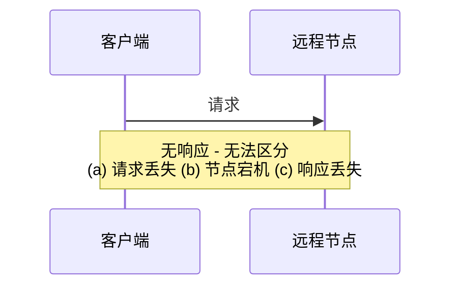

# 第8章 分布式系统的麻烦

> 嘿，我刚遇见你
> 网络很慢
> 但这是你的数据
> 所以也许存一下吧
>
> — Kyle Kingsbury，《Carly Rae Jepsen 与网络分区的危险》（2013）

过去几章的一个反复出现的主题是系统如何处理出错的事情。例如，我们讨论了副本故障转移（「处理节点故障」）、复制延迟（「复制延迟的问题」）以及事务的并发控制（「弱隔离级别」）。随着我们理解真实系统中可能发生的各种边缘情况，我们更好地处理它们。

然而，尽管我们讨论了很多故障，过去几章仍然过于乐观。现实更加黑暗。我们现在将把悲观主义调到最大，假设任何可能出错的事情都会出错。（有经验的系统运维人员会告诉你这是一个合理的假设。如果你礼貌地询问，他们可能会在抚平过去战斗的伤疤时告诉你一些可怕的故事。）

使用分布式系统与在单机上编写软件根本不同——主要区别在于有大量新的、令人兴奋的方式让事情出错 [1, 2]。在本章中，我们将了解实践中出现的问题，以及我们可以和不能依赖的东西。

最终，我们作为工程师的任务是构建完成其工作的系统（即满足用户期望的保证），尽管一切都会出错。在第 9 章中，我们将研究一些可以在分布式系统中提供此类保证的算法例子。但首先，在本章中，我们必须理解我们面临的挑战。

本章是对分布式系统中可能出错的事情的彻底悲观和令人沮丧的概述。我们将研究网络问题（「不可靠网络」）、时钟和时序问题（「不可靠时钟」），并讨论它们在多大程度上可以避免。所有这些问题的后果令人困惑，因此我们将探索如何思考分布式系统的状态以及如何推理已发生的事情（「知识、真相与谎言」）。

## 故障与部分故障

当你在单机上编写程序时，它通常以相当可预测的方式运行：要么工作，要么不工作。有 bug 的软件可能给人一种计算机有时「状态不好」的印象（通常通过重启修复的问题），但这主要是编写不当的软件的后果。

单机上的软件没有根本理由应该不稳定：当硬件正常工作时，相同的操作总是产生相同的结果（它是确定性的）。如果有硬件问题（例如内存损坏或连接器松动），后果通常是整个系统故障（例如内核恐慌、「蓝屏死机」、无法启动）。具有良好软件的单机通常要么完全正常，要么完全损坏，而不是介于两者之间。

这是计算机设计中的刻意选择：如果发生内部故障，我们宁愿计算机完全崩溃也不愿返回错误结果，因为错误结果难以处理且令人困惑。因此，计算机隐藏了它们所基于的模糊物理现实，并呈现以数学完美运行的理想化系统模型。CPU 指令总是做同样的事情；如果你将数据写入内存或磁盘，该数据保持完整，不会随机损坏。这种始终正确计算的设计目标可以追溯到第一台数字计算机 [3]。

当你编写在由网络连接的几台计算机上运行的软件时，情况根本不同。在分布式系统中，我们不再在理想化的系统模型中运行——我们别无选择，只能面对物理世界的混乱现实。在物理世界中， remarkably 广泛的事情可能出错，正如这个轶事所说明的 [4]：

> 在我有限的经验中，我处理过单个数据中心（DC）内的长期网络分区、PDU（配电单元）故障、交换机故障、整个机架的意外断电、整个 DC 骨干网故障、整个 DC 断电，以及一名低血糖司机将他的福特皮卡撞入 DC 的 HVAC（供暖、通风和空调）系统。我甚至不是运维人员。
> — Coda Hale

在分布式系统中，很可能系统的某些部分以某种不可预测的方式损坏，尽管系统的其他部分工作正常。这称为**部分故障**（partial failure）。困难在于部分故障是非确定性的：如果你尝试做任何涉及多个节点和网络的事情，它有时可能工作，有时可能不可预测地失败。正如我们将看到的，你甚至可能不知道某事是否成功，因为消息通过网络传播所需的时间也是非确定性的！

这种非确定性和部分故障的可能性使分布式系统难以使用 [5]。

### 云计算与超级计算

关于如何构建大规模计算系统，存在一系列哲学：

- 规模的一端是**高性能计算**（HPC）领域。具有数千个 CPU 的超级计算机通常用于计算密集型科学计算任务，如天气预报或分子动力学（模拟原子和分子的运动）。
- 另一端是**云计算**，它定义得不是很清楚 [6]，但通常与多租户数据中心、通过 IP 网络（通常是以太网）连接的商用计算机、弹性/按需资源分配和计量计费相关联。
- 传统企业数据中心介于这些极端之间。

这些哲学带来了非常不同的故障处理方法。在超级计算机中，作业通常不时将其计算状态检查点到持久存储。如果一个节点故障，常见的解决方案是简单地停止整个集群工作负载。在故障节点修复后，从最后一个检查点重新启动计算 [7, 8]。因此，超级计算机更像单节点计算机而不是分布式系统：它通过让部分故障升级为完全故障来处理部分故障——如果系统的任何部分故障，就让一切崩溃（就像单机上的内核恐慌）。

在本书中，我们专注于实现互联网服务的系统，它们通常看起来与超级计算机非常不同：

- 许多与互联网相关的应用是在线的，因为它们需要能够随时以低延迟为用户服务。使服务不可用——例如，停止集群进行维修——是不可接受的。相比之下，像天气模拟这样的离线（批处理）作业可以以相当低的影响停止和重启。
- 超级计算机通常由专用硬件构建，每个节点相当可靠，节点通过共享内存和远程直接内存访问（RDMA）通信。另一方面，云服务中的节点由商用机器构建，由于规模经济可以以更低的成本提供等效性能，但也有更高的故障率。
- 大型数据中心网络通常基于 IP 和以太网，以 Clos 拓扑排列以提供高二分带宽 [9]。超级计算机通常使用专用网络拓扑，如多维网格和环面 [10]，为具有已知通信模式的 HPC 工作负载产生更好的性能。
- 系统越大，其组件之一损坏的可能性就越大。随着时间的推移，损坏的东西被修复，新的东西损坏，但在具有数千个节点的系统中，假设某些东西总是损坏是合理的 [7]。当错误处理策略只是放弃时，大型系统最终可能花费大量时间从故障中恢复而不是做有用的工作 [8]。
- 如果系统可以容忍故障节点并仍然整体保持工作，这对运维和维护非常有用：例如，你可以执行滚动升级（见第 4 章），一次重启一个节点，而服务继续不间断地为用户服务。在云环境中，如果一台虚拟机表现不佳，你可以直接终止它并请求一台新的（希望新的会更快）。
- 在地理分布式部署中（将数据保持在地理上靠近用户以降低访问延迟），通信很可能通过互联网进行，与本地网络相比，互联网缓慢且不可靠。超级计算机通常假设其所有节点都紧密在一起。

如果我们想让分布式系统工作，我们必须接受部分故障的可能性并在软件中构建容错机制。换句话说，我们需要从不可靠的组件构建可靠的系统。（正如「可靠性」中讨论的，完美的可靠性不存在，因此我们需要理解我们实际可以承诺的极限。）

即使在仅由几个节点组成的较小系统中，考虑部分故障也很重要。在小型系统中，很可能大多数组件在大多数时间正确工作。然而，迟早，系统的某些部分会变得故障，软件必须以某种方式处理它。故障处理必须是软件设计的一部分，你（作为软件的操作者）需要知道在故障情况下软件会有什么行为。

假设故障很少见并简单地希望最好是不明智的。考虑各种可能的故障——即使是相当不可能的——并在测试环境中人为地创建此类情况以查看会发生什么，这很重要。在分布式系统中，怀疑、悲观和偏执是有回报的。

### 从不可靠组件构建可靠系统

你可能想知道这是否有意义——直觉上，系统似乎只能与其最不可靠的组件（其最薄弱的环节）一样可靠。事实并非如此：事实上，从不那么可靠的基础构建更可靠的系统是计算中的一个古老想法 [11]。例如：

- **纠错码**允许数字数据在偶尔出现一些位错误的通信信道上准确传输，例如由于无线网络上的无线电干扰 [12]。
- **IP**（互联网协议）是不可靠的：它可能丢弃、延迟、复制或重新排序数据包。**TCP**（传输控制协议）在 IP 之上提供更可靠的传输层：它确保丢失的数据包被重传，重复被消除，数据包被重新组装成发送顺序。

尽管系统可以比其底层部分更可靠，但它能有多可靠总是有限制的。例如，纠错码可以处理少量单比特错误，但如果你的信号被干扰淹没，你的通信信道可以通过多少数据有一个基本限制 [13]。TCP 可以向你隐藏数据包丢失、重复和重新排序，但它无法神奇地消除网络中的延迟。

尽管更可靠的高级系统并不完美，但它仍然有用，因为它处理了一些棘手的低级故障，因此剩余的故障通常更容易推理和处理。我们将在「端到端论证」中进一步探讨这个问题。

## 不可靠网络

正如第二部分引言所述，我们在本书中关注的分布式系统是**无共享**（shared-nothing）系统：即由网络连接的一批机器。网络是这些机器通信的唯一方式——我们假设每台机器都有自己的内存和磁盘，一台机器无法访问另一台机器的内存或磁盘（除非通过网络向服务发出请求）。

无共享不是构建系统的唯一方式，但它已成为构建互联网服务的主导方法，原因有几个：它相对便宜，因为不需要特殊硬件，可以利用商品化云计算服务，并可以通过跨多个地理分布数据中心的冗余实现高可靠性。

互联网和大多数数据中心内部网络（通常是以太网）是**异步分组网络**（asynchronous packet networks）。在这种网络中，一个节点可以向另一个节点发送消息（数据包），但网络不保证何时到达，或是否会到达。如果你发送请求并期望响应，许多事情可能出错（其中一些在图 8-1 中说明）：

1. 你的请求可能已丢失（也许有人拔掉了网线）。
2. 你的请求可能正在队列中等待，稍后会送达（也许网络或接收者过载）。
3. 远程节点可能已故障（也许它崩溃或断电）。
4. 远程节点可能暂时停止响应（也许它正在经历长时间的垃圾回收暂停；见「进程暂停」），但稍后会再次开始响应。
5. 远程节点可能已处理你的请求，但响应在网络上丢失（也许网络交换机配置错误）。
6. 远程节点可能已处理你的请求，但响应被延迟，稍后会送达（也许网络或你自己的机器过载）。



**图 8-1. 如果你发送请求但没有得到响应，无法区分 (a) 请求丢失、(b) 远程节点宕机，还是 (c) 响应丢失。**

发送者甚至无法告诉数据包是否已送达：唯一的选择是接收者发送响应消息，而响应消息可能反过来丢失或延迟。这些问题在异步网络中无法区分：你唯一的信息是你还没有收到响应。如果你向另一个节点发送请求但没有收到响应，无法告诉原因。

处理此问题的常用方法是**超时**（timeout）：一段时间后你放弃等待并假设响应不会到达。然而，当发生超时时，你仍然不知道远程节点是否收到了你的请求（如果请求仍在某处排队，它可能仍然会送达接收者，即使发送者已经放弃）。

### 实践中的网络故障

我们几十年来一直在构建计算机网络——人们可能希望到现在我们已经弄清楚如何使它们可靠。然而，似乎我们还没有成功。

有一些系统研究和大量轶事证据表明，即使在像由一家公司运营的数据中心这样的受控环境中，网络问题也可能令人惊讶地常见 [14]。一项在中等规模数据中心的研究发现每月约 12 次网络故障，其中一半断开单台机器，一半断开整个机架 [15]。另一项研究测量了机架顶部交换机、聚合交换机和负载均衡器等组件的故障率 [16]。它发现添加冗余网络设备并不能像你希望的那样减少故障，因为它不能防止人为错误（例如配置错误的交换机），这是中断的主要原因。

EC2 等公共云服务以频繁的瞬时网络故障而闻名 [14]，而管理良好的私有数据中心网络可以是更稳定的环境。然而，没有人能免受网络问题的影响：例如，交换机软件升级期间的问题可能触发网络拓扑重新配置，在此期间网络数据包可能被延迟超过一分钟 [17]。鲨鱼可能会咬海底电缆并损坏它们 [18]。其他令人惊讶的故障包括有时丢弃所有入站数据包但成功发送出站数据包的网络接口 [19]：仅仅因为网络链路在一个方向上工作并不能保证它在相反方向上也工作。

::: info 网络分区
当网络的一部分由于网络故障与其余部分切断时，有时称为**网络分区**（network partition）或 netsplit。在本书中，我们通常坚持使用更通用的术语网络故障，以避免与第 6 章讨论的存储系统的分区（分片）混淆。
:::

即使网络故障在你的环境中很少见，故障可能发生的事实意味着你的软件需要能够处理它们。每当通过网络进行任何通信时，它都可能失败——没有办法绕过它。

如果网络故障的错误处理没有定义和测试，可能会发生任意糟糕的事情：例如，集群可能死锁并永久无法服务请求，即使网络恢复 [20]，或者它甚至可能删除你的所有数据 [21]。如果软件处于意外情况，它可能做任意意外的事情。

处理网络故障不一定意味着容忍它们：如果你的网络通常相当可靠，有效的方法可能是在网络出现问题时简单地向用户显示错误消息。然而，你确实需要知道你的软件如何对网络问题做出反应，并确保系统可以从它们中恢复。故意触发网络问题并测试系统的响应可能是有意义的（这是 Chaos Monkey 背后的想法；见「可靠性」）。

### 检测故障

许多系统需要自动检测故障节点。例如：

- 负载均衡器需要停止向已死的节点发送请求（即将其从轮换中移除）。
- 在具有单主复制的分布式数据库中，如果主节点故障，需要将其中一个从节点提升为新主节点（见「处理节点故障」）。

不幸的是，网络的不确定性使得难以判断节点是否在工作。在某些特定情况下，你可能会得到一些反馈来明确告诉你某些东西不工作，但你不能依赖它。即使 TCP 确认数据包已送达，应用也可能在处理之前崩溃。如果你想确定请求是否成功，你需要应用本身的肯定响应 [24]。

相反，如果出了问题，你可能在堆栈的某个级别得到错误响应，但一般来说你必须假设你根本不会得到任何响应。你可以重试几次，等待超时过去，如果你在超时内没有收到回复，最终宣布节点已死。

### 超时与无界延迟

如果超时是检测故障的唯一可靠方法，那么超时应该多长？不幸的是，没有简单的答案。

长超时意味着在宣布节点死亡之前要等待很长时间（在此期间，用户可能不得不等待或看到错误消息）。短超时更快地检测故障，但有更高的风险在节点实际上只是遭受临时减速时（例如，由于节点或网络上的负载峰值）错误地宣布节点死亡。

过早宣布节点死亡是有问题的：如果节点实际上还活着并且正在执行某些操作（例如，发送电子邮件），而另一个节点接管，该操作可能最终被执行两次。我们将在「知识、真相与谎言」以及第 9 章和第 11 章中更详细地讨论这个问题。

### 同步与异步网络

如果我们能依赖网络以某种固定最大延迟传送数据包并且不丢弃数据包，分布式系统会简单得多。为什么我们不能在硬件层面解决这个问题并使网络可靠，以便软件不需要担心？

要回答这个问题，比较数据中心网络与传统固定线路电话网络（非蜂窝、非 VoIP）很有趣，后者极其可靠：延迟的音频帧和掉线非常罕见。电话呼叫需要恒定的低端到端延迟和足够的带宽来传输你声音的音频样本。在计算机网络中拥有类似的可靠性和可预测性不是很好吗？

当你通过电话网络打电话时，它会建立**电路**（circuit）：为呼叫沿两个呼叫者之间的整个路线分配固定、保证的带宽量。此电路保持到位直到呼叫结束 [32]。这种网络是**同步的**（synchronous）：即使数据通过几个路由器，它也不会遭受排队，因为呼叫的 16 位空间已经在网络的下一跳中保留。由于没有排队，网络的最大端到端延迟是固定的。我们称此为**有界延迟**（bounded delay）。

注意，电话网络中的电路与 TCP 连接非常不同：电路是固定的保留带宽量，在电路建立时没有人可以使用，而 TCP 连接的数据包机会主义地使用任何可用的网络带宽。你可以给 TCP 一个可变大小的数据块（例如，电子邮件或网页），它会尝试在尽可能短的时间内传输它。当 TCP 连接空闲时，它不使用任何带宽。

如果数据中心网络和互联网是电路交换网络，在建立电路时就可以建立保证的最大往返时间。然而，它们不是：以太网和 IP 是分组交换协议，遭受排队，因此网络中的延迟无界。这些协议没有电路的概念。

## 不可靠时钟

时钟和时间很重要。应用以各种方式依赖时钟来回答以下问题：

1. 这个请求超时了吗？
2. 这个服务的第 99 百分位响应时间是多少？
3. 这个服务在过去五分钟平均每秒处理了多少查询？
4. 用户在我们的网站上花了多长时间？
5. 这篇文章是什么时候发布的？
6. 提醒邮件应该在什么日期和时间发送？
7. 这个缓存条目什么时候过期？
8. 日志文件中这条错误消息的时间戳是什么？

例子 1–4 测量持续时间（例如，发送请求和接收响应之间的时间间隔），而例子 5–8 描述时间点（在特定日期、特定时间发生的事件）。

在分布式系统中，时间是一件棘手的事情，因为通信不是瞬时的：消息从一台机器通过网络传播到另一台机器需要时间。接收消息的时间总是晚于发送的时间，但由于网络中的可变延迟，我们不知道晚多少。这一事实有时使得在涉及多台机器时难以确定事情发生的顺序。

此外，网络上的每台机器都有自己的时钟，这是一个实际的硬件设备：通常是石英晶体振荡器。这些设备不是完全准确的，因此每台机器都有自己的时间概念，可能比其他机器稍快或稍慢。

### 单调时钟与日历时钟

现代计算机至少有两种不同的时钟：**日历时钟**（time-of-day clock）和**单调时钟**（monotonic clock）。尽管它们都测量时间，但区分两者很重要，因为它们服务于不同的目的。

**日历时钟**做你直观期望时钟做的事情：它根据某种日历（也称为挂钟时间）返回当前日期和时间。例如，Linux 上的 `clock_gettime(CLOCK_REALTIME)` 和 Java 中的 `System.currentTimeMillis()` 返回自纪元以来的秒数（或毫秒数）：1970 年 1 月 1 日 UTC 午夜，根据公历，不计闰秒。

**单调时钟**适合测量持续时间（时间间隔），例如超时或服务的响应时间：例如，Linux 上的 `clock_gettime(CLOCK_MONOTONIC)` 和 Java 中的 `System.nanoTime()` 是单调时钟。这个名字来自它们保证始终向前移动（而日历时钟可能向后跳转）。

### 依赖同步时钟

时钟的问题在于，虽然它们看起来简单易用，但有令人惊讶的陷阱：一天可能没有正好 86400 秒，日历时钟可能向后移动，一台节点上的时间可能与另一台节点上的时间大不相同。

本章早些时候我们讨论了网络丢弃和任意延迟数据包。尽管网络在大多数时间表现良好，但软件必须假设网络偶尔会故障来设计，并且软件必须优雅地处理此类故障。时钟也是如此：尽管它们在大多数时间工作得相当好，但健壮的软件需要准备好处理不正确的时钟。

问题的一部分是不正确的时钟很容易被忽视。如果机器的 CPU 有缺陷或其网络配置错误，它很可能根本无法工作，因此会很快被注意到并修复。另一方面，如果其石英时钟有缺陷或其 NTP 客户端配置错误，大多数事情似乎都能正常工作，即使其时钟逐渐越来越远离现实。如果某些软件依赖准确同步的时钟，结果更可能是静默和微妙的数据丢失，而不是戏剧性的崩溃 [53, 54]。

### 用于排序事件的时间戳

让我们考虑一个依赖时钟很有诱惑力但危险的特定情况：跨多个节点的事件排序。例如，如果两个客户端写入分布式数据库，谁先到达？哪个写入是更新的？

图 8-3 说明了在具有多主复制的数据库中危险地使用日历时钟（例子类似于图 5-9）。客户端 A 在节点 1 上写入 x = 1；写入复制到节点 3；客户端 B 在节点 3 上递增 x（我们现在有 x = 2）；最后，两次写入都复制到节点 2。

在图 8-3 中，当写入复制到其他节点时，它根据写入起源节点上的日历时钟标记时间戳。此例子中的时钟同步非常好：节点 1 和节点 3 之间的偏差小于 3 毫秒，这可能比你实践中可以期望的更好。

然而，图 8-3 中的时间戳未能正确排序事件：写入 x = 1 的时间戳为 42.004 秒，但写入 x = 2 的时间戳为 42.003 秒，尽管 x = 2 明确发生得更晚。当节点 2 收到这两个事件时，它会错误地得出结论 x = 1 是更新的值并丢弃写入 x = 2。实际上，客户端 B 的递增操作将丢失。

这种冲突解决策略称为**最后写入获胜**（LWW），在 Cassandra [53] 和 Riak [54] 等多主复制和无主数据库中广泛使用（见「最后写入获胜（丢弃并发写入）」）。一些实现在客户端而不是服务器上生成时间戳，但这不会改变 LWW 的基本问题。

因此，即使通过保持最「新」值并丢弃其他值来解决冲突很有诱惑力，重要的是要意识到「新」的定义取决于本地日历时钟，它很可能是不正确的。

所谓的**逻辑时钟**（logical clocks）[56, 57] 基于递增计数器而不是振荡的石英晶体，是排序事件更安全的替代方案（见「检测并发写入」）。逻辑时钟不测量日历时间或经过的秒数，只测量事件的相对顺序（一个事件是在另一个之前还是之后发生）。相比之下，测量实际经过时间的日历时钟和单调时钟也称为**物理时钟**（physical clocks）。

## 进程暂停

让我们考虑分布式系统中危险使用时钟的另一个例子。假设你有一个每个分区有一个主节点的数据库。只有主节点被允许接受写入。节点如何知道它仍然是主节点（它没有被其他节点宣布死亡），并且可以安全地接受写入？

一种选择是主节点从其他节点获取**租约**（lease），这类似于带超时的锁 [63]。只有一个节点可以在任何时候持有租约——因此，当节点获取租约时，它知道它在一段时间内是主节点，直到租约到期。为了保持主节点身份，节点必须在到期前定期续订租约。如果节点故障，它停止续订租约，因此另一个节点可以在到期时接管。

你可能会想象请求处理循环看起来像这样：

```java
while (true) {
    request = getIncomingRequest();
    // 确保租约始终至少还有 10 秒
    if (lease.expiryTimeMillis - System.currentTimeMillis() < 10000) {
        lease = lease.renew();
    }
    if (lease.isValid()) {
        process(request);
    }
}
```

这段代码有什么问题？首先，它依赖同步时钟。其次，即使我们将协议改为只使用本地单调时钟，还有另一个问题：代码假设从检查时间到处理请求之间经过的时间很少。通常这段代码运行得非常快，所以 10 秒的缓冲绰绰有余。然而，如果程序执行中有意外的暂停怎么办？

假设线程可能暂停这么长时间是疯狂的吗？不幸的是不是。有各种原因可能导致这种情况发生：

- 许多编程语言运行时（如 Java 虚拟机）有**垃圾回收器**（GC），偶尔需要停止所有运行中的线程。这些「停止世界」的 GC 暂停有时已知会持续几分钟 [64]！
- 在虚拟化环境中，虚拟机可以被挂起（暂停所有进程的执行并将内存内容保存到磁盘）和恢复（恢复内存内容并继续执行）。此暂停可以在进程执行的任何时候发生，并可以持续任意长度的时间。
- 在笔记本电脑等最终用户设备上，执行也可能被任意挂起和恢复，例如当用户合上笔记本电脑盖子时。
- 当操作系统上下文切换到另一个线程时，或当管理程序切换到不同的虚拟机时（在虚拟机中运行时），当前运行的线程可以在代码中的任意点暂停。

## 知识、真相与谎言

分布式系统难以推理的部分原因是，我们依赖于有缺陷的「真相」概念，而「真相」实际上需要仔细定义。让我们更仔细地思考分布式系统中的知识意味着什么。

### 真相由多数定义

许多分布式算法依赖于法定人数（quorum），即在一组节点中超过一半的投票（见「读写法定人数」）。法定人数的想法是，如果两个法定人数有重叠，至少有一个节点知道完整的信息。法定人数投票和领导选举是这种思想的例子。

然而，如果节点可能撒谎（发送任意错误或损坏的响应），法定人数就无济于事。分布式系统文献通常假设节点是诚实的但可能不可靠（可能宕机或响应缓慢），而不是假设节点可能故意撒谎。这种假设是合理的，因为硬件故障和软件 bug 比恶意攻击更常见。

### 拜占庭故障

如果节点可能撒谎，我们进入了**拜占庭故障**（Byzantine faults）的领域。例如，一个节点可能声称它收到了某个消息，但实际上没有。如果只有少数节点有故障（f 个节点），系统可能有 2f + 1 个节点，可以达成共识，只要至少 f + 1 个节点是诚实的。然而，在本书中我们假设故障是非拜占庭的（见「拜占庭故障」）。

### 系统模型与现实

我们一直在讨论的各种故障——网络故障、节点故障、不可靠的时钟、进程暂停——是分布式系统可能出错的方式。为了推理这些故障，我们经常使用**系统模型**（system model）来抽象现实。三种常见的系统模型是：

- **同步模型**（synchronous model）：假设网络延迟、进程暂停和时钟误差都有上界。这不是最现实的模型。
- **部分同步模型**（partially synchronous model）：假设系统在大多数时间像同步模型一样运行，但偶尔会超出保证。这是最实用的模型。
- **异步模型**（asynchronous model）：不对时序做任何假设。这是最保守的模型。

算法可以被证明在特定系统模型中正确工作。实现可能包含超出模型假设的额外故障处理。

## 小结

在本章中，我们研究了分布式系统中可能出错的各种事情。我们讨论了故障和部分故障、不可靠网络、不可靠时钟和进程暂停。我们探讨了如何思考分布式系统的状态，以及真相由多数定义的概念。

我们看到了许多可能出错的方式，以及为什么难以检测和区分不同类型的故障。超时是检测故障的主要方法，但超时的适当值取决于许多因素，并且没有简单的答案。

在下一章中，我们将研究一些可以在分布式系统中提供强保证的算法和协议，尽管存在我们在本章中讨论的所有问题。

---

[← 上一章](ch07.md) | [目录](../index.md) | [下一章 →](ch09.md)
