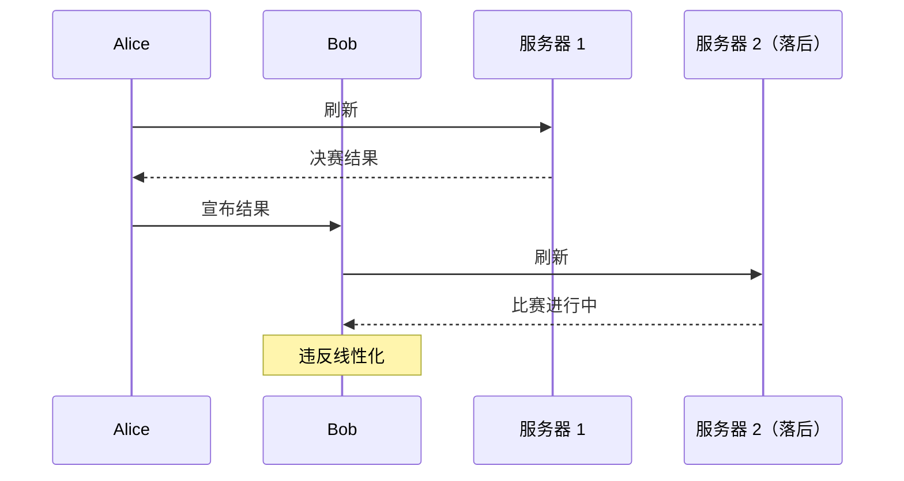

# 第9章 一致性与共识

> 活着但错误更好，还是正确但死了更好？
>
> — Jay Kreps，《关于 Kafka 和 Jepsen 的几点说明》（2013）

正如第 8 章所讨论的，分布式系统中很多事情可能出错。处理此类故障的最简单方法是简单地让整个服务失败，并向用户显示错误消息。如果该解决方案不可接受，我们需要找到容忍故障的方法——即，即使某些内部组件故障，也保持服务正确运行。

在本章中，我们将讨论构建容错分布式系统的一些算法和协议例子。我们假设第 8 章的所有问题都可能发生：数据包可能丢失、重新排序、重复或在网络中任意延迟；时钟充其量是近似的；节点可能随时暂停（例如由于垃圾回收）或崩溃。

构建容错系统的最佳方法是找到具有有用保证的通用抽象，实现一次，然后让应用依赖这些保证。这与我们在第 7 章使用事务的方法相同：通过使用事务，应用可以假装没有崩溃（原子性）、没有其他人并发访问数据库（隔离性）以及存储设备完全可靠（持久性）。即使崩溃、竞争条件和磁盘故障确实发生，事务抽象也隐藏了这些问题，因此应用不需要担心它们。

我们现在将沿着同样的思路继续，寻求允许应用忽略分布式系统某些问题的抽象。例如，分布式系统最重要的抽象之一是**共识**（consensus）：即让所有节点就某事达成一致。正如我们将在本章看到的，尽管存在网络故障和进程故障，可靠地达成共识是一个令人惊讶地棘手的问题。

一旦你有了共识的实现，应用可以将其用于各种目的。例如，假设你有一个具有单主复制的数据库。如果主节点死亡，你需要故障转移到另一个节点，剩余的数据库节点可以使用共识来选举新主节点。正如「处理节点故障」中讨论的，只有一个主节点很重要，所有节点都同意谁是主节点。如果两个节点都认为自己是主节点，这种情况称为脑裂，通常会导致数据丢失。共识的正确实现有助于避免此类问题。

本章后面，在「分布式事务与共识」中，我们将研究解决共识和相关问题的算法。但首先我们需要探索分布式系统中可以提供的保证和抽象范围。

我们需要理解可以做什么和不能做什么的范围：在某些情况下，系统可以容忍故障并继续工作；在其他情况下，这是不可能的。可能与不可能的极限已在理论证明和实际实现中深入探索。我们将在本章概述这些基本极限。

## 一致性保证

在「复制延迟的问题」中，我们研究了复制数据库中发生的一些时序问题。如果你在同一时刻查看两个数据库节点，你很可能会在两个节点上看到不同的数据，因为写请求在不同时间到达不同节点。无论数据库使用什么复制方法（单主、多主或无主复制），都会发生这些不一致。

大多数复制数据库至少提供**最终一致性**（eventual consistency），这意味着如果你停止向数据库写入并等待一段未指定的时间，最终所有读请求将返回相同的值 [1]。换句话说，不一致是临时的，它最终会自行解决（假设网络中的任何故障也最终被修复）。最终一致性的更好名称可能是**收敛**（convergence），因为我们期望所有副本最终收敛到相同的值 [2]。

然而，这是一个非常弱的保证——它没有说明副本何时收敛。在收敛之前，读取可能返回任何内容或什么都不返回 [1]。例如，如果你写入一个值然后立即再次读取它，不能保证你会看到你刚刚写入的值，因为读取可能被路由到不同的副本（见「读己之写」）。

最终一致性对应用开发者来说很难，因为它与普通单线程程序中变量的行为非常不同。如果你给变量赋值然后 shortly 之后读取它，你不期望读取旧值或读取失败。数据库表面上看起来像你可以读写的变量，但实际上它具有更复杂的语义 [3]。

## 线性化

在最终一致数据库中，如果你同时向两个不同的副本提出相同的问题，可能会得到两个不同的答案。这令人困惑。如果数据库能给人一种只有一个副本（即只有一个数据副本）的错觉，不是会简单得多吗？那么每个客户端都会对数据有相同的视图，你就不必担心复制延迟。

这就是**线性化**（linearizability）[6]（也称为原子一致性 [7]、强一致性、立即一致性或外部一致性 [8]）背后的想法。线性化的精确定义相当微妙，我们将在本节其余部分探讨。但基本想法是使系统看起来好像只有一个数据副本，并且对它的所有操作都是原子的。有了这个保证，即使实际上可能有多个副本，应用也不需要担心它们。

在线性化系统中，一旦一个客户端成功完成写入，所有从数据库读取的客户端必须能够看到刚刚写入的值。维护单个数据副本的错觉意味着保证读取的值是最新的、最新的值，而不是来自陈旧的缓存或副本。换句话说，线性化是一种**新鲜度保证**（recency guarantee）。

**图 9-1. 此系统不是线性化的，导致足球迷困惑。**

### 什么使系统线性化？

线性化背后的基本想法很简单：使系统看起来好像只有一个数据副本。然而，准确确定这意味着什么实际上需要一些注意。

在线性化系统中，我们想象在写入操作的开始和结束之间的某个时间点，x 的值必须原子地从 0 翻转到 1。因此，如果一个客户端的读取返回新值 1，所有后续读取也必须返回新值，即使写入操作尚未完成。

### 线性化与可串行化

线性化很容易与可串行化混淆（见「可串行化」），因为这两个词似乎都意味着「可以按顺序排列」。然而，它们是两种相当不同的保证，区分它们很重要：

- **可串行化**是可串行化是事务的隔离属性，其中每个事务可能读写多个对象（行、文档、记录）。它保证事务的行为就像它们以某种串行顺序执行一样。该串行顺序可以与事务实际运行的顺序不同 [12]。
- **线性化**是对寄存器（单个对象）读写的**新鲜度保证**。它不会将操作分组到事务中，因此它不能防止写倾斜等问题（见「写倾斜与幻读」），除非你采取额外措施，如物化冲突（见「物化冲突」）。

数据库可能同时提供可串行化和线性化，这种组合称为**严格可串行化**（strict serializability）或**强单副本可串行化**（strong-1SR）[4, 13]。

### 依赖线性化

在什么情况下线性化有用？观看体育比赛的最终比分可能是一个 frivolous 的例子：在这种情况下，过时几秒的结果不太可能造成任何真正的伤害。然而，有几个领域线性化是使系统正确工作的重要要求：

**锁定与领导选举**

使用单主复制的系统需要确保确实只有一个主节点，而不是几个（脑裂）。选举主节点的一种方法是使用锁：每个启动的节点都尝试获取锁，成功的成为主节点 [14]。无论此锁如何实现，它必须是线性化的：所有节点必须同意哪个节点拥有锁；否则它没用。

**约束与唯一性保证**

数据库中的唯一性约束很常见：例如，用户名或电子邮件地址必须唯一标识一个用户，在文件存储服务中不能有两个具有相同路径和文件名的文件。如果你想在写入数据时强制执行此约束（使得如果两个人尝试并发创建具有相同名称的用户或文件，其中一个将返回错误），你需要线性化。

### 实现线性化系统

既然我们已经看了几个线性化有用的例子，让我们思考如何实现提供线性化语义的系统。

由于线性化本质上意味着「表现得好像只有一个数据副本，并且对它的所有操作都是原子的」，最简单的答案可能是真正只使用一个数据副本。然而，该方法无法容忍故障：如果持有该副本的节点故障，数据将丢失，或至少在该节点重新启动之前无法访问。

使系统容错的最常见方法是使用复制。让我们回顾第 5 章的复制方法，并比较它们是否可以线性化：

- **单主复制**（可能线性化）：在具有单主复制的系统中，主节点拥有用于写入的数据主副本，从节点在其他节点上维护数据备份副本。如果你从主节点或同步更新的从节点读取，它们有可能线性化。
- **多主复制**（不线性化）：具有多主复制的系统通常不是线性化的，因为它们并发地在多个节点上处理写入并异步复制到其他节点。
- **无主复制**（可能不线性化）：对于具有无主复制的系统（Dynamo 风格），人们有时声称通过要求法定人数读写（w + r > n）可以获得「强一致性」。根据法定人数的确切配置以及你如何定义强一致性，这并不完全正确。

### 线性化的成本

由于某些复制方法可以提供线性化而其他方法不能，更深入地探索线性化的优缺点很有趣。

考虑如果两个数据中心之间存在网络中断会发生什么。假设每个数据中心内的网络工作正常，客户端可以到达数据中心，但数据中心无法相互连接。

使用多主数据库，每个数据中心可以继续正常运行。另一方面，如果使用单主复制，那么主节点必须在其中一个数据中心。任何写入和任何线性化读取都必须发送到主节点——因此，对于连接到从节点数据中心的任何客户端，这些读写请求必须通过网络同步发送到主节点数据中心。

如果单主设置中数据中心之间的网络中断，连接到从节点数据中心的客户端无法联系主节点，因此它们无法向数据库进行任何写入或任何线性化读取。它们仍然可以从从节点进行读取，但可能陈旧（非线性化）。

**CAP 定理**

这个问题不仅仅是单主和多主复制的后果：任何线性化数据库都有这个问题，无论它如何实现。这个问题也不是多数据中心部署特有的，而是可以在任何不可靠网络上发生，甚至在一个数据中心内。权衡如下：

- 如果你的应用需要线性化，并且由于网络问题，某些副本与其他副本断开连接，那么断开的副本在断开时无法处理请求：它们必须等待直到网络问题修复，或返回错误（无论哪种方式，它们变得不可用）。
- 如果你的应用不需要线性化，那么它可以以每个副本可以独立处理请求的方式编写，即使它与其他副本断开连接（例如，多主）。在这种情况下，应用可以在面对网络问题时保持可用，但其行为不是线性化的。

这一见解通常被称为 **CAP 定理** [29, 30, 31, 32]，由 Eric Brewer 在 2000 年命名，尽管自 1970 年代以来，分布式数据库的设计者就知道这一权衡 [33, 34, 35, 36]。

## 排序保证

我们之前说过，线性化寄存器表现得好像只有一个数据副本，每个操作似乎在一个时间点原子地生效。这个定义意味着操作以某种明确定义的顺序执行。

排序一直是本书中反复出现的主题，这表明它可能是一个重要的基本概念。让我们简要回顾我们讨论排序的其他一些上下文：

- 在第 5 章中，我们看到单主复制中主节点的主要目的是确定复制日志中写入的顺序——即从节点应用这些写入的顺序。如果没有单个主节点，由于并发操作可能发生冲突（见「处理写冲突」）。
- 我们在第 7 章讨论的可串行化是关于确保事务表现得好像它们以某种顺序执行。它可以通过字面以该串行顺序执行事务来实现，或通过允许并发执行同时防止可串行化冲突（通过锁定或中止）来实现。
- 我们在第 8 章讨论的分布式系统中时间戳和时钟的使用是另一种尝试在无序世界中引入顺序，例如确定两次写入中哪一次发生得更晚。

事实证明，排序、线性化和共识之间有深刻的联系。

### 排序与因果关系

排序不断出现有几个原因，其中一个原因是它有助于保持**因果关系**（causality）。我们在本书过程中已经看到了几个因果关系很重要的例子。

如果系统遵守因果关系施加的排序，我们说它是**因果一致**的（causally consistent）。例如，快照隔离提供因果一致性：当你从数据库读取并看到某条数据时，你必须也能够看到因果上先于它的任何数据（假设它在此期间未被删除）。

**因果序不是全序**

全序允许比较任何两个元素。然而，数学集合不是全序的：{a, b} 比 {b, c} 大吗？你不能真正比较它们。我们说它们是不可比较的，因此数学集合是**偏序**的（partially ordered）。

因果序和线性化之间的关系是：线性化蕴含因果关系：任何线性化的系统都会正确保持因果关系 [7]。线性化确保因果关系的事实使线性化系统易于理解和有吸引力。然而，正如「线性化的成本」中讨论的，使系统线性化可能损害其性能和可用性。

好消息是可能存在中间地带。线性化不是保持因果关系的唯一方式——还有其他方式。系统可以是因果一致的，而不会产生使其线性化的性能损失（特别是，CAP 定理不适用）。事实上，因果一致性是不因网络延迟而减慢、并在面对网络故障时保持可用的最强可能一致性模型 [2, 42]。

### 序列号排序

尽管因果关系是一个重要的理论概念，但实际跟踪所有因果依赖可能变得不切实际。然而，有更好的方法：我们可以使用**序列号**（sequence numbers）或时间戳来排序事件。时间戳不必来自日历时钟（或物理时钟，它们有许多问题，如「不可靠时钟」中讨论的）。它可以来自**逻辑时钟**（logical clock），这是一种生成数字序列以识别操作的算法，通常使用为每个操作递增的计数器。

**Lamport 时间戳**

尽管刚才描述的三种序列号生成器与因果关系不一致，实际上有一种简单的方法可以生成与因果关系一致的序列号。它称为 **Lamport 时间戳**，由 Leslie Lamport 在 1978 年提出 [56]，现在是分布式系统领域被引用最多的论文之一。

Lamport 时间戳的使用如图 9-8 所示。每个节点有唯一标识符，每个节点保持其已处理的操作数量的计数器。Lamport 时间戳就是 (counter, node ID) 对。两个节点有时可能有相同的计数器值，但通过在时间戳中包含节点 ID，每个时间戳都是唯一的。

Lamport 时间戳与物理日历时钟没有关系，但它提供全序：如果你有两个时间戳，计数器值较大的那个是较大的时间戳；如果计数器值相同，节点 ID 较大的那个是较大的时间戳。

### 全序广播

如果你的程序只在单个 CPU 核心上运行，很容易定义操作的全序：它只是 CPU 执行它们的顺序。然而，在分布式系统中，让所有节点就相同的操作全序达成一致是棘手的。

正如所讨论的，单主复制通过选择一个节点作为主节点并在主节点上的单个 CPU 核心上对所有操作进行排序来确定操作的全序。然后挑战是如果吞吐量大于单个主节点可以处理的，如何扩展系统，以及如果主节点故障如何处理故障转移（见「处理节点故障」）。在分布式系统文献中，这个问题称为**全序广播**（total order broadcast）或**原子广播**（atomic broadcast）[25, 57, 58]。

全序广播通常被描述为节点之间交换消息的协议。非正式地，它要求始终满足两个安全属性：

1. **可靠交付**：没有消息丢失：如果消息被交付给一个节点，它被交付给所有节点。
2. **全序交付**：消息以相同顺序交付给每个节点。

## 分布式事务与共识

共识是分布式计算中最重要和最基本的问题之一。从表面上看，它似乎很简单：非正式地，目标只是让几个节点就某事达成一致。你可能认为这应该不会太难。不幸的是，许多有缺陷的系统是在错误地相信这个问题很容易解决的信念下构建的。

**共识不可能性**

你可能听说过 FLP 结果 [68]——以作者 Fischer、Lynch 和 Paterson 命名——它证明如果存在节点可能崩溃的风险，没有算法总是能够达成共识。在分布式系统中，我们必须假设节点可能崩溃，因此可靠的共识是不可能的。然而，我们在这里讨论实现共识的算法。这是怎么回事？

答案是 FLP 结果在**异步系统模型**中证明（见「系统模型与现实」），这是一个非常限制性的模型，假设确定性算法不能使用任何时钟或超时。如果允许算法使用超时，或某种其他方式识别可疑的崩溃节点（即使怀疑有时是错误的），那么共识就变得可解 [67]。甚至只允许算法使用随机数就足以绕过不可能性结果 [69]。

因此，尽管关于共识不可能性的 FLP 结果具有重要的理论意义，但分布式系统通常可以在实践中实现共识。

### 原子提交与两阶段提交（2PC）

在第 7 章中，我们了解到事务原子性的目的是在多次写入过程中出错时提供简单的语义。事务的结果要么是成功提交，在这种情况下事务的所有写入都持久化，要么是中止，在这种情况下事务的所有写入都被回滚（即撤销或丢弃）。

**从单节点到分布式原子提交**

对于在单个数据库节点上执行的事务，原子性通常由存储引擎实现。当客户端要求数据库节点提交事务时，数据库使事务的写入持久化（通常在预写日志中；见「使 B-tree 可靠」），然后将提交记录追加到磁盘上的日志。如果数据库在此过程中崩溃，事务在节点重启时从日志恢复：如果提交记录在崩溃前成功写入磁盘，事务被视为已提交；如果没有，该事务的任何写入都被回滚。

然而，如果涉及多个节点怎么办？对于这些情况，仅仅向所有节点发送提交请求并在每个节点上独立提交事务是不够的。这样做，很容易发生提交在某些节点上成功而在其他节点上失败的情况，这将违反原子性保证。

**两阶段提交简介**

**两阶段提交**（Two-Phase Commit，2PC）是一种在多个节点上实现原子事务提交的算法——即，确保要么所有节点提交，要么所有节点中止。它是分布式数据库中的经典算法 [13, 35, 75]。2PC 在一些数据库内部使用，也以 XA 事务 [76, 77] 的形式或通过 SOAP Web 服务的 WS-AtomicTransaction [78, 79] 向应用提供。

2PC 的基本流程如图 9-9 所示。与单节点事务的单个提交请求不同，2PC 中的提交/中止过程分为两个阶段（因此得名）。

2PC 使用单节点事务中通常不出现的新组件：**协调者**（coordinator，也称为事务管理器）。协调者通常作为库实现在请求事务的同一应用进程中（例如，嵌入在 Java EE 容器中），但它也可以是单独的进程或服务。

2PC 事务以应用在多个数据库节点上正常读写数据开始。我们称这些数据库节点为事务的**参与者**（participants）。当应用准备好提交时，协调者开始阶段 1：它向每个节点发送**准备请求**（prepare request），询问它们是否能够提交。协调者然后跟踪参与者的响应：

- 如果所有参与者回复「是」，表示它们准备好提交，则协调者在阶段 2 发出提交请求，提交实际发生。
- 如果任何参与者回复「否」，协调者在阶段 2 向所有节点发送中止请求。

::: warning 不要混淆 2PC 和 2PL
两阶段提交（2PC）和两阶段锁定（见「两阶段锁定（2PL）」）是两个非常不同的东西。2PC 在分布式数据库中提供原子提交，而 2PL 提供可串行化隔离。为避免混淆，最好将它们视为完全独立的概念，并忽略名称中不幸的相似性。
:::

**协调者故障**

如果协调者在发送准备请求之前失败，参与者可以安全地中止事务。但一旦参与者收到准备请求并投票「是」，它就不能单方面中止——它必须等待协调者的回复，了解事务是提交还是中止。如果协调者在此点崩溃或网络失败，参与者除了等待什么也做不了。处于此状态的参与者的事务称为**存疑**（in doubt）或**不确定**（uncertain）。

没有协调者的消息，参与者无法知道是提交还是中止。2PC 能够完成的唯一方法是等待协调者恢复。这就是为什么协调者必须在向参与者发送提交或中止请求之前将其提交或中止决定写入磁盘上的事务日志：当协调者恢复时，它通过读取其事务日志确定所有存疑事务的状态。

**三阶段提交**

两阶段提交被称为**阻塞原子提交协议**（blocking atomic commit protocol），因为 2PC 可能卡住等待协调者恢复。理论上，可以使原子提交协议非阻塞，使其在节点故障时不会卡住。然而，在实践中实现这一点并不那么直接。

作为 2PC 的替代方案，已经提出了称为**三阶段提交**（3PC）的算法 [13, 80]。然而，3PC 假设具有有界延迟的网络和具有有界响应时间的节点；在大多数具有无界网络延迟和进程暂停的实用系统中（见第 8 章），它不能保证原子性。

### 容错共识

共识算法必须满足以下性质 [67]：

1. **一致同意**（Uniform agreement）：没有两个节点决定不同的值。
2. **完整性**（Integrity）：没有节点决定两次。
3. **有效性**（Validity）：如果节点决定值 v，则 v 由某个节点提出。
4. **终止**（Termination）：所有未崩溃的节点最终决定某个值。

前三个属性定义了共识的含义；第四个属性使其具有容错性。终止属性取决于假设大多数节点存活、可以相互通信，并且最终网络故障会修复。

最广为人知的容错共识算法是 **Paxos** [67, 69]、**Raft** [22] 和 **Zab** [15, 16]。这些算法在内部有所不同，但都满足上述性质。

### 成员与协调服务

ZooKeeper 和 etcd 等共识服务通常被描述为**分布式键值存储**或**协调服务**。它们与数据库有何不同？

ZooKeeper 和类似服务被设计为容纳少量完全适合内存的数据（虽然它们仍然会复制到磁盘以实现持久性）。这些数据通过容错共识算法在节点之间复制。支持的操作通常包括：线性化原子操作（如 CAS）、 ephemeral 节点（如果会话关闭则自动删除）、 watcher（当值变化时通知客户端）。

这些服务不是为了通用数据存储而设计的。相反，它们用于元数据、配置和协调——例如服务发现、领导选举、分布式锁和成员资格。共识协议使这些功能正确实现。

## 小结

在本章中，我们探讨了分布式系统中一致性和共识的主题。我们研究了各种一致性模型，从最终一致性到线性化，以及它们之间的权衡。

我们讨论了线性化——使系统表现得好像只有一个数据副本的强新鲜度保证——以及它的用途和成本。线性化会损害性能和可用性，特别是在网络延迟显著的情况下。

我们探讨了排序保证，包括因果关系和全序。Lamport 时间戳提供与因果关系一致的全序。全序广播是另一种重要的抽象，与共识等价。

我们研究了分布式事务和共识算法。两阶段提交（2PC）是跨异构系统实现原子提交的最常见方法，但它有协调者故障时阻塞的已知问题。容错共识算法（如 Raft 和 Paxos）提供了更好的保证，被 ZooKeeper 和 etcd 等协调服务使用。

在下一章中，我们将进入第三部分，讨论批处理和流处理系统，这些系统通常以不同的方式处理分布式数据。

---

[← 上一章](ch08.md) | [目录](../index.md) | [下一章 →](../part3/ch10.md)
