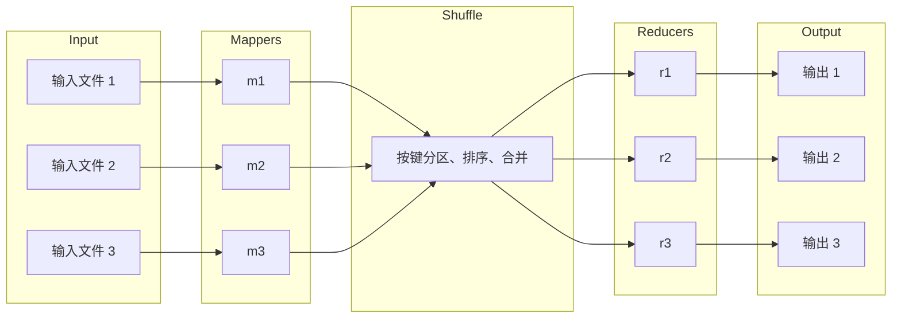
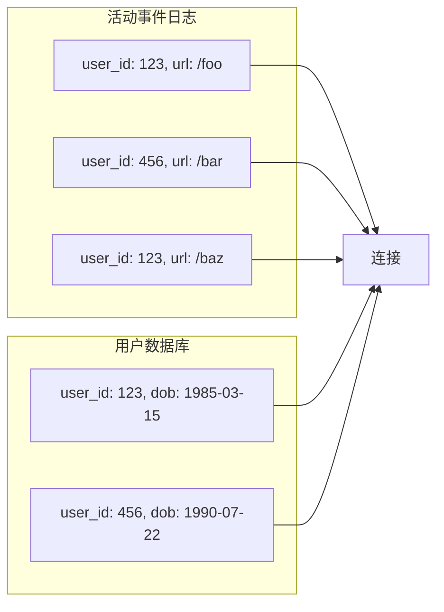
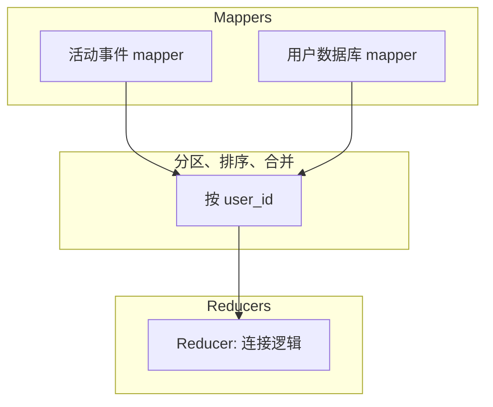

# 第10章 批处理

> 如果一个系统过于受单个人的影响而无法成功。一旦初始设计完成且相当稳健，真正的考验就开始了——拥有许多不同观点的人们开始进行各自的实验。
>
> — Donald Knuth

在本书的前两部分，我们大量讨论了请求与查询，以及相应的响应或结果。许多现代数据系统都采用这种数据处理风格：你提出某个问题或发送某条指令，一段时间后系统（希望）会给你答案。数据库、缓存、搜索引擎、Web 服务器以及许多其他系统都以这种方式工作。

在这类**在线系统**（online systems）中，无论是 Web 浏览器请求页面还是服务调用远程 API，我们通常假设请求是由人类用户触发的，并且用户正在等待响应。他们不应该等太久，因此我们非常关注这些系统的**响应时间**（response time）（见第 13 页「描述性能」）。

Web 以及越来越多的基于 HTTP/REST 的 API 使请求/响应式的交互变得如此普遍，以至于很容易将其视为理所当然。但我们应该记住，这不是构建系统的唯一方式，其他方法也有其优点。让我们区分三种不同类型的系统：

**服务（在线系统）**

服务等待来自客户端的请求或指令到达。收到后，服务会尽快处理并返回响应。响应时间通常是衡量服务性能的主要指标，可用性往往非常重要（如果客户端无法访问服务，用户可能会收到错误消息）。

**批处理系统（离线系统）**

批处理系统接收大量输入数据，运行作业进行处理，并产生一些输出数据。作业通常需要一段时间（从几分钟到几天），因此通常没有用户等待作业完成。相反，批处理作业通常按周期调度运行（例如每天一次）。批处理作业的主要性能指标通常是**吞吐量**（throughput）（处理一定大小输入数据集所需的时间）。我们将在本章讨论批处理。

**流处理系统（近实时系统）**

流处理介于在线和离线/批处理之间（因此有时称为**近实时**（near-real-time）或**近线**（nearline）处理）。与批处理系统一样，流处理器消费输入并产生输出（而不是响应请求）。然而，流作业在事件发生后不久就对其进行处理，而批作业则对固定的输入数据集进行操作。这种差异使流处理系统比等效的批处理系统具有更低的延迟。由于流处理建立在批处理之上，我们将在第 11 章讨论它。

正如我们将在本章看到的，批处理是构建可靠、可扩展和可维护应用的重要基石。例如，MapReduce 是 2004 年发表的批处理算法 [1]，曾被（或许过于热情地）称为「让 Google 如此大规模可扩展的算法」[2]。它随后在各种开源数据系统中实现，包括 Hadoop、CouchDB 和 MongoDB。

与多年前为数据仓库开发的并行处理系统相比 [3, 4]，MapReduce 是一个相当低级的编程模型，但在商用硬件上可实现的处理规模方面，它是一个重大进步。尽管 MapReduce 的重要性现在正在下降 [5]，但仍然值得理解，因为它清晰地展示了批处理为何以及如何有用。

事实上，批处理是一种非常古老的计算形式。早在可编程数字计算机发明之前，打孔卡制表机——例如 1890 年美国人口普查中使用的 Hollerith 机器 [6]——就实现了半机械化的批处理形式，从大量输入中计算聚合统计。而 MapReduce 与 1940 年代和 1950 年代广泛用于商业数据处理的机电式 IBM 卡片分拣机有着惊人的相似之处 [7]。历史往往重演。

在本章中，我们将研究 MapReduce 和其他几种批处理算法与框架，并探索它们在现代数据系统中的使用方式。但首先，我们将从使用标准 Unix 工具进行数据处理开始。即使你已经熟悉它们，重温 Unix 哲学也值得，因为这些思想和经验教训可以推广到大规模、异构的分布式数据系统。

## 使用 Unix 工具进行批处理

让我们从一个简单的例子开始。假设你有一台 Web 服务器，每次处理请求时都会在日志文件中追加一行。例如，使用 nginx 默认的访问日志格式，日志的一行可能如下所示：

```
216.58.210.78 - - [27/Feb/2015:17:55:11 +0000] "GET /css/typography.css HTTP/1.1"
200 3377 "http://martin.kleppmann.com/" "Mozilla/5.0 (Macintosh; Intel Mac OS X
10_9_5) AppleWebKit/537.36 (KHTML, like Gecko) Chrome/40.0.2214.115
Safari/537.36"
```

（这实际上是一行；这里为了可读性分成多行。）

这一行包含大量信息。要解释它，你需要查看日志格式的定义，如下所示：

```
$remote_addr - $remote_user [$time_local] "$request"
$status $body_bytes_sent "$http_referer" "$http_user_agent"
```

因此，这一行日志表明，2015 年 2 月 27 日 17:55:11 UTC，服务器收到了来自客户端 IP 地址 216.58.210.78 的对文件 `/css/typography.css` 的请求。用户未认证，因此 `$remote_user` 设置为连字符 (-)。响应状态为 200（即请求成功），响应大小为 3,377 字节。Web 浏览器是 Chrome 40，它加载该文件是因为它在 URL http://martin.kleppmann.com/ 的页面中被引用。

### 简单日志分析

各种工具可以处理这些日志文件并生成关于网站流量的漂亮报告，但为了练习，让我们使用基本 Unix 工具自己构建一个。例如，假设你想找出网站上最受欢迎的五个页面。你可以在 Unix shell 中执行以下操作：

```bash
cat /var/log/nginx/access.log | 
  awk '{print $7}'  | 
  sort             | 
  uniq -c          | 
  sort -r -n       | 
  head -n 5          
```

读取日志文件。

按空白字符将每行拆分为字段，并仅输出每行的第七个字段，即请求的 URL。在我们的示例行中，请求 URL 是 `/css/typography.css`。

按字母顺序对请求的 URL 列表排序。如果某个 URL 被请求了 n 次，排序后文件中该 URL 会连续出现 n 次。

`uniq` 命令通过检查相邻两行是否相同来过滤掉重复行。`-c` 选项告诉它同时输出计数：对于每个不同的 URL，报告该 URL 在输入中出现的次数。

第二次 `sort` 按每行开头的数字 (`-n`) 排序，即 URL 被请求的次数。然后以反向 (`-r`) 顺序返回结果，即最大数字在前。

最后，`head` 仅输出输入的前五行 (`-n 5`)，丢弃其余部分。

这一系列命令的输出大致如下：

```
4189 /favicon.ico
3631 /2013/05/24/improving-security-of-ssh-private-keys.html
2124 /2012/12/05/schema-evolution-in-avro-protocol-buffers-thrift.html
1369 /
 915 /css/typography.css
```

如果你不熟悉 Unix 工具，前面的命令行可能看起来有点晦涩，但它非常强大。它可以在几秒钟内处理数 GB 的日志文件，你可以轻松修改分析以满足你的需求。例如，如果要从报告中排除 CSS 文件，将 awk 参数改为 `'$7 !~ /\.css$/ {print $7}'`。如果想统计顶级客户端 IP 地址而不是顶级页面，将 awk 参数改为 `'{print $1}'`。等等。

本书没有空间详细探讨 Unix 工具，但它们非常值得学习。令人惊讶的是，许多数据分析可以使用 awk、sed、grep、sort、uniq 和 xargs 的某种组合在几分钟内完成，而且性能出奇地好 [8]。

### 命令链与自定义程序

除了 Unix 命令链之外，你也可以编写一个简单的程序来做同样的事情。例如，在 Ruby 中可能如下所示：

```ruby
counts = Hash.new(0) 
File.open('/var/log/nginx/access.log' ) do |file|
  file.each do |line|
    url = line.split[6] 
    counts[url] += 1 
  end
end
top5 = counts.map{|url, count| [count, url] }.sort.reverse[0...5] 
top5.each{|count, url| puts "#{count} #{url}" } 
```

`counts` 是一个哈希表，记录我们看到的每个 URL 的次数。计数器默认为零。

从日志的每一行中，我们将 URL 作为第七个空白分隔的字段（这里数组索引为 6，因为 Ruby 的数组从零开始）。

递增当前日志行中 URL 的计数器。

按计数值（降序）对哈希表内容排序，并取前五个条目。

打印出这五个条目。

这个程序不如 Unix 管道链简洁，但相当可读，你更喜欢哪种部分取决于个人品味。然而，除了两者之间表面的语法差异外，执行流程存在很大差异，如果你在大文件上运行此分析就会显现出来。

### 排序与内存聚合

Ruby 脚本在内存中维护一个 URL 哈希表，每个 URL 映射到其被看到的次数。Unix 管道示例没有这样的哈希表，而是依赖于对 URL 列表进行排序，其中同一 URL 的多次出现只是重复。

哪种方法更好？这取决于你有多少不同的 URL。对于大多数中小型网站，你可能可以将所有不同的 URL 以及每个 URL 的计数器放入（比如）1 GB 内存中。在此示例中，作业的**工作集**（working set）（作业需要随机访问的内存量）仅取决于不同 URL 的数量：如果单个 URL 有 100 万条日志条目，哈希表中所需的空间仍然只是一个 URL 加上计数器的大小。如果工作集足够小，内存哈希表就可以很好地工作——即使在笔记本电脑上。

另一方面，如果作业的工作集大于可用内存，排序方法具有可以高效利用磁盘的优势。这与我们在第 76 页「SSTables 和 LSM 树」中讨论的原理相同：数据块可以在内存中排序并作为段文件写出到磁盘，然后多个已排序的段可以合并成更大的已排序文件。归并排序具有顺序访问模式，在磁盘上表现良好。（请记住，优化顺序 I/O 是第 3 章中反复出现的主题。同样的模式在这里再次出现。）

GNU Coreutils（Linux）中的 `sort` 实用程序通过溢出到磁盘自动处理大于内存的数据集，并自动跨多个 CPU 核心并行化排序 [9]。这意味着我们之前看到的简单 Unix 命令链可以轻松扩展到大型数据集，而不会耗尽内存。瓶颈可能是从磁盘读取输入文件的速率。

## Unix 哲学

我们能够使用命令链相当轻松地分析日志文件并非巧合：这实际上是 Unix 的关键设计思想之一，至今仍然惊人地相关。让我们更深入地了解它，以便我们可以从 Unix 借鉴一些思想 [10]。

Unix 管道的发明者 Doug McIlroy 在 1964 年首次这样描述它们 [11]：

「我们应该有某种方式像花园软管一样连接程序——当需要以另一种方式处理数据时，拧入另一段。I/O 也是如此。」管道类比流传下来，用管道连接程序的想法成为现在所称的 **Unix 哲学**（Unix philosophy）的一部分——一套在 Unix 开发者和用户中流行的设计原则。该哲学在 1978 年被描述如下 [12, 13]：

1. 让每个程序做好一件事。要做新工作，重新构建而不是通过添加新「功能」使旧程序复杂化。
2. 期望每个程序的输出成为另一个未知程序的输入。不要用无关信息使输出杂乱。避免严格的列式或二进制输入格式。不要坚持交互式输入。
3. 设计和构建软件，甚至操作系统，以便尽早尝试，理想情况下在几周内。不要犹豫扔掉笨拙的部分并重建它们。
4. 优先使用工具而不是不熟练的帮助来减轻编程任务，即使你必须绕道构建工具并期望在使用完后扔掉其中一些。

这种方法——自动化、快速原型、增量迭代、对实验友好、将大型项目分解为可管理的块——听起来与今天的敏捷和 DevOps 运动惊人地相似。四十年来变化 surprisingly 少。

::: tip
`sort` 工具是「做好一件事」的程序的绝佳例子。可以说它比大多数编程语言标准库中的排序实现更好（标准库不会溢出到磁盘，也不使用多线程，即使那样会有益）。然而，`sort` 单独使用几乎没有用。只有与 uniq 等其他 Unix 工具结合使用时，它才变得强大。
:::

像 bash 这样的 Unix shell 让我们可以轻松地将这些小程序组合成惊人强大的数据处理作业。尽管这些程序中的许多是由不同的人编写的，但它们可以以灵活的方式连接在一起。Unix 做了什么来实现这种可组合性？

**统一接口**

如果你期望一个程序的输出成为另一个程序的输入，这意味着这些程序必须使用相同的数据格式——换句话说，兼容的接口。如果你希望能够将任何程序的输出连接到任何程序的输入，这意味着所有程序必须使用相同的输入/输出接口。

在 Unix 中，该接口是文件（或更准确地说，文件描述符）。文件只是有序的字节序列。因为这是一个如此简单的接口，许多不同的东西可以使用相同的接口表示：文件系统上的实际文件、与另一个进程的通信通道（Unix 套接字、stdin、stdout）、设备驱动程序（如 `/dev/audio` 或 `/dev/lp0`）、表示 TCP 连接的套接字等。很容易将其视为理所当然，但这些非常不同的东西可以共享统一接口从而轻松地插在一起，实际上相当了不起。

按照惯例，许多（但不是全部）Unix 程序将字节序列视为 ASCII 文本。我们的日志分析示例使用了这一事实：awk、sort、uniq 和 head 都将它们的输入文件视为由 `\n`（换行符，ASCII 0x0A）分隔的记录列表。选择 `\n` 是任意的—— arguably，ASCII 记录分隔符 0x1E 可能是更好的选择，因为它是为此目的设计的 [14]——但无论如何，所有这些程序都标准化使用相同的记录分隔符，使它们能够互操作。

**逻辑与接线的分离**

Unix 工具的另一个特征是对标准输入（stdin）和标准输出（stdout）的使用。如果你运行程序且不指定其他内容，stdin 来自键盘，stdout 输出到屏幕。但是，你也可以从文件获取输入和/或将输出重定向到文件。管道让你可以将一个进程的 stdout 附加到另一个进程的 stdin（使用小的内存缓冲区，而不必将整个中间数据流写入磁盘）。

程序仍然可以在需要时直接读写文件，但如果程序不担心特定文件路径而只使用 stdin 和 stdout，Unix 方法效果最好。这允许 shell 用户以他们想要的任何方式连接输入和输出；程序不知道也不关心输入来自哪里、输出到哪里。（可以说这是**松耦合**（loose coupling）、**延迟绑定**（late binding）[15] 或**控制反转**（inversion of control）[16] 的一种形式。）将输入/输出接线与程序逻辑分离使将小工具组合成更大的系统更容易。

你甚至可以编写自己的程序并将其与操作系统提供的工具结合使用。你的程序只需要从 stdin 读取输入并向 stdout 写入输出，就可以参与数据处理管道。在日志分析示例中，你可以编写一个将 user-agent 字符串转换为更合理的浏览器标识符的工具，或将 IP 地址转换为国家代码的工具，只需将其插入管道即可。`sort` 程序不关心它是与操作系统的另一部分通信还是与你编写的程序通信。

**透明与实验**

Unix 工具如此成功的部分原因是它们使查看正在发生的事情相当容易：

- Unix 命令的输入文件通常被视为不可变的。这意味着你可以随意多次运行命令，尝试各种命令行选项，而不会损坏输入文件。
- 你可以在任何点结束管道，将输出通过管道传给 `less`，查看它是否具有预期形式。这种检查能力对调试很有帮助。
- 你可以将一个管道阶段的输出写入文件，并将该文件用作下一阶段的输入。这允许你在不重新运行整个管道的情况下重新启动后续阶段。

因此，尽管 Unix 工具与关系数据库的查询优化器相比是相当钝、简单的工具，它们仍然非常有用，尤其是对于实验。

然而，Unix 工具最大的限制是它们只在单台机器上运行——这就是 Hadoop 等工具的用武之地。

## MapReduce 与分布式文件系统

MapReduce 有点像 Unix 工具，但分布在可能数千台机器上。与 Unix 工具一样，它是一个相当钝、蛮力但出奇有效的工具。单个 MapReduce 作业类似于单个 Unix 进程：它接收一个或多个输入并产生一个或多个输出。

与大多数 Unix 工具一样，运行 MapReduce 作业通常不会修改输入，除了产生输出之外没有任何副作用。输出文件以顺序方式一次性写入（一旦写入，不修改文件的任何现有部分）。

虽然 Unix 工具使用 stdin 和 stdout 作为输入和输出，但 MapReduce 作业在**分布式文件系统**（distributed filesystem）上读写文件。在 Hadoop 的 MapReduce 实现中，该文件系统称为 **HDFS**（Hadoop Distributed File System），是 Google 文件系统（GFS）[19] 的开源重新实现。

除了 HDFS 之外，还存在各种其他分布式文件系统，如 GlusterFS 和 Quantcast 文件系统（QFS）[20]。Amazon S3、Azure Blob Storage 和 OpenStack Swift [21] 等对象存储服务在许多方面类似。在本章中，我们主要使用 HDFS 作为运行示例，但原理适用于任何分布式文件系统。

HDFS 基于**无共享**（shared-nothing）原则（见第二部分引言），与网络附加存储（NAS）和存储区域网络（SAN）架构的**共享磁盘**（shared-disk）方法形成对比。共享磁盘存储由集中式存储设备实现，通常使用定制硬件和特殊网络基础设施（如光纤通道）。另一方面，无共享方法不需要特殊硬件，只需要由常规数据中心网络连接的计算机。

HDFS 由在每台机器上运行的守护进程组成，暴露网络服务，允许其他节点访问存储在该机器上的文件（假设数据中心中的每台通用机器都连接了一些磁盘）。称为 **NameNode** 的中央服务器跟踪哪些文件块存储在哪些机器上。因此，HDFS 在概念上创建了一个可以使用运行守护进程的所有机器的磁盘空间的大文件系统。

为了容忍机器和磁盘故障，文件块在多台机器上复制。复制可能只是多台机器上相同数据的多个副本，如第 5 章所述，或使用纠删码方案（如 Reed-Solomon 码），允许以比完全复制更低的存储开销恢复丢失的数据 [20, 22]。这些技术与 RAID 类似，后者在同一台机器连接的多个磁盘之间提供冗余；区别在于在分布式文件系统中，文件访问和复制是通过常规数据中心网络完成的，无需特殊硬件。

HDFS 扩展良好：在撰写本文时，最大的 HDFS 部署运行在数万台机器上，总存储容量达数百 PB [23]。如此大的规模变得可行，是因为使用商用硬件和开源软件在 HDFS 上进行数据存储和访问的成本远低于专用存储设备上的等效容量 [24]。

## MapReduce 作业执行

MapReduce 是一个编程框架，你可以编写代码在 HDFS 等分布式文件系统中处理大型数据集。理解它的最简单方法是参考第 391 页「简单日志分析」中的 Web 服务器日志分析示例。MapReduce 中的数据处理模式与此示例非常相似：

1. 读取一组输入文件，并将其拆分为记录。在 Web 服务器日志示例中，每条记录是日志中的一行（即 `\n` 是记录分隔符）。
2. 调用 mapper 函数从每条输入记录中提取键和值。在前面的示例中，mapper 函数是 `awk '{print $7}'`：它将 URL（$7）提取为键，值留空。
3. 按键对所有键值对排序。在日志示例中，这由第一个 `sort` 命令完成。
4. 调用 reducer 函数迭代已排序的键值对。如果有多个相同键的出现，排序使它们在列表中相邻，因此可以轻松组合这些值而无需在内存中保留大量状态。在前面的示例中，reducer 由 `uniq -c` 命令实现，它计算具有相同键的相邻记录的数量。

这四个步骤可以由一个 MapReduce 作业执行。步骤 2（map）和 4（reduce）是你编写自定义数据处理代码的地方。步骤 1（将文件拆分为记录）由输入格式解析器处理。步骤 3，排序步骤，在 MapReduce 中是隐式的——你不必编写它，因为 mapper 的输出在交给 reducer 之前总是被排序的。

要创建 MapReduce 作业，你需要实现两个回调函数，mapper 和 reducer，它们的行为如下（另见第 46 页「MapReduce 查询」）：

**Mapper**

mapper 对每条输入记录调用一次，其工作是从输入记录中提取键和值。对于每个输入，它可以生成任意数量的键值对（包括零个）。它不保留从一条输入记录到下一条的任何状态，因此每条记录独立处理。

**Reducer**

MapReduce 框架获取 mapper 产生的键值对，收集属于同一键的所有值，并使用该值集合上的迭代器调用 reducer。reducer 可以产生输出记录（例如相同 URL 的出现次数）。

在 Web 服务器日志示例中，我们在步骤 5 有第二个 sort 命令，按请求数对 URL 排序。在 MapReduce 中，如果需要第二个排序阶段，可以通过编写第二个 MapReduce 作业并使用第一个作业的输出作为第二个作业的输入来实现。这样看，mapper 的作用是通过将数据放入适合排序的形式来准备数据，reducer 的作用是处理已排序的数据。

### MapReduce 的分布式执行

与 Unix 命令管道的主要区别是 MapReduce 可以在多台机器上并行化计算，而无需你编写代码来显式处理并行性。mapper 和 reducer 一次只处理一条记录；它们不需要知道输入来自哪里或输出到哪里，因此框架可以处理机器之间移动数据的复杂性。

可以在分布式计算中使用标准 Unix 工具作为 mapper 和 reducer [25]，但更常见的是在常规编程语言中实现为函数。在 Hadoop MapReduce 中，mapper 和 reducer 各是一个实现特定接口的 Java 类。在 MongoDB 和 CouchDB 中，mapper 和 reducer 是 JavaScript 函数（见第 46 页「MapReduce 查询」）。



**图 10-1. 具有三个 mapper 和三个 reducer 的 MapReduce 作业。**

其并行化基于分区（见第 6 章）：作业的输入通常是 HDFS 中的一个目录，输入目录中的每个文件或文件块被视为可以由单独的 map 任务处理的独立分区（在图 10-1 中标记为 m1、m2 和 m3）。

每个输入文件通常有数百 MB 大小。MapReduce 调度器（图中未显示）尝试在存储输入文件副本的机器之一上运行每个 mapper，前提是该机器有足够的空闲 RAM 和 CPU 资源来运行 map 任务 [26]。这一原则被称为**将计算靠近数据**（putting the computation near the data）[27]：它节省了通过网络复制输入文件，减少了网络负载并提高了局部性。

在大多数情况下，应该在 map 任务中运行的应用程序代码尚未存在于被分配运行它的机器上，因此 MapReduce 框架首先将代码（例如 Java 程序的 JAR 文件）复制到适当的机器。然后启动 map 任务并开始读取输入文件，一次将一条记录传递给 mapper 回调。mapper 的输出由键值对组成。

计算的 reduce 端也被分区。虽然 map 任务的数量由输入文件块的数量决定，但 reduce 任务的数量由作业作者配置（可以与 map 任务的数量不同）。为确保具有相同键的所有键值对最终到达同一个 reducer，框架使用键的哈希来确定哪个 reduce 任务应接收特定的键值对（见第 203 页「按键哈希分区」）。

键值对必须排序，但数据集可能太大，无法在单台机器上用常规排序算法排序。相反，排序分阶段进行。首先，每个 map 任务根据键的哈希按 reducer 对其输出进行分区。这些分区中的每一个都使用与我们第 76 页「SSTables 和 LSM 树」中讨论的类似技术写入 mapper 本地磁盘上的已排序文件。

每当 mapper 完成读取其输入文件并写入其已排序的输出文件时，MapReduce 调度器通知 reducer 可以开始从该 mapper 获取输出文件。reducer 连接到每个 mapper 并下载其分区的已排序键值对文件。按 reducer 分区、排序和将数据分区从 mapper 复制到 reducer 的过程称为 **shuffle** [26]（一个令人困惑的术语——与洗牌不同，MapReduce 中没有随机性）。

reduce 任务从 mapper 获取文件并将它们合并在一起，保持排序顺序。因此，如果不同的 mapper 产生了具有相同键的记录，它们将在合并的 reducer 输入中相邻。

reducer 使用一个键和一个迭代器调用，该迭代器增量扫描具有相同键的所有记录（在某些情况下可能无法全部放入内存）。reducer 可以使用任意逻辑处理这些记录，并可以生成任意数量的输出记录。这些输出记录被写入分布式文件系统上的文件（通常，一份在运行 reducer 的机器的本地磁盘上，副本在其他机器上）。

### MapReduce 工作流

单个 MapReduce 作业可以解决的问题范围有限。回到日志分析示例，单个 MapReduce 作业可以确定每个 URL 的页面浏览量，但不能确定最受欢迎的 URL，因为这需要第二轮排序。

因此，MapReduce 作业经常被链接成工作流，使得一个作业的输出成为下一个作业的输入。Hadoop MapReduce 框架对工作流没有任何特殊支持，因此这种链接是通过目录名隐式完成的：第一个作业必须配置为将其输出写入 HDFS 中的指定目录，第二个作业必须配置为读取相同的目录名作为其输入。从 MapReduce 框架的角度来看，它们是两个独立的作业。

因此，链式 MapReduce 作业不太像 Unix 命令管道（直接使用小内存缓冲区将一个进程的输出作为输入传递给另一个进程），而更像一系列命令，其中每个命令的输出写入临时文件，下一个命令从临时文件读取。这种设计有优缺点，我们将在第 419 页「中间状态的物化」中讨论。

批处理作业的输出只有在作业成功完成时才被视为有效（MapReduce 丢弃失败作业的部分输出）。因此，工作流中的一个作业只有在先前的作业——即产生其输入目录的作业——成功完成后才能开始。为了处理作业执行之间的这些依赖关系，已经开发了各种 Hadoop 工作流调度器，包括 Oozie、Azkaban、Luigi、Airflow 和 Pinball [28]。

这些调度器还具有在维护大量批处理作业时有用的管理功能。构建推荐系统时，由 50 到 100 个 MapReduce 作业组成的工作流很常见 [29]，在大型组织中，许多不同的团队可能运行读取彼此输出的不同作业。工具支持对于管理如此复杂的数据流很重要。

Hadoop 的各种高级工具，如 Pig [30]、Hive [31]、Cascading [32]、Crunch [33] 和 FlumeJava [34]，也设置多个 MapReduce 阶段的工作流，这些阶段会自动适当地连接在一起。

## 归约端连接与分组

我们在第 2 章的数据模型和查询语言上下文中讨论了连接，但我们没有深入探讨连接实际上是如何实现的。是时候再次拾起这个话题了。

在许多数据集中，一条记录与另一条记录有关联很常见：关系模型中的**外键**（foreign key）、文档模型中的**文档引用**（document reference）或图模型中的边。每当你有需要访问该关联两侧记录的代码时（既需要持有引用的记录，也需要被引用的记录），就需要连接。如第 2 章所讨论的，反规范化可以减少对连接的需求，但通常不能完全消除。

在数据库中，如果你执行只涉及少量记录的查询，数据库通常会使用索引快速定位感兴趣的记录（见第 3 章）。如果查询涉及连接，可能需要多次索引查找。然而，MapReduce 没有索引的概念——至少不是通常意义上的。

当 MapReduce 作业被给定一组文件作为输入时，它读取所有这些文件的全部内容；数据库会称此操作为**全表扫描**（full table scan）。如果你只想读取少量记录，与索引查找相比，全表扫描极其昂贵。然而，在分析查询中（见第 90 页「事务处理还是分析？」），通常希望对大量记录计算聚合。在这种情况下，扫描整个输入可能是相当合理的事情，特别是如果你可以在多台机器上并行化处理。

当我们在批处理上下文中谈论连接时，我们指的是解析数据集中某个关联的所有出现。例如，我们假设作业同时处理所有用户的数据，而不是仅仅查找一个特定用户的数据（后者用索引会高效得多）。

### 示例：用户活动事件分析

批作业中连接的典型示例如图 10-2 所示。左侧是描述登录用户在网站上所做事情的日志（称为**活动事件**（activity events）或**点击流数据**（clickstream data）），右侧是用户数据库。你可以将此示例视为星型模式的一部分（见第 93 页「星型与雪花型：分析的模式」）：事件日志是事实表，用户数据库是维度之一。



**图 10-2. 用户活动事件日志与用户档案数据库之间的连接。**

分析任务可能需要将用户活动与用户档案信息关联：例如，如果档案包含用户的年龄或出生日期，系统可以确定哪些页面在哪些年龄组中最受欢迎。然而，活动事件只包含用户 ID，而不是完整的用户档案信息。将档案信息嵌入每个活动事件中很可能太浪费。因此，活动事件需要与用户档案数据库连接。

这种连接的最简单实现是逐个遍历活动事件，并为遇到的每个用户 ID 查询用户数据库（在远程服务器上）。这是可能的，但很可能性能非常差：处理吞吐量将受限于到数据库服务器的往返时间，本地缓存的有效性将很大程度上取决于数据分布，并行运行大量查询很容易压垮数据库 [35]。

为了在批处理中实现良好的吞吐量，计算必须（尽可能）在一台机器上本地进行。对要处理的每条记录进行随机访问网络请求太慢。此外，查询远程数据库意味着批处理作业变得非确定性，因为远程数据库中的数据可能会改变。

因此，更好的方法是获取用户数据库的副本（例如，使用 ETL 过程从数据库备份中提取——见第 91 页「数据仓库」）并将其放在与用户活动事件日志相同的分布式文件系统中。然后，你将在 HDFS 中有一组用户数据库文件和另一组用户活动记录文件，可以使用 MapReduce 将所有相关记录集中到同一位置并高效处理。

### 排序-归并连接

回想一下，mapper 的目的是从每条输入记录中提取键和值。在图 10-2 的情况下，该键将是用户 ID：一组 mapper 将遍历活动事件（将用户 ID 提取为键，活动事件为值），而另一组 mapper 将遍历用户数据库（将用户 ID 提取为键，用户的出生日期为值）。此过程如图 10-3 所示。



**图 10-3. 按用户 ID 的归约端排序-归并连接。如果输入数据集被分区为多个文件，每个文件可以用多个 mapper 并行处理。**

当 MapReduce 框架按键对 mapper 输出进行分区然后对键值对排序时，效果是所有活动事件和具有相同用户 ID 的用户记录在 reducer 输入中彼此相邻。MapReduce 作业甚至可以安排记录排序，使得 reducer 总是先看到用户数据库的记录，然后是按时间戳排序的活动事件——这种技术称为**二次排序**（secondary sort）[26]。

然后 reducer 可以轻松执行实际的连接逻辑：reducer 函数对每个用户 ID 调用一次，由于二次排序，第一个值预期是来自用户数据库的出生日期记录。reducer 将出生日期存储在局部变量中，然后迭代具有相同用户 ID 的活动事件，输出 viewed-url 和 viewer-age-in-years 对。随后的 MapReduce 作业可以计算每个 URL 的观众年龄分布，并按年龄组聚类。

由于 reducer 一次性处理特定用户 ID 的所有记录，它只需要在任何时候在内存中保留一条用户记录，并且永远不需要进行任何网络请求。该算法称为**排序-归并连接**（sort-merge join），因为 mapper 输出按键排序，reducer 然后合并来自连接两侧的已排序记录列表。

### 将相关数据集中到同一位置

在排序-归并连接中，mapper 和排序过程确保执行特定用户 ID 的连接操作所需的所有数据被集中到同一位置：对 reducer 的单次调用。提前排列好所有所需数据后，reducer 可以是一个相当简单的单线程代码，可以以高吞吐量和低内存开销处理记录。

看待这种架构的一种方式是 mapper 向 reducer「发送消息」。当 mapper 发出键值对时，键就像值应该送达的目的地址。即使键只是任意字符串（不是像 IP 地址和端口号那样的实际网络地址），它的行为也像地址：所有具有相同键的键值对将送达同一目的地（对 reducer 的调用）。

使用 MapReduce 编程模型将计算的物理网络通信方面（将数据送到正确的机器）与应用程序逻辑（获得数据后处理它）分开了。这种分离与数据库的典型使用形成对比，在数据库中，从数据库获取数据的请求通常发生在应用程序代码深处的某个地方 [36]。由于 MapReduce 处理所有网络通信，它也使应用程序代码不必担心部分故障，例如另一个节点的崩溃：MapReduce 透明地重试失败的任务而不影响应用程序逻辑。

### GROUP BY

除了连接之外，「将相关数据集中到同一位置」模式的另一个常见用途是按某个键对记录分组（如 SQL 中的 `GROUP BY` 子句）。具有相同键的所有记录形成一个组，下一步通常是在每个组内执行某种聚合——例如：

- 计算每个组中的记录数（如我们的页面浏览量计数示例，在 SQL 中你会表示为 `COUNT(*)` 聚合）
- 将特定字段的值相加（SQL 中的 `SUM(fieldname)`）
- 根据某个排序函数选择前 k 条记录

使用 MapReduce 实现这种分组操作的最简单方法是设置 mapper，使它们产生的键值对使用所需的分组键。然后分区和排序过程将具有相同键的所有记录集中到同一个 reducer。因此，在 MapReduce 上实现时，分组和连接看起来非常相似。

分组的另一个常见用途是整理特定用户会话的所有活动事件，以找出用户采取的操作序列——称为**会话化**（sessionization）的过程 [37]。例如，这种分析可用于确定显示网站新版本的用户是否比显示旧版本的用户更可能进行购买（A/B 测试），或计算某些营销活动是否值得。

如果你有多台 Web 服务器处理用户请求，特定用户的活动事件很可能分散在各个不同服务器的日志文件中。你可以通过使用会话 cookie、用户 ID 或类似标识符作为分组键，将特定用户的所有活动事件集中到一个位置，同时将不同用户的事件分布到不同的分区，来实现会话化。

### 处理倾斜

「将具有相同键的所有记录集中到同一位置」的模式在单个键有大量相关数据时会失效。例如，在社交网络中，大多数用户可能只连接几百人，但少数名人可能有数百万粉丝。这种不成比例活跃的数据库记录称为**关键对象**（linchpin objects）[38] 或**热键**（hot keys）。

将名人相关的所有活动（例如对他们发布内容的回复）收集到单个 reducer 中可能导致显著的**倾斜**（skew）（也称为**热点**（hot spots））——即一个 reducer 必须处理的记录明显多于其他 reducer（见第 205 页「倾斜工作负载与缓解热点」）。由于 MapReduce 作业只有在所有 mapper 和 reducer 都完成后才完成，任何后续作业必须等待最慢的 reducer 完成才能开始。

如果连接输入有热键，可以使用几种算法来补偿。例如，Pig 中的 skewed join 方法首先运行采样作业以确定哪些键是热的 [39]。在执行实际连接时，mapper 将热键相关的任何记录发送到随机选择的几个 reducer 之一（与根据键的哈希确定性选择 reducer 的传统 MapReduce 形成对比）。对于连接的另一输入，热键相关的记录需要复制到处理该键的所有 reducer [40]。

该技术将处理热键的工作分散到多个 reducer，允许更好地并行化，代价是必须将连接的另一输入复制到多个 reducer。Crunch 中的 sharded join 方法类似，但需要显式指定热键而不是使用采样作业。该技术与我们第 205 页「倾斜工作负载与缓解热点」中讨论的非常相似，使用随机化来缓解分区数据库中的热点。

Hive 的 skewed join 优化采用另一种方法。它需要在表元数据中显式指定热键，并将与这些键相关的记录存储在与其余部分分开的文件中。对该表执行连接时，它对热键使用 map 端连接（见下一节）。

当按热键分组记录并聚合它们时，可以在两个阶段执行分组。第一个 MapReduce 阶段将记录发送到随机 reducer，因此每个 reducer 对热键的记录子集执行分组并输出每个键的更紧凑的聚合值。第二个 MapReduce 作业然后将所有第一阶段 reducer 的值合并为每个键的单个值。

## Map 端连接

上一节描述的连接算法在 reducer 中执行实际的连接逻辑，因此称为**归约端连接**（reduce-side joins）。mapper 扮演准备输入数据的角色：从每条输入记录中提取键和值，将键值对分配给 reducer 分区，并按键排序。

归约端方法的优点是你不需要对输入数据做任何假设：无论其属性和结构如何，mapper 都可以准备数据以进行连接。然而，缺点是所有这些排序、复制到 reducer 和合并 reducer 输入可能相当昂贵。根据可用的内存缓冲区，数据在通过 MapReduce 的各个阶段时可能会多次写入磁盘 [37]。

另一方面，如果你可以对输入数据做出某些假设，可以使用所谓的 **map 端连接**（map-side join）使连接更快。这种方法使用精简的 MapReduce 作业，其中没有 reducer 也没有排序。相反，每个 mapper 只是从分布式文件系统读取一个输入文件块，并向文件系统写入一个输出文件——仅此而已。

### 广播哈希连接

执行 map 端连接的最简单方法适用于大数据集与小数据集连接的情况。特别是，小数据集需要足够小，可以完全加载到每个 mapper 的内存中。

例如，假设在图 10-2 的情况下用户数据库足够小可以放入内存。在这种情况下，当 mapper 启动时，它可以首先从分布式文件系统将用户数据库读入内存哈希表。完成后，mapper 可以扫描用户活动事件，并简单地在哈希表中查找每个事件的用户 ID。

仍然可以有多个 map 任务：连接的大输入的每个文件块一个（在图 10-2 的示例中，活动事件是大输入）。这些 mapper 中的每一个都将小输入完全加载到内存中。

这种简单但有效的算法称为**广播哈希连接**（broadcast hash join）：broadcast 一词反映了大输入的每个分区的 mapper 读取小输入的全部（因此小输入有效地「广播」到大输入的所有分区）这一事实，hash 一词反映了其对哈希表的使用。Pig（名称为「replicated join」）、Hive（「MapJoin」）、Cascading 和 Crunch 支持这种连接方法。它也用于 Impala [41] 等数据仓库查询引擎。

除了将小连接输入加载到内存哈希表之外，另一种选择是将小连接输入存储在本地磁盘上的只读索引中 [42]。该索引的常用部分将保留在操作系统的页面缓存中，因此这种方法可以提供几乎与内存哈希表一样快的随机访问查找，而实际上不需要数据集适合内存。

### 分区哈希连接

如果 map 端连接的输入以相同方式分区，则哈希连接方法可以独立应用于每个分区。在图 10-2 的情况下，你可以安排活动事件和用户数据库都基于用户 ID 的最后一位十进制数字进行分区（因此两侧各有 10 个分区）。例如，mapper 3 首先将所有 ID 以 3 结尾的用户加载到哈希表中，然后扫描 ID 以 3 结尾的每个用户的所有活动事件。

如果分区正确完成，你可以确保可能想要连接的所有记录都位于相同编号的分区中，因此每个 mapper 只需从每个输入数据集中读取一个分区就足够了。这具有每个 mapper 可以将更少的数据加载到其哈希表中的优点。

这种方法只有在连接的两个输入具有相同数量的分区，并且记录基于相同的键和相同的哈希函数分配到分区时才能工作。如果输入是由已经执行此分组的先前 MapReduce 作业生成的，那么这可能是一个合理的假设。

分区哈希连接在 Hive 中称为 **bucketed map joins** [37]。

### Map 端归并连接

map 端连接的另一种变体适用于输入数据集不仅以相同方式分区，而且基于相同键排序的情况。在这种情况下，输入是否足够小以适合内存并不重要，因为 mapper 可以执行通常由 reducer 完成的相同归并操作：按升序键顺序增量读取两个输入文件，并匹配具有相同键的记录。

如果 map 端归并连接是可能的，这可能意味着先前的 MapReduce 作业首先将输入数据集带入这种分区和排序形式。原则上，该连接可以在先前作业的 reduce 阶段执行。然而，在单独的仅 map 作业中执行归并连接可能仍然合适，例如，如果分区和排序的数据集除了此特定连接之外还需要用于其他目的。

### 带 map 端连接的 MapReduce 工作流

当 MapReduce 连接的输出被下游作业消费时，map 端或归约端连接的选择会影响输出的结构。归约端连接的输出按连接键分区和排序，而 map 端连接的输出以与大输入相同的方式分区和排序（因为为连接的大输入的每个文件块启动一个 map 任务，无论使用分区连接还是广播连接）。

如前所述，map 端连接还对其输入数据集的大小、排序和分区做出更多假设。在优化连接策略时，了解分布式文件系统中数据集的物理布局变得重要：仅知道编码格式和存储数据的目录名称是不够的；你还必须知道分区数量以及数据分区和排序所依据的键。

在 Hadoop 生态系统中，关于数据集分区的这种元数据通常在 HCatalog 和 Hive metastore [37] 中维护。

## 批处理工作流的输出

我们讨论了很多关于实现 MapReduce 作业工作流的各种算法，但忽略了一个重要问题：一旦完成，所有这些处理的结果是什么？我们首先运行所有这些作业的原因是什么？

在数据库查询的情况下，我们区分了事务处理（OLTP）目的和分析目的（见第 90 页「事务处理还是分析？」）。我们看到 OLTP 查询通常通过键使用索引查找少量记录，以便向用户展示（例如在网页上）。另一方面，分析查询通常扫描大量记录，执行分组和聚合，输出通常采用报告的形式：显示指标随时间变化的图表、根据某种排序的前 10 项、或某数量按子类别的细分。此类报告的消费者通常是需要做出业务决策的分析师或经理。

批处理适合哪里？它不是事务处理，也不是分析。它更接近分析，因为批处理通常扫描输入数据集的大部分。然而，MapReduce 作业工作流与用于分析目的的 SQL 查询不同（见第 414 页「将 Hadoop 与分布式数据库比较」）。批处理的输出通常不是报告，而是某种其他结构。

### 构建搜索引擎

Google 最初使用 MapReduce 是为了为其搜索引擎构建索引，该搜索引擎作为 5 到 10 个 MapReduce 作业的工作流实现 [1]。尽管 Google 后来不再将 MapReduce 用于此目的 [43]，但通过构建搜索引擎的视角来看 MapReduce 有助于理解它。（即使在今天，Hadoop MapReduce 仍然是构建 Lucene/Solr 索引的好方法 [44]。）

我们在第 88 页「全文搜索和模糊索引」中简要看到了 Lucene 等全文搜索引擎的工作原理：它是一个文件（词项字典），你可以在其中高效查找特定关键词并找到包含该关键词的所有文档 ID 列表（倒排列表）。这是搜索引擎的非常简化视图——实际上需要各种额外数据，以便按相关性对搜索结果排序、纠正拼写错误、解析同义词等——但原理成立。

如果你需要对固定文档集执行全文搜索，则批处理是构建索引的非常有效的方法：mapper 根据需要分区文档集，每个 reducer 为其分区构建索引，索引文件写入分布式文件系统。构建这种文档分区索引（见第 206 页「分区与二级索引」）的并行化非常好。

由于按关键词查询搜索引擎是只读操作，这些索引文件一旦创建就不可变。如果索引的文档集发生变化，一种选择是定期为整个文档集重新运行整个索引工作流，并在完成时用新索引文件整体替换先前的索引文件。如果只有少量文档发生变化，这种方法在计算上可能很昂贵，但它具有索引过程非常容易推理的优点：文档进，索引出。

或者，可以增量构建索引。如第 3 章所讨论的，如果你想在索引中添加、删除或更新文档，Lucene 会写出新的段文件，并在后台异步合并和压缩段文件。我们将在第 11 章看到更多关于这种增量处理的内容。

### 批处理输出作为键值存储

搜索引擎只是批处理工作流可能输出的一个例子。批处理的另一个常见用途是构建机器学习系统，如分类器（例如垃圾邮件过滤器、异常检测、图像识别）和推荐系统（例如你可能认识的人、你可能感兴趣的产品或相关搜索 [29]）。

这些批处理作业的输出通常是某种数据库：例如，可以按用户 ID 查询以获取该用户的建议好友的数据库，或可以按产品 ID 查询以获取相关产品列表的数据库 [45]。这些数据库需要从处理用户请求的 Web 应用程序查询，该应用程序通常与 Hadoop 基础设施分开。那么批处理的输出如何回到 Web 应用程序可以查询的数据库中？

最明显的选择可能是在 mapper 或 reducer 内直接使用你喜欢的数据库的客户端库，并从批处理作业直接一次一条记录地写入数据库服务器。这会工作（假设你的防火墙规则允许从 Hadoop 环境直接访问生产数据库），但由于几个原因这是一个坏主意：

- 如先前在连接上下文中讨论的，对每条记录进行网络请求比批处理任务的正常吞吐量慢几个数量级。即使客户端库支持批处理，性能也可能很差。
- MapReduce 作业通常并行运行许多任务。如果所有 mapper 或 reducer 以批处理预期的速率并发写入同一个输出数据库，该数据库很容易被压垮，其查询性能可能会受到影响。这可能反过来导致系统其他部分的运营问题 [35]。
- 通常，MapReduce 为作业输出提供清晰的全有或全无保证：如果作业成功，结果是恰好运行每个任务一次的输出，即使某些任务失败并在此过程中不得不重试；如果整个作业失败，则不产生输出。然而，从作业内部写入外部系统会产生无法以这种方式隐藏的外部可见副作用。因此，你必须担心部分完成的作业的结果对其他系统可见，以及 Hadoop 任务尝试和推测执行的复杂性。

更好的解决方案是在批处理作业内构建全新的数据库，并将其作为文件写入作业在分布式文件系统中的输出目录，就像上一节中的搜索引擎一样。这些数据文件一旦写入就不可变，可以批量加载到处理只读查询的服务器中。各种键值存储支持在 MapReduce 作业中构建数据库文件，包括 Voldemort [46]、Terrapin [47]、ElephantDB [48] 和 HBase 批量加载 [49]。

构建这些数据库文件是 MapReduce 的好用途：使用 mapper 提取键然后按该键排序已经是构建索引所需的大部分工作。由于这些键值存储中的大多数是只读的（文件只能由批处理作业写入一次然后不可变），数据结构相当简单。例如，它们不需要 WAL（见第 82 页「使 B 树可靠」）。

将数据加载到 Voldemort 时，服务器在将新数据文件从分布式文件系统复制到服务器本地磁盘时继续为旧数据文件提供请求。复制完成后，服务器原子地切换到查询新文件。如果此过程中出现任何问题，它可以轻松切换回旧文件，因为它们仍然存在且不可变 [46]。

### 批处理输出的哲学

我们在本章前面讨论的 Unix 哲学（第 394 页「Unix 哲学」）通过非常明确地说明数据流来鼓励实验：程序读取其输入并写入其输出。在此过程中，输入保持不变，任何先前的输出完全被新输出替换，没有其他副作用。这意味着你可以随意多次重新运行命令，调整或调试它，而不会弄乱系统的状态。

MapReduce 作业输出的处理遵循相同的哲学。通过将输入视为不可变并避免副作用（如写入外部数据库），批处理作业不仅实现了良好的性能，而且变得更容易维护：

- 如果你在代码中引入错误并且输出错误或损坏，你可以简单地回滚到代码的先前版本并重新运行作业，输出将再次正确。或者，更简单的是，你可以将旧输出保留在不同的目录中并简单地切换回它。具有读写事务的数据库没有此属性：如果你部署将错误数据写入数据库的有问题的代码，回滚代码将无法修复数据库中的数据。（能够从有问题的代码中恢复的想法被称为**人为容错**（human fault tolerance）[50]。）
- 由于这种回滚的便利性，功能开发可以比错误可能意味着不可逆损坏的环境更快地进行。这种**最小化不可逆性**（minimizing irreversibility）的原则对敏捷软件开发有益 [51]。
- 如果 map 或 reduce 任务失败，MapReduce 框架会自动重新调度它并在相同输入上再次运行。如果失败是由于代码中的错误，它将不断崩溃并最终在几次尝试后导致作业失败；但如果失败是由于临时问题，则容错。这种自动重试只有在输入不可变且失败任务的输出被 MapReduce 框架丢弃时才是安全的。
- 同一组文件可以用作各种不同作业的输入，包括计算指标并评估作业输出是否具有预期特征的监控作业（例如，通过将其与先前运行的输出进行比较并测量差异）。
- 与 Unix 工具一样，MapReduce 作业将逻辑与接线（配置输入和输出目录）分离，这提供了关注点分离并实现了代码的潜在重用：一个团队可以专注于实现做好一件事的作业，而其他团队可以决定在哪里以及何时运行该作业。

在这些方面，对 Unix 有效的设计原则似乎对 Hadoop 也很有效——但 Unix 和 Hadoop 在某些方面也有所不同。例如，由于大多数 Unix 工具假设无类型文本文件，它们必须进行大量输入解析（本章开头的日志分析示例使用 `{print $7}` 提取 URL）。在 Hadoop 上，通过使用更结构化的文件格式消除了其中一些低价值的语法转换：经常使用 Avro（见第 122 页「Avro」）和 Parquet（见第 95 页「列式存储」），因为它们提供基于模式的高效编码并允许其模式随时间演化（见第 4 章）。

## 将 Hadoop 与分布式数据库比较

正如我们所看到的，Hadoop 有点像分布式版本的 Unix，其中 HDFS 是文件系统，MapReduce 是 Unix 进程的奇特实现（碰巧在 map 阶段和 reduce 阶段之间总是运行 sort 实用程序）。我们看到了如何在这些原语之上实现各种连接和分组操作。

当 MapReduce 论文 [1] 发表时，在某种意义上它根本不是新的。我们在过去几节讨论的所有处理和并行连接算法在十多年前就已经在所谓的**大规模并行处理**（MPP）数据库中实现了 [3, 40]。例如，Gamma 数据库机器、Teradata 和 Tandem NonStop SQL 是该领域的先驱 [52]。

最大的区别是 MPP 数据库专注于在机器集群上并行执行分析 SQL 查询，而 MapReduce 和分布式文件系统 [19] 的组合提供了更像可以运行任意程序的通用操作系统的东西。

### 存储的多样性

数据库要求你根据特定模型（例如关系型或文档型）构建数据，而分布式文件系统中的文件只是字节序列，可以使用任何数据模型和编码写入。它们可能是数据库记录的集合，但它们同样可以是文本、图像、视频、传感器读数、稀疏矩阵、特征向量、基因组序列或任何其他类型的数据。

坦率地说，Hadoop 开启了将数据 indiscriminately 转储到 HDFS 的可能性，然后才弄清楚如何进一步处理它 [53]。相比之下，MPP 数据库通常需要在将数据导入数据库的专有存储格式之前，对数据和查询模式进行仔细的前期建模。

从纯粹主义者的角度来看，这种仔细的建模和导入似乎是可取的，因为它意味着数据库用户有更高质量的数据可供使用。然而，在实践中，似乎简单地快速提供数据——即使是以古怪、难以使用的原始格式——通常比试图提前决定理想的数据模型更有价值 [54]。

这个想法类似于数据仓库（见第 91 页「数据仓库」）：简单地将大型组织各个部分的数据集中到一个地方是有价值的，因为它实现了以前分散的数据集之间的连接。MPP 数据库所需的仔细模式设计减缓了这种集中式数据收集；以原始形式收集数据，稍后再担心模式设计，可以加快数据收集（有时称为「数据湖」或「企业数据中心」的概念 [55]）。

 indiscriminately 数据转储将解释数据的负担转移了：不是强迫数据集的生产者将其带入标准化格式，数据的解释成为消费者的问题（**读时模式**（schema-on-read）方法 [56]；见第 39 页「文档模型中的模式灵活性」）。如果生产者和消费者是具有不同优先级的不同团队，这可能是一个优势。可能甚至没有一个理想的数据模型，而是适合不同目的的数据的不同视图。简单地以原始形式转储数据允许几种这样的转换。这种方法被称为**寿司原则**（sushi principle）：「原始数据更好」[57]。

因此，Hadoop 经常用于实现 ETL 过程（见第 91 页「数据仓库」）：来自事务处理系统的数据以某种原始形式转储到分布式文件系统中，然后编写 MapReduce 作业来清理该数据，将其转换为关系形式，并导入 MPP 数据仓库用于分析目的。数据建模仍然发生，但它是在单独的步骤中，与数据收集解耦。这种解耦是可能的，因为分布式文件系统支持任何格式编码的数据。

### 处理模型的多样性

MPP 数据库是整体式、紧密集成的软件，负责磁盘上的存储布局、查询计划、调度和执行。由于这些组件都可以针对数据库的特定需求进行调优和优化，整个系统可以在其设计的查询类型上实现非常好的性能。此外，SQL 查询语言允许表达性查询和优雅的语义，无需编写代码，使其可供业务分析师使用的图形工具（如 Tableau）访问。

另一方面，并非所有类型的处理都可以合理地表达为 SQL 查询。例如，如果你正在构建机器学习和推荐系统，或具有相关性排序模型的全文搜索引擎，或执行图像分析，你很可能需要更通用的数据处理模型。这些类型的处理通常非常特定于特定应用程序（例如机器学习的特征工程、机器翻译的自然语言模型、欺诈预测的风险估计函数），因此它们不可避免地需要编写代码，而不仅仅是查询。

MapReduce 使工程师能够轻松地在大型数据集上运行自己的代码。如果你有 HDFS 和 MapReduce，你可以在其上构建 SQL 查询执行引擎，Hive 项目确实这样做了 [31]。但是，你也可以编写许多其他形式的批处理，这些批处理不适合表达为 SQL 查询。

随后，人们发现 MapReduce 对某些类型的处理过于限制且性能太差，因此在 Hadoop 之上开发了各种其他处理模型（我们将在第 419 页「超越 MapReduce」中看到其中一些）。拥有两种处理模型 SQL 和 MapReduce 还不够：需要更多不同的模型！由于 Hadoop 平台的开放性，实现各种方法是可行的，这在整体式 MPP 数据库的 confines 内是不可能的 [58]。

关键的是，这些各种处理模型都可以在访问分布式文件系统上相同文件的单台共享机器集群上运行。在 Hadoop 方法中，不需要将数据导入几个不同的专用系统以进行不同类型的处理：系统足够灵活，可以在同一集群内支持多样化的工作负载集。不必移动数据使从数据中获取价值容易得多，也更容易尝试新的处理模型。

Hadoop 生态系统包括随机访问 OLTP 数据库（如 HBase，见第 76 页「SSTables 和 LSM 树」）和 MPP 风格的分析数据库（如 Impala [41]）。HBase 和 Impala 都不使用 MapReduce，但都使用 HDFS 进行存储。它们是访问和处理数据的非常不同的方法，但它们可以共存并在同一系统中集成。

### 为频繁故障设计

在将 MapReduce 与 MPP 数据库比较时，设计方法的另外两个差异突出：故障处理和内存与磁盘的使用。批处理对故障不如在线系统敏感，因为它们失败时不会立即影响用户，并且总是可以再次运行。

如果节点在查询执行时崩溃，大多数 MPP 数据库会中止整个查询，并让用户重新提交查询或自动再次运行 [3]。由于查询通常最多运行几秒或几分钟，这种错误处理方式是可以接受的，因为重试的成本不会太大。MPP 数据库还倾向于将尽可能多的数据保留在内存中（例如使用哈希连接）以避免从磁盘读取的成本。

另一方面，MapReduce 可以通过在单个任务粒度上重试工作来容忍 map 或 reduce 任务的失败，而不影响整个作业。它也非常急于将数据写入磁盘，部分是为了容错，部分是基于数据集太大无法放入内存的假设。

MapReduce 方法更适合更大的作业：处理如此多的数据并运行如此长时间的作业，以至于它们很可能在此过程中至少经历一次任务失败。在这种情况下，由于单个任务失败而重新运行整个作业将是浪费的。即使以单个任务粒度恢复会引入使无故障处理变慢的开销，如果任务失败率足够高，它仍然可能是合理的权衡。

但这些假设有多现实？在大多数集群中，机器故障确实会发生，但并不非常频繁——可能足够罕见，以至于大多数作业不会经历机器故障。为了容错而承受重大开销真的值得吗？

要理解 MapReduce 节省使用内存和任务级恢复的原因，有助于查看 MapReduce 最初设计的环境。Google 有混合用途数据中心，其中在线生产服务和离线批处理作业在同一台机器上运行。每个任务都有使用容器强制执行资源分配（CPU 核心、RAM、磁盘空间等）。每个任务也有优先级，如果更高优先级的任务需要更多资源，同一台机器上的低优先级任务可以被终止（抢占）以释放资源。优先级还决定计算资源的定价：团队必须为他们使用的资源付费，更高优先级的进程成本更高 [59]。

这种架构允许非生产（低优先级）计算资源过度承诺，因为系统知道它可以在必要时回收资源。过度承诺资源反过来允许更好的机器利用率和比隔离生产和非生产任务的系统更高的效率。然而，由于 MapReduce 作业以低优先级运行，它们随时面临被抢占的风险，因为更高优先级的进程需要它们的资源。批处理作业有效地「在桌子底下捡碎屑」，使用高优先级进程拿走它们需要的东西后剩余的任何计算资源。

在 Google，运行一小时的 MapReduce 任务大约有 5% 的风险被终止以为更高优先级的进程腾出空间。这个比率比由于硬件问题、机器重启或其他原因导致的故障率高一个数量级以上 [59]。在这种抢占率下，如果作业有 100 个任务，每个运行 10 分钟，至少一个任务在其完成之前被终止的风险大于 50%。

这就是为什么 MapReduce 被设计为容忍频繁的意外任务终止：不是因为硬件特别不可靠，而是因为任意终止进程的自由使计算集群中的资源利用更好。

在开源集群调度器中，抢占的使用不那么广泛。YARN 的 CapacityScheduler 支持抢占以平衡不同队列的资源分配 [58]，但在撰写本文时，YARN、Mesos 或 Kubernetes 不支持一般优先级抢占 [60]。在任务不经常被终止的环境中，MapReduce 的设计决策就不那么合理了。在下一节中，我们将看看做出不同设计决策的一些 MapReduce 替代方案。

## 超越 MapReduce

尽管 MapReduce 在 2000 年代末变得非常流行并获得了大量炒作，但它只是分布式系统众多可能编程模型之一。根据数据量、数据结构和使用它进行的处理类型，其他工具可能更适合表达计算。

尽管如此，我们在本章花了很多时间讨论 MapReduce，因为它是一个有用的学习工具，因为它是分布式文件系统之上相当清晰和简单的抽象。也就是说，简单是指能够理解它在做什么，而不是指易于使用。恰恰相反：使用原始 MapReduce API 实现复杂的处理作业实际上相当困难和繁琐——例如，你需要从头实现任何连接算法 [37]。

为了应对直接使用 MapReduce 的困难，创建了各种高级编程模型（Pig、Hive、Cascading、Crunch）作为 MapReduce 之上的抽象。如果你理解 MapReduce 的工作原理，它们相当容易学习，它们的高级结构使许多常见的批处理任务明显更容易实现。

然而，MapReduce 执行模型本身也存在问题，这些问题不能通过添加另一层抽象来修复，并且表现为某些类型处理的性能差。一方面，MapReduce 非常稳健：你可以使用它在具有频繁任务终止的不可靠多租户系统上处理几乎任意大量的数据，它仍然会完成工作（尽管很慢）。另一方面，对于某些类型的处理，其他工具有时快几个数量级。

在本章其余部分，我们将看看批处理的一些替代方案。在第 11 章中，我们将转向流处理，这可以被视为加速批处理的另一种方式。

### 中间状态的物化

如前所述，每个 MapReduce 作业都独立于其他作业。作业与外界的主要接触点是其在分布式文件系统上的输入和输出目录。如果你希望一个作业的输出成为第二个作业的输入，你需要将第二个作业的输入目录配置为与第一个作业的输出目录相同，并且外部工作流调度器必须仅在第一个作业完成后才启动第二个作业。

如果第一个作业的输出是你希望在组织内广泛发布的数据集，这种设置是合理的。在这种情况下，你需要能够通过名称引用它并将其重新用作多个不同作业的输入（包括由其他团队开发的作业）。将数据发布到分布式文件系统中的知名位置允许松耦合，使作业不需要知道谁在产生它们的输入或谁在消费它们的输出（见第 396 页「逻辑与接线的分离」）。

然而，在许多情况下，你知道一个作业的输出只 ever 用作另一个作业的输入，该作业由同一团队维护。在这种情况下，分布式文件系统上的文件只是中间状态：将数据从一个作业传递到下一个作业的手段。在用于构建推荐系统的由 50 或 100 个 MapReduce 作业组成的复杂工作流中 [29]，有大量这样的中间状态。

将这种中间状态写出到文件的过程称为**物化**（materialization）。（我们之前在物化视图的上下文中遇到过这个术语，在第 101 页「聚合：数据立方体和物化视图」中。它意味着急切地计算某个操作的结果并写出，而不是在请求时按需计算。）

相比之下，本章开头的日志分析示例使用 Unix 管道将一个命令的输出连接到另一个命令的输入。管道不会完全物化中间状态，而是使用小内存缓冲区增量地将输出流式传输到输入。

与 Unix 管道相比，MapReduce 完全物化中间状态的方法有缺点：

- MapReduce 作业只有在先前作业（产生其输入的作业）的所有任务完成后才能开始，而由 Unix 管道连接的进程同时启动，输出一旦产生就被消费。不同机器上的倾斜或变化负载意味着作业通常有几个落后者任务，它们完成所需的时间比其他任务长得多。必须等到先前作业的所有任务完成会减慢整个工作流的执行。
- Mapper 通常是多余的：它们只是读回 reducer 刚刚写入的同一文件，并为下一阶段的分区和排序做准备。在许多情况下，mapper 代码可以是先前 reducer 的一部分：如果 reducer 输出以与 mapper 输出相同的方式分区和排序，则 reducer 可以直接链接在一起，而无需与 mapper 阶段交错。
- 在分布式文件系统中存储中间状态意味着这些文件在多个节点上复制，对于这种临时数据来说通常是过度的。

### 数据流引擎

为了修复 MapReduce 的这些问题，开发了几种用于分布式批计算的新执行引擎，其中最著名的是 Spark [61, 62]、Tez [63, 64] 和 Flink [65, 66]。它们的设计方式有各种差异，但有一个共同点：它们将整个工作流作为一个作业处理，而不是将其分解为独立的子作业。

由于它们显式地建模通过多个处理阶段的数据流，这些系统被称为**数据流引擎**（dataflow engines）。与 MapReduce 一样，它们通过重复调用用户定义的函数在单个线程上一次处理一条记录来工作。它们通过分区输入来并行化工作，并将一个函数的输出通过网络复制成为另一个函数的输入。

与 MapReduce 不同，这些函数不必承担交替 map 和 reduce 的严格角色，而是可以以更灵活的方式组装。我们称这些函数为**算子**（operators），数据流引擎提供了几种不同的选项来将一个算子的输出连接到另一个算子的输入：

- 一种选择是按键重新分区和排序记录，就像 MapReduce 的 shuffle 阶段（见第 400 页「MapReduce 的分布式执行」）。此功能以与 MapReduce 相同的方式实现排序-归并连接和分组。
- 另一种可能是获取多个输入并以相同方式对它们进行分区，但跳过排序。这节省了分区哈希连接的工作，其中记录的分区很重要但顺序无关紧要，因为构建哈希表无论如何都会随机化顺序。
- 对于广播哈希连接，一个算子的相同输出可以发送到连接算子的所有分区。

这种处理引擎风格基于 Dryad [67] 和 Nephele [68] 等研究系统，与 MapReduce 模型相比提供了几个优势：

- 排序等昂贵的工作只需要在实际需要的地方执行，而不是默认在每个 map 和 reduce 阶段之间总是发生。
- 没有不必要的 map 任务，因为 mapper 完成的工作通常可以合并到先前的 reduce 算子中（因为 mapper 不改变数据集的分区）。
- 由于工作流中的所有连接和数据依赖都显式声明，调度器可以全面了解哪里需要什么数据，因此可以进行局部性优化。例如，它可以尝试将消费某些数据的任务放置在与产生它的任务相同的机器上，以便可以通过共享内存缓冲区交换数据，而不必通过网络复制。
- 算子之间的中间状态通常足以保留在内存或写入本地磁盘，这比写入 HDFS（必须复制到多台机器并在每个副本上写入磁盘）需要更少的 I/O。MapReduce 已经对 mapper 输出使用此优化，但数据流引擎将这一想法推广到所有中间状态。
- 算子可以在其输入准备好后立即开始执行；不需要等待整个前一阶段完成，下一阶段才能开始。
- 可以重用现有的 Java 虚拟机（JVM）进程来运行新算子，与 MapReduce（为每个任务启动新的 JVM）相比减少了启动开销。

你可以使用数据流引擎实现与 MapReduce 工作流相同的计算，由于此处描述的优化，它们通常执行明显更快。由于算子是 map 和 reduce 的泛化，相同的处理代码可以在任一执行引擎上运行：在 Pig、Hive 或 Cascading 中实现的工作流可以通过简单的配置更改从 MapReduce 切换到 Tez 或 Spark，而无需修改代码 [64]。

Tez 是一个相当薄的库，依赖 YARN shuffle 服务在节点之间实际复制数据 [58]，而 Spark 和 Flink 是包含自己的网络通信层、调度器和面向用户的 API 的大型框架。我们稍后将讨论那些高级 API。

### 容错

将中间状态完全物化到分布式文件系统的一个优点是它是持久的，这使得 MapReduce 中的容错相当容易：如果任务失败，它可以在另一台机器上重新启动并从文件系统再次读取相同的输入。

Spark、Flink 和 Tez 避免将中间状态写入 HDFS，因此它们采用不同的方法来容忍故障：如果机器失败且该机器上的中间状态丢失，则从仍然可用的其他数据重新计算（如果可能，从先前的中间阶段，否则从原始输入数据，通常位于 HDFS 上）。

为了实现这种重新计算，框架必须跟踪给定数据是如何计算的——它使用了哪些输入分区，以及对其应用了哪些算子。Spark 使用**弹性分布式数据集**（RDD）抽象来跟踪数据的谱系 [61]，而 Flink 对算子状态进行检查点，允许它在执行期间遇到故障时恢复运行算子 [66]。

在重新计算数据时，了解计算是否是**确定性的**（deterministic）很重要：即，给定相同的输入数据，算子是否总是产生相同的输出？如果一些丢失的数据已经发送到下游算子，这个问题很重要。如果算子重新启动且重新计算的数据与原始丢失的数据不同，下游算子很难解决旧数据和新数据之间的矛盾。在非确定性算子的情况下，解决方案通常是也终止下游算子，并在新数据上再次运行它们。

为了避免这种级联故障，最好使算子具有确定性。但请注意，非确定性行为很容易意外混入：例如，许多编程语言在迭代哈希表的元素时不保证任何特定顺序，许多概率和统计算法明确依赖使用随机数，任何使用系统时钟或外部数据源都是非确定性的。需要消除这些非确定性原因才能可靠地从故障中恢复，例如通过使用固定种子生成伪随机数。

通过重新计算数据从故障中恢复并不总是正确的答案：如果中间数据比源数据小得多，或者如果计算非常 CPU 密集，将中间数据物化到文件可能比重新计算更便宜。

### 物化讨论

回到 Unix 类比，我们看到 MapReduce 就像将每个命令的输出写入临时文件，而数据流引擎看起来更像 Unix 管道。Flink 尤其是围绕**流水线执行**（pipelined execution）的思想构建的：即，增量地将算子的输出传递给其他算子，而不是在开始处理之前等待输入完成。

排序操作不可避免地需要在产生任何输出之前消费其全部输入，因为可能最后一条输入记录是具有最低键的记录，因此需要是第一条输出记录。任何需要排序的算子因此需要至少临时累积状态。但工作流的许多其他部分可以以流水线方式执行。

当作业完成时，其输出需要去某个持久的地方，以便用户可以找到并使用它——很可能，它再次写入分布式文件系统。因此，在使用数据流引擎时，HDFS 上的物化数据集通常仍然是作业的输入和最终输出。与 MapReduce 一样，输入是不可变的，输出被完全替换。与 MapReduce 相比的改进是你节省了将所有中间状态也写入文件系统的工作。

## 图与迭代处理

我们在第 49 页「类图数据模型」中讨论了使用图进行数据建模，以及使用图查询语言遍历图中的边和顶点。第 2 章的讨论集中在 OLTP 风格的使用：快速执行查询以找到匹配特定条件的少量顶点。

在批处理上下文中查看图也很有趣，其中目标是对整个图执行某种离线处理或分析。这种需求经常出现在机器学习应用中，如推荐引擎，或排序系统中。例如，最著名的图分析算法之一是 **PageRank** [69]，它试图根据其他网页链接到它的内容来估计网页的受欢迎程度。它被用作确定 Web 搜索引擎呈现结果顺序的公式的一部分。

::: info
像 Spark、Flink 和 Tez 这样的数据流引擎（见第 419 页「中间状态的物化」）通常将作业中的算子排列为**有向无环图**（DAG）。这与图处理不同：在数据流引擎中，从一个算子到另一个算子的数据流被结构化为图，而数据本身通常由关系风格的元组组成。在图处理中，数据本身具有图的形式。又一个不幸的命名混淆！
:::

许多图算法通过一次遍历一条边来表达，连接一个顶点与相邻顶点以传播某些信息，并重复直到满足某些条件——例如，直到没有更多边可跟随，或直到某个指标收敛。我们在图 2-6 中看到了一个例子，它通过重复跟随指示哪个位置在哪个其他位置内的边，列出了数据库中包含的北美所有位置的列表（这种算法称为**传递闭包**（transitive closure））。

可以将图存储在分布式文件系统中（在包含顶点和边列表的文件中），但这种「重复直到完成」的想法无法在普通 MapReduce 中表达，因为它只对数据执行单次传递。因此，这种算法通常以迭代风格实现：

1. 外部调度器运行批处理来计算算法的一个步骤。
2. 当批处理完成时，调度器检查是否已完成（基于完成条件——例如没有更多边可跟随，或与上次迭代相比的变化低于某个阈值）。
3. 如果尚未完成，调度器返回步骤 1 并运行另一轮批处理。

这种方法有效，但使用 MapReduce 实现通常非常低效，因为 MapReduce 不考虑算法的迭代性质：它总是读取整个输入数据集并产生全新的输出数据集，即使与上次迭代相比只有图的一小部分发生了变化。

### Pregel 处理模型

作为批处理图的优化，**批量同步并行**（BSP）计算模型 [70] 变得流行。除其他外，它由 Apache Giraph [37]、Spark 的 GraphX API 和 Flink 的 Gelly API [71] 实现。它也被称为 **Pregel 模型**，因为 Google 的 Pregel 论文推广了这种处理图的方法 [72]。

回想一下，在 MapReduce 中，mapper 在概念上向 reducer 的特定调用「发送消息」，因为框架将具有相同键的所有 mapper 输出收集在一起。Pregel 背后有类似的想法：一个顶点可以向另一个顶点「发送消息」，通常这些消息沿着图中的边发送。

在每次迭代中，为每个顶点调用一个函数，传递发送给它的所有消息——很像对 reducer 的调用。与 MapReduce 的区别在于，在 Pregel 模型中，顶点在内存中从一次迭代到下一次记住其状态，因此函数只需要处理新传入的消息。如果图的某个部分没有发送消息，则不需要做任何工作。

如果你将每个顶点视为 actor，这有点像 actor 模型（见第 138 页「分布式 actor 框架」），除了顶点状态和顶点之间的消息是容错和持久的，通信以固定轮次进行：在每次迭代中，框架传递上次迭代中发送的所有消息。Actor 通常没有这样的时间保证。

**容错**

顶点只能通过消息传递进行通信（不能直接相互查询）这一事实有助于提高 Pregel 作业的性能，因为消息可以批处理，通信等待更少。唯一的等待是在迭代之间：由于 Pregel 模型保证在一次迭代中发送的所有消息在下次迭代中传递，先前的迭代必须完全完成，其所有消息必须通过网络复制，下一次才能开始。

尽管底层网络可能会丢弃、复制或任意延迟消息（见第 277 页「不可靠网络」），Pregel 实现保证消息在以下迭代中在其目标顶点恰好处理一次。与 MapReduce 一样，框架透明地从故障中恢复，以简化 Pregel 之上算法的编程模型。

这种容错是通过在迭代结束时定期对所有顶点的状态进行检查点来实现的——即将它们的完整状态写入持久存储。如果节点失败且其内存状态丢失，最简单的解决方案是将整个图计算回滚到上次检查点并重新启动计算。如果算法是确定性的并且消息被记录，也可以选择性地仅恢复丢失的分区（如我们先前对数据流引擎所讨论的）[72]。

**并行执行**

顶点不需要知道它在哪台物理机器上执行；当它向其他顶点发送消息时，它只是发送到顶点 ID。由框架来分区图——即决定哪个顶点在哪台机器上运行，以及如何通过网络路由消息使它们到达正确的位置。

由于编程模型一次只处理一个顶点（有时称为「像顶点一样思考」），框架可以以任意方式分区图。理想情况下，如果需要大量通信，会将顶点放置在同一台机器上。然而，找到这种优化的分区是困难的——在实践中，图通常简单地按任意分配的顶点 ID 分区，不尝试将相关顶点分组在一起。

因此，图算法通常有大量跨机器通信开销，中间状态（节点之间发送的消息）通常比原始图大。通过网络发送消息的开销可能显著减慢分布式图算法。

因此，如果你的图可以放入单台计算机的内存中，单机（甚至可能是单线程）算法很可能优于分布式批处理 [73, 74]。即使图比内存大，它可以放在单台计算机的磁盘上，使用 GraphChi 等框架的单机处理是可行的选择 [75]。如果图太大无法放在单台机器上，Pregel 等分布式方法是不可避免的；高效并行化图算法是一个持续研究的领域 [76]。

## 高级 API 和语言

自 MapReduce 首次流行以来的这些年里，分布式批处理的执行引擎已经成熟。到目前为止，基础设施已经足够稳健，可以在超过 10,000 台机器的集群上存储和处理许多 PB 的数据。随着在这种规模上物理操作批处理的问题被认为或多或少已解决，注意力已转向其他领域：改进编程模型、提高处理效率以及扩大这些技术可以解决的问题集。

如前所述，Hive、Pig、Cascading 和 Crunch 等高级语言和 API 变得流行，因为手工编写 MapReduce 作业相当繁琐。随着 Tez 的出现，这些高级语言还有额外的好处，能够迁移到新的数据流执行引擎而无需重写作业代码。Spark 和 Flink 还包括自己的高级数据流 API，通常从 FlumeJava [34] 获得灵感。

这些数据流 API 通常使用关系风格的构建块来表达计算：在某个字段的值上连接数据集；按键对元组分组；按某个条件过滤；以及通过计数、求和或其他函数聚合元组。在内部，这些操作使用我们本章前面讨论的各种连接和分组算法实现。

除了明显需要更少代码的优势外，这些高级接口还允许交互式使用，你可以在 shell 中增量编写分析代码并频繁运行以观察它在做什么。这种开发风格在探索数据集和尝试处理它的方法时非常有帮助。它也让人想起我们在第 394 页「Unix 哲学」中讨论的 Unix 哲学。

此外，这些高级接口不仅使使用系统的人更高效，而且在机器层面提高了作业执行效率。

### 向声明式查询语言迈进

与拼写执行连接的代码相比，将连接指定为关系算子的一个优点是框架可以分析连接输入的属性并自动决定前述连接算法中哪一个最适合手头的任务。Hive、Spark 和 Flink 有基于成本的查询优化器可以做到这一点，甚至可以改变连接顺序以使中间状态量最小化 [66, 77, 78, 79]。

连接算法的选择对批处理作业的性能可能有很大影响，能够不必理解和记住我们本章讨论的所有各种连接算法是很好的。如果以声明方式指定连接，这是可能的：应用程序只需说明需要哪些连接，查询优化器决定如何最好地执行它们。我们之前在第 42 页「数据的查询语言」中遇到过这个想法。

然而，在其他方面，MapReduce 及其数据流后继者与 SQL 的完全声明式查询模型非常不同。MapReduce 围绕函数回调的思想构建：对于每条记录或记录组，调用用户定义的函数（mapper 或 reducer），该函数可以自由调用任意代码以决定输出什么。这种方法具有可以借鉴大量现有库生态系统来做解析、自然语言分析、图像分析以及运行数值或统计算法等事情的优点。

轻松运行任意代码的自由长期以来将 MapReduce 传统的批处理系统与 MPP 数据库区分开来（见第 414 页「将 Hadoop 与分布式数据库比较」）；尽管数据库有编写用户定义函数的设施，但它们通常使用起来很麻烦，并且与大多数编程语言广泛使用的包管理器和依赖管理系统（如 Java 的 Maven、JavaScript 的 npm 和 Ruby 的 Rubygems）集成不佳。

然而，数据流引擎发现，在连接以外的领域加入更多声明式特性也有优势。例如，如果回调函数只包含简单的过滤条件，或者只是从记录中选择一些字段，那么对每条记录调用该函数会有显著的 CPU 开销。如果以声明方式表达这种简单的过滤和映射操作，查询优化器可以利用列式存储布局（见第 95 页「列式存储」）并从磁盘只读取所需的列。Hive、Spark DataFrames 和 Impala 还使用向量化执行（见第 99 页「内存带宽和向量化处理」）：在对 CPU 缓存友好的紧密内循环中迭代数据，并避免函数调用。Spark 生成 JVM 字节码 [79]，Impala 使用 LLVM 为这些内循环生成原生代码 [41]。

通过在其高级 API 中加入声明式方面，并拥有可以在执行期间利用它们的查询优化器，批处理框架开始看起来更像 MPP 数据库（并可以实现相当的性能）。同时，通过具有运行任意代码和以任意格式读取数据的可扩展性，它们保留了灵活性优势。

### 针对不同领域的专业化

虽然能够运行任意代码的可扩展性很有用，但也有许多常见情况，标准处理模式不断重复出现，因此值得拥有常见构建块的可重用实现。传统上，MPP 数据库服务于商业智能分析师和业务报告的需求，但这只是使用批处理的众多领域之一。

另一个日益重要的领域是统计和数值算法，分类和推荐系统等机器学习应用需要这些算法。可重用实现正在出现：例如，Mahout 在 MapReduce、Spark 和 Flink 之上实现了各种机器学习算法，而 MADlib 在关系 MPP 数据库（Apache HAWQ）内实现了类似功能 [54]。

空间算法也很有用，例如 **k 近邻**（k-nearest neighbors）[80]，它在某个多维空间中搜索与给定项接近的项——一种相似性搜索。近似搜索对基因组分析算法也很重要，这些算法需要找到相似但不完全相同的字符串 [81]。

批处理引擎正被用于越来越广泛领域的算法的分布式执行。随着批处理系统获得内置功能和高阶声明式算子，以及 MPP 数据库变得更加可编程和灵活，两者开始看起来更相似：归根结底，它们都只是存储和处理数据的系统。

## 小结

在本章中，我们探讨了批处理的主题。我们首先研究了 awk、grep 和 sort 等 Unix 工具，并看到了这些工具的设计哲学如何延续到 MapReduce 和更近期的数据流引擎中。

其中一些设计原则是：输入是不可变的，输出旨在成为另一个（未知的）程序的输入，复杂问题通过组合「做好一件事」的小工具来解决。

在 Unix 世界中，允许一个程序与另一个程序组合的统一接口是文件和管道；在 MapReduce 中，该接口是分布式文件系统。我们看到数据流引擎添加了自己的类似管道的数据传输机制，以避免将中间状态物化到分布式文件系统，但作业的初始输入和最终输出通常仍然是 HDFS。

分布式批处理框架需要解决的两个主要问题是：

**分区**

在 MapReduce 中，mapper 根据输入文件块进行分区。mapper 的输出被重新分区、排序并合并到可配置数量的 reducer 分区中。此过程的目的是将所有相关数据——例如具有相同键的所有记录——集中到同一位置。后 MapReduce 数据流引擎尝试避免排序，除非需要，否则在分区方面采用大致类似的方法。

**容错**

MapReduce 频繁写入磁盘，这使得在不重新启动整个作业的情况下从单个失败任务中恢复很容易，但在无故障情况下会减慢执行速度。数据流引擎对中间状态的物化较少，在内存中保留更多，这意味着如果节点失败，它们需要重新计算更多数据。确定性算子减少了需要重新计算的数据量。

我们讨论了 MapReduce 的几种连接算法，其中大多数也在 MPP 数据库和数据流引擎内部使用。它们也很好地说明了分区算法是如何工作的：

- **排序-归并连接**：被连接的每个输入都经过提取连接键的 mapper。通过分区、排序和归并，具有相同键的所有记录最终到达 reducer 的同一调用。然后该函数可以输出连接后的记录。
- **广播哈希连接**：两个连接输入之一很小，因此不分区，可以完全加载到哈希表中。因此，你可以为连接大输入的每个分区启动一个 mapper，将小输入的哈希表加载到每个 mapper 中，然后一次一条记录地扫描大输入，为每条记录查询哈希表。
- **分区哈希连接**：如果两个连接输入以相同方式分区（使用相同的键、相同的哈希函数和相同数量的分区），则哈希表方法可以独立用于每个分区。

分布式批处理引擎具有 deliberately 受限的编程模型：回调函数（如 mapper 和 reducer）被假定为无状态的，除了其指定的输出之外没有外部可见的副作用。这种限制允许框架将其抽象背后的一些困难的分布式系统问题隐藏起来：面对崩溃和网络问题，任务可以安全地重试，任何失败任务的输出都被丢弃。如果分区的多个任务成功，只有其中一个实际使其输出可见。

多亏了框架，批处理作业中的代码不需要担心实现容错机制：框架可以保证作业的最终输出与没有发生故障时相同，尽管实际上各种任务可能不得不重试。这些可靠的语义比你通常在处理用户请求并作为处理请求的副作用写入数据库的在线服务中拥有的要强得多。

批处理作业的显著特征是它读取一些输入数据并产生一些输出数据，而不修改输入——换句话说，输出是从输入派生的。关键的是，输入数据是**有界的**（bounded）：它具有已知的固定大小（例如，它由某个时间点的一组日志文件或数据库内容的快照组成）。因为它是有界的，作业知道何时已读取完整个输入，因此作业在完成时最终完成。

在下一章中，我们将转向流处理，其中输入是**无界的**（unbounded）——即，你仍然有一个作业，但其输入是永无止境的数据流。在这种情况下，作业永远不会完成，因为任何时候可能还有更多工作进来。我们将看到流处理和批处理在某些方面相似，但无界流的假设也改变了很多我们构建系统的方式。

---

[← 上一章](../part2/ch09.md) | [目录](../index.md) | [下一章 →](ch11.md)
