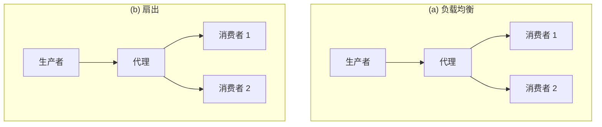
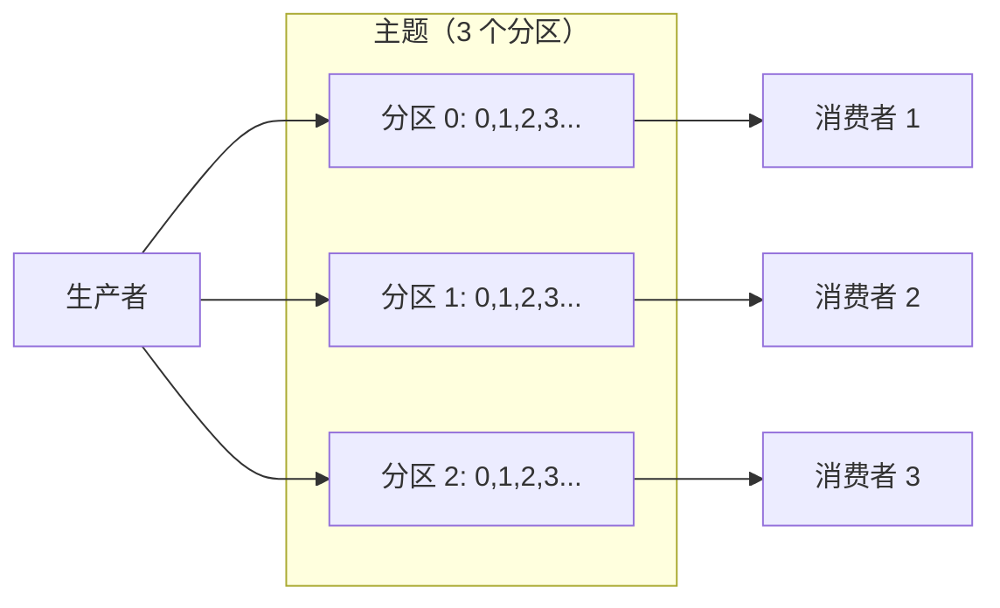
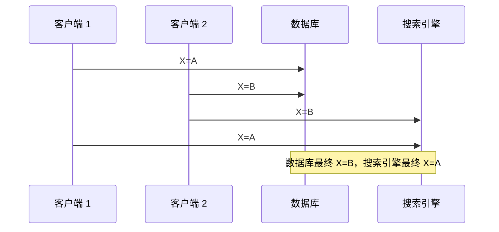
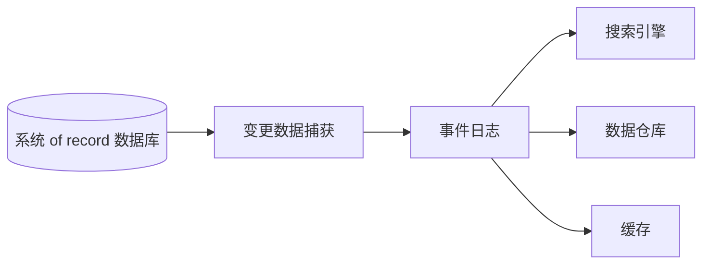
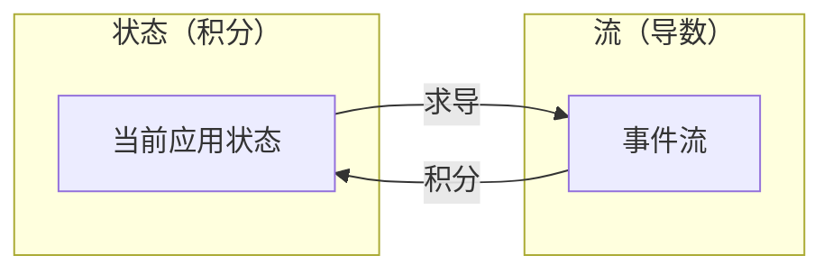

# 第11章 流处理

> 一个能工作的复杂系统总是从一个能工作的简单系统演化而来的。反之亦然：从零设计的复杂系统从未工作过，也无法使其工作。
>
> — John Gall，《系统学》（1975）

在第 10 章中，我们讨论了批处理——读取一组文件作为输入并产生新的一组输出文件的技术。输出是一种**派生数据**（derived data）；即，如有必要可以通过再次运行批处理来重新创建的数据集。我们看到了这个简单但强大的想法如何用于创建搜索引擎、推荐系统、分析等。

然而，第 10 章中有一个重大假设：即输入是**有界的**（bounded）——已知且有限的大小——因此批处理知道何时完成读取其输入。例如，MapReduce 核心的排序操作必须读取其全部输入才能开始产生输出：可能最后一条输入记录是具有最低键的记录，因此需要是第一条输出记录，所以提前开始输出是不可能的。

实际上，大量数据是无界的，因为它随时间逐渐到达：你的用户昨天和今天产生了数据，他们明天将继续产生更多数据。除非你停业，这个过程永远不会结束，因此数据集在任何有意义的方式上永远不「完整」[1]。因此，批处理器必须人为地将数据划分为固定时长的块：例如，每天结束时处理一天的数据，或每小时结束时处理一小时的数据。

每日批处理的问题是输入的变化要一天后才反映在输出中，这对许多不耐烦的用户来说太慢了。为了减少延迟，我们可以更频繁地运行处理——比如，每秒结束时处理一秒的数据——甚至持续运行，完全放弃固定时间片，简单地处理每个事件的发生。这就是**流处理**（stream processing）背后的想法。

一般来说，「流」（stream）指的是随时间增量可用的数据。这个概念出现在许多地方：Unix 的 stdin 和 stdout、编程语言（惰性列表）[2]、文件系统 API（如 Java 的 FileInputStream）、TCP 连接、通过互联网传输音频和视频等。

在本章中，我们将把**事件流**（event streams）作为一种数据管理机制来研究：与上一章看到的批数据相对应的无界、增量处理的数据。我们将首先讨论流如何表示、存储和通过网络传输。在第 451 页「数据库与流」中，我们将研究流与数据库之间的关系。最后，在第 464 页「处理流」中，我们将探索持续处理这些流的方法和工具，以及它们如何用于构建应用。

## 传输事件流

在批处理世界中，作业的输入和输出是文件（可能在分布式文件系统上）。流式等价物是什么样的？

当输入是文件（字节序列）时，第一步通常是将其解析为记录序列。在流处理上下文中，记录更常被称为**事件**（event），但本质上是同一件事：一个小的、自包含的、不可变的对象，包含在某个时间点发生的某事的细节。事件通常包含指示其发生时间的时间戳（根据日历时钟，见第 288 页「单调时钟与日历时钟」）。

例如，发生的事可能是用户采取的操作，如查看页面或进行购买。它也可能来自机器，如温度传感器的定期测量或 CPU 利用率指标。在第 391 页「使用 Unix 工具进行批处理」的示例中，Web 服务器日志的每一行都是一个事件。

事件可以编码为文本字符串、JSON 或某种二进制形式，如第 4 章所讨论的。这种编码允许你存储事件，例如通过将其追加到文件、插入关系表或写入文档数据库。它还允许你通过网络将事件发送到另一个节点进行处理。

在批处理中，文件写入一次然后可能被多个作业读取。类似地，在流术语中，事件由**生产者**（producer）（也称为发布者或发送者）生成一次，然后可能被多个**消费者**（consumer）（订阅者或接收者）处理 [3]。在文件系统中，文件名标识一组相关记录；在流系统中，相关事件通常分组到**主题**（topic）或**流**（stream）中。

原则上，文件或数据库足以连接生产者和消费者：生产者将其生成的每个事件写入数据存储，每个消费者定期轮询数据存储以检查自上次运行以来出现的事件。这本质上就是批处理在每天结束时处理一天数据时所做的。

然而，当向低延迟的持续处理移动时，如果数据存储不是为此类使用设计的，轮询会变得昂贵。你轮询越频繁，返回新事件的请求百分比越低，因此开销越大。相反，当新事件出现时通知消费者更好。

数据库传统上对这种通知机制支持不佳：关系数据库通常有触发器，可以对变化（例如向表中插入行）做出反应，但它们能做的事情非常有限，在数据库设计中有些是事后想法 [4, 5]。相反，已经开发了专门的工具来传递事件通知。

## 消息系统

通知消费者新事件的常见方法是使用**消息系统**（messaging system）：生产者发送包含事件的消息，然后被推送给消费者。我们之前在第 136 页「消息传递数据流」中简要提到了这些系统，但现在我们将更详细地讨论。

生产者与消费者之间的直接通信通道（如 Unix 管道或 TCP 连接）将是实现消息系统的简单方法。然而，大多数消息系统在基本模型上进行了扩展。特别是，Unix 管道和 TCP 恰好连接一个发送者与一个接收者，而消息系统允许多个生产者节点向同一主题发送消息，并允许多个消费者节点接收主题中的消息。

在这种发布/订阅模型中，不同系统采取了广泛的方法，没有一种适用于所有目的的正确答案。要区分这些系统，特别有助于问以下两个问题：

1. **如果生产者发送消息的速度快于消费者处理的速度会怎样？**  broadly 来说，有三种选择：系统可以丢弃消息、在队列中缓冲消息或应用**背压**（backpressure）（也称为流控制；即阻止生产者发送更多消息）。例如，Unix 管道和 TCP 使用背压：它们有小的固定大小缓冲区，如果填满，发送者会被阻塞直到接收者从缓冲区取出数据（见第 282 页「网络拥塞与排队」）。
2. **如果节点崩溃或暂时离线——是否有消息丢失？** 与数据库一样，持久性可能需要某种组合的写入磁盘和/或复制（见第 227 页侧栏「复制与持久性」），这有成本。如果你能承受有时丢失消息，你可能在相同硬件上获得更高的吞吐量和更低的延迟。

消息丢失是否可接受很大程度上取决于应用。例如，对于定期传输的传感器读数和指标，偶尔丢失数据点可能不重要，因为稍后会发送更新值。然而，要注意如果大量消息被丢弃，可能不会立即明显看出指标不正确 [7]。如果你在计数事件，可靠传递更重要，因为每条丢失的消息意味着错误的计数器。

我们在第 10 章探索的批处理系统的一个很好的属性是它们提供强可靠性保证：失败的任务会自动重试，失败任务的部分输出会自动丢弃。这意味着输出与没有发生故障时相同，这有助于简化编程模型。本章后面我们将研究如何在流上下文中提供类似的保证。

### 从生产者到消费者的直接消息传递

许多消息系统使用生产者与消费者之间的直接网络通信，而不经过中间节点：

- **UDP 组播**在金融行业广泛用于股票行情等流，其中低延迟很重要 [8]。虽然 UDP 本身不可靠，但应用层协议可以恢复丢失的数据包（生产者必须记住已发送的数据包以便按需重传）。
- **无代理消息库**如 ZeroMQ [9] 和 nanomsg 采用类似方法，在 TCP 或 IP 组播上实现发布/订阅消息传递。
- **StatsD** [10] 和 **Brubeck** [7] 使用不可靠的 UDP 消息从网络上所有机器收集指标并监控它们。
- 如果消费者在网络上暴露服务，生产者可以直接进行 HTTP 或 RPC 请求（见第 131 页「通过服务的数据流：REST 和 RPC」）将消息推送给消费者。这是 **webhooks** [12] 背后的想法，一种将一个服务的回调 URL 注册到另一个服务的模式，每当事件发生时它向该 URL 发出请求。

虽然这些直接消息系统在为其设计的情况下工作良好，但它们通常要求应用代码意识到消息丢失的可能性。它们能容忍的故障相当有限：即使协议检测并重传网络中丢失的数据包，它们通常假设生产者和消费者持续在线。

如果消费者离线，它可能错过在不可达时发送的消息。某些协议允许生产者重试失败的消息传递，但如果生产者崩溃，这种方法可能会失效，丢失本应重试的消息缓冲区。

### 消息代理

广泛使用的替代方案是通过**消息代理**（message broker）（也称为消息队列）发送消息，它本质上是一种针对处理消息流优化的数据库 [13]。它作为服务器运行，生产者和消费者作为客户端连接。生产者向代理写入消息，消费者通过从代理读取来接收它们。

通过将数据集中在代理中，这些系统可以更容易地容忍来来去去的客户端（连接、断开和崩溃），持久性问题转移到代理而不是客户端。一些消息代理只在内存中保留消息，而其他（取决于配置）将其写入磁盘以便在代理崩溃时不会丢失。面对慢消费者，它们通常允许无界排队（而不是丢弃消息或背压），尽管这种选择也可能取决于配置。

排队的一个后果是消费者通常是异步的：当生产者发送消息时，它通常只等待代理确认已缓冲消息，而不等待消费者处理消息。向消费者的传递将在某个未确定的未来时间点发生——通常在几分之一秒内，但有时如果有队列积压会显著延迟。

### 消息代理与数据库比较

一些消息代理甚至可以参与使用 XA 或 JTA 的两阶段提交协议（见第 360 页「实践中的分布式事务」）。这一特性使它们在性质上非常类似于数据库，尽管消息代理和数据库之间仍有重要的实际差异：

- 数据库通常保留数据直到显式删除，而大多数消息代理在成功传递给消费者后自动删除消息。此类消息代理不适合长期数据存储。
- 由于它们快速删除消息，大多数消息代理假设其工作集相当小——即队列很短。如果代理需要缓冲大量消息因为消费者慢（如果不再适合内存可能将消息溢出到磁盘），每条消息的处理时间更长，整体吞吐量可能下降 [6]。
- 数据库通常支持二级索引和各种搜索数据的方式，而消息代理通常支持某种订阅匹配某种模式的主题子集的方式。机制不同，但两者本质上都是客户端选择其想了解的数据部分的方式。
- 查询数据库时，结果通常基于数据的**时间点快照**（point-in-time snapshot）；如果另一个客户端随后向数据库写入改变查询结果的内容，第一个客户端不会发现其先前的结果现在已过时（除非它重复查询或轮询变化）。相比之下，消息代理不支持任意查询，但它们确实在数据变化时（即当新消息可用时）通知客户端。

这是消息代理的传统观点，封装在 JMS [14] 和 AMQP [15] 等标准中，并在 RabbitMQ、ActiveMQ、HornetQ、Qpid、TIBCO Enterprise Message Service、IBM MQ、Azure Service Bus 和 Google Cloud Pub/Sub [16] 等软件中实现。

### 多个消费者

当多个消费者读取同一主题中的消息时，使用两种主要的消息传递模式，如图 11-1 所示：

**负载均衡**

每条消息传递给消费者之一，因此消费者可以分担处理主题中消息的工作。代理可以任意将消息分配给消费者。当消息处理昂贵且因此你想能够添加消费者来并行化处理时，此模式很有用。（在 AMQP 中，你可以通过让多个客户端从同一队列消费来实现负载均衡，在 JMS 中称为共享订阅。）

**扇出**

每条消息传递给所有消费者。扇出允许几个独立的消费者各自「调谐」到同一消息广播，而不相互影响——相当于有多个不同的批处理作业读取同一输入文件的流式等价物。（JMS 中的主题订阅和 AMQP 中的交换绑定提供此功能。）

**图 11-1. (a) 负载均衡：在消费者之间分担消费主题的工作；(b) 扇出：将每条消息传递给多个消费者。**

两种模式可以组合：例如，两组独立的消费者可能各自订阅一个主题，使得每组集体接收所有消息，但在每组内只有一个节点接收每条消息。

### 确认与重传

消费者可能随时崩溃，因此可能发生代理将消息传递给消费者但消费者从未处理它，或仅在崩溃前部分处理它的情况。为确保消息不丢失，消息代理使用**确认**（acknowledgments）：客户端必须显式告诉代理何时完成处理消息，以便代理可以将其从队列中删除。

如果与客户端的连接关闭或超时而没有代理收到确认，它假设消息未被处理，因此将消息再次传递给另一个消费者。（注意，可能发生消息实际上已完全处理但确认在网络中丢失的情况。处理这种情况需要原子提交协议，如第 360 页「实践中的分布式事务」所讨论的。）

与负载均衡结合时，这种重传行为对消息顺序有有趣的影响。在图 11-2 中，消费者通常按生产者发送的顺序处理消息。然而，消费者 2 在处理消息 m3 时崩溃，同时消费者 1 正在处理消息 m4。未确认的消息 m3 随后被重传给消费者 1，结果是消费者 1 按 m4、m3、m5 的顺序处理消息。因此，m3 和 m4 的传递顺序与生产者 1 发送的顺序不同。

## 分区日志

通过网络发送数据包或向网络服务发出请求通常是瞬态操作，不会留下永久痕迹。虽然可以永久记录它（使用数据包捕获和日志记录），我们通常不这样想。即使将消息持久写入磁盘的消息代理在传递给消费者后也会快速再次删除它们，因为它们围绕瞬态消息传递思维构建。

数据库和文件系统采取相反的方法：写入数据库或文件的所有内容通常预期被永久记录，至少直到有人显式选择再次删除它。

这种思维方式的差异对如何创建派生数据有很大影响。如第 10 章所讨论的，批处理的一个关键特性是你可以重复运行它们，尝试处理步骤，而不会损坏输入（因为输入是只读的）。AMQP/JMS 风格的消息传递不是这样：接收消息是破坏性的，如果确认导致它从代理中删除，因此你不能再次运行同一消费者并期望得到相同的结果。

如果你向消息系统添加新消费者，它通常只开始接收注册后发送的消息；任何先前的消息已经消失，无法恢复。与文件和数据库形成对比，你可以随时添加新客户端，它可以读取任意久远写入的数据（只要它未被应用显式覆盖或删除）。

为什么我们不能有一个混合体，结合数据库的持久存储方法和消息传递的低延迟通知设施？这就是**基于日志的消息代理**（log-based message brokers）背后的想法。

### 使用日志进行消息存储

**日志**（log）只是磁盘上的追加式记录序列。我们之前在第 3 章的日志结构存储引擎和预写日志的上下文中，以及第 5 章的复制的上下文中讨论过日志。

相同的结构可用于实现消息代理：生产者通过将消息追加到日志末尾来发送消息，消费者通过顺序读取日志来接收消息。如果消费者到达日志末尾，它等待新消息已追加的通知。Unix 工具 `tail -f` 监视文件以获取追加的数据，本质上就是这样工作的。

为了扩展到比单个磁盘所能提供的更高吞吐量，日志可以分区（第 6 章的意义上）。不同的分区可以托管在不同的机器上，使每个分区成为可以独立于其他分区读写的独立日志。然后可以将主题定义为都承载相同类型消息的分区组。这种方法如图 11-3 所示。

在每个分区内，代理为每条消息分配单调递增的**序列号**（sequence number）或**偏移量**（offset）（在图 11-3 中，方框中的数字是消息偏移量）。这样的序列号有意义，因为分区是追加式的，因此分区内的消息是全序的。不同分区之间没有顺序保证。

**图 11-3. 生产者通过将消息追加到主题-分区文件来发送消息，消费者顺序读取这些文件。**

Apache Kafka [17, 18]、Amazon Kinesis Streams [19] 和 Twitter 的 DistributedLog [20, 21] 是按此方式工作的基于日志的消息代理。Google Cloud Pub/Sub 在架构上类似，但暴露 JMS 风格的 API 而不是日志抽象 [16]。

尽管这些消息代理将所有消息写入磁盘，它们能够通过跨多台机器分区实现每秒数百万条消息的吞吐量，并通过复制消息实现容错 [22, 23]。

### 日志与传统消息传递比较

基于日志的方法琐碎地支持扇出消息传递，因为多个消费者可以独立读取日志而不相互影响——读取消息不会从日志中删除它。要在消费者组中实现负载均衡，代理不是将单条消息分配给消费者客户端，而是可以将整个分区分配给消费者组中的节点。

然后每个客户端消费分配给它的分区中的所有消息。通常，当消费者被分配了日志分区时，它以简单的单线程方式顺序读取分区中的消息。这种粗粒度负载均衡方法有一些缺点：

- 分担消费主题工作的节点数最多可以是该主题中日志分区数，因为同一分区内的消息传递给同一节点。
- 如果单条消息处理慢，它会阻碍该分区中后续消息的处理（一种队头阻塞；见第 13 页「描述性能」）。

因此，在消息可能处理昂贵且你想按消息并行化处理、且消息顺序不那么重要的情况下，JMS/AMQP 风格的消息代理更可取。另一方面，在高消息吞吐量、每条消息处理快且消息顺序重要的情况下，基于日志的方法效果很好。

### 消费者偏移量

顺序消费分区使得很容易判断哪些消息已处理：偏移量小于消费者当前偏移量的所有消息已处理，偏移量更大的尚未看到。因此，代理不需要跟踪每条消息的确认——它只需要定期记录消费者偏移量。这种方法中减少的簿记开销以及批处理和流水线的机会有助于提高基于日志系统的吞吐量。

这个偏移量实际上与单主数据库复制中常见的日志序列号非常相似，我们在第 155 页「设置新从节点」中讨论过。在数据库复制中，日志序列号允许从节点在断开连接后重新连接到主节点，并在不跳过任何写入的情况下恢复复制。这里使用完全相同的原理：消息代理表现得像主数据库，消费者像从节点。

如果消费者节点失败，消费者组中的另一个节点被分配失败消费者的分区，它从最后记录的偏移量开始消费消息。如果消费者已处理后续消息但尚未记录其偏移量，这些消息将在重启时被第二次处理。我们将在本章后面讨论处理此问题的方法。

## 数据库与流

我们在消息代理和数据库之间进行了一些比较。尽管它们传统上被视为不同类别的工具，我们看到基于日志的消息代理成功地从数据库借鉴想法并应用于消息传递。我们也可以反过来：从消息传递和流借鉴想法，应用于数据库。

我们之前说过，事件是在某个时间点发生的某事的记录。发生的事可能是用户操作（例如输入搜索查询）或传感器读数，但也可能是**对数据库的写入**。向数据库写入某物是可以被捕获、存储和处理的事件。这一观察表明数据库与流之间的联系比磁盘上日志的物理存储更深——它是相当根本的。

事实上，**复制日志**（见第 158 页「复制日志的实现」）是数据库写入事件流，由主节点在处理事务时产生。从节点将该写入流应用于它们自己的数据库副本，从而最终得到相同数据的准确副本。复制日志中的事件描述发生的数据变化。

我们还在第 348 页「全序广播」中遇到了**状态机复制**（state machine replication）原则，它指出：如果每个事件表示对数据库的写入，并且每个副本以相同顺序处理相同事件，则副本将最终处于相同的最终状态。（假设处理事件是确定性操作。）这只是事件流的另一个例子！

在本节中，我们将首先看看异构数据系统中出现的问题，然后探索如何通过将事件流的想法引入数据库来解决它。

### 保持系统同步

正如我们在本书中所看到的，没有单一系统可以满足所有数据存储、查询和处理需求。在实践中，大多数非平凡应用需要组合几种不同的技术以满足其需求：例如，使用 OLTP 数据库服务用户请求、缓存加速常见请求、全文索引处理搜索查询、数据仓库进行分析。每个都有其自己的数据副本，以其自己的、针对其自身目的优化的表示存储。

由于相同或相关的数据出现在几个不同的地方，它们需要彼此保持同步：如果数据库中的项目被更新，它也需要在缓存、搜索引擎和数据仓库中更新。对于数据仓库，这种同步通常由 ETL 过程执行（见第 91 页「数据仓库」），通常通过获取数据库的完整副本、转换它并批量加载到数据仓库——换句话说，批处理。类似地，我们在第 411 页「批处理工作流的输出」中看到了如何使用批处理创建搜索引擎、推荐系统和其他派生数据系统。

如果定期完整数据库转储太慢，有时使用的替代方案是**双写**（dual writes），其中应用代码在数据变化时显式写入每个系统：例如，先写入数据库，然后更新搜索引擎，然后使缓存条目失效（甚至并发执行这些写入）。

然而，双写有一些严重问题，其中之一是图 11-4 中说明的竞态条件。在此示例中，两个客户端并发想要更新项目 X：客户端 1 想将值设置为 A，客户端 2 想将其设置为 B。两个客户端首先将新值写入数据库，然后写入搜索引擎。由于不幸的时序，请求交错：数据库首先看到客户端 1 将值设置为 A 的写入，然后看到客户端 2 将值设置为 B 的写入，因此数据库中的最终值是 B。搜索引擎首先看到客户端 2 的写入，然后是客户端 1，因此搜索引擎中的最终值是 A。两个系统现在永久彼此不一致，尽管没有发生错误。

**图 11-4. 在数据库中，X 先设为 A 再设为 B，而搜索引擎中写入以相反顺序到达。**

除非你有某种额外的并发检测机制，例如我们在第 184 页「检测并发写入」中讨论的版本向量，你甚至不会注意到发生了并发写入——一个值将简单地静默覆盖另一个值。

双写的另一个问题是其中一个写入可能失败而另一个成功。这是容错问题而不是并发问题，但它也有使两个系统彼此不一致的效果。确保它们要么都成功要么都失败是原子提交问题的情况，解决起来很昂贵（见第 354 页「原子提交与两阶段提交（2PC）」）。

如果你只有一个具有单主的复制数据库，那么该主节点确定写入的顺序，因此状态机复制方法在数据库的副本之间有效。然而，在图 11-4 中没有单一主节点：数据库可能有主节点，搜索引擎可能有主节点，但两者都不跟随另一个，因此可能发生冲突（见第 168 页「多主复制」）。

如果确实只有一个主节点——例如数据库——并且如果我们能使搜索引擎成为数据库的从节点，情况会更好。但这在实践中可能吗？

### 变更数据捕获

大多数数据库复制日志的问题长期以来被认为是数据库的内部实现细节，而不是公共 API。客户端应该通过其数据模型和查询语言查询数据库，而不是解析复制日志并尝试从中提取数据。

几十年来，许多数据库根本没有记录的方式获取写入它们的变更日志。因此，很难获取数据库中做出的所有变更并将它们复制到不同的存储技术，如搜索引擎、缓存或数据仓库。

最近，对**变更数据捕获**（Change Data Capture, CDC）的兴趣日益增长，这是观察写入数据库的所有数据变更并以可以复制到其他系统的形式提取它们的过程。如果变更以流的形式、在写入时立即可用，CDC 特别有趣。

例如，你可以捕获数据库中的变更并持续将相同变更应用于搜索引擎。如果变更日志以相同顺序应用，你可以预期搜索引擎中的数据与数据库中的数据匹配。搜索引擎和任何其他派生数据系统只是变更流的消费者，如图 11-5 所示。

**图 11-5. 按写入一个数据库的顺序获取数据，并以相同顺序将变更应用于其他系统。**

### 事件溯源

我们在此讨论的想法与**事件溯源**（event sourcing）有一些相似之处，这是领域驱动设计（DDD）社区开发的一种技术 [42, 43, 44]。我们将简要讨论事件溯源，因为它包含对流系统有用且相关的一些想法。

与变更数据捕获类似，事件溯源涉及将对应用程序状态的所有变更存储为变更事件日志。最大的区别是事件溯源在不同抽象层次上应用这一想法：

- **在变更数据捕获中**，应用以可变方式使用数据库，随意更新和删除记录。变更日志在低层次从数据库提取（例如通过解析复制日志），这确保从数据库提取的写入顺序与它们实际写入的顺序匹配，避免图 11-4 中的竞态条件。写入数据库的应用不需要知道 CDC 正在发生。
- **在事件溯源中**，应用逻辑显式建立在写入事件日志的不可变事件之上。在这种情况下，事件存储是追加式的，不鼓励或禁止更新或删除。事件被设计为反映应用层次发生的事，而不是低层次的状态变化。

事件溯源是一种强大的数据建模技术：从应用的角度来看，将用户的操作记录为不可变事件比记录这些操作对可变数据库的影响更有意义。事件溯源使应用随时间演化更容易，通过使事后理解某事为何发生更容易来帮助调试，并防范应用错误。

### 状态、流与不可变性

我们在第 10 章看到，批处理受益于其输入文件的不可变性，因此你可以在现有输入文件上运行实验性处理作业而不必担心损坏它们。这种不可变性原则也是使事件溯源和变更数据捕获如此强大的原因。

我们通常认为数据库存储应用程序的当前状态——这种表示针对读取进行了优化，通常是服务查询最方便的。状态的本质是它会变化，因此数据库支持更新和删除数据以及插入。这与不可变性如何契合？

每当你有变化的状态时，该状态是随时间改变它的事件的产物。例如，你当前可用座位列表是你已处理的预订的结果，当前账户余额是账户上贷项和借项的结果，Web 服务器的响应时间图是已发生的所有 Web 请求的各个响应时间的聚合。

无论状态如何变化，总有一系列导致这些变化的事件。即使事情被完成和撤销，这些事件发生的事实仍然成立。关键想法是可变状态和不可变事件的追加式日志并不矛盾：它们是同一枚硬币的两面。所有变更的日志、**变更日志**（changelog），表示状态随时间的演化。

如果你数学上倾向，你可能会说应用程序状态是随时间对事件流积分得到的，变更流是状态对时间求导得到的，如图 11-6 所示 [49, 50, 51]。

**图 11-6. 当前应用状态与事件流之间的关系。**

## 处理流

到目前为止，本章我们讨论了流来自哪里（用户活动事件、传感器、对数据库的写入），以及流如何传输（通过直接消息传递、通过消息代理、在事件日志中）。剩下的是讨论一旦你有了流可以做什么——即，你可以处理它。broadly 来说，有三种选择：

1. 你可以获取事件中的数据并将其写入数据库、缓存、搜索引擎或类似存储系统，从那里其他客户端可以查询。如图 11-5 所示，这是保持数据库与系统其他部分发生的变更同步的好方法——特别是如果流消费者是唯一写入数据库的客户端。写入存储系统是我们在第 411 页「批处理工作流的输出」中讨论的流式等价物。
2. 你可以以某种方式将事件推送给用户，例如通过发送电子邮件警报或推送通知，或通过将事件流式传输到实时仪表板进行可视化。在这种情况下，人类是流的最终消费者。
3. 你可以处理一个或多个输入流以产生一个或多个输出流。流可能在最终到达输出（选项 1 或 2）之前经过由几个此类处理阶段组成的管道。

在本章其余部分，我们将讨论选项 3：处理流以产生其他派生流。像这样处理流的代码被称为**算子**（operator）或**作业**（job）。它与我们在第 10 章讨论的 Unix 进程和 MapReduce 作业密切相关，数据流模式类似：流处理器以只读方式消费输入流，并以追加式方式将其输出写入不同位置。

流处理器中的分区和并行化模式与第 10 章中 MapReduce 和数据流引擎的模式也非常相似，因此我们不会在此重复这些主题。基本的映射操作如转换和过滤记录也以相同方式工作。

与批作业的一个关键区别是流永远不会结束。这种差异有许多影响：如本章开头所讨论的，排序对无界数据集没有意义，因此排序-归并连接（见第 403 页「归约端连接与分组」）无法使用。容错机制也必须改变：对于运行了几分钟的批作业，失败的任务可以简单地从开始重新启动，但对于运行了几年的流作业，崩溃后从头重新启动可能不是可行的选择。

### 流处理的用途

流处理长期以来用于监控目的，组织希望在发生某些事情时收到警报。例如：

- **欺诈检测系统**需要确定信用卡的使用模式是否意外变化，如果可能被盗则阻止该卡。
- **交易系统**需要检查金融市场中的价格变化并根据指定规则执行交易。
- **制造系统**需要监控工厂中机器的状态，如果发生故障则快速识别问题。
- **军事和情报系统**需要跟踪潜在侵略者的活动，如果有攻击迹象则发出警报。

这些类型的应用需要相当复杂的模式匹配和关联。然而，流处理的其他用途也随着时间的推移而出现。在本节中，我们将简要比较和对比其中一些应用。

### 关于时间的推理

流处理器通常需要处理时间，特别是当用于分析目的时，经常使用时间窗口如「过去五分钟的平均值」。似乎「过去五分钟」的含义应该是明确和清晰的，但不幸的是这个概念 surprisingly 棘手。

在批处理中，处理任务快速处理大量历史事件集合。如果需要某种按时间的细分，批处理需要查看嵌入在每个事件中的时间戳。查看运行批处理的机器的系统时钟没有意义，因为进程运行的时间与事件实际发生的时间无关。

批处理可能在几分钟内读取一年的历史事件；在大多数情况下，感兴趣的时间线是历史的一年，而不是处理的几分钟。此外，使用事件中的时间戳允许处理是确定性的：在相同输入上再次运行相同过程产生相同结果（见第 422 页「容错」）。

另一方面，许多流处理框架使用处理机器上的本地系统时钟（**处理时间**（processing time））来确定窗口 [79]。这种方法具有简单的优点，如果事件创建和事件处理之间的延迟可以忽略不计地短，这是合理的。然而，如果有任何显著的处理延迟——即，如果处理可能明显晚于事件实际发生的时间——它会失效。

**事件时间与处理时间**

处理可能延迟的原因有很多：排队、网络故障（见第 277 页「不可靠网络」）、导致消息代理或处理器争用的性能问题、流消费者的重启、或在从故障恢复或修复代码中的错误后对过去事件的重新处理（见第 451 页「重放旧消息」）。

此外，消息延迟还可能导致消息的不可预测排序。例如，假设用户首先发出一个 Web 请求（由 Web 服务器 A 处理），然后发出第二个请求（由服务器 B 处理）。A 和 B 发出描述它们处理的请求的事件，但 B 的事件在 A 的事件之前到达消息代理。现在流处理器将首先看到 B 事件然后看到 A 事件，尽管它们实际上以相反顺序发生。

### 流连接

在第 10 章中，我们讨论了批作业如何按键连接数据集，以及此类连接如何形成数据管道的重要组成部分。由于流处理将数据管道泛化为无界数据集的增量处理，流上的连接有完全相同的需求。

然而，新事件可以随时在流上出现这一事实使流上的连接比批作业更具挑战性。为了更好地理解情况，让我们区分三种不同类型的连接：流-流连接、流-表连接和表-表连接 [84]。

**流-流连接（窗口连接）**

假设你的网站上有搜索功能，你想检测搜索 URL 的近期趋势。每次有人输入搜索查询时，你记录包含查询和返回结果的事件。每次有人点击搜索结果之一时，你记录另一个记录点击的事件。为了计算搜索结果中每个 URL 的点击率，你需要将搜索操作和点击操作的事件集中在一起，它们通过具有相同的会话 ID 连接。

**流-表连接（流丰富）**

在第 404 页「示例：用户活动事件分析」（图 10-2）中，我们看到了批作业连接两个数据集的示例：一组用户活动事件和用户档案数据库。很自然地将用户活动事件视为流，并在流处理器中持续执行相同的连接：输入是包含用户 ID 的活动事件流，输出是用户 ID 已用用户档案信息丰富的活动事件流。这个过程有时被称为用数据库中的信息**丰富**（enriching）活动事件。

**表-表连接（物化视图维护）**

考虑我们在第 11 页「描述负载」中讨论的 Twitter 时间线示例。我们说当用户想查看其主页时间线时，迭代用户关注的所有人、找到他们的最近推文并合并它们太昂贵了。相反，我们想要时间线缓存：一种每用户的「收件箱」，推文在发送时写入其中，因此读取时间线是单次查找。物化和维护此缓存需要以下事件处理：

- 当用户 u 发送新推文时，它被添加到关注 u 的每个用户的时间线。
- 当用户删除推文时，它从所有用户的时间线中移除。
- 当用户 u1 开始关注用户 u2 时，u2 的最近推文被添加到 u1 的时间线。
- 当用户 u1 取消关注用户 u2 时，u2 的推文从 u1 的时间线中移除。

## 容错

在本章最后一节，让我们考虑流处理器如何容忍故障。我们在第 10 章看到批处理框架可以相当容易地容忍故障：如果 MapReduce 作业中的任务失败，它可以在另一台机器上简单重新启动，失败任务的输出被丢弃。这种透明重试是可能的，因为输入文件是不可变的，每个任务将其输出写入 HDFS 上的单独文件，输出仅在任务成功完成时可见。

特别是，批处理的容错方法确保批处理作业的输出与没有出错时相同，即使实际上某些任务确实失败了。看起来好像每条输入记录都被恰好处理一次——没有记录被跳过，也没有被处理两次。尽管重启任务意味着记录实际上可能被处理多次，但输出中的可见效果好像它们只被处理了一次。这一原则被称为**恰好一次语义**（exactly-once semantics），尽管**有效一次**（effectively-once）可能是更具描述性的术语 [90]。

流处理中出现相同的容错问题，但处理起来不那么直接：在使输出可见之前等待任务完成不是选项，因为流是无限的，因此你永远无法完成处理它。

### 微批与检查点

一种解决方案是将流分成小块，并将每块像微型批处理一样处理。这种方法称为**微批**（microbatching），在 Spark Streaming [91] 中使用。批大小通常约为一秒，这是性能折衷的结果：较小的批产生更大的调度和协调开销，而较大的批意味着流处理器结果可见之前的延迟更长。

微批还隐式提供等于批大小的滚动窗口（按处理时间而非事件时间戳窗口化）；任何需要更大窗口的作业需要显式地将状态从一个微批传递到下一个。

Apache Flink 使用的变体方法是定期生成状态的滚动检查点并将其写入持久存储 [92, 93]。如果流算子崩溃，它可以从其最近的检查点重新启动并丢弃上次检查点和崩溃之间生成的任何输出。检查点由消息流中的**屏障**（barriers）触发，类似于微批之间的边界，但不强制特定的窗口大小。

在流处理框架的 confines 内，微批和检查点方法提供与批处理相同的恰好一次语义。然而，一旦输出离开流处理器（例如通过写入数据库、向外部消息代理发送消息或发送电子邮件），框架不再能够丢弃失败批的部分输出。在这种情况下，重启失败任务会导致外部副作用发生两次，仅微批或检查点不足以防止此问题。

### 幂等性

我们的目标是丢弃任何失败任务的部分输出，以便它们可以安全地重试而不会生效两次。分布式事务是实现该目标的一种方式，但另一种方式是依赖**幂等性**（idempotence）[97]。

**幂等操作**（idempotent operation）是可以多次执行且效果与只执行一次相同的操作。例如，将键值存储中的键设置为某个固定值是幂等的（再次写入值只是用相同的值覆盖值），而递增计数器不是幂等的（再次执行递增意味着值被递增两次）。

即使操作不是自然幂等的，通常可以通过一点额外的元数据使其幂等。例如，当从 Kafka 消费消息时，每条消息都有持久的、单调递增的偏移量。当向外部数据库写入值时，你可以将触发上次写入的消息的偏移量与值一起包含。因此，你可以判断更新是否已应用，并避免再次执行相同的更新。

## 小结

在本章中，我们讨论了事件流、它们服务的目的是以及如何处理它们。在某些方面，流处理与我们在第 10 章讨论的批处理非常相似，但持续在无界（永无止境）的流上而不是固定大小的输入上执行。从这个角度来看，消息代理和事件日志充当文件系统的流式等价物。

我们花了一些时间比较两种类型的消息代理：

**AMQP/JMS 风格的消息代理**

代理将单条消息分配给消费者，消费者在成功处理时确认单条消息。消息在确认后从代理中删除。这种方法适合作为 RPC 的异步形式（另见第 136 页「消息传递数据流」），例如在任务队列中，消息处理的精确顺序不重要，处理后不需要回头再次读取旧消息。

**基于日志的消息代理**

代理将分区中的所有消息分配给同一消费者节点，并始终以相同顺序传递消息。通过分区实现并行性，消费者通过检查点它们已处理的最后一条消息的偏移量来跟踪进度。代理在磁盘上保留消息，因此如有必要可以跳回并重新读取旧消息。

关于流来自哪里，我们讨论了几种可能性：用户活动事件、提供定期读数的传感器和数据馈送（例如金融中的市场数据）自然表示为流。我们看到将数据库的写入视为流也很有用：我们可以通过变更数据捕获隐式或通过事件溯源显式捕获**变更日志**（changelog）——即对数据库做出的所有变更的历史。日志压缩允许流保留数据库内容的完整副本。

我们将数据库表示为流为系统集成开辟了强大的机会。你可以通过消费变更日志并将其应用于派生系统，使搜索引擎、缓存和分析系统等派生数据系统持续保持最新。你甚至可以通过从头开始并消费从开始到现在的变更日志，在现有数据上构建新视图。

我们讨论了流处理的几种目的，包括搜索事件模式（复杂事件处理）、计算窗口聚合（流分析）和保持派生数据系统最新（物化视图）。

我们然后讨论了在流处理器中关于时间推理的困难，包括处理时间和事件时间戳之间的区别，以及处理你认为窗口已完成之后到达的落后者事件的问题。

我们区分了流过程中可能出现的三种连接类型：

- **流-流连接**：两个输入流都由活动事件组成，连接算子搜索在某个时间窗口内发生的相关事件。
- **流-表连接**：一个输入流由活动事件组成，另一个是数据库变更日志。变更日志保持数据库的本地副本最新。对于每个活动事件，连接算子查询数据库并输出丰富的活动事件。
- **表-表连接**：两个输入流都是数据库变更日志。在这种情况下，一侧的每个变更与另一侧的最新状态连接。结果是两个表连接的物化视图的变更流。

最后，我们讨论了在流处理器中实现容错和恰好一次语义的技术。与批处理一样，我们需要丢弃任何失败任务的部分输出。然而，由于流过程是长期运行的并持续产生输出，我们不能简单地丢弃所有输出。相反，可以使用基于微批、检查点、事务或幂等写入的更细粒度的恢复机制。

---

[← 上一章](ch10.md) | [目录](../index.md) | [下一章 →](ch12.md)
