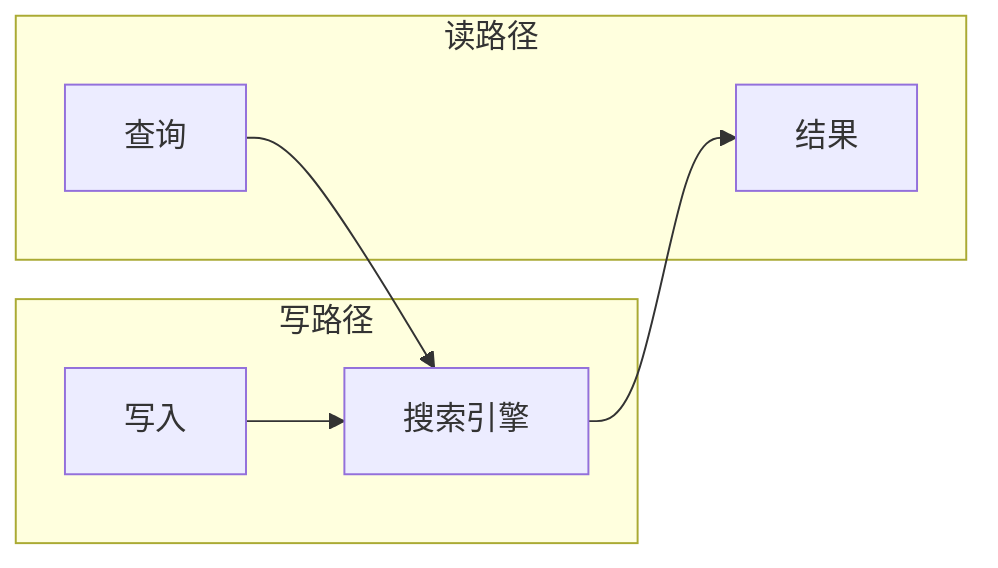

# 第12章 数据系统的未来

> 若一物注定以另一物为其目的，则其最终目的不能在于保存其自身。因此，船长并不以保存委托给他的船为最终目的，因为船注定以他物为目的，即航行。（常被引用为：若船长的最高目标是保存他的船，他会永远把它停在港口。）
>
> — 圣托马斯·阿奎那，《神学大全》（1265–1274）

到目前为止，本书主要是描述事物目前的状况。在这最后一章中，我们将把视角转向未来，讨论事物应该如何：我将提出一些想法和方法，我相信它们可能从根本上改进我们设计和构建应用的方式。

关于未来的观点和推测当然是主观的，因此在本章写我个人观点时我将使用第一人称。欢迎你不同意并形成自己的观点，但我希望本章中的想法至少能成为富有成效讨论的起点，并为经常混淆的概念带来一些清晰。

本书的目标在第 1 章中概述：探索如何创建可靠、可扩展和可维护的应用和系统。这些主题贯穿所有章节：例如，我们讨论了许多有助于提高可靠性的容错算法、提高可扩展性的分区，以及提高可维护性的演化和抽象机制。在本章中，我们将所有这些想法汇集在一起，并在此基础上展望未来。我们的目标是发现如何设计比今天更好的应用——稳健、正确、可演化，并最终有益于人类。

## 数据集成

本书中反复出现的主题是，对于任何给定问题，都有多种解决方案，每种都有不同的优缺点和权衡。例如，在讨论第 3 章的存储引擎时，我们看到了日志结构存储、B 树和列式存储。在讨论第 5 章的复制时，我们看到了单主、多主和无主方法。

如果你有诸如「我想存储一些数据并稍后再次查找」这样的问题，没有一种正确的解决方案，而是有许多在不同情况下各自合适的不同方法。软件实现通常必须选择一种特定方法。让一条代码路径稳健且表现良好已经够难了——试图在一件软件中做所有事情几乎保证实现会很差。

因此，最合适的软件工具选择也取决于具体情况。每件软件，即使是所谓的「通用」数据库，都是为特定的使用模式设计的。

面对这种丰富的替代方案，第一个挑战是弄清楚软件产品与它们适合的情况之间的映射。供应商 understandably 不愿告诉你他们的软件不适合的工作负载类型，但希望前面的章节已经为你提供了一些问题，以便你能够读懂言外之意并更好地理解权衡。

然而，即使你完美理解工具与其使用情况之间的映射，还有另一个挑战：在复杂应用中，数据通常以几种不同的方式使用。不太可能有一件软件适合数据被使用的所有不同情况，因此你不可避免地最终不得不拼凑几件不同的软件以提供应用的功能。

### 通过派生数据组合专用工具

例如，通常需要将 OLTP 数据库与全文搜索引擎集成以处理任意关键词的查询。尽管一些数据库（如 PostgreSQL）包含全文索引功能，对于简单应用可能足够 [1]，但更复杂的搜索设施需要专业的信息检索工具。相反，搜索引擎通常不太适合作为持久的记录系统，因此许多应用需要组合两种不同的工具以满足所有需求。

我们在第 452 页「保持系统同步」中触及了集成数据系统的问题。随着数据的不同表示数量增加，集成问题变得更难。除了数据库和搜索引擎之外，你可能还需要在分析系统（数据仓库，或批处理和流处理系统）中保留数据副本；维护从原始数据派生的对象的缓存或反规范化版本；将数据通过机器学习、分类、排序或推荐系统；或根据数据变化发送通知。

令人惊讶的是，我经常看到软件工程师发表诸如「根据我的经验，99% 的人只需要 X」或「……不需要 X」（对于 X 的各种值）的陈述。我认为这样的陈述更多地说明了发言者的经验，而不是技术的实际有用性。你可能想用数据做的不同事情的范围令人眼花缭乱。一个人认为晦涩无用的功能可能是另一个人的核心需求。数据集成的需求通常只有在放大并考虑整个组织的数据流时才会变得明显。

### 批处理与流处理

我认为数据集成的目标是确保数据以正确的形式到达所有正确的地方。这样做需要消费输入、转换、连接、过滤、聚合、训练模型、评估，并最终写入适当的输出。批处理和流处理器是实现这一目标的工具。

批处理和流过程的输出是派生数据集，如搜索引擎、物化视图、向用户展示的推荐、聚合指标等（见第 411 页「批处理工作流的输出」和第 465 页「流处理的用途」）。

正如我们在第 10 章和第 11 章所看到的，批处理和流处理有许多共同原则，主要的根本区别是流处理器操作无界数据集，而批处理输入是已知的有限大小。处理引擎的实现方式也有许多详细差异，但这些区别正在变得模糊。

Spark 通过将流分成微批在批处理引擎之上执行流处理，而 Apache Flink 在流处理引擎之上执行批处理 [5]。原则上，一种处理可以在另一种之上模拟，尽管性能特征不同：例如，微批在跳跃或滑动窗口上可能表现不佳 [6]。

### Lambda 架构

如果批处理用于重新处理历史数据，流处理用于处理最近更新，那么如何将两者结合？**Lambda 架构** [12] 是该领域的一个提案，获得了大量关注。

Lambda 架构的核心思想是，传入数据应该通过将不可变事件追加到始终增长的数据集来记录，类似于事件溯源（见第 457 页「事件溯源」）。从这些事件中，派生出针对读取优化的视图。Lambda 架构提议并行运行两个不同的系统：批处理系统（如 Hadoop MapReduce）和单独的流处理系统（如 Storm）。

在 Lambda 方法中，流处理器消费事件并快速产生视图的近似更新；批处理器稍后消费同一组事件并产生派生视图的修正版本。这种设计背后的推理是批处理更简单因此更不容易出错，而流处理器被认为不太可靠且更难实现容错（见第 476 页「容错」）。此外，流过程可以使用快速近似算法，而批过程使用较慢的精确算法。

Lambda 架构是一个有影响力的想法，它塑造了数据系统的设计，特别是通过普及在不可变事件流上派生视图并在需要时重新处理事件的原则。然而，我也认为它有许多实际问题：

- 必须在批处理和流处理框架中维护相同的逻辑来运行是相当大的额外努力。尽管 Summingbird [13] 等库提供了可以在批处理或流上下文中运行的计算的抽象，但调试、调优和维护两个不同系统的操作复杂性仍然存在 [14]。
- 由于流管道和批管道产生单独的输出，它们需要合并才能响应用户请求。如果计算是滚动窗口上的简单聚合，这种合并相当容易，但如果视图是使用连接和会话化等更复杂的操作派生的，或者如果输出不是时间序列，就变得明显更难。
- 尽管能够重新处理整个历史数据集很棒，但在大型数据集上频繁这样做很昂贵。因此，批管道通常需要设置为处理增量批（例如，每小时结束时处理一小时的数据）而不是重新处理所有内容。这引发了第 468 页「关于时间的推理」中讨论的问题，如处理落后者和处理跨批次边界的窗口。

### 统一批处理与流处理

更近期的工作使得能够享受 Lambda 架构的好处而没有其缺点，通过允许批计算（重新处理历史数据）和流计算（在事件到达时处理）在同一系统中实现 [15]。

在一个系统中统一批处理和流处理需要以下特性，这些特性正变得越来越广泛可用：

- **通过处理最近事件流的同一处理引擎重放历史事件的能力**。例如，基于日志的消息代理具有重放消息的能力（见第 451 页「重放旧消息」），一些流处理器可以从 HDFS 等分布式文件系统读取输入。
- **流处理器的恰好一次语义**——即，确保输出与没有发生故障时相同，即使实际上确实发生了故障（见第 476 页「容错」）。与批处理一样，这需要丢弃任何失败任务的部分输出。
- **按事件时间而非处理时间进行窗口化的工具**，因为重新处理历史事件时处理时间没有意义（见第 468 页「关于时间的推理」）。例如，Apache Beam 提供了表达此类计算的 API，然后可以使用 Apache Flink 或 Google Cloud Dataflow 运行。

## 解绑数据库

在最抽象的层次上，数据库、Hadoop 和操作系统都执行相同的功能：它们存储一些数据，并允许你处理和查询该数据 [16]。数据库以某种数据模型的记录存储数据（表中的行、文档、图中的顶点等），而操作系统的文件系统在文件中存储数据——但在核心上，两者都是「信息管理」系统 [17]。正如我们在第 10 章所看到的，Hadoop 生态系统有点像分布式版本的 Unix。

当然，有许多实际差异。例如，许多文件系统不能很好地处理包含 1000 万个小文件的目录，而包含 1000 万条小记录的数据库完全正常且不足为奇。尽管如此，操作系统和数据库之间的异同值得探索。

Unix 和关系数据库以非常不同的哲学处理信息管理问题。Unix 将其目的视为向程序员呈现逻辑但相当低层次的硬件抽象，而关系数据库希望给应用程序员一个高级抽象，隐藏磁盘上的数据结构、并发、崩溃恢复等的复杂性。Unix 开发了只是字节序列的管道和文件，而数据库开发了 SQL 和事务。

哪种方法更好？当然，取决于你想要什么。Unix 在它是硬件资源的相当薄包装的意义上是「更简单」的；关系数据库在短声明式查询可以借鉴大量强大基础设施（查询优化、索引、连接方法、并发控制、复制等）而查询作者不需要理解实现细节的意义上是「更简单」的。

这些哲学之间的张力已经持续了几十年（Unix 和关系模型都出现在 1970 年代初），仍未解决。例如，我会将 NoSQL 运动解释为希望将 Unix 风格的低层次抽象方法应用于分布式 OLTP 数据存储领域。

在本节中，我将尝试调和这两种哲学，希望我们能结合两者的优点。

### 组合数据存储技术

在本书过程中，我们讨论了数据库提供的各种特性及其工作原理，包括：

- **二级索引**，允许你根据字段值高效搜索记录（见第 85 页「其他索引结构」）
- **物化视图**，是查询结果的一种预计算缓存（见第 101 页「聚合：数据立方体和物化视图」）
- **复制日志**，使其他节点上的数据副本保持最新（见第 158 页「复制日志的实现」）
- **全文搜索引擎**，允许在文本中进行关键词搜索（见第 88 页「全文搜索和模糊索引」），并内置在某些关系数据库中 [1]

在第 10 章和第 11 章中，出现了类似的主题。我们讨论了构建全文搜索引擎（见第 411 页「批处理工作流的输出」）、物化视图维护（见第 467 页「维护物化视图」）以及将数据库的变更复制到派生数据系统（见第 454 页「变更数据捕获」）。

似乎数据库内置的特性与人们用批处理和流处理器构建的派生数据系统之间存在相似之处。

### 创建索引

想想当你在关系数据库中运行 `CREATE INDEX` 创建新索引时会发生什么。数据库必须扫描表的一致快照，挑出所有被索引的字段值，对它们排序，并写出索引。然后它必须处理自一致快照以来做出的写入积压（假设创建索引时表未被锁定，因此写入可以继续）。完成后，数据库必须在事务写入表时继续保持索引最新。

这个过程与设置新从节点副本（见第 155 页「设置新从节点」）非常相似，也与在流系统中引导变更数据捕获（见第 455 页「初始快照」）非常相似。每当运行 `CREATE INDEX` 时，数据库本质上重新处理现有数据集（如第 496 页「为应用演化重新处理数据」所讨论的），并将索引派生为现有数据上的新视图。

### 围绕数据流设计应用

通过用应用代码组合专用存储和处理系统来解绑数据库的方法也被称为「由内而外的数据库」方法 [26]，来自我 2014 年的一次会议演讲的标题 [27]。然而，称其为「新架构」太夸张了。我更将其视为一种设计模式、讨论的起点，我们给它命名只是为了更好地谈论它。

这些想法不是我的；它们只是其他人想法的融合，我认为我们应该从中学习。特别是，与 Oz [28] 和 Juttle [29] 等数据流语言、Elm [30, 31] 等函数式响应式编程（FRP）语言以及 Bloom [32] 等逻辑编程语言有很多重叠。此上下文中的解绑术语由 Jay Kreps 提出 [7]。

甚至电子表格也具有数据流编程能力，远远领先于大多数主流编程语言 [33]。在电子表格中，你可以在一个单元格中放入公式（例如另一列中单元格的总和），每当公式的任何输入变化时，公式的结果会自动重新计算。这正是我们在数据系统层次想要的：当数据库中的记录变化时，我们希望该记录的任何索引自动更新，任何依赖于该记录的缓存视图或聚合自动刷新。你不应该担心这种刷新如何发生的技术细节，而应该能够简单地相信它正确工作。

因此，我认为大多数数据系统仍然可以从 VisiCalc 在 1979 年已经具有的特性中学习 [34]。与电子表格的区别是，今天的数据系统需要容错、可扩展并持久存储数据。它们还需要能够整合不同人群随时间编写的不同技术，并重用现有库和服务：期望所有软件使用一种特定语言、框架或工具开发是不现实的。

## 观察派生状态

在抽象层次上，上一节讨论的数据流系统为你提供了创建派生数据集（如搜索引擎、物化视图和预测模型）并保持其最新的过程。让我们称该过程为**写路径**（write path）：每当某些信息写入系统时，它可能经过批处理和流处理的多个阶段，最终每个派生数据集都会更新以纳入写入的数据。图 12-1 显示了更新搜索引擎的示例。

**图 12-1. 在搜索引擎中，写入（文档更新）与读取（查询）相遇。**

但你首先为什么要创建派生数据集？很可能是因为你想在稍后再次查询它。这是**读路径**（read path）：在服务用户请求时，你从派生数据集读取，可能对结果进行更多处理，并构建对用户的响应。

综合起来，写路径和读路径涵盖了数据的整个旅程，从收集点到消费点（可能由另一个人）。写路径是旅程中预计算的部分——即，数据一进来就急切地完成，无论是否有人要求查看它。读路径是旅程中只有在有人要求时才会发生的部分。如果你熟悉函数式编程语言，你可能会注意到写路径类似于急切求值，读路径类似于惰性求值。

派生数据集是写路径和读路径相遇的地方，如图 12-1 所示。它代表了写时需要完成的工作量与读时需要完成的工作量之间的权衡。

## 追求正确性

对于只读取数据的无状态服务，如果出现问题问题不大：你可以修复错误并重启服务，一切恢复正常。像数据库这样的有状态系统不那么简单：它们被设计为永久（或多或少）记住事情，所以如果出现问题，影响也可能永久持续——这意味着它们需要更仔细的思考 [50]。

我们想构建可靠且正确的应用（即，即使面对各种故障，其语义也被良好定义和理解的程序）。大约四十年来，原子性、隔离性和持久性（第 7 章）的事务属性一直是构建正确应用的首选工具。然而，这些基础比它们看起来更弱：例如，弱隔离级别的混淆（见第 233 页「弱隔离级别」）就是证明。

在某些领域，事务被完全放弃， replaced 为提供更好性能和可扩展性但语义更混乱的模型（例如见第 177 页「无主复制」）。一致性经常被谈论，但定义不清（见第 224 页「一致性」和第 9 章）。有些人断言我们应该「拥抱弱一致性」以获得更好的可用性，但缺乏对这在实践中实际意味着什么的清晰想法。

对于如此重要的主题，我们的理解和工程方法 surprisingly 不稳定。例如，很难确定在特定事务隔离级别或复制配置下运行特定应用是否安全 [51, 52]。通常简单的解决方案在并发低且没有故障时似乎正确工作，但在更苛刻的情况下会暴露出许多微妙的错误。

例如，Kyle Kingsbury 的 Jepsen 实验 [53] 突显了某些产品声称的安全保证与它们在存在网络问题和崩溃时的实际行为之间的 stark 差异。即使像数据库这样的基础设施产品没有问题，应用代码仍然需要正确使用它们提供的特性，如果配置难以理解（弱隔离级别、法定人数配置等就是这种情况），这很容易出错。

### 数据库的端到端论证

仅仅因为应用使用提供相对强安全属性的数据系统（如可串行化事务），并不意味着应用保证没有数据丢失或损坏。例如，如果应用有导致它写入错误数据或从数据库删除数据的错误，可串行化事务无法拯救你。

这个例子可能看起来 frivolous，但值得认真对待：应用错误会发生，人们会犯错误。我在第 459 页「状态、流与不可变性」中用这个例子论证支持不可变和追加式数据，因为如果你移除有问题的代码销毁良好数据的能力，从这样的错误中恢复更容易。

虽然不可变性有用，但它本身不是万能药。让我们看一个可能发生的更微妙的数据损坏例子。

### 操作的恰好一次执行

在第 476 页「容错」中，我们遇到了称为**恰好一次**（exactly-once）（或**有效一次**（effectively-once））语义的想法。如果在处理消息时出现问题，你可以放弃（丢弃消息——即承受数据丢失）或重试。如果你重试，存在它第一次实际上成功但你只是不知道成功的风险，因此消息最终被处理两次。

处理两次是一种数据损坏形式：对同一服务向客户收费两次（多收他们钱）或递增计数器两次（夸大某些指标）是不可取的。在此上下文中，恰好一次意味着安排计算使得最终效果与没有发生故障时相同，即使操作实际上由于某种故障而被重试。我们之前讨论了几种实现这一目标的方法。

最有效的方法之一是使操作**幂等**（见第 478 页「幂等性」）；即，确保无论执行一次还是多次都有相同的效果。然而，将不是自然幂等的操作变为幂等需要一些努力和注意：你可能需要维护一些额外的元数据（如已更新值的操作 ID 集合），并在从一个节点故障转移到另一个节点时确保隔离（见第 301 页「主节点与锁」）。

### 重复抑制

除了流处理之外，需要在许多其他地方抑制重复的相同模式。例如，TCP 在数据包上使用序列号以在接收端按正确顺序排列它们，并确定是否有任何数据包在网络中丢失或重复。任何丢失的数据包都会被重传，任何重复都会被 TCP 栈在将数据交给应用之前删除。

然而，这种重复抑制只在单个 TCP 连接的上下文中有效。想象 TCP 连接是客户端到数据库的连接，它当前正在执行示例 12-1 中的事务。在许多数据库中，事务与客户端连接绑定（如果客户端发送多个查询，数据库知道它们属于同一事务，因为它们在同一 TCP 连接上发送）。如果客户端在发送 COMMIT 后、在收到数据库服务器回复之前遭受网络中断和连接超时，它不知道事务是已提交还是已中止（图 8-1）。

客户端可以重新连接到数据库并重试事务，但现在它超出了 TCP 重复抑制的范围。由于示例 12-1 中的事务不是幂等的，可能发生转移 22 美元而不是期望的 11 美元。因此，尽管示例 12-1 是事务原子性的标准示例，它实际上并不正确，真正的银行不像这样工作 [3]。

### 操作标识符

要通过网络通信的多个跃点使操作幂等，仅依赖数据库提供的事务机制是不够的——你需要考虑请求的端到端流程。

例如，你可以为操作生成唯一标识符（如 UUID）并将其作为隐藏表单字段包含在客户端应用中，或计算所有相关表单字段的哈希以派生操作 ID [3]。如果 Web 浏览器两次提交 POST 请求，两个请求将具有相同的操作 ID。然后你可以将该操作 ID 一直传递到数据库，并检查你只对给定 ID 执行一次操作，如示例 12-2 所示。

### 端到端论证

这种抑制重复事务的场景只是称为**端到端论证**（end-to-end argument）的更一般原则的一个例子，由 Saltzer、Reed 和 Clark 在 1984 年阐述 [55]：

> 所讨论的功能只有在通信系统端点的应用的知识和帮助下才能完全正确地实现。因此，将该功能作为通信系统本身的特性提供是不可能的。（有时，通信系统提供的不完整版本可能作为性能增强有用。）

在我们的例子中，所讨论的功能是重复抑制。我们看到 TCP 在 TCP 连接层次抑制重复数据包，一些流处理器在消息处理层次提供所谓的恰好一次语义，但这不足以防止用户在第一次超时时提交重复请求。TCP、数据库事务和流处理器本身无法完全排除这些重复。解决问题需要端到端解决方案：从最终用户客户端一直传递到数据库的事务标识符。

### 强制约束

让我们在解绑数据库的想法（第 499 页「解绑数据库」）的上下文中思考正确性。我们看到端到端重复抑制可以通过从客户端一直传递到记录写入的数据库的请求 ID 来实现。其他类型的约束呢？

特别是，让我们关注**唯一性约束**——例如我们在示例 12-2 中依赖的。在第 330 页「约束与唯一性保证」中，我们看到了需要强制唯一性的应用特性的其他几个例子：用户名或电子邮件地址必须唯一标识用户，文件存储服务不能有两个同名文件，两个人不能预订航班或剧院的同一座位。

其他类型的约束非常相似：例如，确保账户余额永不为负、你不卖出超过仓库库存的物品、或会议室没有重叠预订。强制唯一性的技术通常也可用于这些类型的约束。

### 唯一性约束需要共识

在第 9 章中，我们看到在分布式设置中，强制唯一性约束需要**共识**（consensus）：如果有几个具有相同值的并发请求，系统需要以某种方式决定接受冲突操作中的哪一个，并将其他作为违反约束而拒绝。

实现这种共识的最常见方法是使单个节点成为主节点，并让它负责做出所有决定。只要你不在意通过单个节点汇集所有请求（即使客户端在世界另一端），只要该节点不失败，这就很好。如果你需要容忍主节点失败，你又回到了共识问题（见第 367 页「单主复制与共识」）。

### 及时性与完整性

事务的一个便利属性是它们通常是**线性化**的（见第 324 页「线性化」）：即，写入者等待直到事务提交，此后其写入对所有读取者立即可见。

当在流处理器的多个阶段解绑操作时，情况并非如此：日志的消费者在设计上是异步的，因此发送者不等待其消息被消费者处理。然而，客户端可以等待消息出现在输出流上。这就是我们在第 522 页「基于日志消息传递中的唯一性」中检查唯一性约束是否满足时所做的。

在此示例中，唯一性检查的正确性不取决于消息发送者是否等待结果。等待的目的只是同步通知发送者唯一性检查是否成功，但此通知可以与处理消息的效果解耦。

更一般地，我认为**一致性**（consistency）一词混淆了值得分开考虑的两个不同需求：

**及时性**（Timeliness）

及时性意味着确保用户观察到系统处于最新状态。我们之前看到，如果用户从数据的陈旧副本读取，他们可能观察到不一致的状态（见第 161 页「复制延迟的问题」）。然而，这种不一致是暂时的，最终会通过等待和重试解决。CAP 定理（见第 335 页「线性化的成本」）在线性化的意义上使用一致性，这是实现及时性的一种强方式。较弱的及时性属性如读己之写一致性（见第 162 页「读己之写」）也可能有用。

**完整性**（Integrity）

完整性意味着没有损坏；即，没有数据丢失，没有矛盾或虚假数据。特别是，如果某些派生数据集作为某些底层数据的视图维护（见第 458 页「从事件日志派生当前状态」），派生必须正确。例如，数据库索引必须正确反映数据库的内容——缺少某些记录的索引不太有用。

## 信任但验证

我们关于正确性、完整性和容错的所有讨论都基于某些事情可能出错而其他事情不会的假设。我们将这些假设称为我们的**系统模型**（见第 309 页「将系统模型映射到现实世界」）：例如，我们应该假设进程可能崩溃、机器可能突然断电、网络可能任意延迟或丢弃消息。但我们可能也假设写入磁盘的数据在 fsync 后不会丢失、内存中的数据不会损坏、我们 CPU 的乘法指令总是返回正确的结果。

这些假设相当合理，因为它们在大多数时候是正确的，如果我们不得不 不断 担心我们的计算机会犯错，就很难完成任何事情。传统上，系统模型对故障采取二元方法：我们假设某些事情可能发生，其他事情永远不会发生。实际上，这更像是一个概率问题：某些事情更可能，其他事情不太可能。问题是我们的假设违反是否经常发生以至于我们可能在实践中遇到它们。

我们已经看到数据在 未被触碰 地坐在磁盘上时可能损坏（见第 227 页「复制与持久性」），网络上的数据损坏有时可以逃避 TCP 校验和（见第 306 页「弱形式的谎言」）。也许这是我们更应该关注的事情？

::: warning
面对软件错误的完整性维护

除了此类硬件问题，始终存在软件错误的风险，低层次的网络、内存或文件系统校验和无法捕获这些错误。即使广泛使用的数据库软件也有错误：我 亲自 见过 MySQL 未能正确维护唯一性约束 [65] 以及 PostgreSQL 的可串行化隔离级别表现出写倾斜异常 [66] 的情况，尽管 MySQL 和 PostgreSQL 是经过许多人多年实战检验的稳健且备受推崇的数据库。在不太成熟的软件中，情况可能更糟。
:::

**不要盲目信任他们承诺的**

由于硬件和软件并不总是达到我们希望它们达到的理想状态，数据损坏似乎迟早不可避免。因此，我们至少应该有一种方法发现数据是否已损坏，以便我们可以修复它并尝试追踪错误的来源。检查数据的完整性被称为**审计**（auditing）。

如第 460 页「不可变事件的优势」所讨论的，审计不仅适用于金融应用。然而，审计在金融中非常重要， 正是 因为每个人都知道错误会发生，我们都认识到能够检测和修复问题的必要性。

成熟的系统同样倾向于考虑不太可能的事情出错的可能性，并管理这种风险。例如，HDFS 和 Amazon S3 等大规模存储系统并不完全信任磁盘：它们运行持续读回文件、与其他副本比较并将文件从一块磁盘移动到另一块的后台进程，以减轻静默损坏的风险 [67]。

如果你想确保你的数据仍然存在，你必须实际读取它并检查。大多数时候它仍然会在那里，但如果不是，你真的想尽早发现。根据同样的论证，不时尝试从备份恢复很重要——否则你可能只有在为时已晚且已经丢失数据时才发现备份坏了。不要盲目相信一切正常。

**验证文化**

像 HDFS 和 S3 这样的系统仍然必须假设磁盘在大多数时候正确工作——这是一个合理的假设，但与假设它们总是正确工作不同。然而，目前没有多少系统具有这种持续审计自己的「信任但验证」方法。许多假设正确性保证是绝对的，没有为罕见数据损坏的可能性做准备。我希望未来我们会看到更多持续检查自身完整性的自验证或自审计系统，而不是依赖盲目信任 [68]。

## 做正确的事

在本书的最后一节，我想退后一步。在本书中，我们研究了数据系统的各种不同架构，评估了它们的优缺点，并探索了构建可靠、可扩展和可维护应用的技术。然而，我们遗漏了讨论的一个重要和基本部分，我现在想填补它。

每个系统都是为某种目的而构建的；我们采取的每个行动都有预期和非预期的后果。目的可能像赚钱一样简单，但对世界的后果可能远远超出最初的目的。我们，构建这些系统的工程师，有责任仔细考虑这些后果，并有意识地决定我们想生活在什么样的世界中。

我们将数据作为抽象事物谈论，但请记住，许多数据集是关于人的：他们的行为、他们的兴趣、他们的身份。我们必须以人性和尊重对待此类数据。用户也是人，人的尊严至关重要。

软件开发越来越多地涉及做出重要的伦理选择。有指导方针帮助软件工程师应对这些问题，例如 ACM 的软件工程道德与专业实践准则 [77]，但它们在实践中很少被讨论、应用和执行。因此，工程师和产品经理有时对隐私和其产品的潜在负面后果采取非常漫不经心的态度 [78, 79, 80]。

技术本身无所谓好坏——重要的是它如何被使用以及它如何影响人们。这对于搜索引擎这样的软件系统与对于枪这样的武器来说同样正确。我认为软件工程师仅专注于技术而忽视其后果是不够的：伦理责任也由我们承担。推理伦理是困难的，但它太重要了不能忽视。

### 预测分析

例如，预测分析是「大数据」炒作的主要部分。使用数据分析预测天气或疾病传播是一回事 [81]；预测罪犯是否可能再犯、贷款申请人是否可能违约或保险客户是否可能提出昂贵索赔则是另一回事。后者对个人的生活有直接影响。

当系统使用数据对人们做出决策时——例如，评估信用（creditworthiness）、筛选简历、识别罪犯或恐怖分子——重要的是要记住，这些系统做出的预测可能是自证预言。例如，如果预测分析系统识别出某人为「可能违约」，银行可能拒绝向他们提供贷款。由于他们无法获得贷款，他们确实更可能违约——预测成真，尽管它可能一开始就不准确。这种反馈循环可能导致歧视加剧。

**偏见与歧视**

算法做出的决策不一定比人类做出的更好或更差。每个人都可能有偏见，即使他们积极尝试抵消它们，歧视性做法可能在文化上制度化。有希望基于数据而非人们的主观和本能评估做出决策可能更公平，并给传统系统中经常被忽视的人更好的机会 [83]。

当我们开发预测分析系统时，我们不仅仅是通过使用软件指定何时说是或否的规则来自动化人类的决策；我们甚至让规则本身从数据中推断。然而，这些系统学习的模式是不透明的：即使数据中存在某种相关性，我们可能不知道为什么。如果算法输入存在系统性偏见，系统很可能会在其输出中学习并放大该偏见 [84]。

### 隐私与追踪

除了预测分析之外，隐私是另一个主要关注点。如果系统收集关于人的数据，数据主体应该能够知道收集了什么、如何使用它，并在适当时删除或更正它。这些权利在欧洲的 GDPR 中、在加利福尼亚的 CCPA 中以及在其他地方的法律中被载入法律。

从技术角度来看，隐私意味着我们需要建立系统能够遗忘、能够删除或匿名化个人数据。正如我们在第 463 页「不可变性的限制」中讨论的，真正删除数据 surprisingly 困难，因为副本可能存在于许多地方。然而，我们有责任满足用户的期望和法律规定。

## 小结

在本章中，我们展望了数据系统的未来。我们讨论了数据集成——确保数据以正确形式到达所有正确地方的挑战。我们看到了批处理和流处理如何作为实现这一目标的工具，以及如何将它们统一在单一系统中。

我们探讨了解绑数据库的想法——将数据库的功能分解为可以独立组合的组件，通过变更数据捕获和事件日志保持同步。这种方法遵循 Unix 的传统：做好一件事的小工具，通过统一接口（管道）通信，可以使用更高级的语言（shell）组合。

我们讨论了围绕数据流设计应用——将应用代码与状态管理分离，使派生数据通过流处理器自动更新。我们看到了写路径与读路径之间的权衡，以及如何将状态变化一直推送到客户端设备。

我们研究了正确性——如何实现恰好一次语义、如何强制约束、以及及时性与完整性之间的区别。我们讨论了端到端论证：低层次可靠性机制（如 TCP 中的）本身不足以确保端到端正确性；应用需要采取自己的措施，如使用请求 ID 进行重复抑制。

最后，我们反思了构建数据系统的伦理责任。除了技术上的正确性，我们还需要考虑预测分析可能造成的伤害、隐私和追踪问题，以及我们构建的系统对社会的影响。

本书的目标是帮助你理解数据系统如何工作，以及如何以可靠、可扩展和可维护的方式使用它们。我希望这些知识将帮助你构建比今天更好的系统——不仅技术上更好，而且对使用它们的人和受其影响的人更好。

---

[← 上一章](ch11.md) | [目录](../index.md)
