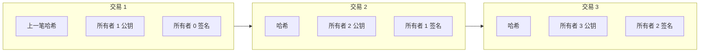
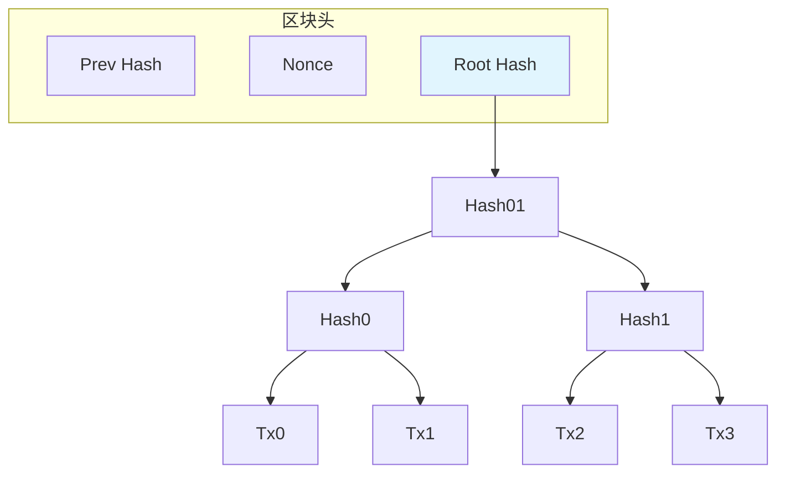

<!-- markdownlint-disable MD025 MD037 MD036 MD052 -->

# 比特币：一种点对点电子现金系统

**作者**：Satoshi Nakamoto  
**年份**：2008  
**来源**：bitcoin.org

---

## 摘要

纯点对点（peer-to-peer）版本的电子现金（electronic cash）将允许在线支付直接从一方发送到另一方，而无需经过金融机构。数字签名（digital signatures）提供了部分解决方案，但如果仍需要可信第三方（trusted third party）来防止双重支付（double-spending），则主要优势将丧失。我们提出了一种使用点对点网络解决双重支付问题的方案。该网络通过将交易哈希进一条基于哈希的工作量证明（proof-of-work）链来为交易加盖时间戳，形成一条除非重做工作量证明否则无法更改的记录。最长的链不仅作为所见证事件序列的证明，而且证明它来自最大的 CPU 算力池。只要诚实节点共同控制的 CPU 算力占多数，它们就会生成最长的链并超越攻击者。网络本身只需极简结构。消息以尽力而为（best effort）方式广播，节点可以随意离开和重新加入网络，接受最长的工作量证明链作为其离线期间所发生事件的证明。

---

## 1. 引言（Introduction）

互联网上的商业几乎完全依赖金融机构作为可信第三方来处理电子支付。虽然该系统对大多数交易足够有效，但仍存在基于信任模型的固有弱点。完全不可逆的交易实际上是不可能的，因为金融机构无法避免调解纠纷。调解成本增加了交易成本，限制了最小可行交易规模，并切断了小额零散交易的可能性，而且更广泛地丧失了为不可逆服务进行不可逆支付的能力。由于存在逆转的可能性，对信任的需求蔓延开来。商家必须对客户保持警惕，向他们索要比原本所需更多的信息。一定比例的欺诈被接受为不可避免。这些成本和支付不确定性在使用实物货币当面交易时可以避免，但没有任何机制可以在不依赖可信方的情况下通过通信渠道进行支付。

::: tip 核心需求
需要的是一种基于密码学证明（cryptographic proof）而非信任的电子支付系统，允许任何两个自愿方直接相互交易，而无需可信第三方。在计算上不可逆的交易将保护卖家免受欺诈，常规的托管机制可以轻松实现以保护买家。
:::

在本文中，我们提出了一种使用点对点分布式时间戳服务器（timestamp server）生成交易时间顺序计算证明的解决方案，以解决双重支付问题。只要诚实节点共同控制的 CPU 算力超过任何合作攻击者节点组，该系统就是安全的。

---

## 2. 交易（Transactions）

我们将电子硬币（electronic coin）定义为一串数字签名链。每个所有者通过数字签署上一笔交易的哈希和下一任所有者的公钥（public key），并将这些添加到硬币的末尾，从而将硬币转移给下一任所有者。收款人（payee）可以验证签名以验证所有权链。

当然，问题是收款人无法验证某位所有者是否双重支付了该硬币。常见的解决方案是引入可信的中央机构或铸币厂（mint），由它检查每笔交易是否存在双重支付。每笔交易后，硬币必须返回铸币厂以发行新硬币，只有直接从铸币厂发行的硬币才被信任为未被双重支付。该方案的问题在于，整个货币系统的命运取决于运营铸币厂的公司，每笔交易都必须经过它们，就像银行一样。

我们需要一种方式让收款人知道先前的所有者没有签署任何更早的交易。就我们的目的而言，最早的那笔交易才是有效的，因此我们不关心后来的双重支付尝试。确认某笔交易不存在的唯一方法是知晓所有交易。在基于铸币厂的模型中，铸币厂知晓所有交易并决定哪笔先到达。要在没有可信方的情况下实现这一点，交易必须公开宣布 [1]，我们需要一个系统让参与者就接收顺序的单一历史达成一致。收款人需要证明：在每笔交易发生时，多数节点同意它是首次被接收的。



**图 1**：电子硬币的所有权转移链——每笔交易包含上一笔的哈希、下一任所有者公钥和当前所有者的数字签名。

---

## 3. 时间戳服务器（Timestamp Server）

我们提出的解决方案从时间戳服务器开始。时间戳服务器的工作方式是：对要加盖时间戳的数据块取哈希并广泛发布该哈希，例如在报纸或 Usenet 帖子中 [2-5]。时间戳证明数据显然必须在该时间点存在才能进入哈希。每个时间戳在其哈希中包含前一个时间戳，形成一条链，每个额外的时间戳都强化了之前的那些。

```text
┌─────────────────────────────────────────────────────────────────┐
│  区块 1                    区块 2                    区块 3      │
│  ┌─────────────┐          ┌─────────────┐          ┌─────────┐  │
│  │ 项目 项目... │          │ 项目 项目... │          │ 项目... │  │
│  └──────┬──────┘          └──────┬──────┘          └────┬────┘  │
│         │ 哈希                   │ 哈希                  │ 哈希   │
│         ▼                        ▼                      ▼       │
│  ┌─────────────┐          ┌─────────────┐          ┌─────────┐  │
│  │    哈希     │ ────────►│    哈希     │ ────────►│  哈希   │  │
│  └─────────────┘          └─────────────┘          └─────────┘  │
└─────────────────────────────────────────────────────────────────┘
```

**图 2**：时间戳服务器——每个区块的哈希包含前一个区块的哈希，形成不可篡改的链。

---

## 4. 工作量证明（Proof-of-Work）

要在点对点基础上实现分布式时间戳服务器，我们需要使用类似于 Adam Back 的 Hashcash [6] 的工作量证明系统，而不是报纸或 Usenet 帖子。

工作量证明涉及扫描一个值，使得在哈希时（例如使用 SHA-256），哈希以若干零位开头。所需平均工作量与所需零位数量呈指数关系，可通过执行单次哈希来验证。

对于我们的时间戳网络，我们通过增加区块中的随机数（nonce）来实现工作量证明，直到找到一个使区块哈希满足所需零位数的值。一旦 CPU 已付出努力使其满足工作量证明，该区块就无法在不重做工作的情况下被更改。随着后续区块链接在它之后，更改该区块的工作将包括重做其后的所有区块。

工作量证明还解决了在多数决策中确定代表权的问题。如果多数基于「一 IP 一票」，则任何能够分配大量 IP 的人都可以颠覆它。工作量证明本质上是「一 CPU 一票」。多数决策由最长的链代表，该链投入了最大的工作量证明。如果诚实节点控制多数 CPU 算力，诚实链将增长最快并超越任何竞争链。要修改过去的区块，攻击者必须重做该区块及其后所有区块的工作量证明，然后赶上并超越诚实节点的工作。我们稍后将证明，随着后续区块的添加，较慢的攻击者赶上的概率呈指数下降。

为了补偿硬件速度的提高以及随时间变化的运行节点兴趣，工作量证明难度由以每小时平均区块数为目标的移动平均确定。如果生成过快，难度会增加。

```text
┌─────────────────────────────────────────────────────────────────┐
│  区块结构                                                         │
│  ┌─────────────────────────────────────────────────────────────┐ │
│  │ 前一哈希 (Prev Hash) | 随机数 (Nonce) | 交易 交易 交易...     │ │
│  └─────────────────────────────────────────────────────────────┘ │
│                              │                                    │
│                              ▼                                    │
│  ┌─────────────────────────────────────────────────────────────┐ │
│  │  区块哈希（需满足前导零位要求）                               │ │
│  └─────────────────────────────────────────────────────────────┘ │
└─────────────────────────────────────────────────────────────────┘
```

**图 3**：工作量证明——通过调整 nonce 使区块哈希满足难度要求。

---

## 5. 网络（Network）

运行网络的步骤如下：

1. 新交易向所有节点广播。
2. 每个节点将新交易收集到一个区块中。
3. 每个节点致力于为其区块找到困难的工作量证明。
4. 当节点找到工作量证明时，它向所有节点广播该区块。
5. 节点仅在区块中所有交易有效且未被花费时才接受该区块。
6. 节点通过使用已接受区块的哈希作为前一哈希，致力于创建链中的下一个区块，来表达对区块的接受。

节点始终将最长的链视为正确的链，并持续致力于扩展它。如果两个节点同时广播不同版本的下一个区块，某些节点可能先收到其中一个。在这种情况下，它们致力于先收到的那个，但保存另一个分支以防它变得更长。当找到下一个工作量证明且一个分支变得更长时，平局将被打破；当时致力于另一分支的节点将切换到较长的分支。

新交易广播不一定需要到达所有节点。只要到达许多节点，它们很快就会进入一个区块。区块广播也能容忍丢失的消息。如果节点未收到某个区块，它会在收到下一个区块并意识到漏掉一个时请求该区块。

| 步骤 | 操作 |
|------|------|
| 1 | 新交易广播给所有节点 |
| 2 | 节点收集交易到区块 |
| 3 | 节点寻找工作量证明 |
| 4 | 找到后广播区块 |
| 5 | 验证并接受有效区块 |
| 6 | 以该区块哈希为前一哈希继续挖矿 |

---

## 6. 激励（Incentive）

按照惯例，区块中的第一笔交易是一笔特殊的交易，它创建区块创建者拥有的新硬币。这为节点支持网络提供了激励，并提供了将硬币最初投入流通的方式，因为没有中央机构来发行它们。

恒定数量的新硬币的稳定增加类似于金矿工消耗资源将黄金加入流通。在我们的情况下，消耗的是 CPU 时间和电力。

激励也可以通过交易费（transaction fees）来资助。如果交易的输出值小于其输入值，差额就是交易费，会加入包含该交易的区块的激励值。一旦预定数量的硬币进入流通，激励可以完全过渡到交易费，实现完全无通胀。

激励可能有助于鼓励节点保持诚实。如果贪婪的攻击者能够组装比所有诚实节点更多的 CPU 算力，他必须在用它通过收回支付来欺诈他人，还是用它来生成新硬币之间做出选择。他应该发现按规则行事更有利可图——这些规则使他获得比其他人加起来更多的新硬币——而不是破坏系统和自己财富的有效性。

---

## 7. 回收磁盘空间（Reclaiming Disk Space）

一旦硬币中的最新交易被足够多的区块掩埋，其之前的已花费交易可以被丢弃以节省磁盘空间。为了在不破坏区块哈希的情况下实现这一点，交易在默克尔树（Merkle Tree）[7][2][5] 中哈希，只有根（root）包含在区块的哈希中。然后可以通过截断树的分支来压缩旧区块。内部哈希不需要存储。

不包含交易的区块头（block header）约为 80 字节。如果我们假设每 10 分钟生成一个区块，80 字节 × 6 × 24 × 365 = 每年 4.2MB。截至 2008 年，计算机系统通常配备 2GB RAM 销售，摩尔定律预测当前每年增长 1.2GB，即使必须将区块头保存在内存中，存储也不应成为问题。



**图 4**：默克尔树——交易哈希后仅根哈希存入区块头，剪枝后内部哈希可丢弃。

---

## 8. 简化支付验证（Simplified Payment Verification）

可以在不运行完整网络节点的情况下验证支付。用户只需保留最长工作量证明链的区块头副本（可通过查询网络节点直到确信拥有最长链获得），并获取将交易链接到其加盖时间戳所在区块的默克尔分支（Merkle branch）。他无法自行检查交易，但通过将其链接到链中的某个位置，他可以确认网络节点已接受它，其后的区块进一步确认网络已接受它。

因此，只要诚实节点控制网络，验证就是可靠的，但如果网络被攻击者压制，则更容易受到攻击。虽然网络节点可以自行验证交易，但只要攻击者能够持续压制网络，简化方法就可能被攻击者伪造的交易欺骗。一种防护策略是接受网络节点在检测到无效区块时发出的警报，提示用户软件下载完整区块和警报交易以确认不一致。经常接收支付的商家可能仍希望运行自己的节点以获得更独立的安全性和更快的验证。

```text
┌─────────────────────────────────────────────────────────────────────────┐
│  简化支付验证：验证 Tx3 是否在最长链中                                    │
│                                                                          │
│  区块头 1 ──► 区块头 2 ──► 区块头 3 ──► 区块头 4 ──► ... (最长链)        │
│                    │                                                      │
│                    │  Merkle 分支                                         │
│                    ▼                                                      │
│              ┌─────────┐                                                  │
│              │  Tx3    │  ◄── 只需验证该交易在默克尔树中的路径             │
│              └─────────┘                                                  │
└─────────────────────────────────────────────────────────────────────────┘
```

**图 5**：简化支付验证——通过默克尔分支将交易链接到区块，无需下载完整区块链。

---

## 9. 合并与分割价值（Combining and Splitting Value）

虽然可以单独处理每枚硬币，但为转账中的每一分钱单独做一笔交易会很笨拙。为了允许价值的分割和合并，交易包含多个输入（inputs）和输出（outputs）。通常要么有来自较大先前交易的单一输入，要么有合并较小金额的多个输入，最多有两个输出：一个用于支付，一个将找零（如有）退回发送者。

应当注意的是，扇出（fan-out）——即一笔交易依赖多笔交易，而这些交易又依赖更多交易——在这里不是问题。永远不需要提取交易历史的完整独立副本。

---

## 10. 隐私（Privacy）

传统银行模型通过将信息访问限制在相关方和可信第三方来实现一定程度的隐私。公开宣布所有交易的必要性排除了这种方法，但隐私仍可以通过在另一处打破信息流来维持：保持公钥匿名。公众可以看到某人正在向另一个人发送一定金额，但没有将交易与任何人关联的信息。这类似于证券交易所发布的信息级别，其中单笔交易的时间和规模（「行情带」）公开，但不透露交易方是谁。

作为额外的防火墙，每笔交易应使用新的密钥对，以防止它们被关联到同一所有者。多输入交易仍不可避免地存在一些关联，因为它们必然揭示其输入属于同一所有者。风险在于，如果某把密钥的所有者被揭示，关联可能揭示属于同一所有者的其他交易。

```text
┌─────────────────────────────────────────────────────────────────────────┐
│  传统隐私模型                    新隐私模型                               │
│                                                                          │
│  身份 ◄──► 交易 ◄──► 可信第三方    身份匿名                                │
│       ◄──► 交易对手              交易公开（金额、时间）                     │
│                                公钥不关联身份                             │
└─────────────────────────────────────────────────────────────────────────┘
```

**图 6**：隐私模型对比——新模型通过公钥匿名实现隐私。

---

## 11. 计算（Calculations）

我们考虑攻击者试图生成比诚实链更快的替代链的场景。即使做到这一点，也不会使系统对任意更改敞开大门，例如凭空创造价值或拿走从未属于攻击者的钱。节点不会接受无效交易作为支付，诚实节点永远不会接受包含它们的区块。攻击者只能尝试更改自己的某笔交易以收回他最近花费的钱。

诚实链与攻击者链之间的竞赛可以描述为二项随机游走（Binomial Random Walk）。成功事件是诚实链延长一个区块，将其领先优势增加 +1；失败事件是攻击者的链延长一个区块，将差距减少 -1。

攻击者从给定赤字赶上的概率类似于赌徒破产问题（Gambler's Ruin problem）。假设一个拥有无限信用的赌徒从赤字开始，进行可能无限次的试验以试图达到收支平衡。我们可以计算他最终达到收支平衡的概率，即攻击者最终赶上诚实链的概率，如下 [8]：

$$
p = \text{诚实节点找到下一区块的概率}
$$
$$
q = \text{攻击者找到下一区块的概率}
$$
$$
q_z = \text{攻击者从落后 } z \text{ 个区块最终赶上的概率}
$$

$$
q_z = \begin{cases}
1 & \text{if } p \leq q \\
(q/p)^z & \text{if } p > q
\end{cases}
$$

在我们假设 $p > q$ 的情况下，随着攻击者必须赶上的区块数量增加，概率呈指数下降。面对不利的赔率，如果他早期没有幸运地大幅领先，随着他进一步落后，他的机会将变得微乎其微。

我们现在考虑新交易的接收者需要等待多长时间才能足够确定发送者无法更改交易。我们假设发送者是攻击者，想让接收者相信他付了款一段时间，然后在一段时间后将其改为付回给自己。当这种情况发生时接收者会收到警报，但发送者希望为时已晚。

接收者在签署前不久生成新的密钥对并将公钥交给发送者。这可以防止发送者提前准备一条区块链，持续工作直到他幸运地足够领先，然后在那时执行交易。一旦交易发送，不诚实的发送者开始在包含其交易替代版本的并行链上秘密工作。

接收者等待直到交易已被添加到区块并且有 $z$ 个区块链接在它之后。他不知道攻击者的确切进展，但假设诚实区块按每区块平均预期时间完成，攻击者的潜在进展将是期望值为 $\lambda = z \frac{q}{p}$ 的泊松分布（Poisson distribution）。

要得到攻击者现在仍能赶上的概率，我们将他可能取得的每种进展量的泊松密度乘以他从该点赶上的概率：

$$
\sum_{k=0}^{\infty} \frac{\lambda^k e^{-\lambda}}{k!} \cdot \begin{cases}
(q/p)^{(z-k)} & \text{if } k \leq z \\
1 & \text{if } k > z
\end{cases}
$$

重新排列以避免对分布的无穷尾部求和……

$$
1 - \sum_{k=0}^{z} \frac{\lambda^k e^{-\lambda}}{k!} \left(1 - (q/p)^{(z-k)}\right)
$$

转换为 C 代码：

```c
#include <math.h>
double AttackerSuccessProbability(double q, int z)
{
    double p = 1.0 - q;
    double lambda = z * (q / p);
    double sum = 1.0;
    int i, k;
    for (k = 0; k <= z; k++)
    {
        double poisson = exp(-lambda);
        for (i = 1; i <= k; i++)
            poisson *= lambda / i;
        sum -= poisson * (1 - pow(q / p, z - k));
    }
    return sum;
}
```

运行一些结果，我们可以看到概率随 $z$ 呈指数下降：

| q=0.1 | P | q=0.3 | P |
|-------|---|-------|---|
| z=0 | 1.0000000 | z=0 | 1.0000000 |
| z=1 | 0.2045873 | z=5 | 0.1773523 |
| z=2 | 0.0509779 | z=10 | 0.0416605 |
| z=3 | 0.0131722 | z=15 | 0.0101008 |
| z=4 | 0.0034552 | z=20 | 0.0024804 |
| z=5 | 0.0009137 | z=25 | 0.0006132 |
| z=6 | 0.0002428 | z=30 | 0.0001522 |
| z=7 | 0.0000647 | z=35 | 0.0000379 |
| z=8 | 0.0000173 | z=40 | 0.0000095 |
| z=9 | 0.0000046 | z=45 | 0.0000024 |
| z=10 | 0.0000012 | z=50 | 0.0000006 |

求解 P < 0.1%：

| q | z |
|---|---|
| 0.10 | 5 |
| 0.15 | 8 |
| 0.20 | 11 |
| 0.25 | 15 |
| 0.30 | 24 |
| 0.35 | 41 |
| 0.40 | 89 |
| 0.45 | 340 |

---

## 12. 结论（Conclusion）

我们提出了一种不依赖信任的电子交易系统。我们从由数字签名组成的硬币的通常框架开始，它提供了对所有权的强控制，但没有防止双重支付的方法则是不完整的。为了解决这个问题，我们提出了一个使用工作量证明记录交易公共历史的点对点网络，如果诚实节点控制多数 CPU 算力，该历史将迅速变得在计算上不可行地被攻击者更改。网络在其非结构化的简单性中具有鲁棒性。节点同时工作，几乎不需要协调。它们不需要被识别，因为消息不需要路由到任何特定位置，只需尽力而为地传递。节点可以随意离开和重新加入网络，接受工作量证明链作为其离线期间所发生事件的证明。它们用 CPU 算力投票，通过致力于扩展有效区块来表达对它们的接受，并通过拒绝致力于无效区块来拒绝它们。任何需要的规则和激励都可以通过这种共识机制（consensus mechanism）来执行。

---

## 参考文献（References）

| # | 文献 |
|---|------|
| [1] | W. Dai, "b-money," <http://www.weidai.com/bmoney.txt>, 1998. |
| [2] | H. Massias, X.S. Avila, and J.-J. Quisquater, "Design of a secure timestamping service with minimal trust requirements," In 20th Symposium on Information Theory in the Benelux, May 1999. |
| [3] | S. Haber, W.S. Stornetta, "How to time-stamp a digital document," In Journal of Cryptology, vol 3, no 2, pages 99-111, 1991. |
| [4] | D. Bayer, S. Haber, W.S. Stornetta, "Improving the efficiency and reliability of digital time-stamping," In Sequences II: Methods in Communication, Security and Computer Science, pages 329-334, 1993. |
| [5] | S. Haber, W.S. Stornetta, "Secure names for bit-strings," In Proceedings of the 4th ACM Conference on Computer and Communications Security, pages 28-35, April 1997. |
| [6] | A. Back, "Hashcash - a denial of service counter-measure," <http://www.hashcash.org/papers/hashcash.pdf>, 2002. |
| [7] | R.C. Merkle, "Protocols for public key cryptosystems," In Proc. 1980 Symposium on Security and Privacy, IEEE Computer Society, pages 122-133, April 1980. |
| [8] | W. Feller, "An introduction to probability theory and its applications," 1957. |

---

[← 上一篇：SUNDR](sundr.md) | [返回目录](index.md) | [下一篇：PBFT →](pbft.md)
