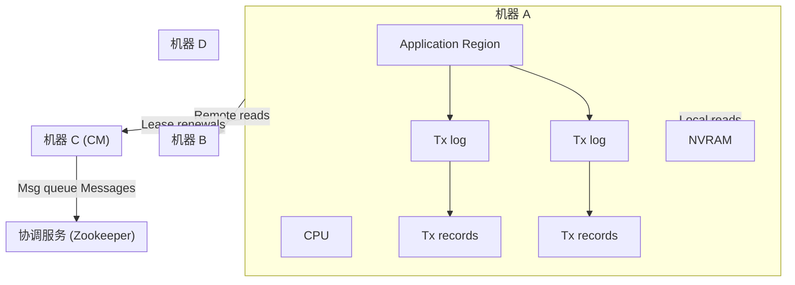
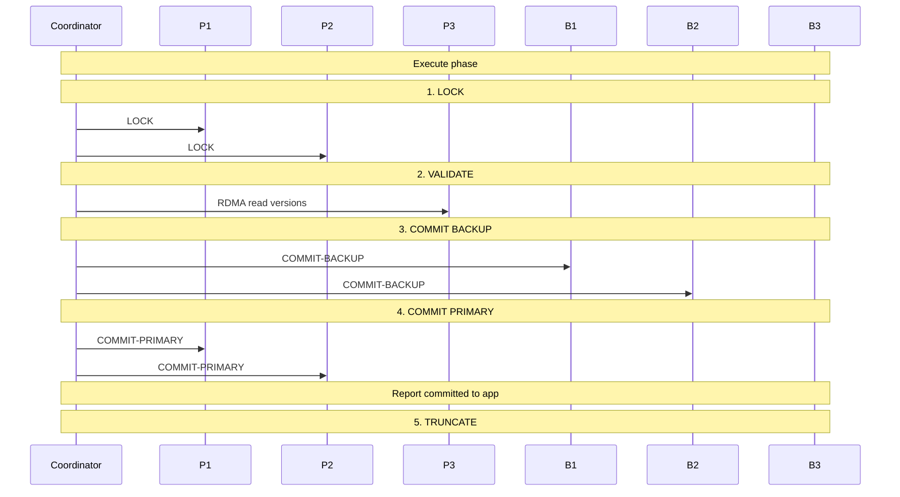
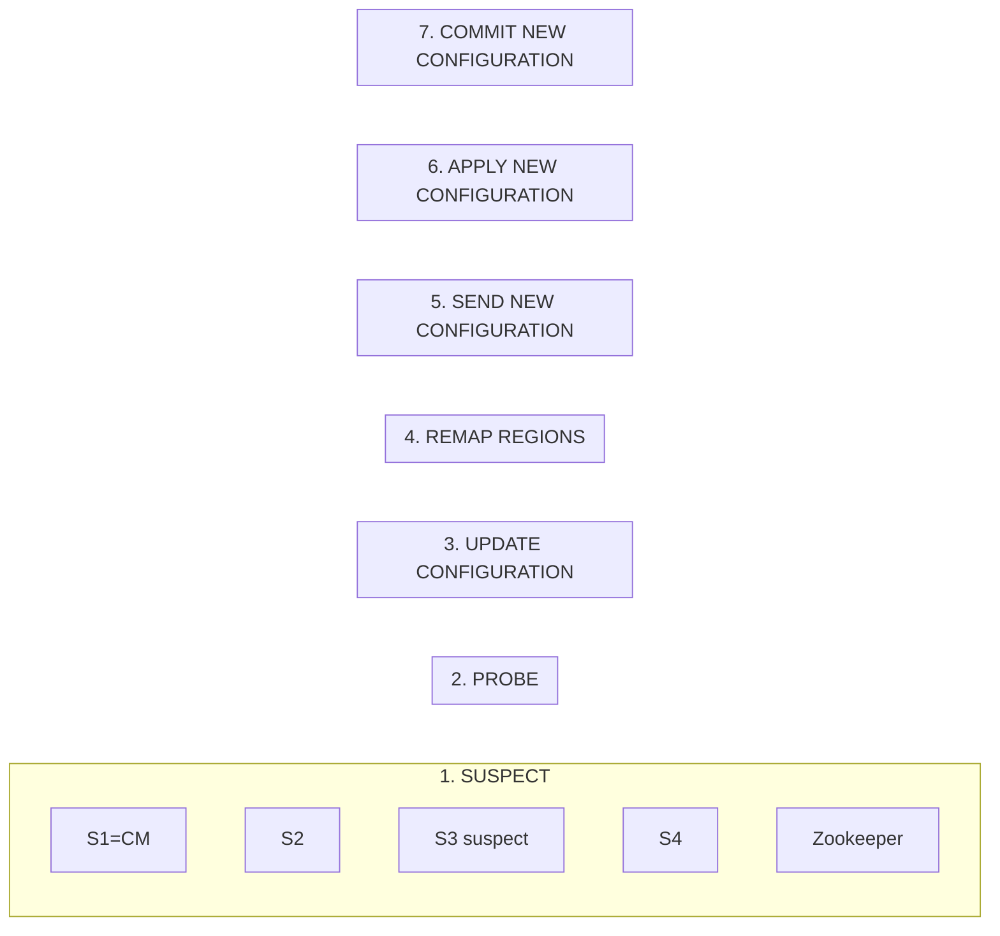
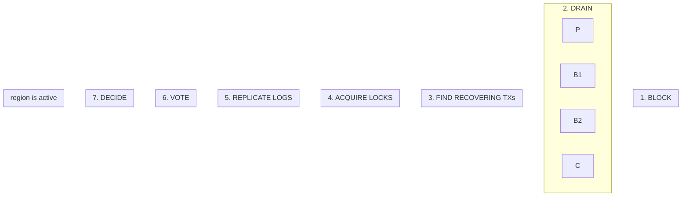

<!-- markdownlint-disable MD025 MD037 MD036 MD040 MD029 -->

# FaRM：无妥协的分布式事务

**作者**：Aleksandar Dragojević, Dushyanth Narayanan, Edmund B. Nightingale, Matthew Renzelmann, Alex Shamis, Anirudh Badam, Miguel Castro  
**机构**：Microsoft Research（微软研究院）  
**年份**：2015  
**来源**：SOSP (Symposium on Operating Systems Principles)

---

## 摘要

具有强一致性和高可用性的事务可简化分布式系统的构建与推理。然而，此前的实现性能较差，迫使系统设计者要么完全避免事务，要么削弱一致性保证，要么仅提供单机事务并要求程序员自行分区数据。本文表明，在现代数据中心中无需妥协。我们展示了一个名为 **FaRM**（Fast Remote Memory）的主存分布式计算平台，能够提供具有严格可串行化（strict serializability）、高性能、持久性和高可用性的分布式事务。FaRM 在 90 台机器上、4.9 TB 数据库上实现了 1.4 亿次 TATP 事务/秒的峰值吞吐量，并在 50 ms 内从故障中恢复。实现这些结果的关键在于，从第一性原理出发设计新的事务、复制与恢复协议，以充分利用支持 **RDMA**（Remote Direct Memory Access，远程直接内存访问）的商用网络，以及一种新的、低成本的非易失性 DRAM 方案。

---

## 1 引言

具有高可用性和严格可串行化（strict serializability）[35] 的事务通过提供一种简单而强大的抽象来简化分布式系统的编程与推理：一台永不故障的机器，按与真实时间一致顺序一次执行一个事务。然而，此前在分布式系统中实现该抽象的努力均导致性能不佳。因此，Dynamo [13]、Memcached [1] 等系统通过不支持事务或实现弱一致性保证来提升性能。其他系统（如 [3–6, 9, 28]）仅在数据全部位于单机时提供事务，迫使程序员分区数据并增加正确性推理的复杂度。

本文证明，现代数据中心中的新软件可以消除妥协的必要性。它描述了 FaRM [16] 中的事务、复制与恢复协议——一个主存分布式计算平台。FaRM 提供具有严格可串行化、高可用性、高吞吐量和低延迟的分布式 **ACID** 事务。这些协议从第一性原理设计，以利用数据中心中出现的两大硬件趋势：支持 RDMA 的快速商用网络，以及一种低成本的非易失性 DRAM 方案。非易失性通过在电源单元上附加电池实现，并在断电时将 DRAM 内容写入 SSD。这些趋势消除了存储与网络瓶颈，但也暴露出限制其性能收益的 CPU 瓶颈。FaRM 的协议遵循三项原则来应对这些 CPU 瓶颈：减少消息数量、使用单向 RDMA 读写替代消息、有效利用并行性。

FaRM 通过将对象分布到数据中心的各台机器上来实现横向扩展，同时允许事务跨越任意数量的机器。FaRM 不使用 Paxos（如 [11]）复制协调者和数据分区，而是通过采用 **Vertical Paxos** [25] 的主备复制和与主备直接通信的未复制协调者来减少消息数量。FaRM 使用乐观并发控制（optimistic concurrency control）和四阶段提交协议（加锁、验证、提交备机、提交主机）[16]，但我们改进了原始协议，消除了加锁阶段对备机的消息。

FaRM 通过使用单向 RDMA 操作进一步降低 CPU 开销。单向 RDMA 不使用远程 CPU，并避免大部分本地 CPU 开销。FaRM 事务在执行和验证阶段使用单向 RDMA 读。因此，远程只读参与者不使用 CPU。此外，协调者使用单向 RDMA 将记录写入事务修改对象副本的非易失性预写日志（write-ahead log）。例如，协调者使用单次单向 RDMA 将提交记录写入远程备机。因此，事务在备机上不使用前台 CPU。CPU 在后台延迟截断日志以就地更新对象时才会被使用。

使用单向 RDMA 需要新的故障恢复协议。例如，FaRM 无法依赖服务器在租约（lease）[18] 过期时拒绝传入请求，因为请求由 NIC 处理，而 NIC 不支持租约。我们通过使用精确成员关系（precise membership）[10] 来解决此问题，确保机器对当前配置成员关系达成一致，并仅向配置成员发送单向操作。FaRM 也无法依赖传统机制在准备阶段确保参与者具备提交事务所需的资源，因为事务记录是在不涉及远程 CPU 的情况下写入参与者日志的。相反，FaRM 使用预留（reservation）来确保在开始提交之前，日志中有足够空间容纳提交和截断事务所需的所有记录。

FaRM 的故障恢复协议之所以快速，是因为它有效利用了并行性。它将每一比特状态的恢复均匀分布到集群中，并在每台机器的各核心间并行化恢复。此外，它使用两项优化使事务执行可与恢复并行进行。首先，事务在仅需数十毫秒完成的加锁恢复阶段之后即可开始访问受故障影响的数据，而不必等待数秒完成其余恢复。其次，不受故障影响的事务可继续执行而不被阻塞。FaRM 还通过利用快速网络交换频繁心跳实现快速故障检测，并使用优先级和预分配来避免误报。

::: tip 核心结论
实验结果表明，可以同时获得一致性、高可用性和高性能。FaRM 在 50 ms 内从单机故障中恢复，且仅用几台机器即可超越最先进的单机内存事务系统。
:::

---

## 2 硬件趋势

FaRM 的设计受到数据中心机器中丰富、廉价 DRAM 的驱动。典型数据中心配置为每台 2 路机器配备 128–512 GB DRAM [29]，DRAM 成本低于 12 美元/GB^1^。这意味着 1 PB DRAM 仅需 2000 台机器，足以容纳许多有趣应用的数据集。此外，FaRM 利用两大硬件趋势消除存储与网络瓶颈：非易失性 DRAM，以及支持 RDMA 的快速商用网络。

^1^ 2015 年 3 月 21 日 newegg.com 上的 16 GB DDR4 DIMM 价格。

### 2.1 非易失性 DRAM

「分布式不间断电源（UPS）」利用锂离子电池的广泛可用性，相比使用铅酸电池的传统集中式方案，可降低数据中心 UPS 成本。例如，微软的 Open CloudServer（OCS）规范包含本地储能（LES）[30, 36]，将锂离子电池与机架内每个 24 机箱中的电源单元集成。估计 LES UPS 成本低于每焦耳 0.005 美元^2^。该方法比传统 UPS 更可靠：锂离子电池采用多个独立电池单元超额配置，任何电池故障仅影响机架的一部分。

^2^ 锂离子比传统铅酸 UPS 便宜 5 倍，后者在 25 MW 数据中心成本为 3100 万美元。25 MW 数据中心可容纳 10 万台机器，因此每台机器的锂离子 UPS 成本为 62 美元。24 机箱有 6 个 PSU，每个 LES 至少为 1600 W 提供 5 秒、1425 W 再提供 30 秒，即每 PSU 50 kJ 或每机 12.5 kJ，每焦耳成本约 0.0048 美元。

分布式 UPS 有效使 DRAM 持久化。断电时，分布式 UPS 使用电池能量将内存内容保存到商用 SSD。这不仅通过避免对 SSD 的同步写入改善了常见情况下的性能，还通过仅在故障时写入 SSD 延长了 SSD 寿命。另一种方案是使用非易失性 DIMM（NVDIMM），其包含自有私有闪存、控制器和超级电容（如 [2]）。遗憾的是，这些设备专用、昂贵且笨重。相比之下，分布式 UPS 使用商用 DIMM 并利用商用 SSD，唯一额外成本是 SSD 上的预留容量和 UPS 电池本身。

电池配置成本取决于将内存保存到 SSD 所需的能量。我们在标准 2 路机器上测量了未优化原型。故障时，它关闭 HDD 和 NIC，并将内存数据保存到单个 M.2（PCIe）SSD，每 GB 消耗 110 焦耳。约 90 焦耳用于保存期间为机器上的两个 CPU 插槽供电。增加 SSD 可缩短保存时间从而减少能耗（图 1）。将 CPU 置于低功耗状态等优化将进一步降低能耗。

在最坏配置下（单 SSD、无优化），按每焦耳 0.005 美元计算，非易失性的能量成本为 0.55 美元/GB，预留 SSD 容量的存储成本为 0.90 美元/GB^3^。综合额外成本低于基础 DRAM 成本的 15%，相比成本为 DRAM 3–5 倍的 NVDIMM 有显著改进。因此，将所有机器内存视为非易失性 RAM（NVRAM）是可行且经济的。FaRM 将所有数据存储在内存中，并在写入多个副本的 NVRAM 后视为持久化。

^3^ 2015 年 3 月 25 日 newegg.com 上的三星 M.2 256 GB MLC。

```text
1 SSD    2 SSDs   3 SSDs   4 SSDs
0
20
40
60
80
100
120
Energy required (J/GB)
```

*图 1. 将 1 GB 从 DRAM 复制到 SSD 所需能量*

### 2.2 RDMA 网络

FaRM 在可能时使用单向 RDMA 操作，因为它们不使用远程 CPU。我们基于先前工作和额外测量做出此决策。在 [16] 中，我们在 20 机 RoCE [22] 集群上表明，当所有机器从集群中其他机器随机读取小对象时，RDMA 读比基于 RDMA 的可靠 RPC 性能好 2 倍。瓶颈是 NIC 消息速率，我们的 RPC 实现所需消息数是单向读的两倍。我们在 90 机集群上复现了该实验，每台机器配备两个 Infiniband FDR（56 Gbps）NIC。与 [16] 相比，这使每台机器的消息速率提高了一倍以上，并消除了 NIC 消息速率瓶颈。RDMA 和 RPC 现在均受 CPU 限制，性能差距扩大到 4 倍，如图 2 所示。

::: tip RDMA 与 RPC
在 90 机集群上，RDMA 读比 RPC 性能好 4 倍，瓶颈从 NIC 消息速率转为 CPU。降低 CPU 开销是实现新硬件潜力的关键。
:::

```text
8    16    32    64    128   256   512   1024  2048
Transfer size (bytes)
0
5
10
15
20
Operations / μs / machine
RDMA
RPC
```

*图 2. 每机 RDMA 与 RPC 读性能*

---

## 3 编程模型与架构

FaRM 为应用提供跨越集群中机器的全局地址空间抽象。每台机器运行应用线程并在地址空间中存储对象。FaRM API [16] 在事务内提供对本地和远程对象的透明访问。应用线程可随时启动事务并成为该事务的协调者。在事务执行期间，线程可执行任意逻辑，以及读、写、分配和释放对象。执行结束时，线程调用 FaRM 提交事务。

FaRM 事务使用乐观并发控制。更新在执行期间在本地缓冲，仅在成功提交时对其他事务可见。提交可能因与并发事务冲突或故障而失败。FaRM 提供所有成功提交事务的严格可串行化。在事务执行期间，FaRM 保证单对象读是原子的、仅读已提交数据、对同一对象的连续读返回相同数据、对事务写入对象的读返回最新写入值。它不保证跨不同对象读的原子性，但在这种情况下保证事务不会提交，从而确保已提交事务严格可串行化。这使我们可将一致性检查推迟到提交时，而不是在每次对象读时重新检查。::: warning 编程模型注意
FaRM 不保证跨不同对象读的原子性，应用必须处理执行期间的临时不一致 [20]。可以自动处理这些不一致 [12]。
:::

FaRM API 还提供无锁读（lock-free reads，针对单对象只读事务的优化）和局部性提示（locality hints，使程序员能将相关对象放在同一组机器上）。应用可使用这些来提升性能，如 [16] 所述。



*图 3. FaRM 架构*

图 3 展示了包含四台机器的 FaRM 实例，以及机器 A 的内部组件。每台机器在用户进程中运行 FaRM，每个硬件线程固定一个内核线程。每个内核线程运行事件循环，执行应用代码并轮询 RDMA 完成队列。

FaRM 实例随时间在配置序列中移动，因机器故障或新机器加入。配置是元组 〈i, S, F, CM〉，其中 i 是唯一、单调递增的 64 位配置标识符，S 是配置中的机器集合，F 是从机器到预期独立故障的故障域（如不同机架）的映射，CM ∈ S 是配置管理器（Configuration Manager）。FaRM 使用 Zookeeper [21] 协调服务确保机器对当前配置达成一致并存储它，如 Vertical Paxos [25]。但它不依赖 Zookeeper 管理租约、检测故障或协调恢复（通常做法）。CM 使用利用 RDMA 实现快速恢复的高效实现完成这些。Zookeeper 在每次配置变更时由 CM 调用一次以更新配置。

FaRM 中的全局地址空间由 2 GB 区域组成，每个区域在一个主副本和 f 个备副本上复制，f 为期望的容错度。每台机器在可由其他机器通过 RDMA 读取的非易失性 DRAM 中存储多个区域。对象始终从包含区域的主副本读取，若区域在本地机器则使用本地内存访问，若远程则使用单向 RDMA 读。每个对象有用于并发控制和复制的 64 位版本。区域标识符到其主备的映射由 CM 维护并与区域一起复制。这些映射由其他机器按需获取，并由线程与发出单向 RDMA 读到主副本所需的 RDMA 引用一起缓存。

机器联系 CM 分配新区域。CM 从单调递增计数器分配区域标识符，并为区域选择副本。副本选择在满足容量充足、每个副本在不同故障域、以及应用指定局部性约束时与目标区域共置的约束下，平衡每台机器上存储的区域数量。然后向所选副本发送包含区域标识符的 prepare 消息。若所有副本报告成功分配区域，CM 向它们发送 commit 消息。该两阶段协议确保映射在投入使用前有效并在所有区域副本处复制。

相比我们此前基于一致性哈希 [16] 的方法，这种集中式方法在满足故障独立性和局部性约束方面提供更大灵活性。它也使跨机器平衡负载和接近容量运行更容易。对于 2 GB 区域，我们预期典型机器上最多 250 个区域，因此单个 CM 可处理数千台机器的区域分配。

每台机器还存储实现 FIFO 队列的环形缓冲区 [16]。它们用作事务日志或消息队列。每对发送者-接收者有各自的日志和消息队列，物理上位于接收者。发送者使用单向 RDMA 写向其尾部追加记录。这些写由 NIC 确认，不涉及接收者 CPU。接收者定期轮询日志头部以处理记录。它在截断日志时延迟通知发送者，允许发送者重用环形缓冲区中的空间。

---

## 4 分布式事务与复制

FaRM 将事务与复制协议集成以提升性能。它使用比传统协议更少的消息，并利用单向 RDMA 读写实现 CPU 效率和低延迟。FaRM 在非易失性 DRAM 中对数据和事务日志使用主备复制，并使用与主备直接通信的未复制事务协调者。它使用带读验证的乐观并发控制，如某些软件事务内存系统（如 TL2 [15]）。



*图 4. FaRM 提交协议：协调者 C，主副本在 P1、P2、P3，备副本在 B1、B2、B3。P1 和 P2 被读写，P3 仅被读。虚线表示 RDMA 读，实线表示 RDMA 写，点线表示硬件确认，矩形表示对象数据。*

图 4 展示了 FaRM 事务的时间线，表 1 和表 2 列出了事务协议中使用的所有日志记录和消息类型。在执行阶段，事务使用单向 RDMA 读取对象并在本地缓冲写。协调者还记录所有访问对象的地址和版本。对于与协调者同机的主备，对象读和写日志使用本地内存访问而非 RDMA。执行结束时，FaRM 尝试通过执行以下步骤提交事务：

1. **加锁（Lock）**。协调者向作为任意被写对象主副本的每台机器的日志写入 LOCK 记录。该记录包含该主副本上所有被写对象的版本和新值，以及所有含被写对象的区域列表。主副本通过尝试使用比较并交换（compare-and-swap）在指定版本加锁对象来处理这些记录，并发送消息报告是否成功获取所有锁。若任何对象版本自事务读取后已更改，或对象正被另一事务锁定，加锁可能失败。此时协调者中止事务，向所有主副本写入中止记录并向应用返回错误。

2. **验证（Validate）**。协调者通过从主副本读取事务读取但未写入的所有对象的版本来执行读验证。若任何对象已更改，验证失败，事务被中止。验证默认使用单向 RDMA 读。对于持有超过 tr 个对象的主副本，验证通过 RPC 完成。阈值 tr（当前为 4）反映 RPC 相对于 RDMA 读的 CPU 成本。

3. **提交备机（Commit backups）**。协调者向每个备机的非易失性日志写入 COMMIT-BACKUP 记录，然后等待 NIC 硬件的确认，不中断备机 CPU。COMMIT-BACKUP 日志记录与 LOCK 记录具有相同负载。

4. **提交主机（Commit primaries）**。在所有 COMMIT-BACKUP 写被确认后，协调者向每个主副本的日志写入 COMMIT-PRIMARY 记录。它在收到至少一个此类记录的硬件确认时（或若本地写入一个）向应用报告完成。主副本通过就地更新对象、递增版本并解锁来处理这些记录，从而暴露事务提交的写。

5. **截断（Truncate）**。备机和主机保留日志中的记录直到被截断。协调者在收到所有主副本的确认后延迟截断主备的日志。它通过在其他日志记录中附带被截断事务的标识符来实现。备机在截断时将更新应用到其对象副本。

| 日志记录类型 | 内容 |
|-------------|------|
| LOCK | 事务 ID、事务写入对象所在的所有区域 ID、目标为主副本的事务写入的所有对象的地址、版本和值 |
| COMMIT-BACKUP | 与 LOCK 记录相同 |
| COMMIT-PRIMARY | 要提交的事务 ID |
| ABORT | 要中止的事务 ID |
| TRUNCATE | 未截断事务的低界事务 ID 及要截断的事务 ID |

*表 1. 事务协议中使用的日志记录类型。未截断事务标识符的低界和截断的事务标识符附带在每个记录上。*

| 消息类型 | 内容 |
|---------|------|
| LOCK-REPLY | 事务 ID、表示加锁是否成功的结果 |
| VALIDATE | 从目标读取的对象的地址和版本（通过 RDMA 读验证时不发送） |
| NEED-RECOVERY | 配置 ID、区域 ID、要恢复的事务 ID（备机发给主机） |
| FETCH-TX-STATE | 配置 ID、区域 ID、请求其状态的事务 ID（主机发给备机） |
| SEND-TX-STATE | 配置 ID、区域 ID、事务 ID、fetch 请求的事务的 LOCK 记录内容 |
| REPLICATE-TX-STATE | 配置 ID、区域 ID、事务 ID、LOCK 记录内容（主机发给备机） |
| RECOVERY-VOTE | 配置 ID、区域 ID、事务 ID、事务修改的区域 ID 列表、投票 |
| REQUEST-VOTE | 配置 ID、事务 ID、区域 ID |
| COMMIT-RECOVERY | 配置 ID、事务 ID |
| ABORT-RECOVERY | 配置 ID、事务 ID |
| TRUNCATE-RECOVERY | 配置 ID、事务 ID |

*表 2. 事务协议中使用的消息类型。除前两种外，其余仅用于恢复。*

**正确性**。已提交的读写事务在获取所有写锁的时刻可串行化，已提交的只读事务在其最后一次读的时刻可串行化。这是因为在可串行化点所有读写对象的版本与执行期间看到的版本相同。加锁对写入对象保证这一点，验证对仅读对象保证这一点。在无故障情况下，这等价于在可串行化点原子地执行并提交整个事务。FaRM 中的可串行化也是严格的：可串行化点始终在执行开始与向应用报告完成之间。

为确保跨故障的可串行化，必须在写入 COMMIT-PRIMARY 之前等待所有备机的硬件确认。假设协调者未收到某备机 b 对某区域 r 的确认。则主副本可能暴露事务修改，随后与协调者和 r 的其他副本一起故障，而 b 从未收到 COMMIT-BACKUP 记录。这将导致 r 的更新丢失。

由于读集仅存储在协调者处，若协调者故障且无提交记录证明验证成功，事务将被中止。因此，协调者必须在向应用报告成功提交之前等待至少一个主副本的成功提交。这确保对向应用报告已提交的事务，至少一个提交记录在任意 f 次故障后仍存在。否则，若协调者和所有备机在任何 COMMIT-PRIMARY 记录写入前故障，此类事务仍可能中止，因为仅 LOCK 记录会存在，且无记录证明验证已成功。

在传统两阶段提交协议中，参与者可在处理 prepare 消息时预留资源以提交事务，或在资源不足时拒绝准备事务。然而，由于我们的协议避免在提交期间涉及备机 CPU，协调者必须在所有参与者处预留日志空间以保证进展。协调者在开始提交协议之前，为主备日志中的所有提交协议记录（包括截断记录）预留空间。日志预留是协调者处的本地操作，因为协调者向其在每个参与者处拥有的日志写入记录。预留会在写入相应记录时释放。若截断附带在另一消息上，截断记录预留也会释放。若日志已满，协调者使用预留写入显式截断记录以释放日志空间。这很少发生，但为确保活性所必需。

**性能**。对于我们的目标硬件，该协议相比传统分布式提交协议具有若干优势。考虑带复制的两阶段提交协议，如 Spanner 的 [11]。Spanner 使用 Paxos [24] 复制事务协调者及其参与者（存储事务读写数据的机器）。每个 Paxos 状态机在传统两阶段提交协议 [19] 中扮演单台机器的角色。这需要 2f + 1 个副本以容忍 f 次故障，且由于每个状态机操作至少需要 2f + 1 次往返消息，需要 4P(2f + 1) 条消息（P 为事务中的参与者数量）。

FaRM 使用主备复制而非 Paxos 状态机复制。这将数据副本数减少到 f + 1，并减少事务期间传输的消息数。协调者状态不复制，协调者直接与主备通信，进一步降低延迟和消息数。FaRM 因复制产生的开销最小：对拥有任意被写对象备副本的每台远程机器单次 RDMA 写。只读参与者的备机完全不参与协议。此外，通过 RDMA 的读验证确保只读参与者的主副本不做 CPU 工作，使用单向 RDMA 写写入 COMMIT-PRIMARY 和 COMMIT-BACKUP 记录减少了等待远程 CPU，并允许远程 CPU 工作延迟和批处理。

FaRM 提交阶段使用 Pw(f + 3) 次单向 RDMA 写（Pw 为事务写入对象的主副本机器数）和 Pr 次单向 RDMA 读（Pr 为从远程主副本读取但未写入的对象数）。读验证在关键路径上增加两次单向 RDMA 延迟，但这是良好权衡：无负载时增加的延迟仅数微秒，CPU 开销的降低在负载下带来更高吞吐量和更低延迟。

---

## 5 故障恢复

FaRM 通过复制提供持久性和高可用性。我们假设机器可能崩溃但可在不丢失非易失性 DRAM 内容的情况下恢复。我们依赖有界时钟漂移保证安全性，依赖最终有界消息延迟保证活性。

我们为所有已提交事务提供持久性，即使整个集群故障或断电：所有已提交状态可从存储在非易失性 DRAM 中的区域和日志恢复。我们确保即使每个对象最多 f 个副本丢失非易失性 DRAM 内容也能持久化。FaRM 还可在故障和网络分区下保持可用性，前提是存在一个分区，该分区包含彼此连接且与 Zookeeper 服务中多数副本保持连接的大多数机器，且该分区包含每个对象的至少一个副本。

FaRM 中的故障恢复有五个阶段，如下所述：故障检测、重新配置、事务状态恢复、批量数据恢复和分配器状态恢复。

### 5.1 故障检测

FaRM 使用租约 [18] 检测故障。每台机器（除 CM 外）在 CM 处持有租约，CM 在每台其他机器处持有租约。任何租约过期都会触发故障恢复。租约通过三次握手授予。每台机器向 CM 发送租约请求，CM 回复一条同时作为对该机器的租约授予和 CM 的租约请求的消息。然后，该机器向 CM 回复租约授予。

FaRM 租约极短，这是高可用性的关键。在重负载下，FaRM 可为 90 机集群使用 5 ms 租约且无误报。显著更大的集群可能需要两级层次结构，最坏情况下会使故障检测时间翻倍。

在负载下实现短租约需要仔细实现。FaRM 为租约使用专用队列对，避免租约消息在共享队列中 behind 其他消息类型被延迟。使用可靠传输会要求 CM 为每台机器额外一个队列对，由于 NIC 队列对缓存的容量未命中 [16] 将导致性能差。相反，租约管理器使用 Infiniband 的 send 和 receive 动词与无连接不可靠数据报传输，这仅需 NIC 上一个额外队列对的空间。默认情况下，租约续期在租约过期周期的 1/5 时尝试，以应对潜在消息丢失。

租约续期还必须及时在 CPU 上调度。FaRM 使用专用租约管理器线程，以最高用户空间优先级运行（Windows 上为 31）。租约管理器线程不固定到任何硬件线程，并使用中断而非轮询，以避免饿死必须在每个硬件线程上定期运行的关键 OS 任务。这使消息延迟增加数微秒，对租约而言不是问题。

此外，我们不为 FaRM 线程分配每台机器上的两个硬件线程，留给租约管理器。我们的测量表明，租约管理器通常在这些硬件线程上运行而不影响其他 FaRM 线程，但有时会被导致其在其他硬件线程上运行的更高优先级任务抢占。因此，将租约管理器固定到硬件线程在使用短租约时可能导致误报。

最后，我们在初始化时预分配租约管理器使用的所有内存，并页入并固定其使用的所有代码，以避免因内存管理导致的延迟。

### 5.2 重新配置

重新配置协议将 FaRM 实例从一种配置移动到下一种。使用单向 RDMA 操作对实现良好性能很重要，但它对重新配置协议提出了新要求。例如，实现一致性的一种常见技术是使用租约 [18]：服务器在回复访问对象的请求之前检查是否持有该对象的租约。若服务器被逐出配置，系统保证其存储的对象在其租约过期之前不能被修改（如 [7]）。FaRM 在使用消息与系统通信的外部客户端服务请求时使用此技术。但由于 FaRM 配置中的机器使用 RDMA 读读取对象而不涉及远程 CPU，服务器的 CPU 无法检查是否持有租约。当前 NIC 硬件不支持租约，未来是否支持尚不清楚。

我们通过实现精确成员关系 [10] 解决此问题。故障后，新配置中的所有机器必须在允许对象修改之前对新配置的成员关系达成一致。这使 FaRM 能在客户端而非服务器执行检查。配置中的机器不向不在配置中的机器发出 RDMA 请求，来自已不在配置中的机器的 RDMA 读回复和 RDMA 写确认被忽略。



*图 5. 重新配置*

图 5 展示了重新配置时间线示例，包含以下步骤：

1. **怀疑（Suspect）**。当某台机器的租约在 CM 处过期时，CM 怀疑该机器故障并启动重新配置。此时它开始阻塞所有外部客户端请求。若非 CM 机器因租约过期怀疑 CM 故障，它首先请求少量「备用 CM」之一（使用一致性哈希的 CM 的 k 个后继）启动重新配置。若超时后配置未变，则自行尝试重新配置。该设计避免 CM 故障时大量同时重新配置尝试。在所有情况下，启动重新配置的机器将尝试在重新配置过程中成为新 CM。

2. **探测（Probe）**。新 CM 向配置中除被怀疑机器外的所有机器发出 RDMA 读。任何读失败的机器也被怀疑。这些读探测允许通过单次重新配置处理影响多台机器的相关故障，如电源和交换机故障。新 CM 仅在获得多数探测的响应后才继续重新配置。这确保若网络分区，CM 不会在较小分区中。

3. **更新配置（Update configuration）**。收到探测回复后，新 CM 尝试将 Zookeeper 中存储的配置数据更新为 〈c + 1, S, F, CMid〉，其中 c 为当前配置标识符，S 为回复探测的机器集合，F 为机器到故障域的映射，CMid 为其自身标识符。我们使用 Zookeeper znode 序列号实现原子比较并交换，仅当当前配置仍为 c 时成功。这确保即使多台机器同时尝试从标识符为 c 的配置进行配置变更，也只有一台机器能成功将系统移至标识符为 c+1 的配置（并成为 CM）。

4. **重映射区域（Remap regions）**。新 CM 然后重新分配先前映射到故障机器的区域，将副本数恢复为 f + 1。它尝试在容量和故障独立性约束下平衡负载并满足应用指定的局部性提示。对于故障的主副本，它总是提升存活备机为新主副本以减少恢复时间。若检测到区域丢失所有副本或没有空间重新复制区域，则发出错误。

5. **发送新配置（Send new configuration）**。重映射区域后，CM 向配置中所有机器发送 NEW-CONFIG 消息，包含配置标识符、自身标识符、配置中其他机器的标识符，以及所有区域到机器的新映射。若 CM 已变更，NEW-CONFIG 还重置租约协议：它充当新 CM 向每台机器的租约请求。若 CM 未变，租约交换在重新配置期间继续以快速检测额外故障。

6. **应用新配置（Apply new configuration）**。当机器收到配置标识符大于其自身的新 NEW-CONFIG 时，它更新当前配置标识符和区域映射的缓存副本，并为分配给它的任何新区域副本分配空间。此后，它不向不在配置中的机器发出新请求，并拒绝来自这些机器的读响应和写确认。它还开始阻塞外部客户端的请求。机器向 CM 回复 NEW-CONFIG-ACK 消息。若 CM 已变更，这既向 CM 授予租约又请求租约。

7. **提交新配置（Commit new configuration）**。一旦 CM 收到配置中所有机器的 NEW-CONFIG-ACK 消息，它等待以确保先前配置中授予已不在配置中的机器的任何租约已过期。然后 CM 向所有配置成员发送 NEW-CONFIG-COMMIT，这也充当租约授予。所有成员现在解除先前阻塞的外部客户端请求并启动事务恢复。

### 5.3 事务状态恢复

FaRM 在配置变更后使用分布在事务修改对象副本的日志恢复事务状态。这涉及在事务修改对象的副本处和协调者处恢复状态，以决定事务结果。



*图 6. 事务状态恢复：协调者 C、主副本 P、两个备机 B1 和 B2*

图 6 展示了事务恢复时间线示例。FaRM 通过将工作分布到集群中的线程和机器实现快速恢复。排空（步骤 2）对所有消息日志并行执行。步骤 1 和步骤 3–5 对所有区域并行执行。步骤 6–7 对所有恢复中的事务并行执行。

1. **阻塞对恢复中区域的访问**。当区域的主副本故障时，备机之一在重新配置期间被提升为新主副本。在更新该区域的所有事务反映到新主副本之前，我们不能允许访问该区域。我们通过阻塞对区域本地指针和 RDMA 引用的请求来实现，直到步骤 4 当所有更新该区域的恢复中事务的所有写锁已获取。

2. **排空日志**。单向 RDMA 写也影响事务恢复。实现跨配置一致性的通用方法是拒绝来自旧配置的消息。FaRM 无法使用此方法，因为 NIC 会确认写入事务日志的 COMMIT-BACKUP 和 COMMIT-PRIMARY 记录，无论它们是在哪个配置中发出的。由于协调者仅在收到这些确认后才暴露更新并向应用报告成功，机器在处理它们时不能总是拒绝先前配置的记录。我们通过排空日志解决此问题，确保所有相关记录在恢复期间被处理：所有机器在收到 NEW-CONFIG-COMMIT 消息时处理其日志中的所有记录。它们在完成时将配置标识符记录在变量 LastDrained 中。

FaRM 事务在提交开始时分配唯一标识符 〈c, m, t, l〉，编码提交开始的配置 c、协调者的机器标识符 m、协调者的线程标识符 t 和线程本地唯一标识符 l。配置标识符小于等于 LastDrained 的事务的日志记录被拒绝。

3. **查找恢复中的事务**。恢复中的事务是提交阶段跨越配置变更、且其写入对象的某副本、读取对象的主副本或协调者因重新配置而变更的事务。在日志排空期间，检查每个日志中每条日志记录的事务标识符和更新区域标识符列表，以确定恢复中的事务集合。仅恢复中的事务在主备处进行事务恢复，协调者仅对恢复中的事务拒绝硬件确认。

所有机器必须对给定事务是否为恢复中的事务达成一致。我们通过在重新配置阶段的通信中附带额外元数据实现。CM 在探测读中读取每台机器的 LastDrained 变量。对于自 LastDrained 以来映射已变更的每个区域 r，CM 在 NEW-CONFIG 消息中向该机器发送两个配置标识符。它们是 LastPrimaryChange[r]（r 的主副本最后一次变更的配置标识符）和 LastReplicaChange[r]（r 的任意副本最后一次变更的配置标识符）。在配置 c − 1 中开始提交的事务在配置 c 中是恢复中的，除非：对于事务修改对象所在的所有区域 r 有 LastReplicaChange[r] < c，对于事务读取对象所在的所有区域 r′ 有 LastPrimaryChange[r′] < c，且协调者未被从配置 c 中移除。

恢复中事务的记录可能分布在事务更新的不同主备的日志中。区域的每个备机向主副本发送 NEED-RECOVERY 消息，包含配置标识符、区域标识符和更新该区域的恢复中事务的标识符。

4. **加锁恢复**。每个区域的主副本等待本地机器日志被排空并收到每个备机的 NEED-RECOVERY 消息，以构建影响该区域的恢复中事务的完整集合。然后它按标识符将事务分片到其线程，使每个线程 t 恢复协调者线程标识符为 t 的事务的状态。线程并行从备机获取主副本本地尚未存储的任何事务日志记录，然后锁定恢复中事务修改的任何对象。

当区域的加锁恢复完成时，区域变为活跃，本地和远程协调者可获取本地指针和 RDMA 引用，允许它们在后续恢复步骤并行中读取对象并向该区域提交更新。

5. **复制日志记录**。主副本中的线程通过向缺少事务的备机发送 REPLICATE-TX-STATE 消息来复制日志记录。消息包含区域标识符、当前配置标识符和与 LOCK 记录相同的数据。

6. **投票**。恢复中事务的协调者根据事务更新的每个区域的投票决定提交或中止事务。这些投票由每个区域的主副本发送。FaRM 使用一致性哈希确定事务的协调者，确保所有主副本独立同意恢复中事务的协调者身份。若协调者运行的机器仍在配置中，协调者不变，但当协调者故障时，协调其恢复中事务的责任分布到集群中的机器上。

主副本中的线程为每个修改该区域的恢复中事务向其协调者中的对等线程发送 RECOVERY-VOTE 消息。若任意副本看到 COMMIT-PRIMARY 或 COMMIT-RECOVERY，投票为 commit-primary。否则，若任意副本看到 COMMIT-BACKUP 且未看到 ABORT-RECOVERY，投票为 commit-backup。否则，若任意副本看到 LOCK 记录且无 ABORT-RECOVERY，投票为 lock。否则投票为 abort。投票消息包含配置标识符、区域标识符、事务标识符和事务修改的区域标识符列表。

某些主副本可能不发起事务投票，因为它们从未收到该事务的日志记录或已截断该事务的日志记录。协调者在超时周期（设为 250 μs）内向尚未投票的主副本发送显式投票请求。REQUEST-VOTE 消息包含配置标识符、区域标识符和事务标识符。确实有该事务日志记录的主副本在首先等待该事务的日志复制完成后按之前方式投票。

没有任何该事务日志记录的主副本在事务已被截断时投票 truncated，未截断时投票 unknown。为确定事务是否已被截断，每个线程维护其日志中记录已被截断的事务的标识符集合。该集合通过使用未截断事务标识符的下界保持紧凑。下界根据每个协调者的下界更新，这些下界附带在协调者消息和重新配置期间。

7. **决定**。若协调者从任意区域收到 commit-primary 投票，则决定提交事务。否则，它等待所有区域投票，若至少一个区域投票 commit-backup 且事务修改的所有其他区域投票 lock、commit-backup 或 truncated，则提交。否则决定中止。然后向所有参与者副本发送 COMMIT-RECOVERY 或 ABORT-RECOVERY。两条消息均包含配置标识符和事务标识符。COMMIT-RECOVERY 在主副本收到时与 COMMIT-PRIMARY 类似处理，在备机收到时与 COMMIT-BACKUP 类似处理。ABORT-RECOVERY 与 ABORT 类似处理。协调者收到所有主备的确认后，发送 TRUNCATE-RECOVERY 消息。

**正确性**。下面我们提供事务恢复不同步骤如何确保严格可串行化的一些直觉。关键思想是恢复保留先前已提交或已中止事务的结果。我们说当事务修改被主副本暴露或协调者通知应用事务已提交时，事务已提交。当协调者发送中止消息或通知应用事务已中止时，事务已中止。对于结果尚未决定的事务，恢复可能提交或中止事务，但它确保对额外故障的任何恢复都保留结果。

非恢复中事务（步骤 3）的结果使用正常情况协议（第 4 节）决定。因此我们不再讨论。

已提交的恢复中事务的日志记录保证在日志排空（步骤 2）期间或之前被处理并接受。这是真的，因为主副本仅在处理 COMMIT-PRIMARY 记录后才暴露修改。若协调者通知了应用，它必须在收到 NEW-CONFIG 之前收到所有 COMMIT-BACKUP 记录和至少一个 COMMIT-PRIMARY 记录的硬件确认（因为它在变更配置后忽略确认）。因此，由于新配置包含每个区域的至少一个副本，至少一个区域的至少一个副本将处理 COMMIT-PRIMARY 或 COMMIT-BACKUP 记录，每个其他区域的至少一个副本将处理 COMMIT-PRIMARY、COMMIT-BACKUP 或 LOCK 记录。

步骤 3 和 4 确保事务修改区域的主副本看到这些记录（除非已被截断）。它们将这些记录复制到备机（步骤 5）以保证即使有后续故障，投票也会产生相同结果。然后主副本根据它们看到的记录向协调者发送投票（步骤 6）。

决定步骤保证协调者决定提交任何先前已提交的事务。若任意副本截断了事务记录，所有主副本将投票 commit-primary、commit-backup 或 truncated。至少一个主副本将发送非 truncated 的投票，否则事务不会是恢复中的。若无副本截断事务记录，至少一个主副本将投票 commit-primary 或 commit-backup，其他将投票 commit-primary、commit-backup 或 lock。

类似地，若事务先前已中止，协调者将决定中止，因为此时要么没有 commit-primary 或 commit-backup 记录，要么所有副本都已收到 ABORT-RECOVERY。

阻塞对恢复中区域的访问（步骤 1）和加锁恢复（步骤 4）保证在恢复中事务已提交或中止之前，没有其他操作能访问其修改的对象。

**性能**。FaRM 使用多项优化实现快速故障恢复。识别恢复中的事务将恢复工作限制为仅受重新配置影响的事务和区域，在大型集群中单机故障时可能是总量的一小部分。我们的结果表明，这可将需恢复的事务数减少一个数量级。恢复工作本身在区域、机器和线程间并行化。在加锁恢复后立即使区域可用改善了前台性能，因为访问这些区域的新事务不会长时间阻塞。具体而言，它们无需等待这些区域的新副本被更新（这需要通过网络批量移动数据）。

### 5.4 数据恢复

FaRM 必须在新备机处恢复（重新复制）区域数据，以确保未来能容忍 f 次副本故障。数据恢复对恢复正常运行并非必需，因此我们延迟到所有区域变为活跃，以最小化对延迟敏感的加锁恢复的影响。每台机器在作为主副本的所有区域变为活跃时向 CM 发送 REGIONS-ACTIVE 消息。收到所有 REGIONS-ACTIVE 消息后，CM 向配置中所有机器发送 ALL-REGIONS-ACTIVE 消息。此时，FaRM 开始新备机的数据恢复，与前台操作并行。

区域的新备机最初有新分配并清零的本地区域副本。它跨工作线程划分区域，并行恢复。每个线程每次从主副本通过单向 RDMA 操作读取一个块。我们当前使用 8 KB 块，足够大以有效利用网络，足够小以不影响正常运行。为减少对前台性能的影响，恢复通过在前一次读开始后间隔内随机点调度下一次读来调节（设为 4 ms）。

每个恢复的对象在复制到备机前必须被检查。若对象版本大于本地版本，备机使用比较并交换锁定本地版本，更新对象状态并解锁。否则，对象已被或正被创建大于等于恢复版本的事务更新，恢复的状态不应用。

### 5.5 分配器状态恢复

FaRM 分配器将区域划分为块（1 MB），用作分配小对象的 slab。它维护两块元数据：块头（包含对象大小）和 slab 空闲列表。块头在分配新块时复制到备机。这确保它们在故障后在新主副本上可用。由于块头用于数据恢复，新主副本在收到 NEW-CONFIG-COMMIT 后立即将它们发送给所有备机。这避免了旧主副本在复制块头时故障导致的任何不一致。

slab 空闲列表仅保留在主副本以减少对象分配的开销。每个对象在其头中有一位，由分配设置、在事务执行期间由释放清除。对对象状态的此更改在事务提交时按第 4 节所述复制。故障后，空闲列表通过扫描区域中的对象在新主副本上恢复，在机器上的所有线程间并行化。为最小化对事务加锁恢复的影响，分配恢复在收到 ALL-REGIONS-ACTIVE 后开始，为最小化对前台工作的影响，通过每 100 μs 每次扫描 100 个对象来调节。对象释放被排队直到 slab 的空闲列表被恢复。

---

## 6 评估

### 6.1 实验设置

我们的实验平台由 90 台用于 FaRM 集群的机器和 5 台用于复制 Zookeeper 实例的机器组成。每台机器有 256 GB DRAM 和两个 8 核 Intel E5-2650 CPU，运行 Windows Server 2012 R2。我们启用超线程，前 30 个线程用于前台工作，剩余 2 个线程用于租约管理器。机器有两个 Mellanox ConnectX-3 56 Gbps Infiniband NIC，每个由不同插槽上的线程使用，通过具有全双分带宽的单个 Mellanox SX6512 交换机连接。FaRM 配置为使用 3 路复制（一个主副本和两个备副本），租约时间为 10 ms。

### 6.2 基准测试

我们使用两个事务基准测试 FaRM 的性能。我们使用 C++ 针对 FaRM API 实现了两个基准。由于 FaRM 使用对称模型利用局部性，每台机器既运行基准代码又存储数据。每台机器在同一进程中运行与 FaRM 代码链接的基准代码。未来，我们将从 SQL 等安全语言编译应用，以防止应用错误损坏数据。

**电信应用事务处理（TATP）** [32] 是高性能主存数据库的基准。每个数据库表实现为 FaRM 哈希表 [16]。TATP 以读为主。70% 的操作是单行查找，使用 FaRM 的无锁读 [16]。它们通常可通过单次 RDMA 读完成，不需要提交阶段。10% 的操作读取 2–4 行，在提交阶段需要验证。剩余 20% 的操作是更新，需要完整提交协议。由于 70% 的更新仅修改单个对象字段，我们作为优化将这些操作 function ship 到对象的主副本。我们使用 92 亿订阅者的数据库（除非另有说明）。TATP 可分区但我们未分区，因此大多数操作访问远程机器上的数据。

**TPC-C** [38] 是众所周知的具有访问数百行的复杂事务的数据库基准。我们的实现使用带 16 个索引的模式。其中 12 个仅需无序（点）查询和更新，实现为 FaRM 哈希表。4 个索引还需要范围查询，使用 FaRM B 树实现。B 树在每个机器上缓存内部节点，因此查找在常见情况下需要单次 FaRM RDMA 读。我们为缓存每机预留 8 GB。我们使用 fence keys [17, 27] 确保遍历一致性，类似 Minuet [37]。出于篇幅原因我们省略 B 树的更详细描述。

我们使用 21,600 个仓库的数据库。我们按仓库共分区大多数哈希表索引以及客户端，这意味着约 10% 的所有事务访问远程数据。按基准规定，「新订单」事务占事务组合的 45%。我们运行完整组合，但报告成功提交的「新订单」数量作为性能。

### 6.3 正常运行性能

我们以吞吐量-延迟曲线展示 FaRM 的正常情况（无故障）性能。对于每个基准，我们通过首先将每机活跃线程数从 2 增加到 30，然后增加每线程并发度来变化负载，直到吞吐量饱和。注意每个图左侧仍显示显著并发度和吞吐量，不显示 FaRM 可实现的最小延迟。

**TATP**。图 7 表明 FaRM 以 58 μs 中位延迟和 645 μs 第 99 百分位延迟执行 1.4 亿 TATP 事务/秒。在图的左侧，中位延迟仅 9 μs，第 99 百分位延迟降至 112 μs，FaRM 执行 200 万操作/秒。TATP 使用的多对象分布式事务在数十微秒内提交，最低吞吐量时平均提交延迟 19 μs，最高时 138 μs。

FaRM 相比 Hekaton [14, 26]（单机内存事务引擎）的已发表 TATP 结果性能优 33 倍。Hekaton 结果使用不同硬件获得，但我们预期在我们的测试平台机器之一上运行 Hekaton 时约有 20 倍改进。在较小规模实验中，FaRM 仅用三台机器就优于 Hekaton。此外，FaRM 支持更大的数据集，因为它可横向扩展，且与单机系统不同提供高可用性。

**TPC-C**。我们运行 TPC-C 60 秒，图 8 报告该期间的延迟和平均吞吐量。FaRM 以 808 μs 中位延迟和 1.9 ms 第 99 百分位延迟执行最多 450 万 TPC-C「新订单」事务/秒。延迟可减半而吞吐量仅降低 10%。我们所知的最佳已发表 TPC-C 性能来自 Silo [39, 40]，它是带 FusionIO SSD 日志的单机内存系统。FaRM 的吞吐量比无日志的 Silo 高 17 倍，在此吞吐量水平下的延迟比带日志的 Silo 优 128 倍^4^。

^4^ Silo 报告总事务数，我们乘以 45% 得到「新订单」数。

**读性能**。尽管本文重点是事务性能和故障恢复，我们也能相对 [16] 改进只读性能。我们运行了 16 字节键、32 字节值和均匀访问模式的纯键值查找工作负载。我们实现了 7.9 亿查找/秒的吞吐量，中位延迟 23 μs，第 99 百分位延迟 73 μs。这比先前报告的相同基准的每机吞吐量提高 20% [16]。尽管 NIC 数量翻倍，我们未实现双倍性能，因为基准变为 CPU 受限。

### 6.4 故障

为评估故障下的性能，我们运行相同基准，在实验 35 秒时杀死其中一台机器上的 FaRM 进程。我们以 1 ms 间隔展示 89 台存活机器聚合吞吐量的时间线。时间线在实验开始时使用 RDMA 消息同步。

图 9 和 10 在不同时间尺度上展示每个基准的典型运行。两者均以实线显示吞吐量。「达到满吞吐量时间」是故障周围的放大视图，显示故障机器的租约在 CM 处过期的时间（「suspect」）、所有读探测完成的时间（「probe」）、CM 成功更新 Zookeeper 的时间（「zookeeper」）、新配置在所有存活机器处提交的时间（「config-commit」）、所有区域变为活跃的时间（「all-active」）以及后台数据恢复开始的时间（「data-rec-start」）。「达到满数据恢复时间」显示包括所有数据在备机恢复时（「done」）的放大视图。虚线显示数据恢复随时间恢复的备机区域累计数。

**TATP**。图 9 展示典型 TATP 运行的时间线。我们为其配置最大吞吐量：每机运行 30 线程，每线程 8 个并发事务。图 9(a) 表明吞吐量在故障时急剧下降但迅速恢复。系统在 40 ms 内恢复到峰值吞吐量。所有区域在 39 ms 内变为活跃。图 9(b) 表明调节的数据恢复不影响前台吞吐量。故障机器托管 84 个 2 GB 区域。每个线程每 2 ms 获取 8 KB 块，这意味着在单机上恢复 2 GB 区域约需 17 秒。机器彼此并行一次恢复一个区域，速度大致相同，因此恢复的区域数以大步移动。恢复负载（即每机在故障机器上有副本的区域数）在集群中平衡良好：64 台机器恢复一个区域，10 台恢复两个。这解释了为什么大多数区域的重新复制在约 17 秒内完成，为什么所有区域在 35 秒内完全重新复制。某些区域未完全分配，因此其恢复耗时更少，这就是为什么某些区域的重新复制在 17 秒内完成。

图还表明即使无故障时 TATP 也有吞吐量波动。我们相信这是因为基准中的倾斜访问；当许多事务同时冲突并在热键上退避时，吞吐量下降。

**TPC-C**。图 10 展示 TPC-C 的时间线。图 10(a) 表明系统在 50 ms 内恢复大部分吞吐量，所有区域不久之后变为活跃。系统恢复事务锁比 TATP 略慢，因为 TPC-C 有更复杂的事务。主要区别是数据恢复耗时更长（图 10(b)），尽管实验中 TPC-C 仅恢复 63 个区域。这是因为 TPC-C 共分区其哈希表以利用局部性并提升性能，导致恢复并行度降低，因为多个区域为满足应用指定的局部性约束而在同一组机器上复制。在实验中，两台机器各恢复 17 个区域，导致数据恢复超过 4 分钟。注意图 10(b) 中 TPC-C 吞吐量随时间逐渐下降，因为数据库大小增长非常快。

**CM 故障**。图 11 展示 CM 进程故障时 TATP 吞吐量随时间变化。恢复比非 CM 进程故障时慢。吞吐量恢复到故障前水平约需 110 ms。恢复时间增加的主要原因是重新配置时间增加：从图 9(a) 的 20 ms 到 97 ms。大部分时间由新 CM 构建仅在 CM 维护的数据结构花费。通过让所有机器在从 CM 学习区域映射时增量维护这些数据结构，应该可以消除此延迟。

**恢复时间分布**。我们重复 TATP 恢复实验（无 CM 故障）40 次以获得恢复时间分布。实验使用较小数据集（35 亿订阅者）以缩短实验时间，但我们确认故障后恢复吞吐量的时间与较大数据集相同。这是因为该时间由恢复事务状态主导，两个数据集大小的并发执行事务数相同。图 12 展示恢复时间分布。我们测量从 CM 怀疑故障机器到吞吐量恢复到故障前平均吞吐量 80% 的恢复时间。中位恢复时间约 50 ms，超过 70% 的执行中恢复时间小于 100 ms。在其余情况下，恢复超过 100 ms，但始终小于 200 ms。

**相关故障**。某些故障同时影响多台机器，如电源或交换机故障。为应对此类协调故障，FaRM 允许为每台机器指定故障域，CM 将区域的每个副本放在不同故障域。我们将集群中的机器分为五个故障域，每域 18 台机器。这对应于我们交换机每个叶模块中的端口数。我们同时故障其中一域的所有进程以模拟架顶交换机的故障。

图 13 展示 72 台未故障机器的 TATP 吞吐量随时间变化。TATP 配置为每机约 55 个区域（集群 69 亿订阅者）以在故障后有足够空间重新复制故障区域。FaRM 在故障后 400 ms 内恢复峰值吞吐量。我们重复实验 20 次，该时间为所有实验的中位数。大部分时间用于恢复事务。我们需要恢复修改任意在故障机器上有副本的区域的、读取主副本在故障机器上的区域的、或协调者在故障机器之一上的所有进行中事务。这导致约 130,000 个需恢复的事务，而单次故障时为 7,500。数据重新复制需 4 分钟，因为有 1,025 个区域要重新复制。如先前实验，由于调节，这不影响恢复期间的吞吐量。注意在此期间每个区域仍有两个可用副本，因此无需更积极地重新复制。

**数据恢复调节**。FaRM 调节数据恢复以减少其对吞吐量的影响。这增加了在新备机完成区域重新复制的时间。图 14 展示非常积极数据恢复的 TATP 吞吐量随时间变化：每个线程并发获取四个 32 KB 块。系统仅在故障后 800 ms 大多数区域重新复制后才恢复峰值吞吐量。然而，数据恢复完成快得多：恢复 83 个区域副本（166 GB）仅需 1.1 秒。我们仅在区域失去除一个外的所有副本时使用此积极恢复设置。积极恢复率与 RAMCloud [33] 相比有利，后者在 80 台机器上 1.6 秒恢复 35 GB。

TPC-C 对后台恢复流量的干扰不如 TATP 敏感，因为只有一小部分访问是远程机器上的对象。这意味着在可进行应用特定调优的设置中，我们可以在不影响性能的情况下更积极地重新复制数据。图 15 展示恢复期间 TPC-C 吞吐量随时间变化，线程每 2 ms 获取 32 KB 块。重新复制在 65 秒内完成，比默认设置快四倍，对吞吐量无影响。

### 6.5 租约时间

为评估我们的租约管理器优化（第 5.1 节），我们运行了所有机器中的所有线程在 10 分钟内重复向 CM 发出 RDMA 读的实验。我们禁用恢复并统计不同租约管理器实现和不同租约持续时间下集群中的（误报）租约过期事件数。该基准是良好的压力测试，因为它比我们描述的任何基准在 CM 处产生更多流量。

图 16 比较四种租约管理器实现。第一种使用 FaRM 的 RPC（RPC）。其他使用不可靠数据报：在共享线程上（UD）、在正常优先级专用线程上（UD+thread）、以及高优先级、中断且无固定（UD+thread+pri）。

结果表明，所有优化对于在无误报情况下使用 10 ms 或更短租约时间是必要的。使用共享队列对时，即使 100 ms 租约也经常过期。使用不可靠数据报减少了误报数但未消除，因 CPU 争用。使用专用线程允许我们使用 100 ms 租约无误报，但 10 ms 租约仍因 FaRM 机器上运行的后台进程的 CPU 争用而过期。使用以高优先级运行的中断驱动租约管理器，我们可以在 10 分钟内使用 5 ms 租约无误报。更短租约时我们仍有时有误报。我们受网络往返时间（负载下高达 1 ms）和系统计时器分辨率（0.5 ms）限制。系统计时器的有限分辨率解释了为什么中断驱动租约管理器在 1 ms 租约时比基于轮询的有更多误报。

我们在所有实验中保守地将租约设为 10 ms，在其执行期间未观察到任何误报。

---

## 7 相关工作

据我们所知，FaRM 是首个同时提供高可用性、高吞吐量、低延迟和严格可串行化的系统。在先前工作 [16] 中，我们概述了早期版本的 FaRM，该版本记录到 SSD 以实现持久性和可用性，但我们未描述从故障中恢复。本文描述了新的快速恢复协议和优化的事务与复制协议，该协议发送显著更少的消息并利用 NVRAM 避免记录到 SSD。优化协议发送的消息比 [16] 描述的事务协议少 44%，并在验证阶段用单向 RDMA 读替代消息。[16] 的工作仅使用 YCSB 基准在无故障情况下评估了单键事务的性能。这里我们使用 TATP 和 TPC-C 基准评估有故障和无故障下事务的性能。

**RAMCloud** [33, 34] 是键值存储，在内存中存储数据单副本并使用分布式日志实现持久性。它不支持多对象事务。故障时，它在多台机器上并行恢复，在此期间（可能需数秒）故障机器上的数据不可用。FaRM 支持事务，在故障后数十毫秒内使数据可用，且每机吞吐量高一个数量级。

**Spanner** [11] 在第 4 节讨论。它提供严格可串行化但未针对 RDMA 上的性能优化。它使用 2f + 1 副本相比 FaRM 的 f + 1，且提交时发送比 FaRM 更多的消息。

**Sinfonia** [8] 提供共享地址空间，使用两阶段提交实现可串行化事务，在特殊情况下将读附带进两阶段提交。FaRM 提供针对利用 RDMA 优化的通用分布式事务。

**HERD** [23] 是基于 RDMA 的内存键值存储，在客户端与服务器在不同机器上的非对称设置中每服务器提供高性能。它使用 RDMA 写和 send/receive 动词进行消息传递，但不使用 RDMA 读。[23] 的作者表明在非对称设置中，单向 RDMA 读比无可靠性的专用 RPC 实现性能差。我们的结果在每台机器既是客户端又是服务器的对称设置中使用可靠通信。这使我们能利用局部性，这很重要，因为访问本地 DRAM 比使用 RDMA 访问远程 DRAM 显著更快 [16]。**Pilaf** [31] 是使用 RDMA 读的键值存储。Pilaf 和 HERD 均不支持事务。HERD 不容错，而 Pilaf 通过记录到本地磁盘获得持久性但非可用性。

**Silo** [39, 40] 是单机主存数据库，通过记录到持久存储实现持久性。它以批处理将已提交事务写入存储以实现高吞吐量。故障恢复涉及从存储读取检查点和日志记录。Silo 中的存储是本地的，因此机器故障时可用性丧失。相比之下，FaRM 是分布式的，使用 NVRAM 中的复制实现持久性和高可用性。FaRM 在故障后恢复峰值吞吐量比 Silo 快两个数量级以上，且针对更大的数据库。通过横向扩展和使用 NVRAM 中的复制，FaRM 相比 Silo 也实现了更高吞吐量和更低延迟。

**Hekaton** [14, 26] 也是单机主存数据库，不支持横向扩展或分布式事务。3 台机器的 FaRM 匹配 Hekaton 的性能，90 台机器时吞吐量为其 33 倍。

---

## 8 结论

事务使分布式系统编程更容易，但许多系统为避免或削弱一致性以提升可用性和性能而避免它们。FaRM 是面向现代数据中心的分布式主存计算平台，提供具有高吞吐量、低延迟和高可用性的严格可串行化事务。实现这一点的关键在于从第一性原理设计的新事务、复制和恢复协议，以充分利用支持 RDMA 的商用网络和提供非易失性 DRAM 的新低成本方案。实验结果表明，FaRM 相比最先进的内存数据库提供显著更高的吞吐量和更低的延迟。FaRM 还能在 50 ms 内从机器故障恢复到提供峰值吞吐量，使故障对应用透明。

---

## 致谢

我们感谢 Jason Nieh（我们的 shepherd）和匿名审稿人的意见。我们也感谢 Richard Black 在性能调试上的帮助，Andy Slowey 和 Oleg Losinets 保持测试集群运行，以及 Chiranjeeb Buragohain、Sam Chandrashekar、Arlie Davis、Orion Hodson、Flavio Junqueira、Richie Khanna、James Lingard、Samantha Lüber、Knut Magne Risvik、Tim Tan、Ming Wu、Ming-Chuan Wu、Fan Yang 和 Lidong Zhou 的无数讨论以及让我们长时间使用整个集群运行最终实验。

---

[← 上一篇：Chain Replication](chain-replication.md) | [返回目录](index.md) | [下一篇：Memcached →](memcached.md)
